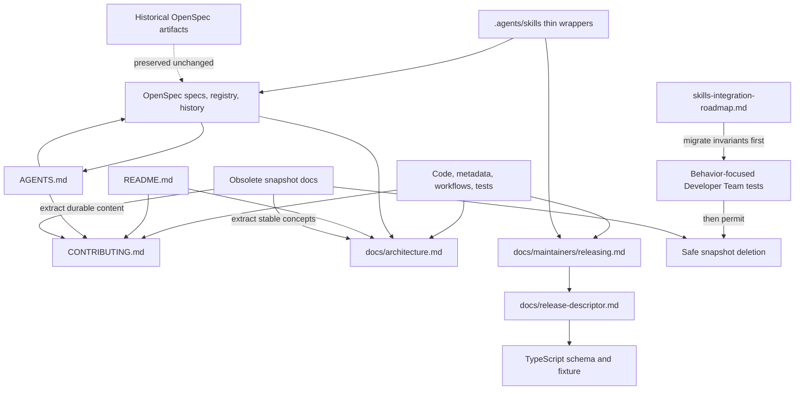

# Proposal: Streamline Project Documentation

## Intent

Deck's maintained documentation mixes user onboarding, contributor operations, runtime prompt inventories, dated audits, and historical roadmaps without clear audience or authority boundaries. Volatile facts are copied into prose, stale snapshots remain discoverable as current guidance, and two product tests depend on a historical document. This change will replace that fragmented surface with a small, durable documentation system for users, contributors, maintainers, and AI agents.

## Goal

Establish a concise documentation architecture with one maintained owner per concept, evidence-backed content, safe removal of obsolete documents, and focused checks that prevent critical links, commands, and generated boundaries from drifting.

## Scope

### In Scope

- Establish five maintained entry points:
  1. `README.md` — user overview, supported installation/use paths, first run, current command summary, and links.
  2. `CONTRIBUTING.md` — contributor setup, exact commands, scoped verification, OpenSpec workflow, and generated-file rules.
  3. `AGENTS.md` — compact AI-agent map, authority order, safety boundaries, and links; it will not duplicate phase prompts.
  4. `docs/architecture.md` — stable package boundaries and major control/materialization flows, not an implementation inventory.
  5. `docs/maintainers/releasing.md` — release procedure, root-version authority, descriptor workflow, verification, and rollback.
- Keep `CHANGELOG.md` as release history and retain `docs/release-descriptor.md` in place as a concise compatibility reference backed by the TypeScript schema and fixture.
- Define audience, authority, ownership, language, generated-file, and maintenance rules for every maintained document.
- Consolidate durable content from current docs, then remove obsolete snapshots only after consumers and invariants have migrated.
- Keep project-local skills supported under `.agents/skills/` as thin workflow entry points that delegate to canonical docs and source; shorten and correct both existing local skills in English.
- Decouple Developer Team tests from `docs/skills-integration-roadmap.md` without weakening Git-discard protection or selective no-op coverage.
- Add narrow validation for maintained local links, documented root commands/scripts, required entry points, canonical repository identity, and generated-output ownership/freshness where an existing generator already exists.
- Normalize maintained repository/release references and canonical fixtures to `kevin15011/deck`, except where a fixture intentionally tests arbitrary URL handling.

### Out of Scope

- Product runtime behavior, CLI command behavior, release automation behavior, package architecture, or public API changes.
- A documentation site, comprehensive generated portal, or generated Developer Team inventory.
- Editing generated skill bundles or build-info outputs by hand.
- Rewriting, relocating, or globally repairing historical `openspec/changes/**` or `openspec/archive/**` artifacts.
- General OpenSpec registry cleanup, `deck openspec validate` root discovery, `deck doctor` integration, CI-wide registry validation, or dead-code cleanup identified by `historical-cleanup-docs-release-hygiene`.
- Introducing `.atl/skill-registry.md`; no such registry exists.
- Creating live roadmaps, test-count baselines, machine-local tool inventories, or dated audit status inside durable docs.

## Audience and Authority Boundaries

| Surface | Primary audience | Role and authority boundary |
|---|---|---|
| `README.md` | Users | Entry point and supported happy path; links to deeper material and does not own volatile version or schema facts. |
| `CONTRIBUTING.md` | Contributors | Owns repository setup, available commands, verification, and change workflow. |
| `AGENTS.md` | AI agents | Navigational and safety-focused; points to official OpenSpec and source rather than mirroring runtime prompts. |
| `docs/architecture.md` | Contributors, maintainers, agents | Explains stable boundaries and flows; source remains authoritative for implementation details. |
| `docs/maintainers/releasing.md` | Maintainers | Owns the human release procedure, constrained by workflow/scripts and linked contracts. |
| `CHANGELOG.md` | Users, maintainers | Release history only; not a roadmap or operational manual. |
| `docs/release-descriptor.md` | Release producers/integrators | Concise explanatory contract; runtime schema and canonical fixture define accepted data. |
| `.agents/skills/**` | Project-local agents | Thin invocation/checklist wrappers; canonical procedure and policy live elsewhere. |
| `openspec/**` | SDD agents and maintainers | Official requirements, lifecycle state, provenance, and historical evidence; not general navigation. |

### Source-of-Truth Rules

- **Requirements and lifecycle:** promoted specs, active change artifacts, `state.yaml`, `events.yaml`, and `openspec/registry-schema.md` are authoritative.
- **Runtime behavior and volatile facts:** TypeScript source/types, tests, root `package.json`, release workflow/scripts, and generated outputs are authoritative for their respective facts.
- **Human procedures:** the maintained contributor/release documents own the readable procedure but must link to and remain consistent with executable sources.
- **Navigation and explanation:** README, AGENTS, and architecture docs summarize and link; they do not override requirements or code.
- **History:** `CHANGELOG.md`, archived OpenSpec artifacts, and Git history preserve historical context. Historical documents are not current operating instructions.
- **Maintenance:** link instead of duplicate; avoid line-number inventories, local absolute paths, live status, copied versions, and exhaustive rosters. Every maintained doc identifies its audience, authority class, and owner/source.

## Affected Capabilities

> This section is the contract between Proposal and Spec/Design phases.

### New Capabilities

- `project-documentation-governance`: Maintained documentation entry points, audience boundaries, source-of-truth rules, safe consolidation/removal, and drift checks.

### Modified Capabilities

- None.

### Unchanged Capabilities

- `artifact-state-contracts`: OpenSpec registry and artifact history remain authoritative and are not rewritten by this change.
- `adaptive-quality-control`: Runtime quality-control behavior is unaffected; documentation may link to its promoted requirements.
- `runner-orchestration-resilience`: Runtime orchestration behavior and prompt composition remain source-owned and unchanged.

## Approach

### Target Architecture

```text
README.md
CONTRIBUTING.md
AGENTS.md
CHANGELOG.md
docs/
  architecture.md
  maintainers/
    releasing.md
  release-descriptor.md
.agents/skills/
  deck-release-publish/SKILL.md
  openspec-retrospective-audit/SKILL.md
openspec/
  registry-schema.md
  specs/
  changes/
  archive/
```

`packages/core/src/skills/external/**` remains outside this documentation tree because its Markdown is distributable runtime input; `content.generated.ts` remains generated output.

### Safe Migration and Deletion Sequence

1. **Inventory active consumers:** identify current links, tests, scripts, and requirements that consume each candidate document. Treat historical OpenSpec references as provenance, not active consumers.
2. **Create the replacement entry points:** add CONTRIBUTING, AGENTS, architecture, and release guidance; rewrite README and repair CHANGELOG/release reference content from authoritative evidence.
3. **Move durable knowledge:** merge only stable concepts and canonical external links. Represent unresolved actionable technical debt as an existing or separately scoped OpenSpec change before deleting its dated audit source.
4. **Move invariants before prose:** update `git-safety.test.ts` and `no-op-skill-absence.test.ts` to assert canonical TypeScript/spec behavior. The Spec phase must explicitly supersede any current-policy interpretation of archived roadmap-location requirements while preserving the underlying safety behavior.
5. **Thin local skills:** retain project-local skill support, but replace duplicated commands/policy with triggers, safety gates, and links to canonical maintainer/OpenSpec guidance.
6. **Validate replacements:** run focused tests and documentation checks; confirm no maintained source or product test depends on a candidate snapshot.
7. **Remove snapshots:** delete obsolete general-doc files in the same implementation change only after their durable value and active consumers are migrated. Do not leave permanent compatibility stubs unless an active external consumer is proven.

### Historical OpenSpec Treatment

- Preserve all existing OpenSpec files and registry/event history byte-for-byte unless a normal future OpenSpec lifecycle action explicitly changes them.
- Do not mass-rewrite historical links when general docs are deleted; archived artifacts describe the repository state at their time. Git history remains the fallback for deleted snapshot prose.
- Exclude historical OpenSpec trees from maintained-navigation link checks while still validating registry artifact references under the existing registry contract.
- Do not delete promoted specs, active changes, archived changes, bundled skill inputs, or test fixtures merely because they are Markdown or historical.
- This change absorbs only the documentation/release-metadata portion identified by `historical-cleanup-docs-release-hygiene`; that exploration's registry-lifecycle and CLI/doctor recommendations remain separate work.

## Concrete File Impact

| Path | Proposed action | Dependency / boundary |
|---|---|---|
| `README.md` | Rewrite in English | Validate install/use claims and commands against source; remove copied current version and obsolete doc links. |
| `CONTRIBUTING.md` | Add | Use actual root scripts and distinguish focused checks from broad gates. |
| `AGENTS.md` | Add | Keep compact; no runtime prompt duplication and no claim that `.atl/skill-registry.md` exists. |
| `CHANGELOG.md` | Repair | Release history only; normalize canonical repository link. |
| `docs/architecture.md` | Add | Merge stable concepts only; link to source and OpenSpec. |
| `docs/maintainers/releasing.md` | Add | Derive procedure from `.github/workflows/release.yml` and release scripts. |
| `docs/release-descriptor.md` | Shorten/correct in place | Preserve current inbound path; code schema and canonical fixture remain authoritative. |
| `docs/tool-references.md` | Merge, then delete | Keep only durable configured/upstream references. |
| `docs/prompt-methodology-modules.md` | Merge, then delete | Replace manual inventory with architecture/source links; no generator in this change. |
| `docs/skills-integration-roadmap.md` | Delete after migration | Decouple tests and preserve safety/no-op invariants in canonical source/spec evidence first. |
| `docs/deuda-tecnica.md` | Delete after disposition | Link actionable unresolved items to existing/new OpenSpec changes; do not migrate status prose. |
| `docs/openspec-retrospective-audit-2026-06-12.md` | Delete after lineage check | Preserve historical value through OpenSpec references and Git history; do not keep as live docs. |
| `.agents/skills/deck-release-publish/SKILL.md` | Rewrite as thin English wrapper | Delegate procedure to maintainer guide; remove nonexistent commands and incorrect workspace-version policy. |
| `.agents/skills/openspec-retrospective-audit/SKILL.md` | Shorten in English | Keep supported local audit trigger/evidence policy; delegate registry details to OpenSpec authority. |
| `packages/core/src/teams/developer/git-safety.test.ts` | Update | Stop reading historical prose while preserving discard-protection assertions. |
| `packages/core/src/teams/developer/no-op-skill-absence.test.ts` | Update | Move rationale/coverage to canonical source/spec evidence. |
| `apps/cli/src/upgrade-command/__fixtures__/release-fixture.json` and related release fixtures | Normalize when semantically canonical | Use `kevin15011/deck`; retain arbitrary hosts only for explicit parser behavior tests. |
| Focused documentation validation test/script | Add in Design-selected existing test area | Check required docs, maintained local links, root-script references, identity, and generated boundaries without a new docs toolchain. |
| `openspec/changes/**`, `openspec/archive/**`, runtime prompt/source files | No product-content change | Reference as authority/history only. |

## Resolved Questions and Decisions

| Question | Decision | Evidence / rationale |
|---|---|---|
| Canonical repository identity | Use `kevin15011/deck`. | Git `origin`, `README.md`, runtime `GITHUB_OWNER`/`GITHUB_REPO`, release tests, and workflow `${{ github.repository }}` align with the active repository; `gentleman-programming/deck` occurrences are stale or legacy fixtures. |
| Release descriptor reference | Retain `docs/release-descriptor.md` at its current path, but make it concise. | It is linked by CHANGELOG and useful to release producers; TypeScript/Zod schema and fixture remain authoritative. Avoiding a move minimizes link churn. |
| Project-local skills | Continue supporting both current `.agents/skills/**` workflows as thin wrappers. | The retrospective skill is explicitly user-invocable/local-project and has produced repository follow-up evidence; the release workflow benefits from a local trigger but its current duplicated procedure is stale. No `.atl/skill-registry.md` is required. |
| Dated technical debt | Require actionable unresolved work to have an existing or new OpenSpec change before deleting the audit; do not move backlog status into architecture docs. | OpenSpec is the repository's official change context and avoids introducing another tracking authority. |
| Detailed Developer Team inventory | Use source navigation and stable architecture concepts; do not generate an inventory now. | The central content registry/tests already expose the roster and composition, while a generator would add disproportionate maintenance. |
| Historical OpenSpec links to deleted docs | Preserve artifacts unchanged and rely on Git history; do not keep live docs or rewrite archives solely for old links. | Historical artifacts are evidence, not current navigation. Active consumers must migrate before deletion. |

## Alternatives and Tradeoffs

| Alternative | Why Considered | Why Not Chosen |
|---|---|---|
| Refresh every existing document | Preserves familiar files and avoids deletion. | Retains overlapping authority, dated status, volatile copies, and recurring maintenance cost. |
| Generate a comprehensive docs portal/inventory | Could keep inventories fresh and searchable. | Adds a toolchain and generated surface disproportionate to this repository; curated intent would still be required. |
| Delete snapshots immediately | Fastest visible cleanup. | Risks losing the only active consumer/rationale and would break two known tests before migration. |
| Move all historical prose into OpenSpec archive | Keeps every file in the current tree. | Pollutes lifecycle artifacts with general snapshots and encourages treating history as current guidance; Git already preserves deleted prose. |

## Risks

| Risk | Likelihood | Mitigation |
|---|---|---|
| Useful rationale is removed with stale prose | Medium | Search active consumers, extract durable decisions/actionable work first, and delete only after migration evidence. |
| New docs duplicate or contradict runtime prompts | Medium | Keep AGENTS/architecture conceptual and link to content registry, source, tests, and promoted specs. |
| Roadmap deletion weakens Git safety/no-op coverage | Medium | Migrate tests and formal requirements before deletion; verify behavior-focused assertions remain. |
| Release instructions drift from executable workflow | Medium | Derive from workflow/scripts, use exact supported commands, and add focused command checks. |
| Historical links become unresolved | Medium | Define historical OpenSpec as excluded from live-navigation checks; retain Git history and avoid archive rewrites. |
| Local skill wrappers become another authority | Low | Restrict them to triggers, safety gates, and canonical links; no copied operational sequences. |
| Overlap with `historical-cleanup-docs-release-hygiene` causes conflicting work | Low | This change owns docs streamlining only; registry cleanup and CLI/doctor behavior remain explicitly excluded. |

## Rollback Plan

Implement the documentation migration as reviewable commits grouped by replacement, consumer migration, and deletion. If validation or user workflows regress, revert the affected commit with a new Git revert commit. Reintroduce any deleted document from the prior commit in a follow-up commit only as a temporary compatibility measure, while keeping migrated invariants and authoritative source links intact. Product runtime behavior is unchanged, so rollback is limited to documentation, focused checks, fixtures, and prose-coupled tests.

## Dependencies

- Spec must define the `project-documentation-governance` requirements and explicitly preserve the behavior behind historical roadmap-location requirements.
- Design must map documentation checks into the existing Bun/TypeScript test structure without creating a docs-site toolchain.
- Apply must coordinate with, but not modify, `historical-cleanup-docs-release-hygiene`; its non-documentation recommendations remain separate.
- Deletions depend on zero active maintained consumers after link/reference checks and on passing migrated Developer Team tests.

## Open Questions

None — repository evidence resolves the exploration questions, and remaining file-level mechanics belong to Spec and Design rather than blocking the proposal.

## Acceptance Direction

- [ ] The five maintained entry points exist, are non-empty English documents, state their audience/authority, and use progressive disclosure.
- [ ] README provides a verified user quick path without copied current-version claims; CONTRIBUTING owns exact supported repository commands.
- [ ] AGENTS is compact and navigational, points to official source/OpenSpec authority, and does not duplicate runtime phase prompts.
- [ ] Architecture and release guidance explain stable concepts/procedure while linking volatile facts to code, metadata, schema, workflow, and tests.
- [ ] Maintained repository/release references use `kevin15011/deck`; remaining alternatives are intentional test data or historical evidence.
- [ ] `docs/release-descriptor.md` remains available at its current path and is consistent with the runtime schema and canonical fixture.
- [ ] Project-local skills remain usable as thin English wrappers and contain no nonexistent commands or competing policy copies.
- [ ] Developer Team safety and no-op tests no longer read `docs/skills-integration-roadmap.md` and retain equivalent or stronger behavior-focused coverage.
- [ ] Candidate obsolete docs are removed only after active references, durable rationale, and actionable debt have been migrated.
- [ ] Focused checks pass for maintained local links, root-script references, required docs, canonical identity, and relevant generated boundaries.
- [ ] Existing OpenSpec change/archive artifacts and this change's Explorer provenance/event history remain intact.
- [ ] No product runtime behavior or generated output is manually changed.

## Next Steps

Ready for Spec (`deck-developer-spec`) and Design (`deck-developer-design`) in parallel.

## Mermaid Summary Source


