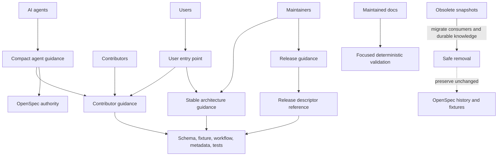

# Spec: Streamline Project Documentation

## Source

- Proposal: `streamline-project-documentation` proposal artifact
- Exploration: `streamline-project-documentation` exploration artifact
- Capabilities affected: `project-documentation-governance`
- Registry mode: deferred; this artifact does not update registry files.

## Requirements

### Capability: Audience Entry Points and README

REQ-ENTRY-001: The repository MUST provide non-empty, maintained English entry points for users, contributors, AI agents, architecture readers, and release maintainers. Each entry point MUST state its primary audience, authority class, and where to obtain deeper or more volatile information.
  Priority: MUST
  Surface: General
  Rationale: Clear entry points prevent one document from becoming an ambiguous, duplicated authority.

REQ-ENTRY-002: The user entry point MUST let a new user determine what Deck is, select a supported installation/use path, perform a first supported run, find a concise current command summary, and navigate to contributor, architecture, release, and OpenSpec material as applicable.
  Priority: MUST
  Surface: General
  Rationale: Users need a verified happy path without contributor or maintainer detail.

REQ-ENTRY-003: The user entry point MUST link to deeper maintained guidance rather than duplicate contributor procedures, release procedure, runtime schema details, or implementation inventories. It MUST NOT present a copied current product version, an exhaustive package tree, obsolete command claims, or current-state assertions that are not backed by an authoritative source.
  Priority: MUST
  Surface: General
  Rationale: Navigation is durable; duplicated volatile facts are not.

REQ-ENTRY-004: Maintained entry points SHOULD use progressive disclosure: the first visible section answers the audience's primary question and links to focused material for subsequent questions.
  Priority: SHOULD
  Surface: General
  Rationale: Readers should not have to parse operational detail to reach the appropriate source.

### Capability: Human Contributor and AI-Agent Guidance

REQ-GUIDE-001: Contributor guidance MUST own the readable procedure for repository setup, supported root commands, scoped verification, contribution/OpenSpec workflow, and generated-file rules. Each documented executable command MUST be valid in the repository's documented context.
  Priority: MUST
  Surface: General
  Rationale: Contributors require a single operational starting point grounded in executable evidence.

REQ-GUIDE-002: AI-agent guidance MUST be compact, navigational, and safety-focused. It MUST identify the source-of-truth hierarchy, generated-file boundaries, OpenSpec authority, and Git-discard safety boundary, and MUST link to the canonical human or source authority for detailed procedures.
  Priority: MUST
  Surface: General
  Rationale: Agents need reliable session-start context without another competing procedure manual.

REQ-GUIDE-003: AI-agent guidance and project-local agent skills MUST NOT reproduce runtime phase prompts, a complete Developer Team/content inventory, or a competing OpenSpec registry policy. They MUST NOT claim that an absent project-local skill registry exists.
  Priority: MUST
  Surface: General
  Rationale: Runtime content and registry contracts are source-owned and change independently of navigation guidance.

REQ-GUIDE-004: Required Git-discard protection and selective no-op behavior MUST remain covered by behavior-focused canonical source, tests, or promoted requirements after historical roadmap prose is no longer consumed. Historical document location MUST NOT be the sole authority for either invariant.
  Priority: MUST
  Surface: General
  Rationale: Removing obsolete prose must not weaken safety or no-op guarantees.

### Capability: Stable Architecture, Releases, and Local Skills

REQ-OPS-001: Architecture guidance MUST describe stable package boundaries and major control or materialization flows at a conceptual level. It MUST identify source authority for implementation detail and MUST NOT become an exhaustive implementation, prompt, tool, or line-number inventory.
  Priority: MUST
  Surface: General
  Rationale: Architecture documentation must remain useful despite routine source changes.

REQ-OPS-002: Release guidance MUST provide the human release procedure, root-version authority, release-descriptor workflow, verification expectations, and rollback direction. It MUST remain consistent with the applicable executable workflow, scripts, metadata, schema, and tests, which remain authoritative for volatile facts.
  Priority: MUST
  Surface: General
  Rationale: Release work needs an actionable human procedure without replacing executable contracts.

REQ-OPS-003: The release-descriptor reference MUST remain available at its established inbound path as a concise explanatory compatibility reference. It MUST identify the runtime schema and canonical fixture as authoritative and MUST NOT duplicate the complete enforced schema or retain broken lifecycle links.
  Priority: MUST
  Surface: General
  Rationale: Existing consumers retain a stable explanation while acceptance rules stay source-owned.

REQ-OPS-004: Supported project-local skills MUST be English thin workflow entry points: they MAY contain trigger conditions, safety gates, and concise checklists, but MUST delegate detailed release or registry procedure to canonical maintained guidance and MUST NOT prescribe nonexistent commands or incorrect versioning policy.
  Priority: MUST
  Surface: General
  Rationale: Local skills remain discoverable without becoming stale operational authorities.

### Capability: Source Authority, Maintenance, and Generated Boundaries

REQ-GOV-001: Maintained documentation MUST apply this authority hierarchy: promoted/active OpenSpec artifacts and registry records own requirements and lifecycle; source, types, tests, metadata, workflows, scripts, and generated outputs own runtime and volatile facts; maintained human procedures own readable procedure while remaining consistent with executable sources; navigation/explanation documents do not override either; changelog, archived OpenSpec artifacts, and Git history own historical context.
  Priority: MUST
  Surface: General
  Rationale: A documented hierarchy resolves conflicts without duplicating facts.

REQ-GOV-002: Every maintained document MUST identify its audience, authority class, and owner or authoritative source. A maintained document MUST link to canonical material instead of duplicating information owned elsewhere.
  Priority: MUST
  Surface: General
  Rationale: Readers must be able to determine whether prose is normative, explanatory, generated, or historical.

REQ-GOV-003: Durable maintained documentation MUST NOT include live test counts, copied version values, source-line inventories, machine-local absolute paths, dated audit status, current baseline claims, exhaustive dynamic rosters, or active roadmap status. Such facts MUST be linked to their authoritative source when relevant.
  Priority: MUST
  Surface: General
  Rationale: Snapshot facts drift and obscure ownership.

REQ-GOV-004: Documentation MUST distinguish handwritten maintained documentation, runtime bundled Markdown input, generated output, test fixtures, and OpenSpec history. Generated outputs and build-information outputs MUST NOT be manually edited; where an existing generator owns an output, freshness MUST be established through that generator or its existing verification contract.
  Priority: MUST
  Surface: General
  Rationale: Ownership boundaries prevent manual edits from being overwritten or drifting from inputs.

REQ-GOV-005: The documentation system MUST NOT introduce a documentation-site generator, a comprehensive generated documentation portal, a generated Developer Team inventory, or a new competing documentation authority.
  Priority: MUST
  Surface: General
  Rationale: The approved scope favors a curated, low-maintenance system.

### Capability: Repository Identity and Release References

REQ-ID-001: Maintained repository and release references MUST use `kevin15011/deck` as the canonical repository identity.
  Priority: MUST
  Surface: General
  Rationale: Maintained links and release references require one consistent repository identity.

REQ-ID-002: A non-canonical repository identity or arbitrary URL MAY remain only in an explicit parser/URL-handling fixture or preserved historical evidence whose purpose requires it. It MUST NOT be presented as a current maintained repository or release reference.
  Priority: MUST
  Surface: General
  Rationale: Fixtures and history can deliberately represent non-production data without misleading readers.

REQ-ID-003: The changelog MUST be limited to release history and MUST NOT act as a roadmap, operational manual, or duplicate release procedure.
  Priority: MUST
  Surface: General
  Rationale: Release history has a separate audience and lifecycle from operational guidance.

### Capability: Safe Consolidation, Deletion, and OpenSpec Preservation

REQ-MIGRATE-001: Before an obsolete general-documentation snapshot is removed, maintainers MUST identify its active maintained consumers; migrate durable knowledge to its designated owner; and record or preserve unresolved actionable work in an existing or separately scoped OpenSpec change. A candidate with an active maintained consumer or unresolved undispositioned work MUST NOT be removed.
  Priority: MUST
  Surface: General
  Rationale: Consolidation must retain active obligations and actionable knowledge.

REQ-MIGRATE-002: Before the historical skills roadmap is removed, its Git-discard and selective no-op invariants MUST be migrated to canonical evidence, and product tests MUST no longer read that roadmap. The migrated coverage MUST be equivalent or stronger from externally observable behavior.
  Priority: MUST
  Surface: General
  Rationale: Known prose-coupled tests must be decoupled before deletion.

REQ-MIGRATE-003: Existing OpenSpec change/archive artifacts, promoted specs, registry/event history, bundled skill inputs, and test fixtures MUST be preserved and MUST NOT be deleted, relocated, mass-rewritten, or treated as obsolete general documentation merely because they are Markdown or historical.
  Priority: MUST
  Surface: General
  Rationale: These surfaces are official evidence, product input, or intentional test data.

REQ-MIGRATE-004: Maintained-navigation validation MAY exclude historical OpenSpec change/archive prose links, but existing registry artifact-reference validation MUST continue under the registry contract. Historical artifacts remain evidence of their time; Git history is the fallback for removed snapshot prose.
  Priority: MUST
  Surface: General
  Rationale: Current navigation checks must not rewrite or invalidate historical provenance.

REQ-MIGRATE-005: Permanent compatibility stubs for removed snapshots MUST NOT be retained unless an active external consumer is demonstrated. A temporary restoration MAY be used only as a rollback compatibility measure while the consumer is migrated.
  Priority: MUST
  Surface: General
  Rationale: Stubs perpetuate duplicate authority unless a real compatibility need exists.

### Capability: Documentation Validation and Low-Maintenance Operation

REQ-VALIDATE-001: Focused documentation validation MUST verify that required maintained entry points exist and are non-empty; maintained local Markdown links resolve; documented root commands/scripts are supported; maintained identity references are canonical; and relevant existing generated-output ownership/freshness boundaries are respected.
  Priority: MUST
  Surface: Integration
  Rationale: Narrow automation catches critical drift without creating a documentation platform.

REQ-VALIDATE-002: A validation failure for a required entry point, maintained local link, documented command/script, canonical maintained identity, or required generated boundary MUST identify the invalid reference or missing artifact and fail the focused documentation check.
  Priority: MUST
  Surface: Integration
  Rationale: Failures must be actionable and must prevent silent documentation drift.

REQ-VALIDATE-003: Validation MUST NOT require network access, documentation-site generation, machine-specific paths, live test-count assertions, historical prose sentence matching, or comprehensive source inventory comparison.
  Priority: MUST
  Surface: Integration
  Rationale: The verification boundary must remain deterministic and low-maintenance.

REQ-VALIDATE-004: Documentation claims about commands, schema, repository identity, generated ownership, or runtime behavior MUST be validated against their designated authority before being treated as maintained guidance. If evidence conflicts, the maintained document MUST defer to the designated authority rather than introduce a contradictory claim.
  Priority: MUST
  Surface: General
  Rationale: Evidence-backed content prevents prose from superseding code or official requirements.

### Capability: Documentation Language Policy

REQ-LANG-001: All maintained project documentation, local skills, and generated OpenSpec artifacts for this change MUST be written in English. Literal non-English text MAY appear only when externally necessary, including quoted user-provided text, identifiers, paths, brands, domain terms, or exact external messages.
  Priority: MUST
  Surface: General
  Rationale: A single maintained language makes shared documentation and agent context accessible and consistent.

REQ-LANG-002: Historical evidence MAY retain its original language and wording. It MUST NOT be converted solely to satisfy the maintained documentation language policy.
  Priority: MUST
  Surface: General
  Rationale: Preservation of historical OpenSpec and evidence takes precedence over normalization.

## Acceptance Scenarios

### Capability: Audience Entry Points and README

#### Scenario: Each audience can enter through its owned document
**Given** a reader is a user, contributor, AI agent, architecture reader, or release maintainer
**When** the reader opens the corresponding maintained entry point
**Then** it is non-empty, in English, identifies its audience and authority class, answers that audience's primary question, and points to deeper authoritative material.
> Covers: REQ-ENTRY-001, REQ-ENTRY-004, REQ-LANG-001

#### Scenario: A user follows the supported quick path
**Given** a user begins at the repository user entry point
**When** the user seeks installation, first run, or command information
**Then** the user can locate a supported path and concise current command summary, and can navigate to deeper contributor, architecture, release, or OpenSpec guidance without those procedures being copied into the user entry point.
> Covers: REQ-ENTRY-002, REQ-ENTRY-003

#### Scenario: A volatile README claim is proposed
**Given** a proposed user-entry-point edit contains a current version, exhaustive package inventory, or unsupported command
**When** the maintained documentation is reviewed or validated against its authority
**Then** the unsupported or duplicated claim is rejected or replaced with a link to the authoritative source.
> Covers: REQ-ENTRY-003, REQ-VALIDATE-004

### Capability: Human Contributor and AI-Agent Guidance

#### Scenario: A contributor selects a repository command
**Given** a contributor needs setup, a root command, scoped verification, or OpenSpec workflow guidance
**When** the contributor follows the contributor guide
**Then** the guide supplies the readable procedure and only documents commands supported in the documented repository context.
> Covers: REQ-GUIDE-001

#### Scenario: An agent starts work safely
**Given** an AI agent starts work in the repository
**When** the agent consults agent guidance
**Then** it can identify authority order, generated-file boundaries, OpenSpec authority, and Git-discard safety constraints, and it is directed to canonical guidance for detailed procedures.
> Covers: REQ-GUIDE-002

#### Scenario: Agent guidance is kept compact and non-duplicative
**Given** agent guidance or a local skill is reviewed
**When** it contains runtime phase prompts, a complete dynamic team roster, a copied registry policy, or a reference to an absent skill registry
**Then** that content is absent from the maintained guidance or replaced with a canonical link.
> Covers: REQ-GUIDE-003

#### Scenario: Roadmap deletion preserves behavioral invariants
**Given** the historical skills roadmap is a removal candidate
**When** removal is evaluated
**Then** Git-discard protection and selective no-op behavior have canonical behavior-focused coverage, and product tests no longer consume the roadmap document.
> Covers: REQ-GUIDE-004, REQ-MIGRATE-002

### Capability: Stable Architecture, Releases, and Local Skills

#### Scenario: Architecture readers seek stable orientation
**Given** a contributor, maintainer, or agent needs to understand the repository shape
**When** they read architecture guidance
**Then** they can identify stable package boundaries and major control/materialization flows and are directed to source for implementation detail, without an exhaustive inventory or source-line roster.
> Covers: REQ-OPS-001, REQ-GOV-003

#### Scenario: A maintainer follows the release procedure
**Given** a release maintainer needs to prepare, verify, roll back, or understand descriptor handling for a release
**When** the maintainer follows release guidance
**Then** the procedure identifies root-version authority, descriptor workflow, verification, and rollback direction and does not conflict with executable release authorities.
> Covers: REQ-OPS-002, REQ-VALIDATE-004

#### Scenario: A release descriptor reader follows a stable inbound reference
**Given** a release producer or integrator opens the established release-descriptor reference
**When** the reader needs accepted descriptor data
**Then** the reference remains available, concise, free of broken lifecycle links, and directs the reader to the authoritative schema and canonical fixture.
> Covers: REQ-OPS-003

#### Scenario: A project-local release or audit skill is invoked
**Given** a supported local skill is invoked
**When** it provides workflow direction
**Then** it is English, contains only a concise trigger/safety/checklist layer, and delegates detailed procedure to maintained release or OpenSpec guidance without nonexistent commands or competing policy.
> Covers: REQ-OPS-004, REQ-LANG-001

### Capability: Source Authority, Maintenance, and Generated Boundaries

#### Scenario: Two sources appear to disagree
**Given** explanatory documentation conflicts with an applicable OpenSpec artifact, source, metadata, workflow, script, schema, test, or generated output
**When** a maintainer resolves the claim
**Then** the designated authority prevails, the maintained prose is corrected or linked, and no navigation document overrides requirements or runtime facts.
> Covers: REQ-GOV-001, REQ-VALIDATE-004

#### Scenario: A maintained document is reviewed for ownership
**Given** a document is presented as maintained guidance
**When** it is reviewed
**Then** it states its audience, authority class, and owner or authoritative source, and links rather than duplicates information owned elsewhere.
> Covers: REQ-GOV-002

#### Scenario: A snapshot fact is added to durable guidance
**Given** an edit adds a live count, copied version, local absolute path, dated status, source-line inventory, dynamic roster, or roadmap status to maintained guidance
**When** the edit is evaluated
**Then** the snapshot fact is removed or replaced by an appropriate authority link.
> Covers: REQ-GOV-003

#### Scenario: An owned generated output needs a change
**Given** a requested documentation change affects a runtime bundled input or generator-owned output
**When** the change is prepared
**Then** the documentation distinguishes product input from generated output, leaves generated output unedited by hand, and establishes freshness using the existing generator or verification contract where applicable.
> Covers: REQ-GOV-004

#### Scenario: A documentation automation expansion is proposed
**Given** a proposal introduces a documentation site, comprehensive generated portal, or generated Developer Team inventory
**When** it is evaluated under this change
**Then** it is rejected as out of scope unless separately approved through a new change.
> Covers: REQ-GOV-005

### Capability: Repository Identity and Release References

#### Scenario: A maintained repository reference is published
**Given** a maintained document, local skill, release reference, or canonical fixture needs the repository identity
**When** the reference is added or reviewed
**Then** it uses `kevin15011/deck`.
> Covers: REQ-ID-001

#### Scenario: Non-canonical identity is intentional data or history
**Given** a non-canonical repository identity remains in a fixture or historical artifact
**When** it is reviewed
**Then** its fixture/parser purpose or historical-evidence status is explicit, and it is not portrayed as the current maintained repository identity.
> Covers: REQ-ID-002

#### Scenario: A reader opens the changelog
**Given** a user or maintainer opens the changelog
**When** they seek current operational instructions or roadmap status
**Then** the changelog directs them to maintained operational guidance rather than duplicating that material.
> Covers: REQ-ID-003

### Capability: Safe Consolidation, Deletion, and OpenSpec Preservation

#### Scenario: An obsolete snapshot is eligible for removal
**Given** a general-documentation snapshot has been identified as obsolete
**When** removal is considered
**Then** active maintained consumers have been identified and migrated, durable knowledge has moved to its designated owner, and unresolved actionable work is represented in an existing or separately scoped OpenSpec change before removal proceeds.
> Covers: REQ-MIGRATE-001

#### Scenario: A removal candidate still has a dependency
**Given** a snapshot has an active maintained consumer or an unresolved actionable item without OpenSpec disposition
**When** removal is attempted
**Then** removal is blocked until the dependency is migrated or dispositioned.
> Covers: REQ-MIGRATE-001

#### Scenario: Historical OpenSpec is encountered during cleanup
**Given** a cleanup encounters a promoted spec, active/archived change artifact, registry/event record, bundled skill input, or test fixture
**When** its Markdown or historical nature is assessed
**Then** it is preserved unchanged and is not deleted, relocated, or mass-rewritten as general documentation cleanup.
> Covers: REQ-MIGRATE-003

#### Scenario: A historical artifact links to a removed snapshot
**Given** a historical OpenSpec artifact contains a link that was valid at the time it was authored but later points to a removed snapshot
**When** maintained navigation is validated
**Then** the historical prose link does not require archive rewriting, while registry artifact references continue to be validated under the registry contract and Git history remains available for the deleted prose.
> Covers: REQ-MIGRATE-004

#### Scenario: A compatibility stub is requested
**Given** a removed snapshot path is requested to remain as a permanent stub
**When** no active external consumer is demonstrated
**Then** the stub is not retained; a temporary restoration is permitted only for rollback while a demonstrated consumer is migrated.
> Covers: REQ-MIGRATE-005

### Capability: Documentation Validation and Low-Maintenance Operation

#### Scenario: Focused documentation validation succeeds
**Given** the maintained documentation system is complete and consistent
**When** focused documentation validation runs in its documented local context
**Then** required entry points are non-empty, maintained local links resolve, documented root commands/scripts are supported, maintained identity references are canonical, and applicable existing generated boundaries are respected.
> Covers: REQ-VALIDATE-001

#### Scenario: Focused documentation validation finds drift
**Given** a required document is missing, a maintained local link is unresolved, a documented command is unsupported, a maintained identity is non-canonical, or a required generated boundary is violated
**When** focused documentation validation runs
**Then** it fails and identifies the missing artifact or invalid reference.
> Covers: REQ-VALIDATE-002

#### Scenario: Validation remains narrow and deterministic
**Given** focused documentation validation runs
**When** it evaluates maintained documentation
**Then** it does not require network access, site generation, machine-local paths, live count assertions, historical prose sentence matching, or exhaustive source inventory comparison.
> Covers: REQ-VALIDATE-003

### Capability: Documentation Language Policy

#### Scenario: Maintained documentation is authored
**Given** a maintained project document, local skill, or OpenSpec artifact for this change is added or rewritten
**When** its prose is reviewed
**Then** it is English except for literal non-English text that is externally necessary.
> Covers: REQ-LANG-001

#### Scenario: Historical evidence uses another language
**Given** preserved historical evidence contains non-English text
**When** the maintained language policy is applied
**Then** the historical evidence remains unchanged and is not translated solely for policy normalization.
> Covers: REQ-LANG-002, REQ-MIGRATE-003

## Validation Rules

| Input / Surface | Rule | Failure outcome | REQ-ID |
|---|---|---|---|
| Required maintained entry point | Exists, is non-empty, English, and declares audience/authority/owner-source. | Focused documentation validation identifies the missing or incomplete entry point. | REQ-ENTRY-001, REQ-GOV-002, REQ-LANG-001, REQ-VALIDATE-001 |
| Maintained local Markdown link | Resolves to its maintained local target; historical OpenSpec prose links are excluded. | Validation identifies the unresolved source reference. | REQ-MIGRATE-004, REQ-VALIDATE-001, REQ-VALIDATE-002 |
| Documented root command/script | Is supported by the designated executable authority in its documented context. | Validation identifies the unsupported command/script reference. | REQ-GUIDE-001, REQ-VALIDATE-002 |
| Maintained repository/release reference | Uses `kevin15011/deck`, except intentional fixture or history data. | Validation identifies the non-canonical maintained reference. | REQ-ID-001, REQ-ID-002, REQ-VALIDATE-002 |
| Generated boundary | Identifies manual input versus generated output and does not manually modify generator-owned output. | Validation identifies the boundary violation or stale output under an existing ownership contract. | REQ-GOV-004, REQ-VALIDATE-001 |
| Snapshot removal | Has no active maintained consumer; durable knowledge migrated; unresolved work has OpenSpec disposition. | Removal is blocked and the unmet precondition is identified. | REQ-MIGRATE-001 |

## Error Contracts

| Condition | Error Code | Message | Status |
|---|---|---|---|
| Required entry point missing or empty | `DOC_REQUIRED_ENTRY_POINT_INVALID` | Identify the required entry point that is missing or empty. | Focused check fails |
| Maintained local link unresolved | `DOC_LINK_UNRESOLVED` | Identify the source document and unresolved local target. | Focused check fails |
| Documented command/script unsupported | `DOC_COMMAND_UNSUPPORTED` | Identify the documented command/script and its authoritative command source. | Focused check fails |
| Maintained identity non-canonical | `DOC_IDENTITY_NONCANONICAL` | Identify the maintained reference that must use `kevin15011/deck`. | Focused check fails |
| Generated boundary violated | `DOC_GENERATED_BOUNDARY_VIOLATED` | Identify the generated output and its authoritative input/generation contract. | Focused check fails |
| Snapshot removal precondition unmet | `DOC_REMOVAL_BLOCKED` | Identify the active consumer, unmigrated durable content, or undispositioned actionable item. | Removal blocked |

## Acceptance Evidence

| Evidence | Demonstrates |
|---|---|
| Review of the maintained entry points and their first sections | Audience, authority, ownership, English language, and progressive-disclosure requirements. |
| Focused documentation validation output | Required entry points, local links, documented commands, identity, and generated-boundary checks. |
| Executable source/metadata/workflow/schema/fixture references cited by maintained docs | Consistency with volatile and runtime authorities. |
| Focused behavior tests for Git-discard safety and selective no-op behavior | Preservation of invariants after roadmap decoupling. |
| Active-consumer/reference review for each removal candidate | Safe consolidation, actionable-work disposition, and absence of prohibited dependencies. |
| Registry and artifact comparison | Preservation of existing OpenSpec history and registry references. |

## Open Questions

None — the proposal resolves policy-level questions. File-level implementation and test placement remain Design decisions.

## Compliance Matrix

| REQ-ID | Scenario(s) | Status |
|---|---|---|
| REQ-ENTRY-001–004 | Each audience can enter; user quick path; volatile README claim | Defined |
| REQ-GUIDE-001–004 | Contributor command; agent starts safely; compact guidance; roadmap deletion | Defined |
| REQ-OPS-001–004 | Architecture orientation; release procedure; descriptor reference; local skill | Defined |
| REQ-GOV-001–005 | Source conflict; ownership review; snapshot fact; generated output; automation expansion | Defined |
| REQ-ID-001–003 | Maintained reference; intentional identity; changelog | Defined |
| REQ-MIGRATE-001–005 | Eligible/blocked removal; historical OpenSpec; historic link; compatibility stub | Defined |
| REQ-VALIDATE-001–004 | Validation succeeds; validation finds drift; deterministic validation; volatile README claim/source conflict | Defined |
| REQ-LANG-001–002 | Maintained authoring; historical-language evidence | Defined |

## Mermaid Summary Source

