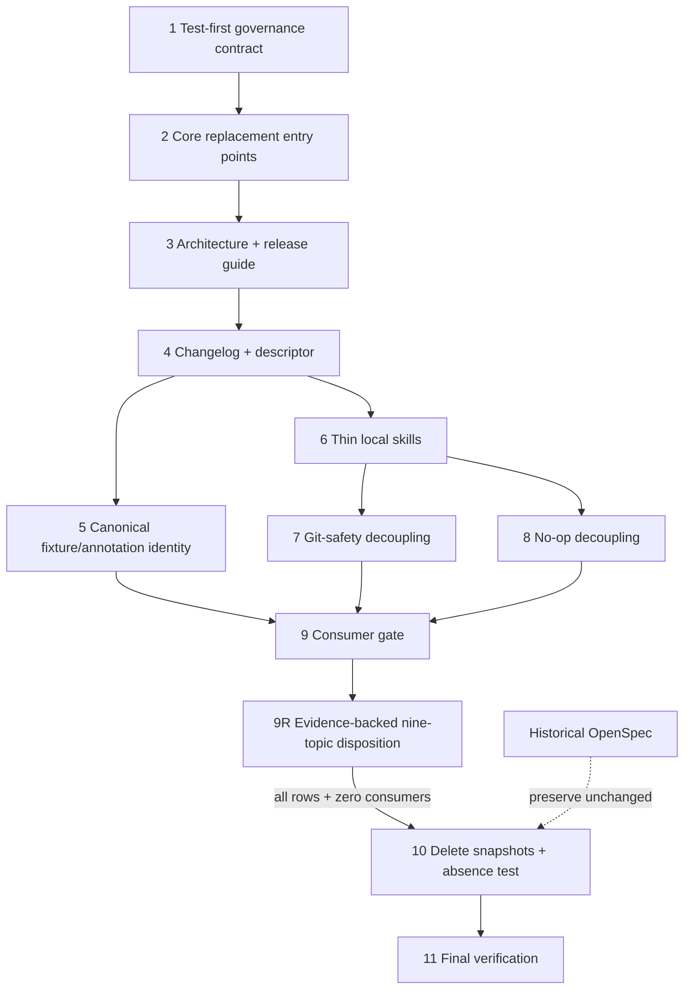

# Tasks: Streamline Project Documentation

## Source

- Proposal: `streamline-project-documentation` proposal artifact
- Spec: `streamline-project-documentation` spec artifact
- Design: `streamline-project-documentation` design artifact
- Exploration: `streamline-project-documentation` exploration artifact
- Capability affected: `project-documentation-governance`
- Implementation boundary: handwritten documentation, narrow Bun tests, intentional fixture/comment corrections, and snapshot deletion only. Runtime behavior, generated outputs, and historical OpenSpec trees remain unchanged.

## Execution Groups and Dependencies

| Group | Tasks | Entry condition | Exit / dependency delivered | Parallelism |
|---|---:|---|---|---|
| A. Contract-first replacement entry points | 1–2 | None | A focused, initially red governance test and the three primary entry points it validates | Sequential: Task 2 turns Task 1 green for its covered surface. |
| B. Release, reference, local-skill, and identity migration | 3–6 | Task 2 | Complete maintained navigation and canonical release references | Task 5 and Task 6 may run in parallel after Task 4 only in isolated worktrees; otherwise keep the single General owner sequential. |
| C. Historical-roadmap test decoupling | 7–8 | Task 6 | Behavior-focused tests that no longer consume roadmap prose | Tasks 7 and 8 can run in parallel; they have no shared files. |
| D. Consumer proof and deletion | 9, 9R, 10 | Tasks 1–8 | Evidence of no live consumers, an evidence-backed disposition for every extracted debt topic, and removal of all five snapshots | Strictly sequential; Task 10 is blocked until Task 9R passes. |
| E. Closure verification | 11 | Task 10 | Focused, generator, release, type, and baseline-aware repository evidence | Sequential final gate. |

**Hidden coupling:** Task 1's allowlist is the contract for Tasks 2–6 and must not crawl historical OpenSpec prose. Task 9 must inspect maintained docs, tests, scripts, wrappers, and fixtures, but it must classify `openspec/changes/**` and `openspec/archive/**` hits as preserved provenance rather than deletion blockers. Task 9R records the debt dispositions inside this already approved change's `apply-progress.md`; it is evidence for deletion, not a new permanent backlog or a replacement for a future change when implementation is needed. Task 10 must change the deletion assertion in the same commit as removing snapshots; otherwise the governance contract would temporarily describe the wrong target tree.

## Atomic Tasks with Owner Recommendation

### Group A — Contract-first replacement entry points

#### Task 1: Add the focused documentation-governance test first
**Owner**: General Apply
**Priority**: P0
**Complexity**: Medium
**Readiness**: unblocked
**Parallel**: No — Task 2 must satisfy this test's initially failing entry-point expectations.
**Depends on**: none

**Description**
Create `tests/documentation-governance.test.ts` using `bun:test` and built-ins only. Start test-first: explicitly allowlist the seven maintained documents and two local skill wrappers; validate non-empty role blocks, maintained relative links, documented root-script/direct-path commands, canonical identity on maintained surfaces and the three named canonical release fixtures, and generated-output ownership markers. Do not crawl historical OpenSpec prose, fetch the network, run documented commands, regenerate output, or assert snapshot absence until Task 10.

**Files**
- `tests/documentation-governance.test.ts` — create
- `packages/core/src/skills/external/content.generated.ts` — unchanged; marker-only inspection
- `apps/cli/src/runtime/build-info.generated.ts` — unchanged; marker-only inspection

**Requirement Mapping**: REQ-ENTRY-001; REQ-GUIDE-001; REQ-GOV-002, REQ-GOV-004–005; REQ-ID-001–002; REQ-MIGRATE-004; REQ-VALIDATE-001–003; REQ-LANG-001.

**Verification**
- TDD red checkpoint: `bun test tests/documentation-governance.test.ts` fails specifically for missing/incomplete replacement surfaces, not for parser crashes.
- Test cases name the source file and invalid link, command, identity, or generated boundary on failure.
- Confirm the test does not write or regenerate either generated TypeScript output.

#### Task 2: Create the user, contributor, and AI-agent replacement entry points
**Owner**: General Apply
**Priority**: P0
**Complexity**: High
**Readiness**: unblocked
**Parallel**: No — completes the first green slice of Task 1 and establishes canonical navigation for later documents.
**Depends on**: Task 1

**Description**
Rewrite `README.md` as the concise English user path; add `CONTRIBUTING.md` as the executable contributor procedure; and add compact `AGENTS.md` as the authority/safety map. Give each its visible Audience/Authority/Maintainer/Evidence role block, progressive disclosure, authoritative links, and generated-file boundaries; do not copy versions, phase prompts, dynamic inventories, machine-local paths, absent `.atl/skill-registry.md`, or unsupported commands.

**Files**
- `README.md` — modify
- `CONTRIBUTING.md` — create
- `AGENTS.md` — create
- `package.json` — unchanged; authoritative root-script source
- `openspec/config.yaml` — unchanged; authoritative OpenSpec configuration link target
- `openspec/registry-schema.md` — unchanged; authoritative registry link target

**Requirement Mapping**: REQ-ENTRY-001–004; REQ-GUIDE-001–003; REQ-GOV-001–005; REQ-VALIDATE-004; REQ-LANG-001.

**Verification**
- TDD green checkpoint: `bun test tests/documentation-governance.test.ts` passes for the entry-point, role-block, local-link, and command assertions covered so far.
- Manually render the first section of each file: README answers first use, CONTRIBUTING answers safe contribution, and AGENTS identifies authority and Git-discard protection without duplicating detailed procedure.
- Compare every command claim to `package.json` or an explicitly linked direct executable; use `bun test tests/documentation-governance.test.ts` as the automated command-reference check.

### Group B — Release, reference, local-skill, and identity migration

#### Task 3: Add stable architecture and maintainer release guidance
**Owner**: General Apply
**Priority**: P0
**Complexity**: Medium
**Readiness**: unblocked
**Parallel**: No — release and descriptor navigation in later tasks should point to established documents.
**Depends on**: Task 2

**Description**
Create English, role-blocked `docs/architecture.md` and `docs/maintainers/releasing.md`. Keep architecture conceptual (package boundaries and control/materialization flows) and release guidance human-facing (root-version authority, descriptor flow, verification, explicit tag/push confirmation gates, and rollback); link volatile details to source, workflow, scripts, schema, and tests rather than reproducing them.

**Files**
- `docs/architecture.md` — create
- `docs/maintainers/releasing.md` — create
- `.github/workflows/release.yml` — unchanged; executable authority
- `scripts/prepare-release.ts` — unchanged in this task; executable authority
- `scripts/generate-build-info.ts` — unchanged; generated-output authority

**Requirement Mapping**: REQ-ENTRY-001, REQ-ENTRY-004; REQ-OPS-001–002; REQ-GOV-001–005; REQ-VALIDATE-004; REQ-LANG-001.

**Verification**
- `bun test tests/documentation-governance.test.ts`
- Manual authority review against `.github/workflows/release.yml`, root `package.json`, `scripts/prepare-release.ts`, and `scripts/generate-build-info.ts`; ensure no automatic push/tag instruction bypasses confirmation.

#### Task 4: Repair the changelog and retained release-descriptor reference
**Owner**: General Apply
**Priority**: P0
**Complexity**: Medium
**Readiness**: unblocked
**Parallel**: No — depends on the release guide and must provide stable links to it and the descriptor authorities.
**Depends on**: Task 3

**Description**
Keep `CHANGELOG.md` limited to release history and point current operational questions to maintained guidance. Shorten and correct `docs/release-descriptor.md` in place as the stable inbound compatibility reference, linking to the runtime schema, canonical fixture, release preparation, workflow, and archived `add-self-update-system` specification without duplicating the enforced schema or broken lifecycle paths.

**Files**
- `CHANGELOG.md` — modify
- `docs/release-descriptor.md` — modify
- `apps/cli/src/upgrade-command/release-descriptor.ts` — unchanged; schema authority link target
- `apps/cli/src/upgrade-command/__fixtures__/release-fixture.json` — unchanged in this task; canonical example link target
- `openspec/archive/add-self-update-system/spec.md` — unchanged; historical specification link target

**Requirement Mapping**: REQ-OPS-002–003; REQ-GOV-001–003; REQ-ID-001, REQ-ID-003; REQ-VALIDATE-001, REQ-VALIDATE-004; REQ-LANG-001.

**Verification**
- `bun test tests/documentation-governance.test.ts`
- Manually confirm the descriptor path remains `docs/release-descriptor.md`, its local links resolve, and CHANGELOG contains neither a release procedure nor roadmap status.

#### Task 5: Normalize stale release authority annotations and canonical fixture identities
**Owner**: General Apply
**Priority**: P1
**Complexity**: High
**Readiness**: unblocked
**Parallel**: Yes — no shared files with Task 6; use separate worktrees if running concurrently.
**Depends on**: Task 4

**Description**
Correct stale specification/help comments to the archived official specification and normalize the three explicitly canonical release fixtures to `kevin15011/deck`. Preserve runtime behavior and arbitrary-host/file-URL parser fixtures; do not perform a global repository-identity replacement.

**Files**
- `apps/cli/src/upgrade-command/release-descriptor.ts` — modify comments/authority path only
- `apps/cli/src/upgrade-command/__tests__/release-descriptor.test.ts` — modify comments/authority path only
- `scripts/prepare-release.ts` — modify source/help authority path only
- `scripts/prepare-release.test.ts` — modify comments/authority path only
- `apps/cli/src/upgrade-command/__fixtures__/release-fixture.json` — normalize canonical Deck URLs
- `apps/cli/src/upgrade-command/__tests__/fixtures/release-fixture-no-upgrade.json` — normalize canonical release-notes identity only
- `apps/cli/src/upgrade-command/__tests__/fixtures/release-fixture-upgrade.json` — normalize canonical release-notes identity only
- `openspec/archive/add-self-update-system/spec.md` — unchanged; corrected target

**Requirement Mapping**: REQ-OPS-003; REQ-ID-001–002; REQ-GOV-001, REQ-GOV-004; REQ-VALIDATE-001–004.

**Verification**
- TDD: run `bun test apps/cli/src/upgrade-command/__tests__/release-descriptor.test.ts apps/cli/src/upgrade-command/__tests__/github-release.test.ts apps/cli/src/upgrade-command/__tests__/orchestrator.test.ts` before and after fixture edits; add or update only expectation coverage required by canonical fixture semantics.
- `bun test scripts/prepare-release.test.ts`
- `bun test tests/documentation-governance.test.ts`
- Review the diff to confirm arbitrary URL/parser and file-URL test cases remain intentional and unchanged.

#### Task 6: Thin and translate the supported project-local skill wrappers
**Owner**: General Apply
**Priority**: P1
**Complexity**: Medium
**Readiness**: unblocked
**Parallel**: Yes — can run with Task 5 in isolated worktrees; no files overlap.
**Depends on**: Task 4

**Description**
Rewrite both local skills in English as thin invocation, safety, and evidence wrappers. Preserve their IDs and supported triggers; delegate detailed release procedure to `docs/maintainers/releasing.md` and registry/audit procedure to OpenSpec authority; remove copied command tables, dated status, nonexistent commands, incorrect workspace-version policy, and competing registry policy.

**Files**
- `.agents/skills/deck-release-publish/SKILL.md` — modify
- `.agents/skills/openspec-retrospective-audit/SKILL.md` — modify
- `docs/maintainers/releasing.md` — unchanged; canonical detailed-release target
- `openspec/config.yaml` — unchanged; canonical OpenSpec configuration target
- `openspec/registry-schema.md` — unchanged; canonical registry-policy target

**Requirement Mapping**: REQ-GUIDE-002–003; REQ-OPS-004; REQ-GOV-001–005; REQ-VALIDATE-001–004; REQ-LANG-001.

**Verification**
- `bun test tests/documentation-governance.test.ts`
- Manual skill review: release wrapper retains confirmation/destructive-operation gates; audit wrapper remains local/read-only; neither duplicates a full procedure nor claims `.atl/skill-registry.md` exists.

### Group C — Historical-roadmap test decoupling

#### Task 7: Remove the roadmap-presence assertion from Git-safety coverage
**Owner**: General Apply
**Priority**: P0
**Complexity**: Low
**Readiness**: unblocked
**Parallel**: Yes — no shared file with Task 8.
**Depends on**: Task 6

**Description**
Delete only the assertion that requires `docs/skills-integration-roadmap.md` to contain safety prose. Retain the canonical Git-discard rule text, byte identity, required command families, all composed-surface coverage, and dynamic source-discovery assertions so safety behavior remains at least as strong without historical-document coupling.

**Files**
- `packages/core/src/teams/developer/git-safety.test.ts` — modify
- `packages/core/src/teams/developer/git-safety.ts` — unchanged; canonical safety authority
- `docs/skills-integration-roadmap.md` — unchanged until Task 10

**Requirement Mapping**: REQ-GUIDE-004; REQ-GOV-001; REQ-MIGRATE-002; REQ-VALIDATE-004.

**Verification**
- TDD: run `bun test packages/core/src/teams/developer/git-safety.test.ts` before and after removing only the prose-location assertion.
- Confirm the test contains no file read/reference for `docs/skills-integration-roadmap.md` and retains the behavior/source invariants named above.

#### Task 8: Remove the historical-roadmap authority citation from no-op coverage
**Owner**: General Apply
**Priority**: P0
**Complexity**: Low
**Readiness**: unblocked
**Parallel**: Yes — no shared file with Task 7.
**Depends on**: Task 6

**Description**
Replace the historical-roadmap citation with a concise statement that the local typed `NOOP_SKILLS` catalog, rationale classes, and behavior assertions are executable evidence. Preserve all ten skill entries and their selective absence assertions; do not introduce a new policy document.

**Files**
- `packages/core/src/teams/developer/no-op-skill-absence.test.ts` — modify
- `docs/skills-integration-roadmap.md` — unchanged until Task 10

**Requirement Mapping**: REQ-GUIDE-004; REQ-GOV-001, REQ-GOV-005; REQ-MIGRATE-002; REQ-VALIDATE-004.

**Verification**
- `bun test packages/core/src/teams/developer/no-op-skill-absence.test.ts`
- Confirm no source read/reference to `docs/skills-integration-roadmap.md` remains and the typed catalog, all ten skills, rationale classes, and absence checks remain covered.

### Group D — Consumer proof and deletion

#### Task 9: Record the live-consumer and actionable-debt deletion gate
**Owner**: General Apply
**Priority**: P0
**Complexity**: Medium
**Readiness**: allowed-with-placeholder — Apply may inspect and record the required evidence; a positive consumer or undispositioned debt item blocks only Task 10.
**Parallel**: No — must inspect the post-migration state produced by Tasks 1–8.
**Depends on**: Tasks 1, 2, 3, 4, 5, 6, 7, 8

**Description**
Before deletion, search for active references to every candidate snapshot and inspect `docs/deuda-tecnica.md` for unresolved actionable work. Treat only maintained docs, product tests, scripts, local skills, and fixtures as active consumers; preserve and do not rewrite hits under `openspec/changes/**` or `openspec/archive/**`. Record each unresolved item against an existing or separately approved OpenSpec change, or record that none remain; do not create a replacement roadmap/backlog document. The completed consumer-search evidence is retained; Task 9R is the narrowly scoped continuation for the extracted debt items.

**Files**
- `docs/tool-references.md` — unchanged pending deletion gate
- `docs/prompt-methodology-modules.md` — unchanged pending deletion gate
- `docs/skills-integration-roadmap.md` — unchanged pending deletion gate
- `docs/deuda-tecnica.md` — unchanged pending deletion gate
- `docs/openspec-retrospective-audit-2026-06-12.md` — unchanged pending deletion gate
- `openspec/changes/**` — unchanged; historical provenance is explicitly non-blocking
- `openspec/archive/**` — unchanged; historical provenance is explicitly non-blocking

**Requirement Mapping**: REQ-MIGRATE-001–005; REQ-GUIDE-004; REQ-GOV-001, REQ-GOV-003–004; REQ-VALIDATE-001–003.

**Verification**
- Run `rg -n --glob '!openspec/changes/**' --glob '!openspec/archive/**' 'docs/(tool-references|prompt-methodology-modules|skills-integration-roadmap|deuda-tecnica|openspec-retrospective-audit-2026-06-12)\.md' .` and classify every hit; no maintained consumer may remain.
- Run `bun test tests/documentation-governance.test.ts packages/core/src/teams/developer/git-safety.test.ts packages/core/src/teams/developer/no-op-skill-absence.test.ts`.
- If a consumer or unresolved debt lacks the required disposition, record `DOC_REMOVAL_BLOCKED` evidence and do not begin Task 10.

#### Task 9R: Complete evidence-backed debt disposition and rerun the deletion gate
**Owner**: General Apply
**Priority**: P0
**Complexity**: Medium
**Readiness**: unblocked
**Parallel**: No — uses Task 9's completed consumer-search evidence and is the sole gate before Task 10.
**Depends on**: Task 9

**Description**
Assess the nine topics extracted from `docs/deuda-tecnica.md` against current source, focused tests, `openspec/config.yaml`, promoted OpenSpec specifications, and relevant completed/current change evidence. Record one explicit, evidence-backed disposition for every topic in a table in this existing approved change's `openspec/changes/streamline-project-documentation/apply-progress.md`; this satisfies REQ-MIGRATE-001's “existing OpenSpec change” path without creating a permanent backlog or a separate change unless the evidence demonstrates one is necessary.

Each disposition MUST be exactly one of: `resolved/currently false`; `covered by named OpenSpec authority`; or `deferred with a concrete rationale and future-change candidate`. A deferred candidate is a bounded future-change identifier, not an approved change or a maintained roadmap. Rerun the Task 9 consumer/debt gate after writing the table; Task 10 may begin only when all nine rows have a permitted disposition and zero active maintained consumers remain.

**Files**
- `openspec/changes/streamline-project-documentation/apply-progress.md` — modify; add an evidence-backed debt-disposition table and rerun result
- `docs/deuda-tecnica.md` — unchanged until Task 10; extraction source only
- `openspec/config.yaml` — unchanged; current quality-tool declaration evidence
- `openspec/specs/artifact-state-contracts/spec.md` — unchanged; registry/history mutation authority
- `openspec/changes/fix-install-upgrade-regressions/{spec.md,state.yaml}` — unchanged; action-runner contract authority
- `openspec/changes/hexagonal-architecture-memory-refactor/spec.md` — unchanged; architecture/provider-purity authority
- `openspec/changes/historical-cleanup-docs-release-hygiene/{exploration.md,state.yaml}` — unchanged; exploration-only, not an approved disposition

**Debt topics requiring one disposition row**

| ID | Extracted topic | Minimum evidence to assess | Named authority or future-change candidate when not currently false |
|---|---|---|---|
| D-01 | Typecheck recovery | Current `bunx tsc --noEmit` result and baseline evidence | `typecheck-baseline-recovery` |
| D-02 | Failing-test cluster recovery | Current `bun test` result, `openspec/baseline-health.yaml`, and affected-cluster evidence | `test-suite-baseline-recovery` |
| D-03 | OpenSpec historical-state policy | Current registry contract and lifecycle evidence | `artifact-state-contracts`; otherwise `openspec-historical-state-policy` |
| D-04 | Architecture-boundary remediation | Current boundary tests/source and completed hexagonal-refactor authority | `hexagonal-architecture-memory-refactor`; otherwise `architecture-boundary-remediation` |
| D-05 | Linter/formatter decision | `openspec/config.yaml` quality declaration and root tool configuration | `resolved/currently false` if the stated “undeclared” condition is false; otherwise `quality-tooling-policy` |
| D-06 | Local-artifact hygiene | Current ignore/configuration evidence and actual reproducible impact | `local-artifact-hygiene` |
| D-07 | Action-runner semantics | Current action-runner tests/source and completed install-regression authority | `fix-install-upgrade-regressions`; otherwise `action-runner-outcome-semantics` |
| D-08 | Core-provider-purity policy | Current purity audit/source and completed hexagonal-refactor authority | `hexagonal-architecture-memory-refactor`; otherwise `core-provider-purity-remediation` |
| D-09 | Large-file refactoring | Current file-size/complexity evidence and boundary impact | `large-file-boundary-refactor` |

**Requirement Mapping**: REQ-MIGRATE-001, REQ-MIGRATE-003–005; REQ-GOV-001, REQ-GOV-003–005; REQ-VALIDATE-003–004.

**Verification**
- `apply-progress.md` contains exactly nine rows (D-01 through D-09), each with topic, current evidence, one permitted disposition, a named authority or concrete future-change candidate where applicable, and a rationale.
- Rerun `rg -n --glob '!openspec/changes/**' --glob '!openspec/archive/**' 'docs/(tool-references|prompt-methodology-modules|skills-integration-roadmap|deuda-tecnica|openspec-retrospective-audit-2026-06-12)\.md' .`; classify every hit and confirm zero live maintained consumers.
- Rerun `bun test tests/documentation-governance.test.ts packages/core/src/teams/developer/git-safety.test.ts packages/core/src/teams/developer/no-op-skill-absence.test.ts`.
- If any row lacks a disposition, has insufficient evidence, or finds a live maintained consumer, retain `DOC_REMOVAL_BLOCKED`; do not start Task 10.

#### Task 10: Delete obsolete snapshots and enforce their absence
**Owner**: General Apply
**Priority**: P0
**Complexity**: High
**Readiness**: blocked — requires Task 9R's complete nine-topic disposition table and a rerun proving zero active maintained consumers.
**Parallel**: No — the deletion set and corresponding target-tree assertion are one safety transaction.
**Depends on**: Task 9R

**Description**
After Task 9R passes, delete all five obsolete general-documentation snapshots together. In the governance test, add the target-tree absence assertion only now; do not add permanent compatibility stubs, rewrite historical OpenSpec links, edit bundled skill inputs, or hand-edit generated outputs. If an active external consumer is demonstrated, stop and use the documented temporary restoration/follow-up migration path rather than deleting the dependent file.

**Files**
- `docs/tool-references.md` — delete
- `docs/prompt-methodology-modules.md` — delete
- `docs/skills-integration-roadmap.md` — delete
- `docs/deuda-tecnica.md` — delete
- `docs/openspec-retrospective-audit-2026-06-12.md` — delete
- `tests/documentation-governance.test.ts` — modify; assert the five paths are absent after deletion
- `openspec/changes/**` — unchanged
- `openspec/archive/**` — unchanged
- `packages/core/src/skills/external/content.generated.ts` — unchanged
- `apps/cli/src/runtime/build-info.generated.ts` — unchanged

**Requirement Mapping**: REQ-GUIDE-004; REQ-GOV-003–005; REQ-MIGRATE-001–005; REQ-VALIDATE-001–003; REQ-LANG-002.

**Verification**
- Deletion safety check: rerun Task 9R's `rg` command immediately before deletion and retain the classified result and nine-row disposition table in Apply evidence.
- `bun test tests/documentation-governance.test.ts packages/core/src/teams/developer/git-safety.test.ts packages/core/src/teams/developer/no-op-skill-absence.test.ts`
- Confirm `openspec/changes/**` and `openspec/archive/**` are untouched and no replacement stub was introduced.

### Group E — Closure verification

#### Task 11: Run final focused and baseline-aware repository verification
**Owner**: General Apply
**Priority**: P0
**Complexity**: Medium
**Readiness**: blocked — final evidence requires Task 10's gated deletion transaction and its target tree.
**Parallel**: No — aggregate after every implementation and deletion gate completes.
**Depends on**: Task 10

**Description**
Run the full documented verification plan, compare any broad-suite failures with `openspec/baseline-health.yaml`, and manually review the seven maintained documents and two wrappers. Do not modify generated output merely to make documentation checks pass; use the existing generator/release test owners for freshness evidence.

**Files**
- `openspec/baseline-health.yaml` — unchanged; baseline comparison authority
- `tests/documentation-governance.test.ts` — unchanged; focused contract execution
- `packages/core/src/skills/external/content.generated.ts` — unchanged; existing freshness test owner
- `apps/cli/src/runtime/build-info.generated.ts` — unchanged; existing release staleness-check owner

**Requirement Mapping**: REQ-ENTRY-001–004; REQ-GUIDE-001–004; REQ-OPS-001–004; REQ-GOV-001–005; REQ-ID-001–003; REQ-MIGRATE-001–005; REQ-VALIDATE-001–004; REQ-LANG-001–002.

**Verification**
- Run every command in **Verification Plan** below, in order.
- Manually render maintained docs and wrappers: role blocks are visible, prose is English, navigation is progressive, no volatile copies/inventories/local paths remain, and historical OpenSpec content was not rewritten.

## Dependency Graph

```text
1 → 2 → 3 → 4 ─┬→ 5 ─┐
               └→ 6 ─┴→ 7 ─┐
                          └→ 9 → 9R → 10 → 11
                       8 ────┘
```

## Parallelization Plan

| Phase | Tasks | Can Run in Parallel |
|---|---|---|
| Contract-first replacement | 1, 2 | No |
| Release/reference/identity | 3, 4 | No |
| Canonical identity + local skills | 5, 6 | Yes, only in isolated worktrees; same General owner may keep them sequential |
| Roadmap test decoupling | 7, 8 | Yes |
| Consumer proof, debt disposition, deletion, closure | 9, 9R, 10, 11 | No |

## Responsibility Contracts

| Contract / Boundary | Owner | Consumers | Notes |
|---|---|---|---|
| Maintained-document allowlist and deterministic validation | General Apply | All implementation tasks, Verify | Explicitly limited to seven docs and two wrappers; excludes historical OpenSpec origins. |
| Generated-output ownership | General Apply (validation only) | Existing generator/release tests | `content.generated.ts` and `build-info.generated.ts` are marker/freshness boundaries, never hand-edit targets. |
| Release/descriptor authority | General Apply | Maintainers, local release skill | Workflow, scripts, root metadata, schema, and canonical fixture override prose. |
| Git-discard/no-op behavioral evidence | General Apply | Snapshot-deletion gate | Canonical tests replace historical-roadmap prose coupling; safety behavior is preserved. |
| Snapshot deletion evidence | General Apply | Task 9R, Task 10, Verify | Historical OpenSpec hits are provenance, not live consumers; each extracted debt topic is preserved through one evidence-backed disposition in this existing change before deletion. |

## Requirement Traceability

| Requirement set | Implementing tasks | Primary evidence |
|---|---|---|
| REQ-ENTRY-001–004 | 1–4, 11 | Role blocks, user quick path, render review, governance test |
| REQ-GUIDE-001–004 | 1–2, 6–8, 11 | Supported-command test and focused Developer Team tests |
| REQ-OPS-001–004 | 3–6, 11 | Architecture/release/reference docs, wrapper review, release tests |
| REQ-GOV-001–005 | 1–6, 9–11 | Authority links, bounded validator, generated-boundary checks |
| REQ-ID-001–003 | 1, 4–5, 11 | Governance identity checks and release fixture tests |
| REQ-MIGRATE-001–005 | 7–11, 9R | Decoupled invariant tests, classified consumer search, nine-topic disposition table, deletion assertion, history preservation |
| REQ-VALIDATE-001–004 | 1–6, 9–11 | `documentation-governance.test.ts`, source-backed review, deterministic commands |
| REQ-LANG-001–002 | 2–6, 10–11 | English maintained-doc review; untouched historical evidence |

## Complexity Summary

| Complexity | Count | Task Numbers |
|---|---:|---|
| Low | 2 | 7, 8 |
| Medium | 7 | 1, 3, 4, 6, 9, 9R, 11 |
| High | 3 | 2, 5, 10 |

## Flagged for Splitting

- Task 2: touches three high-authority entry points; split only if a single session cannot complete source-backed review, because their cross-links are deliberate.
- Task 5: touches seven source/test/fixture files; keep its narrow annotation-and-identity boundary and do not expand it into a global replacement.
- Task 10: touches six paths but should **not** be split under normal conditions; the five deletions and target-tree assertion are one gated safety transaction.

## Review Workload Forecast

| Signal | Value |
|---|---|
| Estimated changed lines | 400–800 |
| 400-line budget risk | High |
| Scope reduction recommended | No |
| Sequential work slices recommended | Yes |
| Decision needed before Apply | No — Task 9R records evidence-backed dispositions in this already approved change |

**Rationale**: This is a broad Markdown migration with five deletes, five creates, many focused updates, one new structural test, and a nine-topic evidence table in the existing change. The volume is justified by the required authority and deletion migration; review replacements/identity/invariants/debt evidence/deletions as separate slices and keep generated outputs and OpenSpec history outside the diff.

## Open Questions / Blockers

| Task | Classification | Handling |
|---:|---|---|
| 1–8 | unblocked | They may begin in dependency order; no external/user/environment precondition exists. |
| 9 | completed with replan continuation | Consumer search and focused tests passed; Task 9R now completes the evidence requirement for extracted debt. |
| 9R | unblocked | The current approved change is an existing OpenSpec change under REQ-MIGRATE-001 and may record the bounded evidence table in `apply-progress.md`. |
| 10 | blocked | Start only after Task 9R records all nine permitted dispositions and reruns the consumer gate with zero live maintained consumers. |
| 11 | blocked | Start only after the gated deletion transaction completes. |

No unresolved Spec/Design conflict exists. The only conditional blocker is internal and localized: a live consumer, an evidence-free debt row, or a missing permitted disposition prevents snapshot deletion, not the replacement/migration work.

## Verification Plan

1. **TDD and governance contract:** `bun test tests/documentation-governance.test.ts` (red in Task 1; green after maintained documents are in place; final target-tree absence assertion after Task 10).
2. **Behavior invariants:** `bun test packages/core/src/teams/developer/git-safety.test.ts packages/core/src/teams/developer/no-op-skill-absence.test.ts`.
3. **Generated skill freshness (existing owner):** `bun test packages/core/src/skills/external/__tests__/content.test.ts`.
4. **Release descriptor/fixtures:** `bun test apps/cli/src/upgrade-command/__tests__/release-descriptor.test.ts apps/cli/src/upgrade-command/__tests__/github-release.test.ts apps/cli/src/upgrade-command/__tests__/orchestrator.test.ts`.
5. **Release helper:** `bun test scripts/prepare-release.test.ts`.
6. **Static typing:** `bunx tsc --noEmit` (direct command; not a root package script).
7. **Repository regression:** `bun test`; compare any failure to `openspec/baseline-health.yaml`. New failures block closure; known failures require ledger accounting.
8. **Debt disposition and deletion safety:** Task 9R records all nine evidence-backed dispositions in this change's `apply-progress.md`, then immediately before Task 10 reruns the reference search excluding `openspec/changes/**` and `openspec/archive/**`; no maintained source, product test, script, wrapper, or fixture may consume a candidate path.
9. **Manual review:** render seven maintained documents and two wrappers; verify role blocks, English language, progressive disclosure, source-backed claims, no copied volatile facts, no machine-local paths, no manual generated-output edits, and untouched historical OpenSpec artifacts.

## Mermaid Summary Source


