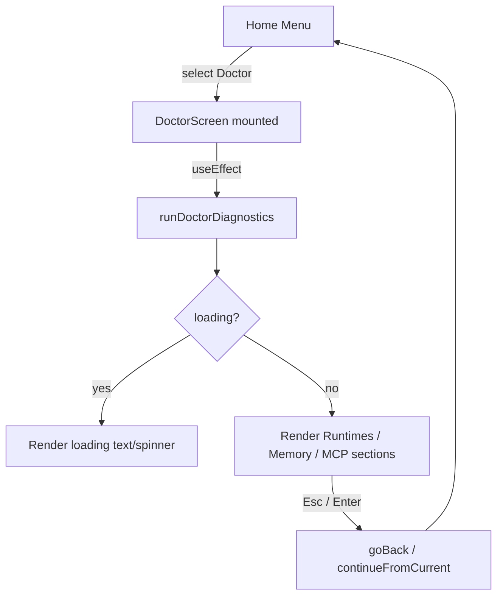

# Design: TUI Doctor Integration

## Source

- Proposal: `tui-doctor-integration` proposal artifact
- Capabilities affected: `tui-doctor-screen` (new), `tui-home-menu` (modified), `tui-navigation` (modified)
- Spec status: not yet available

## Current Architecture Context

The TUI lives in `apps/cli/src/tui/` and is built with Ink (React for terminals).

- **`app.tsx`** is the central router: it defines `type Screen` (a string union), holds `screen` and `cursor` state, and implements `useInput` for global key handling, `continueFromCurrent()` for forward navigation, and `goBack()` for backward navigation.
- **Screen rendering** is a large conditional block inside `DeckApp` that maps `screen` values to JSX. Some screens are inline components (e.g., `EnvironmentCheckScreen`, `CheckingScreen`); others are imported from `screens/` (e.g., `HomeScreen`, `DeveloperTeamReviewScreen`).
- **Navigation state** is local React state. `resetCursor(nextScreen)` advances; `goBack()` uses a `previous: Partial<Record<Screen, Screen>>` map to determine the previous screen.
- **Home menu** is rendered by `HomeScreen` (`screens/home-screen.tsx`), which consumes `getHomeMenuOptions()` from `menu-options.ts`. The `"doctor"` option is currently labeled with a `(placeholder)` suffix and has no handler in `continueFromCurrent()`.
- **Doctor diagnostics** already exist as a standalone module in `apps/cli/src/doctor-command/`. `runDoctorDiagnostics()` is async, never throws, and returns `DoctorDiagnosticsResult` with fields `runtimes`, `memory`, `mcp`, and `hasCriticalErrors`.
- **TTY report formatter** (`doctor-report.ts`) writes to `console.log` using `picocolors`. It cannot be reused inside Ink because it performs side effects rather than returning React elements.

## Proposed Architecture

Add a standalone `DoctorScreen` component, wire it into the existing TUI router, and enable navigation from the Home menu.

### Component / Module Boundaries

| Component | Responsibility | Change Type |
|---|---|---|
| `apps/cli/src/tui/screens/doctor-screen.tsx` | New screen component. Runs `runDoctorDiagnostics` on mount, manages loading/result state, renders report with Ink primitives. | create |
| `apps/cli/src/tui/app.tsx` | Extend `Screen` union, add `"doctor"` to `previous` map, `screenTitle()`, `continueFromCurrent()`, and conditional render. Handle `Enter`/`Esc` globally when `screen === "doctor"` (via existing `useInput` → `goBack`/`continueFromCurrent` path). | modify |
| `apps/cli/src/menu-options.ts` | Remove `(placeholder)` suffix from `"doctor"` label. | modify |
| `apps/cli/src/doctor-command/` | Unchanged — consumed as a dependency. | unchanged |
| `apps/cli/src/doctor-command/doctor-report.ts` | Unchanged — TTY formatter remains for direct CLI use. | unchanged |

### Data Flow

1. User selects **Doctor** in Home menu → `continueFromCurrent()` reads `action === "doctor"` and calls `resetCursor("doctor")`.
2. `app.tsx` conditional render mounts `DoctorScreen`.
3. `DoctorScreen` `useEffect` calls `await runDoctorDiagnostics()`.
4. While awaiting, local state `loading = true` renders a spinner / loading text.
5. On resolve, local state stores `result: DoctorDiagnosticsResult`.
6. Render phase maps `result.runtimes`, `result.memory`, and `result.mcp` into `<Box>` / `<Text>` trees with color/icon mapping derived from `status`.
7. User presses `Enter` or `Esc` → `useInput` in `app.tsx` routes to `goBack()` or `continueFromCurrent()` (existing pattern), which navigates to `"home"` via the `previous` map.

### API / Contract Implications

| Endpoint / Interface | Change | Backward Compatible |
|---|---|---|
| `DoctorDiagnosticsResult` (types) | Consumed as read-only; no change to shape | yes |
| `runDoctorDiagnostics()` | Consumed as async function; no signature change | yes |
| `getHomeMenuOptions()` | Label text changes only | yes |

### State / Persistence Implications

None. The screen uses purely local React state (`loading`, `result`, `cancelled`). No global TUI state, config files, or external storage are modified.

### Migration / Backward Compatibility

None required. This is a purely additive UI feature. The direct CLI command `deck doctor` is unaffected.

Rollback (if needed) is a clean revert:
1. Restore `menu-options.ts` placeholder label.
2. Remove `"doctor"` from `Screen`, `previous`, `screenTitle`, `continueFromCurrent`, and conditional render in `app.tsx`.
3. Delete `doctor-screen.tsx`.

## File Impact Estimate

| File / Path | Action | Rationale |
|---|---|---|
| `apps/cli/src/tui/screens/doctor-screen.tsx` | create | New standalone screen component for doctor diagnostics |
| `apps/cli/src/tui/app.tsx` | modify | Extend Screen type, navigation maps, render branch, title map |
| `apps/cli/src/menu-options.ts` | modify | Remove placeholder suffix from doctor menu item |

> Estimate: 3 files. No new dependencies.

## Testing Strategy

- **Unit test** for `DoctorScreen`: mount with Ink's `render` utility, mock `runDoctorDiagnostics` to resolve instantly, assert loading text disappears and report sections render with correct colors/icons. Mock async rejection to assert graceful error handling.
- **Integration-style** test for `app.tsx` navigation: simulate `Enter` on Home menu with cursor over Doctor, assert screen transitions to `"doctor"`; simulate `Esc` and assert return to `"home"`.
- Existing `doctor-diagnostics.test.ts` covers `runDoctorDiagnostics`; no changes needed there.

## Observability / Error Handling

- `runDoctorDiagnostics` is wrapped in `try/catch` inside `DoctorScreen`. On unexpected error, render a generic error message (e.g., "Diagnostic failed: {message}") so the user is not stranded on a blank screen.
- A `cancelled` flag inside `useEffect` prevents state updates after unmount (e.g., rapid `Esc` before resolve).

## Security / Performance / Accessibility Considerations

- **Security**: `runDoctorDiagnostics` already redacts secrets; `DoctorScreen` only displays what the diagnostics module returns. No additional exposure.
- **Performance**: Diagnostics perform filesystem reads and subprocess spawns. Running on every screen entry is acceptable for an interactive diagnostic tool (proposal recommendation). No background polling.
- **Accessibility (TUI)**: Use `ink` color props and clear text labels. Avoid color-only meaning by including status icons (✓/⚠/✗) as textual indicators.

## Tradeoffs

| Decision | Chosen | Rejected Alternative | Rationale |
|---|---|---|---|
| Standalone screen file (`screens/doctor-screen.tsx`) | Yes | Inline component in `app.tsx` | Keeps `app.tsx` from growing; follows `HomeScreen` pattern; easier to test in isolation. |
| Re-run diagnostics on every visit | Yes | Cache result in TUI session state | Ensures report reflects current environment state; state stays simple; cost is acceptable for interactive use. |
| Duplicate color/icon mapping in Ink | Yes | Reuse `renderDoctorReport()` | `renderDoctorReport` writes to `console.log` via `picocolors` and returns `void`; cannot be adapted to Ink React tree without a heavy refactor. |
| Return via global `Esc`/`Enter` (existing `useInput`) | Yes | Dedicated back button inside `DoctorScreen` | Consistent with rest of TUI; avoids duplicating back logic inside the screen. |

## Risks

| Risk | Likelihood | Impact | Mitigation |
|---|---|---|---|
| `runDoctorDiagnostics` takes long enough to feel unresponsive | Medium | Low | Render a loading message immediately; `cancelled` flag prevents post-unmount updates. |
| Future changes to `DoctorDiagnosticsResult` shape drift from screen rendering | Low | Medium | Use typed arrays (`runtimes`, `memory`, `mcp`) generically; if shape changes, TypeScript will flag missing fields during build. |
| Visual divergence between TTY report and TUI report | Medium | Low | Document that TUI is canonical for interactive use; TTY formatter remains for automation/piping. |

## Open Decisions

None — design is self-contained. The proposal already resolved caching and back-navigation questions.

## Dependencies

- `apps/cli/src/doctor-command/doctor-diagnostics.ts` — stable, existing.
- `ink` — already a project dependency.
- TypeScript types from `apps/cli/src/doctor-command/types.ts` — stable, existing.

## Next Steps

Ready for Task (`deck-developer-task`) to break this design into implementation tasks, combined with Spec.

## Mermaid Summary Source

