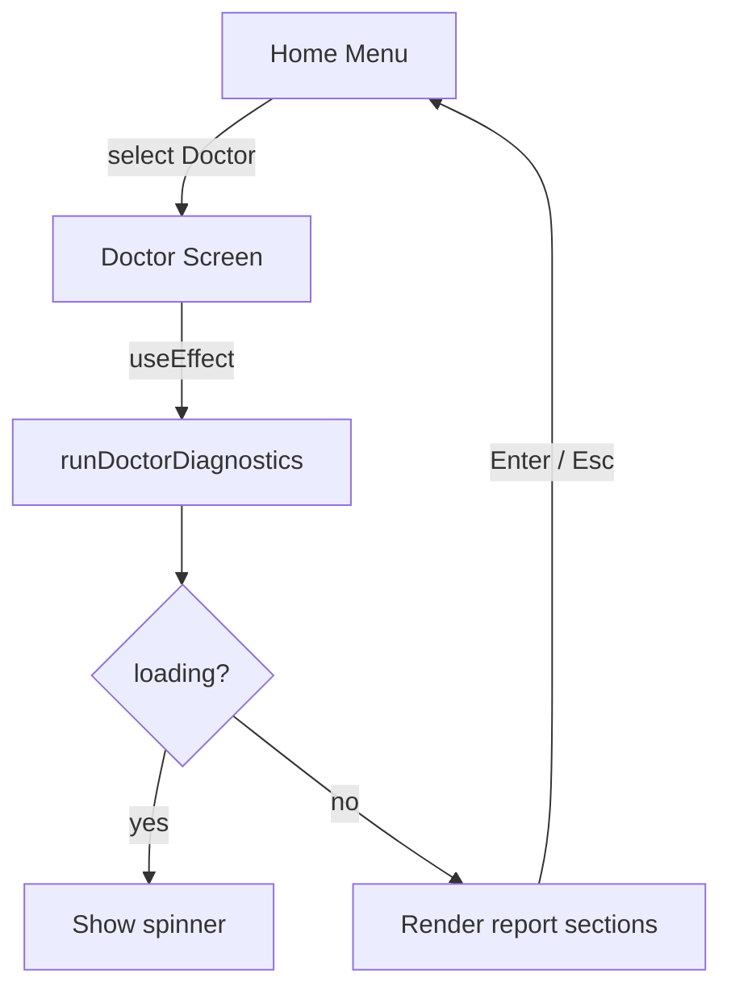

# Proposal: Integración TUI de `deck doctor`

## Intent

El comando `deck doctor` ya existe como utilidad CLI, pero no es accesible desde la TUI interactiva de Deck. El menú Home muestra la opción como placeholder y no hay handler de navegación ni screen para visualizar los resultados. Se propone integrar el diagnóstico como un screen standalone accesible desde el menú Home, permitiendo al usuario revisar el estado de su entorno sin salir de la TUI.

## Goal

El usuario puede ejecutar `deck doctor` desde la TUI, ver los resultados del diagnóstico formateados con indicadores visuales (✓/⚠/✗), y regresar al menú Home con una sola tecla.

## Scope

### In Scope
- Agregar handler en `continueFromCurrent()` para la acción `"doctor"` proveniente del menú Home.
- Agregar `"doctor"` al tipo `Screen` en `apps/cli/src/tui/app.tsx`.
- Crear componente `DoctorScreen` en `apps/cli/src/tui/screens/doctor-screen.tsx` que:
  - Ejecute `runDoctorDiagnostics()` dentro de un `useEffect` al montarse.
  - Muestre un estado de carga mientras se ejecutan los checks.
  - Renderice el resultado usando componentes `ink` (`Box`, `Text`) con iconos de estado.
  - Permita navegar de vuelta al Home con `Enter` o `Esc`.
- Modificar `apps/cli/src/menu-options.ts` para quitar el sufijo "(placeholder)" de la opción Doctor.
- Integrar el screen en el render condicional de `DeckApp` y en `screenTitle()`.
- Agregar navegación backward (`goBack`) desde `"doctor"` hacia `"home"`.

### Out of Scope
- Modificar la lógica de diagnóstico, checks, o formatos de `doctor-diagnostics.ts`.
- Modificar `renderDoctorReport()` de `doctor-report.ts` (se usa como referencia, no como renderizador TUI).
- Integrar `doctor` dentro del flujo `environment-check` o `installation`; el screen es standalone.
- Agregar nuevos checks de diagnóstico no existentes.
- Soporte para ejecutar diagnóstico de forma periódica o en background.

## Affected Capabilities

### New Capabilities
- `tui-doctor-screen`: Pantalla interactiva que orquesta y muestra el resultado de `runDoctorDiagnostics()` usando React/ink.

### Modified Capabilities
- `tui-home-menu`: El item `"doctor"` deja de ser placeholder y dispara navegación real.
- `tui-navigation`: `continueFromCurrent()` y `goBack()` deben reconocer el screen `"doctor"`.

### Unchanged Capabilities
- `doctor-diagnostics`: La lógica de checks, tipos y orquestación (`runDoctorDiagnostics`) no cambia; solo se consume desde la TUI.
- `doctor-report`: El formatter TTY (`renderDoctorReport`) permanece intacto para uso CLI directo.

## Approach

1. **Navegación**: En `continueFromCurrent()`, cuando `screen === "home"` y `action === "doctor"`, llamar `resetCursor("doctor")`.
2. **Screen tipo**: Extender `type Screen` con `"doctor"`. Agregar caso en `screenTitle()` y en el `previous` map de `goBack()`.
3. **Componente `DoctorScreen`**:
   - Usar estado local `loading` / `result`.
   - En `useEffect`, llamar `runDoctorDiagnostics()`; al resolver, guardar resultado.
   - Renderizar condicionalmente: spinner/texto de carga, o el reporte estructurado por secciones (Runtimes, Memory Providers, MCP) con colores e iconos.
   - Cada item de check se renderiza como `<Text>` con prefijo de icono y color según `status`.
4. **Estilos**: Reutilizar la semántica de colores e iconos ya definida en `doctor-report.ts` (✓ verde, ⚠ amarillo, ✗ rojo) pero adaptada a props de `ink`.
5. **Teclas**: En `useInput` de `app.tsx`, cuando `screen === "doctor"`, permitir que `Enter` o `Esc` disparen `resetCursor("home")`.
6. **Independencia**: El screen NO requiere `resolveProjectRoot()` ni estado global de instalación; solo consume `runDoctorDiagnostics()`.

## Alternatives and Tradeoffs

| Alternative | Why Considered | Why Not Chosen |
|---|---|---|
| Reutilizar `renderDoctorReport()` dentro del screen | Evita duplicar lógica de formato | Escribe a `console.log` en vez de devolver strings/React; no es compatible con Ink/TUI |
| Integrar doctor como paso dentro de `environment-check` | Unifica flujo de verificación | `doctor` es una utilidad global independiente; forzarla en el flujo de instalación rompe el modelo de uso standalone y aumenta complejidad del flow |
| Crear screen como modal overlay | Menos invasive en navegación | Ink/ScreenFrame no soporta overlays nativamente; requiere refactor mayor de arquitectura de screens |

## Risks

| Risk | Likelihood | Mitigation |
|---|---|---|
| `runDoctorDiagnostics()` tarda o bloquea el render de Ink | Medium | Ejecutar en `useEffect` con estado de loading; permitir cancelación si el componente se desmonta (flag `cancelled`) |
| Reporte TUI queda desfasado respecto a cambios futuros en `DoctorDiagnosticsResult` | Low | Usar tipos exportados de `doctor-command/types.ts`; el screen itera sobre arrays genéricos (`runtimes`, `memory`, `mcp`) |
| Diferencias visuales entre output TTY (`renderDoctorReport`) y TUI | Medium | Documentar que TUI es canonical para uso interactivo; TTY se mantiene para piping/automation |

## Rollback Plan

1. Revertir `apps/cli/src/menu-options.ts` para restaurar el label con placeholder.
2. Eliminar `"doctor"` del tipo `Screen` y de los maps de navegación (`previous`, `screenTitle`, `continueFromCurrent`).
3. Eliminar el archivo `apps/cli/src/tui/screens/doctor-screen.tsx`.
4. Eliminar la importación y el render condicional del screen en `app.tsx`.

## Dependencies

- `runDoctorDiagnostics()` y tipos de `apps/cli/src/doctor-command/` — ya existen y son estables.
- `ink` (ya dependencia del proyecto).

## Open Questions

- ¿El diagnóstico debe ejecutarse cada vez que se entra al screen, o se cachea entre visitas dentro de la misma sesión TUI? **Recomendación**: ejecutar siempre al entrar para reflejar estado actual del entorno.
- ¿Se requiere un botón/menu explícito "Back to Home" en el screen, o basta con `Enter`/`Esc`? **Recomendación**: `Enter`/`Esc` como en el resto de screens.

> Nota: El scope indica que el doctor funciona SIN workspace (global), lo cual está alineado con el comportamiento actual de `runDoctorDiagnostics()`.

## Acceptance Direction

- [ ] Al seleccionar "Doctor" en el menú Home, la TUI navega al screen de diagnóstico.
- [ ] El screen muestra un indicador de carga mientras ejecuta los checks.
- [ ] Al finalizar, se visualizan las secciones Runtimes, Memory Providers y MCP con iconos ✓/⚠/✗ y mensajes/sugerencias.
- [ ] Presionar `Enter` o `Esc` en el screen de Doctor regresa al Home.
- [ ] El label en el menú Home no contiene "(placeholder)".

## Next Steps

Ready for Spec (`deck-developer-spec`) and Design (`deck-developer-design`) in parallel.

## Mermaid Summary Source

