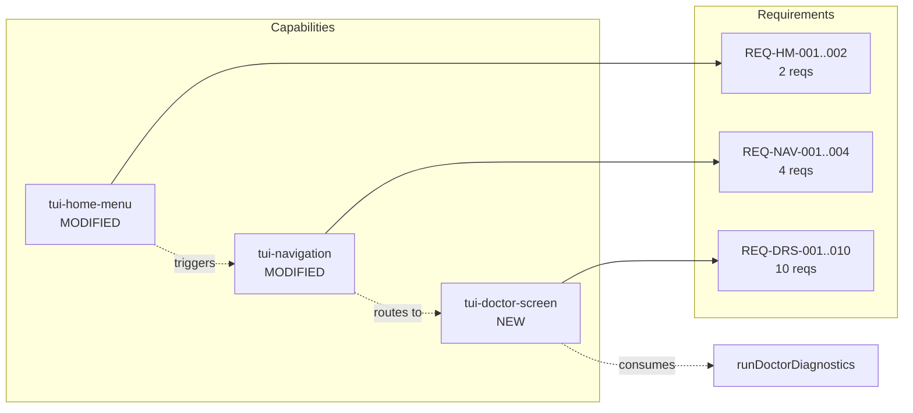

# Spec: TUI Doctor Integration

## Source

- Proposal: `tui-doctor-integration` proposal artifact
- Capabilities affected: `tui-doctor-screen` (new), `tui-home-menu` (modified), `tui-navigation` (modified)

## Requirements

### Capability: tui-doctor-screen

REQ-DRS-001: When the Doctor screen mounts, the system MUST execute `runDoctorDiagnostics()` exactly once and store the result in local state.
  Priority: MUST
  Surface: UI
  Rationale: The screen is a diagnostic viewer; it must produce results on every visit to reflect current environment state.

REQ-DRS-002: While diagnostics are executing and no result is available, the screen MUST display a loading indicator (text or spinner) informing the user that checks are in progress.
  Priority: MUST
  Surface: UI
  Rationale: Prevents a blank screen and communicates that the system is working.

REQ-DRS-003: When diagnostics complete successfully, the screen MUST render all sections of the `DoctorDiagnosticsResult` — `runtimes`, `memory`, and `mcp` — with each check item displaying its `status` via a visual indicator: ✓ (green) for `"ok"`, ⚠ (yellow) for `"warning"`, ✗ (red) for `"error"`.
  Priority: MUST
  Surface: UI
  Rationale: The core value of the screen is presenting a structured, color-coded health report the user can scan at a glance.

REQ-DRS-004: For each check item with `status === "warning"` or `status === "error"`, the screen SHOULD display the item's `suggestion` string when present.
  Priority: SHOULD
  Surface: UI
  Rationale: Suggestions guide the user toward remediation; omitting them on `ok` items avoids noise.

REQ-DRS-005: The screen MUST accept `Enter` or `Esc` as navigation input to return to the Home screen.
  Priority: MUST
  Surface: UI
  Rationale: Consistent with the existing TUI back-navigation pattern used across all screens.

REQ-DRS-006: The Doctor screen MUST NOT depend on `resolveProjectRoot()` or any global installation state; it MUST work as a standalone screen that only consumes `runDoctorDiagnostics()`.
  Priority: MUST
  Surface: General
  Rationale: Doctor diagnostics are global (no workspace required), as stated in the proposal and confirmed by the existing `runDoctorDiagnostics()` signature.

REQ-DRS-007: If the component unmounts before diagnostics resolve (e.g., the user presses Esc during loading), the system MUST discard the result and not update state on the unmounted component.
  Priority: MUST
  Surface: General
  Rationale: Prevents React state updates on unmounted components (standard React useEffect cancellation pattern).

REQ-DRS-008: The screen SHOULD display the runtime `version` string for each installed runtime when the `DoctorRuntimeResult.version` field is present and not `"unknown"`.
  Priority: SHOULD
  Surface: UI
  Rationale: Version information helps users verify they are running expected tool versions.

REQ-DRS-009: The screen SHOULD group runtime checks under each runtime's name, with categories (Runtime, Packages) rendered as sub-sections within that runtime.
  Priority: SHOULD
  Surface: UI
  Rationale: Mirrors the structure of `DoctorDiagnosticsResult.runtimes[].checks[].category` for logical grouping.

REQ-DRS-010: The screen MAY display the top-level `hasCriticalErrors` flag as a summary banner at the top of the report when true.
  Priority: MAY
  Surface: UI
  Rationale: Provides an at-a-glance severity indicator; not mandatory because the individual item statuses already convey the same information.

### Capability: tui-home-menu

REQ-HM-001: The Doctor menu item in the Home screen MUST display the label `"Doctor"` without any placeholder suffix.
  Priority: MUST
  Surface: UI
  Rationale: Removing the placeholder signals that the option is functional and navigable.

REQ-HM-002: When the user selects the Doctor item in the Home menu and presses Enter, the system MUST navigate to the `"doctor"` screen.
  Priority: MUST
  Surface: UI
  Rationale: The menu item must trigger actual navigation, not remain inert.

### Capability: tui-navigation

REQ-NAV-001: The `Screen` type union MUST include the literal `"doctor"`.
  Priority: MUST
  Surface: General
  Rationale: Required for type-safe screen state and conditional rendering.

REQ-NAV-002: The `screenTitle()` function MUST return the string `"Doctor"` when the screen is `"doctor"`.
  Priority: MUST
  Surface: UI
  Rationale: The ScreenFrame title bar must display a human-readable title for the Doctor screen.

REQ-NAV-003: The `continueFromCurrent()` function MUST transition from `"home"` screen to `"doctor"` screen when the home menu action is `"doctor"`.
  Priority: MUST
  Surface: General
  Rationale: Wires the Home menu selection to the Doctor screen via the existing navigation dispatch.

REQ-NAV-004: The `goBack()` function MUST transition from `"doctor"` screen to `"home"` screen.
  Priority: MUST
  Surface: General
  Rationale: Ensures Esc key from Doctor returns to Home, consistent with all other screens' backward navigation.

## Acceptance Scenarios

### Capability: tui-doctor-screen

#### Scenario: Diagnostics execute on screen mount
**Given** the TUI is displaying the Home screen
**When** the user selects "Doctor" and presses Enter
**Then** the screen transitions to `"doctor"`, a loading indicator is visible, and `runDoctorDiagnostics()` has been invoked exactly once
> Covers: REQ-DRS-001, REQ-DRS-002

#### Scenario: Full report rendered after diagnostics complete
**Given** the Doctor screen is displayed and diagnostics have completed
**When** the `DoctorDiagnosticsResult` contains runtimes (with checks), memory categories, and MCP categories
**Then** all sections are rendered with each item showing the correct icon and color: ✓ green for ok, ⚠ yellow for warning, ✗ red for error
> Covers: REQ-DRS-003

#### Scenario: Suggestions shown for non-ok items
**Given** the Doctor screen is displaying the completed report
**When** a check item has `status === "warning"` or `status === "error"` and a non-empty `suggestion` field
**Then** the suggestion text is displayed alongside or below the check item
> Covers: REQ-DRS-004

#### Scenario: Return to Home via Enter
**Given** the Doctor screen is displaying the completed report
**When** the user presses Enter
**Then** the screen transitions to `"home"`
> Covers: REQ-DRS-005

#### Scenario: Return to Home via Esc
**Given** the Doctor screen is displaying the completed report
**When** the user presses Esc
**Then** the screen transitions to `"home"`
> Covers: REQ-DRS-005

#### Scenario: Esc during loading cancels safely
**Given** the Doctor screen is displayed and diagnostics are still running (loading indicator visible)
**When** the user presses Esc
**Then** the screen transitions to `"home"` and the pending diagnostic result is discarded (no state update on unmounted component)
> Covers: REQ-DRS-005, REQ-DRS-007

#### Scenario: No workspace dependency
**Given** there is no project root or workspace configured
**When** the user navigates to the Doctor screen
**Then** diagnostics execute and results render without error
> Covers: REQ-DRS-006

#### Scenario: Runtime version displayed when available
**Given** a runtime's `DoctorRuntimeResult.version` is a non-"unknown" string
**When** the Doctor screen renders the runtime section
**Then** the version string is displayed next to or below the runtime name
> Covers: REQ-DRS-008

#### Scenario: Runtime checks grouped by name and category
**Given** the diagnostics result contains a runtime with multiple check categories
**When** the Doctor screen renders
**Then** each runtime's name is shown as a heading, and its check categories (e.g., Runtime, Packages) are rendered as sub-sections within that heading
> Covers: REQ-DRS-009

#### Scenario: Empty diagnostics result (all runtimes missing)
**Given** `runDoctorDiagnostics()` returns a result where every runtime has `installed === false`, memory and MCP arrays are non-empty with warning statuses
**When** the Doctor screen renders
**Then** all items are displayed with ⚠ yellow indicators and suggestion text; no crash or blank area occurs
> Covers: REQ-DRS-003, REQ-DRS-004

### Capability: tui-home-menu

#### Scenario: Doctor label has no placeholder
**Given** the TUI is displaying the Home screen
**When** the menu items are rendered
**Then** the Doctor item displays exactly `"Doctor"` without any `(placeholder)` suffix
> Covers: REQ-HM-001

#### Scenario: Doctor menu item navigates to doctor screen
**Given** the TUI is displaying the Home screen with cursor on the Doctor item
**When** the user presses Enter
**Then** the screen transitions to `"doctor"`
> Covers: REQ-HM-002

### Capability: tui-navigation

#### Scenario: Screen type includes doctor
**Given** the `Screen` type union is evaluated at compile time
**When** a value of `"doctor"` is assigned to a `Screen`-typed variable
**Then** the TypeScript compiler accepts the assignment without error
> Covers: REQ-NAV-001

#### Scenario: Screen title for doctor
**Given** `screenTitle()` is called with `"doctor"`
**When** the title is rendered in the ScreenFrame
**Then** the title bar displays `"Doctor"`
> Covers: REQ-NAV-002

#### Scenario: Forward navigation from home to doctor
**Given** the current screen is `"home"` and the home menu action at the cursor is `"doctor"`
**When** `continueFromCurrent()` is invoked
**Then** the screen state transitions to `"doctor"` and the cursor resets
> Covers: REQ-NAV-003

#### Scenario: Backward navigation from doctor to home
**Given** the current screen is `"doctor"`
**When** `goBack()` is invoked (via Esc key)
**Then** the screen state transitions to `"home"`
> Covers: REQ-NAV-004

## Validation Rules

| Field / Input | Rule | Error Message | REQ-ID |
|---|---|---|---|
| Home menu action `"doctor"` | Must resolve to a valid screen transition | N/A (navigation failure would be a bug, not user error) | REQ-HM-002, REQ-NAV-003 |
| `DoctorDiagnosticsResult` structure | Must contain `runtimes` (array), `memory` (array), `mcp` (array), `hasCriticalErrors` (boolean) | N/A (type contract enforced at compile time) | REQ-DRS-003 |
| `DoctorCheckItem.status` | Must be one of `"ok"`, `"warning"`, `"error"` | N/A (union type constraint) | REQ-DRS-003 |

## Error Contracts

| Condition | Error Code | Message | Status |
|---|---|---|---|
| `runDoctorDiagnostics()` never resolves (hang) | N/A | Loading indicator remains visible; user can press Esc to return | N/A (TUI has no HTTP status) |
| Diagnostics result is empty (no runtimes, no memory, no MCP) | N/A | Screen renders an informational "No diagnostic results" message | N/A |
| Component unmounts before resolution | N/A | Result silently discarded | N/A |

> Note: `runDoctorDiagnostics()` is documented as never throwing (see `doctor-diagnostics.ts` REQ-DIAG-008). The TUI screen does not need a try/catch for the diagnostics call itself, but should handle the case where the Promise never settles (user cancels via Esc).

## States and Transitions

### Doctor Screen Internal States

| State | Description | Entry Criteria |
|---|---|---|
| `loading` | Diagnostics are running; loading indicator displayed | Screen mounts |
| `loaded` | Diagnostics complete; full report rendered | `runDoctorDiagnostics()` resolves |
| `cancelled` | User pressed Esc during loading; screen transitions away | Esc pressed while in `loading` state |

### Transitions

| From | To | Trigger | Side Effects |
|---|---|---|---|
| `loading` | `loaded` | `runDoctorDiagnostics()` resolves | Result stored in state; report rendered |
| `loading` | `cancelled` | Esc pressed during loading | Screen transitions to `"home"`; result discarded |
| `loaded` | (home) | Enter or Esc pressed | Screen transitions to `"home"` |

## Open Questions

- Should the Doctor screen cache results within a single TUI session (re-display on re-entry without re-running diagnostics)? **Proposal recommends**: re-run on every entry to reflect current environment state. Deferring to proposal recommendation unless user overrides.
- Should an explicit "Back to Home" label or button be rendered on the Doctor screen, or is the Esc/Enter convention sufficient? **Proposal recommends**: Esc/Enter only, consistent with other screens.

## Compliance Matrix

| REQ-ID | Scenario(s) | Status |
|---|---|---|
| REQ-DRS-001 | Diagnostics execute on screen mount | Defined |
| REQ-DRS-002 | Diagnostics execute on screen mount | Defined |
| REQ-DRS-003 | Full report rendered after diagnostics complete, Empty diagnostics result | Defined |
| REQ-DRS-004 | Suggestions shown for non-ok items, Empty diagnostics result | Defined |
| REQ-DRS-005 | Return to Home via Enter, Return to Home via Esc, Esc during loading cancels safely | Defined |
| REQ-DRS-006 | No workspace dependency | Defined |
| REQ-DRS-007 | Esc during loading cancels safely | Defined |
| REQ-DRS-008 | Runtime version displayed when available | Defined |
| REQ-DRS-009 | Runtime checks grouped by name and category | Defined |
| REQ-DRS-010 | (MAY — no dedicated scenario required) | Defined |
| REQ-HM-001 | Doctor label has no placeholder | Defined |
| REQ-HM-002 | Doctor menu item navigates to doctor screen | Defined |
| REQ-NAV-001 | Screen type includes doctor | Defined |
| REQ-NAV-002 | Screen title for doctor | Defined |
| REQ-NAV-003 | Forward navigation from home to doctor | Defined |
| REQ-NAV-004 | Backward navigation from doctor to home | Defined |

## Mermaid Summary Source

