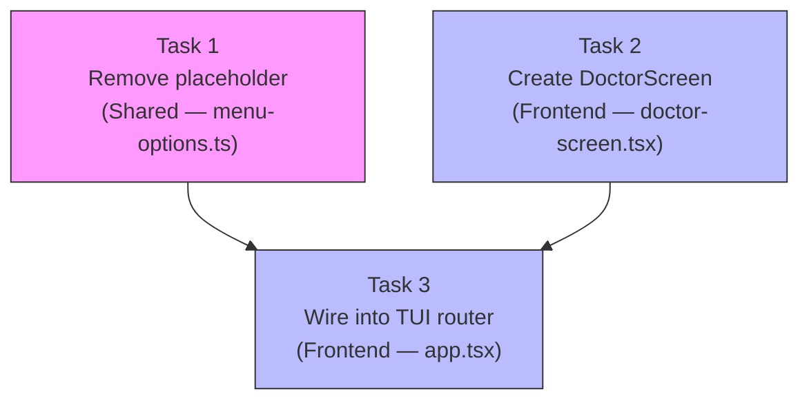

# Tasks: TUI Doctor Integration

## Source

- Spec: `tui-doctor-integration` spec artifact
- Design: `tui-doctor-integration` design artifact
- Capabilities affected: `tui-doctor-screen` (new), `tui-home-menu` (modified), `tui-navigation` (modified)

## Task Groups

### Group: Shared / Contracts

#### Task 1: Remove placeholder suffix from Doctor menu item

**Owner**: General Apply
**Priority**: P0
**Complexity**: Low
**Parallel**: Yes
**Depends on**: none

**Description**
In `apps/cli/src/menu-options.ts`, change the Doctor menu item label from `Doctor ${placeholder()}` to `"Doctor"`. This removes the `(placeholder)` suffix and signals the option is functional. Covers REQ-HM-001.

**Files**
- `apps/cli/src/menu-options.ts` — modify

**Verification**
Grep `menu-options.ts` for `"doctor"` and confirm the label is exactly `"Doctor"` with no `placeholder()` call. TUI should render "Doctor" in the Home menu without a yellow placeholder suffix.

---

### Group: Frontend

#### Task 2: Create DoctorScreen component

**Owner**: Frontend Apply
**Priority**: P0
**Complexity**: Medium
**Parallel**: Yes
**Depends on**: none

**Description**
Create `apps/cli/src/tui/screens/doctor-screen.tsx` as a standalone Ink React component. The component must:

1. Import `runDoctorDiagnostics` from `../../doctor-command/doctor-diagnostics` and types from `../../doctor-command/types`.
2. Use local state: `loading` (boolean, initially `true`) and `result` (`DoctorDiagnosticsResult | null`, initially `null`).
3. In a `useEffect`, call `await runDoctorDiagnostics()` with a `cancelled` flag for unmount safety (REQ-DRS-001, REQ-DRS-007). On resolve, set `result` and `loading = false`.
4. While `loading`, render a loading indicator: `<Box flexDirection="column"><Text color="cyan">Running diagnostics...</Text><Text dimColor>Checking your environment configuration.</Text></Box>` (REQ-DRS-002).
5. When `result` is available, render the full report:
   - **Runtimes section**: Iterate `result.runtimes`. For each runtime, render the runtime name as a bold heading. If `version` is present and not `"unknown"`, render it next to the name (REQ-DRS-008). For each `DoctorCategoryResult` in `runtime.checks`, render the category name as a sub-section. For each `DoctorCheckItem`, render the icon/color mapping: ✓ green for `"ok"`, ⚠ yellow for `"warning"`, ✗ red for `"error"` (REQ-DRS-003, REQ-DRS-009). If the item has a `suggestion` and status is not `"ok"`, render the suggestion below the item (REQ-DRS-004).
   - **Memory section**: Same icon/color pattern for each category in `result.memory` (REQ-DRS-003).
   - **MCP section**: Same icon/color pattern for each category in `result.mcp` (REQ-DRS-003).
   - **Optional**: If `result.hasCriticalErrors` is `true`, render a summary banner at the top (REQ-DRS-010, MAY).
6. At the bottom, render `<Text dimColor>Press Enter or Esc to return to Home.</Text>`.
7. The component must NOT import or depend on `resolveProjectRoot()` (REQ-DRS-006).
8. Handle edge case: if result has all empty arrays, render an informational "No diagnostic results found." message.

Covers: REQ-DRS-001 through REQ-DRS-010.

**Files**
- `apps/cli/src/tui/screens/doctor-screen.tsx` — create

**Verification**
TypeScript compiles without errors. The component accepts no props (standalone). Manual TUI test: navigate to Doctor screen, observe loading indicator, then structured report with ✓/⚠/✗ icons and colors. Esc returns to Home.

---

#### Task 3: Wire Doctor screen into TUI navigation and rendering

**Owner**: Frontend Apply
**Priority**: P0
**Complexity**: Medium
**Parallel**: No — depends on Task 1 and Task 2
**Depends on**: Task 1, Task 2

**Description**
Modify `apps/cli/src/tui/app.tsx` to integrate the Doctor screen into the existing TUI router:

1. **Import**: Add `import { DoctorScreen } from "./screens/doctor-screen";` at the top.
2. **Screen type**: Add `| "doctor"` to the `Screen` type union (around line 117-146).
3. **continueFromCurrent()**: In the `if (screen === "home")` block (around line 790-805), add a handler: `if (action === "doctor") resetCursor("doctor");` (REQ-NAV-003, REQ-HM-002).
4. **goBack()**: In the `previous` map inside `goBack()` (around line 1696-1725), add the entry `"doctor": "home"` (REQ-NAV-004).
5. **screenTitle()**: In the `titles` record inside `screenTitle()` (around line 1813-1843), add `doctor: "Doctor"` (REQ-NAV-002).
6. **Conditional render**: In the JSX return of `DeckApp` (around line 1742-1808), add: `{screen === "doctor" ? <DoctorScreen /> : null}` — placed after the `"home"` screen block.
7. **useInput handling**: The existing `useInput` handler already processes `Esc` via `goBack()` and `Enter` via `continueFromCurrent()`. Since `continueFromCurrent()` has no specific handler for `screen === "doctor"`, the `Enter` key when on the Doctor screen will be a no-op for forward navigation. To support `Enter` returning to Home (REQ-DRS-005), add a case in `continueFromCurrent()`: `if (screen === "doctor") resetCursor("home");`.

Covers: REQ-NAV-001 through REQ-NAV-004, REQ-HM-002, REQ-DRS-005.

**Files**
- `apps/cli/src/tui/app.tsx` — modify

**Verification**
TypeScript compiles without errors. TUI test: from Home, select Doctor, press Enter → screen transitions to "doctor" with "Doctor" title. DoctorScreen renders. Press Esc or Enter → returns to Home. The `Screen` type accepts `"doctor"` at compile time.

---

## Dependency Graph

```
Task 1 (Shared: menu-options.ts)
Task 2 (Frontend: doctor-screen.tsx)
  ↓
Task 3 (Frontend: app.tsx wiring) ← depends on Task 1 + Task 2
```

## Parallelization Plan

| Phase | Tasks | Can Run in Parallel |
|---|---|---|
| Shared / Frontend (parallel) | 1, 2 | Yes — no file overlap |
| Frontend (sequential) | 3 | No — depends on 1 and 2 |

## Responsibility Contracts

| Contract / Boundary | Owner | Consumers | Notes |
|---|---|---|---|
| `DoctorDiagnosticsResult` type (read-only) | Existing `doctor-command/types.ts` | Task 2 (DoctorScreen) | Stable, no changes. DoctorScreen imports and consumes. |
| `runDoctorDiagnostics()` async function | Existing `doctor-command/doctor-diagnostics.ts` | Task 2 (DoctorScreen) | Never throws. Returns `Promise<DoctorDiagnosticsResult>`. |
| Home menu `"doctor"` option value | Task 1 (menu-options label) | Task 3 (`continueFromCurrent` handler) | Task 3 reads `action === "doctor"` from `getHomeMenuOptions()`. |
| `DoctorScreen` component export | Task 2 (create) | Task 3 (import and render) | Task 3 imports `DoctorScreen` from the file Task 2 creates. |
| `Screen` type union | Task 3 (extend) | All TUI navigation code | Must include `"doctor"` for type safety. |

## Complexity Summary

| Complexity | Count | Task Numbers |
|---|---|---|
| Low | 1 | 1 |
| Medium | 2 | 2, 3 |
| High | 0 | — |

## Flagged for Splitting

None — all tasks are scoped for a single session.

## Review Workload Forecast

| Signal | Value |
|---|---|
| Estimated changed lines | 100-400 |
| 400-line budget risk | Low |
| Scope reduction recommended | No |
| Sequential work slices recommended | No |
| Decision needed before Apply | No |

**Rationale**: Task 1 is a single-line change. Task 2 creates a new file (~80-120 lines). Task 3 adds ~10-15 lines to `app.tsx`. Total new/modified code is approximately 100-135 lines. The risk is low because the change is purely additive — no existing behavior is modified, and the Doctor screen is fully standalone with no coupling to installation state.

## Open Questions / Blockers

None — tasks are ready for Apply.

## Mermaid Summary Source


