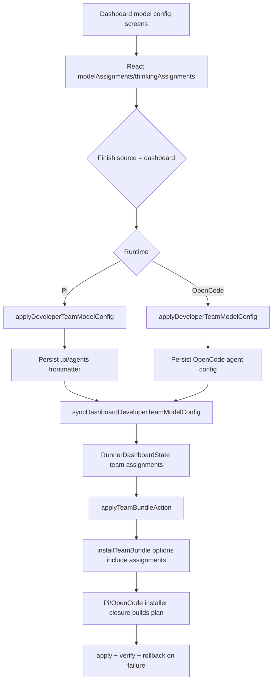

# Design: Fix TUI Developer Team Model Assignment Persistence

## Source

- Proposal: `tui-model-fix` proposal artifact
- Capabilities affected: `pi-dashboard-model-persistence`, `apply-team-bundle-action`, `pi-install-team-bundle`
- Spec status: not yet available

## Current Architecture Context

- `apps/cli/src/tui/app.tsx` owns the Ink TUI state machine for model selection, dashboard navigation, and install execution.
- Developer Team model configuration state is held in `modelAssignments` and `thinkingAssignments` while the user moves through `agent-model-config-list`, `model-provider-selection`, `model-selection`, and `agent-model-assignment`.
- `applyDeveloperTeamModelConfig()` already persists the current assignments for both runtimes:
  - OpenCode path builds an OpenCode install plan with `configModelOverrides` and `reasoningEffortOverrides`.
  - Pi path builds a Pi install plan with `modelAssignments`, `thinkingAssignments`, and `preserveMissingThinkingAssignments: true`.
- The dashboard Finish path currently calls `applyDeveloperTeamModelConfig()` only when `modelConfigRuntime === "opencode"`, then calls `syncDashboardDeveloperTeamModelConfig()` for all dashboard runtimes.
- `syncDashboardDeveloperTeamModelConfig()` only updates `RunnerDashboardState.teams["developer-team"]`; it does not write `.pi/agents/*.md` files.
- `apps/cli/src/tui/pi-runner-dashboard/action-runner.ts` exposes `TeamBundleInstallerFn`, but its options contract only includes `memoryProvider`; `applyTeamBundleAction()` therefore cannot forward dashboard model/thinking assignments to an adapter-specific installer.
- `RunnerTeamState` in `apps/cli/src/tui/pi-runner-dashboard/state.ts` already has optional `modelAssignments` and `thinkingAssignments`, so the dashboard state can act as the source for Review & Install assignment forwarding without changing the UI state shape.

## Proposed Architecture

Use a two-layer fix:

1. **Immediate persistence on dashboard Finish for Pi**: mirror the OpenCode dashboard behavior by calling `applyDeveloperTeamModelConfig()` when `modelConfigSource === "dashboard"` and `modelConfigRuntime === "pi"`, before syncing dashboard state and returning to the dashboard.
2. **Structural installer contract completion**: extend the dashboard action-runner installer contract so `apply-team-bundle` actions can pass Developer Team model/thinking assignments from `RunnerDashboardState` into runtime-specific installer closures. Implement the Pi closure in `app.tsx` using the existing Pi plan/apply/verify/rollback pattern, and update the existing OpenCode closure to forward received assignments instead of ignoring them.

### Component / Module Boundaries

| Component | Responsibility | Change Type |
|---|---|---|
| `apps/cli/src/tui/app.tsx` | Owns TUI state, model-config Finish handling, dashboard action-runner dependencies, runtime-specific team install closures. | modified |
| `apps/cli/src/tui/pi-runner-dashboard/action-runner.ts` | Executes dashboard review-plan actions through generic dependencies and adapter callbacks. | modified |
| `apps/cli/src/tui/pi-runner-dashboard/state.ts` | Defines dashboard state and team assignment fields already consumed by the runner. | unchanged |
| `@deck/adapter-pi` Developer Team install functions | Build/apply/verify/rollback Pi `.pi/agents/*.md` install plans. | unchanged |
| `@deck/adapter-opencode` Developer Team install functions | Build/apply/verify/rollback OpenCode agent config/install plans. | unchanged |

### Data Flow

**Dashboard model configuration Finish**

1. User selects models/thinking levels in the existing TUI screens.
2. `modelAssignments` and `thinkingAssignments` React state are updated per agent.
3. On `agent-model-config-list` Finish with `modelConfigSource === "dashboard"`:
   - If runtime is Pi or OpenCode, call `applyDeveloperTeamModelConfig()`.
   - Then call `syncDashboardDeveloperTeamModelConfig()` to keep dashboard state aligned.
   - Navigate back to `pi-runner-dashboard`.
4. Pi persistence happens through existing `buildDeveloperTeamInstallPlan()` -> backup -> `applyDeveloperTeamInstall()` -> `verifyDeveloperTeamInstall()` flow.

**Review & Install structural path**

1. `applyTeamBundleAction()` receives an `apply-team-bundle` `RunnerAction` and `RunnerActionRunnerDependencies`.
2. It derives `memoryProvider` as it does today.
3. It reads `dependencies.dashboardState?.teams["developer-team"]?.modelAssignments` and `.thinkingAssignments`.
4. It calls `dependencies.installTeamBundle(projectRoot, { memoryProvider?, modelAssignments?, thinkingAssignments? })`.
5. The Pi closure in `app.tsx` builds a Pi Developer Team install plan with those assignments and existing memory-provider behavior, then applies/verifies/rolls back as needed.
6. The OpenCode closure in `app.tsx` maps received assignments to `buildOpenCodeDeveloperTeamInstallPlan()` overrides while retaining package instructions and standalone skills.

### API / Contract Implications

| Endpoint / Interface | Change | Backward Compatible |
|---|---|---|
| `TeamBundleInstallerFn` | Extend optional options object with `modelAssignments?: DeveloperTeamModelAssignments` and `thinkingAssignments?: DeveloperTeamThinkingAssignments`. | yes |
| `RunnerActionRunnerDependencies.installTeamBundle` | Receives the widened `TeamBundleInstallerFn` contract. | yes |
| `applyTeamBundleAction()` dependency call | Passes assignments when present in dashboard state. | yes |
| `RunnerAction` | No contract change required; assignment data should come from dashboard team state, not from each action. | yes |

### State / Persistence Implications

- No new persistent data model or schema.
- Existing `.pi/agents/*.md` frontmatter is updated earlier in the dashboard Finish path for Pi.
- Existing dashboard state fields (`RunnerTeamState.modelAssignments`, `RunnerTeamState.thinkingAssignments`) become active inputs to `apply-team-bundle` execution.

### Migration / Backward Compatibility

- No migration required.
- Existing callers of `TeamBundleInstallerFn` remain valid because the options object and new keys are optional.
- If assignments are absent, installers preserve existing/default behavior.

## File Impact Estimate

| File / Path | Action | Rationale |
|---|---|---|
| `apps/cli/src/tui/app.tsx` | modify | Add Pi dashboard Finish persistence; provide Pi `installTeamBundle` closure; forward assignments in OpenCode closure. |
| `apps/cli/src/tui/pi-runner-dashboard/action-runner.ts` | modify | Widen installer options type and forward dashboard team model/thinking assignments. |
| `apps/cli/src/tui/pi-runner-dashboard/action-runner.test.ts` | modify | Cover `apply-team-bundle` assignment forwarding and preserve existing memory-provider sequencing/redaction assertions. |
| `openspec/changes/tui-model-fix/design.md` | create | Record technical design. |
| `openspec/changes/tui-model-fix/state.yaml` | modify | Record design phase completion. |
| `openspec/changes/tui-model-fix/events.yaml` | modify | Append design phase event. |

## Testing Strategy

- Unit-test `applyTeamBundleAction()` / `runPiRunnerAction()` with a dashboard state containing Developer Team assignments and assert the installer receives both assignments and memory provider.
- Unit-test the Review & Install sequencing remains `write config` -> `write MCP` -> `resolve provider` -> `apply team` -> `validate` for Supermemory-backed plans.
- Add/adjust a TUI-level test around dashboard model Finish if existing app tests can exercise `agent-model-config-list`; assert Pi calls the same persistence path that OpenCode already uses.
- Keep tests focused on observable plan/frontmatter output rather than React state internals.

## Observability / Error Handling

- Reuse existing backup/rollback and verification behavior in `applyDeveloperTeamModelConfig()` and runtime-specific installer closures.
- Continue returning redacted `RunnerActionRunResult.raw` and diagnostics from `action-runner.ts`; model IDs and thinking levels are not secrets, but memory-provider tokens must remain redacted.
- If `installTeamBundle` is unavailable, keep the current skipped-result behavior.

## Security / Performance / Accessibility Considerations

- Security: preserve existing Supermemory token redaction; do not include ephemeral credentials in installer options or raw results.
- Performance: negligible; one extra Pi plan/apply/verify happens only when the user explicitly finishes dashboard model configuration.
- Accessibility: no UI changes.

## Tradeoffs

| Decision | Chosen | Rejected Alternative | Rationale |
|---|---|---|---|
| Short-term persistence point | Persist Pi assignments immediately on dashboard Finish | Wait until Review & Install only | Finish is the moment the user confirms model choices and already matches the OpenCode path. |
| Assignment source for `apply-team-bundle` | Read from `RunnerDashboardState.teams["developer-team"]` | Add assignment payload fields to every `RunnerAction` | State already owns team assignments; action payload changes would duplicate data and broaden the generic action contract. |
| Installer contract shape | Add optional assignment keys to existing options object | Introduce a new Pi-specific action runner | Keeps action-runner runtime-agnostic while allowing adapters to consume relevant options. |
| Pi dashboard install implementation | Closure in `app.tsx` using existing Pi plan/apply/verify helpers | Refactor all installer abstractions now | Satisfies structural gap with limited blast radius; full abstraction refactor is out of scope. |

## Risks

| Risk | Likelihood | Impact | Mitigation |
|---|---|---|---|
| Pi dashboard Finish writes files before Review & Install confirmation | Low | Medium | This mirrors OpenCode behavior and only occurs after explicit model-config Finish. |
| Duplicate persistence between Finish and Review & Install | Medium | Low | Installer inputs are idempotent; verify via plan/frontmatter tests. |
| Type widening misses one test double or dependency alias | Medium | Low | Search all `installTeamBundle`, `TeamBundleInstallerFn`, and action-runner test usages during implementation. |
| OpenCode assignment forwarding maps to wrong option names | Low | Medium | Use existing `configModelOverrides` and `reasoningEffortOverrides` option names from current `applyDeveloperTeamModelConfig()` OpenCode path. |

## Open Decisions

- Confirm during implementation whether `buildPiRunnerReviewPlan` already creates `teamApplications` for selected Developer Team. If it does not, Task/Apply should extend the plan builder as part of the structural path or flag follow-up scope.
- Decide whether the Pi `installTeamBundle` closure should also consume capability instruction bundles/standalone skills if future Pi installer support exists; current design keeps Pi aligned with existing Pi install behavior only.

## Dependencies

- No external dependencies.
- Phase 2 depends on the existing adapter functions accepting assignment options as observed in current install paths.

## Next Steps

Ready for Task (`deck-developer-task`) to break this design into implementation tasks, combined with Spec.

## Mermaid Summary Source

