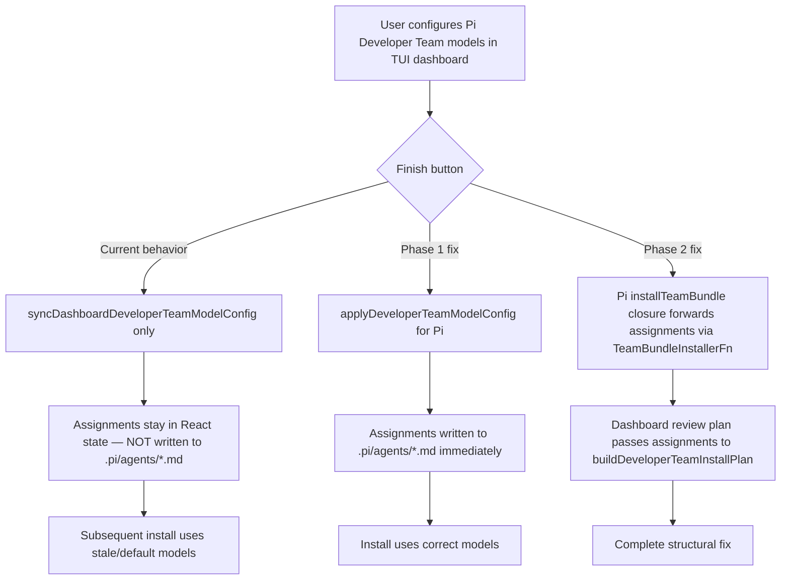

# Proposal: Fix TUI Developer Team Model Assignment Bug

## Intent

When users configure model assignments for the Pi Developer Team via the TUI dashboard (`Configure Developer Team models` from the Pi Runner capability dashboard), their selections are not persisted to the Pi agent files. The dashboard only syncs assignments to dashboard state (`syncDashboardDeveloperTeamModelConfig`) but does not write them to disk. This causes the installation to proceed with stale or default model assignments, ignoring the user's explicit configuration.

This bug does **not** affect OpenCode, because OpenCode already calls `applyDeveloperTeamModelConfig()` immediately when finishing model configuration from the dashboard (line 1098–1100 in `app.tsx`). Pi skips this call.

## Goal

Ensure Pi Developer Team model assignments configured through the TUI are persisted to `.pi/agents/*.md` files before any subsequent install or review step proceeds.

## Scope

### In Scope
- Short-term fix: call `applyDeveloperTeamModelConfig()` for Pi when finishing model configuration from the dashboard path.
- Medium-term fix: extend `TeamBundleInstallerFn` type to accept `{ modelAssignments?, thinkingAssignments? }`, pass these through `applyTeamBundleAction`, and implement a Pi `installTeamBundle` closure in `app.tsx` that forwards assignments to `buildDeveloperTeamInstallPlan`.

### Out of Scope
- Changing how model configuration works for OpenCode (already functional).
- Refactoring the entire installer abstraction.
- Adding new UI screens or user-facing messaging.

## Affected Capabilities

### New Capabilities
- `pi-dashboard-model-persistence`: Pi dashboard model configuration writes assignments to disk immediately on Finish.

### Modified Capabilities
- `apply-team-bundle-action`: `TeamBundleInstallerFn` signature changes to optionally accept model/thinking assignments.
- `pi-install-team-bundle`: Dashboard install closure for Pi passes model/thinking assignments to the install plan builder.

### Unchanged Capabilities
- `developer-team-install-plan`: `buildDeveloperTeamInstallPlan` already accepts `modelAssignments` and `thinkingAssignments`; no spec change required.
- `model-config-screens`: UI for selecting providers, models, and thinking levels remains unchanged.

## Approach

### Phase 1 — Short-term (immediate bug fix)
In `apps/cli/src/tui/app.tsx`, inside `continueFromCurrent` / `agent-model-config-list` finish handling, add `applyDeveloperTeamModelConfig()` for Pi before `syncDashboardDeveloperTeamModelConfig()` when `modelConfigSource === "dashboard"`.

This mirrors the existing OpenCode behavior exactly:
```typescript
if (modelConfigSource === "dashboard") {
  if (modelConfigRuntime === "opencode") {
    applyDeveloperTeamModelConfig();
  }
  // Add for Pi
  if (modelConfigRuntime === "pi") {
    applyDeveloperTeamModelConfig();
  }
  syncDashboardDeveloperTeamModelConfig();
  resetCursor("pi-runner-dashboard");
}
```

### Phase 2 — Medium-term (structural completeness)
1. Update `TeamBundleInstallerFn` in `apps/cli/src/tui/pi-runner-dashboard/action-runner.ts`:
   ```typescript
   export type TeamBundleInstallerFn = (
     projectRoot: string,
     options?: { memoryProvider?: AdaptiveMemoryProvider; modelAssignments?: DeveloperTeamModelAssignments; thinkingAssignments?: DeveloperTeamThinkingAssignments },
   ) => Promise<...>;
   ```
2. Update `applyTeamBundleAction` in `action-runner.ts` to extract assignments from the action payload and pass them to `installer`.
3. Implement Pi `installTeamBundle` closure in `app.tsx` (dashboard `runDashboardInstall` effect) analogous to the existing OpenCode closure. This closure reads current model/thinking assignments from state, builds a plan via `buildDeveloperTeamInstallPlan`, applies it, verifies it, and returns results.
4. Update OpenCode `installTeamBundle` closure to forward any assignments it receives (currently it only uses `options.memoryProvider`).

## Alternatives and Tradeoffs

| Alternative | Why Considered | Why Not Chosen |
|---|---|---|
| **A. Structural fix only** (type changes + installer implementation) | Addresses root cause comprehensively. | Higher risk (type changes, multiple files, test updates). Does not unblock users immediately. |
| **B. Always pass assignments via dashboard state** | Avoids type changes by relying on global state. | Fragile — dashboard state may not be the source of truth at install time; couples installer to React state shape. |
| **C. Immediate persist on Finish** (short-term) | Minimal change, mirrors proven OpenCode pattern. | Does not fix the underlying `TeamBundleInstallerFn` abstraction gap; dashboard review plan still won't pass assignments if user re-runs from dashboard later. |

**Chosen:** Phase 1 (Option C) immediately, followed by Phase 2 (Option A) as follow-up.

## Risks

| Risk | Likelihood | Mitigation |
|---|---|---|
| Phase 1 writes models at the wrong moment (before user confirms dashboard review) | Low | The user already confirmed model selection on the Finish button of the model config flow; this is the same moment OpenCode persists. |
| Phase 2 type change breaks existing tests or other callers | Medium | `TeamBundleInstallerFn` options object is already optional and keyed; adding new optional keys is backward-compatible. Search for all usages before committing. |
| Pi dashboard review plan still has no team-application actions | Low | Phase 2 implements the Pi `installTeamBundle` closure, enabling team-application actions in the dashboard plan. |

## Rollback Plan

- Phase 1: revert the single added `if (modelConfigRuntime === "pi") { applyDeveloperTeamModelConfig(); }` block in `app.tsx`.
- Phase 2: revert type changes in `action-runner.ts`, remove Pi `installTeamBundle` closure from `app.tsx`, and restore OpenCode closure to its previous signature usage.

## Dependencies

- None external.
- Phase 2 depends on Phase 1 being merged first to avoid user-facing regression.

## Open Questions

1. Does the Pi dashboard review plan currently generate any `apply-team-bundle` actions? If not, Phase 2 may also require updating the Pi plan builder (`buildPiRunnerReviewPlan` or equivalent) to include team-application actions when the Developer Team capability is selected.
2. Should the Pi `installTeamBundle` closure also handle capability instructions and standalone skills (as the OpenCode closure does)? The current Pi `developer-team-installing` path does not pass these.

## Acceptance Direction

- [ ] Configure Pi Developer Team models via TUI dashboard, finish, then inspect `.pi/agents/deck-developer-*.md` frontmatter — assigned `model:` and `thinking:` values match user selections.
- [ ] Run Pi dashboard Review & Install with Developer Team capability enabled — installation succeeds and respects previously configured model assignments.
- [ ] Existing OpenCode dashboard model configuration continues to work without regression.
- [ ] Unit tests for `applyTeamBundleAction` (if any) still pass after Phase 2 type changes.

## Next Steps

Ready for Spec (`deck-developer-spec`) and Design (`deck-developer-design`) in parallel.

## Mermaid Summary Source


