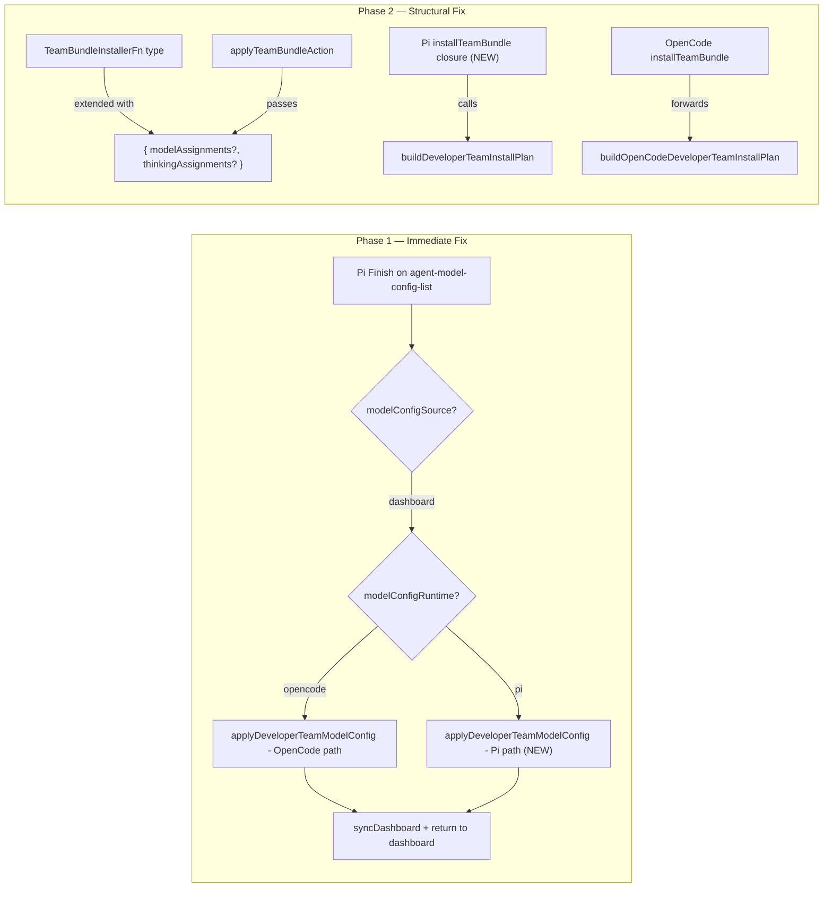

# Spec: Fix TUI Developer Team Model Assignment Bug

## Source

- Proposal: `tui-model-fix` proposal artifact
- Capabilities affected: `pi-dashboard-model-persistence` (new), `apply-team-bundle-action` (modified), `pi-install-team-bundle` (modified)

## Requirements

### Capability: pi-dashboard-model-persistence

REQ-PMP-001: When the user finishes configuring Developer Team models from the Pi TUI dashboard (modelConfigSource === "dashboard", modelConfigRuntime === "pi") and presses Finish on the agent-model-config-list screen, the system MUST persist model and thinking assignments to `.pi/agents/*.md` files immediately before returning to the dashboard.
  Priority: MUST
  Surface: Data
  Rationale: The current code path only calls `syncDashboardDeveloperTeamModelConfig()` for Pi, which updates React state but never writes to disk. Users' model selections are lost.

REQ-PMP-002: The persisted assignments MUST match the in-memory `modelAssignments` and `thinkingAssignments` state that the user configured during the model-config flow.
  Priority: MUST
  Surface: Data
  Rationale: The persisted state must be consistent with what the user saw on screen.

REQ-PMP-003: If persistence fails (write error, verification failure), the system MUST roll back any partially-written agent files and report the failure via the install results UI.
  Priority: MUST
  Surface: UI
  Rationale: Mirrors the existing rollback behavior of `applyDeveloperTeamModelConfig()` for both OpenCode and Pi paths.

REQ-PMP-004: OpenCode model configuration persistence from the dashboard (modelConfigSource === "dashboard", modelConfigRuntime === "opencode") MUST continue to work without regression.
  Priority: MUST
  Surface: Data
  Rationale: OpenCode path is already working; changes to the Pi branch must not affect it.

### Capability: apply-team-bundle-action

REQ-ABA-001: The `TeamBundleInstallerFn` type MUST accept optional `modelAssignments` and `thinkingAssignments` parameters in its options object, in addition to the existing `memoryProvider`.
  Priority: MUST
  Surface: API
  Rationale: The installer function currently has no way to receive model/thinking assignments from the action runner. The type signature must be extended to accept these.

REQ-ABA-002: The `applyTeamBundleAction` function MUST extract model and thinking assignments from the runner action context and pass them to the `TeamBundleInstallerFn` installer.
  Priority: MUST
  Surface: Integration
  Rationale: Without forwarding assignments, even if the type accepts them, the data would never reach the installer.

REQ-ABA-003: The `TeamBundleInstallerFn` options change MUST be backward-compatible — existing callers that pass only `{ memoryProvider }` or `undefined` MUST continue to compile and function correctly.
  Priority: MUST
  Surface: API
  Rationale: Adding optional keys to an already-optional options object is a non-breaking change. This must be verified.

### Capability: pi-install-team-bundle

REQ-PIB-001: When the Pi dashboard runs an `apply-team-bundle` action, the system MUST provide a `TeamBundleInstallerFn` closure that builds a Pi Developer Team install plan using the current model and thinking assignments and applies it.
  Priority: MUST
  Surface: Integration
  Rationale: Currently `installTeamBundle` is `undefined` for Pi (only OpenCode provides a closure). Pi dashboard review/install cannot apply team bundles.

REQ-PIB-002: The Pi `installTeamBundle` closure MUST call `buildDeveloperTeamInstallPlan` with the forwarded `modelAssignments` and `thinkingAssignments`, apply the plan via `applyDeveloperTeamInstall`, verify via `verifyDeveloperTeamInstall`, and roll back on verification failure.
  Priority: MUST
  Surface: Integration
  Rationale: Mirrors the structural pattern used by both the OpenCode closure and the existing `applyDeveloperTeamModelConfig()` function.

REQ-PIB-003: The OpenCode `installTeamBundle` closure MUST forward any `modelAssignments` and `thinkingAssignments` it receives to `buildOpenCodeDeveloperTeamInstallPlan`.
  Priority: SHOULD
  Surface: Integration
  Rationale: The OpenCode closure currently ignores model assignments. Forwarding them ensures the structural fix is complete across both runtimes.

## Acceptance Scenarios

### Capability: pi-dashboard-model-persistence

#### Scenario: Pi dashboard model config persists on Finish
**Given** the user is on the Pi Runner dashboard and has selected "Configure Developer Team models"
**And** the modelConfigRuntime is "pi"
**And** the user has configured model and thinking assignments for at least one agent
**When** the user presses Finish on the agent-model-config-list screen
**Then** `applyDeveloperTeamModelConfig()` is called (Pi path)
**And** `.pi/agents/*.md` files contain the user's selected model and thinking values in frontmatter
**And** the dashboard is shown (screen resets to "pi-runner-dashboard")
> Covers: REQ-PMP-001, REQ-PMP-002

#### Scenario: Pi dashboard model config rollback on verification failure
**Given** the user finishes Pi model configuration from the dashboard
**And** the `verifyDeveloperTeamInstall` step fails
**When** the system processes the failure
**Then** agent files are rolled back to their pre-change state via `rollbackDeveloperTeamFiles`
**And** a failure result is added to install results
> Covers: REQ-PMP-003

#### Scenario: Pi dashboard model config rollback on write error
**Given** the user finishes Pi model configuration from the dashboard
**And** `applyDeveloperTeamInstall` throws an error
**When** the error is caught
**Then** agent files are rolled back to their pre-change state
**And** a failure result with the error message is added to install results
> Covers: REQ-PMP-003

#### Scenario: OpenCode dashboard model config unchanged
**Given** the user configures models from the OpenCode dashboard
**When** the user presses Finish on the agent-model-config-list screen
**Then** `applyDeveloperTeamModelConfig()` is called (OpenCode path)
**And** behavior is identical to the current production behavior
> Covers: REQ-PMP-004

#### Scenario: Install-source model config unchanged
**Given** modelConfigSource is "install" (not "dashboard")
**When** the user presses Finish on the agent-model-config-list screen
**Then** the screen transitions to "memory-provider-selection" as before
**And** no immediate model persistence occurs
> Covers: REQ-PMP-004

### Capability: apply-team-bundle-action

#### Scenario: TeamBundleInstallerFn accepts model and thinking assignments
**Given** a `TeamBundleInstallerFn` implementation
**When** it is called with `{ modelAssignments: { "deck-developer-orchestrator": "openai/gpt-5" }, thinkingAssignments: { "deck-developer-orchestrator": "high" }, memoryProvider: ... }`
**Then** the function receives all three parameters
**And** can use them to build the install plan
> Covers: REQ-ABA-001, REQ-ABA-003

#### Scenario: TeamBundleInstallerFn backward compatibility
**Given** an existing caller that invokes a `TeamBundleInstallerFn` with only `{ memoryProvider }`
**When** the type is updated to also accept `modelAssignments` and `thinkingAssignments`
**Then** the existing call compiles without error
**And** `modelAssignments` and `thinkingAssignments` are `undefined` in the options
> Covers: REQ-ABA-003

#### Scenario: TeamBundleInstallerFn called with no options
**Given** a caller that invokes `installer(projectRoot)` with no options
**When** the type is updated
**Then** the call compiles and runs correctly
> Covers: REQ-ABA-003

#### Scenario: applyTeamBundleAction passes assignments to installer
**Given** an `apply-team-bundle` action is being executed
**And** the action context includes model and thinking assignments
**When** `applyTeamBundleAction` runs
**Then** it passes the assignments to the `installer` function via the options object
> Covers: REQ-ABA-002

### Capability: pi-install-team-bundle

#### Scenario: Pi dashboard applies team bundle with assignments
**Given** the Pi Runner dashboard runs an `apply-team-bundle` action during Review & Install
**And** model and thinking assignments are available
**When** the `installTeamBundle` closure executes
**Then** it calls `buildDeveloperTeamInstallPlan` with the assignments
**And** applies the plan via `applyDeveloperTeamInstall`
**And** verifies via `verifyDeveloperTeamInstall`
**And** returns results
> Covers: REQ-PIB-001, REQ-PIB-002

#### Scenario: Pi team bundle rollback on verification failure
**Given** the Pi `installTeamBundle` closure applies a plan
**And** `verifyDeveloperTeamInstall` returns `valid: false`
**When** the verification failure is detected
**Then** the closure rolls back via `rollbackDeveloperTeamFiles`
**And** throws an error with a descriptive message
> Covers: REQ-PIB-002

#### Scenario: OpenCode installTeamBundle forwards assignments
**Given** the OpenCode dashboard runs an `apply-team-bundle` action
**And** model and thinking assignments are provided in the options
**When** the `installTeamBundle` closure executes
**Then** it passes the assignments to `buildOpenCodeDeveloperTeamInstallPlan`
> Covers: REQ-PIB-003

## Validation Rules

| Field / Input | Rule | Error Condition | REQ-ID |
|---|---|---|---|
| modelAssignments | Must be a `Record<string, string>` mapping agent IDs to model IDs | Type mismatch causes compile error | REQ-ABA-001 |
| thinkingAssignments | Must be a `Record<string, string>` mapping agent IDs to thinking levels | Type mismatch causes compile error | REQ-ABA-001 |
| TeamBundleInstallerFn options | All fields are optional; backward-compatible with existing callers | N/A — compile-time guarantee | REQ-ABA-003 |
| Pi agent frontmatter model | Must match a model ID from `modelAssignments` after persistence | Mismatch between frontmatter and user selection | REQ-PMP-002 |

## Error Contracts

| Condition | Behavior | REQ-ID |
|---|---|---|
| Pi model persistence: verification failure | Roll back agent files, add failure result to install results, return to dashboard | REQ-PMP-003 |
| Pi model persistence: apply throws | Roll back agent files, add failure result with error message | REQ-PMP-003 |
| Pi installTeamBundle: verification failure | Roll back agent files, throw Error with descriptive message | REQ-PIB-002 |
| installTeamBundle not provided | `applyTeamBundleAction` returns skipped result with diagnostic message | Existing behavior (unchanged) |
| projectRoot not provided | `applyTeamBundleAction` returns skipped result with diagnostic message | Existing behavior (unchanged) |

## States and Transitions

> No meaningful state lifecycle changes. The fix modifies behavior within existing screen transitions (agent-model-config-list → pi-runner-dashboard) and extends function signatures. The state machine of the TUI screens remains unchanged.

## Open Questions

1. Does the Pi dashboard review plan (`buildPiRunnerReviewPlan` or equivalent) currently generate any `apply-team-bundle` actions? If not, Phase 2 may also require updating the Pi plan builder to include team-application actions when the Developer Team capability is selected.
2. Should the Pi `installTeamBundle` closure also handle capability instructions and standalone skills (as the OpenCode closure does)? The current Pi `developer-team-installing` path does not pass these.
3. How should `applyTeamBundleAction` obtain model/thinking assignments — from the action's diagnostics, from the dependencies object, or from a new field on `RunnerAction`? The current `RunnerAction` type has no assignments field.

## Compliance Matrix

| REQ-ID | Scenario(s) | Status |
|---|---|---|
| REQ-PMP-001 | Pi dashboard model config persists on Finish | Defined |
| REQ-PMP-002 | Pi dashboard model config persists on Finish | Defined |
| REQ-PMP-003 | Pi dashboard model config rollback on verification failure; rollback on write error | Defined |
| REQ-PMP-004 | OpenCode dashboard model config unchanged; Install-source model config unchanged | Defined |
| REQ-ABA-001 | TeamBundleInstallerFn accepts model and thinking assignments | Defined |
| REQ-ABA-002 | applyTeamBundleAction passes assignments to installer | Defined |
| REQ-ABA-003 | TeamBundleInstallerFn backward compatibility; called with no options | Defined |
| REQ-PIB-001 | Pi dashboard applies team bundle with assignments | Defined |
| REQ-PIB-002 | Pi dashboard applies team bundle with assignments; Pi team bundle rollback | Defined |
| REQ-PIB-003 | OpenCode installTeamBundle forwards assignments | Defined |

## Mermaid Summary Source

