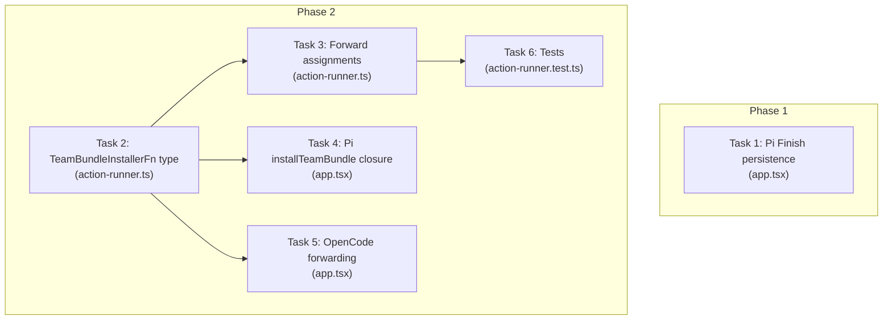

# Tasks: Fix TUI Developer Team Model Assignment Bug

## Source

- Spec: tui-model-fix spec artifact
- Design: tui-model-fix design artifact
- Capabilities affected: `pi-dashboard-model-persistence`, `apply-team-bundle-action`, `pi-install-team-bundle`

## Task Groups

### Group: Phase 1 — Immediate Fix

#### Task 1: Add Pi dashboard Finish persistence in `app.tsx`

**Owner**: General Apply
**Priority**: P0
**Complexity**: Low
**Parallel**: Yes
**Depends on**: none

**Description**
In `apps/cli/src/tui/app.tsx`, find the `agent-model-config-list` screen Finish handler where `modelConfigSource === "dashboard"`. Currently the code calls `applyDeveloperTeamModelConfig()` only when `modelConfigRuntime === "opencode"`, then calls `syncDashboardDeveloperTeamModelConfig()` for all runtimes. Add a parallel branch for `modelConfigRuntime === "pi"` that also calls `applyDeveloperTeamModelConfig()` before `syncDashboardDeveloperTeamModelConfig()`. This mirrors the existing OpenCode path.

**Files**
- `apps/cli/src/tui/app.tsx` — modify

**Verification**
- Typecheck passes (`tsc --noEmit` or equivalent)
- Existing OpenCode dashboard Finish path behavior is unchanged
- Pi dashboard Finish path now calls `applyDeveloperTeamModelConfig()` before syncing state

---

### Group: Phase 2 — Shared / Contracts

#### Task 2: Extend `TeamBundleInstallerFn` type with assignment options

**Owner**: General Apply
**Priority**: P0
**Complexity**: Low
**Parallel**: Yes
**Depends on**: none

**Description**
In `apps/cli/src/tui/pi-runner-dashboard/action-runner.ts`, extend the `TeamBundleInstallerFn` options type to include optional `modelAssignments` and `thinkingAssignments` fields. Import the relevant types (`DeveloperTeamModelAssignments`, `DeveloperTeamThinkingAssignments`) if not already imported. The new fields must be optional to maintain backward compatibility with callers that pass only `{ memoryProvider }` or no options.

**Files**
- `apps/cli/src/tui/pi-runner-dashboard/action-runner.ts` — modify

**Verification**
- Typecheck passes
- Existing callers of `TeamBundleInstallerFn` compile without changes
- New fields appear as `optional` in the type

---

### Group: Phase 2 — Integration

#### Task 3: Update `applyTeamBundleAction` to forward assignments

**Owner**: General Apply
**Priority**: P1
**Complexity**: Low
**Parallel**: No — depends on Task 2 (type must exist first)
**Depends on**: Task 2

**Description**
In `apps/cli/src/tui/pi-runner-dashboard/action-runner.ts`, update the `applyTeamBundleAction` function body to extract `modelAssignments` and `thinkingAssignments` from `dependencies.dashboardState?.teams["developer-team"]` and pass them in the options object when calling `dependencies.installTeamBundle(projectRoot, { memoryProvider, modelAssignments?, thinkingAssignments? })`. Preserve existing behavior when assignments are absent.

**Files**
- `apps/cli/src/tui/pi-runner-dashboard/action-runner.ts` — modify

**Verification**
- Typecheck passes
- When dashboard state has team assignments, installer receives them
- When dashboard state has no assignments, installer receives `undefined` (existing behavior)

---

#### Task 4: Implement Pi `installTeamBundle` closure in `app.tsx`

**Owner**: General Apply
**Priority**: P1
**Complexity**: Medium
**Parallel**: No — depends on Task 2 (type contract)
**Depends on**: Task 2

**Description**
In `apps/cli/src/tui/app.tsx`, implement the Pi `installTeamBundle` closure (currently `undefined` for Pi). The closure must:
1. Accept `(projectRoot, options?)` per `TeamBundleInstallerFn`.
2. Call `buildDeveloperTeamInstallPlan` with `options.modelAssignments`, `options.thinkingAssignments`, and `preserveMissingThinkingAssignments: true`.
3. Backup existing files, then apply via `applyDeveloperTeamInstall`.
4. Verify via `verifyDeveloperTeamInstall`.
5. On verification failure or apply error, roll back via `rollbackDeveloperTeamFiles` and throw with a descriptive message.
6. Return install results.

This mirrors the existing `applyDeveloperTeamModelConfig()` Pi path pattern.

**Files**
- `apps/cli/src/tui/app.tsx` — modify

**Verification**
- Typecheck passes
- Pi closure is assigned (not `undefined`) when `modelConfigRuntime === "pi"`
- Closure calls build/apply/verify/rollback in correct order

---

#### Task 5: Update OpenCode `installTeamBundle` to forward assignments

**Owner**: General Apply
**Priority**: P2
**Complexity**: Low
**Parallel**: No — depends on Task 2 (type contract)
**Depends on**: Task 2

**Description**
In `apps/cli/src/tui/app.tsx`, update the existing OpenCode `installTeamBundle` closure to forward `options.modelAssignments` and `options.thinkingAssignments` to `buildOpenCodeDeveloperTeamInstallPlan`. Map them to `configModelOverrides` and `reasoningEffortOverrides` respectively (matching the existing `applyDeveloperTeamModelConfig()` OpenCode path). When assignments are absent, preserve current behavior (default values).

**Files**
- `apps/cli/src/tui/app.tsx` — modify

**Verification**
- Typecheck passes
- OpenCode closure forwards assignments when present
- OpenCode closure works identically when assignments are absent

---

### Group: Phase 2 — Tests

#### Task 6: Update `action-runner.test.ts` for assignment forwarding

**Owner**: General Apply
**Priority**: P1
**Complexity**: Medium
**Parallel**: No — depends on Tasks 2, 3
**Depends on**: Task 2, Task 3

**Description**
In `apps/cli/src/tui/pi-runner-dashboard/action-runner.test.ts`, add/update tests for:
1. `applyTeamBundleAction` passes `modelAssignments` and `thinkingAssignments` to the installer when dashboard state contains Developer Team assignments.
2. `applyTeamBundleAction` still passes `memoryProvider` alongside assignments.
3. Backward compatibility: installer called with only `{ memoryProvider }` still works.
4. Existing memory-provider sequencing and redaction assertions are preserved.

**Files**
- `apps/cli/src/tui/pi-runner-dashboard/action-runner.test.ts` — modify

**Verification**
- All tests pass (`vitest run` or equivalent)
- New test cases cover REQ-ABA-001, REQ-ABA-002, REQ-ABA-003 scenarios

---

## Dependency Graph

```
Task 1 (Phase 1 — Immediate Fix)
  [independent, can run now]

Task 2 (Phase 2 — Type contract)
  → Task 3 (Forward assignments)
  → Task 4 (Pi closure)
  → Task 5 (OpenCode forwarding)
  Task 3 → Task 6 (Tests)
```

## Parallelization Plan

| Phase | Tasks | Can Run in Parallel |
|---|---|---|
| Phase 1 | 1 | Yes — independent of all Phase 2 work |
| Phase 2 Contracts | 2 | Yes — independent of Phase 1 |
| Phase 2 Integration | 3, 4, 5 | Yes — all depend only on Task 2, can run in parallel with each other (but see hidden coupling) |
| Phase 2 Tests | 6 | No — depends on Tasks 2 and 3 |

## Hidden Coupling

- **Tasks 1, 4, 5 all modify `app.tsx`**: Task 1 (Phase 1) touches the Finish handler; Tasks 4 and 5 (Phase 2) touch the `installTeamBundle` closures. These are different sections of the file but concurrent edits risk merge conflicts. **Recommendation**: Run Task 1 first (Phase 1 is independent), then Tasks 4 and 5 sequentially or with careful coordination.
- **Tasks 2 and 3 both modify `action-runner.ts`**: Task 2 adds type fields; Task 3 adds runtime forwarding. Should be done sequentially (Task 2 → Task 3).

## Responsibility Contracts

| Contract / Boundary | Owner | Consumers | Notes |
|---|---|---|---|
| `TeamBundleInstallerFn` options type | Task 2 (General Apply) | Tasks 3, 4, 5, 6 | Type must be in place before any consumer can compile |
| `applyTeamBundleAction` forwarding | Task 3 (General Apply) | Task 6 (tests verify it) | Runtime behavior depends on type from Task 2 |
| Pi `installTeamBundle` closure | Task 4 (General Apply) | Dashboard Review & Install flow | Must follow Task 2 for type contract |
| OpenCode `installTeamBundle` forwarding | Task 5 (General Apply) | Dashboard Review & Install flow | Must follow Task 2 for type contract |

## Complexity Summary

| Complexity | Count | Task Numbers |
|---|---|---|
| Low | 4 | 1, 2, 3, 5 |
| Medium | 2 | 4, 6 |
| High | 0 | — |

## Flagged for Splitting

None — all tasks are scoped to ≤2 files and have clear boundaries.

## Review Workload Forecast

| Signal | Value |
|---|---|
| Estimated changed lines | 100-400 |
| 400-line budget risk | Low |
| Scope reduction recommended | No |
| Sequential work slices recommended | Yes — Phase 1 first, then Phase 2 contracts, then Phase 2 integration in order |
| Decision needed before Apply | No |

**Rationale**: Phase 1 is a ~10-line change. Phase 2 touches 3 files with ~150-300 total lines of changes. The Pi closure (Task 4) is the most complex but follows an existing pattern. Tests (Task 6) add coverage but no structural changes. Low risk overall.

## Open Questions / Blockers

None — tasks are ready for Apply.

## Mermaid Summary Source


