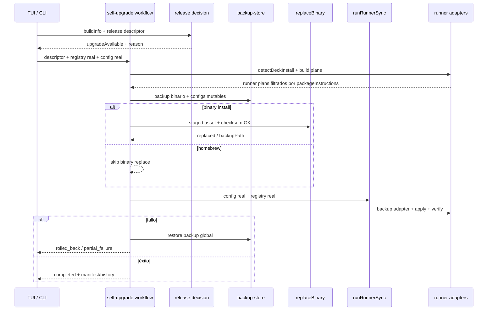

# Diseño: Sincronizar update/upgrade desde la TUI y CLI

## Source

- Proposal: `openspec/changes/tui-update-upgrade-sync/proposal.md`
- Exploration: `openspec/changes/tui-update-upgrade-sync/exploration.md`
- Change ID: `tui-update-upgrade-sync`
- Capacidades afectadas:
  - Nuevas: `self-upgrade-runner-sync`, `runner-config-backup-before-sync`, `upgrade-availability-reporting`
  - Modificadas: `deck-upgrade`, `tui-upgrade`, `binary-upgrade`
  - Sin cambios: `runner-install-detection`, `package-instruction-selection`, `homebrew-upgrade-handling`
- Estado de Spec: no disponible todavía / corre en paralelo.
- Modo registry: deferred; este artifact no actualiza `state.yaml` ni `events.yaml`.

## Contexto actual de arquitectura

| Área | Estado actual relevante |
|---|---|
| TUI release check | `apps/cli/src/tui/release-check.ts` decide disponibilidad de release y la TUI muestra banner/menu. |
| TUI upgrade action | `apps/cli/src/tui/app.tsx` llama `runUpgradeOrchestrator`, pero inyecta `adapterRegistry` vacío y `readDeckConfig: getDefaultDeckConfig()`, por lo que el sync real queda neutralizado. |
| CLI `deck upgrade/update` | `apps/cli/src/upgrade-command/index.ts` (`runUpgrade`) usa `performUpgrade` y termina tras reemplazar binario; no ejecuta `runRunnerSync`. |
| Self-upgrade workflow | `apps/cli/src/upgrade-command/orchestrator.ts` ya modela lock → descriptor → backup → binary → content → verify → manifest/history, pero `runBinaryItem` solo verifica checksum/staged asset y no reemplaza el binario. |
| Sync por runner | `apps/cli/src/upgrade-command/runner-sync.ts` ya detecta instalación con `adapter.detectDeckInstall`, lee `packageInstructions` mediante `getEnabledPackageInstructionIds(config, runnerId)`, planifica, respalda vía adapter, aplica y verifica. |
| Registro real de adapters | `apps/cli/src/runner-adapters.ts` expone `createDefaultAdapterRegistry()` con adapters `pi` y `opencode`. |
| Backup global | `apps/cli/src/upgrade-command/backup-store.ts` respalda archivos con `owner`, `kind` y checksum, pero el workflow solo alimenta binario/content tarball; no los archivos mutables de runners. |
| Adapters | `packages/adapter-opencode` y `packages/adapter-pi` implementan `backupDeveloperTeamFiles` / `rollbackDeveloperTeamFiles`; su backup es útil para rollback local, pero no sustituye la trazabilidad del backup global. |
| Doctor | `DoctorBinaryResult.upgradeAvailable` existe en `apps/cli/src/doctor-command/types.ts`, pero `runDoctorDiagnostics` no puebla `result.binary`; `doctor-report` no puede renderizar disponibilidad real. |

## Arquitectura propuesta

Usar un **self-upgrade workflow compartido** como frontera técnica entre TUI y CLI. TUI y CLI deben construir una misma intención de upgrade —release descriptor, versión actual, ruta de binario, registry real y config real— y delegar en `runSelfUpgradeWorkflow` o en el nombre existente `runUpgradeOrchestrator` con contrato ampliado.

El workflow debe coordinar dependencias inyectables para que el comportamiento productivo sea real y los tests sean deterministas: release/download/staging, checksum, reemplazo binario, backup global, sync por runner, rollback y decisión de disponibilidad.

### Decisiones de diseño principales

1. **Unificar comportamiento, no necesariamente todo el CLI UX.**
   - El ejecutor común vive en `apps/cli/src/upgrade-command/orchestrator.ts`.
   - `deck upgrade/update` puede delegar directamente al workflow o usar un wrapper `runCliSelfUpgrade` que preserve prompts/flags y llame al workflow.
   - La TUI debe dejar de inyectar placeholders y usar los mismos defaults productivos.
2. **Agregar una dependencia explícita de reemplazo binario.**
   - Extender `OrchestratorDeps` con `replaceBinary(input): Promise<ReplaceBinaryResult>` o equivalente.
   - Implementación productiva puede reutilizar/extractar de `performUpgrade`/`atomicReplace`, pero el workflow debe llamar esa dependencia después de validar checksum.
3. **Separar staging/download de replace.**
   - Release descriptor decide qué asset aplica.
   - Download/staging deja el asset disponible en `resolveStagedAsset(version, assetName)`.
   - `runBinaryItem` verifica checksum sobre staged asset y luego llama `replaceBinary` para reemplazo atómico.
4. **Backup global antes de cualquier mutación.**
   - Antes del binary replace y antes del runner sync, recolectar binario actual + archivos mutables de cada plan de runner instalado.
   - Mantener `adapter.backupDeveloperTeamFiles(plan)` dentro de `runRunnerSync` como rollback local rápido, pero registrar también esos paths en `backup-store.ts` para trazabilidad global.
5. **Sync solo por runner instalado y capacidad habilitada.**
   - `runRunnerSync` sigue siendo la autoridad de detección, selección y apply.
   - El workflow puede precomputar planes para backup, pero debe usar las mismas reglas: `adapter.detectDeckInstall`, `getEnabledPackageInstructionIds`, `buildCapabilityInstructionBundle`, `adapter.buildDeveloperTeamInstallPlan`.
6. **Serena y capacidades opcionales siguen siendo data-driven.**
   - No special-case de Serena salvo tests específicos.
   - Si `config.packageInstructions[runnerId].serena !== true`, el bundle no debe incluir Serena aunque el adapter soporte archivos de Serena.
7. **Doctor/TUI consumen una decisión única de release.**
   - Reutilizar `decideReleaseAvailability(currentVersion, currentCommit, latestVersion, latestCommit)` para `upgradeAvailable`.
   - `runDoctorDiagnostics` debe poblar `binary.upgradeAvailable`, `currentVersion`, `latestVersion` y motivo/metadata suficiente para presentación.

## Componentes / límites de módulo

| Componente | Responsabilidad | Cambio |
|---|---|---|
| `apps/cli/src/upgrade-command/orchestrator.ts` | Workflow común: lock, backup, binary, content sync, verify, rollback, manifest/history. | Modificar |
| `apps/cli/src/upgrade-command/install.ts` | Primitivas de download/extract/checksum/atomic replace; fuente productiva de `replaceBinary`. | Modificar o extraer helper |
| `apps/cli/src/upgrade-command/index.ts` | UX CLI `deck upgrade/update`: flags, confirmación, resolución release, delegación al workflow/wrapper. | Modificar |
| `apps/cli/src/upgrade-command/runner-sync.ts` | Sync por runner instalado y package instructions habilitadas. | Modificar menor / reutilizar |
| `apps/cli/src/upgrade-command/backup-store.ts` | Backup global de binario y archivos mutables de runners con manifest reversible. | Modificar |
| `apps/cli/src/runner-adapters.ts` | Registry productivo de adapters `pi`/`opencode`. | Reutilizar |
| `apps/cli/src/tui/app.tsx` | Acción de upgrade en TUI; debe pasar registry/config reales y deps productivas. | Modificar |
| `apps/cli/src/tui/release-check.ts` | Check no bloqueante de releases para la TUI. | Reutilizar / alinear decisión |
| `apps/cli/src/doctor-command/doctor-diagnostics.ts` | Construcción de `DoctorBinaryResult` y release decision. | Modificar |
| `apps/cli/src/doctor-command/doctor-report.ts` / TUI doctor screen | Presentación de `upgradeAvailable`. | Modificar menor si el contrato existente alcanza |
| `packages/core/src/config/deck-config.ts` | Config real y `packageInstructions`; defaults solo como fallback de ausencia. | Reutilizar |
| `packages/core/src/teams/developer/instruction-bundles/index.ts` | Selección de paquetes/capacidades por runner. | Reutilizar |
| `packages/adapter-opencode/src/runner-adapter.ts` | Detectar instalación y plan/apply/backup/rollback de OpenCode. | Reutilizar; tests de interacción |
| `packages/adapter-pi/src/runner-adapter.ts` | Detectar instalación y plan/apply/backup/rollback de Pi. | Reutilizar; tests de interacción |

## Flujo de datos

1. **Release decision**
   - TUI/Doctor/CLI obtienen build local (`getBuildInfo`) y release remoto (`fetchReleaseDescriptor` o wrapper existente).
   - Se calcula disponibilidad con `decideReleaseAvailability`.
2. **Inicio del upgrade**
   - TUI confirma upgrade y llama al workflow con descriptor ya capturado.
   - CLI confirma con `--yes` o prompt y llama al mismo workflow/wrapper.
3. **Resolución de dependencias productivas**
   - `adapterRegistry`: `createDefaultAdapterRegistry()`.
   - `readDeckConfig`: `readGlobalDeckConfig()` o lectura normalizada equivalente, no `getDefaultDeckConfig()` salvo fallback real de archivo ausente.
   - `currentBinaryPath`: `process.execPath ?? process.argv[0]`.
   - `installKind`: `detectInstallKind(currentBinaryPath)`.
4. **Planificación previa para backup**
   - Seleccionar binary item por platform.
   - Para content items, detectar runners instalados y construir planes usando config real.
   - Convertir `plan.files` a targets de backup global: `owner: runner:${runnerId}`, `kind` por `classifyFile`, `sourcePath` absoluto o resoluble por adapter.
5. **Backup**
   - Crear backup global con binario actual y todos los archivos mutables planificados.
   - Registrar `backupId` en estado activo.
6. **Binary phase**
   - Si `installKind === development`: rechazar.
   - Si `installKind === homebrew`: no reemplazar binario, continuar a content sync.
   - Si `binary/unknown`: resolver staged asset, verificar SHA-256 y ejecutar `replaceBinary` atómico.
7. **Content sync phase**
   - Ejecutar `runRunnerSync` con registry/config reales.
   - Sync se omite por runner no instalado o sin selecciones.
   - Aplicar manifest de archivos escritos.
8. **Verify/finalización**
   - Si todo pasa: escribir state/manifest/history y retention best-effort.
   - Si falla: rollback según fase y backup disponible.

## Contratos e interfaces

| Interface / contrato | Cambio | Compatible |
|---|---|---|
| `OrchestratorDeps` | Agregar `replaceBinary`, y opcionalmente helpers de `download/stage` o `collectRunnerBackupTargets` si se extraen. Defaults productivos deben usar registry/config reales. | Parcial; tests existentes deben ajustar fakes. |
| `runUpgradeOrchestrator` / `runSelfUpgradeWorkflow` | Debe ejecutar reemplazo binario real y sync real cuando recibe deps productivas. Puede conservar alias del nombre viejo para compatibilidad. | Sí si se mantiene export anterior. |
| `runUpgrade(args)` | Delegar al workflow o wrapper que incluye sync tras binary. Flags existentes (`--yes`, `--version`) se conservan. | Sí. |
| `RunnerSyncInput` | Sin cambio obligatorio; si se desea preplan para backup, agregar helper separado para evitar mutar el contrato principal. | Sí. |
| `CreateBackupInput.files` | Incluir owners `runner:${id}` y kinds `config/prompt/skill/subagent/mcp/content` para archivos mutables. | Sí; es extensión de datos. |
| `DoctorBinaryResult` | Poblar campos ya existentes y, si falta, añadir `reason`/`latestCommit` solo si presentación lo necesita. | Sí/Parcial según campos nuevos. |
| `ReleaseCheckState` | Alinear razón de disponibilidad con `decideReleaseAvailability`; no requiere romper render actual. | Sí. |

### Forma sugerida de dependencias inyectables

```ts
type ReplaceBinaryInput = {
  stagedAssetPath: string;
  currentBinaryPath: string;
  expectedSha256: string;
  backupPath?: string;
  itemId: string;
};

type ReplaceBinaryResult = {
  replaced: boolean;
  backupPath?: string;
  diagnostics?: string[];
};
```

La implementación productiva puede adaptar `performUpgrade` o extraer de `install.ts` una primitiva que no haga red si el asset ya está staged. En tests, `replaceBinary` debe ser un mock que registra input y simula éxito/fallo sin writes reales.

## Modelo de backup

| Target | Momento | Owner | Rollback |
|---|---|---|---|
| Binario actual | Antes de `replaceBinary` | `deck` | Restaurar desde backup global si falla binary, sync o verify. |
| Asset/content staged | Opcional/trazabilidad | `deck` | No es necesario restaurar; puede registrarse como `content` no crítico. |
| Config de runner (`opencode.json`, `AGENTS.md`, `packageInstructions.json`, prompts/skills/agentes/MCP) | Antes de sync | `runner:${runnerId}` | Restaurar desde backup global; adapter rollback queda como primera línea local. |
| Manifest/state de Deck | Si serán mutados | `deck` | Restaurar cuando la mutación ocurra antes de una falla fatal. |

### Recolección de archivos de runner

- Crear helper interno, por ejemplo `collectRunnerBackupTargets(deps, config): Promise<CreateBackupInput['files']>`.
- Para cada adapter registrado:
  - `detectDeckInstall(projectRoot)`; si no instalado, no incluir targets.
  - `enabledIds = getEnabledPackageInstructionIds(config, runnerId)`; si vacío, no incluir targets.
  - `bundle = buildCapabilityInstructionBundle(enabledIds)`.
  - `plan = adapter.buildDeveloperTeamInstallPlan(...)`.
  - Mapear `plan.files` a paths mutables existentes antes de aplicar.
- Si un archivo planificado no existe aún, el backup debe registrar manifest de “ausente antes” para permitir rollback por delete si el sync lo crea y luego falla. Si `backup-store.ts` no soporta ausentes, esa extensión queda dentro del alcance técnico.

## Estrategia para Serena y capacidades opcionales

- Serena se trata como cualquier `CapabilityInstructionPackageId` opcional.
- La única fuente de verdad es `NormalizedDeckConfig.packageInstructions[runnerId]`.
- La TUI/CLI nunca deben inferir Serena desde defaults salvo ausencia real de config; deben leer config real.
- Tests mínimos:
  - `serena: false` con runner instalado → no hay archivos Serena en `plan.files` ni writes.
  - `serena: true` → se incluyen solo para runners que lo soportan y están instalados.
  - Runner instalado sin selecciones habilitadas → outcome `skipped` / `no-selections`, sin backup de runner.

## Doctor/TUI `upgradeAvailable`

- `runDoctorDiagnostics` debe construir `binary: DoctorBinaryResult` además de categorías genéricas.
- La decisión debe usar `decideReleaseAvailability`, no solo comparación semver legacy.
- `upgradeAvailable = decision.kind === 'available'`.
- TUI y Doctor deben renderizar de forma consistente:
  - `newer-version`: upgrade disponible normal.
  - `same-version-different-commit`: upgrade disponible si no es dev build.
  - `local-newer`, `same-build`, `missing-commit`, `dev-build`: no disponible con razón diagnóstica.

## Secuencia de rollback

| Falla | Acción |
|---|---|
| Falla release descriptor/checksum antes de mutar | Liberar lock; no rollback de archivos requerido. |
| Falla `replaceBinary` | Restaurar binario desde backup global o backup path de atomic replace; abortar content sync. |
| Falla sync de un runner | Intentar `adapter.rollbackDeveloperTeamFiles(adapterBackup)`; si el workflow trata fallo como fatal, restaurar también targets globales del runner afectado. |
| Falla verify final | Restaurar binario y todos los runners modificados desde backup global; registrar `rolled_back`. |
| Falla rollback | Lanzar error `ROLLBACK_FAILED` con `backupId`; no ocultar fallo parcial. |
| Homebrew | No rollback de binario; limitar rollback a contenido/config de runners modificados. |

## Estado / persistencia

- No hay migración de schema persistente requerida.
- Se mantiene `state.yaml`/manifest/history del sistema de upgrade existente.
- `backup-store.ts` puede requerir representar archivos ausentes antes del sync; si se añade, debe ser compatible con manifests existentes.
- Este artifact no modifica Spec Registry por modo registry-deferred.

## Migración / compatibilidad

- Mantener export `runUpgradeOrchestrator` si se introduce alias `runSelfUpgradeWorkflow`, para no romper imports/tests existentes.
- `deck upgrade` y `deck update` conservan flags UX existentes; solo cambia el efecto funcional para incluir sync.
- Instalaciones Homebrew conservan comportamiento de no reemplazar binario directo.
- Defaults de config siguen disponibles como fallback cuando no existe config real, no como sustituto explícito del estado usuario.

## Impacto probable de archivos

| Archivo / path | Acción | Razón |
|---|---|---|
| `apps/cli/src/upgrade-command/orchestrator.ts` | Modificar | Agregar `replaceBinary`, defaults reales, backup de runner targets, rollback más explícito. |
| `apps/cli/src/upgrade-command/install.ts` | Modificar | Extraer/reutilizar primitiva de reemplazo atómico desde asset staged. |
| `apps/cli/src/upgrade-command/index.ts` | Modificar | CLI `deck upgrade/update` debe usar workflow común o wrapper con sync. |
| `apps/cli/src/upgrade-command/runner-sync.ts` | Modificar menor | Posible helper compartido para preplan/backup; mantener lógica actual. |
| `apps/cli/src/upgrade-command/backup-store.ts` | Modificar | Soportar targets de runner y, si hace falta, archivos ausentes previos. |
| `apps/cli/src/tui/app.tsx` | Modificar | Inyectar registry/config reales y deps productivas. |
| `apps/cli/src/runner-adapters.ts` | Reutilizar / posible export | Asegurar acceso consistente desde TUI/CLI. |
| `apps/cli/src/doctor-command/doctor-diagnostics.ts` | Modificar | Poblar `DoctorBinaryResult`. |
| `apps/cli/src/doctor-command/doctor-report.ts` | Modificar menor | Render de reason si se agrega al contrato. |
| `apps/cli/src/tui/screens/doctor-screen.tsx` | Modificar menor | Mostrar disponibilidad si consume diagnóstico directo. |
| `apps/cli/src/upgrade-command/__tests__/orchestrator.test.ts` | Modificar/agregar | Cobertura workflow binary+sync+backup+rollback con mocks. |
| `apps/cli/src/upgrade-command/__tests__/runner-sync.test.ts` | Modificar/agregar | Cobertura capacidades opcionales/Serena y no-selections. |
| `apps/cli/src/upgrade-command/__tests__/index.test.ts` | Modificar/agregar | CLI delega y sincroniza. |
| `apps/cli/src/__tests__/doctor-diagnostics.test.ts` | Modificar/agregar | `upgradeAvailable` commit-aware. |
| `apps/cli/src/tui/__tests__/*` o tests existentes TUI | Modificar/agregar | TUI pasa registry/config reales. |

## Estrategia de testing

Regla oficial: Bun `bun test`; sin instalaciones reales, sin red real, sin writes reales de filesystem en tests; usar mocks deterministas.

| Capa | Casos |
|---|---|
| Unit: `orchestrator` | Llama `replaceBinary` después de checksum correcto; no lo llama en Homebrew; falla checksum aborta antes de replace/sync; rollback se invoca si `replaceBinary` falla; backup incluye binario + runner targets. |
| Unit: backup collection | Runner no instalado no produce targets; runner instalado con selecciones produce paths esperados; archivos inexistentes se registran como ausentes si se soporta. |
| Unit: `runner-sync` | Respeta `packageInstructions`; Serena false no aparece; Serena true aparece; no-selections omite apply/backup. |
| Unit: CLI `runUpgrade` | Con release disponible y confirmación, delega al workflow/wrapper con registry/config reales; conserva rechazo dev mode; no red real mediante mock de release. |
| Unit/TUI | Efecto de upgrade en `app.tsx` inyecta registry real o default deps productivas, no registry vacío ni `getDefaultDeckConfig()` hardcodeado. |
| Doctor | `runDoctorDiagnostics` retorna `binary.upgradeAvailable=true` para `newer-version` y `same-version-different-commit`; false para same build/dev/missing commit. |
| Rollback | Falla de sync parcial restaura adapter backup y/o backup global; falla final reporta `rolled_back`/error esperado con `backupId`. |

Infra de tests:

- Mockear `fetchReleaseDescriptor`/`getLatestReleaseInfo`, `download/stage`, `computeFileSha256`, `replaceBinary`, `createBackup`/`restoreBackup`, adapter registry y config.
- Usar FS virtual/fakes in-memory donde sea posible; si tests existentes usan temp dirs, mantenerlos aislados y deterministas, nunca tocar configs reales del usuario.
- Verificar por llamadas y manifests, no por instalar runners reales.

## Observabilidad y manejo de errores

- Cada fase debe emitir outcome explícito: `binary.status`, `content.status`, `backupId`, outcomes por runner y diagnostics.
- No ocultar fallos de rollback: si rollback falla, reportar `ROLLBACK_FAILED` y preservar `backupId`.
- Para TUI, mapear `partial_failure` y `rolled_back` a mensajes distintos si el workflow puede distinguirlos; no decir “completed” cuando un runner falló.
- Doctor debe incluir razón de no disponibilidad para reducir diagnósticos ambiguos.

## Seguridad / performance / accesibilidad

- Seguridad:
  - Verificación SHA-256 antes del reemplazo binario.
  - No sincronizar capacidades no seleccionadas; esto evita instalar prompts/skills no consentidos.
  - No tocar configs reales en tests.
- Performance:
  - La planificación previa duplica parte del trabajo de `runRunnerSync`. Mantenerla acotada a runners registrados y detectados; es aceptable por seguridad de backup.
- Accesibilidad:
  - Sin cambios específicos; mensajes TUI deben conservar estados claros para screen readers/terminales simples.

## Tradeoffs

| Decisión | Elegido | Alternativa rechazada | Racional |
|---|---|---|---|
| Workflow común | TUI y CLI comparten ejecutor o wrapper equivalente. | Corregir solo TUI. | Evita divergencia y asegura sync en `deck upgrade/update`. |
| Binary replace | Dependencia explícita `replaceBinary` llamada por workflow. | Dejar replace “delegado al caller”. | El estado actual verifica checksum pero no instala; el contrato explícito es testeable. |
| Backup de runner | Backup global + backup adapter local. | Solo backup adapter. | El global da trazabilidad/rollback uniforme; el adapter conserva rollback especializado. |
| Preplan para backup | Construir planes antes de mutar para saber paths exactos. | Respaldar directorios completos. | Menos riesgo de writes amplios y manifest preciso; costo de doble planificación aceptable. |
| Serena | Tratar como paquete opcional data-driven. | Rama especial “Serena gating”. | Evita duplicar semántica; `packageInstructions` ya es la fuente de verdad. |
| Doctor availability | Usar `decideReleaseAvailability` commit-aware. | Usar solo semver `checkUpgradeAvailable`. | Corrige caso same-version-different-commit y alinea TUI/Doctor. |
| Homebrew | Saltar replace binario, sí sync de contenido. | Abort completo en Homebrew. | Respeta canal externo sin impedir actualizar prompts/skills gestionados por Deck. |

## Riesgos

| Riesgo | Probabilidad | Impacto | Mitigación |
|---|---|---|---|
| Sync accidental en runner no instalado | Media | Alto | `detectDeckInstall` obligatorio antes de plan/backup/apply; tests negativos por runner. |
| Serena/capacidad no seleccionada se sincroniza | Media | Alto | Config real + tests Serena false/true por runner. |
| Reemplazo binario deja Deck inutilizable | Media | Alto | Checksum previo, atomic replace, backup binario, rollback probado. |
| Backup global no puede restaurar archivos creados nuevos | Media | Medio | Soportar “absent before” o borrar archivos creados durante rollback. |
| Doble planificación produce inconsistencias | Baja/Media | Medio | Reusar helper compartido para planificar backup y sync o cachear planes por operación. |
| Divergencia de CLI flags | Baja | Medio | Wrapper CLI conserva parse/confirmación y solo delega después. |
| Doctor hace red en tests | Baja | Medio | Inyectar release checker/fetcher determinista. |

## Decisiones abiertas

- Política de retención de backups tras éxito/parcial: mantener comportamiento conservador existente y pruning best-effort; una política definitiva puede quedar para otro cambio.
- Nombre público final: mantener `runUpgradeOrchestrator` como alias o renombrar a `runSelfUpgradeWorkflow`. Diseño recomienda alias para compatibilidad y nombre nuevo para claridad.
- Si el backup global debe registrar también el tarball/content asset como target restaurable o solo como metadata. No bloquea la seguridad principal si binario/configs están cubiertos.

## Dependencias

- Registry productivo `createDefaultAdapterRegistry()` accesible desde TUI y CLI.
- Lectura real de config normalizada (`readGlobalDeckConfig` o equivalente).
- Primitiva atómica de reemplazo binario extraída o adaptada desde `install.ts`.
- Mocks Bun para release, staging, checksum, replace, backup, adapters y config.

## Next Steps

Listo para Task (`deck-developer-task`) para combinar este diseño con Spec y convertirlo en tareas atómicas.

## Mermaid Summary Source


