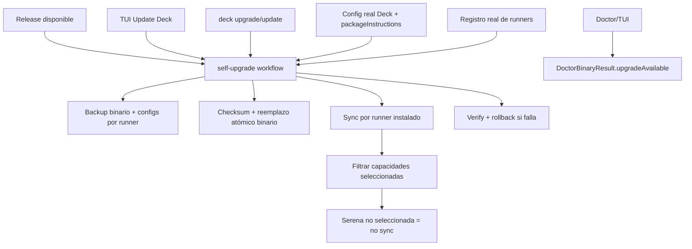

# Proposal: Sincronizar update/upgrade desde la TUI

## Intent

La experiencia actual de update/upgrade de Deck está incompleta: la TUI detecta releases, pero ejecuta el upgrade con registro de runners vacío y configuración por defecto; el workflow verifica el asset descargado, pero no reemplaza realmente el binario; el CLI `deck upgrade` solo reemplaza binario y no sincroniza contenido; y los backups no cubren las configuraciones de runners antes de modificar prompts, skills, agentes o package instructions.

Esto impide que un usuario reciba de forma confiable la versión nueva de Deck junto con las configuraciones actualizadas para cada runner donde Deck esté instalado, respetando capacidades seleccionadas como Serena.

## Goal

Lograr que el upgrade desde TUI y CLI instale o derive correctamente al binario más reciente y sincronice configuraciones por runner instalado, con backups reversibles y respeto estricto de selecciones de capacidades.

## Scope

### In Scope
- Cablear la TUI para ejecutar el `self-upgrade workflow` con registro real de runners y configuración real del usuario, no con defaults vacíos.
- Asegurar que el workflow instale el último binario real cuando aplique, incluyendo reemplazo atómico y verificación de checksum del asset.
- Sincronizar prompts, skills, agentes/configs y package instructions en cada runner donde Deck esté instalado.
- Respetar `packageInstructions` por runner para evitar sincronizar capacidades no instaladas/seleccionadas, incluyendo Serena.
- Crear backups de configuración por runner antes de aplicar cualquier sync.
- Hacer que `deck upgrade`/`deck update` ejecute el mismo comportamiento funcional de binario + sync, o al menos invoque el sync después del reemplazo legacy.
- Corregir el reporte de upgrade disponible en Doctor/TUI mediante `DoctorBinaryResult.upgradeAvailable` poblado correctamente.
- Cubrir con tests Bun usando mocks deterministas, sin instalaciones reales, red real ni writes reales de filesystem.

### Out of Scope
- Cambiar el mecanismo externo de distribución de releases o publicación de assets.
- Instalar runners nuevos o capacidades que el usuario no haya seleccionado.
- Modificar la semántica de selección de paquetes más allá de usar la configuración real existente.
- Diseñar una política definitiva de retención de backups si no existe una decisión previa; puede quedar como decisión abierta o comportamiento conservador.
- Reescribir por completo los adapters de runners si sus métodos de detección y sync actuales son suficientes.

## Affected Capabilities

> Esta sección es el contrato entre Proposal y las fases Spec/Design.

### New Capabilities
- `self-upgrade-runner-sync`: El upgrade de Deck sincroniza contenido de Developer Team por runner instalado después de actualizar o validar el binario.
- `runner-config-backup-before-sync`: Cada runner afectado obtiene backup de sus archivos gestionados antes de modificar prompts, skills, agentes o configs.
- `upgrade-availability-reporting`: Doctor/TUI reportan disponibilidad de upgrade desde un resultado binario explícito y consistente.

### Modified Capabilities
- `deck-upgrade`: `deck upgrade`/`deck update` deja de ser solo reemplazo de binario y pasa a incluir sync de contenido por runner o delegación al workflow unificado.
- `tui-upgrade`: La acción Update Deck en TUI usa adapter registry y configuración reales, y no defaults vacíos.
- `binary-upgrade`: El workflow de upgrade verifica checksum y ejecuta reemplazo atómico del binario cuando no está gestionado por Homebrew u otro canal externo.

### Unchanged Capabilities
- `runner-install-detection`: La detección por `detectDeckInstall` se mantiene como base; solo se usa correctamente desde el flujo productivo.
- `package-instruction-selection`: La selección por `getEnabledPackageInstructionIds(config, runnerId)` se mantiene; el cambio es alimentar config real.
- `homebrew-upgrade-handling`: Cuando Deck está instalado por Homebrew, el flujo no debe reemplazar el binario directamente, pero sí puede sincronizar contenido.

## Approach

- Adoptar un `self-upgrade workflow` único o semicompartido para TUI y CLI que ejecute: detectar/validar release → preparar backup → actualizar binario si aplica → sincronizar runners instalados → verificar resultado → permitir rollback.
- Renombrar o aclarar naming interno para evitar confusión con agentes: preferir `runSelfUpgradeWorkflow` sobre `runUpgradeOrchestrator` si se toca esa API.
- En TUI, reemplazar el `adapterRegistry` vacío y `getDefaultDeckConfig()` por el registro real de adapters y resolución real de configuración Deck.
- En el workflow, introducir una dependencia explícita de reemplazo de binario, por ejemplo `replaceBinary`, o integrar `performUpgrade` de forma equivalente, manteniendo verificación de checksum y reemplazo atómico.
- Antes del sync, construir los planes por runner instalado y registrar como backup todos los archivos que pueden mutar, además del binario y assets de contenido.
- Mantener el filtro de capacidades por runner con `packageInstructions`; Serena y paquetes opcionales solo se sincronizan cuando estén habilitados para ese runner.
- Hacer que CLI `deck upgrade` comparta el workflow o invoque runner sync después del reemplazo legacy, evitando divergencia funcional con la TUI.
- Poblar `DoctorBinaryResult` en diagnósticos para que Doctor/TUI puedan mostrar `upgradeAvailable` correctamente; la comparación debe ser compatible con versión y, si se decide, commit.

## Alternatives and Tradeoffs

| Alternative | Why Considered | Why Not Chosen |
|---|---|---|
| Corregir solo TUI | Menor superficie y resuelve el síntoma principal observado en la interfaz. | Deja `deck upgrade` inconsistente y sin sync de runners. |
| Mantener paths separados: TUI workflow y CLI legacy + sync | Reduce refactor inicial y permite reutilizar `performUpgrade`. | Aumenta riesgo de divergencia futura; requiere tests duplicados de comportamiento. |
| Unificar TUI y CLI en `runSelfUpgradeWorkflow` | Comportamiento consistente, mejor rollback/backup y menos duplicación conceptual. | Mayor alcance técnico; requiere cuidar compatibilidad de flags y UX CLI. |
| Delegar siempre a Homebrew o canal externo | Evita reemplazo de binario propio. | No cubre instalaciones binarias directas ni sync de configuraciones por runner. |

## Impacto por componentes

| Componente | Impacto esperado |
|---|---|
| `apps/cli/src/tui/app.tsx` | Usar registry/config reales al iniciar upgrade desde TUI. |
| `apps/cli/src/upgrade-command/orchestrator.ts` | Convertir el workflow en ejecutor real de binario + backup + sync + verify; posible renombre a `runSelfUpgradeWorkflow`. |
| `apps/cli/src/upgrade-command/index.ts` | Alinear `deck upgrade`/`deck update` con el workflow o añadir sync posterior al reemplazo. |
| `apps/cli/src/upgrade-command/runner-sync.ts` | Reutilizar lógica existente; reforzar integración productiva y tests de cableado. |
| `apps/cli/src/upgrade-command/backup-store.ts` | Incluir archivos de runner mutables en backups globales o coordinar backup adapter + rollback. |
| `apps/cli/src/runner-adapters.ts` | Proveer registro real al flujo TUI/CLI. |
| `packages/adapter-opencode` / `packages/adapter-pi` | Mantener detección/sync; validar backup de archivos gestionados en planes reales. |
| `apps/cli/src/doctor-command/*` | Poblar y renderizar `DoctorBinaryResult.upgradeAvailable` de forma fiable. |
| Tests Bun | Agregar cobertura de integración con mocks de release, filesystem, adapters, backups y reemplazo de binario. |

## Risks

| Risk | Likelihood | Mitigation |
|---|---|---|
| Sync accidental en runners no instalados | Media | Usar exclusivamente `detectDeckInstall` real del adapter y cubrir casos negativos con mocks. |
| Sincronizar Serena u otra capacidad no seleccionada | Media | Alimentar config real y probar `packageInstructions` por runner, incluyendo Serena deshabilitada. |
| Reemplazo de binario deja Deck inutilizable | Media | Reemplazo atómico, checksum previo, backup del binario actual y rollback automático ante fallo. |
| Backup incompleto de configuración | Alta | Generar backup desde los planes exactos de archivos mutables antes del apply y verificar manifest. |
| Divergencia TUI vs CLI | Media | Preferir workflow compartido; si se mantiene wrapper legacy, testear equivalencia de efectos. |
| Doctor/TUI sigue mostrando upgrade incorrecto | Media | Poblar `DoctorBinaryResult` y testear `upgradeAvailable` con semver y caso commit si se decide. |
| Homebrew intenta reemplazo directo | Baja | Preservar rama que omite reemplazo binario y solo ejecuta sync de contenido permitido. |

## Rollback Plan

- Antes de modificar, crear backup del binario actual cuando aplique y de cada archivo de runner que será mutado por el plan de sync.
- Si falla el reemplazo binario, restaurar el binario anterior y abortar sync de contenido.
- Si falla el sync de un runner, restaurar los archivos de ese runner desde el backup correspondiente y reportar fallo parcial sin continuar silenciosamente.
- Si falla la verificación final, ejecutar rollback del binario y de todos los runners modificados durante la operación.
- Mantener manifest de backup con owner/kind/checksum para auditar qué se restauró.
- En instalaciones Homebrew, no intentar rollback de binario gestionado externamente; limitar rollback a contenido/configuración sincronizada por Deck.

## Dependencies

- Registro real de adapters de runners disponible para TUI/CLI.
- Resolución real de configuración Deck y `packageInstructions` por runner.
- Implementación existente de detección por runner (`detectDeckInstall`) y construcción/aplicación de planes de Developer Team.
- Mecanismo existente o nuevo de reemplazo atómico del binario (`performUpgrade`, `replaceBinary` o equivalente).
- Tests con Bun y mocks deterministas de release, filesystem, adapters, backup store y reemplazo binario.

## Open Questions

- ¿El CLI `deck upgrade` debe delegar completamente al workflow unificado en este cambio, o se acepta temporalmente `performUpgrade` + `runRunnerSync` como wrapper equivalente?
- ¿El backup de archivos de runner debe centralizarse en `backup-store.ts`, delegarse al backup de cada adapter, o registrarse en ambos niveles para trazabilidad completa?
- ¿Debe TUI mostrar un aviso explícito cuando un runner está instalado pero no tiene capacidades seleccionadas para sincronizar?
- ¿Cuál será la política de retención/limpieza de backups después de upgrades exitosos o parciales?
- ¿La decisión de upgrade disponible para Doctor debe ser solo semver o también commit-aware para `same-version-different-commit`?

## Acceptance Direction

- [ ] TUI detecta una nueva versión y ejecuta upgrade usando registry/config reales.
- [ ] El flujo instala el binario real más reciente en instalaciones binarias directas, con checksum y reemplazo atómico.
- [ ] En instalaciones Homebrew, el flujo no reemplaza el binario directamente y sí sincroniza contenido permitido.
- [ ] Prompts, skills, agentes/configs y package instructions se sincronizan solo en runners instalados.
- [ ] Capacidades no seleccionadas, como Serena deshabilitada, no se sincronizan.
- [ ] Cada runner afectado tiene backup previo de archivos mutables y rollback verificable.
- [ ] `deck upgrade`/`deck update` y TUI tienen comportamiento equivalente respecto a binario + sync.
- [ ] Doctor/TUI reportan `upgradeAvailable` correctamente.
- [ ] `bun test` cubre los flujos con mocks, sin red real, instalaciones reales ni writes reales de filesystem.

## Next Steps

Ready for Spec (`deck-developer-spec`) and Design (`deck-developer-design`) in parallel.

## Mermaid Summary Source

