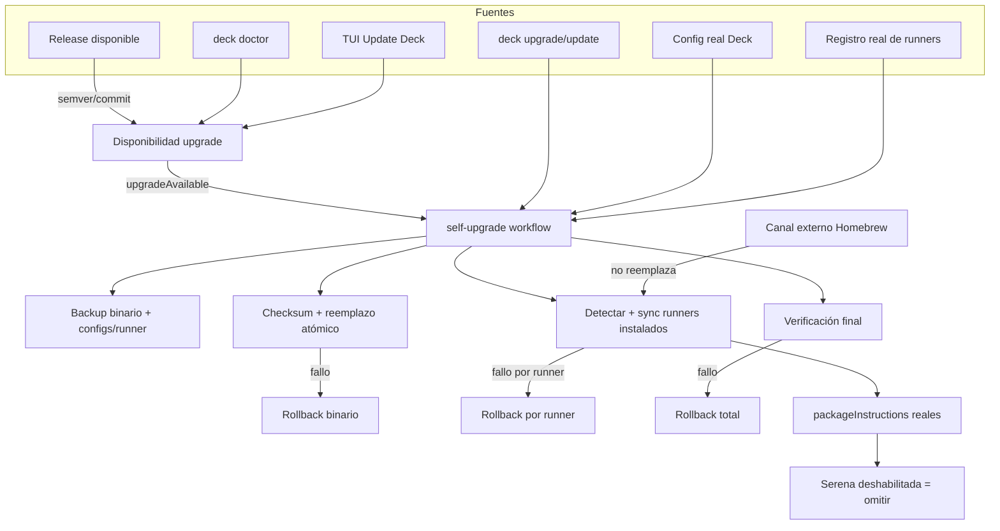

# Spec: Sincronizar update/upgrade desde la TUI

## Source

- Proposal: `tui-update-upgrade-sync` proposal artifact
- Capabilities affected:
  - `upgrade-availability-reporting` (new)
  - `binary-upgrade` (modified)
  - `tui-upgrade` (modified)
  - `deck-upgrade` (modified)
  - `runner-config-backup-before-sync` (new)
  - `self-upgrade-runner-sync` (new)
  - `runner-install-detection` (unchanged, under test)
  - `package-instruction-selection` (unchanged, under test)
  - `homebrew-upgrade-handling` (unchanged, under test)

## Requirements

### Capability: upgrade-availability-reporting

REQ-UAR-001: Doctor, TUI y CLI deben reportar `upgradeAvailable: true` cuando exista un release cuya versión sea semánticamente mayor que la versión del binario en ejecución.
  Priority: MUST
  Surface: UI / API / Data
  Rationale: Sin una señal confiable de que hay una versión nueva, el usuario no iniciará el upgrade.

REQ-UAR-002: La comparación de disponibilidad debe tolerar el caso `same-version-different-commit` si el equipo decide soportarlo; en ausencia de decisión, al menos debe comparar semver de forma correcta.
  Priority: SHOULD
  Surface: Data
  Rationale: El release descriptor ya distingue este caso y el doctor/TUI necesitan consistencia.

### Capability: binary-upgrade

REQ-BIN-001: Antes de reemplazar el binario, el workflow debe verificar el checksum criptográfico del asset staged contra el valor publicado en el release descriptor.
  Priority: MUST
  Surface: Security / Data
  Rationale: Evita instalar un binario corrupto o manipulado.

REQ-BIN-002: Cuando la instalación actual permite reemplazo propio (instalación binaria directa), el workflow debe reemplazar atómicamente el binario en ejecución por el nuevo binario verificado.
  Priority: MUST
  Surface: Data / Integration
  Rationale: El upgrade no es funcional si el binario no se actualiza realmente.

REQ-BIN-003: Cuando la instalación está gestionada externamente (por ejemplo, Homebrew), el workflow NO debe reemplazar el binario directamente, pero sí debe permitir el sync de contenido posterior.
  Priority: MUST
  Surface: Data / Integration
  Rationale: Reemplazar un binario gestionado por un package manager rompería el sistema de paquetes.

### Capability: tui-upgrade

REQ-TUI-001: La acción "Update Deck" en la TUI debe ejecutar el workflow de upgrade pasando el registro real de adapters de runners y la configuración real del usuario, en lugar de registros vacíos o configuraciones por defecto.
  Priority: MUST
  Surface: UI / Integration
  Rationale: Con registry/config vacíos el sync de contenido nunca se ejecuta en producción.

REQ-TUI-002: La TUI debe mostrar el progreso del workflow de upgrade (backup, binario, sync, verificación) y los errores correspondientes sin bloquear la interfaz de forma opaca.
  Priority: MUST
  Surface: UI
  Rationale: El usuario necesita saber qué ocurre durante un upgrade potencialmente destructivo.

### Capability: deck-upgrade

REQ-CLI-001: Los comandos `deck upgrade` y `deck update` del CLI deben ejecutar el mismo comportamiento funcional que la TUI respecto a binario + sync, o delegar explícitamente en el workflow común.
  Priority: MUST
  Surface: API / Integration
  Rationale: Evitar divergencia de experiencia entre TUI y CLI.

REQ-CLI-002: El CLI debe seguir soportando los flags existentes (por ejemplo, `--yes`) sin regresión de comportamiento.
  Priority: SHOULD
  Surface: API
  Rationale: Preservar compatibilidad con scripts y usuarios actuales.

### Capability: runner-config-backup-before-sync

REQ-BCU-001: Antes de modificar cualquier archivo de un runner, el workflow debe crear un backup de todos los archivos que el plan de sync de ese runner vaya a mutar (prompts, skills, agentes/configs, package instructions).
  Priority: MUST
  Surface: Data / Security
  Rationale: Garantiza rollback verificable de configuraciones por runner.

REQ-BCU-002: Cada entrada del backup debe incluir metadatos suficientes para auditar y restaurar: identificador del owner/runner, tipo de recurso, y checksum del contenido original.
  Priority: MUST
  Surface: Data
  Rationale: Permite detectar corrupción y restaurar selectivamente.

REQ-BCU-003: El workflow debe respaldar el binario actual antes de reemplazarlo cuando aplique el reemplazo propio.
  Priority: MUST
  Surface: Data
  Rationale: El binario es parte del estado que se muta y debe ser reversible.

### Capability: self-upgrade-runner-sync

REQ-SRS-001: Después de actualizar o validar el binario, el workflow debe detectar los runners instalados mediante el método de detección proporcionado por cada adapter (`detectDeckInstall`).
  Priority: MUST
  Surface: Integration
  Rationale: Solo se debe sincronizar contenido donde Deck esté realmente instalado.

REQ-SRS-002: El workflow debe construir y aplicar planes de Developer Team exclusivamente para los runners detectados como instalados.
  Priority: MUST
  Surface: Integration
  Rationale: Evita crear archivos de configuración en runners no utilizados.

REQ-SRS-003: El workflow debe usar la configuración real del usuario para resolver las `packageInstructions` habilitadas por runner, no la configuración por defecto.
  Priority: MUST
  Surface: Data / Integration
  Rationale: Las selecciones del usuario determinan qué contenido debe sincronizarse.

REQ-SRS-004: Ninguna capacidad no seleccionada (por ejemplo, Serena cuando está deshabilitada) debe ser incluida en el bundle ni sincronizada en ningún runner.
  Priority: MUST
  Surface: Data / Security
  Rationale: Respetar el principio de menor privilegio y las decisiones de instalación del usuario.

REQ-SRS-005: Si un runner está instalado pero no tiene capacidades seleccionadas para sincronizar, el workflow debe omitir ese runner sin fallar y registrar la omisión.
  Priority: SHOULD
  Surface: Integration
  Rationale: Es un estado válido que no debe detener el upgrade.

### Capability: rollback-recovery

REQ-ROL-001: Si falla la verificación de checksum o el reemplazo del binario, el workflow debe abortar el sync de contenido y restaurar el binario anterior desde su backup.
  Priority: MUST
  Surface: Data / Security
  Rationale: Dejar Deck sin binario ejecutable es inaceptable.

REQ-ROL-002: Si falla el sync de un runner, el workflow debe restaurar los archivos de ese runner desde su backup correspondiente y reportar el fallo parcial.
  Priority: MUST
  Surface: Data / Security
  Rationale: Aislar el daño por runner y mantener trazabilidad.

REQ-ROL-003: Si falla la verificación final del upgrade, el workflow debe ejecutar rollback del binario y de todos los runners modificados durante la operación.
  Priority: MUST
  Surface: Data / Security
  Rationale: La verificación final es la última oportunidad de detectar un estado inconsistente.

### Capability: testability

REQ-TST-001: Todo el flujo de upgrade debe ser testable con `bun test` usando mocks deterministas de release, filesystem, adapters, backup store y reemplazo de binario.
  Priority: MUST
  Surface: General
  Rationale: Las pruebas no pueden depender de red, instalaciones reales ni escrituras reales de filesystem.

REQ-TST-002: Los tests deben poder simular los escenarios de éxito, fallo de checksum, fallo de reemplazo, sync parcial, rollback y ausencia de runners instalados.
  Priority: MUST
  Surface: General
  Rationale: Cubrir los riesgos identificados sin dependencias externas.

## Acceptance Scenarios

### Capability: upgrade-availability-reporting

#### Scenario: TUI y Doctor muestran upgrade disponible
**Given** que existe un release con versión `1.2.0` y el binario en ejecución es `1.1.0`
**When** se ejecuta `deck doctor` o se carga la pantalla home de la TUI
**Then** `DoctorBinaryResult.upgradeAvailable` es `true`
**And** la TUI renderiza el banner y el menú "Update Deck → v1.2.0"
> Covers: REQ-UAR-001

#### Scenario: No se muestra upgrade cuando la versión es igual o menor
**Given** que el release más reciente es `1.1.0` y el binario en ejecución es `1.1.0`
**When** se ejecuta `deck doctor` o se carga la pantalla home de la TUI
**Then** `DoctorBinaryResult.upgradeAvailable` es `false`
> Covers: REQ-UAR-001

### Capability: binary-upgrade

#### Scenario: Reemplazo atómico de binario exitoso
**Given** una instalación binaria directa, un asset staged cuyo checksum coincide con el release descriptor, y el binario actual respaldado
**When** el workflow ejecuta el paso de reemplazo de binario
**Then** el sistema coloca el nuevo binario en la ubicación del binario actual de forma atómica
**And** el nuevo binario conserva permisos de ejecución
> Covers: REQ-BIN-001, REQ-BIN-002

#### Scenario: Homebrew no reemplaza el binario
**Given** una instalación gestionada por Homebrew
**When** el workflow ejecuta el paso de binario
**Then** no se intenta reemplazar el binario
**And** el workflow continúa con el backup y sync de contenido
> Covers: REQ-BIN-003

#### Scenario: Fallo de checksum aborta el upgrade
**Given** un asset staged cuyo checksum NO coincide con el release descriptor
**When** el workflow ejecuta el paso de verificación
**Then** se reporta error de checksum
**And** no se reemplaza el binario
**And** no se ejecuta sync de contenido
> Covers: REQ-BIN-001, REQ-ROL-001

### Capability: tui-upgrade

#### Scenario: TUI inicia upgrade con registry y config reales
**Given** que el usuario confirma "Update Deck" en la TUI
**When** se invoca el workflow de upgrade
**Then** el workflow recibe el registro real de adapters de runners
**And** el workflow recibe la configuración real del usuario incluyendo `packageInstructions`
**And** no recibe un registro vacío ni la configuración por defecto
> Covers: REQ-TUI-001

#### Scenario: TUI informa progreso y errores
**Given** que el workflow de upgrade está en ejecución
**When** avanza por los pasos backup, binario, sync y verificación
**Then** la TUI muestra el paso actual y el resultado de cada paso
**And** si ocurre un error, muestra un mensaje descriptivo y la opción de salir
> Covers: REQ-TUI-002

### Capability: deck-upgrade

#### Scenario: CLI upgrade ejecuta binario + sync equivalente a TUI
**Given** que el usuario ejecuta `deck upgrade` o `deck update`
**When** el comando completa exitosamente
**Then** se verifica/actualiza el binario según el canal de instalación
**And** se sincronizan los runners instalados respetando `packageInstructions`
**And** el estado final es equivalente al de ejecutar el upgrade desde la TUI
> Covers: REQ-CLI-001

#### Scenario: CLI conserva compatibilidad de flags
**Given** que el usuario ejecuta `deck upgrade --yes`
**When** el comando corre
**Then** no solicita confirmación interactiva
**And** ejecuta el workflow de upgrade sin intervención
> Covers: REQ-CLI-002

### Capability: runner-config-backup-before-sync

#### Scenario: Backup previo de archivos mutables por runner
**Given** un runner instalado cuyo plan de sync modificará prompts, skills y `packageInstructions.json`
**When** el workflow prepara el sync
**Then** crea un backup que contiene el estado previo de cada uno de esos archivos
**And** cada entrada del backup incluye owner, kind y checksum
> Covers: REQ-BCU-001, REQ-BCU-002

#### Scenario: Backup del binario actual
**Given** una instalación binaria directa
**When** el workflow inicia el upgrade
**Then** el binario actual se copia a un backup antes de cualquier reemplazo
> Covers: REQ-BCU-003

### Capability: self-upgrade-runner-sync

#### Scenario: Sync solo en runners instalados
**Given** un registro con dos adapters: uno detecta Deck instalado y el otro no
**When** el workflow ejecuta sync
**Then** solo se construye y aplica el plan para el adapter que detectó la instalación
> Covers: REQ-SRS-001, REQ-SRS-002

#### Scenario: Serena no se sincroniza cuando está deshabilitada
**Given** un runner instalado con `packageInstructions` que no incluyen Serena
**When** el workflow construye el bundle para ese runner
**Then** el bundle no contiene recursos de Serena
**And** no se crean ni modifican archivos de Serena en ese runner
> Covers: REQ-SRS-003, REQ-SRS-004

#### Scenario: Runner instalado sin capacidades seleccionadas se omite
**Given** un runner instalado cuyo `packageInstructions` está vacío o deshabilitado
**When** el workflow ejecuta sync
**Then** no se aplica ningún plan en ese runner
**And** se registra que se omitió por ausencia de selecciones
> Covers: REQ-SRS-005

### Capability: rollback-recovery

#### Scenario: Rollback de binario por fallo de reemplazo
**Given** un asset verificado pero cuya operación de reemplazo atómico falla
**When** el workflow intenta reemplazar el binario
**Then** se restaura el binario anterior desde el backup
**And** se cancela el sync de contenido
**And** se reporta error al usuario
> Covers: REQ-ROL-001

#### Scenario: Rollback por runner por fallo de sync
**Given** un runner cuya operación `apply` del plan falla después del backup
**When** el workflow aplica el plan
**Then** se restauran los archivos de ese runner desde su backup
**And** se reporta fallo parcial
**And** los demás runners no afectados permanecen sincronizados
> Covers: REQ-ROL-002

#### Scenario: Rollback total por fallo de verificación final
**Given** que el binario fue reemplazado y varios runners fueron sincronizados
**When** la verificación final detecta inconsistencia
**Then** se restaura el binario anterior
**And** se restauran todos los runners modificados desde sus backups
> Covers: REQ-ROL-003

### Capability: testability

#### Scenario: Tests con mocks deterministas
**Given** un entorno de prueba que mockea release descriptor, filesystem, adapters y backup store
**When** se ejecuta `bun test`
**Then** todos los escenarios anteriores se ejecutan sin llamadas de red reales
**And** sin realizar instalaciones reales
**And** sin escrituras reales de filesystem
> Covers: REQ-TST-001, REQ-TST-002

## Validation Rules

| Field / Input | Rule | Error Message | REQ-ID |
|---|---|---|---|
| Asset staged | El checksum debe coincidir con el publicado en el release descriptor | "El asset descargado no coincide con el checksum esperado" | REQ-BIN-001 |
| Canal de instalación | Si es externo (ej. Homebrew), no se permite reemplazo propio del binario | "Instalación gestionada externamente: omitiendo reemplazo de binario" | REQ-BIN-003 |
| Runner | Solo se sincroniza si `detectDeckInstall` retorna `true` | N/A (omisión silenciosa o log) | REQ-SRS-001 |
| Capacidad por runner | Debe estar incluida en `packageInstructions` habilitadas para ese runner | N/A (omisión controlada) | REQ-SRS-004 |
| Backup | Todo archivo mutable debe tener backup previo con checksum | "No se encontró backup para {path}" | REQ-BCU-001, REQ-BCU-002 |

## Error Contracts

| Condition | Error Code / Type | User-facing Message | HTTP Status |
|---|---|---|---|
| Checksum del asset no coincide | `checksum-mismatch` | "El archivo de actualización está corrupto. No se aplicarán cambios." | N/A |
| Reemplazo de binario falla | `binary-replace-failed` | "No se pudo instalar el nuevo binario. Se restauró la versión anterior." | N/A |
| Sync de un runner falla | `runner-sync-partial-failure` | "La configuración de {runnerId} no se pudo actualizar; se restauró el estado anterior." | N/A |
| Verificación final falla | `upgrade-verification-failed` | "La verificación posterior al upgrade falló; se revertieron todos los cambios." | N/A |
| No hay runners instalados | `no-runners-detected` | "No se detectaron runners instalados; solo se actualizó el binario." | N/A |

## States and Transitions

### States

| State | Description | Entry Criteria |
|---|---|---|
| `idle` | El upgrade no ha comenzado | Estado inicial en TUI/CLI |
| `checking` | Se verifica disponibilidad de release | Se inicia release-check o doctor |
| `backing-up` | Se crean backups de binario y archivos de runner | El usuario confirma upgrade |
| `replacing-binary` | Se verifica checksum y se reemplaza binario | Backup del binario completado |
| `syncing-runners` | Se detectan y sincronizan runners instalados | Binario actualizado/validado |
| `verifying` | Se verifica el estado final | Sync completado |
| `completed` | Upgrade exitoso | Verificación final pasa |
| `rolled-back` | Se restauró el estado anterior | Fallo en cualquier paso crítico |
| `failed` | Upgrade abortado sin rollback posible | Fallo irrecuperable |

### Transitions

| From | To | Trigger | Side Effects |
|---|---|---|---|
| `idle` | `checking` | Usuario abre TUI o ejecuta doctor/CLI | Se consulta release descriptor (mockeado en tests) |
| `checking` | `idle` | No hay upgrade disponible | UI/CLI muestra "No hay actualizaciones" |
| `checking` | `backing-up` | Usuario confirma upgrade | Se crean backups de binario y configs por runner |
| `backing-up` | `replacing-binary` | Backup exitoso | Se verifica checksum del asset |
| `replacing-binary` | `syncing-runners` | Reemplazo atómico exitoso | Ninguno |
| `replacing-binary` | `rolled-back` | Fallo de checksum o reemplazo | Se restaura binario anterior; no se ejecuta sync |
| `syncing-runners` | `verifying` | Sync completo en todos los runners | Ninguno |
| `syncing-runners` | `rolled-back` | Fallo de sync en un runner | Se restaura ese runner; se reporta fallo parcial |
| `verifying` | `completed` | Verificación final pasa | Ninguno |
| `verifying` | `rolled-back` | Verificación final falla | Se restaura binario y todos los runners modificados |
| `rolled-back` | `failed` | Rollback falla | Se reporta error crítico |

## Open Questions

- ¿El CLI `deck upgrade` debe delegar completamente al workflow unificado, o se acepta temporalmente un wrapper `performUpgrade` + `runRunnerSync` mientras se converge hacia la unificación total?
- ¿El backup de archivos de runner debe centralizarse en `backup-store.ts`, delegarse al backup de cada adapter, o registrarse en ambos niveles para trazabilidad completa?
- ¿Debe la TUI mostrar un aviso explícito cuando un runner está instalado pero no tiene capacidades seleccionadas para sincronizar?
- ¿Cuál será la política de retención y limpieza de backups después de upgrades exitosos o parciales?
- ¿La decisión de `upgradeAvailable` en Doctor debe ser solo semver o también commit-aware para el caso `same-version-different-commit`?

## Compliance Matrix

| REQ-ID | Scenario(s) | Status |
|---|---|---|
| REQ-UAR-001 | TUI y Doctor muestran upgrade disponible; No se muestra upgrade cuando la versión es igual o menor | Defined |
| REQ-UAR-002 | — | Defined |
| REQ-BIN-001 | Reemplazo atómico de binario exitoso; Fallo de checksum aborta el upgrade | Defined |
| REQ-BIN-002 | Reemplazo atómico de binario exitoso | Defined |
| REQ-BIN-003 | Homebrew no reemplaza el binario | Defined |
| REQ-TUI-001 | TUI inicia upgrade con registry y config reales | Defined |
| REQ-TUI-002 | TUI informa progreso y errores | Defined |
| REQ-CLI-001 | CLI upgrade ejecuta binario + sync equivalente a TUI | Defined |
| REQ-CLI-002 | CLI conserva compatibilidad de flags | Defined |
| REQ-BCU-001 | Backup previo de archivos mutables por runner | Defined |
| REQ-BCU-002 | Backup previo de archivos mutables por runner | Defined |
| REQ-BCU-003 | Backup del binario actual | Defined |
| REQ-SRS-001 | Sync solo en runners instalados | Defined |
| REQ-SRS-002 | Sync solo en runners instalados | Defined |
| REQ-SRS-003 | Serena no se sincroniza cuando está deshabilitada | Defined |
| REQ-SRS-004 | Serena no se sincroniza cuando está deshabilitada | Defined |
| REQ-SRS-005 | Runner instalado sin capacidades seleccionadas se omite | Defined |
| REQ-ROL-001 | Rollback de binario por fallo de reemplazo; Fallo de checksum aborta el upgrade | Defined |
| REQ-ROL-002 | Rollback por runner por fallo de sync | Defined |
| REQ-ROL-003 | Rollback total por fallo de verificación final | Defined |
| REQ-TST-001 | Tests con mocks deterministas | Defined |
| REQ-TST-002 | Tests con mocks deterministas | Defined |

## Mermaid Summary Source

