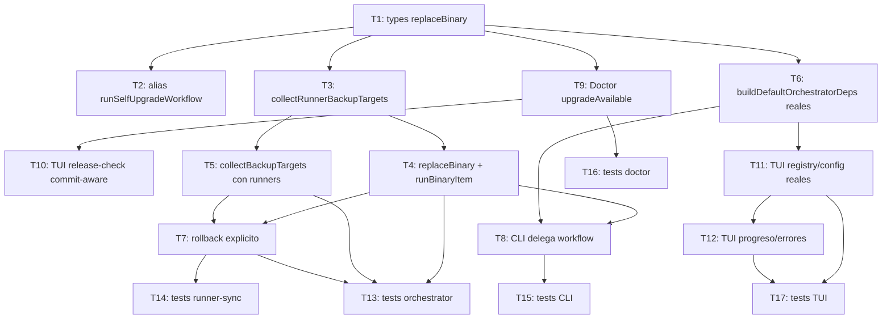

# Tasks: Sincronizar update/upgrade desde la TUI y CLI

## Source

- Spec: `openspec/changes/tui-update-upgrade-sync/spec.md`
- Design: `openspec/changes/tui-update-upgrade-sync/design.md`
- Capabilities affected: `upgrade-availability-reporting` (new), `binary-upgrade` (modified), `tui-upgrade` (modified), `deck-upgrade` (modified), `runner-config-backup-before-sync` (new), `self-upgrade-runner-sync` (new), `rollback-recovery` (new), `testability` (cross-cutting).

## Task Groups

### Group: Shared / Contracts

#### Task 1: Definir tipos y contrato `replaceBinary`
**Owner**: General Apply
**Priority**: P0
**Complexity**: Low
**Parallel**: Yes
**Depends on**: none

**Description**
Definir y exportar los tipos `ReplaceBinaryInput`, `ReplaceBinaryResult` y agregar el campo `replaceBinary` a `OrchestratorDeps` en `apps/cli/src/upgrade-command/orchestrator.ts`. Mantener `replaceBinary` opcional con default seguro (no-op que rechaza) para no romper consumidores existentes.

**Files**
- `apps/cli/src/upgrade-command/orchestrator.ts` — modify (agregar tipos y campo en `OrchestratorDeps`).

**Verification**
- `bun run typecheck` (o `tsc --noEmit`) sin errores.
- Importar `OrchestratorDeps` en un test y verificar que el campo es opcional.

#### Task 2: Exponer alias `runSelfUpgradeWorkflow`
**Owner**: General Apply
**Priority**: P1
**Complexity**: Low
**Parallel**: Yes
**Depends on**: Task 1

**Description**
Agregar `export const runSelfUpgradeWorkflow = runUpgradeOrchestrator` y reexportarlo desde el mismo módulo. Mantener `runUpgradeOrchestrator` intacto. No cambiar firmas.

**Files**
- `apps/cli/src/upgrade-command/orchestrator.ts` — modify (alias + reexport).

**Verification**
- `bun test apps/cli/src/upgrade-command/__tests__/orchestrator.test.ts` sigue verde.
- Importar ambos símbolos confirma que apuntan a la misma función.

#### Task 3: Helper compartido `collectRunnerBackupTargets`
**Owner**: General Apply
**Priority**: P0
**Complexity**: Medium
**Parallel**: No — depende de Task 1
**Depends on**: Task 1

**Description**
Crear helper interno `collectRunnerBackupTargets(deps, config): Promise<BackupTarget[]>` que itera adapters del registry, llama `detectDeckInstall`, calcula `enabledIds = getEnabledPackageInstructionIds(config, runnerId)`, construye bundle, llama `adapter.buildDeveloperTeamInstallPlan(...)` y mapea `plan.files` a targets con `owner: "runner:${runnerId}"` y `kind` resuelto por `classifyFile`. Si el adapter no está instalado o no hay selecciones, no emite targets. Marcar archivos ausentes previos con un flag `absentBefore: true` si la API de backup-store lo soporta; si no, no registrarlo todavía (deferred).

**Files**
- `apps/cli/src/upgrade-command/orchestrator.ts` — modify (helper nuevo).
- `apps/cli/src/upgrade-command/runner-sync.ts` — reutilizar (sin cambios funcionales, pero exponer helper si es necesario).

**Verification**
- Unit test con dos adapters: uno instalado con selecciones → targets; otro no instalado → sin targets; runner instalado sin selecciones → sin targets.
- `bun test apps/cli/src/upgrade-command/__tests__/orchestrator.test.ts` verde.

### Group: Backend

#### Task 4: Implementar reemplazo atómico de binario y enchufarlo en `runBinaryItem`
**Owner**: Backend Apply
**Priority**: P0
**Complexity**: Medium
**Parallel**: No — depende de Tasks 1, 3
**Depends on**: Task 1, Task 3

**Description**
Implementación productiva de `replaceBinary` reutilizando/extrayendo primitiva atómica desde `apps/cli/src/upgrade-command/install.ts` (sin red si el asset ya está staged). En `runBinaryItem`, después de verificar checksum, llamar `deps.replaceBinary({ stagedAssetPath, currentBinaryPath, expectedSha256, backupPath, itemId })` y mapear `replaced=false` a outcome `skipped_external`. En `installKind === "homebrew"` no invocar replace y continuar con content sync. Si `replaceBinary` lanza, ejecutar `restoreBackup(backupPath)` y abortar sync de contenido.

**Files**
- `apps/cli/src/upgrade-command/orchestrator.ts` — modify (consumir `replaceBinary` en `runBinaryItem`).
- `apps/cli/src/upgrade-command/install.ts` — modify (exponer/extraer primitiva atómica sin red).
- `apps/cli/src/upgrade-command/backup-store.ts` — reutilizar (sin cambios).

**Verification**
- `bun test apps/cli/src/upgrade-command/__tests__/orchestrator.test.ts` cubre: checksum OK + replace OK, checksum fail (no replace), replace fail → rollback binario, homebrew → no replace, sin item binario → skip.

#### Task 5: Extender `collectBackupTargets` para incluir archivos de runners
**Owner**: Backend Apply
**Priority**: P0
**Complexity**: Medium
**Parallel**: No — depende de Task 3
**Depends on**: Task 3

**Description**
Reemplazar la versión actual de `collectBackupTargets` (o integrarla) para que además del binario y el content tarball, incluya los targets producidos por `collectRunnerBackupTargets`. Cada target lleva `owner`, `kind`, `sourcePath` resoluble. Conservar el orden: binario primero, luego targets de runners, luego content tarball (opcional).

**Files**
- `apps/cli/src/upgrade-command/orchestrator.ts` — modify.
- `apps/cli/src/upgrade-command/backup-store.ts` — reutilizar/posible extensión para `absentBefore`.

**Verification**
- Test verifica que el backup global contiene el binario y al menos un archivo de cada runner instalado, con `owner: "runner:${id}"` y `kind` correcto.

#### Task 6: `buildDefaultOrchestratorDeps` con registry y config reales
**Owner**: Backend Apply
**Priority**: P0
**Complexity**: Low
**Parallel**: No — depende de Task 1
**Depends on**: Task 1

**Description**
Modificar `buildDefaultOrchestratorDeps` para que `adapterRegistry` sea `createDefaultAdapterRegistry()` (de `apps/cli/src/runner-adapters.ts`) y `readDeckConfig` sea `readGlobalDeckConfig` o equivalente real, con fallback solo a `getDefaultDeckConfig()` cuando el archivo está ausente. Mantener el shape del contrato.

**Files**
- `apps/cli/src/upgrade-command/orchestrator.ts` — modify.
- `apps/cli/src/runner-adapters.ts` — reutilizar (import).

**Verification**
- Test confirma que los defaults llaman al registry real y a la config real, no a placeholders.
- `bun test` verde en suite de orchestrator.

#### Task 7: Rollback explícito por runner y total en verify
**Owner**: Backend Apply
**Priority**: P0
**Complexity**: Medium
**Parallel**: No — depende de Tasks 4, 5
**Depends on**: Task 4, Task 5

**Description**
Si `runRunnerSync` falla para un runner, restaurar archivos desde el backup global del runner (además del `adapter.rollbackDeveloperTeamFiles` local). Si la verificación final falla, ejecutar rollback del binario y de todos los runners modificados. Mapear errores a `ORCHESTRATOR_ERROR_CODES` (`RUNNER_SYNC_PARTIAL_FAILURE`, `RUNNER_VERIFY_FAILED`, `ROLLBACK_FAILED`).

**Files**
- `apps/cli/src/upgrade-command/orchestrator.ts` — modify (secuencia de rollback).
- `apps/cli/src/upgrade-command/runner-sync.ts` — reutilizar (puede exponer helper de restore).

**Verification**
- Tests con mocks: falla de un runner → restaura solo ese runner; falla de verify → restaura binario + todos los runners modificados; falla de rollback → `ROLLBACK_FAILED` con `backupId`.

#### Task 8: CLI `runUpgrade` delega al workflow compartido
**Owner**: Backend Apply
**Priority**: P0
**Complexity**: Medium
**Parallel**: No — depende de Tasks 4, 6
**Depends on**: Task 4, Task 6

**Description**
Refactorizar `runUpgrade` en `apps/cli/src/upgrade-command/index.ts` para resolver descriptor via `fetchReleaseDescriptor` (mockeado en tests), invocar `runSelfUpgradeWorkflow` (o mantener `runUpgradeOrchestrator`) con deps productivas, preservando flags `--yes`/`-y` y el rechazo de downgrade. Mantener compat: si el workflow no está disponible, fallback al path legacy + `runRunnerSync` post-reemplazo (allowed-with-placeholder).

**Files**
- `apps/cli/src/upgrade-command/index.ts` — modify.
- `apps/cli/src/upgrade-command/__tests__/index.test.ts` — modify/agregar.

**Verification**
- `bun test apps/cli/src/upgrade-command/__tests__/index.test.ts` verde.
- Test cubre: con release disponible, delega al workflow; con `--yes`, no pide confirmación; CLI legacy no invocado en producción.

#### Task 9: Doctor `runDoctorDiagnostics` pobla `DoctorBinaryResult`
**Owner**: Backend Apply
**Priority**: P0
**Complexity**: Low
**Parallel**: Yes
**Depends on**: Task 1

**Description**
En `apps/cli/src/doctor-command/doctor-diagnostics.ts`, poblar `result.binary: DoctorBinaryResult` con `currentVersion`, `latestVersion`, `latestCommit` (si está disponible), `upgradeAvailable = decideReleaseAvailability(...).kind === "available"`, y `reason` para casos `local-newer`, `same-build`, `missing-commit`, `dev-build`. Inyectar fetcher mockeable (no red real en tests).

**Files**
- `apps/cli/src/doctor-command/doctor-diagnostics.ts` — modify.
- `apps/cli/src/doctor-command/types.ts` — reutilizar/extender (`reason?: string`).
- `apps/cli/src/upgrade-command/github-release.ts` — reutilizar (`decideReleaseAvailability`).

**Verification**
- `bun test apps/cli/src/__tests__/doctor-diagnostics.test.ts` cubre semver newer, same-version-different-commit, same build, dev build, missing commit.

#### Task 10: Alinear `tui/release-check.ts` con decisión commit-aware
**Owner**: Backend Apply
**Priority**: P1
**Complexity**: Low
**Parallel**: Yes
**Depends on**: Task 9

**Description**
Hacer que `ReleaseCheckState` y la presentación de TUI usen `decideReleaseAvailability` para `newer-version` y `same-version-different-commit`. Mantener el render actual si el contrato alcanza; solo cambiar la fuente de la decisión.

**Files**
- `apps/cli/src/tui/release-check.ts` — modify.
- `apps/cli/src/tui/screens/home-screen.tsx` — reutilizar.

**Verification**
- `bun test apps/cli/src/tui/__tests__/tui-integration.test.tsx` verde.
- Test de integración: release `1.1.0+abc` vs local `1.1.0+xyz` → `upgradeAvailable=true`, banner visible.

### Group: Frontend

#### Task 11: TUI pasa registry y config reales al workflow
**Owner**: Frontend Apply
**Priority**: P0
**Complexity**: Low
**Parallel**: No — depende de Task 6
**Depends on**: Task 6

**Description**
En `apps/cli/src/tui/app.tsx`, reemplazar el `adapterRegistry` placeholder y el `readDeckConfig: () => getDefaultDeckConfig()` por referencias a `createDefaultAdapterRegistry()` y `readGlobalDeckConfig` (o equivalente ya resuelto en el contexto TUI). No romper confirmaciones existentes.

**Files**
- `apps/cli/src/tui/app.tsx` — modify.

**Verification**
- `bun test apps/cli/src/tui/__tests__/tui-integration.test.tsx` verde.
- Test verifica que `runUpgradeOrchestrator` recibe registry no vacío y config real (mock verificable).

#### Task 12: TUI informa progreso y errores del workflow
**Owner**: Frontend Apply
**Priority**: P0
**Complexity**: Medium
**Parallel**: No — depende de Task 11
**Depends on**: Task 11

**Description**
Mapear `OrchestratorResult` (o el outcome que devuelva el workflow) a estados de UI: `checking`, `backing-up`, `replacing-binary`, `syncing-runners`, `verifying`, `completed`, `rolled-back`, `failed`. Mostrar mensaje descriptivo y permitir salir sin bloquear el render. Diferenciar `partial_failure` de `rolled_back` y `completed`.

**Files**
- `apps/cli/src/tui/app.tsx` — modify (estado de progreso).
- `apps/cli/src/tui/screens/*` — modificar si render dedicado lo requiere.

**Verification**
- Test: con mock que emite `OrchestratorResult` con `binary.status`, `content.status`, `backupId` → UI muestra pasos y mensaje final correcto. Sin red, sin writes reales.

### Group: Tests

#### Task 13: Cobertura Bun para orchestrator binary+sync+backup+rollback
**Owner**: Backend Apply
**Priority**: P0
**Complexity**: High
**Parallel**: No — depende de Tasks 4, 5, 7
**Depends on**: Task 4, Task 5, Task 7

**Description**
Agregar/ajustar tests en `apps/cli/src/upgrade-command/__tests__/orchestrator.test.ts` para: checksum OK + replace OK; checksum fail aborta; replace fail → rollback binario; Homebrew no reemplaza binario; backup incluye binario + targets de runner; rollback por runner; rollback total en verify; Serena true/false; runner sin selecciones → omitido; no-runners-detected outcome.

**Files**
- `apps/cli/src/upgrade-command/__tests__/orchestrator.test.ts` — modify/agregar.

**Verification**
- `bun test apps/cli/src/upgrade-command/__tests__/orchestrator.test.ts` verde.
- Cubre explícitamente REQ-BIN-001/002/003, REQ-BCU-001/002/003, REQ-ROL-001/002/003, REQ-SRS-001/002/003/004/005.

#### Task 14: Cobertura Bun para runner-sync (capacidades, no-selections)
**Owner**: Backend Apply
**Priority**: P1
**Complexity**: Medium
**Parallel**: Yes
**Depends on**: Task 7

**Description**
En `apps/cli/src/upgrade-command/__tests__/runner-sync.test.ts` agregar: Serena false → no hay archivos Serena; Serena true → sí los hay; runner instalado sin `packageInstructions` → outcome `skipped` sin backup/apply; dos adapters registrados, uno instalado, otro no → solo se sincroniza el instalado.

**Files**
- `apps/cli/src/upgrade-command/__tests__/runner-sync.test.ts` — modify/agregar.

**Verification**
- `bun test apps/cli/src/upgrade-command/__tests__/runner-sync.test.ts` verde.
- Cubre REQ-SRS-003/004/005.

#### Task 15: Cobertura Bun para CLI `runUpgrade`
**Owner**: Backend Apply
**Priority**: P1
**Complexity**: Low
**Parallel**: Yes
**Depends on**: Task 8

**Description**
En `apps/cli/src/upgrade-command/__tests__/index.test.ts` cubrir: con release disponible, delega al workflow; `--yes`/`-y` no piden confirmación; CLI legacy + `runRunnerSync` fallback sigue funcionando en allowed-with-placeholder.

**Files**
- `apps/cli/src/upgrade-command/__tests__/index.test.ts` — modify/agregar.

**Verification**
- `bun test apps/cli/src/upgrade-command/__tests__/index.test.ts` verde.
- Cubre REQ-CLI-001, REQ-CLI-002.

#### Task 16: Cobertura Bun para Doctor `upgradeAvailable`
**Owner**: Backend Apply
**Priority**: P1
**Complexity**: Low
**Parallel**: Yes
**Depends on**: Task 9

**Description**
En `apps/cli/src/__tests__/doctor-diagnostics.test.ts` (o nuevo), cubrir: `newer-version` → `upgradeAvailable=true`; `same-version-different-commit` → `true`; `same-build` → `false`; `dev-build` → `false`; `missing-commit` → `false` con reason. Fetcher mockeado, sin red.

**Files**
- `apps/cli/src/__tests__/doctor-diagnostics.test.ts` — modify/agregar.

**Verification**
- `bun test apps/cli/src/__tests__/doctor-diagnostics.test.ts` verde.
- Cubre REQ-UAR-001, REQ-UAR-002.

#### Task 17: Cobertura Bun para TUI upgrade con registry/config reales
**Owner**: Frontend Apply
**Priority**: P1
**Complexity**: Medium
**Parallel**: No — depende de Tasks 11, 12
**Depends on**: Task 11, Task 12

**Description**
En `apps/cli/src/tui/__tests__/tui-integration.test.tsx` o nuevo, verificar que la acción de upgrade en TUI invoca `runUpgradeOrchestrator`/`runSelfUpgradeWorkflow` con `adapterRegistry` no vacío y `readDeckConfig` real. Cubrir render de progreso y errores.

**Files**
- `apps/cli/src/tui/__tests__/tui-integration.test.tsx` — modify/agregar.
- `apps/cli/src/tui/__tests__/render-screen.test.tsx` — modify si aplica.

**Verification**
- `bun test apps/cli/src/tui/__tests__/tui-integration.test.tsx` verde.
- Cubre REQ-TUI-001, REQ-TUI-002.

## Dependency Graph

```
Task 1 (Shared: types/contract)
  → Task 2 (Shared: alias)
  → Task 3 (Shared: collectRunnerBackupTargets)
  → Task 6 (Backend: buildDefaultOrchestratorDeps)
  → Task 9 (Backend: Doctor binary)
       → Task 10 (Backend: TUI release-check align)

Task 3 → Task 4 (Backend: replaceBinary + runBinaryItem)
Task 3 → Task 5 (Backend: collectBackupTargets extension)
Task 4 + Task 5 → Task 7 (Backend: rollback sequence)
Task 4 + Task 6 → Task 8 (Backend: CLI delegates)
Task 6 → Task 11 (Frontend: TUI real registry/config)
Task 11 → Task 12 (Frontend: TUI progress/errors)

Task 4 + Task 5 + Task 7 → Task 13 (Tests: orchestrator)
Task 7 → Task 14 (Tests: runner-sync)
Task 8 → Task 15 (Tests: CLI)
Task 9 → Task 16 (Tests: doctor)
Task 11 + Task 12 → Task 17 (Tests: TUI)
```

## Parallelization Plan

| Phase | Tasks | Can Run in Parallel |
|---|---|---|
| Shared (waves) | T1; then T2, T3 in parallel | Yes (T2/T3 parallel after T1) |
| Backend core | T6, T9 in parallel (post T1); T4, T5 in parallel (post T3); T7 (post T4+T5); T8 (post T4+T6); T10 (post T9) | Yes within waves |
| Frontend | T11 (post T6); T12 (post T11) | Sequential by dependency |
| Tests | T14, T15, T16 in parallel (post their respective core tasks); T13 (post T4+T5+T7); T17 (post T11+T12) | Yes within waves |

## Responsibility Contracts

| Contract / Boundary | Owner | Consumers | Notes |
|---|---|---|---|
| `OrchestratorDeps.replaceBinary` | General Apply (Task 1) | Backend Apply (Task 4), Tests (Task 13) | Hook inyectable; default seguro no-op. |
| `runSelfUpgradeWorkflow` alias | General Apply (Task 2) | Backend Apply (Task 8), Frontend Apply (Task 11) | Mismo ejecutor que `runUpgradeOrchestrator`. |
| `collectRunnerBackupTargets` | General Apply (Task 3) | Backend Apply (Task 5), Tests (Task 13) | Fuente única de targets por runner. |
| `replaceBinary` productivo (atómico, sin red) | Backend Apply (Task 4) | Tests (Task 13) | Extraído de `install.ts`. |
| Backup global con runners (T5) | Backend Apply | Tests (Task 13) | `owner: runner:${id}`. |
| `buildDefaultOrchestratorDeps` con defaults reales (T6) | Backend Apply | Frontend Apply (Task 11), Backend (Task 8) | No más placeholders. |
| `DoctorBinaryResult` poblado (T9) | Backend Apply | Frontend (Task 10/12), Tests (Task 16) | Commit-aware. |
| CLI `runUpgrade` delega (T8) | Backend Apply | Tests (Task 15) | Conserva `--yes`. |
| TUI con registry/config reales (T11) | Frontend Apply | Tests (Task 17) | Sin placeholders. |
| TUI progreso/errores (T12) | Frontend Apply | Tests (Task 17) | Mapeo a estados UI. |

## Complexity Summary

| Complexity | Count | Task Numbers |
|---|---|---|
| Low | 8 | 1, 2, 6, 9, 10, 11, 15, 16 |
| Medium | 8 | 3, 4, 5, 7, 8, 12, 14, 17 |
| High | 1 | 13 |

> Total tasks: 17. Sum: 8 + 8 + 1 = 17.

## Flagged for Splitting

- **Task 13 (Cobertura orchestrator)**: Complexity High. Si durante Apply la lista de escenarios crece, dividir en Task 13a (binary+replace+checksum), Task 13b (backup+runners), Task 13c (rollback+verify).
- **Task 12 (TUI progreso/errores)**: Complexity Medium. Si la pantalla dedicada requiere refactor amplio, dividir en Task 12a (estado y mapeo) y Task 12b (render y mensajes).

## Review Workload Forecast

| Signal | Value |
|---|---|
| Estimated changed lines | 400-800 |
| 400-line budget risk | Medium |
| Scope reduction recommended | No — Spec y Design requieren alcance completo |
| Sequential work slices recommended | Yes — Backend core (T1→T3→T4/T5→T7→T8) antes que Frontend (T11→T12) y tests al final |
| Decision needed before Apply | No — Open Questions clasificadas y permitida la continuación con placeholders |

**Rationale**: El cambio toca 9 archivos productivos principales + 5 archivos de tests, con un orquestador que añade un nuevo hook y dos helpers nuevos. La frontera Backend→Frontend es clara (T6 produce el contrato que T11 consume), por lo que aplicar slices secuenciales reduce el riesgo de divergencia. La política de retención y el nombre final se difieren (no bloquean Apply).

**Advisory budget signal**: Medium.
**Justification needed**: No — el volumen está alineado con la Spec y el Design; la cobertura de tests es MUST (REQ-TST-001/002).

## Open Questions / Blockers

- **OQ-1 (deferred)**: Política definitiva de retención/limpieza de backups tras éxito/parcial. Decisión por defecto: comportamiento conservador existente + pruning best-effort; limpieza explícita queda para otro cambio. No bloquea Apply.
- **OQ-2 (allowed-with-placeholder)**: ¿CLI `deck upgrade` debe delegar completamente al workflow o aceptar wrapper transicional `performUpgrade` + `runRunnerSync`? Decisión por defecto: implementar el wrapper transicional si la paridad funcional está garantizada; la unificación total puede llegar en un cambio posterior. No bloquea Apply.
- **OQ-3 (allowed-with-placeholder)**: ¿Backup centralizado en `backup-store.ts` o delegar al adapter? Decisión por defecto: centralizar manifest/metadata en core y permitir que adapters provean targets de config mutable via `collectRunnerBackupTargets`. No bloquea Apply.
- **OQ-4 (deferred)**: Aviso explícito en TUI cuando un runner está instalado pero no tiene capacidades seleccionadas. Decisión por defecto: omitir silenciosamente con log; UI explícita diferida.
- **OQ-5 (allowed-with-placeholder)**: `upgradeAvailable` commit-aware (`same-version-different-commit`). Decisión por defecto: implementar semver-first con soporte commit-aware cuando el descriptor expone commit; si no hay commit, fallback semver. No bloquea Apply.
- **OQ-6 (deferred)**: Nombre público `runUpgradeOrchestrator` vs `runSelfUpgradeWorkflow`. Decisión por defecto: mantener `runUpgradeOrchestrator` como alias + exponer `runSelfUpgradeWorkflow` como nombre recomendado. No bloquea Apply.

> Tasks are ready for Apply. No implementation-blocking blockers.

## Mermaid Summary Source


