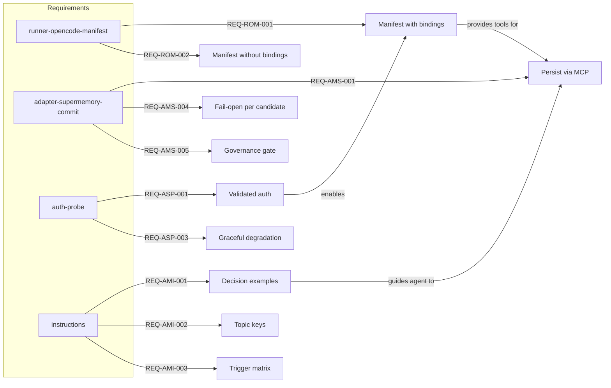

# Spec: Adaptive Memory Tool Binding Fix

## Source

- Proposal: `adaptive-memory-tool-binding-fix` proposal artifact
- Capabilities affected:
  - `runner-opencode-manifest` (modified)
  - `adaptive-memory-provider-supermemory` (modified)
  - `opencode-supermemory-auth-probe` (new)
  - `adaptive-memory-instructions` (modified)

## Requirements

### Capability: runner-opencode-manifest

REQ-ROM-001: `buildDeveloperTeamManifest` MUST resolve the `memoryBundle` value from the install plan and pass it to each agent and skill entry in the manifest, instead of hardcoding `undefined`.
  Priority: MUST
  Surface: Integration
  Rationale: Without a non-null `memoryBundle`, agents never receive memory tool bindings and cannot call `supermemory_memory` or `supermemory_recall`.

REQ-ROM-002: When no memory provider is configured or the provider is unavailable, `buildDeveloperTeamManifest` MUST pass `memoryBundle: undefined` (the current fallback) and MUST NOT emit an error.
  Priority: MUST
  Surface: Integration
  Rationale: Fail-open semantics — agents must continue working even without memory support.

REQ-ROM-003: The resolved `memoryBundle` MUST include the tool bindings for `supermemory_memory` and `supermemory_recall` when the Supermemory provider is active and authenticated.
  Priority: MUST
  Surface: Integration
  Rationale: These are the two tool operations agents need to save and recall memories.

### Capability: adaptive-memory-provider-supermemory

REQ-AMS-001: `commit()` in `adapter-supermemory` MUST persist each valid memory candidate by calling the Supermemory MCP `execute` endpoint, mapping the candidate's scope to the appropriate container tag.
  Priority: MUST
  Surface: Integration
  Rationale: The current `commit()` discards all candidates with a static reason, making memory persistence impossible.

REQ-AMS-002: For each candidate, `commit()` MUST return a per-candidate decision with an explicit `accepted` boolean and a human-readable `reason` string.
  Priority: MUST
  Surface: Data
  Rationale: Agents and diagnostics must know which memories were saved and which were rejected.

REQ-AMS-003: When a candidate has an existing memory ID, `commit()` MUST update the existing memory instead of creating a duplicate.
  Priority: SHOULD
  Surface: Data
  Rationale: Topic-key reuse requires update semantics to avoid duplicate memories.

REQ-AMS-004: `commit()` MUST preserve fail-open semantics: if an individual MCP call fails, the adapter MUST catch the error, mark that candidate as `accepted: false` with the error as reason, and continue processing remaining candidates.
  Priority: MUST
  Surface: Integration
  Rationale: A single memory persistence failure must not crash the agent or block subsequent candidates.

REQ-AMS-005: When governance validation rejects a candidate before the MCP call, `commit()` MUST still return `savedCount: 0` with diagnostics and MUST NOT attempt the MCP call.
  Priority: MUST
  Surface: Security
  Rationale: Governance rejection is a pre-check; bypassing it would violate the security model.

REQ-AMS-006: `loadContext()` and `search()` SHOULD return real results from the Supermemory MCP endpoint instead of empty arrays.
  Priority: SHOULD
  Surface: Integration
  Rationale: These methods are needed for memory recall; empty results make recall useless. This is SHOULD because the proposal's primary focus is `commit()`.

### Capability: opencode-supermemory-auth-probe

REQ-ASP-001: The OpenCode adapter MUST include an authentication probe function that checks the OpenCode MCP config for a valid Supermemory server entry with a non-empty API key before the memory bundle is injected.
  Priority: MUST
  Surface: Security
  Rationale: Without validation, broken or missing credentials cause silent failures at runtime when agents try to save.

REQ-ASP-002: When the auth probe succeeds (valid config and key found), the probe MUST return a result indicating `authenticatedRuntimeValidated: true` so the adapter's `health()` reports `available`.
  Priority: MUST
  Surface: Integration
  Rationale: The adapter gates injection on `authenticatedRuntimeValidated`; the probe must satisfy this gate.

REQ-ASP-003: When the auth probe fails (missing config, missing key, or invalid key format), the probe MUST emit a diagnostic message and the adapter MUST skip memory tool injection while allowing agents to continue running.
  Priority: MUST
  Surface: Integration
  Rationale: Fail-open — missing auth should degrade gracefully, not crash.

REQ-ASP-004: The auth probe function MUST be synchronous, matching the pattern used by the Pi adapter's `validateSupermemoryPiMcpConfig`.
  Priority: SHOULD
  Surface: Integration
  Rationale: The install plan builder is currently synchronous; an async probe would require a signature change. This is SHOULD because if an async probe is unavoidable, the builder signature may be updated.

### Capability: adaptive-memory-instructions

REQ-AMI-001: The adaptive-memory instruction bundle MUST contain a "Decision Examples" section with at least 5 concrete scenarios showing when to save, what topic key to use, and what content to include.
  Priority: MUST
  Surface: UI (prompt surface — agent-facing instructions)
  Rationale: Generic instructions give agents no actionable trigger. Concrete examples create clear save signals.

REQ-AMI-002: The instruction bundle MUST contain a "Suggested Topic Keys" reference table mapping common work types (architecture, bugfix, performance, config, preference, pattern, discovery) to stable topic key patterns.
  Priority: MUST
  Surface: UI (prompt surface)
  Rationale: Without suggested keys, agents invent ad-hoc keys that produce duplicate or unfindable memories.

REQ-AMI-003: The instruction bundle MUST contain a "Save Trigger Matrix" mapping agent lifecycle moments (architecture decision, bug fix completed, user preference learned, session close, non-obvious discovery, configuration change, pattern established) to explicit save actions.
  Priority: MUST
  Surface: UI (prompt surface)
  Rationale: Agents need a decision matrix to know exactly when to call memory tools without guessing.

REQ-AMI-004: The enhanced instructions MUST NOT remove or contradict any existing rules in the current instruction bundle.
  Priority: MUST
  Surface: UI (prompt surface)
  Rationale: Backward compatibility with agents trained on the current text; changes must be additive.

## Acceptance Scenarios

### Capability: runner-opencode-manifest

#### Scenario: Agent manifest receives memory tool bindings when provider is configured
**Given** a Supermemory provider is configured in `.deck/config.json` with `activeProvider: "supermemory"`
**And** the OpenCode MCP config contains a valid Supermemory server entry
**And** the auth probe succeeds
**When** `buildDeveloperTeamManifest` is called
**Then** each agent entry in the returned manifest has a non-null `memoryBundle` containing tool bindings for `supermemory_memory` and `supermemory_recall`
> Covers: REQ-ROM-001, REQ-ROM-003

#### Scenario: Agent manifest degrades gracefully when no provider configured
**Given** no memory provider is configured in `.deck/config.json`
**When** `buildDeveloperTeamManifest` is called
**Then** each agent entry has `memoryBundle: undefined`
**And** no error is thrown
> Covers: REQ-ROM-002

#### Scenario: Agent manifest degrades gracefully when provider is configured but unavailable
**Given** a Supermemory provider is configured but the auth probe fails
**When** `buildDeveloperTeamManifest` is called
**Then** each agent entry has `memoryBundle: undefined`
**And** a diagnostic is logged
> Covers: REQ-ROM-002

### Capability: adaptive-memory-provider-supermemory

#### Scenario: Valid memory candidate is persisted via MCP execute
**Given** a memory candidate passes governance validation
**And** the candidate has scope `p:deck`, content "Fixed N+1 query in UserList", and topic key `performance/user-list-query`
**And** the Supermemory MCP endpoint is reachable
**When** `commit()` is called with this candidate
**Then** the adapter calls MCP `execute` with the correct container tag and content
**And** the candidate's decision is `accepted: true`
**And** the commit result has `savedCount: 1`, `discardedCount: 0`
> Covers: REQ-AMS-001, REQ-AMS-002

#### Scenario: Existing memory is updated when candidate has existing ID
**Given** a memory candidate has an `existingMemoryId` field set
**And** the candidate passes governance validation
**When** `commit()` processes this candidate
**Then** the adapter calls the update endpoint (not create) with the existing ID
**And** the candidate's decision is `accepted: true`
> Covers: REQ-AMS-003

#### Scenario: Individual MCP call failure does not block remaining candidates
**Given** two memory candidates both pass governance validation
**And** the first MCP call throws a network error
**And** the second MCP call succeeds
**When** `commit()` processes both candidates
**Then** the first candidate is `accepted: false` with reason containing the error message
**And** the second candidate is `accepted: true`
**And** `savedCount: 1`, `discardedCount: 1`
**And** no exception propagates to the caller
> Covers: REQ-AMS-004

#### Scenario: Governance-rejected candidate is not sent to MCP
**Given** a memory candidate fails governance validation (e.g., disallowed container tag)
**When** `commit()` processes this candidate
**Then** the adapter does NOT call the MCP execute endpoint
**And** the candidate's decision is `accepted: false` with reason from governance
**And** `savedCount: 0`
> Covers: REQ-AMS-005

#### Scenario: Recall returns real results from Supermemory
**Given** memories exist in the Supermemory store for the project
**And** the MCP endpoint is reachable
**When** `loadContext()` or `search()` is called with a relevant query
**Then** the results include the stored memories (not empty arrays)
> Covers: REQ-AMS-006

### Capability: opencode-supermemory-auth-probe

#### Scenario: Auth probe succeeds with valid config
**Given** the OpenCode MCP config contains a Supermemory server entry with a non-empty API key
**When** the auth probe runs
**Then** the probe returns `authenticatedRuntimeValidated: true`
**And** the adapter's `health()` reports `available`
> Covers: REQ-ASP-001, REQ-ASP-002

#### Scenario: Auth probe fails with missing config
**Given** the OpenCode MCP config has no Supermemory server entry
**When** the auth probe runs
**Then** the probe emits a diagnostic message indicating the missing config
**And** the adapter skips memory tool injection
**And** agents continue running without memory tools
> Covers: REQ-ASP-003

#### Scenario: Auth probe fails with empty API key
**Given** the OpenCode MCP config has a Supermemory server entry with an empty or whitespace-only API key
**When** the auth probe runs
**Then** the probe emits a diagnostic message indicating invalid credentials
**And** the adapter skips memory tool injection
> Covers: REQ-ASP-003

#### Scenario: Auth probe is synchronous
**Given** the auth probe function is invoked during install plan construction
**When** the probe runs
**Then** it returns its result synchronously without requiring `await` or `.then()`
> Covers: REQ-ASP-004

### Capability: adaptive-memory-instructions

#### Scenario: Instruction bundle contains decision examples
**Given** the adaptive-memory instruction bundle is loaded
**When** an agent reads the instructions
**Then** there is a section titled "Decision Examples" (or equivalent)
**And** it contains at least 5 concrete scenarios with: trigger description, suggested topic key, and example content
> Covers: REQ-AMI-001

#### Scenario: Instruction bundle contains topic key reference
**Given** the adaptive-memory instruction bundle is loaded
**When** an agent reads the instructions
**Then** there is a "Suggested Topic Keys" section
**And** it maps at least these work types: architecture, bugfix, performance, config, preference, pattern, discovery
> Covers: REQ-AMI-002

#### Scenario: Instruction bundle contains save trigger matrix
**Given** the adaptive-memory instruction bundle is loaded
**When** an agent reads the instructions
**Then** there is a "Save Trigger Matrix" section
**And** it maps at least these lifecycle moments: architecture decision, bug fix completed, user preference learned, session close, non-obvious discovery, configuration change, pattern established
> Covers: REQ-AMI-003

#### Scenario: Enhanced instructions are backward compatible
**Given** the original instruction bundle rules (before this change)
**When** the enhanced instruction bundle is compared to the original
**Then** every original rule is still present and unmodified
**And** new sections are additive only
> Covers: REQ-AMI-004

## Validation Rules

| Field / Input | Rule | Error Message | REQ-ID |
|---|---|---|---|
| Memory candidate scope | Must match a valid container tag prefix (`u:`, `t:`, `o:`, `p:`) | "Invalid container tag format: {scope}" | REQ-AMS-005 |
| Memory candidate content | Must be non-empty after trim | "Memory content must not be empty" | REQ-AMS-005 |
| Supermemory API key | Must be non-empty, non-whitespace | "Supermemory API key is missing or invalid" | REQ-ASP-003 |
| MCP config server entry | Must contain a `supermemory` entry with URL and auth | "No Supermemory MCP server configured" | REQ-ASP-001 |
| Decision examples count | Must be >= 5 entries | N/A (build-time check) | REQ-AMI-001 |
| Topic key mappings | Must cover at least 7 work types | N/A (build-time check) | REQ-AMI-002 |
| Save trigger moments | Must cover at least 7 lifecycle moments | N/A (build-time check) | REQ-AMI-003 |

## Error Contracts

| Condition | Error Code | Message | Handling |
|---|---|---|---|
| MCP execute call fails during commit | `MCP_EXECUTE_ERROR` | "Failed to persist memory: {error.message}" | Mark candidate `accepted: false`, continue processing |
| Governance rejects candidate | `GOVERNANCE_REJECTED` | "{governance reason}" | Skip MCP call, mark `accepted: false` |
| Auth probe finds missing config | `AUTH_CONFIG_MISSING` | "No Supermemory MCP server configured — skipping memory injection" | Emit diagnostic, skip injection |
| Auth probe finds invalid key | `AUTH_KEY_INVALID` | "Supermemory API key is missing or invalid — skipping memory injection" | Emit diagnostic, skip injection |
| No memory provider configured | N/A | N/A (silent) | Pass `memoryBundle: undefined`, no diagnostic needed |

## States and Transitions

### Adapter Health States

| State | Description | Entry Criteria |
|---|---|---|
| `available` | Supermemory adapter can accept commits and recalls | Auth probe succeeded, `authenticatedRuntimeValidated: true` |
| `degraded` | Supermemory adapter is present but not functional | Auth probe failed or MCP endpoint unreachable |
| `unavailable` | No memory provider configured | No provider in config or `activeProvider` is empty |

### Transitions

| From | To | Trigger | Side Effects |
|---|---|---|---|
| `unavailable` | `available` | Provider configured + auth probe succeeds | Tool bindings injected into agent manifests |
| `unavailable` | `degraded` | Provider configured but auth probe fails | Diagnostic emitted, no tool binding injection |
| `degraded` | `available` | Auth probe succeeds on retry | Tool bindings injected |
| `available` | `degraded` | MCP endpoint becomes unreachable during runtime | `commit()` returns `accepted: false` per candidate |

## Open Questions

1. **Exact MCP SDK method for memory creation** — The proposal mentions `client.add` and `client.memories.updateMemory` but the specific method signature for new memory creation needs confirmation during implementation.
2. **Async vs sync auth probe** — The proposal recommends synchronous (matching Pi adapter), but if config reading requires async I/O, the install plan builder signature may need to change.
3. **`loadContext` and `search` scope** — The proposal focuses on `commit()` but these methods also return empty results. Whether to fix them in this change or a follow-up is an open decision.
4. **Memory candidate ID format** — How existing memory IDs are represented (string, numeric, UUID) affects the update-vs-create logic in `commit()`. Needs confirmation from the Supermemory SDK.

## Compliance Matrix

| REQ-ID | Scenario(s) | Status |
|---|---|---|
| REQ-ROM-001 | Agent manifest receives memory tool bindings | Defined |
| REQ-ROM-002 | Agent manifest degrades gracefully (no provider, provider unavailable) | Defined |
| REQ-ROM-003 | Agent manifest receives memory tool bindings | Defined |
| REQ-AMS-001 | Valid memory candidate is persisted via MCP execute | Defined |
| REQ-AMS-002 | Valid memory candidate is persisted via MCP execute | Defined |
| REQ-AMS-003 | Existing memory is updated when candidate has existing ID | Defined |
| REQ-AMS-004 | Individual MCP call failure does not block remaining candidates | Defined |
| REQ-AMS-005 | Governance-rejected candidate is not sent to MCP | Defined |
| REQ-AMS-006 | Recall returns real results from Supermemory | Defined |
| REQ-ASP-001 | Auth probe succeeds with valid config | Defined |
| REQ-ASP-002 | Auth probe succeeds with valid config | Defined |
| REQ-ASP-003 | Auth probe fails (missing config, empty key) | Defined |
| REQ-ASP-004 | Auth probe is synchronous | Defined |
| REQ-AMI-001 | Instruction bundle contains decision examples | Defined |
| REQ-AMI-002 | Instruction bundle contains topic key reference | Defined |
| REQ-AMI-003 | Instruction bundle contains save trigger matrix | Defined |
| REQ-AMI-004 | Enhanced instructions are backward compatible | Defined |

## Mermaid Summary Source

