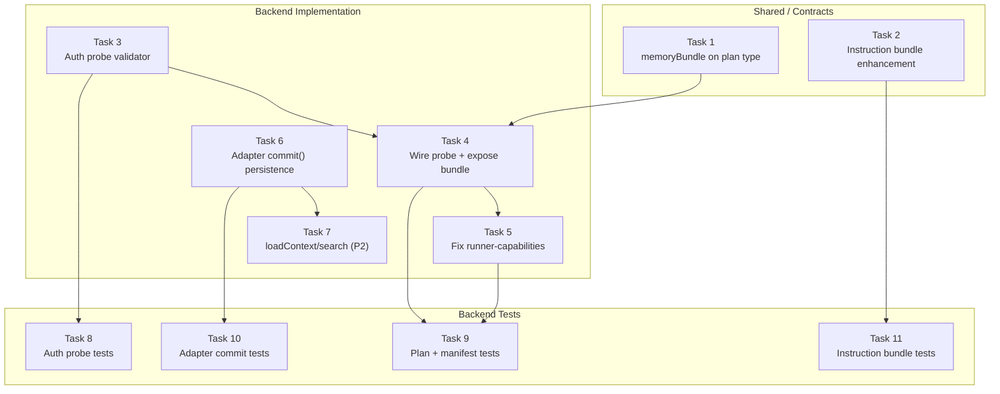

# Tasks: Adaptive Memory Tool Binding Fix

## Source

- Spec: `adaptive-memory-tool-binding-fix` spec artifact
- Design: `adaptive-memory-tool-binding-fix` design artifact
- Capabilities affected: `runner-opencode-manifest` (modified), `adaptive-memory-provider-supermemory` (modified), `opencode-supermemory-auth-probe` (new), `adaptive-memory-instructions` (modified)

## Task Groups

### Group: Shared / Contracts

#### Task 1: Expose `memoryBundle` on `OpenCodeDeveloperTeamInstallPlan`

**Owner**: General Apply
**Priority**: P0
**Complexity**: Low
**Parallel**: Yes
**Depends on**: none

**Description**
Add an optional `memoryBundle?: MemoryInjectionBundle` field to the `OpenCodeDeveloperTeamInstallPlan` type and populate it in the return value of `buildOpenCodeDeveloperTeamInstallPlan`. The function already resolves `memoryBundle` via `resolveOpenCodeMemoryInjection(options)` at line 262 but discards it from the returned plan object. Add `memoryBundle` to the return statement so downstream consumers (especially `buildDeveloperTeamManifest` in `runner-capabilities.ts`) can read it from the plan.

**Files**
- `packages/adapter-opencode/src/developer-team-install.ts` — modify (type + return value)

**Verification**
TypeScript compiles without errors. The `OpenCodeDeveloperTeamInstallPlan` type includes the new field. The returned object from `buildOpenCodeDeveloperTeamInstallPlan` includes `memoryBundle`.

**REQ coverage**: REQ-ROM-001 (partial — enables downstream consumption)

---

#### Task 2: Enhance adaptive-memory instruction bundle

**Owner**: General Apply
**Priority**: P0
**Complexity**: Medium
**Parallel**: Yes
**Depends on**: none

**Description**
Enhance the canonical instruction bundle at `packages/core/src/teams/developer/instruction-bundles/adaptive-memory.ts` by adding three new sections to all three surfaces (agent, session, skill). Changes must be strictly additive — no existing rules may be removed or contradicted.

1. **Decision Examples**: A section with at least 5 concrete scenarios. Each scenario must include: trigger description, suggested topic key, and example content. Examples should cover: architecture decision, user preference correction, non-obvious discovery, bug fix with root cause, and session-close summary.

2. **Suggested Topic Keys**: A reference table mapping at least 7 work types (architecture, bugfix, performance, config, preference, pattern, discovery) to stable topic key patterns (e.g., `architecture/auth-model`, `bugfix/null-pointer-list`).

3. **Save Trigger Matrix**: A table mapping at least 7 lifecycle moments (architecture decision made, bug fix completed, user preference learned, session close, non-obvious discovery, configuration change, pattern established) to explicit save actions.

**Files**
- `packages/core/src/teams/developer/instruction-bundles/adaptive-memory.ts` — modify

**Verification**
The exported instruction strings for all three surfaces contain section headers for "Decision Examples", "Suggested Topic Keys", and "Save Trigger Matrix". The Decision Examples section has ≥5 entries. The Suggested Topic Keys section covers ≥7 work types. The Save Trigger Matrix covers ≥7 lifecycle moments. All original instruction text is preserved unmodified.

**REQ coverage**: REQ-AMI-001, REQ-AMI-002, REQ-AMI-003, REQ-AMI-004

---

### Group: Backend

#### Task 3: Add `validateSupermemoryOpenCodeMcpConfig` auth probe

**Owner**: Backend Apply
**Priority**: P0
**Complexity**: Medium
**Parallel**: Yes
**Depends on**: none

**Description**
Add a `validateSupermemoryOpenCodeMcpConfig` function to `packages/adapter-opencode/src/opencode-mcp-config.ts` that mirrors the Pi adapter's `validateSupermemoryPiMcpConfig` pattern. The function must:

1. Read `opencode.json` from `~/.config/opencode/opencode.json` (or a provided `configPath`).
2. Parse the JSON and look for `mcp.supermemory` (or a provided `serverName`).
3. Validate that the entry exists, has `type: "remote"`, a non-empty `url`, and an `Authorization` header containing a non-empty bearer token reference (the `{env:SUPERMEMORY_API_KEY}` interpolation pattern — the validator checks structure, not runtime env var resolution).
4. Return a result with `ok: true/false`, diagnostics array, path, and serverName.
5. Be synchronous (no async I/O) — matches Pi pattern and the synchronous install plan builder.
6. Never log or expose the raw token value — use redacted diagnostics.

Export the function and a `OpenCodeMcpConfigValidationResult` type.

**Files**
- `packages/adapter-opencode/src/opencode-mcp-config.ts` — modify (add validator + type)

**Verification**
TypeScript compiles. The function is exported and synchronous. Calling with a valid config returns `ok: true`. Calling with missing/invalid config returns `ok: false` with diagnostics. No raw token appears in diagnostics.

**REQ coverage**: REQ-ASP-001, REQ-ASP-003, REQ-ASP-004

---

#### Task 4: Wire auth probe into developer-team-install memory resolution

**Owner**: Backend Apply
**Priority**: P0
**Complexity**: Medium
**Parallel**: No — depends on Task 1 (type field) and Task 3 (auth probe function)
**Depends on**: Task 1, Task 3

**Description**
Enhance `resolveOpenCodeMemoryInjection` in `developer-team-install.ts` to call `validateSupermemoryOpenCodeMcpConfig` when the resolved memory provider is Supermemory. When the provider is Supermemory:

1. Call `validateSupermemoryOpenCodeMcpConfig` with the appropriate `configDir`/`configPath`.
2. If validation succeeds, configure the provider with `authenticatedRuntimeValidated: true` via `provider.adapter.configure()`.
3. If validation fails, emit a diagnostic and return `bundle: undefined` (fail-open — agents continue without memory tools).

Also ensure `buildOpenCodeDeveloperTeamInstallPlan` includes `memoryBundle` in its return value (this is the Task 1 type field, wired to the actual resolved bundle).

**Files**
- `packages/adapter-opencode/src/developer-team-install.ts` — modify (enhance `resolveOpenCodeMemoryInjection`, update return)

**Verification**
When a Supermemory provider is configured and the MCP config is valid, the install plan includes `memoryBundle` with `authenticatedRuntimeValidated: true`. When the config is invalid, the plan has `memoryBundle: undefined` and includes a diagnostic. When no provider is configured, behavior is unchanged.

**REQ coverage**: REQ-ASP-002, REQ-ROM-001 (partial), REQ-ROM-002

---

#### Task 5: Fix `buildDeveloperTeamManifest` to read `plan.memoryBundle`

**Owner**: Backend Apply
**Priority**: P0
**Complexity**: Low
**Parallel**: No — depends on Task 1 (type field) and Task 4 (bundle on plan)
**Depends on**: Task 1, Task 4

**Description**
In `packages/adapter-opencode/src/runner-capabilities.ts`, replace both hardcoded `memoryBundle: undefined` (lines 219 and 227) with `plan.memoryBundle` (or `undefined` if the plan has no bundle). The plan object returned by `buildOpenCodeDeveloperTeamInstallPlan` now carries the `memoryBundle` field (added in Task 1 and populated in Task 4).

- For agents array: change `memoryBundle: undefined` → `memoryBundle: plan.memoryBundle`
- For skills array: change `memoryBundle: undefined` → `memoryBundle: plan.memoryBundle`

This is the final wiring that makes memory tool bindings flow from provider → plan → manifest → agent/skill entries.

**Files**
- `packages/adapter-opencode/src/runner-capabilities.ts` — modify (2 line changes)

**Verification**
`buildDeveloperTeamManifest` returns agents and skills with non-null `memoryBundle` when a memory provider is configured and authenticated. Returns `memoryBundle: undefined` when no provider is configured (no error thrown).

**REQ coverage**: REQ-ROM-001, REQ-ROM-002, REQ-ROM-003

---

#### Task 6: Implement fetch-based persistence in adapter-supermemory `commit()`

**Owner**: Backend Apply
**Priority**: P0
**Complexity**: High
**Parallel**: Yes
**Depends on**: none

**Description**
Replace the discard-all logic in `commit()` in `packages/adapter-supermemory/src/index.ts` with real persistence via native `fetch`.

1. Add `apiKey?: string` and `mcpServerUrl?: string` optional fields to `SupermemoryMemoryProviderConfig`. Default `mcpServerUrl` to `SUPERMEMORY_MCP_SERVER_URL` if not provided. Read `apiKey` from `config.apiKey` with `process.env.SUPERMEMORY_API_KEY` fallback.

2. After governance validation passes, for each candidate:
   - Map the candidate's scope to the appropriate container tag.
   - If the candidate has an `existingMemoryId`, call the update endpoint; otherwise call the create/add endpoint.
   - Use native `fetch` (POST to the Supermemory REST endpoint) with `x-supermemory-api-key` header.
   - Wrap each call in try/catch: on success, mark `accepted: true`; on failure, mark `accepted: false` with the error as reason, and continue with remaining candidates.
   - Update `savedCount` and `discardedCount` accordingly.

3. When governance rejects a candidate, do NOT call MCP — mark `accepted: false` with governance reason (existing behavior, preserved).

4. The exact Supermemory REST payload shape is an open question (see Open Questions). Use a pragmatic interim: POST to `{mcpServerUrl}/api/memories/add` (or the known MCP endpoint) with a clear TODO comment for correction once the exact schema is confirmed.

**Files**
- `packages/adapter-supermemory/src/index.ts` — modify (config type, commit logic)

**Verification**
Mock `globalThis.fetch`. Test: (a) valid candidate persists → `savedCount: 1`, (b) fetch throws → `accepted: false` with error, remaining candidates processed, (c) governance rejection → no fetch call, `savedCount: 0`, (d) `apiKey` from env var fallback works.

**REQ coverage**: REQ-AMS-001, REQ-AMS-002, REQ-AMS-003, REQ-AMS-004, REQ-AMS-005

---

#### Task 7: Implement fetch-based `loadContext` and `search` in adapter-supermemory

**Owner**: Backend Apply
**Priority**: P2
**Complexity**: Medium
**Parallel**: No — depends on Task 6 (shares config + fetch pattern)
**Depends on**: Task 6

**Description**
Update `loadContext()` and `search()` in `packages/adapter-supermemory/src/index.ts` to call the Supermemory API via native `fetch` instead of returning empty arrays. Use the same `apiKey`/`mcpServerUrl` config from Task 6. Map results back to the `AdaptiveMemoryContextResult`/`AdaptiveMemorySearchResult` shapes. Preserve governance validation as a pre-check (reject invalid scopes/filters before calling the API). This is a P2/SHOULD task — REQ-AMS-006.

**Files**
- `packages/adapter-supermemory/src/index.ts` — modify (loadContext + search logic)

**Verification**
Mock `globalThis.fetch`. Test: (a) `loadContext` returns items from API response, (b) `search` returns items matching query, (c) governance-rejected scopes return empty with diagnostic, (d) fetch failure returns empty with error diagnostic.

**REQ coverage**: REQ-AMS-006

---

### Group: Backend Tests

#### Task 8: Tests for auth probe validator

**Owner**: Backend Apply
**Priority**: P1
**Complexity**: Medium
**Parallel**: Yes
**Depends on**: Task 3

**Description**
Add unit tests for `validateSupermemoryOpenCodeMcpConfig` in `packages/adapter-opencode/src/opencode-mcp-config.test.ts` (create if needed). Test cases:

1. Valid config with Supermemory entry → `ok: true`, no diagnostics
2. Missing `opencode.json` → `ok: false`, diagnostic about missing config
3. Malformed JSON → `ok: false`, diagnostic about parse error
4. No `mcp.supermemory` entry → `ok: false`, diagnostic about missing server
5. Supermemory entry with empty/missing `Authorization` header → `ok: false`, diagnostic about invalid credentials
6. Custom `serverName` parameter → validates against provided name
7. No raw token appears in any diagnostic output

Mock `existsSync` and `readFileSync` to control file existence and content.

**Files**
- `packages/adapter-opencode/src/opencode-mcp-config.test.ts` — create or modify

**Verification**
All test cases pass. No flaky tests (all file I/O mocked).

**REQ coverage**: REQ-ASP-001, REQ-ASP-003, REQ-ASP-004

---

#### Task 9: Tests for memoryBundle flow through install plan and manifest

**Owner**: Backend Apply
**Priority**: P1
**Complexity**: Medium
**Parallel**: No — depends on Task 4, Task 5
**Depends on**: Task 4, Task 5

**Description**
Add/update tests in `packages/adapter-opencode/src/developer-team-install.test.ts` and the runner-capabilities test file. Test cases:

1. `buildOpenCodeDeveloperTeamInstallPlan` returns `memoryBundle` on the plan when a Supermemory provider is passed with valid auth
2. `buildOpenCodeDeveloperTeamInstallPlan` returns `memoryBundle: undefined` when no provider is configured (no error)
3. `buildOpenCodeDeveloperTeamInstallPlan` returns `memoryBundle: undefined` with diagnostic when auth probe fails
4. `buildDeveloperTeamManifest` (runner-capabilities) returns agents with non-null `memoryBundle` when plan has one
5. `buildDeveloperTeamManifest` returns agents with `memoryBundle: undefined` when plan has none

**Files**
- `packages/adapter-opencode/src/developer-team-install.test.ts` — modify
- `packages/adapter-opencode/src/runner-capabilities.test.ts` — modify (if exists) or add inline tests

**Verification**
All test cases pass. Build succeeds.

**REQ coverage**: REQ-ROM-001, REQ-ROM-002, REQ-ROM-003, REQ-ASP-002

---

#### Task 10: Tests for adapter-supermemory commit() persistence

**Owner**: Backend Apply
**Priority**: P1
**Complexity**: Medium
**Parallel**: No — depends on Task 6
**Depends on**: Task 6

**Description**
Update `packages/adapter-supermemory/src/index.test.ts` to cover the new fetch-based `commit()` logic. Test cases:

1. Successful commit: mock `fetch` to return 200 → `savedCount: 1`, `accepted: true`
2. Per-candidate failure: first fetch throws, second succeeds → `savedCount: 1`, `discardedCount: 1`, first has error reason
3. Governance rejection: candidate with invalid scope → no fetch call, `savedCount: 0`, governance reason
4. Update existing memory: candidate with `existingMemoryId` → calls update endpoint, not create
5. Missing `apiKey` with env var fallback: `config.apiKey` undefined but `SUPERMEMORY_API_KEY` env set → still persists
6. Missing `apiKey` and no env var: → `accepted: false` with reason about missing credentials

Preserve existing governance-rejection tests (update mocks, do not remove).

**Files**
- `packages/adapter-supermemory/src/index.test.ts` — modify

**Verification**
All test cases pass. Existing governance tests still pass (updated for new behavior).

**REQ coverage**: REQ-AMS-001, REQ-AMS-002, REQ-AMS-003, REQ-AMS-004, REQ-AMS-005

---

#### Task 11: Tests for instruction bundle content assertions

**Owner**: Backend Apply
**Priority**: P1
**Complexity**: Low
**Parallel**: No — depends on Task 2
**Depends on**: Task 2

**Description**
Add tests to verify the enhanced instruction bundle content. Test cases:

1. Each surface (agent, session, skill) contains a "Decision Examples" section with ≥5 entries
2. Each surface contains a "Suggested Topic Keys" section covering ≥7 work types
3. Each surface contains a "Save Trigger Matrix" covering ≥7 lifecycle moments
4. No existing rule text from the pre-change bundle is missing or contradicted (snapshot or substring assertions)

These can be simple string-contains or regex-based assertions against the exported instruction fragments.

**Files**
- `packages/core/src/teams/developer/instruction-bundles/adaptive-memory.test.ts` — create or modify

**Verification**
All assertions pass. Count assertions use ≥ comparisons for forward compatibility.

**REQ coverage**: REQ-AMI-001, REQ-AMI-002, REQ-AMI-003, REQ-AMI-004

---

## Dependency Graph

```
Task 1 (Shared: type) ─────────────────────────┐
Task 2 (Shared: instructions) ────────┐         │
Task 3 (Backend: auth probe) ───┐     │         │
Task 6 (Backend: adapter commit) │     │         │
                                │     │         │
                                ▼     │         ▼
Task 4 (Backend: wire probe) ◄──┤     │    Task 4 ◄── Task 1
                                │     │
                                │     ▼
                                │   Task 11 (Tests: instructions) ◄── Task 2
                                ▼
Task 5 (Backend: manifest fix) ◄── Task 1 + Task 4
     │
     ▼
Task 9 (Tests: plan + manifest) ◄── Task 4 + Task 5
                                │
Task 6 (Backend: adapter commit) │
     │                           │
     ▼                           │
Task 7 (Backend: loadContext/search) ◄── Task 6
Task 10 (Tests: adapter commit) ◄── Task 6
Task 8 (Tests: auth probe) ◄── Task 3
```

## Parallelization Plan

| Phase | Tasks | Can Run in Parallel |
|---|---|---|
| Shared / Contracts | 1, 2 | Yes — independent type change and instruction enhancement |
| Backend (wave 1) | 3, 6 | Yes — auth probe and adapter commit are independent |
| Backend (wave 2) | 4 | No — depends on Task 1 + Task 3 |
| Backend (wave 3) | 5 | No — depends on Task 1 + Task 4 |
| Backend (wave 4) | 7 | No — depends on Task 6 (P2, can defer) |
| Tests (wave 1) | 8 | Yes — depends only on Task 3, can run with wave 2 backend |
| Tests (wave 2) | 9 | No — depends on Task 4 + Task 5 |
| Tests (wave 3) | 10 | No — depends on Task 6, can run with wave 4 backend |
| Tests (wave 4) | 11 | Yes — depends only on Task 2 |

## Responsibility Contracts

| Contract / Boundary | Owner | Consumers | Notes |
|---|---|---|---|
| `OpenCodeDeveloperTeamInstallPlan.memoryBundle` field | General Apply (Task 1) | Backend Apply (Tasks 4, 5, 9) | Optional field; consumers must handle `undefined` |
| `validateSupermemoryOpenCodeMcpConfig` function | Backend Apply (Task 3) | Backend Apply (Task 4, 8) | Sync function, returns `{ ok, diagnostics, path, serverName }` |
| `SupermemoryMemoryProviderConfig.apiKey` / `mcpServerUrl` fields | Backend Apply (Task 6) | Backend Apply (Tasks 7, 10) | Optional fields with env var fallback |
| Enhanced instruction bundle content | General Apply (Task 2) | Backend Apply (Task 11) | Additive only — no existing rules modified |

## Complexity Summary

| Complexity | Count | Task Numbers |
|---|---|---|
| Low | 3 | 1, 5, 11 |
| Medium | 6 | 2, 3, 4, 7, 8, 9 |
| High | 1 | 6 |

## Flagged for Splitting

- **Task 6 (adapter-supermemory commit)**: High complexity, touches fetch-based persistence with multiple error paths. If the Supermemory REST API payload shape is uncertain, split into: (6a) config fields + fetch scaffolding + happy path, (6b) error handling + env var fallback + update-vs-create logic. The Orchestrator may choose to keep as one task if the implementor has access to Supermemory API documentation.

## Review Workload Forecast

| Signal | Value |
|---|---|
| Estimated changed lines | 400-800 |
| 400-line budget risk | Medium |
| Scope reduction recommended | Yes — Task 7 (loadContext/search) is P2 and can be deferred |
| Sequential work slices recommended | Yes — 4 waves of backend + 4 waves of tests |
| Decision needed before Apply | Yes — Supermemory REST API payload shape (see Open Questions) |

**Rationale**: The core changes span 5 implementation files and 4 test files. The adapter-supermemory commit() rewrite (Task 6) is the highest-risk item due to the unknown REST payload shape. Deferring Task 7 (loadContext/search, P2) reduces scope by ~100 lines. The auth probe (Task 3) and instruction bundle (Task 2) are well-scoped and low-risk. The runner-capabilities fix (Task 5) is a 2-line change with high impact. Total estimated: ~500-700 lines including tests.

## Open Questions / Blockers

1. **Supermemory REST API payload shape** (implementation-blocking for Task 6)
   - The exact HTTP endpoint, headers, and JSON body for creating/updating memories via the Supermemory REST API is not documented in the codebase.
   - The adapter currently references `client.add` and `client.memories.updateMemory` as MCP SDK methods but the underlying HTTP contract is unknown.
   - **Recommended handling**: Implement Task 6 with a clearly marked interim endpoint (e.g., `POST {mcpServerUrl}/api/memories/add`) and TODO comments. The architecture (per-candidate fetch, error handling, decision mapping) is independent of the exact URL/path. A follow-up commit can correct the endpoint once confirmed.
   - **Alternative**: If the Supermemory MCP server documentation is available at Apply time, the implementor should use the correct endpoint directly.

2. **OpenCode MCP config URL mismatch** (allowed-with-stub)
   - The adapter hardcodes `SUPERMEMORY_MCP_SERVER_URL = "https://supermemory-new.stlmcp.com"` but OpenCode's MCP config writer uses `SUPERMEMORY_MCP_URL = "https://mcp.supermemory.ai/mcp"`. These may be different services.
   - Task 6 adds `mcpServerUrl` to the config so the caller can override, but the default mismatch needs validation.
   - **Recommended handling**: Use the config's `mcpServerUrl` if provided; fall back to the hardcoded constant. The validator (Task 3) checks the OpenCode config URL but doesn't need to match the adapter's constant.

3. **Memory candidate `existingMemoryId` format** (non-blocking)
   - How existing memory IDs are represented (string, numeric, UUID) affects the update-vs-create logic in `commit()`.
   - **Recommended handling**: Treat `existingMemoryId` as an opaque string. If present, use update endpoint; if absent, use create endpoint.

## Mermaid Summary Source


