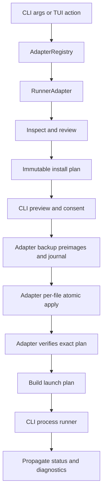

# Design: First-Class Codex CLI Runner Support

## Architectural decision

`RunnerAdapter` becomes the single operational runner abstraction. `AdapterRegistry` becomes the only runtime composition registry. The existing capability/parity registry remains the declarative description of support and gaps. `RunnerCapabilities` is temporarily produced as a compatibility projection and is not allowed to become a second effect path.

Adapters continue to own runner-native inspection, configuration writes, semantic verification, backups, and rollback behind typed project-scoped contracts. The CLI owns authorization, orchestration, user consent, and launch process effects. This matches the current effectful adapter direction and avoids pretending that the existing port is already plan-only.

This supersedes the incomplete mechanism of the archived hexagonal change while preserving its goal: a new runner should require an adapter package and composition-root registration, not runner-specific edits across the TUI.

## Target flow



## Launch contract

Add runner-neutral discriminated launch types to `packages/core/src/runner-adapter.ts`:

```ts
type RunnerLaunchBase = {
  projectRoot: string;
  teamId: string;
  modelId?: string;
  reasoningLevel?: string;
};

export type RunnerLaunchInput =
  | (RunnerLaunchBase & { mode: "interactive" })
  | (RunnerLaunchBase & { mode: "exec"; prompt: readonly string[]; stdin: "inherit" | "closed" })
  | (RunnerLaunchBase & { mode: "resume-by-id"; sessionId: string })
  | (RunnerLaunchBase & { mode: "resume-latest" });

export type RunnerLaunchPlan = {
  command: string;
  args: readonly string[];
  cwd: string;
  envOverlay?: Readonly<Record<string, { value: string; sensitive?: boolean }>>;
  stdio: "inherit" | "pipe";
  captureLimitBytes?: number;
};

export type RunnerLaunchResult =
  | { status: "ready"; plan: RunnerLaunchPlan; diagnostics: readonly RunnerDiagnostic[] }
  | { status: "unsupported"; code: string; diagnostics: readonly RunnerDiagnostic[] }
  | { status: "blocked"; code: string; diagnostics: readonly RunnerDiagnostic[] };
```

`RunnerAdapter.buildLaunchPlan` is initially optional so Pi and OpenCode can migrate additively. It becomes required for adapters declared CLI-launchable after the compatibility release.

Sandbox and approval overrides are intentionally absent from the initial public contract. A later change may add strict enums only with explicit authorization and preview semantics.

The CLI merges `envOverlay` into the inherited environment, redacts sensitive entries, bounds captured stdout/stderr, distinguishes exit from signal termination, and never treats truncated output as complete evidence.

## Trusted Developer Team execution boundary

Native Codex roles and skills are content distribution, not runtime authority. Phase 0 must identify a stable released Codex surface capable of producing trusted host events for `createDeveloperTeamRunnerHostBridgeV1`. Candidate surfaces include app-server or a released hook/plugin mechanism; prompts and agent-generated context are never trusted substitutes.

The bridge must preserve:

- trusted runner identity including `codex`;
- complete dossier revision chains;
- process-local one-use invocation authorization;
- controlled modification effects;
- centralized pair-CAS registry behavior and WAL recovery;
- bound targeted/affected/broad verification evidence.

Bridge capability is evaluated per production launch route. Interactive, exec, resume-by-ID, and resume-latest are independently first-class only when the route actually traverses or is observably bound to the selected trusted surface. A bridge implementation that exists only in tests or beside a plain unbound `codex` process does not satisfy activation.

If no released surface satisfies this contract, the adapter is limited to `static-compatible`. Installed content must omit claims that invocation authorization or controlled effects are active, and doctor/parity must expose those gaps. A first-class release is blocked unless the user explicitly approves a degraded beta.

## Package layout

```text
packages/adapter-codex/
├── package.json
└── src/
    ├── index.ts
    ├── types.ts
    ├── runner-adapter.ts
    ├── preflight.ts
    ├── team-catalog.ts
    ├── developer-team-install.ts
    ├── codex-config.ts
    ├── agents-config.ts
    ├── agents-instructions.ts
    ├── mcp-config.ts
    ├── model-config.ts
    ├── launch.ts
    ├── capability-catalog.ts
    ├── capability-inventory.ts
    ├── capability-plan.ts
    └── __fixtures__/codex/
```

The adapter depends on `@deck/core` and only on other packages justified by an existing neutral contract. It must not depend on Pi or OpenCode adapters.

## Codex materialization layout

```text
<project>/
├── AGENTS.md                         # Deck-owned marker block only
├── .agents/
│   └── skills/
│       ├── deck-*/SKILL.md           # Agent-bound and bootstrap Deck skills
│       └── <standalone-skill-id>/     # Complete canonical standalone bundles
└── .codex/
    ├── config.toml                   # Deck-owned tables/keys only
    └── agents/
        └── deck-*.toml               # Deck owns complete deck-* role files
```

Deck never creates `AGENTS.override.md`. Global `~/.codex` mutation is not part of the initial release.

## Ownership model

| Target | Ownership |
|---|---|
| `.agents/skills/deck-*/` | Complete file/directory ownership proven by manifest and hashes. |
| `.agents/skills/<standalone-skill-id>/` | Complete bundle ownership only after collision-safe creation/adoption evidence; includes support files. |
| `.codex/agents/deck-*.toml` | Complete file ownership proven by manifest and hashes. |
| `AGENTS.md` | Marker-delimited Deck section only. |
| `.codex/config.toml` | Exact allowlisted keys or complete Deck-namespaced tables only. |
| User roles, skills, MCP servers, comments, formatting | Never owned by Deck. |

A same-ID unowned target is a collision. Adoption requires a future explicit action; it is not implicit in install.

## Content and package taxonomy

The Codex adapter maintains six independent inventories:

| Inventory | Source of truth | Codex materialization/behavior |
|---|---|---|
| Agent roles and agent-bound skills | Developer Team catalog and manifest | Native `.codex/agents/deck-*.toml` plus their Deck skill content. |
| External standalone skills | `STANDALONE_SKILLS` and `getStandaloneSkill()` | Complete `.agents/skills/<skillId>/` package, preserving frontmatter and support files. Current baseline: 29. |
| Bootstrap skills | `getBootstrapSkillFiles()` | `deck-onboard` and `deck-archive`, installed and verified independently. |
| Package instructions | Canonical instruction bundle registry and Deck config | Deterministic prompt/tool-policy composition by selected surfaces. |
| Runtime capabilities/packages | Capability registry plus Codex adapter catalog | Install, reuse, configure, or report a gap independently of package instructions. |
| Runner-internal and runner-specific packages | Per-runner mappings | Explicit Codex disposition; no automatic Pi/OpenCode package inheritance. |

External standalone source may include scripts, references, assets, or other relative files. The adapter validates paths, rejects traversal/symlinks, plans every file independently, and verifies the complete bundle hash set. Generated `content.generated.ts` is binary packaging output and is changed only through the canonical generator.

### Package instruction matrix

| Package ID | Codex default | Instruction role | Independent runtime requirement |
|---|---:|---|---|
| `codebase-memory` | off | Graph/search workflow and tool guidance | Usable `codebase-memory-mcp`, valid MCP config, index readiness where required. |
| `code-economy` | on | Token-efficient coding behavior | Instruction-only baseline; no executable implied. |
| `context-mode` | off | Context processing workflow | Usable context-mode binary and MCP exposure. |
| `rtk` | off | Token-optimized CLI guidance | Usable RTK binary and any verified Codex shell integration. |
| `adaptive-memory` | off | Selected memory-provider behavior | Supported provider and verified transport/config. |
| `serena` | off | Symbolic navigation/edit policy | Usable Serena binary, MCP exposure, and role-specific tool policy. |

The adapter validates semantic equivalence in two layers. The parity validator compares the fields owned by the canonical parity schema: capability ID, canonical support status, provision mode, executable, and MCP server name. A separate package-instruction validator compares declared surfaces and tool policy with the canonical instruction-bundle registry. Presence-only validation is insufficient, and the plan does not assume fields that the parity schema does not own.

### Other packages and MCP capabilities

- Context7 is an MCP capability, not one of the six package-instruction IDs.
- Supermemory and Engram are provider capabilities; only the selected provider contributes adaptive-memory instructions.
- Internal inventory is exact: Pi owns internal `pi-mermaid`; OpenCode owns internal `opencode-mermaid-renderer` and `deck-model-variants`.
- `pi-hud` remains a user-facing optional Pi capability, not a silent/internal package. It receives an explicit Codex mapping, expected initially as `not-applicable` unless a Codex-native equivalent is designed and tested.
- Dispositions use canonical parity statuses (`supported`, `runner-specific`, `shared`, `manual-verified`, `gap`, `blocked`, `not-applicable`) plus typed provision metadata rather than inventing new status values.
- Shared binary detection does not imply skill or instruction selection, and instruction selection does not imply binary/MCP readiness.

## Source-preserving TOML strategy

Before implementation, run a bounded parser spike against a maintained Bun-compatible parser that exposes source ranges. Acceptance requires:

1. Parse comments, arrays, dotted keys, quoted keys, and unusual formatting.
2. Locate exact table/key source ranges.
3. Apply edits only to Deck-owned ranges.
4. Reparse the result semantically.
5. Assert unchanged bytes for every unowned range.

Selection criteria include a maintained released package, compatible license, Bun ESM support, pinned version, deterministic malformed-input behavior, and source-range fidelity.

Do not parse and fully reserialize existing config. Do not implement a broad handwritten TOML parser. Full support is blocked if no parser passes. A restricted append-only fallback may expose only operations whose collision freedom and byte preservation can be proven; owned-table updates remain `unsupported`, and any scope reduction returns for user approval.

## Transaction and rollback

```mermaid
sequenceDiagram
  participant U as User
  participant C as Deck CLI
  participant A as Codex Adapter
  participant F as Project Files
  participant B as Deck Backup Store

  U->>C: Review/apply Codex support
  C->>A: inspect(projectRoot)
  A->>F: read targets and ownership evidence
  A-->>C: immutable plan + collisions + diagnostics
  C->>U: preview exact mutation manifest
  U-->>C: confirm or --yes
  C->>A: apply(confirmed typed plan)
  A->>B: persist preimages and journal with restrictive mode
  A->>F: CAS preimage; temp write; per-file atomic rename
  A->>A: verify exact applied plan
  alt verification succeeds
    A-->>C: verified
  else verification fails
    A->>F: restore/delete only matching installed hashes
    C-->>U: failure and rollback result
  end
```

Each mutation record contains confined relative path, expected preimage kind/hash/mode, intended postimage hash/mode, ownership proof, and rollback action (`restore` or `delete`). Before every write the adapter revalidates project-root confinement, rejects symlinks/non-regular files, and performs compare-and-swap against the previewed preimage. Permissions are preserved unless a Deck-created file needs an explicit restrictive mode.

Multi-file installation is recoverable, not globally atomic: every target uses atomic replacement and the journal records prepared/applied/verified/rolled-back states. The existing Deck backup boundary stores preimages and journals with `0600`-equivalent permissions, bounded retention, and no secret values in diagnostics.

## Capability mapping

| Capability | Initial status | Implementation |
|---|---|---|
| Runtime/version | adapted | Binary detection plus bounded version/feature probes. |
| Interactive launch | adapted, mode-classified | Inherited-TTY plan; first-class only when bridge-bound, otherwise static-compatible. |
| Exec | adapted, mode-classified | Explicit exec plan and exit propagation; first-class only when bridge-bound. |
| Resume | adapted/conditional | Feature-probed plans with independent bridge classification. |
| Developer Team roles | native + adapted | `.codex/agents/deck-*.toml`. |
| Skills | native + shared | `.agents/skills/deck-*`. |
| Instructions | native + adapted | Marker-owned `AGENTS.md` block. |
| MCP stdio/HTTP | native + adapted | Allowlisted project TOML tables. |
| Model/reasoning | adapted | Explicit mapping; unknown values omitted. |
| No memory | native | No MCP provider configuration. |
| Supermemory | shared + adapted | Existing MCP/provider contract; credentials remain external. |
| Engram | deferred gap | Add only after verified Codex contract. |
| Context Mode | shared + adapted | Reuse binary and configure MCP/instructions. |
| Codebase Memory | shared + adapted | Reuse binary, configure MCP, expose index readiness. |
| Serena | shared + adapted | Reuse usable binary and project-aware MCP config. |
| Context7 | shared + adapted | Configure established MCP integration. |
| RTK | shared | Reuse binary and inject Codex-specific instructions. |
| Trusted runner-host bridge | required for first-class | Use a stable released Codex host surface; otherwise `static-compatible`. |
| App-server | conditional | Not required for launch; allowed if it is the stable bridge/status surface. |
| Plugins/hooks | conditional/deferred | Use only a stable released surface selected for the trusted bridge; otherwise defer. |

## Trust and security

- Inspect trust state but never change it.
- Report `materialized-but-inactive` when project config is not active.
- Allowlist only non-secret, non-denylisted project config.
- Never persist credentials, provider secrets, alternate endpoints, or API tokens.
- Default launch plans omit sandbox and approval overrides.
- Explicit future overrides must be typed, visible in preview, and never translate to bypass flags automatically.

## Model and reasoning behavior

Precedence remains:

1. Confirmed Codex runner capability.
2. Deck model catalog fallback.
3. Unknown, represented by omission.

The lead model may be supplied by the launch plan. Subagent assignments are serialized in role TOML only where Codex supports them. Unknown reasoning values are not normalized to a guessed default.

## CLI composition changes

- `apps/cli/src/runner-adapters.ts`: sole concrete runner registration point.
- `apps/cli/src/main.tsx`: create one registry, route generic launch, inject it into `DeckApp`.
- `apps/cli/src/runner-launch-command.ts`: own install/verify/launch orchestration and spawning.
- `apps/cli/src/cli-args.ts`: parse generic Pi/OpenCode/Codex launch forms.
- Existing Pi/OpenCode launch commands become compatibility wrappers for one release.
- `apps/cli/src/runner-capability-registry.ts` is removed after consumers use adapter metadata/projection.

## Public CLI grammar and consent

```text
deck codex developer
deck codex developer --install-only
deck codex developer exec -- <prompt...>
deck codex developer resume <session-id>
deck codex developer resume --last
```

`--dry-run` previews without mutation. `--yes` confirms the displayed Deck-owned mutation plan for non-interactive use; it never confirms project trust, credential changes, sandbox bypass, or approval bypass. If mutation is required and neither an interactive confirmation nor `--yes` exists, the command exits without writing.

`--local-only` is best-effort and honest: it resolves Git's effective worktree-aware exclude path (for example through `git rev-parse --git-path info/exclude`) and adds exact entries only for newly created, untracked, fully Deck-owned files. It never adds broad `.agents/` or `.codex/` patterns, never hides tracked files, and cannot hide a Deck marker inside shared `AGENTS.md` or config. Tracked/shared mutations remain visible in the preview. If the user requires zero visible tracked changes, Deck blocks required shared-file mutation and reports the resulting capability gaps. Deck never edits `.gitignore` implicitly and removes only its own exclude block during rollback.

## Targeted TUI and doctor changes

The TUI receives `AdapterRegistry` through dependencies. Closed unions become registered runner IDs only where Codex reaches the flow. Existing unrelated adapter-specific screens are not rewritten in this change.

Doctor consumes adapter inspection results and reports:

- binary and version readiness;
- trusted/active project config state;
- role, skill, and instruction presence/drift;
- MCP and shared-binary readiness;
- collisions and rollback conflicts;
- explicit unsupported/deferred capability gaps.

## Content-only upgrade synchronization

Codex implements `detectDeckInstall`, plan, backup, apply, verify, and rollback so `apps/cli/src/upgrade-command/runner-sync.ts` can synchronize managed content. Detection and planning include:

- agent roles and agent-bound skills;
- all current external standalone skill bundles and support files;
- `deck-onboard` and `deck-archive`;
- enabled package-instruction composition;
- stale managed files and removed catalog entries, without deleting unowned collisions.

Synchronization must not skip stale standalone/bootstrap content merely because no package instruction is enabled. The generic sync flow therefore separates “managed content exists” from “package instructions selected.” Binary and development sources must generate the same file plan.

Runner sync remains content-only. It may rewrite verified Deck-managed role, skill, bootstrap, and instruction content, but it never installs or updates runtime packages, MCP servers, providers, shared binaries, or runner-native optional capabilities. Those actions remain behind explicit review/install authorization.

## Compatibility policy

- Test the minimum supported stable Codex release and current stable release.
- Prefer feature probes over version comparisons.
- Unknown or older releases remain detectable but not ready for unsupported operations.
- Linux and macOS are initial targets. Windows support requires explicit path/process fixture evidence before declaration.
- The released-version matrix covers role discovery/schema, skills, multi-agent enablement, trust/project config, denylisted keys, MCP stdio and streamable HTTP, interactive/exec/resume grammar, model/reasoning keys, and the trusted bridge surface.
- Plugins/hooks and dynamic model inventory do not define initial readiness unless a released hook/plugin surface is selected for the trusted bridge.

## Verification design

Fixtures must cover absent, valid, malformed, unusual, colliding, stale, trusted, and untrusted project states. All process and filesystem effects are injected. Tests must never access the network, perform real installs, or write to the user's home.

Verification order:

1. Focused core launch/projection tests.
2. Codex adapter unit and fixture tests.
3. CLI parsing/spawn contract tests.
4. Runner install contract and render-only TUI tests.
5. Pi/OpenCode focused regressions.
6. `bunx tsc --noEmit`.
7. `bun test --timeout 30000`.
8. `bun run build` and binary smoke checks.
