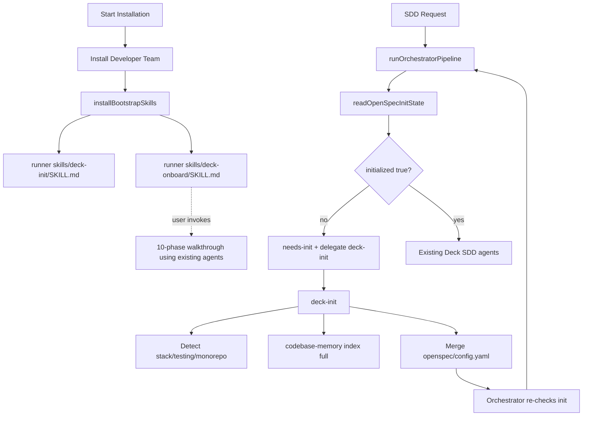

# Design: deck-init-onboard-system

## Source

- Proposal: `deck-init-onboard-system` proposal artifact
- Capabilities affected: `deck-init`, `deck-onboard`, `orchestrator-triage`
- Spec status: available
- Adaptive context: loaded from project memory; OpenSpec proposal/spec/state/events remain authoritative.

## Current Architecture Context

- Developer Team content is embedded in `packages/core/src/teams/developer/*` and materialized by runner adapters.
- Standalone skills exist under `packages/core/src/skills/external/`, but bootstrap skills need a separate Deck-owned catalog because they are initialization controls, not optional external standards skills.
- OpenCode install uses `packages/adapter-opencode/src/developer-team-install.ts`: `buildOpenCodeDeveloperTeamInstallPlan()`, `applyOpenCodeDeveloperTeamInstall()`, `verifyOpenCodeDeveloperTeamInstall()`, `backupDeveloperTeamFiles()`, and `rollbackDeveloperTeamFiles()`.
- Pi install uses `packages/adapter-pi/src/developer-team-install.ts` with the same plan/apply/verify/backup/rollback pattern.
- `packages/sdd-runtime/src/orchestrator/orchestrator-pipeline.ts` currently starts with audit/profile/risk routing; `PipelineOutcome` is `"completed" | "blocked" | "partial"`; no init gate exists.
- `packages/core/src/teams/developer/orchestrator-content.ts` already defines OpenSpec registry discipline and phase delegation rules.

## Proposed Architecture

Add two embedded bootstrap skills and install them into each runner skill directory during existing Start Installation. Add a runtime init gate before SDD audit/risk work. The gate reads `openspec/config.yaml`; if `initialized !== true`, the pipeline returns `needs-init` with a `deck-init` delegate request. The orchestrator delegates to `deck-init`, waits for the InitEnvelope, re-reads config, and proceeds only after initialization is recorded.

### Skill File Location

- Canonical source: `packages/core/src/skills/bootstrap/`.
- Files:
  - `index.ts` — barrel + `getBootstrapSkillFiles()`.
  - `deck-init-content.ts` — full `deck-init/SKILL.md` string.
  - `deck-onboard-content.ts` — full `deck-onboard/SKILL.md` string.
- Runner output:
  - OpenCode: `<configDir>/skills/deck-init/SKILL.md`, `<configDir>/skills/deck-onboard/SKILL.md`.
  - Pi: Pi adapter-resolved runner skill dir for `deck-init/SKILL.md` and `deck-onboard/SKILL.md`.
- These are not `DEVELOPER_TEAM_AGENTS` and do not clone Gentle-AI SDD phases.

### Inject() Equivalent

- Add `installBootstrapSkills()` in:
  - `packages/adapter-opencode/src/developer-team-install.ts`
  - `packages/adapter-pi/src/developer-team-install.ts`
- Responsibilities:
  - Load `getBootstrapSkillFiles()` from `@deck/core/skills/bootstrap`.
  - Resolve the runner skill directory.
  - Validate skill IDs with existing standalone-skill path traversal constraints.
  - Create skill directories when missing.
  - Compare existing `SKILL.md`; skip if identical.
  - Return file statuses: `created | updated | unchanged`.
- Integration:
  - Runs as part of Start Installation after developer team install.
  - Included in backup/rollback/verify flows.
  - Safe to re-run; no separate TUI step.

### Orchestrator Gate

- Add `readOpenSpecInitState(projectRoot)` as the first step in `runOrchestratorPipeline()`.
- Extend contracts:
  - `PipelineOutcome = "completed" | "blocked" | "partial" | "needs-init"`.
  - `OrchestratorPipelineInput` gains `projectRoot: string` or an equivalent required root source.
  - `OrchestratorPipelineResult` gains `delegate?: { skillId: "deck-init"; reason: string }`.
- Early return when uninitialized:
  - `outcome: "needs-init"`
  - `delegate: { skillId: "deck-init", reason: "openspec/config.yaml missing initialized: true" }`
  - conservative defaults for existing required result fields.
- `orchestrator-content.ts` update:
  - Treat `needs-init` as a hard pre-SDD gate.
  - Delegate only to `deck-init`.
  - Wait for InitEnvelope, re-check `readOpenSpecInitState(projectRoot)`, then proceed only if `initialized === true`.

### Init-State Reader

- Create `packages/sdd-runtime/src/orchestrator/init-state.ts`.
- Contract:

```ts
export interface InitState {
  initialized: false | true;
  last_index?: string;
  index_mode?: string;
  context?: string;
  config_path: string;
  error?: "missing" | "malformed";
}

export function readOpenSpecInitState(projectRoot: string): InitState;
```

- Behavior:
  - Missing `openspec/config.yaml`: `{ initialized: false, config_path, error: "missing" }`.
  - Malformed YAML or non-object root: `{ initialized: false, config_path, error: "malformed" }`.
  - Valid config: `initialized: config.initialized === true`; copy optional string fields.
  - Non-mutating; preserves OpenSpec config semantics.
- Export from `packages/sdd-runtime/src/index.ts`.

### Skill Content Structure

#### `deck-init/SKILL.md`

- Frontmatter: `name: deck-init`, `user-invocable: false`, `disable-model-invocation: true`, `delegate_only: true`.
- Body sections:
  - Orchestrator-gate instruction: run only when delegated due to missing/false init state.
  - Idempotency: if `openspec/config.yaml.initialized === true`, return `already-initialized` and skip heavy work.
  - Project root detection: cwd walk-up; monorepo markers first (`pnpm-workspace.yaml`, `nx.json`, `turbo.json`, `lerna.json`), then strong markers (`package.json`, `go.mod`, `pyproject.toml`, `Cargo.toml`), then weak markers (`.git`).
  - Stack detection: Node/package managers, Go, Python, Rust, and manifest markers.
  - Testing detection: runner, unit/integration/e2e layers, coverage, lint, typecheck, formatter.
  - Monorepo detection.
  - Codebase index: `codebase-memory_index_repository({ repo_path: projectRoot, mode: "full", persistence: true })`.
  - OpenSpec bootstrap: create/merge `openspec/config.yaml` with `initialized: true`, `last_index`, `index_mode: full`, `context`; preserve existing keys/rules.
  - Skill registry build: scan standard runner/project skill locations and write `.atl/skill-registry.md` when possible.
  - Output envelope:

```ts
type InitEnvelope = {
  outcome: "success" | "already-initialized" | "failed";
  config_path: string;
  detected_stack: {
    tech: string[];
    testing: TestingCapabilities;
    monorepo: boolean;
  };
  index_status: "indexed" | "skipped" | "failed";
  error?: string;
};
```

#### `deck-onboard/SKILL.md`

- Frontmatter: `name: deck-onboard`, `user-invocable: true`.
- Runs inline in the orchestrator session; does not clone SDD phase skills.
- 10-phase walkthrough:
  1. Welcome and choose a small safe improvement.
  2. Explore using `deck-developer-explorer`.
  3. Proposal using `deck-developer-proposal`.
  4. Spec using `deck-developer-spec`.
  5. Design using `deck-developer-design`.
  6. Tasks using `deck-developer-task`.
  7. Apply using the appropriate existing Apply agent.
  8. Verify using `deck-developer-verify`.
  9. Archive using `deck-developer-archive`.
  10. Summary and next recommended Deck commands.
- Narrate each phase briefly; pause for user review before proceeding past Proposal; respect OpenSpec registry rules.

### Component / Module Boundaries

| Component | Responsibility | Change Type |
|---|---|---|
| `packages/core/src/skills/bootstrap/` | Embedded bootstrap skill catalog and content. | new |
| `packages/adapter-opencode/src/developer-team-install.ts` | Materialize bootstrap skills to OpenCode runner skill dir with idempotency and recovery. | modified |
| `packages/adapter-pi/src/developer-team-install.ts` | Pi equivalent bootstrap skill install flow. | modified |
| `packages/sdd-runtime/src/orchestrator/init-state.ts` | Non-mutating OpenSpec init-state reader. | new |
| `packages/sdd-runtime/src/orchestrator/orchestrator-pipeline.ts` | First-step init gate and `needs-init` result. | modified |
| `packages/core/src/teams/developer/orchestrator-content.ts` | Prompt rules for `needs-init` delegation/recheck. | modified |

### Data Flow

1. Start Installation installs Developer Team files, then `installBootstrapSkills()` writes `deck-init` and `deck-onboard`.
2. User requests SDD work.
3. Orchestrator calls `runOrchestratorPipeline({ projectRoot, ... })`.
4. Pipeline calls `readOpenSpecInitState(projectRoot)` before audit validation.
5. If uninitialized, pipeline returns `needs-init` + `delegate.skillId = "deck-init"`.
6. Orchestrator delegates to `deck-init`.
7. `deck-init` detects stack/testing/monorepo, indexes via codebase-memory, merges `openspec/config.yaml`, writes `.atl/skill-registry.md`, and returns InitEnvelope.
8. Orchestrator re-checks config; if initialized, existing Deck SDD agents proceed.

### API / Contract Implications

| Endpoint / Interface | Change | Backward Compatible |
|---|---|---|
| `getBootstrapSkillFiles()` | New core API returning bootstrap `{ skillId, body }[]`. | yes |
| `installBootstrapSkills()` | New adapter helper for runner skill materialization. | yes |
| `OrchestratorPipelineInput` | Add project root input. | partial — call sites must pass root |
| `PipelineOutcome` | Add `"needs-init"`. | partial — exhaustive consumers update |
| `OrchestratorPipelineResult` | Add optional `delegate`. | yes for structural consumers |
| `InitEnvelope` | Skill output contract from `deck-init`. | new |

### State / Persistence Implications

- `deck-init` creates/merges `openspec/config.yaml`:

```yaml
initialized: true
last_index: "<ISO-8601 timestamp>"
index_mode: full
context: |
  Tech stack: <detected>
  Testing: <detected>
  Monorepo: <yes/no>
```

- Existing config keys, especially `rules`, must be preserved.
- Optional generated project file: `.atl/skill-registry.md`.
- Codebase-memory may write its persistence artifact as part of `persistence: true`.

### Migration / Backward Compatibility

- Re-running Start Installation adds/updates only the two bootstrap skills.
- Existing projects without `initialized: true` route through `deck-init` before SDD work.
- Existing `openspec/config.yaml` files are merged, not overwritten.
- Existing Developer Team SDD phase agents remain unchanged.

## File Impact Estimate

| File / Path | Action | Rationale |
|---|---|---|
| `packages/core/src/skills/bootstrap/index.ts` | create | Barrel + `getBootstrapSkillFiles()`. |
| `packages/core/src/skills/bootstrap/deck-init-content.ts` | create | Embedded `deck-init` skill content. |
| `packages/core/src/skills/bootstrap/deck-onboard-content.ts` | create | Embedded `deck-onboard` skill content. |
| `packages/core/src/index.ts` | modify | Re-export bootstrap catalog if adapters import from package root. |
| `packages/sdd-runtime/src/orchestrator/init-state.ts` | create | InitState + reader. |
| `packages/sdd-runtime/src/orchestrator/init-state.test.ts` | create | Reader tests. |
| `packages/sdd-runtime/src/index.ts` | modify | Export init-state reader. |
| `packages/sdd-runtime/src/orchestrator/orchestrator-pipeline.ts` | modify | Init gate, `needs-init`, delegate. |
| `packages/sdd-runtime/src/orchestrator/orchestrator-pipeline.test.ts` | modify | Gate behavior tests. |
| `packages/adapter-opencode/src/developer-team-install.ts` | modify | Bootstrap install/backup/rollback/verify. |
| `packages/adapter-opencode/src/developer-team-install.test.ts` | modify | OpenCode idempotency/recovery tests. |
| `packages/adapter-pi/src/developer-team-install.ts` | modify | Pi bootstrap install/backup/rollback/verify. |
| `packages/adapter-pi/src/developer-team-install.test.ts` | modify | Pi idempotency/recovery tests. |
| `packages/adapter-opencode/src/runner-capabilities.ts` | modify | Ensure install-plan paths include bootstrap standalone files if using runner-capability path. |
| `packages/adapter-pi/src/runner-capabilities.ts` | modify | Same for Pi runner-capability path and standalone ID classification. |
| `packages/core/src/teams/developer/orchestrator-content.ts` | modify | Add `needs-init` delegation rule. |

## Testing Strategy

- Unit: `readOpenSpecInitState()` missing/malformed/valid configs and optional metadata.
- Pipeline: `needs-init` returned before audit validation; initialized config preserves current behavior; malformed config gates to init.
- Adapter: first install creates bootstrap skills; identical re-run unchanged; content drift updates; verify checks files; backup/rollback restores.
- Content: frontmatter, deck-init envelope, deck-onboard 10 phases, and no Gentle-AI SDD phase clones.

## Observability / Error Handling

- Reader returns `error: "missing" | "malformed"` for expected non-throwing cases.
- `deck-init` reports `index_status` and `error` in InitEnvelope.
- Orchestrator stops on failed envelope or failed re-check and surfaces the reason.
- Adapter changed/unchanged counts include bootstrap skill files.

## Security / Performance / Accessibility Considerations

- Security: validate skill IDs; write only under resolved runner skill dir; preserve existing OpenSpec config.
- Performance: full indexing can be slow; `initialized: true` skip and persisted index amortize cost.
- Accessibility: none specific to this change.

## Tradeoffs

| Decision | Chosen | Rejected Alternative | Rationale |
|---|---|---|---|
| Bootstrap source | Embedded TS strings under `packages/core/src/skills/bootstrap/` | Runner-only materialized files | Deterministic install and package-friendly distribution. |
| Skill count | Only `deck-init` and `deck-onboard` | Clone Gentle-AI SDD phase skills | Deck already has SDD phases. |
| Gate location | First step in `runOrchestratorPipeline()` | Prompt-only instruction | Typed and testable; avoids bypass. |
| Persistence | OpenSpec `config.yaml` | Engram/hybrid persistence | Proposal scopes persistence to OpenSpec only. |
| Index mode | `full` + persistence | `fast` or `moderate` | SDD exploration needs complete graph context. |
| Install timing | After Developer Team install | Separate TUI step | Avoids TUI scope changes and keeps skills available. |

## Risks

| Risk | Likelihood | Impact | Mitigation |
|---|---|---|---|
| Full index slow on large repos | Medium | Medium | Skip if already initialized; persist index; report status. |
| Existing config overwritten | Low | High | Merge known fields only; preserve unknown keys/rules. |
| Call sites miss `projectRoot` | Medium | Medium | Type errors and pipeline tests force updates. |
| Consumers miss `needs-init` | Medium | Medium | Update prompt/contracts/tests. |
| Pi skill dir assumptions differ | Medium | Medium | Centralize Pi resolver and verify active runner skill path. |
| Malformed config causes repeated init | Low | Medium | Reader marks malformed; deck-init repairs safely or fails clearly. |

## Open Decisions

- None — design is self-contained.

## Dependencies

- `codebase-memory_index_repository()` available to `deck-init`.
- Runner skill directory resolvable by OpenCode and Pi adapters.
- YAML parsing available or added in `@deck/sdd-runtime` implementation scope.

## Next Steps

Ready for Task (`deck-developer-task`) to break this design into implementation tasks, combined with Spec.

## Mermaid Summary Source


