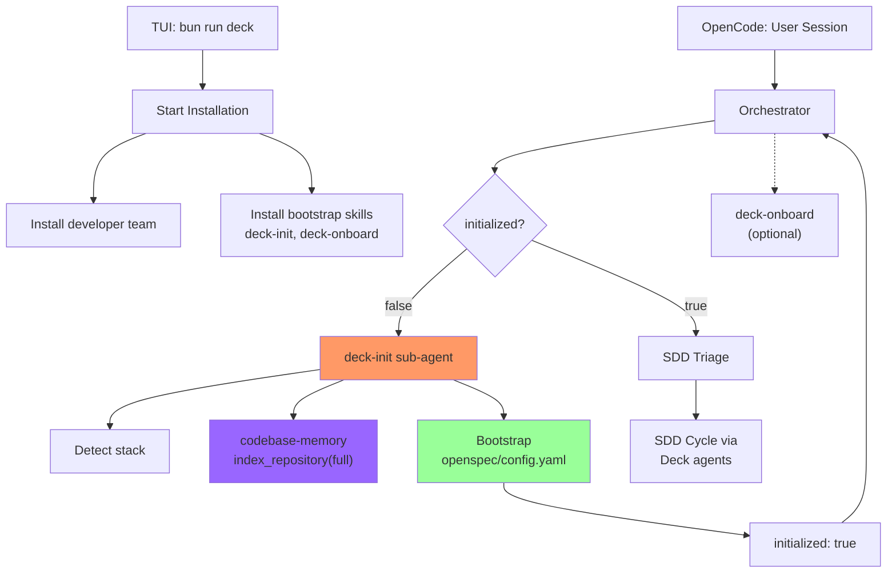

# Proposal: deck-init-onboard-system

## Intent

Deck currently installs a 12-agent developer team (orchestrator, spec, design, tasks, apply, verify, review, archive, explorer, etc.) into a runner (OpenCode). However:

1. **No init step**: The orchestrator jumps straight to SDD triage with no project context. No stack detection, no codebase index, no OpenSpec bootstrap.
2. **No onboarding**: No interactive walkthrough to teach users how SDD works with Deck's system.
3. **No init gate**: The orchestrator can't detect whether a project has been initialized.

Gentle-AI solves this with `sdd-init` (mandatory bootstrap) and `sdd-onboard` (interactive walkthrough). Deck needs equivalents that integrate with its existing agent team.

## Goal

Add `deck-init` and `deck-onboard` as skills installed into the runner via the TUI `Start Installation` flow. These are NOT clones of SDD phases — Deck already has those via the developer team. These are bootstrap skills that:

- `deck-init`: Detects project stack, runs full codebase-memory index, bootstraps `openspec/config.yaml` with `initialized: true` — acts as a mandatory gate before SDD work
- `deck-onboard`: Interactive walkthrough teaching SDD using Deck's existing agents

## Scope

### In Scope
- **`deck-init` skill**: Stack detection, monorepo detection, full codebase-memory index, `openspec/config.yaml` bootstrap with `initialized: true` marker, idempotent re-init detection
- **`deck-onboard` skill**: Interactive SDD walkthrough using Deck's existing developer team agents (proposal, spec, design, tasks, apply, verify, archive)
- **`Inject()` equivalent**: Writes `deck-init` and `deck-onboard` into runner skill directory during TUI `Start Installation` (alongside developer team install)
- **Orchestrator gate**: Checks `openspec/config.yaml` for `initialized: true` before SDD pipeline; if absent → delegates to `deck-init` sub-agent
- **Init-state reader**: Reads `openspec/config.yaml` to determine if init has been run

### Out of Scope
- Cloning SDD phases from Gentle-AI (Deck has its own: proposal, spec, design, tasks, apply, verify, archive)
- Strict TDD
- Engram/hybrid persistence (OpenSpec only)
- TUI changes (installer flow unchanged; init runs silently as sub-agent)
- Changes to existing developer team agent installation
- Binary distribution

## Affected Capabilities

### New Capabilities
- `deck-init`: Project initialization — stack detection, full index, OpenSpec bootstrap, mandatory gate
- `deck-onboard`: Interactive SDD onboarding walkthrough

### Modified Capabilities
- `orchestrator-triage`: Extended to check `initialized` flag before SDD pipeline; delegates to `deck-init` if missing

### Unchanged Capabilities
- Developer team (12 agents: orchestrator, proposal, spec, design, tasks, apply, verify, review, archive, explorer + 2 more)
- SDD pipeline phases
- OpenSpec artifact format

## Approach

### Architecture

```
TUI (bun run deck)
  └── Start Installation
        ├── Installs developer team agents/prompts (existing)
        └── Installs bootstrap skills silently
              ├── deck-init
              └── deck-onboard

OpenCode (user session)
  ├── Orchestrator receives SDD request
  │     ├── Check openspec/config.yaml.initialized == true?
  │     │     ├── YES → proceed with SDD triage
  │     │     └── NO → delegate to deck-init sub-agent
  │     └── deck-init executes:
  │           ├── Detect stack (package.json, go.mod, pyproject.toml, etc.)
  │           ├── Detect test runner, layers, coverage, quality tools
  │           ├── Detect monorepo root (pnpm-workspace, nx, turbo)
  │           ├── codebase-memory_index_repository({ mode: "full" })
  │           ├── Bootstrap openspec/config.yaml with initialized: true
  │           └── Return envelope to orchestrator
  ├── Orchestrator re-checks initialized → proceeds
  └── SDD cycle using existing Deck agents

  Optional: deck-onboard (user-triggered or orchestrator-suggested)
        └── Interactive walkthrough using existing Deck agents
```

### deck-init Skill Contract

**Trigger**: Orchestrator delegates when `initialized != true`

**Behavior**:
1. Detect project root (walk up from cwd → monorepo markers → strong markers → weak)
2. Detect stack: `package.json`, `go.mod`, `pyproject.toml`, `Cargo.toml`, etc.
3. Detect testing: runner, layers (unit/integration/E2E), coverage, linter, type checker, formatter
4. Detect monorepo: `pnpm-workspace.yaml`, `nx.json`, `turbo.json`, `lerna.json`
5. Run `codebase-memory_index_repository({ repo_path: projectRoot, mode: "full", persistence: true })`
6. Create/merge `openspec/config.yaml` with `initialized: true`, `last_index: ISO-date`, `index_mode: full`
7. Build `.atl/skill-registry.md` (scan standard skill locations)
8. If `initialized: true` already exists → skip heavy work, return `already-initialized`

**Output envelope**:
```typescript
{
  outcome: "success" | "already-initialized" | "failed",
  config_path: string,
  detected_stack: { tech: string[], testing: TestingCapabilities, monorepo: boolean },
  index_status: "indexed" | "skipped" | "failed",
  error?: string
}
```

### deck-onboard Skill Contract

**Trigger**: User-invocable or orchestrator-suggested after init

**Behavior**: Interactive walkthrough through a complete SDD cycle using Deck's existing agents:

1. Welcome + scan for small improvement opportunity
2. Explore (using existing deck-developer-explorer)
3. Proposal (using existing deck-developer-proposal)
4. Spec (using existing deck-developer-spec)
5. Design (using existing deck-developer-design)
6. Tasks (using existing deck-developer-task)
7. Apply (using existing deck-developer-apply)
8. Verify (using existing deck-developer-verify)
9. Archive (using existing deck-developer-archive)
10. Summary

Each phase narrated briefly. User reviews before proceeding past proposal.

### Inject() Equivalent

Add to `packages/adapter-opencode/src/developer-team-install.ts` and PI equivalent:

- `installBootstrapSkills()` — writes `deck-init` and `deck-onboard` to runner skill directory
- Idempotent: compare existing content before writing
- Same backup/rollback/verify pattern as developer team files

Skill files are embedded in Deck's binary (TS string constants in `packages/core/src/skills/bootstrap/`).

### Orchestrator Gate

In `orchestrator-pipeline.ts`:
- First check: `readOpenSpecInitState(projectRoot).initialized`
- If `false` → return `{ outcome: "needs-init", delegate: { skillId: "deck-init" } }`
- Orchestrator delegates to `deck-init`, waits for envelope, re-checks flag, proceeds

### Init Marker

`openspec/config.yaml`:
```yaml
initialized: true
last_index: "2026-05-25T10:30:00Z"
index_mode: full
context: |
  Tech stack: {detected}
  Testing: {detected}
  Monorepo: {yes/no}
rules:
  # ... existing rules
```

## Alternatives and Tradeoffs

| Alternative | Why Considered | Why Not Chosen |
|---|---|---|
| Init as TUI step (visible) | Transparency | Adds friction; init is an implementation detail |
| Light index (mode: fast) | Faster | SDD explore phase needs full graph |
| Engram persistence | Faster startup | User said OpenSpec only |
| Clone SDD phases from Gentle-AI | Reference implementation | Deck already has its own SDD phases via developer team |

## Risks

| Risk | Likelihood | Mitigation |
|---|---|---|
| Full index slow on large repos | Medium | Show progress; result is cached |
| Re-init overwrites existing openspec/config | Low | Merge fields, preserve rules |
| Runner skill dir not found | Low | Error with clear message |

## Rollback Plan

1. Delete `openspec/config.yaml` `initialized` field (set to `false`)
2. Delete `~/.config/opencode/skills/deck-init/` and `deck-onboard/`
3. Orchestrator re-triggers init on next SDD attempt

## Dependencies

- `codebase-memory_index_repository()` with `mode: "full"`
- Runner skill directory exists

## Open Questions

None.

## Acceptance Direction

- [ ] Orchestrator checks `initialized` flag before SDD pipeline
- [ ] `deck-init` executes full codebase-memory index
- [ ] `openspec/config.yaml` created with `initialized: true`, `last_index`, `index_mode: full`
- [ ] `deck-init` and `deck-onboard` installed in runner skill directory
- [ ] Re-init is idempotent (detects existing state)
- [ ] Orchestrator delegates to `deck-init` when `initialized != true`
- [ ] `deck-onboard` uses existing Deck agents (not clones)

## Next Steps

Ready for Spec (`deck-developer-spec`) and Design (`deck-developer-design`) in parallel.

## Mermaid Summary Source



---

**Change**: deck-init-onboard-system
**Created**: 2026-05-25
**Status**: proposal
