# Spec: deck-init-onboard-system

## Source

- Proposal: deck-init-onboard-system proposal artifact
- Capabilities affected: deck-init (new), deck-onboard (new), orchestrator-triage (modified)

## Requirements

### Capability: deck-init

REQ-init-001: deck-init MUST check `openspec/config.yaml` for `initialized: true` before performing any heavy work; if found, return `outcome: "already-initialized"` immediately.
  Priority: MUST
  Surface: Integration
  Rationale: Idempotent re-init avoids wasting time on large repos.

REQ-init-002: deck-init MUST detect the project root by walking upward from current working directory, checking monorepo markers (pnpm-workspace.yaml, nx.json, turbo.json, lerna.json), then strong markers (package.json, go.mod, pyproject.toml, Cargo.toml), then weak markers (.git).
  Priority: MUST
  Surface: Integration
  Rationale: Correct root detection is prerequisite for all subsequent steps.

REQ-init-003: deck-init MUST detect the technology stack by scanning for manifest files: `package.json` (Node/JS), `go.mod` (Go), `pyproject.toml` / `requirements.txt` (Python), `Cargo.toml` (Rust), and others as applicable.
  Priority: MUST
  Surface: Integration
  Rationale: Stack detection feeds the config and determines testing conventions.

REQ-init-004: deck-init MUST detect testing capabilities: test runner, test layers (unit, integration, E2E), coverage tool, linter, type checker, and formatter.
  Priority: SHOULD
  Surface: Integration
  Rationale: SDD verify phase needs this context; detection may be partial on some stacks.

REQ-init-005: deck-init MUST detect monorepo structure by checking for `pnpm-workspace.yaml`, `nx.json`, `turbo.json`, `lerna.json`.
  Priority: SHOULD
  Surface: Integration
  Rationale: Monorepo context affects task routing and scope.

REQ-init-006: deck-init MUST call `codebase-memory_index_repository({ repo_path: projectRoot, mode: "full", persistence: true })` after stack detection.
  Priority: MUST
  Surface: Integration
  Rationale: Full index is required for SDD explore phase to traverse the code graph.

REQ-init-007: deck-init MUST create or merge `openspec/config.yaml` with fields: `initialized: true`, `last_index: <ISO-8601>`, `index_mode: full`, and a `context` block containing detected stack summary.
  Priority: MUST
  Surface: Data
  Rationale: Config is the init gate marker and persists detection results.

REQ-init-008: deck-init MUST NOT overwrite existing `openspec/config.yaml` rules or custom fields when merging; only `initialized`, `last_index`, `index_mode`, and `context` are set/updated.
  Priority: MUST
  Surface: Data
  Rationale: Users may have custom rules that must survive re-init.

REQ-init-009: deck-init MUST build `.atl/skill-registry.md` by scanning standard skill locations and listing installed skills.
  Priority: SHOULD
  Surface: Data
  Rationale: Skill registry aids discoverability; may be optional on some setups.

REQ-init-010: deck-init MUST return an `InitEnvelope` with `outcome`, `config_path`, `detected_stack`, `index_status`, and optional `error`.
  Priority: MUST
  Surface: API
  Rationale: Orchestrator needs structured result to decide next action.

REQ-init-011: deck-init MUST set `outcome: "failed"` and include `error` message if the codebase-memory index call fails.
  Priority: MUST
  Surface: Integration
  Rationale: Caller must distinguish success from failure.

REQ-init-012: deck-init skill frontmatter MUST include `user-invocable: false`, `disable-model-invocation: true`, and `delegate_only: true`.
  Priority: MUST
  Surface: General
  Rationale: deck-init is a sub-agent, never user-facing.

### Capability: deck-onboard

REQ-onboard-001: deck-onboard MUST be user-invocable (`user-invocable: true`).
  Priority: MUST
  Surface: General
  Rationale: Onboarding is an explicit user action, not delegated.

REQ-onboard-002: deck-onboard MUST execute a 10-phase walkthrough: (1) Welcome, (2) Explore, (3) Proposal, (4) Spec, (5) Design, (6) Tasks, (7) Apply, (8) Verify, (9) Archive, (10) Summary.
  Priority: MUST
  Surface: UI
  Rationale: Full SDD cycle teaches users the Deck workflow end-to-end.

REQ-onboard-003: Phases 2–9 of deck-onboard MUST delegate to the corresponding Deck developer team agents (deck-developer-explorer, deck-developer-proposal, deck-developer-spec, deck-developer-design, deck-developer-task, deck-developer-apply, deck-developer-verify, deck-developer-archive).
  Priority: MUST
  Surface: Integration
  Rationale: Uses existing agents — not clones or reimplementations.

REQ-onboard-004: deck-onboard MUST request user review and approval before proceeding from Phase 3 (Proposal) to Phase 4 (Spec).
  Priority: MUST
  Surface: UI
  Rationale: User retains control before committing to spec/design work.

REQ-onboard-005: deck-onboard MUST narrate each phase with a brief one-paragraph summary of what the phase does and why.
  Priority: SHOULD
  Surface: UI
  Rationale: Educational value of the walkthrough depends on narration.

REQ-onboard-006: deck-onboard MUST check `openspec/config.yaml.initialized` before starting; if absent or false, MUST inform the user that `deck-init` is required first.
  Priority: MUST
  Surface: Integration
  Rationale: Onboarding depends on initialized project context.

REQ-onboard-007: deck-onboard skill MUST execute inline (not delegated) — the orchestrator or runner runs it directly.
  Priority: MUST
  Surface: General
  Rationale: Onboarding orchestrates multiple agents; it is not itself a sub-agent.

### Capability: orchestrator-triage (modified)

REQ-triage-001: orchestrator-triage MUST read `openspec/config.yaml.initialized` before proceeding with SDD pipeline.
  Priority: MUST
  Surface: Integration
  Rationale: Init gate prevents SDD work on uninitialized projects.

REQ-triage-002: If `initialized` is absent or `false`, orchestrator-triage MUST return `outcome: "needs-init"` with a delegation instruction to `deck-init`.
  Priority: MUST
  Surface: Integration
  Rationale: Orchestrator must trigger init before continuing.

REQ-triage-003: After `deck-init` delegation completes, orchestrator-triage MUST re-read `openspec/config.yaml.initialized` and only proceed with SDD triage if `true`.
  Priority: MUST
  Surface: Integration
  Rationale: Confirms init succeeded before starting SDD work.

REQ-triage-004: If `deck-init` delegation returns `outcome: "failed"`, orchestrator-triage MUST NOT proceed with SDD triage and MUST surface the error to the user.
  Priority: MUST
  Surface: Integration
  Rationale: Prevents SDD on broken state.

## Acceptance Scenarios

### Capability: deck-init

#### Scenario: Already-initialized project skips heavy work
**Given** `openspec/config.yaml` exists with `initialized: true`
**When** deck-init is invoked
**Then** deck-init returns `InitEnvelope` with `outcome: "already-initialized"`, `index_status: "skipped"`, and does NOT call `codebase-memory_index_repository`
> Covers: REQ-init-001

#### Scenario: Fresh init on new project
**Given** no `openspec/config.yaml` exists, or `initialized` is absent or `false`
**And** project root contains `package.json`
**When** deck-init is invoked
**Then** deck-init detects project root, detects stack, detects testing capabilities, runs full codebase-memory index, creates `openspec/config.yaml` with `initialized: true`, and returns `outcome: "success"` with populated `detected_stack`
> Covers: REQ-init-002, REQ-init-003, REQ-init-004, REQ-init-005, REQ-init-006, REQ-init-007, REQ-init-010

#### Scenario: Init preserves existing config rules on merge
**Given** `openspec/config.yaml` exists with `initialized: false` and custom `rules:` entries
**When** deck-init runs and completes successfully
**Then** `openspec/config.yaml` contains `initialized: true`, updated `last_index`, AND the original `rules:` entries are preserved unchanged
> Covers: REQ-init-008

#### Scenario: Index failure returns structured error
**Given** `codebase-memory_index_repository` call fails (e.g., MCP server unavailable)
**When** deck-init is invoked
**Then** deck-init returns `InitEnvelope` with `outcome: "failed"`, `index_status: "failed"`, and a non-empty `error` field
> Covers: REQ-init-011

#### Scenario: Monorepo detection
**Given** project root contains `pnpm-workspace.yaml`
**When** deck-init detects stack
**Then** `detected_stack.monorepo` is `true`
> Covers: REQ-init-005

### Capability: deck-onboard

#### Scenario: Successful full walkthrough
**Given** `openspec/config.yaml` exists with `initialized: true`
**When** user invokes deck-onboard
**Then** deck-onboard runs through all 10 phases, delegating phases 2–9 to corresponding Deck agents, pauses for user review before Phase 4, and completes with a summary
> Covers: REQ-onboard-002, REQ-onboard-003, REQ-onboard-004, REQ-onboard-005

#### Scenario: User skips after proposal review
**Given** deck-onboard is in Phase 3 (Proposal)
**When** user declines to continue after review
**Then** deck-onboard stops gracefully and reports what was completed (phases 1–3)
> Covers: REQ-onboard-004

#### Scenario: Init required before onboarding
**Given** `openspec/config.yaml` does not exist or `initialized` is not `true`
**When** user invokes deck-onboard
**Then** deck-onboard informs the user that `deck-init` must run first and does NOT start the walkthrough
> Covers: REQ-onboard-006

### Capability: orchestrator-triage (modified)

#### Scenario: Initialized project proceeds to SDD
**Given** `openspec/config.yaml` exists with `initialized: true`
**When** orchestrator-triage runs
**Then** it proceeds directly to SDD triage without delegating to deck-init
> Covers: REQ-triage-001

#### Scenario: Uninitialized project triggers init
**Given** `openspec/config.yaml` does not exist or `initialized` is absent or `false`
**When** orchestrator-triage runs
**Then** it returns `outcome: "needs-init"` with delegation to `deck-init`, waits for completion, re-checks `initialized`, and proceeds with SDD triage
> Covers: REQ-triage-002, REQ-triage-003

#### Scenario: Init fails — triage blocked
**Given** `initialized` is absent
**And** deck-init delegation returns `outcome: "failed"`
**When** orchestrator-triage re-checks after delegation
**Then** triage does NOT proceed with SDD and surfaces the error to the user
> Covers: REQ-triage-004

## Validation Rules

| Field / Input | Rule | Error Message | REQ-ID |
|---|---|---|---|
| `openspec/config.yaml.initialized` | Must be `true` (boolean) to pass gate | "Project not initialized. Run deck-init first." | REQ-triage-001 |
| `InitEnvelope.outcome` | Must be one of: "success", "already-initialized", "failed" | — | REQ-init-010 |
| `InitEnvelope.config_path` | Must be non-empty string | — | REQ-init-010 |
| `InitEnvelope.detected_stack.tech` | Must be non-empty array on success | — | REQ-init-010 |
| `InitEnvelope.error` | Required when `outcome: "failed"` | — | REQ-init-011 |
| Skill frontmatter `user-invocable` | deck-init: false; deck-onboard: true | — | REQ-init-012, REQ-onboard-001 |

## Error Contracts

| Condition | Error Code | Message | REQ-ID |
|---|---|---|---|
| codebase-memory index fails | `INDEX_FAILED` | "codebase-memory index failed: {detail}" | REQ-init-011 |
| Project root not found | `NO_ROOT` | "Could not detect project root. Ensure you are inside a project directory." | REQ-init-002 |
| Init required for onboard | `INIT_REQUIRED` | "Project must be initialized before onboarding. Run deck-init first." | REQ-onboard-006 |
| Init delegation failed | `INIT_FAILED` | "deck-init failed: {error}. Cannot proceed with SDD triage." | REQ-triage-004 |

## States and Transitions

### Project Initialization States

| State | Description | Entry Criteria |
|---|---|---|
| uninitialized | No `openspec/config.yaml` or `initialized != true` | Default state for new projects |
| initializing | deck-init is actively running | deck-init started, not yet completed |
| initialized | `openspec/config.yaml` has `initialized: true` | deck-init completed successfully |
| init-failed | deck-init failed, config not updated | codebase-memory or detection error |

### Transitions

| From | To | Trigger | Side Effects |
|---|---|---|---|
| uninitialized | initializing | orchestrator-triage detects `initialized != true` | delegation to deck-init |
| initializing | initialized | deck-init returns `outcome: "success"` | `openspec/config.yaml` written, index created |
| initializing | init-failed | deck-init returns `outcome: "failed"` | error surfaced to user |
| init-failed | initializing | user retries / re-triggers | fresh deck-init attempt |
| initialized | initializing | user re-runs deck-init (forced) | `initialized` reset, full re-index |

### Onboarding States

| State | Description | Entry Criteria |
|---|---|---|
| not-started | User has not invoked deck-onboard | Default |
| in-progress | Walkthrough is running through phases | User invoked deck-onboard |
| paused-for-review | Waiting for user approval after Phase 3 | Phase 3 (Proposal) completed |
| completed | All 10 phases done | Phase 10 (Summary) finished |
| cancelled | User declined to continue | User skipped after Phase 3 review |

| From | To | Trigger | Side Effects |
|---|---|---|---|
| not-started | in-progress | User invokes deck-onboard | Phase 1 starts |
| in-progress | paused-for-review | Phase 3 completes | User shown proposal for review |
| paused-for-review | in-progress | User approves | Phase 4 (Spec) starts |
| paused-for-review | cancelled | User declines | Partial summary shown |
| in-progress | completed | Phase 10 finishes | Full summary displayed |

## Open Questions

None — spec is self-contained.

## Compliance Matrix

| REQ-ID | Scenario(s) | Status |
|---|---|---|
| REQ-init-001 | Already-initialized project skips heavy work | Defined |
| REQ-init-002 | Fresh init on new project, Monorepo detection | Defined |
| REQ-init-003 | Fresh init on new project | Defined |
| REQ-init-004 | Fresh init on new project | Defined |
| REQ-init-005 | Monorepo detection, Fresh init on new project | Defined |
| REQ-init-006 | Fresh init on new project | Defined |
| REQ-init-007 | Fresh init on new project | Defined |
| REQ-init-008 | Init preserves existing config rules on merge | Defined |
| REQ-init-009 | Fresh init on new project (implicit) | Defined |
| REQ-init-010 | Fresh init on new project | Defined |
| REQ-init-011 | Index failure returns structured error | Defined |
| REQ-init-012 | Skill frontmatter (structural) | Defined |
| REQ-onboard-001 | Skill frontmatter (structural) | Defined |
| REQ-onboard-002 | Successful full walkthrough | Defined |
| REQ-onboard-003 | Successful full walkthrough | Defined |
| REQ-onboard-004 | Successful full walkthrough, User skips after proposal review | Defined |
| REQ-onboard-005 | Successful full walkthrough | Defined |
| REQ-onboard-006 | Init required before onboarding | Defined |
| REQ-onboard-007 | Skill execution model (structural) | Defined |
| REQ-triage-001 | Initialized project proceeds to SDD | Defined |
| REQ-triage-002 | Uninitialized project triggers init | Defined |
| REQ-triage-003 | Uninitialized project triggers init | Defined |
| REQ-triage-004 | Init fails — triage blocked | Defined |

## Mermaid Summary Source

```mermaid
flowchart TD
    subgraph deck-init
        I_CHECK{"config.yaml\ninitialized?"}
        I_CHECK -- "true" --> I_SKIP["Return already-initialized\n(skip heavy work)"]
        I_CHECK -- "false/absent" --> I_ROOT["Detect project root"]
        I_ROOT --> I_STACK["Detect stack\n(package.json, go.mod, etc.)"]
        I_STACK --> I_TEST["Detect testing capabilities"]
        I_TEST --> I_MONO["Detect monorepo"]
        I_MONO --> I_INDEX["codebase-memory\nindex_repository(full)"]
        I_INDEX -- success --> I_CONFIG["Write config.yaml\ninitialized: true"]
        I_CONFIG --> I_ENVELOPE["Return InitEnvelope\noutcome: success"]
        I_INDEX -- fail --> I_FAIL["Return InitEnvelope\noutcome: failed"]
    end

    subgraph orchestrator-triage
        T_CHECK{"initialized == true?"}
        T_CHECK -- true --> T_TRIAGE["SDD Triage"]
        T_CHECK -- false --> T_DELEGATE["Delegate to deck-init"]
        T_DELEGATE --> T_RECHECK{"Re-check\ninitialized?"}
        T_RECHECK -- true --> T_TRIAGE
        T_RECHECK -- failed --> T_ERROR["Surface error\nto user"]
    end

    subgraph deck-onboard
        OB_CHECK{"initialized == true?"}
        OB_CHECK -- false --> OB_BLOCK["Inform: init required"]
        OB_CHECK -- true --> OB_P1["Phase 1: Welcome"]
        OB_P1 --> OB_P2["Phase 2: Explore"]
        OB_P2 --> OB_P3["Phase 3: Proposal"]
        OB_P3 --> OB_REVIEW{"User\napproves?"}
        OB_REVIEW -- no --> OB_CANCEL["Cancel with summary"]
        OB_REVIEW -- yes --> OB_P4["Phase 4-9: Spec→Archive"]
        OB_P4 --> OB_P10["Phase 10: Summary"]
    end

    style I_FAIL fill:#f96
    style I_SKIP fill:#9f9
    style T_ERROR fill:#f96
    style OB_BLOCK fill:#ff9
```

