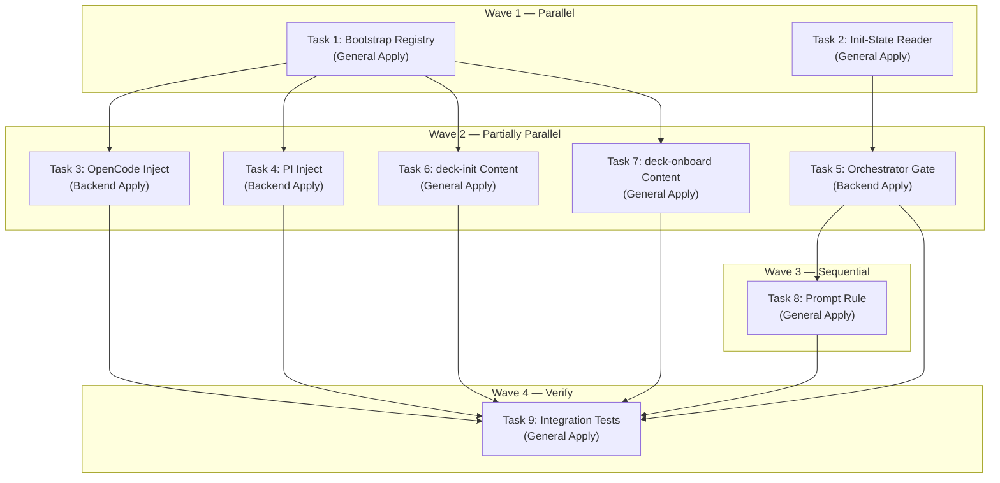

# Tasks: deck-init-onboard-system

## Source

- Spec: deck-init-onboard-system spec artifact
- Design: deck-init-onboard-system design artifact
- Capabilities affected: deck-init (new), deck-onboard (new), orchestrator-triage (modified)

## Task Groups

### Group: Shared / Contracts

#### Task 1: Bootstrap Skill Registry
**Owner**: General Apply
**Priority**: P0
**Complexity**: Low
**Parallel**: Yes
**Depends on**: none

**Description**
Create `packages/core/src/skills/bootstrap/` with barrel `index.ts` exporting `getBootstrapSkillFiles()` returning `{ skillId: string; body: string }[]`. Create placeholder content files `deck-init-content.ts` and `deck-onboard-content.ts` with empty string bodies. Re-export from `packages/core/src/index.ts` if adapters import bootstrap catalog from package root.

**Files**
- `packages/core/src/skills/bootstrap/index.ts` — create
- `packages/core/src/skills/bootstrap/deck-init-content.ts` — create
- `packages/core/src/skills/bootstrap/deck-onboard-content.ts` — create
- `packages/core/src/index.ts` — modify (re-export if needed)

**Verification**
- `getBootstrapSkillFiles()` returns array of length 2 with correct skillIds.
- TypeScript compiles without errors.
- Importable from `@deck/core/skills/bootstrap`.

---

#### Task 2: Init-State Reader
**Owner**: General Apply
**Priority**: P0
**Complexity**: Medium
**Parallel**: Yes
**Depends on**: none

**Description**
Create `packages/sdd-runtime/src/orchestrator/init-state.ts` with `InitState` interface (`initialized: boolean`, `last_index?: string`, `index_mode?: string`, `context?: string`, `config_path: string`, `error?: "missing" | "malformed"`) and `readOpenSpecInitState(projectRoot: string): InitState`. Handle: missing file → `{ initialized: false, error: "missing" }`, malformed YAML → `{ initialized: false, error: "malformed" }`, valid → populated fields. Export from `packages/sdd-runtime/src/index.ts`.

Create unit tests in `init-state.test.ts` covering: missing file, malformed YAML, valid initialized=true, valid initialized=false, valid with all optional fields, file with extra fields preserved.

**Files**
- `packages/sdd-runtime/src/orchestrator/init-state.ts` — create
- `packages/sdd-runtime/src/orchestrator/init-state.test.ts` — create
- `packages/sdd-runtime/src/index.ts` — modify (add export)

**Verification**
- All unit tests pass.
- `InitState` type exports from `@deck/sdd-runtime`.
- Missing file returns `{ initialized: false, error: "missing" }`.
- Malformed YAML returns `{ initialized: false, error: "malformed" }`.

---

### Group: Backend

#### Task 3: OpenCode Adapter Inject
**Owner**: Backend Apply
**Priority**: P1
**Complexity**: Medium
**Parallel**: Yes (independent of Task 4)
**Depends on**: Task 1

**Description**
In `packages/adapter-opencode/src/developer-team-install.ts`: import `getBootstrapSkillFiles` from core bootstrap catalog. Wire bootstrap skills into `buildOpenCodeDeveloperTeamInstallPlan` — populate `standaloneSkills` array with bootstrap skill definitions. Apply flow already handles standalone skills (lines 322-439); verify/backup/rollback must include bootstrap skill files. Bootstrap skills write to `<configDir>/skills/deck-init/SKILL.md` and `<configDir>/skills/deck-onboard/SKILL.md`. Add tests for idempotent install, content drift update, backup/rollback of bootstrap files.

**Files**
- `packages/adapter-opencode/src/developer-team-install.ts` — modify
- `packages/adapter-opencode/src/developer-team-install.test.ts` — modify

**Verification**
- Install plan includes `deck-init` and `deck-onboard` in standalone skills.
- Idempotent re-run produces `unchanged` status.
- Content drift produces `updated` status.
- Backup captures previous content; rollback restores it.
- Verify checks bootstrap skill files exist with correct content.

---

#### Task 4: PI Adapter Inject
**Owner**: Backend Apply
**Priority**: P1
**Complexity**: Medium
**Parallel**: Yes (independent of Task 3)
**Depends on**: Task 1

**Description**
In `packages/adapter-pi/src/developer-team-install.ts`: same pattern as Task 3 but for Pi adapter. Import `getBootstrapSkillFiles`, wire into install plan, verify/backup/rollback coverage. Pi resolves runner skill directory via its own path resolution. Add tests for idempotent install and recovery.

**Files**
- `packages/adapter-pi/src/developer-team-install.ts` — modify
- `packages/adapter-pi/src/developer-team-install.test.ts` — modify

**Verification**
- Install plan includes `deck-init` and `deck-onboard`.
- Idempotent re-run unchanged.
- Backup/rollback covers bootstrap skill files.

---

#### Task 5: Orchestrator Init Gate
**Owner**: Backend Apply
**Priority**: P0
**Complexity**: High
**Parallel**: No — depends on Task 2
**Depends on**: Task 2

**Description**
In `packages/sdd-runtime/src/orchestrator/orchestrator-pipeline.ts`:

1. Extend `OrchestratorPipelineInput` with `projectRoot?: string` (optional to preserve backward compat).
2. Extend `PipelineConfig` with optional `readInitState?: (projectRoot: string) => InitState` hook (defaults to `readOpenSpecInitState`).
3. Extend `PipelineOutcome` with `"needs-init"`.
4. Extend `OrchestratorPipelineResult` with `delegate?: { skillId: "deck-init"; reason: string }` and `initState?: InitState`.
5. Add init check as first step in `runOrchestratorPipeline()`: if `input.projectRoot` is provided and `readInitState(projectRoot).initialized !== true`, return early with `outcome: "needs-init"`, `delegate`, and conservative defaults for all required result fields.
6. If `projectRoot` is absent, skip init check (backward compat).

Add tests covering: uninitialized → `needs-init`, initialized → normal flow, no projectRoot → normal flow, malformed config → `needs-init`.

**Files**
- `packages/sdd-runtime/src/orchestrator/orchestrator-pipeline.ts` — modify
- `packages/sdd-runtime/src/orchestrator/orchestrator-pipeline.test.ts` — modify

**Verification**
- `PipelineOutcome` type includes `"needs-init"`.
- Uninitialized project returns `{ outcome: "needs-init", delegate: { skillId: "deck-init" } }`.
- Initialized project proceeds normally through audit/risk/quality/loop.
- Missing projectRoot skips init check (backward compat).
- All existing tests still pass.

---

### Group: Shared / Content

#### Task 6: Write deck-init Skill Content
**Owner**: General Apply
**Priority**: P1
**Complexity**: High
**Parallel**: Yes
**Depends on**: Task 1

**Description**
Fill in `packages/core/src/skills/bootstrap/deck-init-content.ts` with the full `deck-init/SKILL.md` content string. Include:

- Frontmatter: `name: deck-init`, `description`, `user-invocable: false`, `disable-model-invocation: true`, `delegate_only: true`.
- Idempotency: check `openspec/config.yaml` for `initialized: true` first; return `already-initialized` envelope.
- Project root detection: cwd walk-up with monorepo markers (pnpm-workspace.yaml, nx.json, turbo.json, lerna.json), then strong markers (package.json, go.mod, pyproject.toml, Cargo.toml), then weak markers (.git).
- Stack detection: Node/package managers, Go, Python, Rust via manifest files.
- Testing detection: runner, layers (unit/integration/E2E), coverage, linter, type checker, formatter.
- Monorepo detection.
- `codebase-memory_index_repository({ repo_path, mode: "full", persistence: true })` call.
- OpenSpec bootstrap: create/merge `openspec/config.yaml` with `initialized: true`, `last_index`, `index_mode: full`, `context`; preserve existing keys/rules.
- Skill registry build: scan standard locations, write `.atl/skill-registry.md`.
- Output envelope: `InitEnvelope` with `outcome`, `config_path`, `detected_stack`, `index_status`, `error?`.
- Error handling: index failure → `outcome: "failed"` with `error` field.

Update `packages/core/src/skills/bootstrap/index.ts` to reference the content.

**Files**
- `packages/core/src/skills/bootstrap/deck-init-content.ts` — modify
- `packages/core/src/skills/bootstrap/index.ts` — modify (if needed)

**Verification**
- Content string is non-empty.
- Frontmatter includes `user-invocable: false`, `disable-model-invocation: true`, `delegate_only: true`.
- Body covers all 8 behavior steps from REQ-init-002 through REQ-init-009.
- Output envelope section matches `InitEnvelope` type from spec.
- TypeScript compiles.

---

#### Task 7: Write deck-onboard Skill Content
**Owner**: General Apply
**Priority**: P1
**Complexity**: High
**Parallel**: Yes
**Depends on**: Task 1

**Description**
Fill in `packages/core/src/skills/bootstrap/deck-onboard-content.ts` with the full `deck-onboard/SKILL.md` content string. Include:

- Frontmatter: `name: deck-onboard`, `description`, `user-invocable: true`.
- Init guard: check `openspec/config.yaml.initialized`; if absent/false, inform user that `deck-init` must run first (REQ-onboard-006).
- 10-phase walkthrough: Welcome, Explore (deck-developer-explorer), Proposal (deck-developer-proposal), Spec (deck-developer-spec), Design (deck-developer-design), Tasks (deck-developer-task), Apply (appropriate apply agent), Verify (deck-developer-verify), Archive (deck-developer-archive), Summary.
- User review gate before Phase 4 (Spec) — pause and ask approval.
- Narration: one-paragraph summary per phase explaining what it does and why.
- Inline execution: runs directly in orchestrator session, not delegated.
- Uses existing Deck agents by name (deck-developer-proposal, etc.), NOT clones.

Update `packages/core/src/skills/bootstrap/index.ts` to reference the content.

**Files**
- `packages/core/src/skills/bootstrap/deck-onboard-content.ts` — modify
- `packages/core/src/skills/bootstrap/index.ts` — modify (if needed)

**Verification**
- Content string is non-empty.
- Frontmatter includes `user-invocable: true`.
- Body references all 8 Deck developer team agents by ID.
- Phase 3→4 review gate is present.
- Init guard checks `initialized` flag.
- TypeScript compiles.

---

### Group: Backend / Prompt

#### Task 8: Orchestrator Prompt Rule
**Owner**: General Apply
**Priority**: P1
**Complexity**: Low
**Parallel**: No — depends on Task 5
**Depends on**: Task 5

**Description**
In `packages/core/src/teams/developer/orchestrator-content.ts`: add delegation rule in `ORCHESTRATOR_SYSTEM_PROMPT` and `ORCHESTRATOR_PROMPT_GUIDA` (and agent/skill bodies if applicable):

1. When pipeline returns `outcome: "needs-init"`, delegate to `deck-init` sub-agent.
2. After `deck-init` succeeds, re-read `openspec/config.yaml.initialized` and proceed only if `true`.
3. If `deck-init` returns `outcome: "failed"`, surface error to user; do NOT proceed with SDD.
4. After successful init, suggest `deck-onboard` as optional next step.

Add to SDD Triage Gate section: init check is a hard pre-SDD gate that runs before triage classification.

**Files**
- `packages/core/src/teams/developer/orchestrator-content.ts` — modify

**Verification**
- Prompt text includes `needs-init` delegation rule.
- Prompt text mentions `deck-init` by name.
- Prompt text mentions re-check after init.
- Prompt text mentions `deck-onboard` suggestion.
- Both pragmatica and guia personalities updated.

---

### Group: Verify

#### Task 9: Integration Tests
**Owner**: General Apply
**Priority**: P2
**Complexity**: Medium
**Parallel**: No — depends on Tasks 1-8
**Depends on**: Task 3, Task 4, Task 5, Task 6, Task 7, Task 8

**Description**
Write integration tests covering cross-cutting scenarios:

1. **Bootstrap skill install idempotency**: install twice → second run all unchanged.
2. **Init-state reader edge cases**: already-initialized, fresh, malformed, missing (if not fully covered in Task 2 tests).
3. **Orchestrator gate logic**: mock `readInitState` to return uninitialized → verify `needs-init` result; mock initialized → verify normal flow; mock failed → verify blocked.
4. **Prompt content snapshots**: verify `deck-init` and `deck-onboard` skill content includes required frontmatter fields and key sections.
5. **End-to-end adapter flow**: build plan with bootstrap skills → apply → verify all files exist.

**Files**
- `packages/adapter-opencode/src/developer-team-install.test.ts` — modify (add bootstrap scenarios)
- `packages/sdd-runtime/src/orchestrator/orchestrator-pipeline.test.ts` — modify (add gate scenarios)
- `packages/core/src/skills/bootstrap/__tests__/bootstrap-content.test.ts` — create (content snapshots)

**Verification**
- All new tests pass.
- Existing tests unchanged.
- `npm test` / `bun test` passes in affected packages.

---

## Dependency Graph

```
Task 1 (Shared: Bootstrap Registry) ──┬── Task 3 (Backend: OpenCode Inject)
                                       ├── Task 4 (Backend: PI Inject)
                                       ├── Task 6 (Shared: deck-init Content)
                                       └── Task 7 (Shared: deck-onboard Content)

Task 2 (Shared: Init-State Reader) ──── Task 5 (Backend: Orchestrator Gate)
                                                     │
                                                     Task 8 (Shared: Prompt Rule)
                                                               │
                                        Task 9 (Verify: Integration Tests)
```

## Parallelization Plan

| Wave | Tasks | Can Run in Parallel |
|---|---|---|
| Wave 1 | 1, 2 | Yes — no dependencies between them |
| Wave 2 | 3, 4, 5, 6, 7 | Partial — 3/4 parallel, 6/7 parallel, 5 sequential after 2 |
| Wave 3 | 8 | No — depends on 5 |
| Wave 4 | 9 | No — depends on all |

## Responsibility Contracts

| Contract / Boundary | Owner | Consumers | Notes |
|---|---|---|---|
| `getBootstrapSkillFiles()` | General Apply (Task 1) | Backend Apply (Tasks 3, 4), General Apply (Tasks 6, 7) | Returns skill definitions; content filled in Tasks 6/7 |
| `InitState` type + `readOpenSpecInitState()` | General Apply (Task 2) | Backend Apply (Task 5), General Apply (Task 8) | Non-mutating reader; pipeline gate consumes it |
| `PipelineOutcome` extension | Backend Apply (Task 5) | General Apply (Task 8) | Adds `"needs-init"`; all exhaustive consumers must update |
| Orchestrator prompt content | General Apply (Task 8) | Runtime | Adds delegation rules; must reference deck-init by name |

## Complexity Summary

| Complexity | Count | Task Numbers |
|---|---|---|
| Low | 3 | 1, 2, 8 |
| Medium | 4 | 2, 3, 4, 9 |
| High | 3 | 5, 6, 7 |

Note: Task 2 rated Medium due to test matrix (6+ test cases); Task 8 rated Low because it's a prompt text addition only.

## Flagged for Splitting

- **Task 5**: High complexity — touches pipeline types, config, result, and adds a new early-return path. If the Apply agent finds it exceeds one session, split into: (5a) type extensions + config, (5b) init gate logic + tests.
- **Task 6**: High complexity — skill content is a full SKILL.md with 8+ behavior sections. Content is a string constant, not runtime logic, so actual code complexity is moderate; the "high" rating reflects content volume and spec coverage.
- **Task 7**: Same rationale as Task 6.

## Review Workload Forecast

| Signal | Value |
|---|---|
| Estimated changed lines | 400-800 |
| 400-line budget risk | Medium |
| Scope reduction recommended | No |
| Sequential work slices recommended | Yes — waves 1-4 are already sliced |
| Decision needed before Apply | No |

**Rationale**: 9 tasks across 4 waves. New files (~4) are small modules. Modified files (~6) are targeted additions, not rewrites. Skill content files (Tasks 6/7) are large string constants but low code-review surface. Pipeline changes (Task 5) need careful review. Medium risk due to cross-package impact (core, sdd-runtime, adapter-opencode, adapter-pi).

## Open Questions / Blockers

None — tasks are ready for Apply.

## Mermaid Summary Source


