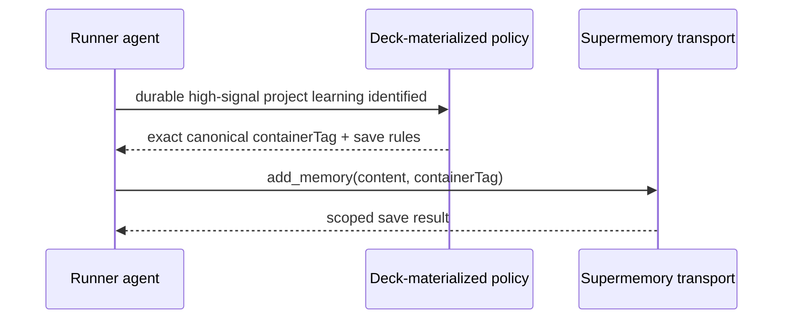
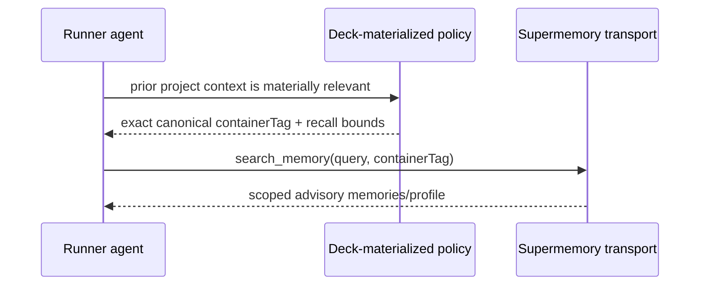

# Design: Canonical Supermemory Conversation Memory

## Decisions

### D1. Supermemory owns learning; Deck owns boundaries

Deck does not capture or proxy conversations. Deck owns project identity, instruction materialization, transport validation, runner parity, observability, and migration safety. Agents preserve high-signal information and recall relevant context through runner-exposed MCP tools, while Supermemory owns extraction, graph updates, profiles, ranking, temporal updates, and deduplication.

### D2. Selecting the provider is the capture decision

There is no secondary memory toggle or per-call project-space choice. `activeProvider: "supermemory"` enables agent-mediated automatic save and materially relevant recall. Disabling adaptive memory requires selecting `none`, not navigating another mode matrix.

### D3. Canonical scope is provider-neutral and versioned

The resolver consumes a verified project root and canonicalizes the repository owner/path across HTTPS, SSH, SCP syntax, `.git` suffixes, and SSH aliases. It emits a versioned safe tag. Ambient CWD and directory basename are forbidden fallbacks.

The initial format is:

```text
sm_project_v1_<normalized-owner>_<normalized-repository>
```

If no repository identity can be established safely, adaptive memory is unavailable rather than unscoped.

### D4. Transport is capability-proven before implementation

The first Apply task verifies whether the current official Supermemory MCP/API supports all of:

- stable `customId` updates,
- dynamic dreaming,
- immutable project scope,
- runner-native OAuth or safe token delegation,
- profile and hybrid retrieval,
- document enumeration needed for migration.

Deck will prefer the official transport that satisfies these requirements. A local Deck MCP gateway is used only if it can preserve native authentication without exposing credentials and materially enforce the contract. The SDD does not fabricate an OAuth delegation mechanism.

### D5. Compatibility is additive, then deprecated

Existing config that contains `maxMemoriesPerSession` remains parseable during migration, but the value no longer drives behavior. Old direct provider entries are diagnosed, not silently deleted. The replacement must be functional before old Deck-managed paths are removed.

### D6. Explicit tool scope is required

Authenticated runtime testing proved that `x-sm-project` does not populate the optional `containerTag` argument used by the active runner-exposed Supermemory tools. An omitted argument routes to active/default space, while an explicit canonical tag routes correctly. Deck therefore keeps the header for transport compatibility and diagnostics but materializes the exact canonical tag into every project-scoped save, recall, list, document, and graph instruction.

Active-space mutation is forbidden as an automatic scoping mechanism because it is shared mutable account/session state. Missing or mismatched project scope disables the memory operation instead of falling back to `sm_project_default`.

## Components

1. **Canonical scope resolver** (`packages/core/src/memory/`): pure parsing, normalization, branding, diagnostics.
2. **Project-bound instruction renderer** (`packages/core/src/teams/developer/instruction-bundles/`): exact `containerTag`, tool policy, automatic save/recall guidance, and fail-closed fallback.
3. **Supermemory adapter** (`packages/adapter-supermemory/src/`): current tool binding metadata and shared scoped instruction fragments; no direct REST/MCP execution.
4. **Runner serializers** (`packages/adapter-opencode`, `adapter-pi`, `adapter-codex`): equivalent scope-bearing session, agent, delegation, and skill materialization.
5. **Install/Doctor presentation** (`apps/cli/src/tui`, `apps/cli/src/doctor-command`): truthful status without a new choice.
6. **Migration command** (`apps/cli/src/` plus Supermemory adapter): inventory and dry-run first; copy requires explicit future action and evidence.

## Sequence: agent-mediated automatic save



## Sequence: retrieval



## Security model

- Provider responses and stored memories are untrusted advisory input.
- Credentials never enter generated config content unless the runner's native secret-reference mechanism requires a variable name; values remain external.
- Instructions prohibit secret-bearing and raw-output saves; no automatic whole-conversation transport exists in this MCP-only phase.
- Logging uses reason codes, counts, durations, runner ID, and a one-way scope fingerprint only.
- Missing scope, invalid transport shape, or authentication mismatch disables memory effects without blocking coding work.

## Migration design

Migration is a separate command path with explicit source and destination scope. The default action is dry-run. Classification is deterministic where possible and conservative otherwise. Source data remains unchanged. This change intentionally provides no delete effect.

## Performance design

- Deck adds no proxy or extra network hop.
- Agent saves are high-signal rather than per-turn transcript capture.
- Profile/recall loads are bounded and materially triggered rather than performed on every turn.
- Query retrieval is demand-driven and context-bounded.
- Rerank and query rewriting are evidence-gated because each adds latency.
