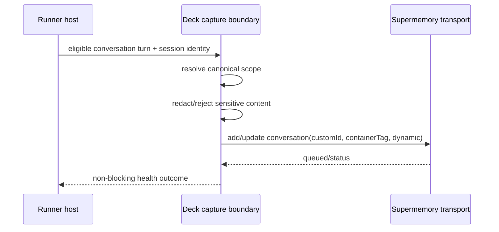
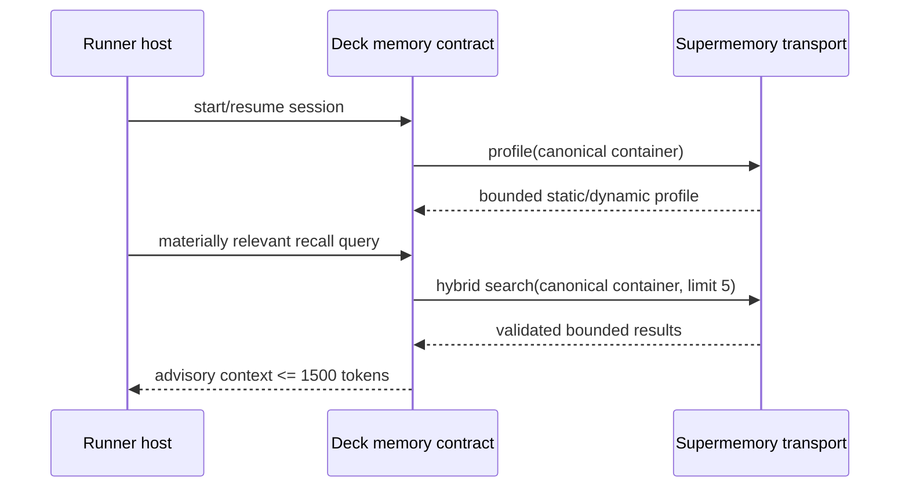

# Design: Canonical Supermemory Conversation Memory

## Decisions

### D1. Supermemory owns learning; Deck owns boundaries

Deck captures coherent conversation documents and delegates extraction, graph updates, profile synthesis, ranking, and deduplication to Supermemory. Deck owns project identity, privacy filtering, transport validation, runner parity, observability, and migration safety.

### D2. Selecting the provider is the capture decision

There is no secondary capture toggle. `activeProvider: "supermemory"` means conversation capture is enabled. Disabling adaptive memory requires selecting `none`, not navigating another mode matrix.

### D3. Canonical scope is provider-neutral and versioned

The resolver consumes a verified project root and canonicalizes the repository owner/path across HTTPS, SSH, SCP syntax, `.git` suffixes, and SSH aliases. It emits a versioned safe tag. Ambient CWD and directory basename are forbidden fallbacks.

The initial format is:

```text
sm_project_v1_<normalized-owner>_<normalized-repository>
```

If no repository identity can be established safely, adaptive memory is unavailable rather than unscoped.

### D4. Transport is capability-proven before implementation

The first Apply task verifies whether the current official Supermemory MCP/API supports all of:

- stable `customId` updates,
- dynamic dreaming,
- immutable project scope,
- runner-native OAuth or safe token delegation,
- profile and hybrid retrieval,
- document enumeration needed for migration.

Deck will prefer the official transport that satisfies these requirements. A local Deck MCP gateway is used only if it can preserve native authentication without exposing credentials and materially enforce the contract. The SDD does not fabricate an OAuth delegation mechanism.

### D5. Compatibility is additive, then deprecated

Existing config that contains `maxMemoriesPerSession` remains parseable during migration, but the value no longer drives behavior. Old direct provider entries are diagnosed, not silently deleted. The replacement must be functional before old Deck-managed paths are removed.

## Components

1. **Canonical scope resolver** (`packages/core/src/memory/`): pure parsing, normalization, branding, diagnostics.
2. **Supermemory conversation contract** (`packages/adapter-supermemory/src/`): typed ingest/profile/search inputs and validated provider outputs.
3. **Capture boundary** (CLI trusted runner integration): stable session ID, eligible-turn projection, redaction, asynchronous enqueue.
4. **Runner serializers** (`packages/adapter-opencode`, `adapter-pi`, `adapter-codex`): equivalent semantic configuration.
5. **Install/Doctor presentation** (`apps/cli/src/tui`, `apps/cli/src/doctor-command`): truthful status without a new choice.
6. **Migration command** (`apps/cli/src/` plus Supermemory adapter): inventory and dry-run first; copy requires explicit future action and evidence.

## Sequence: session capture



## Sequence: retrieval



## Security model

- Provider responses and stored memories are untrusted advisory input.
- Credentials never enter generated config content unless the runner's native secret-reference mechanism requires a variable name; values remain external.
- Redaction occurs before network transport.
- Logging uses reason codes, counts, durations, runner ID, and a one-way scope fingerprint only.
- Missing scope, invalid transport shape, or authentication mismatch disables memory effects without blocking coding work.

## Migration design

Migration is a separate command path with explicit source and destination scope. The default action is dry-run. Classification is deterministic where possible and conservative otherwise. Source data remains unchanged. This change intentionally provides no delete effect.

## Performance design

- Dynamic ingestion is asynchronous and does not wait for graph dreaming.
- A stable `customId` avoids isolated documents and enables provider-native updates/diff processing.
- Profile loads once per session/resume rather than multiple search calls per turn.
- Query retrieval is demand-driven and context-bounded.
- Rerank and query rewriting are evidence-gated because each adds latency.
