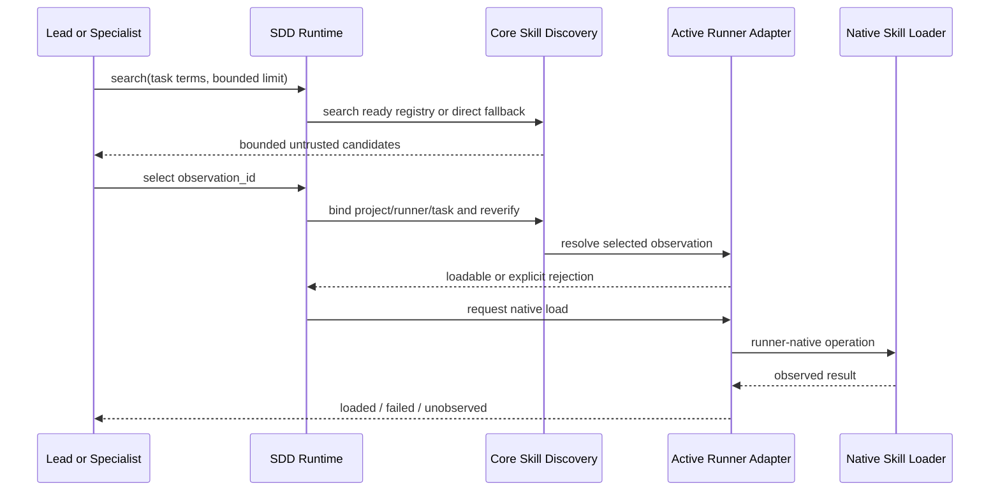

# Design: Complete Skill Discovery Runtime

## Decisions

### D1. Repair parsing without raising the limit

The configured depth remains three. A dedicated walker measures collection nesting while separately inspecting all nodes for aliases, tags, duplicate keys, merge keys, and malformed structure. Descriptor and persisted-registry walkers remain separate unless tests prove a shared helper preserves both formats.

### D2. Keep selection with the consuming agent

Runtime code supplies bounded candidates, identity binding, verification, and honest load outcomes. It does not rank automatically, inject all records, or select on behalf of child agents.

### D3. Add contracts; do not change registry V1

Core owns neutral query/result and selection/preparation contracts. SDD Runtime owns task/session association. Adapters own runner inventory, opaque identity translation, and native load observation. The CLI composition root wires only the active runner.

### D4. Treat native loading as a distinct boundary

Filesystem existence or successful locator resolution is not proof of native loading. The adapter must correlate the selected observation to the native operation and return `loaded` only after observing success.

## Proposed flow

## Contracts

- `SkillCandidateQueryV1`: bounded terms, target paths/extensions, technologies, techniques, and result limit.
- `SkillCandidateSearchResultV1`: source mode, completeness, bounded records, truncation, and safe diagnostics.
- `SkillSelectionReferenceV1`: observation identity bound internally to project, runner, task/session, and candidate identity; never an authority token.
- `SkillLoadPreparationResultV1`: discriminated preparation outcomes.
- `SkillLoadOutcomeV1`: observed native result.

All additions are versioned and additive. Existing `discover` JSON retains its meaning.

## OpenCode production host port

The existing `developer-team-execution` plugin remains the sole native execution owner. Core defines a versioned `TaskSkillDiscoveryHostV1` contract; SDD Runtime owns one bounded discovery context per trusted native session/task generation; and the OpenCode binding translates native session, message, call, inventory, permission, and completion evidence.

The plugin exposes one bounded `deck_skill_discovery` tool with `search`, `prepare`, and `status` operations. Its arguments never supply project root, runner identity, session identity, native paths, or authority. After an exact observation is prepared, the consuming agent invokes OpenCode's ordinary `skill({ name })` tool.

`tool.execute.before` binds the prepared observation to the trusted session and call ID, revalidates identity, and waits only until the native loader rendezvous is armed. It MUST NOT await final completion because the native tool cannot execute until the hook returns. `tool.execute.after` verifies the native `metadata.name` and canonical `metadata.dir`; a correlated native error records failure, while missing or mismatched completion evidence remains `unobserved`.

Each plugin instance owns its contexts. Parent and child sessions have independent task generations and load evidence. Unprepared native role-skill calls preserve existing OpenCode behavior and receive no verified-discovery credit. Native inventory access is isolated behind an OpenCode compatibility shim, bounded, content-discarding, and fail-open; an uncertain or overwritten duplicate name is not loadable.

The CLI-side OpenCode adapter keeps its default `unsupported`/`unobserved` loader because it has no native tool execution context. Only the installed plugin binding may provide observed native loading.

## Security boundaries

- Descriptor metadata remains untrusted data.
- Search returns bounded metadata, never skill bodies.
- Selection is reverified at the native invocation boundary to reduce TOCTOU risk.
- Native permissions are preserved; raw descriptor injection is prohibited as a fallback.
- Another runner's exclusive roots are never enumerated.
- Diagnostics redact absolute user paths and descriptor content.

## Rollout

1. Ship parser compatibility and registry recovery tests.
2. Ship the OpenCode production vertical slice behind capability detection.
3. Add Pi only after parity tests.
4. Keep Codex explicitly unsupported until a production provider and native load correlation exist.

Canonical plugin source changes require regeneration through `scripts/generate-runner-execution-assets.ts` under the repository-pinned Bun version. Source-level success is not shipped acceptance until generated bytes, installer parity, and built OpenCode Lead/child scenarios pass.
