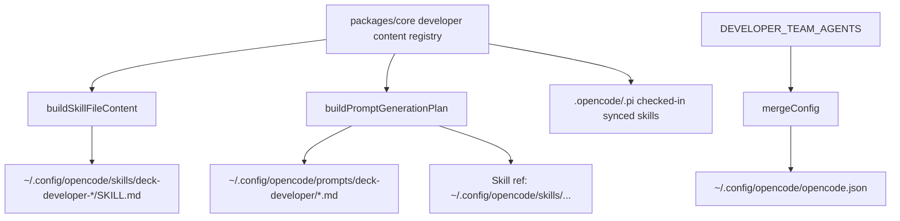

# Design: Deck as Installer Runner-Agnostic

## Source

- Proposal: `deck-as-installer-runner-agnostic` proposal artifact
- Capabilities affected: `runner-agnostic-skills`, 12 `deck-developer-*` skills/prompts
- Spec status: available (`spec.md`)

## Current Architecture Context

- Canonical agent/skill text is generated from `packages/core/src/teams/developer/content-registry.ts` and related content/bundle modules.
- OpenCode installer path:
  - `packages/adapter-opencode/src/developer-team-install.ts`
    - `buildOpenCodeDeveloperTeamInstallPlan(...)` builds agent entries, skill files, prompt generation plan.
    - `buildSkillFileContent(...)` wraps `content.skillBody` in skill frontmatter and adaptive-memory injection.
    - `applyOpenCodeDeveloperTeamInstall(...)` merges `opencode.json`, writes skills, writes prompts, writes commands.
  - `packages/adapter-opencode/src/prompt-generation.ts`
    - `buildPromptGenerationPlan(...)` currently builds prompt content using `skillPath = join(projectRoot, ".opencode", "skills", ...)`.
    - `buildPromptContent(...)` renders `Read your skill file at ${skillPath}`.
    - `buildPromptReference(...)` registers prompt files under `{configDir}/prompts/deck-developer`.
  - `packages/adapter-opencode/src/config-merge.ts::mergeConfig(...)` merge-replaces only Deck agent keys and preserves unrelated config.
- Checked-in runner copies exist under `.opencode/skills/deck-developer-*/SKILL.md` and `.pi/skills/deck-developer-*/SKILL.md`.
- Current `.opencode` skill files contain `.deck/config.json` references; generated prompts can contain repo-local absolute skill paths.

## Proposed Architecture

- Keep `packages/core/src/teams/developer/*` as canonical text source.
- Clean canonical instruction fragments, then regenerate/sync checked-in `.opencode/skills` and `.pi/skills` artifacts.
- OpenCode install output must target runner-owned locations:
  - skills: `~/.config/opencode/skills/{deck-developer-*}/SKILL.md`
  - prompts: `~/.config/opencode/prompts/deck-developer/{deck-developer-*}.md`
  - agents: merged into `~/.config/opencode/opencode.json`
- Prompt skill-reference text must use runner-stable path language: `~/.config/opencode/skills/{skillId}/SKILL.md`, not repo-local `projectRoot`.
- Installer writes are simple idempotent file copies/writes: create dirs, compare existing content, overwrite only changed Deck-managed files.
- `opencode.json` registration remains merge-by-key, not overwrite.

### Component / Module Boundaries

| Component | Responsibility | Change Type |
|---|---|---|
| `packages/core/src/teams/developer/instruction-bundles/index.ts` | Package-instruction header text | modified |
| `packages/core/src/teams/developer/instruction-bundles/adaptive-memory.ts` | Adaptive-memory runner language | modified |
| `packages/core/src/teams/developer/orchestrator-content.ts` | Orchestrator embedded adaptive-memory language | modified |
| `packages/adapter-opencode/src/prompt-generation.ts` | Generate installed prompt files and skill references | modified |
| `packages/adapter-opencode/src/developer-team-install.ts` | Plan/apply OpenCode skills, prompts, agent registration | modified |
| `packages/adapter-opencode/src/config-merge.ts` | Preserve merge semantics for agent registry | unchanged |
| `.opencode/skills/deck-developer-*/SKILL.md` | Checked-in OpenCode skill artifacts | modified |
| `.pi/skills/deck-developer-*/SKILL.md` | Checked-in Pi skill artifacts; byte-sync with OpenCode | modified |

### Data Flow

1. Core registry composes each `deck-developer-*` agent/skill body.
2. OpenCode install planning receives `configDir` and resolves runner locations.
3. Skill content is generated from canonical core body + frontmatter + memory/capability fragments.
4. Prompt content is generated from agent body + stable skill reference under `~/.config/opencode/skills/...`.
5. Apply phase:
   - merges Deck agent entries into `opencode.json` by `deck-developer-*` key;
   - writes skill files under runner skills dir;
   - writes prompt files under runner prompts dir;
   - leaves unrelated runner config intact.
6. Checked-in `.opencode` and `.pi` skill artifacts are regenerated/synced from the same cleaned source.

### API / Contract Implications

| Endpoint / Interface | Change | Backward Compatible |
|---|---|---|
| `buildPromptGenerationPlan(options)` | Use runner skill-reference path instead of repo-local `projectRoot/.opencode/skills/...`; may keep `projectRoot` only for compatibility if still needed elsewhere. | yes |
| `OpenCodeDeveloperTeamInstallPlan.skills[]` | Skill destination should be runner config skills dir for install output, not repo `.opencode` when installing to runner. | partial |
| `mergeConfig(existing, agentEntries, pluginsToAdd)` | No change; continue merge-by-key. | yes |
| Skill/prompt text contract | No `.deck/config.json` or `/home/kevinlb/deck/`; names remain `deck-developer-*`. | yes |

### State / Persistence Implications

- No data schema changes.
- Persistent runner files affected:
  - `~/.config/opencode/skills/deck-developer-*/SKILL.md`
  - `~/.config/opencode/prompts/deck-developer/*.md`
  - `~/.config/opencode/opencode.json`
- Existing Deck-managed files may be overwritten when content changes; unrelated files/config preserved.

### Migration / Backward Compatibility

- Existing runner installs are updated by re-running Deck install.
- Agent names, skill names, prompt names, phase routing, artifact contracts unchanged.
- `opencode.json` merge is backward-compatible: replace only Deck agent entries, preserve non-Deck config.
- No migration script required beyond reinstall/regenerate.

## File Impact Estimate

| File / Path | Action | Rationale |
|---|---|---|
| `packages/core/src/teams/developer/instruction-bundles/index.ts` | modify | Replace `.deck/config.json` package-instruction wording. |
| `packages/core/src/teams/developer/instruction-bundles/adaptive-memory.ts` | modify | Replace adaptive-memory config wording. |
| `packages/core/src/teams/developer/orchestrator-content.ts` | modify | Remove duplicated `.deck/config.json` adaptive-memory wording. |
| `packages/adapter-opencode/src/prompt-generation.ts` | modify | Emit runner-stable skill references in prompts. |
| `packages/adapter-opencode/src/developer-team-install.ts` | modify | Ensure install plan writes skills to runner config skills dir. |
| `packages/core/src/teams/developer/instruction-bundles/*.test.ts` | modify | Update expectations for generic runner language. |
| `packages/adapter-opencode/src/prompt-generation.test.ts` | modify | Assert no repo-local absolute path in rendered prompt. |
| `packages/adapter-opencode/src/developer-team-install.test.ts` | modify | Assert runner skills/prompts paths and config merge behavior. |
| `packages/adapter-pi/src/developer-team-install.test.ts` | modify | Update `.deck/config.json` expectations if generated content tested. |
| `.opencode/skills/deck-developer-*/SKILL.md` | modify | Materialized cleaned OpenCode skill copies. |
| `.pi/skills/deck-developer-*/SKILL.md` | modify | Byte-identical cleaned Pi skill copies. |
| `~/.config/opencode/prompts/deck-developer/*.md` | modify at install/runtime | Installed prompt copies; not committed unless fixture exists. |

## Testing Strategy

- Unit:
  - core instruction bundle tests assert new runner-agnostic wording.
  - prompt-generation tests assert `~/.config/opencode/skills/{skill}/SKILL.md` and no `projectRoot` skill path.
  - developer-team-install tests assert skills target runner config dir and `opencode.json` merge preserves unrelated entries.
- Text verification:
  - scan 12 `.opencode` skills + 12 `.pi` skills for zero `.deck/config.json` and `/home/kevinlb/deck/`.
  - compare `.opencode/skills/deck-developer-*` and `.pi/skills/deck-developer-*` byte equality.
- Integration-lite:
  - build install plan with temp `configDir` and arbitrary `projectRoot`; rendered prompts/skills must not depend on `projectRoot`.

## Observability / Error Handling

- Preserve existing install error behavior: config merge failures throw with contextual message.
- File writes remain idempotent (`created`/`updated`/`unchanged` result statuses).
- Add verification failure messages listing offending file/path and forbidden string.

## Security / Performance / Accessibility Considerations

- Security: removing repo-local paths avoids leaking maintainer filesystem paths into runner prompts.
- Performance: negligible; same number of file writes with content comparison.
- Accessibility: not applicable.

## Tradeoffs

| Decision | Chosen | Rejected Alternative | Rationale |
|---|---|---|---|
| Skill storage in repo | Canonical TS content registry + materialized `.opencode`/`.pi` skill artifacts | Go `//go:embed` as canonical source now | Proposal excludes installer implementation; current architecture already generates from TS registry. |
| Copy mechanism | Simple idempotent file write/copy | Template engine or dynamic runtime resolution | Static generated content is sufficient and easier to verify. |
| Agent registry | Merge into `opencode.json` by Deck keys | Overwrite whole `opencode.json` | Preserves user config and existing non-Deck agents. |
| Prompt generation | Generate prompts from core registry with runner-stable skill reference | Maintain checked-in static prompt text only | Single source prevents drift and supports personality/capability injection. |
| Skill path text | `~/.config/opencode/skills/{skill}/SKILL.md` | `projectRoot/.opencode/skills/...` | Runner must not require Deck repo after install. |

## Risks

| Risk | Likelihood | Impact | Mitigation |
|---|---|---|---|
| Scope tension: proposal says textual-only, desired design mentions installer target paths | Medium | Medium | Keep implementation minimal; only adjust existing installer generation where needed and flag full Go installer as out of scope. |
| Missed duplicate `.deck/config.json` wording in core/generated artifacts | Medium | Medium | Scan source + generated artifacts in tests/verification. |
| `.opencode` and `.pi` checked-in skills drift | Medium | Medium | Regenerate/sync from canonical source; add byte-identity verification. |
| Prompt path syntax with `~` may not be expanded by agents if treated as literal file path | Low | Medium | Phrase as skill reference instruction for agent; if runner requires absolute path internally, keep that only in `opencode.json` file references, not prompt body. |
| Existing tests intentionally assert `.deck/config.json` | High | Low | Update expectations to runner-agnostic language. |

## Open Decisions

- Full Go binary installer/`//go:embed` packaging remains out of scope for this change; future installer SDD should decide binary asset layout.
- Whether OpenCode prompt body should say `~/.config/opencode/...` exactly or a runner-native skill lookup phrase if OpenCode supports one. User-provided desired design prefers `~/.config/opencode/...`.

## Dependencies

- None external.
- Existing OpenCode adapter merge/write utilities remain available.

## Next Steps

Ready for Task (`deck-developer-task`) to break this design into implementation tasks, combined with Spec.

## Mermaid Summary Source

