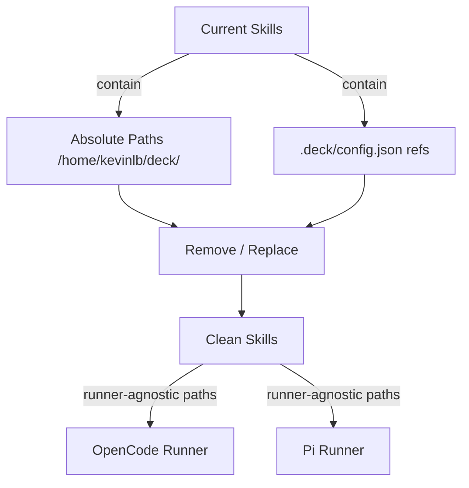

# Proposal: Deck as Installer Runner-Agnostic

## Intent

Deck is an installer binary that configures AI runners (OpenCode, Pi, etc.) and must not exist on the runner machine post-installation. Currently, the 12 `deck-developer-*` skills contain absolute paths to `/home/kevinlb/deck/` and references to `.deck/config.json`, which will be invalid on any runner where Deck is installed. This change makes skills runner-agnostic so they function correctly after installation.

## Goal

Make all 12 deck-developer skills runnable on any AI runner by removing absolute paths and `.deck/config.json` references while preserving `deck-developer-*` naming.

## Scope

### In Scope
- Clean 12 skills in `.opencode/skills/deck-developer-*/SKILL.md`:
  - `deck-developer-orchestrator`
  - `deck-developer-explorer`
  - `deck-developer-proposal`
  - `deck-developer-spec`
  - `deck-developer-design`
  - `deck-developer-task`
  - `deck-developer-apply-backend`
  - `deck-developer-apply-frontend`
  - `deck-developer-apply-general`
  - `deck-developer-verify`
  - `deck-developer-review`
  - `deck-developer-archive`
- Remove `/home/kevinlb/deck/` absolute paths from skill content and runner prompts
- Remove `.deck/config.json` references (25 occurrences in skills, 24 in prompts)
- Replace `.deck/config.json` package instruction references with generic "runner's native package instruction system" language
- Maintain `deck-developer-*` skill names, agent names, and prompt names
- Update corresponding runner prompts in `~/.config/opencode/prompts/deck-developer/*.md`

### Out of Scope
- Installer implementation (Go binary, embedding, distribution)
- Tests for the installer
- Pi runner installation (OpenCode only for now)
- Changes to skill functionality or SDD workflow logic
- Project AI notes (`.deck/ai-notes/`) — deferred feature

## Affected Capabilities

### New Capabilities
- `runner-agnostic-skills`: Skills that work on any runner without deck repo presence

### Modified Capabilities
- `deck-developer-orchestrator`: Remove `.deck/config.json` adaptive memory and package instruction references
- `deck-developer-explorer`: Remove `.deck/config.json` references
- `deck-developer-proposal`: Remove `.deck/config.json` references and absolute skill paths
- `deck-developer-spec`: Remove `.deck/config.json` references
- `deck-developer-design`: Remove `.deck/config.json` references
- `deck-developer-task`: Remove `.deck/config.json` references
- `deck-developer-apply-backend`: Remove `.deck/config.json` references
- `deck-developer-apply-frontend`: Remove `.deck/config.json` references
- `deck-developer-apply-general`: Remove `.deck/config.json` references
- `deck-developer-verify`: Remove `.deck/config.json` references
- `deck-developer-review`: Remove `.deck/config.json` references
- `deck-developer-archive`: Remove `.deck/config.json` references

### Unchanged Capabilities
- `sdd-workflow`: Phase routing, dependency graph, and orchestration logic remains identical
- `openspec-artifacts`: Artifact format, registry structure, and persistence policy unchanged
- `skill-naming`: All `deck-developer-*` names preserved

## Approach

1. **Identify all `.deck/config.json` references** across 12 skills (`.opencode/skills/`) and 12 runner prompts (`~/.config/opencode/prompts/`)
2. **Replace with runner-agnostic language**:
   - "`.deck/config.json` package instruction toggles" → "runner's native package instruction system"
   - "Adaptive memory is configured via `.deck/config.json`" → "Adaptive memory is provided by the runner's configured memory system"
3. **Replace absolute paths** in runner prompts:
   - `/home/kevinlb/deck/.opencode/skills/deck-developer-*/SKILL.md` → relative skill resolution via runner's skill system
4. **Sync `.pi/skills/` copies** to ensure both runner variants are identical
5. **Verify no `.deck/` or `/home/kevinlb/deck/` strings remain** in any skill or prompt

## Alternatives and Tradeoffs

| Alternative | Why Considered | Why Not Chosen |
|---|---|---|
| Keep `.deck/config.json` and require deck repo on runner | Minimal change | Violates core deck architecture; installer must not leave repo on runner |
| Rename skills to `sdd-*` to fully decouple | Cleaner naming | User explicitly requires preserving `deck-developer-*` names |
| Generate skills dynamically at install time from templates | Could auto-resolve paths | Over-engineering; static replacement is sufficient and simpler |

## Risks

| Risk | Likelihood | Mitigation |
|---|---|---|
| Missed `.deck/` reference in one skill | Medium | Automated grep verification across all 24 files (12 skills + 12 prompts) |
| Package instruction removal breaks agent behavior | Low | Replace with equivalent generic instructions; no functional change |
| `.pi/skills/` and `.opencode/skills/` diverge | Medium | Single-source approach: edit `.opencode/skills/`, then sync to `.pi/skills/` |
| Runner prompt cache causes stale instructions | Low | Prompts are read at agent launch; restart runner after install |

## Rollback Plan

1. Git revert the skill/prompt changes
2. Re-install previous skill versions from git history
3. Runner restart to clear prompt cache

## Dependencies

- None external. All files are in-repo.

## Open Questions

- None — proposal is self-contained.

## Acceptance Direction

- [ ] Zero occurrences of `/home/kevinlb/deck/` in any skill or runner prompt
- [ ] Zero occurrences of `.deck/config.json` in any skill or runner prompt
- [ ] All 12 skill names remain `deck-developer-*`
- [ ] `.opencode/skills/` and `.pi/skills/` are identical post-change
- [ ] Skills remain functionally equivalent (no workflow logic changed)

## Next Steps

Ready for Spec (`deck-developer-spec`) and Design (`deck-developer-design`) in parallel.

## Mermaid Summary Source

