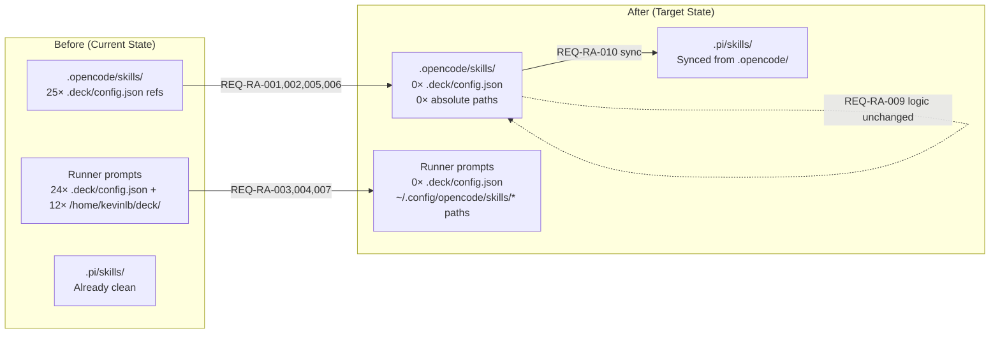

# Spec: Deck as Installer Runner-Agnostic

## Source

- Proposal: `deck-as-installer-runner-agnostic` proposal artifact
- Capabilities affected: `runner-agnostic-skills` (new), 12 `deck-developer-*` skills (modified)

## Requirements

### Capability: runner-agnostic-skills

**REQ-RA-001**: Skill files MUST NOT contain any absolute filesystem paths referencing the development machine (e.g., `/home/kevinlb/deck/`).
  Priority: MUST
  Surface: General
  Rationale: Skills are installed onto arbitrary runner machines where the deck repo does not exist. Absolute paths are invalid post-install.

**REQ-RA-002**: Skill files MUST NOT reference `.deck/config.json` or any deck-internal configuration file.
  Priority: MUST
  Surface: General
  Rationale: `.deck/` directory is not present on runner machines after installation.

**REQ-RA-003**: Runner prompt files MUST NOT contain absolute filesystem paths referencing the development machine.
  Priority: MUST
  Surface: General
  Rationale: Same as REQ-RA-001 — prompts are consumed on the runner machine.

**REQ-RA-004**: Runner prompt files MUST NOT reference `.deck/config.json`.
  Priority: MUST
  Surface: General
  Rationale: Same as REQ-RA-002.

**REQ-RA-005**: Skill file references to package instruction configuration MUST use runner-agnostic language (e.g., "runner's native package instruction system") instead of `.deck/config.json`.
  Priority: MUST
  Surface: General
  Rationale: The intent of the instruction must be preserved but without coupling to deck internals.

**REQ-RA-006**: Skill file references to adaptive memory configuration MUST use runner-agnostic language (e.g., "configured memory provider") instead of `.deck/config.json (field: adaptiveMemory.activeProvider)`.
  Priority: MUST
  Surface: General
  Rationale: Same as REQ-RA-005 — preserve instructional intent, remove deck coupling.

**REQ-RA-007**: Runner prompt "Read your skill file" directives MUST reference `~/.config/opencode/skills/deck-developer-{name}/SKILL.md` (portable home-relative path) instead of absolute paths.
  Priority: MUST
  Surface: General
  Rationale: After installation, skills reside at `~/.config/opencode/skills/` on the runner machine.

**REQ-RA-008**: All 12 skill names MUST remain exactly `deck-developer-*` (orchestrator, explorer, proposal, spec, design, task, apply-backend, apply-frontend, apply-general, verify, review, archive).
  Priority: MUST
  Surface: General
  Rationale: Naming is a public contract used by runners, users, and the installer.

**REQ-RA-009**: No SDD workflow logic, phase routing, or artifact format rules MUST be altered by this change.
  Priority: MUST
  Surface: General
  Rationale: This change is purely cosmetic (path/reference cleanup). Functional behavior must be identical before and after.

**REQ-RA-010**: `.opencode/skills/deck-developer-*/SKILL.md` and `.pi/skills/deck-developer-*/SKILL.md` MUST be identical after the change.
  Priority: SHOULD
  Surface: General
  Rationale: Both runner variants must receive the same skill content. Single-source editing then sync.

### Capability: deck-developer-{each-of-12}

Each of the 12 skills inherits all `runner-agnostic-skills` requirements above. No additional per-skill requirements.

## Acceptance Scenarios

### Capability: runner-agnostic-skills

#### Scenario: No absolute development paths in skill files
**Given** all 12 `.opencode/skills/deck-developer-*/SKILL.md` files
**When** searching for the pattern `/home/kevinlb/deck/`
**Then** zero matches are found across all files
> Covers: REQ-RA-001

#### Scenario: No .deck/config.json in skill files
**Given** all 12 `.opencode/skills/deck-developer-*/SKILL.md` files
**When** searching for the pattern `.deck/config.json`
**Then** zero matches are found across all files
> Covers: REQ-RA-002

#### Scenario: No absolute development paths in runner prompts
**Given** all 12 `~/.config/opencode/prompts/deck-developer/deck-developer-*.md` files
**When** searching for the pattern `/home/kevinlb/deck/`
**Then** zero matches are found across all files
> Covers: REQ-RA-003

#### Scenario: No .deck/config.json in runner prompts
**Given** all 12 runner prompt files
**When** searching for the pattern `.deck/config.json`
**Then** zero matches are found across all files
> Covers: REQ-RA-004

#### Scenario: Package instruction language is runner-agnostic in skills
**Given** any `deck-developer-*` skill file that previously contained "`.deck/config.json` package instruction toggles"
**When** reading the replacement text
**Then** it reads "runner's native package instruction system" or equivalent generic language without deck-internal references
> Covers: REQ-RA-005

#### Scenario: Adaptive memory language is runner-agnostic in skills
**Given** any `deck-developer-*` skill file that previously contained "Adaptive memory is configured via `.deck/config.json`"
**When** reading the replacement text
**Then** it references a generic "configured memory provider" or equivalent without `.deck/config.json`
> Covers: REQ-RA-006

#### Scenario: Skill file path in runner prompts uses home-relative path
**Given** any runner prompt file containing "Read your skill file at"
**When** reading the path
**Then** it reads `~/.config/opencode/skills/deck-developer-{name}/SKILL.md` (tilde-prefixed, no absolute machine path)
> Covers: REQ-RA-007

#### Scenario: All 12 skill names preserved
**Given** the `.opencode/skills/` directory
**When** listing subdirectories matching `deck-developer-*`
**Then** exactly 12 directories exist: orchestrator, explorer, proposal, spec, design, task, apply-backend, apply-frontend, apply-general, verify, review, archive
> Covers: REQ-RA-008

#### Scenario: SDD workflow logic unchanged
**Given** a skill file before and after the change
**When** comparing content with `.deck/config.json` and absolute path patterns stripped from both versions
**Then** the remaining text is identical (no logic changes)
> Covers: REQ-RA-009

#### Scenario: OpenCode and Pi skill copies are identical
**Given** `.opencode/skills/deck-developer-{name}/SKILL.md` and `.pi/skills/deck-developer-{name}/SKILL.md`
**When** comparing file contents for each of the 12 skills
**Then** each pair is byte-identical
> Covers: REQ-RA-010

#### Variant: Pi skills already clean before change
- Given `.pi/skills/` has zero `.deck/config.json` references currently
- When the change is applied
- Then `.pi/skills/` files are synced from `.opencode/skills/` and remain clean

## Validation Rules

| Field / Pattern | Rule | Error When | REQ-ID |
|---|---|---|---|
| `/home/kevinlb/deck/` | Must have 0 occurrences in `.opencode/skills/deck-developer-*/SKILL.md` | Pattern found | REQ-RA-001 |
| `/home/kevinlb/deck/` | Must have 0 occurrences in runner prompts | Pattern found | REQ-RA-003 |
| `.deck/config.json` | Must have 0 occurrences in `.opencode/skills/deck-developer-*/SKILL.md` | Pattern found | REQ-RA-002 |
| `.deck/config.json` | Must have 0 occurrences in runner prompts | Pattern found | REQ-RA-004 |
| `.deck/` | Must have 0 occurrences in all skill and prompt files | Pattern found | REQ-RA-002, REQ-RA-004 |
| Skill directory count | Must be exactly 12 under `deck-developer-*` | Count ≠ 12 | REQ-RA-008 |
| `.opencode/` vs `.pi/` diff | All 12 SKILL.md pairs must be byte-identical | Any pair differs | REQ-RA-010 |

## Error Contracts

| Condition | Error Type | Description |
|---|---|---|
| Residual absolute path | Verification failure | Grep finds `/home/` or `/Users/` in any skill or prompt file |
| Residual `.deck/` reference | Verification failure | Grep finds `.deck/` in any skill or prompt file |
| Skill name changed | Verification failure | Directory listing ≠ expected 12 names |
| Skill pair divergence | Sync failure | `.opencode/` and `.pi/` copies differ after sync |

## States and Transitions

> No meaningful state lifecycle. This is a one-time cleanup with verification.

## Open Questions

- None — spec is self-contained.

## Compliance Matrix

| REQ-ID | Scenario(s) | Status |
|---|---|---|
| REQ-RA-001 | No absolute development paths in skill files | Defined |
| REQ-RA-002 | No .deck/config.json in skill files | Defined |
| REQ-RA-003 | No absolute development paths in runner prompts | Defined |
| REQ-RA-004 | No .deck/config.json in runner prompts | Defined |
| REQ-RA-005 | Package instruction language runner-agnostic | Defined |
| REQ-RA-006 | Adaptive memory language runner-agnostic | Defined |
| REQ-RA-007 | Skill path in prompts uses home-relative | Defined |
| REQ-RA-008 | All 12 skill names preserved | Defined |
| REQ-RA-009 | SDD workflow logic unchanged | Defined |
| REQ-RA-010 | OpenCode and Pi copies identical | Defined |

## Mermaid Summary Source

## Baseline Measurement

| Location | `.deck/config.json` refs | Absolute paths | Files affected |
|---|---|---|---|
| `.opencode/skills/` | 25 | 0 | 12 |
| Runner prompts | 24 | 12 | 12 |
| `.pi/skills/` | 0 | 0 | 12 |
| **Total** | **49** | **12** | **24 unique (12 skills + 12 prompts)** |
