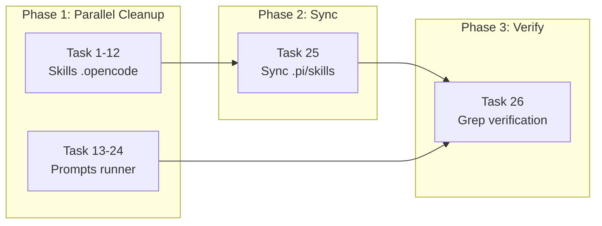

# Tasks: Deck as Installer Runner-Agnostic

## Source

- Spec: `deck-as-installer-runner-agnostic` spec artifact
- Design: `deck-as-installer-runner-agnostic` design artifact
- Capabilities affected: `runner-agnostic-skills` (new), 12 `deck-developer-*` skills (modified)

## Replacement Patterns (apply to all tasks)

| # | Pattern (buscar) | Reemplazar por | REQ-ID |
|---|------------------|----------------|--------|
| P1 | `/home/kevinlb/deck/` | `~/.config/opencode/` | REQ-RA-001, REQ-RA-003 |
| P2 | `.deck/config.json` | `runner's native package instruction system` | REQ-RA-002, REQ-RA-004, REQ-RA-005 |
| P3 | `adaptiveMemory.activeProvider` | `configured memory provider` | REQ-RA-006 |

> Note: P2 and P3 replacements require contextual judgment — the exact replacement text should match surrounding sentence structure. See REQ-RA-005/006 for guidance.

## Task Groups

### Group: Skills Cleanup (.opencode/skills/)

> All 12 tasks are independent and can run in parallel.
> Baseline: 25 × `.deck/config.json`, 0 × `/home/kevinlb/deck/`, 39 × `adaptiveMemory.activeProvider`

#### Task 1: Clean deck-developer-orchestrator/SKILL.md
**Owner**: General Apply
**Priority**: P0
**Complexity**: Low
**Parallel**: Yes
**Depends on**: none

**Description**
Apply replacement patterns P1–P3 to `.opencode/skills/deck-developer-orchestrator/SKILL.md`. This file has the highest count: 3× `.deck/config.json`, 6× `adaptiveMemory.activeProvider`.

**Files**
- `.opencode/skills/deck-developer-orchestrator/SKILL.md` — modify

**Verification**
```bash
grep -c '\.deck/config\.json\|/home/kevinlb/deck/\|adaptiveMemory\.activeProvider' .opencode/skills/deck-developer-orchestrator/SKILL.md
# Expected: 0
```

---

#### Task 2: Clean deck-developer-explorer/SKILL.md
**Owner**: General Apply
**Priority**: P0
**Complexity**: Low
**Parallel**: Yes
**Depends on**: none

**Description**
Apply P1–P3 to `.opencode/skills/deck-developer-explorer/SKILL.md`. Baseline: 2× `.deck/config.json`, 3× `adaptiveMemory.activeProvider`.

**Files**
- `.opencode/skills/deck-developer-explorer/SKILL.md` — modify

**Verification**
```bash
grep -c '\.deck/config\.json\|/home/kevinlb/deck/\|adaptiveMemory\.activeProvider' .opencode/skills/deck-developer-explorer/SKILL.md
# Expected: 0
```

---

#### Task 3: Clean deck-developer-proposal/SKILL.md
**Owner**: General Apply
**Priority**: P0
**Complexity**: Low
**Parallel**: Yes
**Depends on**: none

**Description**
Apply P1–P3 to `.opencode/skills/deck-developer-proposal/SKILL.md`. Baseline: 2× `.deck/config.json`, 3× `adaptiveMemory.activeProvider`.

**Files**
- `.opencode/skills/deck-developer-proposal/SKILL.md` — modify

**Verification**
```bash
grep -c '\.deck/config\.json\|/home/kevinlb/deck/\|adaptiveMemory\.activeProvider' .opencode/skills/deck-developer-proposal/SKILL.md
# Expected: 0
```

---

#### Task 4: Clean deck-developer-spec/SKILL.md
**Owner**: General Apply
**Priority**: P0
**Complexity**: Low
**Parallel**: Yes
**Depends on**: none

**Description**
Apply P1–P3 to `.opencode/skills/deck-developer-spec/SKILL.md`. Baseline: 2× `.deck/config.json`, 3× `adaptiveMemory.activeProvider`.

**Files**
- `.opencode/skills/deck-developer-spec/SKILL.md` — modify

**Verification**
```bash
grep -c '\.deck/config\.json\|/home/kevinlb/deck/\|adaptiveMemory\.activeProvider' .opencode/skills/deck-developer-spec/SKILL.md
# Expected: 0
```

---

#### Task 5: Clean deck-developer-design/SKILL.md
**Owner**: General Apply
**Priority**: P0
**Complexity**: Low
**Parallel**: Yes
**Depends on**: none

**Description**
Apply P1–P3 to `.opencode/skills/deck-developer-design/SKILL.md`. Baseline: 2× `.deck/config.json`, 3× `adaptiveMemory.activeProvider`.

**Files**
- `.opencode/skills/deck-developer-design/SKILL.md` — modify

**Verification**
```bash
grep -c '\.deck/config\.json\|/home/kevinlb/deck/\|adaptiveMemory\.activeProvider' .opencode/skills/deck-developer-design/SKILL.md
# Expected: 0
```

---

#### Task 6: Clean deck-developer-task/SKILL.md
**Owner**: General Apply
**Priority**: P0
**Complexity**: Low
**Parallel**: Yes
**Depends on**: none

**Description**
Apply P1–P3 to `.opencode/skills/deck-developer-task/SKILL.md`. Baseline: 2× `.deck/config.json`, 3× `adaptiveMemory.activeProvider`.

**Files**
- `.opencode/skills/deck-developer-task/SKILL.md` — modify

**Verification**
```bash
grep -c '\.deck/config\.json\|/home/kevinlb/deck/\|adaptiveMemory\.activeProvider' .opencode/skills/deck-developer-task/SKILL.md
# Expected: 0
```

---

#### Task 7: Clean deck-developer-apply-backend/SKILL.md
**Owner**: General Apply
**Priority**: P0
**Complexity**: Low
**Parallel**: Yes
**Depends on**: none

**Description**
Apply P1–P3 to `.opencode/skills/deck-developer-apply-backend/SKILL.md`. Baseline: 2× `.deck/config.json`, 3× `adaptiveMemory.activeProvider`.

**Files**
- `.opencode/skills/deck-developer-apply-backend/SKILL.md` — modify

**Verification**
```bash
grep -c '\.deck/config\.json\|/home/kevinlb/deck/\|adaptiveMemory\.activeProvider' .opencode/skills/deck-developer-apply-backend/SKILL.md
# Expected: 0
```

---

#### Task 8: Clean deck-developer-apply-frontend/SKILL.md
**Owner**: General Apply
**Priority**: P0
**Complexity**: Low
**Parallel**: Yes
**Depends on**: none

**Description**
Apply P1–P3 to `.opencode/skills/deck-developer-apply-frontend/SKILL.md`. Baseline: 2× `.deck/config.json`, 3× `adaptiveMemory.activeProvider`.

**Files**
- `.opencode/skills/deck-developer-apply-frontend/SKILL.md` — modify

**Verification**
```bash
grep -c '\.deck/config\.json\|/home/kevinlb/deck/\|adaptiveMemory\.activeProvider' .opencode/skills/deck-developer-apply-frontend/SKILL.md
# Expected: 0
```

---

#### Task 9: Clean deck-developer-apply-general/SKILL.md
**Owner**: General Apply
**Priority**: P0
**Complexity**: Low
**Parallel**: Yes
**Depends on**: none

**Description**
Apply P1–P3 to `.opencode/skills/deck-developer-apply-general/SKILL.md`. Baseline: 2× `.deck/config.json`, 3× `adaptiveMemory.activeProvider`.

**Files**
- `.opencode/skills/deck-developer-apply-general/SKILL.md` — modify

**Verification**
```bash
grep -c '\.deck/config\.json\|/home/kevinlb/deck/\|adaptiveMemory\.activeProvider' .opencode/skills/deck-developer-apply-general/SKILL.md
# Expected: 0
```

---

#### Task 10: Clean deck-developer-verify/SKILL.md
**Owner**: General Apply
**Priority**: P0
**Complexity**: Low
**Parallel**: Yes
**Depends on**: none

**Description**
Apply P1–P3 to `.opencode/skills/deck-developer-verify/SKILL.md`. Baseline: 2× `.deck/config.json`, 3× `adaptiveMemory.activeProvider`.

**Files**
- `.opencode/skills/deck-developer-verify/SKILL.md` — modify

**Verification**
```bash
grep -c '\.deck/config\.json\|/home/kevinlb/deck/\|adaptiveMemory\.activeProvider' .opencode/skills/deck-developer-verify/SKILL.md
# Expected: 0
```

---

#### Task 11: Clean deck-developer-review/SKILL.md
**Owner**: General Apply
**Priority**: P0
**Complexity**: Low
**Parallel**: Yes
**Depends on**: none

**Description**
Apply P1–P3 to `.opencode/skills/deck-developer-review/SKILL.md`. Baseline: 2× `.deck/config.json`, 3× `adaptiveMemory.activeProvider`.

**Files**
- `.opencode/skills/deck-developer-review/SKILL.md` — modify

**Verification**
```bash
grep -c '\.deck/config\.json\|/home/kevinlb/deck/\|adaptiveMemory\.activeProvider' .opencode/skills/deck-developer-review/SKILL.md
# Expected: 0
```

---

#### Task 12: Clean deck-developer-archive/SKILL.md
**Owner**: General Apply
**Priority**: P0
**Complexity**: Low
**Parallel**: Yes
**Depends on**: none

**Description**
Apply P1–P3 to `.opencode/skills/deck-developer-archive/SKILL.md`. Baseline: 2× `.deck/config.json`, 3× `adaptiveMemory.activeProvider`.

**Files**
- `.opencode/skills/deck-developer-archive/SKILL.md` — modify

**Verification**
```bash
grep -c '\.deck/config\.json\|/home/kevinlb/deck/\|adaptiveMemory\.activeProvider' .opencode/skills/deck-developer-archive/SKILL.md
# Expected: 0
```

---

### Group: Prompts Cleanup (~/.config/opencode/prompts/deck-developer/)

> All 12 tasks are independent and can run in parallel.
> All can run in parallel with Tasks 1–12 (skills).
> Baseline: 12× `/home/kevinlb/deck/`, 24× `.deck/config.json`, 34× `adaptiveMemory.activeProvider`

#### Task 13: Clean deck-developer-orchestrator prompt
**Owner**: General Apply
**Priority**: P0
**Complexity**: Low
**Parallel**: Yes
**Depends on**: none

**Description**
Apply P1–P3 to `~/.config/opencode/prompts/deck-developer/deck-developer-orchestrator.md`. Baseline: 1× `/home/kevinlb/deck/`, 2× `.deck/config.json`, 1× `adaptiveMemory.activeProvider`.

**Files**
- `~/.config/opencode/prompts/deck-developer/deck-developer-orchestrator.md` — modify

**Verification**
```bash
grep -c '\.deck/config\.json\|/home/kevinlb/deck/\|adaptiveMemory\.activeProvider' ~/.config/opencode/prompts/deck-developer/deck-developer-orchestrator.md
# Expected: 0
```

---

#### Task 14: Clean deck-developer-explorer prompt
**Owner**: General Apply
**Priority**: P0
**Complexity**: Low
**Parallel**: Yes
**Depends on**: none

**Description**
Apply P1–P3 to `~/.config/opencode/prompts/deck-developer/deck-developer-explorer.md`.

**Files**
- `~/.config/opencode/prompts/deck-developer/deck-developer-explorer.md` — modify

**Verification**
```bash
grep -c '\.deck/config\.json\|/home/kevinlb/deck/\|adaptiveMemory\.activeProvider' ~/.config/opencode/prompts/deck-developer/deck-developer-explorer.md
# Expected: 0
```

---

#### Task 15: Clean deck-developer-proposal prompt
**Owner**: General Apply
**Priority**: P0
**Complexity**: Low
**Parallel**: Yes
**Depends on**: none

**Description**
Apply P1–P3 to `~/.config/opencode/prompts/deck-developer/deck-developer-proposal.md`.

**Files**
- `~/.config/opencode/prompts/deck-developer/deck-developer-proposal.md` — modify

**Verification**
```bash
grep -c '\.deck/config\.json\|/home/kevinlb/deck/\|adaptiveMemory\.activeProvider' ~/.config/opencode/prompts/deck-developer/deck-developer-proposal.md
# Expected: 0
```

---

#### Task 16: Clean deck-developer-spec prompt
**Owner**: General Apply
**Priority**: P0
**Complexity**: Low
**Parallel**: Yes
**Depends on**: none

**Description**
Apply P1–P3 to `~/.config/opencode/prompts/deck-developer/deck-developer-spec.md`.

**Files**
- `~/.config/opencode/prompts/deck-developer/deck-developer-spec.md` — modify

**Verification**
```bash
grep -c '\.deck/config\.json\|/home/kevinlb/deck/\|adaptiveMemory\.activeProvider' ~/.config/opencode/prompts/deck-developer/deck-developer-spec.md
# Expected: 0
```

---

#### Task 17: Clean deck-developer-design prompt
**Owner**: General Apply
**Priority**: P0
**Complexity**: Low
**Parallel**: Yes
**Depends on**: none

**Description**
Apply P1–P3 to `~/.config/opencode/prompts/deck-developer/deck-developer-design.md`.

**Files**
- `~/.config/opencode/prompts/deck-developer/deck-developer-design.md` — modify

**Verification**
```bash
grep -c '\.deck/config\.json\|/home/kevinlb/deck/\|adaptiveMemory\.activeProvider' ~/.config/opencode/prompts/deck-developer/deck-developer-design.md
# Expected: 0
```

---

#### Task 18: Clean deck-developer-task prompt
**Owner**: General Apply
**Priority**: P0
**Complexity**: Low
**Parallel**: Yes
**Depends on**: none

**Description**
Apply P1–P3 to `~/.config/opencode/prompts/deck-developer/deck-developer-task.md`.

**Files**
- `~/.config/opencode/prompts/deck-developer/deck-developer-task.md` — modify

**Verification**
```bash
grep -c '\.deck/config\.json\|/home/kevinlb/deck/\|adaptiveMemory\.activeProvider' ~/.config/opencode/prompts/deck-developer/deck-developer-task.md
# Expected: 0
```

---

#### Task 19: Clean deck-developer-apply-backend prompt
**Owner**: General Apply
**Priority**: P0
**Complexity**: Low
**Parallel**: Yes
**Depends on**: none

**Description**
Apply P1–P3 to `~/.config/opencode/prompts/deck-developer/deck-developer-apply-backend.md`.

**Files**
- `~/.config/opencode/prompts/deck-developer/deck-developer-apply-backend.md` — modify

**Verification**
```bash
grep -c '\.deck/config\.json\|/home/kevinlb/deck/\|adaptiveMemory\.activeProvider' ~/.config/opencode/prompts/deck-developer/deck-developer-apply-backend.md
# Expected: 0
```

---

#### Task 20: Clean deck-developer-apply-frontend prompt
**Owner**: General Apply
**Priority**: P0
**Complexity**: Low
**Parallel**: Yes
**Depends on**: none

**Description**
Apply P1–P3 to `~/.config/opencode/prompts/deck-developer/deck-developer-apply-frontend.md`.

**Files**
- `~/.config/opencode/prompts/deck-developer/deck-developer-apply-frontend.md` — modify

**Verification**
```bash
grep -c '\.deck/config\.json\|/home/kevinlb/deck/\|adaptiveMemory\.activeProvider' ~/.config/opencode/prompts/deck-developer/deck-developer-apply-frontend.md
# Expected: 0
```

---

#### Task 21: Clean deck-developer-apply-general prompt
**Owner**: General Apply
**Priority**: P0
**Complexity**: Low
**Parallel**: Yes
**Depends on**: none

**Description**
Apply P1–P3 to `~/.config/opencode/prompts/deck-developer/deck-developer-apply-general.md`.

**Files**
- `~/.config/opencode/prompts/deck-developer/deck-developer-apply-general.md` — modify

**Verification**
```bash
grep -c '\.deck/config\.json\|/home/kevinlb/deck/\|adaptiveMemory\.activeProvider' ~/.config/opencode/prompts/deck-developer/deck-developer-apply-general.md
# Expected: 0
```

---

#### Task 22: Clean deck-developer-verify prompt
**Owner**: General Apply
**Priority**: P0
**Complexity**: Low
**Parallel**: Yes
**Depends on**: none

**Description**
Apply P1–P3 to `~/.config/opencode/prompts/deck-developer/deck-developer-verify.md`.

**Files**
- `~/.config/opencode/prompts/deck-developer/deck-developer-verify.md` — modify

**Verification**
```bash
grep -c '\.deck/config\.json\|/home/kevinlb/deck/\|adaptiveMemory\.activeProvider' ~/.config/opencode/prompts/deck-developer/deck-developer-verify.md
# Expected: 0
```

---

#### Task 23: Clean deck-developer-review prompt
**Owner**: General Apply
**Priority**: P0
**Complexity**: Low
**Parallel**: Yes
**Depends on**: none

**Description**
Apply P1–P3 to `~/.config/opencode/prompts/deck-developer/deck-developer-review.md`.

**Files**
- `~/.config/opencode/prompts/deck-developer/deck-developer-review.md` — modify

**Verification**
```bash
grep -c '\.deck/config\.json\|/home/kevinlb/deck/\|adaptiveMemory\.activeProvider' ~/.config/opencode/prompts/deck-developer/deck-developer-review.md
# Expected: 0
```

---

#### Task 24: Clean deck-developer-archive prompt
**Owner**: General Apply
**Priority**: P0
**Complexity**: Low
**Parallel**: Yes
**Depends on**: none

**Description**
Apply P1–P3 to `~/.config/opencode/prompts/deck-developer/deck-developer-archive.md`.

**Files**
- `~/.config/opencode/prompts/deck-developer/deck-developer-archive.md` — modify

**Verification**
```bash
grep -c '\.deck/config\.json\|/home/kevinlb/deck/\|adaptiveMemory\.activeProvider' ~/.config/opencode/prompts/deck-developer/deck-developer-archive.md
# Expected: 0
```

---

### Group: Sync & Verification

#### Task 25: Sync .pi/skills from .opencode/skills
**Owner**: General Apply
**Priority**: P0
**Complexity**: Low
**Parallel**: No — depends on Tasks 1–12
**Depends on**: Tasks 1–12

**Description**
Copy all 12 cleaned `.opencode/skills/deck-developer-*/SKILL.md` files to corresponding `.pi/skills/deck-developer-*/SKILL.md`. Each pair must be byte-identical after sync (REQ-RA-010).

**Files**
- `.pi/skills/deck-developer-*/SKILL.md` — modify (12 files)

**Verification**
```bash
for skill in deck-developer-{orchestrator,explorer,proposal,spec,design,task,apply-backend,apply-frontend,apply-general,verify,review,archive}; do
  diff .opencode/skills/$skill/SKILL.md .pi/skills/$skill/SKILL.md && echo "OK: $skill" || echo "DIFF: $skill"
done
```

---

#### Task 26: Verify zero patterns across all files
**Owner**: General Apply
**Priority**: P0
**Complexity**: Low
**Parallel**: No — depends on Tasks 1–25
**Depends on**: Tasks 1–25

**Description**
Run comprehensive grep verification across all 36 files (12 `.opencode/skills`, 12 `.pi/skills`, 12 prompts). Confirm zero matches for all three forbidden patterns. Also verify exactly 12 skill directories exist under `.opencode/skills/deck-developer-*`.

**Files**
- All 36 files — verify only (no modifications)

**Verification**
```bash
# Forbidden patterns - all must return 0
echo "=== .opencode/skills ===" && grep -rc '\.deck/config\.json\|/home/kevinlb/deck/\|adaptiveMemory\.activeProvider' .opencode/skills/deck-developer-*/SKILL.md | grep -v ':0$' || echo "CLEAN"
echo "=== .pi/skills ===" && grep -rc '\.deck/config\.json\|/home/kevinlb/deck/\|adaptiveMemory\.activeProvider' .pi/skills/deck-developer-*/SKILL.md | grep -v ':0$' || echo "CLEAN"
echo "=== prompts ===" && grep -rc '\.deck/config\.json\|/home/kevinlb/deck/\|adaptiveMemory\.activeProvider' ~/.config/opencode/prompts/deck-developer/*.md | grep -v ':0$' || echo "CLEAN"

# Directory count
ls -d .opencode/skills/deck-developer-* | wc -l  # Expected: 12
```

## Dependency Graph

```
Tasks 1–12 (Skills) ──────────┐
                                ├──→ Task 25 (Sync .pi) ──→ Task 26 (Verify)
Tasks 13–24 (Prompts) ─────────┘
```

## Parallelization Plan

| Phase | Tasks | Can Run in Parallel |
|---|---|---|
| Skills Cleanup | 1–12 | Yes — all 12 independent |
| Prompts Cleanup | 13–24 | Yes — all 12 independent |
| Skills + Prompts | 1–24 | Yes — both groups fully parallel |
| Sync | 25 | No — waits for 1–12 |
| Verify | 26 | No — waits for 1–25 |

## Responsibility Contracts

| Contract / Boundary | Owner | Consumers | Notes |
|---|---|---|---|
| Skill file content | General Apply (Tasks 1–12) | Task 25 (sync), Task 26 (verify) | Canonical content source for .pi sync |
| Prompt file content | General Apply (Tasks 13–24) | Task 26 (verify) | Independent of skills; parallel |
| .pi sync | General Apply (Task 25) | Task 26 (verify) | Byte-identity contract REQ-RA-010 |

## Complexity Summary

| Complexity | Count | Task Numbers |
|---|---|---|
| Low | 26 | 1–26 |
| Medium | 0 | — |
| High | 0 | — |

## Flagged for Splitting

None — all tasks are Low complexity.

## Review Workload Forecast

| Signal | Value |
|---|---|
| Estimated changed lines | 100–400 |
| 400-line budget risk | Low |
| Scope reduction recommended | No |
| Sequential work slices recommended | No |
| Decision needed before Apply | Yes — see Open Questions |

**Rationale**: 24 files with identical pattern replacements (~2–5 changes each). Average ~10 lines changed per file = ~240 total. Low risk, but 24 files touched so verification is critical.

## Open Questions / Blockers

- **Canonical source not addressed**: The design identifies that skill/prompt content is generated from `packages/core/src/teams/developer/instruction-bundles/` and `packages/adapter-opencode/src/prompt-generation.ts`. These tasks only clean materialized artifacts. A future change is needed to clean the canonical TS source and add regeneration to prevent regression. **Status: allowed-with-stub** — materialized cleanup is independently valuable; canonical source fix can be a separate change.
- **P2/P3 contextual replacement**: `.deck/config.json` and `adaptiveMemory.activeProvider` replacements require sentence-level judgment (not blind find-replace). Apply agent must ensure grammatically correct results per REQ-RA-005/006.

## Mermaid Summary Source


