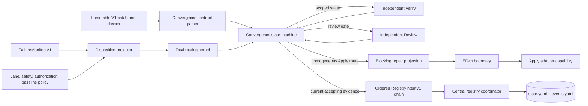

# Design: Deterministic Apply → Verify → Review Flow

## Change and authority

- **Change ID:** `deterministic-apply-verify-review-flow`
- **Execution mode:** Automatic
- **Risk:** High
- **Design scope:** additive contracts and runtime orchestration for finding disposition, deterministic routing, blocking-only repair, convergence, independent Verify/Review scheduling, replay, and centralized registry intents.
- **Authoritative change artifacts:** `exploration.md`, approved `proposal.md`, revised `spec.md`, `spec-replan-g1.md`, and terminal independent evidence `review-g1-repair-2.md` for this change.
- **Spec snapshot reconciled by this design:** SHA-256 `374a8fb1a155830624083829aa8ccbbe609032e6a1b4c8064169372b4bfb8d7f`.
- **Promoted constraints:** `adaptive-quality-control`, `artifact-state-contracts`, and `runner-orchestration-resilience`.
- **Explicit exclusion:** `runner-capability-standardization` is not a dependency, target, repair route, or migration source.

This document defines implementation architecture only. It does not authorize source, test, generated-file, registry, or historical-change modification. The G1 repair budget remains exhausted; this reconciliation is not repair-3 and does not authorize Apply. Tasks must reconcile against the Spec digest above, and a separately human-approved bounded batch identity remains mandatory before any modifying attempt.

## Decision summary

1. Preserve every existing V1 contract and replay path unchanged. Add a deterministic convergence envelope around V1 evidence rather than adding fields to exact-key V1 payloads.
2. Represent disposition in a separate `FindingDispositionEnvelopeV1`; do not reinterpret `FailureFindingV1.status` or `relationship` and do not change existing finding IDs or digests.
3. Represent routing destination and owner as separate stable codes. Route every active blocking finding independently, then permit Apply only for one homogeneous `targeted_repair` subset.
4. Represent repair authority as a `BlockingRepairProjectionV1` that retains the original batch ID/digest and adds a content-derived projection digest. It is not a child batch and never mutates or copies the original batch/manifest.
5. Add an append-only `ExecutionConvergenceDossierV1` whose state machine inserts the Review gate between scoped Verify and broad Verify without adding an OpenSpec phase.
6. Bind all stage and Review evidence to explicit dependency sets. Reuse scoped or Review evidence only when every dependency digest is unchanged; always invalidate and rerun broad after a modifying repair.
7. Use one retry identity and attempt ledger for modifying convergence. Existing `RepairIncident` governance remains a restrictive compatibility guard, not a second identity authority.
8. Keep role judgments independent. Verify and Review receive evidence references and policy inputs, never Apply attempt summaries or another role's conclusion.
9. Derive commit-ready `RegistryIntentV1` values only after all current-generation gates accept. The centralized coordinator validates an ordered intent chain and commits the resulting state/events pair atomically.
10. Allow existing Fast-lane broad deferral only under its current explicit policy proof and only when no mandatory broad reason or safety floor applies. No new deferral policy is introduced.
11. Derive protected-risk state from immutable `FailureFindingV1` fields plus one batch-bound mandatory safety-policy snapshot. Caller booleans are never clearing authority; disagreement or missing authority blocks or escalates.
12. Derive retry identity from one canonical authority projection and derive attempt number/prior-attempt binding from the current validated convergence ledger. Carried identity and counters are assertions only and are exact-equality checked at parse and effect boundaries.
13. Preserve serialized V1 shapes while adding authority-bound consumption. Every convergence append is event-derived, every accepting event has typed current-generation evidence, and every parsed revision is replayed from its predecessor before completion or commit readiness can be trusted.

## Requirements traceability

| Design area | Spec coverage |
|---|---|
| Disposition envelope, protected-risk source authority, and projection | FD-01..03, BA-01..02, OF-01, SEC-03 |
| Minimal repair projection, retry/counter authority, and effect guard | MD-01..03, CS-01..02, RG-05, SEC-01 |
| Total routing and mixed-owner handling | RD-01..02, IEV-01..02, SEC-02..03 |
| Independent role scheduling | IR-01..02, TV-01..03 |
| Review gate, broad gate, evidence authority, and invalidation | BV-01..03, RV-01..02, REG-03, SAF-01 |
| Retry identity and progress | RG-01..05, MD-03, DT-01..02 |
| V1 compatibility and replay | COMP-01..02, DT-01 |
| Authorization, Git, and excluded scope | SAF-02..04 |
| Centralized registry chain | REG-01..03, artifact-state contracts |
| Rollout, rollback, and baseline | ROL-01..03 |

## Bounded G1 authority replan

This section resolves Spec OQ-11 and is controlling wherever an older paragraph could be read as allowing caller-asserted risk, identity, counters, evidence, or state. It is additive and fail-closed: the serialized shapes and digests of established V1 contracts remain unchanged, while the deterministic path gains mandatory authority inputs and authoritative consumption functions. Structural V1 readers may remain for historical readability, but their output alone is never effect-, completion-, or commit-authorizing.

The exact revised requirements reconciled here are `REQ-DAVR-FD-03`, `REQ-DAVR-SEC-03`, `REQ-DAVR-RG-05`, `REQ-DAVR-MD-03`, `REQ-DAVR-BV-03`, and `REQ-DAVR-REG-03`.

They close the architecture gaps identified as `REVIEW-G1-R2-B1-PROTECTED-RISK-AUTHORITY`, `REVIEW-G1-R2-B2-RETRY-IDENTITY-AUTHORITY`, and `REVIEW-G1-R2-B3-CONVERGENCE-AUTHORITY`; the unchanged implementation remains blocked until future independent Verify and Review evidence prove those defects absent.

### Shared authority chain

The four repaired contracts consume one immutable authority chain:

1. a parsed `ApplyBatchContractV1`, including its original digest, authorization reference, allowed/blocked targets, acceptance obligations, verification plan, and artifact digests;
2. a parsed `FailureManifestV1`, whose per-finding `rootCause`, `isSecurityRelevant`, `oracleId`, anchors, evidence, and status remain unchanged V1 authority;
3. a coordinator-supplied mandatory policy snapshot whose Spec/Design/Tasks digests exactly equal the corresponding entries in the batch's `artifactDigests`, and whose policy versions are explicit current inputs rather than literals inside a contract implementation; and
4. the current fully parsed convergence history and the full immutable records referenced by its digest lists.

Every authority-bound builder and parser receives the complete authority slice required at its boundary, normalizes it once, recomputes its semantic projection, and compares exact equality with carried values. Disposition/routing need items 1–3; projection/effect additionally need the current ledger slice from item 4; convergence append/parse need the current history and all referenced typed records. Missing artifacts, missing referenced records, digest mismatch, ambiguous policy, or disagreement between carried and derived values returns `invalid-evidence` and no modifying or completion effect. A valid rehash proves serialization integrity only; it never substitutes for this recomputation.

### Protected-risk source authority

Add a pure `ProtectedRiskAuthorityContextV1` input in `finding-disposition.ts`; it is an authority argument, not a field added to `FailureFindingV1`, `FailureManifestV1`, `FindingDispositionEnvelopeV1`, or `RoutingDecisionV1`. Its normalized semantic fields are:

- `batchDigest` and `manifestDigest`;
- current `classificationPolicyVersion` and `routingPolicyVersion`;
- exact current Spec/Design/Tasks artifact digests, matched against `batch.artifactDigests`;
- sorted mandatory security/data-loss requirement, task, check, and oracle IDs from the approved policy snapshot; and
- the policy snapshot digest.

For each finding, `deriveProtectedRiskV1(finding, authority)` returns one closed class: `none`, `security`, `data_loss`, `security_and_data_loss`, or `ambiguous`. The derivation order is fixed:

1. `rootCause === "security"` or `isSecurityRelevant === true` is positive intrinsic security authority from the parsed finding. A contradiction between those two authoritative fields is `ambiguous` but remains protected and can never derive `none`.
2. A match between the finding's requirement/task/check/oracle anchors and a mandatory data-loss policy set is data-loss authority. The policy set is accepted only when its artifact and batch bindings match the current batch.
3. Multiple positive sources combine; they do not cancel each other.
4. Missing policy binding, contradictory authority, or a carried/caller value that disagrees with the derivation yields `ambiguous`.
5. Caller `protectedRisk`/`dataLossRisk` values may never clear or replace the derived class. False or omission has no clearing effect; an unsupported positive assertion is treated as ambiguity, not as new modification authority.

Disposition precedence therefore becomes: derived protected or ambiguous risk → `blocking`; only then exact pre-existing baseline, authorized deferral, advisory recommendation, and final ambiguous-to-blocking fallback. Routing recomputes the same class per finding from the manifest and policy snapshot before any root-cause row. `security`, `data_loss`, and `security_and_data_loss` route to `escalate`/`human`; `ambiguous` routes to `stop`/`coordinator` or the stricter existing escalation path. Neither may enter a homogeneous Apply-owned subset. The disposition parser, routing parser, repair-projection builder, and effect validator all receive the same authority context and repeat the derivation. Stable codes are `PROTECTED_RISK_SECURITY`, `PROTECTED_RISK_DATA_LOSS`, `PROTECTED_RISK_AUTHORITY_AMBIGUOUS`, `DISPOSITION_PROTECTED_RISK_MISMATCH`, and `ROUTING_PROTECTED_RISK_MISMATCH`.

### Retry identity and counter authority

Add one pure `RetryIdentityAuthorityProjectionV1`, constructed from authority rather than from projection fields. Its complete canonical payload is exactly:

- current `routingPolicyVersion` obtained from the normalized current routing-policy input;
- original batch digest;
- sorted selected active-blocking finding IDs;
- homogeneous destination and owner recomputed from the routing authority;
- exact derived repair targets;
- sorted derived requirement, task, and finding-evidence check anchors;
- the complete sorted original batch `acceptanceObligations` set (V1 has no per-finding applicability map, so no caller-selected subset is authoritative);
- sorted `oracleId` values read from the selected parsed findings; and
- sorted mandatory verification-plan check IDs, derived from all stage entries in the parsed original batch's `verificationPlan` (all V1 plan check IDs are mandatory because V1 has no optional marker).

The authority projection is canonicalized and hashed to produce `retryIdentity`. Attempt number, prior-attempt digest, prose, severity, timestamps, and producer identity are excluded. No implementation constant is accepted as `routingPolicyVersion`; the builder, parser, and effect validator receive the current normalized policy input. Changing any listed field creates a different identity and cannot inherit attempts or progress.

The sole counter authority is the current convergence dossier's append-only `retryLedgerDigests` plus the complete parsed attempt records to which those digests refer. Each `RetryAttemptRecordV1` binds its digest, retry identity, attempt number, projection digest, prior-attempt digest when present, convergence revision/digest, and terminal effect result. The authority-bound ledger validator requires exact digest-list equality, unique records, and a contiguous per-identity sequence. Before an effect:

- expected attempt number is `1 +` the count of validated ledger records for the recomputed identity;
- attempt 1 must omit `priorAttemptDigest`;
- attempt N>1 must name the digest of attempt N-1 for that same identity; and
- the projection's convergence revision/digest must equal the current dossier head.

`parseBlockingRepairProjectionV1` is tightened through mandatory authority arguments to recompute the complete identity and attempt binding, while preserving the serialized V1 projection shape. The effect boundary repeats the full derivation from batch + manifest + disposition + routing policy + current ledger and does not trust a parser result or carried counter. Mismatch returns `RETRY_IDENTITY_MISMATCH`, `RETRY_POLICY_VERSION_MISMATCH`, `RETRY_LEDGER_MISMATCH`, `RETRY_ATTEMPT_NUMBER_MISMATCH`, or `RETRY_PRIOR_ATTEMPT_MISMATCH`, performs no effect, and appends no attempt. An attempt record is appended only after an authorized modifying invocation obtains a terminal effect result; transport ambiguity follows existing reconciliation and cannot mint a second counter entry.

### Convergence evidence and transition authority

Keep `ExecutionConvergenceStateV1` and `ExecutionConvergenceDossierV1` serialized keys unchanged. Add typed authority records consumed by the append/parse APIs:

- `ConvergenceStageEvidenceV1`: stage (`apply`, `targeted`, `affected_area`, `review`, `broad`, or `registry_commit`), evidence digest, generation, implementation-subject digest, dependency-set digest, active-blocking-set digest, and the referenced role result or registry commit digest;
- `ConvergenceInvalidationV1`: predecessor revision/digest, old and new subject/dependency digests, deterministic reason, invalidated stage digests, and generation; and
- `ConvergenceTransitionReceiptV1`: predecessor revision/digest, event, stage-evidence or invalidation digest, and the exact next-state digest.

These are content-addressed authority inputs referenced through the dossier's existing append-only digest lists; no key is injected into the V1 dossier. For role/registry events, `roleResultDigests` appends the underlying result/commit digest, then the stage-evidence digest, then the transition-receipt digest. For invalidation, `invalidationRecordDigests` appends the invalidation digest and then its transition-receipt digest. `retryLedgerDigests` contains only complete retry-attempt-record digests, and `registryIntentDigests` remains unchanged and contains only intents. The authority-bound parser requires every referenced record in full, checks the canonical append order plus its digest, stage, predecessor, generation, subject, and dependency set, and rejects opaque digest-only evidence.

`appendExecutionConvergenceRevisionV1` no longer accepts an arbitrary caller state on the deterministic path. It accepts a validated event plus its typed evidence/invalidation authority, invokes `transitionExecutionConvergenceStateV1`, and serializes only the computed next state. `parseExecutionConvergenceDossierV1` validates structural V1 readability; `parseExecutionConvergenceDossierWithAuthorityV1` additionally replays every revision from the canonical initial state and exact predecessor using its transition receipt, then byte-compares the computed and persisted states. Only the authority-bound result may authorize another effect, `registry_commit_pending`, or `complete`.

For non-modifying events, the evidence generation and implementation-subject digest must equal the predecessor state. Its dependency-set digest must equal the stage-specific digest recomputed from the current batch/artifact/target/check and preceding-stage authority. Subject drift is never inherited. A subject/dependency change first emits a separate `dependencies_invalidated` event with `ConvergenceInvalidationV1`; it clears invalidated scoped/Review/broad digests and returns to `targeted_pending` for rerun. The original accepting event is not applied in the same revision. Modifying `apply_result_accepted` and `repair_effect_succeeded` events are the only events that increment generation and may establish a new implementation subject.

The legal accepting sequence is therefore event-derived and evidence-typed:

| Predecessor | Event authority | Required current binding | Computed successor |
|---|---|---|---|
| `awaiting_apply_result` | `apply_result_accepted` + Apply evidence | batch/projection, generation + 1 subject, invalidation of any prior evidence | `targeted_pending` |
| `targeted_pending` | `targeted_accepted_no_blockers` + targeted evidence | same generation/subject, targeted dependency digest, empty active blockers | `affected_pending` |
| `affected_pending` | `affected_accepted_no_blockers` + affected evidence | same generation/subject, affected plan/dependency digest, empty active blockers | `review_pending` |
| `review_pending` | `review_stable` + Review evidence | same generation/subject, current scoped dependencies, empty active blockers | `broad_pending` |
| `broad_pending` | `broad_accepted` + broad evidence | same generation/subject, current scoped + Review dependencies, empty active blockers | `registry_commit_pending` |
| `registry_commit_pending` | `registry_committed` + registry commit evidence | same generation/subject, current scoped + Review + broad digests, transition-authoritative commit readiness | `complete` |
| any non-terminal evidence-bearing state | `dependencies_invalidated` + invalidation record | explicit old/new subject or dependency binding; accepting event not coalesced | `targeted_pending` with stale evidence cleared |

All existing failure/routing branches remain as previously defined, but they are also event-derived and predecessor-validated. No revision may jump to `complete`; no valid rehash can substitute for a legal event receipt; and registry intents are never commit-ready unless the full authority replay ends at `registry_commit_pending` with all current typed evidence.

## Existing architecture and preserved boundaries

The current runtime already separates:

- pure, exact-key, content-addressed contracts under `packages/sdd-runtime/src/contracts`;
- deterministic policy under `packages/sdd-runtime/src/orchestrator`;
- replay, role scheduling, result consumption, effect authorization, and registry handoff under `packages/sdd-runtime/src/execution`;
- centralized state/events persistence under `packages/sdd-runtime/src/artifact-state` and `packages/core/src/spec-registry`;
- runner adapters that forward the runtime boundary; and
- canonical Developer Team prompt sources under `packages/core/src/teams/developer`.

The design preserves that dependency direction. Contracts do not perform I/O. Orchestrator policy does not write artifacts or invoke adapters. The execution control plane does not infer policy from prose. Adapters do not classify findings or authorize scope. Prompt text describes runtime behavior but is never modification authority. Only the registry coordinator writes shared YAML.



## Additive contracts and interfaces

### `FindingDispositionEnvelopeV1`

This sidecar references, but does not modify, one `FailureManifestV1`.

Required semantic fields:

- schema, ID, full digest, and classification-policy version;
- change ID, original batch ID/digest, and manifest digest;
- one entry for every manifest finding, sorted by `findingId`;
- per entry: `findingId`, one disposition, ordered requirement/task/check anchors, a closed classification reason code, and optional baseline/defer policy reference;
- a `semanticDigest` derived only from authoritative classification inputs; and
- safe provenance kept outside the semantic projection used by decisions.

The serialized keys remain unchanged. The authority-bound builder/parser additionally require `ProtectedRiskAuthorityContextV1`; they do not carry a caller risk override in the envelope. The parser requires a one-to-one finding set: no missing, duplicate, foreign, or extra IDs. The original finding and manifest objects remain byte-for-byte valid. Historical V1 replay continues to parse only V1. A new deterministic run projects V1 evidence through this sidecar and the mandatory protected-risk context before routing.

#### Total disposition projection

Rules are evaluated in this fixed precedence order:

1. A derived `security`, `data_loss`, `security_and_data_loss`, or `ambiguous` protected-risk class is `blocking` and dominates every advisory, defer, baseline, anchor, and progress input.
2. `pre-existing` is proven only by `unrelated_baseline + pre_existing` plus an exact accepted baseline/prior-state fingerprint and no protected-risk authority. The exact ledger fingerprint cannot become blocking by severity alone.
3. `deferred` is proven only by a valid, non-expired, policy-authorized defer reference for an item that is not a current mandatory obligation or safety floor.
4. `recommendation` is proven only by an advisory check classification and evidence that the item is not required by the current batch's requirements, tasks, acceptance obligations, or mandatory policy.
5. Every remaining finding is `blocking`. Missing, conflicting, malformed, or insufficient proof therefore fails safely to `blocking`, as required by FD-01 and FD-03.

Disposition describes the finding class, while status describes its current resolution state. An **active blocker** is an entry classified `blocking` whose referenced V1 finding is still `open`. A resolved blocker remains historically classified but does not enter the active blocking set. An active blocker without at least one current-batch requirement ID, task ID, and check ID can be routed, but cannot authorize modification; it routes to evidence correction/replan rather than Apply.

### `RoutingDecisionV1`

This contract contains:

- the disposition semantic digest and active-blocking-set digest;
- policy, lane, protected-risk, progress, authorization, and Git-safety input digests;
- one route entry per active blocker, sorted by finding ID;
- separate `destination` and `owner` codes;
- an overall outcome (`homogeneous`, `split_required`, `checkpoint`, `complete`, `stop`, or `escalate`);
- ordered rationale codes; and
- a semantic decision digest that excludes prose, producer identity, and wall-clock timestamps.

The serialized fields remain unchanged. Its builder/parser require the same protected-risk authority context used for disposition, recompute the class for each finding, and reject any route whose carried result differs. `RoutingPolicyInputV1.protectedRisk`, `dataLossRisk`, and finding-level equivalents are retained for compatibility but are not clearing authority and cannot make a derived protected finding Apply-owned.

Stable owners are `apply`, `spec`, `design`, `tasks`, `verify-runtime`, `coordinator`, and `human`. Stable destinations are exactly the Spec set: `targeted_repair`, `replan_spec`, `replan_design`, `replan_tasks`, `verify_runtime_diagnosis`, `correct_oracle`, `escalate`, and `stop`.

#### Total routing table

Override rows are evaluated before root-cause rows.

| Condition | Destination | Owner | Notes |
|---|---|---|---|
| Derived security or data-loss protected risk | `escalate` | `human` | Recomputed from manifest + mandatory policy; progress, lane, advisory policy, and caller flags cannot downgrade it. |
| Ambiguous/conflicting protected-risk authority | `stop` | `coordinator` | No repair projection is created; an existing stricter human escalation remains valid. |
| Missing/invalid authorization | `stop` | `coordinator` | No repair projection is created. |
| Git-safety root or missing required Git confirmation | `stop` | `coordinator` | Canonical new-message/exact-command protection remains external and mandatory. |
| Excluded-target intersection | `stop` | `coordinator` | Includes every existing active change boundary and `runner-capability-standardization`. |
| `implementation`, fully anchored, scope-valid, policy-permitted | `targeted_repair` | `apply` | Initial repair may proceed; a retry additionally needs prior positive progress. |
| `implementation`, missing anchors or requiring scope growth | `replan_tasks` | `tasks` | Cannot authorize Apply. |
| `requirement` | `replan_spec` | `spec` | Requirement authority must change before implementation. |
| `architecture` | `replan_design` | `design` | Design authority must change before implementation. |
| `batch_shape` | `replan_tasks` | `tasks` | Split/reissue the authorized work. |
| `oracle` | `correct_oracle` | `verify-runtime` | This destination is non-modifying; source/test changes require a new authorized Task/Apply batch. |
| `environment`, `transport`, or `capability` with a bounded diagnostic probe | `verify_runtime_diagnosis` | `verify-runtime` | Never authorizes modification directly. |
| `environment`, `transport`, or `capability` without a usable probe, or after diagnostic exhaustion | `escalate` | `human` | Fail closed. |
| `unknown` with recognized ambiguous runtime evidence and budget | `verify_runtime_diagnosis` | `verify-runtime` | Otherwise escalates. |
| Unrecognized root cause/policy combination | `stop` | `coordinator` | No permissive default. |

Runtime evidence is **diagnosable** only when it has a recognized transport classification (`no-artifact` or `artifact-present-unvalidated`), a missing/stale capability observation with a named probe, or a bounded environment check with stable check identity. `artifact-present-valid` is reconciled rather than relaunched. Conflicting artifact validity, absent probes, repeated identical ambiguity, or exhausted hard budget is not diagnosable and escalates. Diagnosis emits evidence only; it cannot call a modifying capability.

Mixed destination/owner sets remain represented as individually sorted route entries, but the overall outcome is `split_required`. No `BlockingRepairProjectionV1` can be built until one homogeneous Apply-owned subset is re-authorized. Escalation and stop overrides dominate all subsets.

### `BlockingRepairProjectionV1`

The projection is the only modifying input accepted by the deterministic path. It contains exactly:

- original batch ID/digest and original manifest digest references;
- source convergence-dossier revision/digest and prior routing-decision digest;
- ordered selected active blocking finding IDs;
- exact requirement, task, and check anchors derived from those findings;
- allowed targets as a strict subset of the original batch's allowed targets;
- required acceptance check IDs and obligations derived from the same blockers;
- safe causal evidence references, never raw transcripts or copied manifests;
- retry identity, attempt number, and prior attempt digest when applicable;
- authorization reference and effect-capability binding; and
- a content-derived `projectionId`/digest.

The projection retains the original batch identity. It is not a child batch because it grants no authority beyond the original batch and because a second batch identity would create avoidable authorization and replay ambiguity. Its serialized V1 keys remain unchanged. Oracle IDs, mandatory verification-plan check IDs, current routing-policy version, and ledger records are mandatory authority arguments used to recompute its carried identity/counter; they are not caller-selected projection extensions. Any changed blocker set, owner, target, obligation, oracle, verification-plan check, or policy version produces a different projection and retry identity and requires replan/re-authorization; it is not an in-place revision.

The deterministic effect boundary validates the projection again immediately before invocation. It rejects extra anchors/checks/targets, original blocked-target intersections, excluded-change intersections, stale dossier/decision/authorization digests, mismatched capability binding, any target outside the projection, protected-risk disagreement, recomputed retry-identity mismatch, and detached attempt-ledger binding. Validation is exact recomputation plus set-equality/subset checks, not prompt interpretation. Rejection returns `invalid-evidence` with stable codes and performs no effect.

### `EvidenceDependencySetV1` and `AffectedAreaPlanV1`

Every scoped, Review, broad, and registry-commit result binds through `ConvergenceStageEvidenceV1` to a sorted set of `{dependencyKey, digest}` values, the current generation and implementation subject, and a content-derived dependency-set digest. Dependency keys cover the current batch, current requirement/design/task artifacts, changed target contents, relevant configuration, canonical generated sources, check definitions, preceding accepted stage evidence, and the dependency-graph snapshot used for affected-area selection.

`AffectedAreaPlanV1` is a pure projection from:

- original batch verification plan;
- current changed-target digest set;
- targeted findings/dispositions;
- dependency-graph snapshot digest;
- lane and mandatory-floor policy; and
- detected verification capabilities.

It emits sorted check IDs and closed reason codes. Identical inputs produce identical order. Missing or ambiguous graph/capability evidence routes to `verify_runtime_diagnosis`; it does not permit a free-form check choice.

### `ExecutionConvergenceStateV1` and `ExecutionConvergenceDossierV1`

`ExecutionConvergenceDossierV1` wraps a validated `ExecutionDossierV1` and preserves its object/digest unchanged. Its serialized V1 shape is append-only and content addressed with exact predecessor validation, like the existing dossier. Authority-bound append/parse additionally require the typed records and transition receipts defined by the G1 replan. Each revision contains:

- the base V1 dossier reference;
- disposition and routing records;
- the current `ExecutionConvergenceStateV1`;
- zero or one blocking repair projection;
- an append-only retry-attempt ledger;
- role invocation/result references;
- invalidation records; and
- ordered registry intents plus commit-readiness evidence.

The state records `generation` (incremented after every modifying Apply effect), the current implementation subject digest, scoped stage digest, Review digest, broad digest, active blocking-set digest, and one lifecycle state. Stage type, generation, subject, and dependency authority are recovered from the full typed records referenced by those digests, not inferred from an opaque digest:

`awaiting_apply_result` → `targeted_pending` → `affected_pending` → `review_pending` → `broad_pending` → `registry_commit_pending` → `complete`.

Branches are `routing_pending`, `repair_pending`, `diagnosis_pending`, `replan_required`, `escalated`, `stopped`, and `recovery_required`. These are execution substates, not OpenSpec phases.

## State transitions and guards

| Current state | Accepted input and guard | Next state | Invalid/failing path |
|---|---|---|---|
| `awaiting_apply_result` | Authorized Apply result bound to batch/projection and current subject | `targeted_pending` with new generation | Invalid evidence or unauthorized effect → `stopped` |
| `targeted_pending` | Independent targeted Verify is terminal-accepted and has a complete disposition envelope | `affected_pending` when no active blockers | Active blockers → `routing_pending`; failed/missing evidence → diagnosis/stop |
| `affected_pending` | Deterministic affected plan and terminal-accepted Verify result | `review_pending` when no active blockers | Active blockers → `routing_pending`; stale plan → diagnosis |
| `review_pending` | Fresh/valid independent Review, all Review findings classified, zero active blockers | `broad_pending` | Active blockers → `routing_pending`; inconsistent result → stop/diagnosis |
| `routing_pending` | Total route decision | `repair_pending`, `diagnosis_pending`, `replan_required`, `escalated`, or `stopped` | Mixed owners cannot enter repair |
| `repair_pending` | Effect boundary accepts projection and effect succeeds | new generation, then dependency-based scoped invalidation | Adapter ambiguity reconciles per resilience spec; no blind duplicate |
| `diagnosis_pending` | Bounded non-modifying diagnostic result resolves root/evidence | recompute disposition/routing | Same ambiguity/no progress → replan/escalation |
| `broad_pending` | Broad terminal-accepted or valid Fast-only policy deferral; current dependency digest | `registry_commit_pending` | Active blocker → routing; stale evidence → rerun; mandatory omission → stop |
| `registry_commit_pending` | All evidence current; atomic intent-chain commit/replay succeeds | `complete` | Conflict → blocked with refresh guidance; recovery required → `recovery_required` |
| Any non-terminal evidence-bearing state | Typed dependency/subject invalidation record, as a separate event | `targeted_pending` with invalidated evidence cleared | Missing/opaque/coalesced invalidation → reject current event and stop advancement |

Every row above is implemented by event-to-state derivation, never by accepting a caller-provided next state. `terminal-accepted` means passed, or omitted/deferred only where the existing closed policy explicitly permits it. Targeted is never omittable. Review is never replaced by Verify. A Verify or Review status that contradicts its active blocking set is invalid evidence: `passed` cannot accompany an unresolved active blocker, and `failed` cannot be used to authorize work without an anchored blocking finding.

### Review stability

Review is stable when:

1. its invocation and result are current and independently bound;
2. every Review finding has exactly one valid disposition;
3. no active blocking Review finding remains; and
4. its typed evidence generation and subject equal current state; and
5. its reviewed dependency-set digest equals the stage-specific digest recomputed from current scoped evidence and artifact authority.

Recommendations, deferred items, and pre-existing findings must be explicitly and validly classified, but they do not require acceptance as implementation work and do not block stability.

### Invalidation and reuse

- A modifying effect increments `generation` and first marks all prior evidence non-current.
- A non-modifying subject/dependency change is recorded as a separate `dependencies_invalidated` transition; it cannot be coalesced with an accepting stage event and returns the lifecycle to scoped verification.
- Targeted/affected records are revalidated against their exact dependency sets. A record whose complete set remains byte-identical may be reused; a changed or missing dependency marks it `stale` and requires fresh Verify. The affected-area plan is always recomputed, even when it resolves to the same digest.
- Review may be reused only when the complete reviewed dependency set and scoped-evidence digests remain unchanged and freshness policy has no fresh-Review trigger. A repaired Review blocker whose reviewed dependency changed requires a fresh Review.
- Broad is conservatively rerun after every modifying effect. The prior broad record remains immutable history but cannot regain commit readiness in a later generation.
- A result from an older generation, wrong stage, or with a mismatched batch, dossier, decision, subject, verification, affected-plan, or dependency digest is rejected, not silently ignored.
- Commit-ready intents are invalidated whenever any evidence on which they depend becomes stale.

## Scheduling and data flow

The control plane selects exactly one next role/action from the convergence state. Verify and Review are never scheduled in parallel. Broad is not scheduled merely because the legacy V1 verification state says `nextStage: broad`; the convergence Review gate must accept first.

```mermaid
sequenceDiagram
  participant O as Central coordinator
  participant A as Apply instance
  participant V as Verify instance
  participant R as Review instance
  participant K as Deterministic kernel
  participant G as Registry coordinator

  O->>A: Authorized original batch or blocking projection
  A-->>O: Bound immutable Apply result
  O->>V: Targeted invocation (current generation)
  V-->>O: Evidence + manifest + disposition envelope
  O->>K: Validate blockers, dependencies, and route
  K-->>O: Advance or route
  O->>V: Deterministic affected-area invocation
  V-->>O: Affected evidence + normalized findings
  O->>R: Review invocation bound to scoped evidence
  R-->>O: Independent Review + dispositions
  alt active blockers
    O->>K: Route homogeneous blocker subsets
    K-->>O: Apply projection, replan, diagnosis, stop, or escalation
    O->>A: Blocking-only projection when permitted
    A-->>O: Repair result; increment generation and invalidate
  else Review stable
    O->>V: Broad invocation bound to Review and current subject
    V-->>O: Broad evidence + findings
    O->>G: Atomic ordered RegistryIntentV1 chain
    G-->>O: committed/replayed OR conflict/recovery-required
  end
```

### Role invocation/result interfaces

New deterministic invocation envelopes add convergence-dossier digest/revision, generation, dependency-set digest, and (where relevant) affected-plan or Review digest to the existing invocation dependencies. Result consumption requires exact equality for every field.

- Apply receives only the original issued batch for initial work or a validated `BlockingRepairProjectionV1` for repair.
- Verify receives check IDs, safe evidence references, current requirement/task anchors, and policy inputs. It does not receive Apply attempt summaries or conclusions.
- Review receives current artifacts and scoped evidence references, but not Verify's conclusion or Apply attempt summaries. It independently classifies its own findings.
- The same Verify instance may run targeted and affected-area within one unchanged generation, and may run broad after Review, but it must be distinct from every Apply and Review instance. Any modifying effect requires a fresh Verify identity for changed dependencies.
- Review must always be distinct from Apply and Verify. A fresh Review is required whenever reviewed dependencies changed or a configured fresh-Review trigger is present.
- If role isolation or fresh-agent scheduling cannot be proven, Automatic mode stops or remains non-effecting; it does not downgrade the requirement through prompt fallback.

## Retry, progress, and bounded convergence

### Single identity

`retryIdentity` is the hash of the complete `RetryIdentityAuthorityProjectionV1`, never of a caller-selected subset. The projection contains:

- current normalized routing-policy version supplied by authority (never a local constant);
- original batch digest;
- ordered selected blocking finding IDs;
- homogeneous destination/owner;
- exact sorted repair targets;
- exact sorted requirement/task/finding-evidence check anchors and acceptance obligations;
- sorted oracle IDs read from the selected V1 findings; and
- the sorted union of check IDs in the original V1 batch verification plan.

Prose, severity labels, timestamps, producer identity, and attempt number are excluded. Any change to a hashed field creates a new planned projection and requires replan/re-authorization; it does not inherit progress or attempts from the old identity.

### Attempt ledger and progress

Attempt 1 is the initial repair for a newly authorized identity, not a retry. Its carried counter is accepted only when the current fully validated convergence ledger has zero records for that identity and no prior-attempt digest. For attempt N>1, the carried counter must equal the validated per-identity ledger count plus one and its prior-attempt digest must equal the immediately preceding record for that identity. Attempt N+1 is permitted only when attempt N is valid and demonstrates positive blocking progress:

- at least one selected active blocker resolved;
- no selected blocker regressed;
- no new related active blocker appeared;
- protected-risk precedence did not increase; and
- target/check/obligation/oracle scope did not broaden.

`computeBlockingProgressV1` compares V1 manifests through their disposition envelopes. Recommendation, deferred, pre-existing, unrelated-baseline, and optional-scope changes contribute zero positive progress and consume no modifying-attempt budget. Resolving them cannot make a retry eligible.

Same identity with no progress permits one non-modifying checkpoint/diagnosis outcome. A second no-progress observation routes to replan or escalation according to the existing configured threshold. Negative progress immediately forbids retry and routes to replan or escalation. Hard budget, protected risk, authorization, Git-safety, and excluded-scope stops always dominate.

Existing `RepairIncident` data is produced as a compatibility/telemetry projection from the convergence ledger. It does not generate or alter retry identity. `evaluateRepairIncident()` remains a terminal guard: its result may preserve or increase restrictiveness but can never convert checkpoint/replan/escalate/stop into repair. If legacy and convergence guards disagree, the stricter outcome wins and the discrepancy is recorded for diagnosis.

The exhausted historical G1 repair ledger is not reopened, reset, or reinterpreted. A future modifying attempt requires a new human-approved batch identity after Task reconciliation. Within any such batch, changing the authoritative identity projection is a replan/re-authorization boundary, not a way to reset its attempt count.

## Canonicalization and replay

All new contracts use the existing canonical contract primitives and follow these rules:

- exact schema/version and exact-key validation;
- clone/freeze at the boundary; no mutable nested values;
- normalized repository-relative paths with collision rejection;
- dense arrays, sorted unique sets, and stable enum/rationale ordering;
- bounded/redacted safe evidence only;
- SHA-256 IDs/digests over canonical semantic payloads;
- explicit policy-version and dependency digests; and
- no prose, wall-clock timestamp, producer instance, or model name in disposition, route, retry, or progress semantic digests.

The new replay record captures the immutable V1 dossier plus convergence revision/history, complete protected-risk policy snapshot, disposition semantic digest, normalized routing policy inputs, complete retry-identity authority projection, full ledger records, typed transition/evidence/invalidation records, authorization/Git/effect binding, freshness, dependency sets, and registry base pair. Replaying the record must reproduce every state transition, route entry, retry identity, attempt counter, action, rationale order, affected plan, and ordered registry intent. Missing authority records or an input selecting the deterministic schema never falls back to the legacy planner when malformed.

Existing `execution-decision-policy-v1`, V1 replay records, fixtures, and exact-key parsers remain unchanged. A new explicit composition schema/policy version selects the deterministic path. Stored V1 evidence is not rewritten or rehashed.

### Deterministic registry-intent values

To keep full `RegistryIntentV1` values stable across producer identity and replay time:

- semantic idempotency keys derive from change/batch/decision/evidence/artifact digests and lifecycle ordinal;
- intent order is fixed by canonical OpenSpec phase ordinal, then artifact kind, then idempotency key;
- intent provenance uses the canonical role ID rather than an instance ID and a stable runtime policy identifier rather than a producer model;
- the logical event timestamp is derived from the original batch's immutable issuance timestamp plus lifecycle ordinal, not the replay wall clock; and
- actual commit time/transaction identity remains coordinator journal metadata and is not a decision input.

Thus a different role instance or replay time cannot perturb decision or intent bytes. Actual role provenance remains in the immutable phase result/evidence artifact.

## Centralized registry intents and OpenSpec phase ordering

Scoped Verify, Review, repair, and broad are execution substates. They do not add or reverse OpenSpec phases and do not directly mutate registry state.

After current-generation scoped Verify, Review, and required broad all accept, the control plane materializes specialist-attributed `RegistryIntentV1` values from their immutable results using the current registry base pair. The canonical chain records `apply.completed`, `verify.passed` (the final Verify artifact includes scoped and broad evidence), and `review.passed` in OpenSpec phase order. Review may have executed before broad, but registry transition is deferred until both artifacts are final and current.

Each intent's base is the simulated output digest of its predecessor. The deterministic path uses a new atomic `commitIntentChainV1` coordinator operation:

1. acquire single-writer ownership and read/recover one current state/events pair;
2. validate every intent, artifact digest, evidence dependency, and predicted base in memory;
3. apply the complete ordered chain to an in-memory pair;
4. write the final state/events pair in one recoverable filesystem transaction; and
5. report the whole chain as committed/replayed, or report conflict/recovery-required without a partial chain write.

Existing single-intent `commit` and legacy `commitAll` behavior remain available for legacy consumers. The deterministic path must not implement atomicity by looping over `commit`, because that can expose a committed prefix. On stale base, the coordinator returns current digests, conflict summary, and refresh guidance. Specialists never write `state.yaml` or `events.yaml`, and conflict/recovery-required never triggers automatic evidence reinterpretation.

## Compatibility and migration

| Concern | Design |
|---|---|
| Existing V1 parsing/digests | Unchanged exact-key parsers and semantic meaning. |
| Disposition | Separate sidecar envelope; no field injected into V1 manifests. Authority-bound build/parse takes a mandatory protected-risk context and keeps the envelope's serialized keys unchanged. |
| Routing | Serialized `RoutingDecisionV1` keys remain unchanged; authority-bound consumption recomputes per-finding risk and routes from manifest + mandatory policy. |
| Repair projection | Serialized `BlockingRepairProjectionV1` keys remain unchanged; its carried retry identity/counter are exact-equality assertions against current policy, batch, manifest, verification plan, and ledger authority. |
| Convergence | Serialized `ExecutionConvergenceStateV1` and dossier keys remain unchanged; typed authority records and receipts make append/parse transition-authoritative. Structural-only parse is read-only and non-completion-authorizing. |
| Existing dossier/replay | Legacy composition remains byte-compatible and selected by its existing schema. |
| New runs | Explicit convergence schema selects the new path; malformed new evidence fails closed and never falls back. |
| Historical V1 finding classification | Pure compatibility projection; original IDs/digests remain unchanged and original historical decisions are not recomputed. |
| Repair incidents | Read as before; new convergence ledger may project to the legacy shape for restrictive guard evaluation. |
| Registry schema | Existing `RegistryIntentV1` and registry YAML remain readable; only coordinator chain handling is additive. |
| Adapters | Forward the new runtime envelope/capability binding; no new runner family or capability inventory is introduced. |
| Generated prompts | Regenerated only through canonical source-driven tooling in a later authorized task; never edited directly. |

No persisted data migration or registry backfill is required. Historical V1 values remain structurally readable and are never rewritten, rehashed, or silently promoted. Existing convergence evidence that lacks the complete protected-risk snapshot, retry authority/ledger records, or typed transition receipts is explicitly `legacy-readable/non-authoritative`: it cannot authorize a new modifying effect, completion, or registry commit. Once a convergence dossier selects the revised authority policy, all revisions require the authority-bound parser and remain on that policy; in-run downgrade is rejected.

The revised Spec/Design/Tasks digests force a newly issued batch through the normal authorization path; no prior G1 projection or consumed attempt is migrated into a repair-3. A future approved batch starts its own append-only history, while the exhausted G1 history remains immutable evidence. New deterministic behavior becomes completion-authorizing only after compatibility, replay, protected-risk, identity/counter, transition-authority, role-isolation, safety-floor, effect-boundary, prompt-parity, and registry-chain tests all pass.

## Verification strategy

Strict TDD applies to every later implementation slice. The design calls for the following evidence layers, not a task breakdown:

### Contract and property tests

- all four dispositions, ambiguous-to-blocking behavior, exact baseline projection, complete one-to-one envelopes, stable finding IDs, and no V1 digest change;
- intrinsic security, authoritative data-loss, omitted/false caller flags, conflicting policy, validly rehashed disposition/routing downgrade rejection, and protected-risk dominance at disposition, routing, projection, and effect boundaries;
- exact repair-projection minimality, immutable original batch, path normalization, oversized/mismatched rejection, redaction, and excluded-scope rejection;
- complete retry identity including oracle IDs, all original verification-plan check IDs, and current routing-policy version; validly rehashed identity replacement rejection at parse and effect boundaries; exact attempt-1, attempt-N, prior-attempt, and ledger-head bindings;
- canonical permutation tests proving producer identity, prose, timestamps, and input ordering do not change semantic decisions or intent values;
- V1 golden/replay fixtures unchanged plus new convergence replay round trips.

### Policy and state-machine tests

- total root-cause/protected-risk/lane/progress table, all destination/owner codes, unknown-input fail-closed behavior, and mixed-owner split;
- exact targeted → affected → Review → broad order, no parallel Review, stage-result consistency, mandatory floor rejection, Fast-only authorized deferral, and completion guards;
- stage-typed evidence, generation/subject/dependency equality, separate dependency-invalidation transition, dependency-based scoped/Review reuse, unconditional post-repair broad rerun, stale-generation rejection, and commit-intent invalidation;
- direct `awaiting_apply_result → complete`, every other out-of-table jump, opaque inherited evidence, and caller-provided next-state append rejection at both append and full-history parse boundaries;
- initial repair versus retry, stable identity, positive/no/negative progress, one checkpoint, loop ceilings, and strict legacy-guard composition.

### Integration and boundary tests

- scheduler/result binding across invocation, batch, V1 dossier, convergence dossier, decision, verification, affected-plan, Review, dependency, and generation digests;
- effect-capability rejection for non-blocking, protected-risk, non-homogeneous, oversized, stale, identity/counter-detached, unauthorized, Git-unsafe, or excluded repair projections;
- transport lost-acknowledgement reconciliation without duplicate Apply/Verify/Review work;
- atomic registry chain commit/replay, stale-base conflict with recovery data, injected failure with no partial chain, and recovery-required hard stop;
- OpenCode and Pi bridge parity using the shared runtime path, without adapter expansion;
- canonical prompt-source tests that remove legacy parallelism and distinguish Apply-owned self-checks from independent Verify evidence.

### Acceptance gates

Focused contract/policy/scheduler tests run first, then affected package/bridge tests, TypeScript validation, and repository-wide `bun test`. Any new failure blocks. The sole known `apps/cli/src/__tests__/binary-smoke.test.tsx` doctor timeout is non-blocking only when file, suite, test name, and `bun-test-timeout-5000ms; killed 1 dangling process` signature match `openspec/baseline-health.yaml` exactly. No broad test is claimed in this Design phase.

For the bounded G1 replan, the required RED/GREEN test oracles are exact and additive:

| Blocker | Required fail-closed oracle |
|---|---|
| Protected-risk authority | Advisory security finding remains `blocking`; `implementation + isSecurityRelevant:true` with false/omitted caller flags routes `escalate`; data-loss policy match routes `escalate`; conflicting/missing policy cannot route repair; validly rehashed disposition and routing downgrades reject; unchanged V1 manifest ID/digest oracle still passes. |
| Retry identity/counter authority | Oracle-ID, any original verification-plan check-ID, and current routing-policy-version changes each change identity; a hard-coded/stale version rejects; validly rehashed identity replacement rejects at parser and effect boundary; attempt 1 with prior digest, attempt N with skipped/duplicate counter, wrong prior digest, missing ledger record, or stale dossier head all reject with no effect. |
| Convergence authority | Wrong-stage, prior-generation, subject-mismatched, dependency-mismatched, and opaque evidence reject; explicit invalidation returns to `targeted_pending` and clears stale stage digests before rerun; arbitrary state append and validly rehashed `awaiting_apply_result → complete` history reject; one complete legal typed-evidence chain round-trips deterministically. |

## Rollout and rollback

### Rollout

- First add the RED authority probes only in the four exact bounded test files. Then harden the four exact contract sources; no runtime/orchestrator integration is part of this bounded batch.
- Integrate authority-bound readers/builders before selecting the new composition schema in a later separately authorized batch.
- Keep the deterministic path non-completion-authorizing until all required focused, compatibility, replay, safety, role, effect, registry, prompt-parity, and broad gates pass.
- Activate new runs atomically by constructing the explicit convergence schema/policy version; retain legacy reading/replay for existing V1 runs.
- Do not use cohorts, telemetry windows, adapter expansion, or a silent legacy fallback.
- Automatic mode advances only on accepted current evidence. Ambiguity, staleness, conflict, non-progress, protected risk, or missing authority stops advancement.

### Rollback

On an authorization, compatibility, replay, ordering, registry, or safety regression, stop new modifying effects and registry commits. Revert or forward-fix the coherent eight-file implementation slice through normal auditable Git workflow; never discard uncommitted work or rewrite history. Keep established V1 readers and any additive readers needed for already-recorded evidence, but mark evidence without the authority context non-authoritative. New-run selection may return to the prior supported V1 path only after V1 compatibility and mandatory verification floors are revalidated; it must not silently treat the unsafe G1 deterministic path as completion-authorizing. Existing artifacts, registry events, transaction journals, provenance, exhausted G1 attempt history, and evidence remain append-preserved.

## Affected boundaries and file estimate

The bounded G1 authority replan has an exact eight-file ceiling. Tasks must preserve these non-overlapping pairs and may not add an index, fixture, orchestrator, execution, generated, YAML, or other change target to the new G1 authority batch:

| Authority slice | Exact source target | Exact test target |
|---|---|---|
| Protected-risk disposition | `packages/sdd-runtime/src/contracts/finding-disposition.ts` | `packages/sdd-runtime/src/contracts/finding-disposition.test.ts` |
| Protected-risk routing | `packages/sdd-runtime/src/contracts/routing-decision.ts` | `packages/sdd-runtime/src/contracts/routing-decision.test.ts` |
| Retry identity/counter and effect validation | `packages/sdd-runtime/src/contracts/blocking-repair-projection.ts` | `packages/sdd-runtime/src/contracts/blocking-repair-projection.test.ts` |
| Typed evidence and transition-authoritative convergence | `packages/sdd-runtime/src/contracts/execution-convergence.ts` | `packages/sdd-runtime/src/contracts/execution-convergence.test.ts` |

The following original full-change estimate remains informational for later groups and is not authority to widen this replan batch:

### New runtime modules (approximately 5–7)

- `packages/sdd-runtime/src/contracts/finding-disposition.ts`
- `packages/sdd-runtime/src/contracts/blocking-repair-projection.ts`
- `packages/sdd-runtime/src/contracts/execution-convergence.ts`
- `packages/sdd-runtime/src/contracts/routing-decision.ts`
- `packages/sdd-runtime/src/orchestrator/convergence-coordinator.ts`
- `packages/sdd-runtime/src/orchestrator/blocking-progress.ts` (may remain an additive export in `failure-delta.ts`)

### Existing runtime modules (approximately 9–12)

- `packages/sdd-runtime/src/orchestrator/{decision-kernel,failure-delta,staged-verification,freshness-policy,repair-loop-governance}.ts`
- `packages/sdd-runtime/src/execution/{execution-control-plane,execution-adapter-port,execution-composition}.ts`
- `packages/sdd-runtime/src/artifact-state/registry-coordinator.ts`
- `packages/sdd-runtime/src/index.ts`
- convergence test fixtures where production bridges consume the shared path

Existing V1 functions in these files remain behavior-compatible; additions use new entry points or explicit policy dispatch.

### Canonical role sources (6)

- `packages/core/src/teams/developer/orchestrator-content.ts`
- `packages/core/src/teams/developer/apply-{general,backend,frontend}-content.ts`
- `packages/core/src/teams/developer/verify-content.ts`
- `packages/core/src/teams/developer/review-content.ts`

### Tests (approximately 14–18 files)

Contract, routing/progress, staged verification/freshness/governance, control-plane/scheduler, adapter effect, registry coordinator, E2E convergence, both adapter bridges, and six prompt-content/parity suites identified by `exploration.md`.

**Estimated total:** 20–25 source modules and 14–18 test files, plus canonical generated outputs produced indirectly by authorized generation. No configuration, registry YAML, historical change, or generated file is a direct Design-authorized target.

**Bounded replan estimate:** exactly 4 source files + 4 colocated test files if and only if a new Task artifact and human-approved batch authorize them. The broader estimate above cannot be imported into that batch.

## Alternatives and tradeoffs

### Rejected: prompt-only choreography

It cannot make Review schedulable before broad, classify findings, constrain effects, or make retry/replay deterministic. Prompt text is not authority.

### Rejected: add disposition directly to `FailureManifestV1`

Current parsers enforce exact keys and current digests include the complete payload. Adding or reinterpreting a field would break stored evidence/readers. A sidecar costs one reference/digest but preserves V1 exactly.

### Rejected: mutate or issue a child Apply batch for every repair

Mutation violates compatibility; a child batch duplicates authority and complicates authorization identity. A strict projection retains original authority while giving the effect boundary a minimal content-addressed input.

### Rejected: reuse the current `targeted → affected → broad` completion bit as Review readiness

It conflates scoped acceptance with final verification and caused the current ordering defect. A convergence state makes Review and broad independent gates without changing OpenSpec phases.

### Rejected: always rerun every scoped/Review check

It is safe but ignores the Spec's dependency-based reuse and increases churn. Explicit dependency sets permit deterministic reuse. Broad remains conservatively rerun after modification because it is the final repository-level gate.

### Rejected: let deterministic registry flow call legacy `commitAll`

Sequential pair commits can expose a committed prefix. The required multi-intent completion transition needs whole-chain planning and one recoverable pair transaction.

### Rejected: treat caller risk flags or content hashes as authority

Caller booleans can be omitted or forged, and a valid rehash proves only the bytes supplied. Protected risk must be re-derived from V1 finding evidence plus mandatory batch-bound policy at every decision/effect boundary.

### Rejected: carry retry identity and attempt counters without recomputation

A digest-shaped identity and integer-shaped counter can be detached from blocker/oracle/check scope and ledger history. One canonical authority projection plus the current validated ledger is the only counter source.

### Rejected: validate convergence history by hash linkage alone

Hash linkage preserves caller assertions, including illegal state jumps. Event-derived append, typed evidence, and predecessor replay are required before completion or commit readiness can be trusted.

### Tradeoff: sidecar/envelope count

The design adds several small versioned contracts. This is more surface area than overloading V1, but it localizes authority, preserves replay, makes invalid states rejectable, and supports independent evolution.

### Tradeoff: logical intent timestamps

Using a batch-derived logical timestamp makes full intent values replay-stable but separates event logical time from filesystem commit time. The coordinator journal retains actual transaction time; artifact provenance retains actual role time.

## Risks and mitigations

| Risk | Level | Mitigation |
|---|---|---|
| V1 behavior changes accidentally through shared functions | High | Golden V1 replay tests and explicit schema dispatch; no V1 payload edits. |
| Disposition defaults hide a blocker | High | Fixed precedence with final ambiguous-to-blocking rule; non-blocking needs proof. |
| Caller flags downgrade protected risk | Critical | Recompute from immutable finding fields and batch-bound mandatory policy at disposition, routing, projection, and effect boundaries. |
| Blocking envelope authorizes oversized work | High | Exact derivation and independent effect-boundary recomputation. |
| Rehashed projection replaces identity/counter | Critical | Complete authority projection plus exact current-ledger attempt binding at parse and effect boundaries. |
| Review-before-broad permits early completion | High | Separate `broad_pending` and `registry_commit_pending`; no intents before current broad evidence. |
| Dependency sets omit a relevant input | High | Closed dependency-key classes, capability/graph snapshot digest, missing-input diagnosis, conservative broad rerun. |
| Opaque or illegal convergence revision reaches completion | Critical | Typed stage receipts, separate invalidation, event-derived append, and full predecessor replay. |
| Role evidence leaks conclusions or attempt summaries | High | Role-specific causal projectors and identity/digest tests. |
| Retry systems disagree | High | Convergence identity is authoritative; legacy incident guard is restrictive only. |
| Registry chain partially commits | High | In-memory full-chain validation and one pair transaction; deterministic recovery tests. |
| Fast broad deferral weakens a floor | High | Existing allowlisted policy only; mandatory reason and protected-risk overrides always reject. |
| Prompt/runtime drift returns | Medium | Runtime remains enforcement; canonical source parity tests cover all six roles. |
| Work crosses excluded change boundaries | High | Target-set hard stop at projection build and effect invocation. |

## Open decisions and reconciliation status

All Spec OQ-1..OQ-11 are resolved for Task preparation:

| Spec question | Design resolution |
|---|---|
| OQ-1 | Separate versioned disposition envelope over unchanged V1. |
| OQ-2 | Review stable means complete valid classification plus zero active blockers; non-blocking classifications remain reportable, not implementation acceptance. |
| OQ-3 | Explicit convergence states and dependency-set invalidation/reuse; broad reruns after every modification. |
| OQ-4 | Fixed routing table above with diagnosis discriminator and protected/authorization/Git overrides. |
| OQ-5 | Separate stable destination and owner fields; Design and Tasks have distinct codes. |
| OQ-6 | Original batch reference plus projection digest; no child batch. |
| OQ-7 | One semantic retry identity, append-only attempt ledger, positive-progress gate, one no-progress checkpoint, then stricter governance. |
| OQ-8 | Existing Fast-only policy deferral may remain only with complete proof and no mandatory reason/floor; no new policy. |
| OQ-9 | Sidecar/envelope migration with unchanged V1 readers/replay and no backfill. |
| OQ-10 | Named bounded probes permit diagnosis; absent/repeated/conflicting/exhausted evidence escalates. |
| OQ-11 | Protected risk derives from V1 finding fields plus a batch-bound mandatory policy snapshot; retry identity derives from the complete authority projection and counters from the current validated convergence ledger; convergence keeps V1 serialization but requires typed evidence/transition receipts, event-derived append, and full predecessor replay. |

There are no unresolved Design choices. Task must now reconcile the six added requirements and exact eight-file ceiling. Apply remains blocked until revised Tasks are reconciled to the recorded Spec/Design digests and a new human-approved non-overlapping batch identity is issued; the exhausted G1 repair budget is not extended.

## Design self-audit

- **Invariants:** V1 evidence remains readable and serialized shapes remain unchanged; protected risk cannot authorize Apply; retry identity/counters are authority-derived; convergence completion is event/transition/evidence-authoritative; only anchored non-protected active blockers may authorize Apply; scoped Verify precedes Review; Review precedes required broad; roles remain independent; mandatory floors and Git protections remain; registry stays single-writer.
- **Boundaries:** pure contracts → pure policy → execution/effect coordination → adapters/persistence. Prompts are descriptive only. No new OpenSpec phase or registry authority.
- **Ambiguity:** Spec OQ-1..OQ-11 are resolved above. Unrecognized runtime/policy input fails closed. A changed concurrent Spec requires reconciliation rather than assumption.
- **Risk signals:** cross-package public contracts, effect authorization, replay, concurrency, registry transactions, role scheduling, and high safety-floor exposure make this High risk.
- **Readiness gaps:** Tasks have not yet incorporated the revised Spec/Design digests, six added requirements, authority test oracles, or exact eight-file batch ceiling. No source modification is authorized yet.
- **Rollback direction:** stop effects/commits, auditable coherent-slice revert or forward-fix, preserve additive readers/history, revalidate V1 compatibility and floors.
- **Test direction:** strict TDD; focused contract/policy/boundary tests before affected integration, type validation, and repository-wide baseline comparison.
- **Confidence:** High (`0.95`). Terminal Review reproduced all three authority defects against the exact four contract pairs; the design removes caller authority without changing established V1 serialization or widening targets.

## Dependency handoff

Task may proceed only after confirming the Spec still matches `374a8fb1a155830624083829aa8ccbbe609032e6a1b4c8064169372b4bfb8d7f`, recording the post-replan Design digest, adding coverage for `REQ-DAVR-FD-03`, `REQ-DAVR-SEC-03`, `REQ-DAVR-RG-05`, `REQ-DAVR-MD-03`, `REQ-DAVR-BV-03`, and `REQ-DAVR-REG-03`, and preserving the exact four source/four test targets above. The Task phase must preserve the exclusion of existing changes and `runner-capability-standardization`, must not authorize direct generated-file or registry-YAML edits, and must keep Apply, independent Verify, and independent Review judgments separate. After Task reconciliation, the coordinator must still stop and request a new human-approved bounded batch identity; neither this Design nor the Task handoff authorizes Apply, repair-3, G2, registry mutation, or scope expansion.
