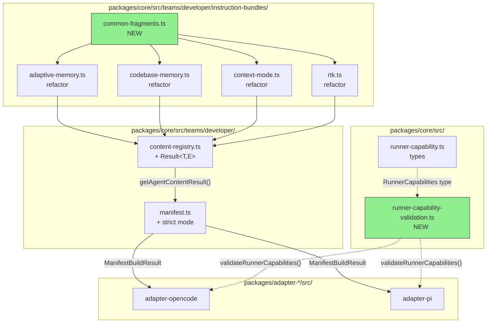

# Design: Mejoras de Arquitectura del Developer Team v2

## Source

- **Proposal**: `developer-team-architecture-v2` proposal artifact
- **Capabilities affected**:
  - New: `validate-runner-capabilities`, `manifest-validation`, `content-registry-fallback`, `instruction-bundle-fragments`
  - Modified: `build-developer-team-manifest`, `get-agent-content`, `instruction-bundle-builders`
  - Unchanged: `runner-capability-types`, `catalog`, `adapter-serialization`
- **Spec status**: Not yet available (runs in parallel)

---

## Current Architecture Context

The Developer Team content pipeline follows a layered architecture:

```
packages/core/src/teams/developer/
├── catalog.ts                    # 12 agent definitions (id, name, skillId)
├── content-registry.ts           # REAL_CONTENT map: agentId → {agentBody, skillBody}
│   └── getAgentContent()         # Returns AgentContent | undefined
├── manifest.ts                   # buildDeveloperTeamManifest() → DeveloperTeamManifest
│   └── Iterates catalog, calls getAgentContent, assembles manifest
├── *-content.ts                  # Prompt strings for each agent
└── instruction-bundles/          # Package instruction builders
    ├── index.ts                  # Bundle registry + composeCapabilityInstructions
    ├── adaptive-memory.ts        # 182 lines, 3 surfaces (agent/skill/session)
    ├── codebase-memory.ts        # 110 lines, 2 surfaces (agent/skill)
    ├── context-mode.ts           # 125 lines, 2 surfaces (agent/skill)
    └── rtk.ts                    # 74 lines, 2 surfaces (agent/skill)

packages/core/src/runner-capability.ts   # RunnerCapabilities port (526 lines, no validation)
packages/adapter-opencode/src/           # OpenCode adapter (consumes core)
packages/adapter-pi/src/                 # PI adapter (consumes core)
```

**Key observations from codebase exploration:**

1. **Instruction bundles** duplicate 60-70% of markdown within each file across `surface` variants. For example, `adaptive-memory.ts` repeats Container Tag Conventions, When to Save, Save Format, Authority Rule, and Provider sections across agent/skill/session surfaces with only minor wording differences.

2. **`RunnerCapabilities`** is a large aggregate type with 10+ facets (`tools`, `teams`, `models`, `memory`, `install`, `developerTeam`, `modelConfig`, etc.). There is zero runtime validation that an adapter implements required facets before being consumed by the TUI.

3. **`buildDeveloperTeamManifest`** silently falls back to placeholder bodies when `getAgentContent` returns undefined. It does not validate that model assignments reference real catalog agents, nor does it detect when both `memoryBundle` and `capabilityInstructions` inject into the same surface.

4. **`getAgentContent`** returns `undefined` for unknown agent IDs. Callers (both adapters, manifest builder, verify functions) receive no error context, no suggestions, and no fallback content.

5. **No `Result<T, E>` pattern** exists in the codebase. The closest patterns are `{ valid: boolean; issues: string[] }` (from `adaptive-memory-governance.ts`) and `{ success: boolean; ... }` (from runner-capability result types).

---

## Proposed Architecture

The four in-scope problems are addressed as **independent, incremental changes** that do not depend on each other. Each change is confined to a specific module boundary to minimize blast radius.

### Component / Module Boundaries

| Component | Responsibility | Change Type |
|---|---|---|
| `instruction-bundles/common-fragments.ts` | Reusable markdown fragments per package and surface | **New** |
| `instruction-bundles/adaptive-memory.ts` | Refactored to consume common fragments + surface deltas | **Modify** |
| `instruction-bundles/codebase-memory.ts` | Refactored to consume common fragments + surface deltas | **Modify** |
| `instruction-bundles/context-mode.ts` | Refactored to consume common fragments + surface deltas | **Modify** |
| `instruction-bundles/rtk.ts` | Refactored to consume common fragments + surface deltas | **Modify** |
| `instruction-bundles/index.ts` | Unchanged interface; no breaking changes to exports | **Unchanged** |
| `runner-capability-validation.ts` | `validateRunnerCapabilities()` + `REQUIRED_CAPABILITIES` | **New** |
| `runner-capability.ts` | Add `ValidationResult` type; keep all existing types | **Modify** |
| `content-registry.ts` | `Result<T,E>` + `AgentContentError`; `getAgentContentResult()` | **Modify** |
| `manifest.ts` | `strict` mode; `ManifestBuildResult` return type | **Modify** |
| `manifest.test.ts` | Update for new return type; add strict-mode tests | **Modify** |
| `content-registry.test.ts` | Update for Result type; add fallback/suggestion tests | **Modify** |
| `adapter-opencode/runner-capabilities.ts` | Adapt to `ManifestBuildResult` and `getAgentContentResult` | **Modify** |
| `adapter-pi/runner-capabilities.ts` | Adapt to `ManifestBuildResult` and `getAgentContentResult` | **Modify** |

### Data Flow

```
┌─────────────────────────────────────────────────────────────────────────────┐
│                          INSTRUCTION BUNDLES (#1)                           │
│  common-fragments.ts ──► adaptive-memory.ts                                 │
│                    ├────► codebase-memory.ts                                │
│                    ├────► context-mode.ts                                   │
│                    └────► rtk.ts                                            │
│                                                                             │
│  Each builder: buildBaseFragment(packageId, surface) + surfaceDelta()       │
└─────────────────────────────────────────────────────────────────────────────┘
                                      │
                                      ▼
┌─────────────────────────────────────────────────────────────────────────────┐
│                         CONTENT REGISTRY (#9)                               │
│  getAgentContentResult(agentId, opts) → Result<AgentContent, AgentContentError>│
│  ├─ ok: value = {agentBody, skillBody}                                      │
│  └─ err: error = {agentId, suggestions[], fallbackAvailable}                │
│                                                                             │
│  Legacy: getAgentContent() → AgentContent | undefined (deprecated wrapper)  │
└─────────────────────────────────────────────────────────────────────────────┘
                                      │
                                      ▼
┌─────────────────────────────────────────────────────────────────────────────┐
│                         MANIFEST BUILDER (#7)                               │
│  buildDeveloperTeamManifest(opts) → ManifestBuildResult                     │
│  ├─ manifest: DeveloperTeamManifest                                         │
│  ├─ warnings: string[]                                                      │
│  └─ errors: string[]                                                        │
│                                                                             │
│  If strict=true: errors.push(...) for placeholders, bad model assignments   │
│  Legacy wrapper: buildDeveloperTeamManifestLegacy() (deprecated)            │
└─────────────────────────────────────────────────────────────────────────────┘
                                      │
                                      ▼
┌─────────────────────────────────────────────────────────────────────────────┐
│                      RUNNER CAPABILITY VALIDATION (#2)                      │
│  validateRunnerCapabilities(capabilities) → ValidationResult                │
│  ├─ isValid: boolean                                                        │
│  ├─ missing: string[]     (required facets not present)                     │
│  └─ warnings: string[]    (optional facets missing, type mismatches)        │
└─────────────────────────────────────────────────────────────────────────────┘
```

### API / Contract Implications

| Endpoint / Interface | Change | Backward Compatible |
|---|---|---|
| `getAgentContent(agentId, opts?)` | **Deprecated** — wrapper around new `getAgentContentResult` | Yes (same signature, same return type) |
| `getAgentContentResult(agentId, opts?)` | **New** — returns `Result<AgentContent, AgentContentError>` | N/A (new function) |
| `buildDeveloperTeamManifest(opts)` | **Breaking** — now returns `ManifestBuildResult` instead of `DeveloperTeamManifest` | No (return type changed) |
| `buildDeveloperTeamManifestLegacy(opts)` | **New deprecated wrapper** — returns `DeveloperTeamManifest` | Yes (preserves old signature) |
| `validateRunnerCapabilities(capabilities)` | **New** — pure validation function, no state mutation | N/A (new function) |
| `buildBaseFragment(packageId, surface)` | **New** — returns `string` (markdown) | N/A (new function) |

### State / Persistence Implications

None. All changes are in-memory, pure functions. No file format changes, no schema migrations, no persistent state modifications.

### Migration / Backward Compatibility

1. **`getAgentContent`**: Maintain the existing function as a **deprecated wrapper** that calls `getAgentContentResult` and unwraps to `AgentContent | undefined`. Adapters and manifest builder can migrate incrementally.

2. **`buildDeveloperTeamManifest`**: Provide `buildDeveloperTeamManifestLegacy` as a deprecated wrapper that extracts `.manifest` from the new `ManifestBuildResult`. Both adapters (OpenCode, PI) must be updated in this SDD because they call this function directly in their `runner-capabilities.ts`.

3. **`strict` mode**: Default is `false`. Callers must opt-in. No existing code paths are affected unless they explicitly pass `strict: true`.

4. **`fallback` option**: Default is `false` in `ContentRegistryOptions`. Unknown agents still return `Result.error` unless caller explicitly requests fallback.

---

## File Impact Estimate

| File / Path | Action | Rationale |
|---|---|---|
| `packages/core/src/teams/developer/instruction-bundles/common-fragments.ts` | **Create** | Shared markdown fragments for all 4 packages |
| `packages/core/src/teams/developer/instruction-bundles/adaptive-memory.ts` | **Modify** | Refactor to consume common fragments (~60% line reduction target) |
| `packages/core/src/teams/developer/instruction-bundles/codebase-memory.ts` | **Modify** | Refactor to consume common fragments |
| `packages/core/src/teams/developer/instruction-bundles/context-mode.ts` | **Modify** | Refactor to consume common fragments |
| `packages/core/src/teams/developer/instruction-bundles/rtk.ts` | **Modify** | Refactor to consume common fragments |
| `packages/core/src/runner-capability-validation.ts` | **Create** | `validateRunnerCapabilities()` + `REQUIRED_CAPABILITIES` + `ValidationResult` |
| `packages/core/src/runner-capability.ts` | **Modify** | Re-export `ValidationResult` type; add to barrel if applicable |
| `packages/core/src/teams/developer/content-registry.ts` | **Modify** | Add `Result<T,E>` type, `AgentContentError`, `getAgentContentResult()`, legacy wrapper |
| `packages/core/src/teams/developer/manifest.ts` | **Modify** | `BuildManifestOptions.strict`, `ManifestBuildResult`, validation logic, legacy wrapper |
| `packages/core/src/teams/developer/content-registry.test.ts` | **Modify** | Tests for `Result` type, suggestions, fallback, legacy wrapper parity |
| `packages/core/src/teams/developer/manifest.test.ts` | **Modify** | Tests for strict mode, warnings/errors, legacy wrapper parity |
| `packages/core/src/teams/developer/instruction-bundles/index.test.ts` | **Modify** | Snapshot/parity tests for refactored builders |
| `packages/adapter-opencode/src/runner-capabilities.ts` | **Modify** | Adapt `buildDeveloperTeamManifest` call to new return type |
| `packages/adapter-pi/src/runner-capabilities.ts` | **Modify** | Adapt `buildDeveloperTeamManifest` call to new return type |
| `packages/core/src/index.ts` (or barrel) | **Modify** | Export new public APIs if not already re-exported |

---

## Testing Strategy

| Layer | Test Type | What to Verify |
|---|---|---|
| **Instruction bundles** | Unit + Snapshot | Each builder output byte-a-byte identical before/after refactor. Use snapshot tests on generated markdown for all surfaces. |
| **Common fragments** | Unit | `buildBaseFragment` returns expected sections for each `(packageId, surface)` combination. |
| **RunnerCapabilities validation** | Unit | `validateRunnerCapabilities` detects missing facets on partial objects. Tests for OpenCode and PI adapter capability objects. |
| **Content registry** | Unit | `getAgentContentResult` returns `ok` for known agents, `err` with suggestions for typos. `fallback: true` returns generic content. Legacy wrapper parity. |
| **Manifest builder** | Unit | `strict: true` produces errors for placeholders. `strict: false` preserves current behavior. Warnings for model assignment mismatches. Legacy wrapper parity. |
| **Integration** | E2E install plan | Run full install plan on both adapters (OpenCode + PI) and verify output files are byte-a-byte identical to baseline. |

---

## Observability / Error Handling

- **`validateRunnerCapabilities`**: Returns structured `ValidationResult` (never throws). Callers decide whether to log warnings or hard-fail.
- **`getAgentContentResult`**: Returns `Result` type (never throws for "not found"). Error includes `suggestions` for typo recovery and `fallbackAvailable` flag.
- **`buildDeveloperTeamManifest`**: In `strict` mode, returns `errors` array rather than throwing. Callers (adapters, TUI) can surface diagnostics to the user.
- **Legacy wrappers**: Log a one-time deprecation warning (via `console.warn` or similar) when called, indicating the new API name.

---

## Security / Performance / Accessibility Considerations

**None specific to this change.**

- No new network calls, no filesystem access, no user input parsing beyond existing agentId strings.
- `Result<T,E>` is a lightweight discriminated union with zero runtime overhead beyond the object wrapper.
- Validation functions are pure and run in microseconds.

---

## Tradeoffs

| Decision | Chosen | Rejected Alternative | Rationale |
|---|---|---|---|
| **Result type implementation** | Custom lightweight `Result<T,E>` with `{ok, value}` / `{ok, error}` | Use existing `{valid, issues}` pattern from adaptive-memory-governance | The governance pattern is domain-specific (valid/issues). `Result<T,E>` is a generic, language-idiomatic pattern that better signals success/failure branches and is standard in TypeScript ecosystems. |
| **Manifest return type** | New `ManifestBuildResult` wrapping manifest + diagnostics | Add optional `warnings?`/`errors?` fields directly to `DeveloperTeamManifest` | Manifest is a data type consumed by adapters and potentially serialized. Contaminating it with build-time diagnostics violates separation of concerns. |
| **Common fragments granularity** | Per-package `buildBaseFragment(packageId, surface)` function | Ultra-granular helpers (`buildContainerTagTable()`, `buildToolListSection()`) | Per-package function captures the actual duplication pattern (same content, 2-3 surfaces). Too granular creates indirection without proportional DRY benefit. |
| **Breaking change mitigation** | Deprecate old functions with wrappers | Single-step migration of all callers | Two adapters + tests + potential external callers make single-step migration high-risk. Gradual migration via deprecated wrappers is safer. |
| **Strict mode default** | `strict: false` (opt-in) | `strict: true` by default | Current pipeline has placeholders as intentional defensive fallback. Enabling strict by default would break existing flows until all agents have real content. |
| **Fallback content strategy** | Generic "unknown-agent" placeholder with `fallback: true` opt-in | Always return generic content for unknown agents | Silent fallback hides configuration errors. Explicit opt-in preserves the current "fail visible" behavior while enabling graceful degradation when requested. |
| **Validation library** | Manual TypeScript validation | zod, io-ts, or similar | Project uses TypeScript pure with zero runtime validation dependencies. Adding a library for one function is overkill and increases bundle size. |

---

## Risks

| Risk | Likelihood | Impact | Mitigation |
|---|---|---|---|
| **Refactored instruction bundles produce different markdown** | Medium | High | Snapshot tests for every builder surface before/after. Diff tool in CI compares generated markdown byte-a-byte. |
| **`buildDeveloperTeamManifest` signature change breaks adapters** | High | High | Update both adapters (OpenCode, PI) in the same SDD. Provide `buildDeveloperTeamManifestLegacy` deprecated wrapper as safety net. Run full install plan E2E test before merge. |
| **`getAgentContent` legacy wrapper masks errors silently** | Medium | Medium | Document deprecation in code comments. Log `console.warn` on legacy wrapper usage. Schedule removal in next release. |
| **Strict mode validation rules are incomplete** | Medium | Medium | Start with 3 rules (placeholders, model assignments, memory/capability conflict). Add more rules in follow-up SDDs. `strict` is opt-in so incomplete rules do not affect production. |
| **Suggestions algorithm for unknown agents is poor UX** | Low | Medium | Use prefix matching + Levenshtein distance on agentId strings. Cap suggestions at 3. Test with common typos ("orchestractor", "deverloper", etc.). |
| **Common fragments introduce coupling between packages** | Medium | Medium | Each fragment is pure (no state, no imports from other packages). If one package needs a unique variant, it bypasses the common fragment for that section. |

---

## Open Decisions

1. **Result type location**: Should `Result<T,E>` live in `content-registry.ts` (local) or be promoted to a shared utility (e.g., `packages/core/src/result.ts`) for project-wide use?
   - *Recommendation*: Start local in `content-registry.ts`. Promote to shared utility only if a second module needs it (YAGNI).

2. **Deprecation mechanism**: Should legacy wrappers emit `console.warn` at runtime, or rely solely on JSDoc `@deprecated`?
   - *Recommendation*: JSDoc `@deprecated` + optional `console.warn` in development builds only. Avoid noise in production.

3. **Suggestion algorithm for #9**: Exact distance threshold and ranking for agentId suggestions.
   - *Recommendation*: Levenshtein distance ≤ 3 OR prefix match. Rank exact prefix matches first, then distance. Cap at 3 suggestions.

4. **Fallback generic content for #9**: What should the generic "unknown-agent" content contain?
   - *Recommendation*: A minimal placeholder with a header and a notice that the agent is not recognized, plus a list of available agents from the catalog.

---

## Dependencies

- **No external dependencies** — all changes use TypeScript built-in types.
- **Internal dependency**: Adapters (`adapter-opencode`, `adapter-pi`) must be updated in the same PR to consume the new manifest return type.
- **Test dependency**: Existing snapshot tests (if any) for instruction bundles may need baseline updates.

---

## Next Steps

Ready for Task (`deck-developer-task`) to break this design into implementation tasks, combined with Spec.

---

## Mermaid Summary Source


