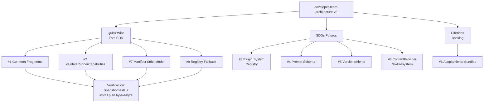

# Proposal: Mejoras de Arquitectura del Developer Team v2

## Intent

El Developer Team acumula deuda técnica estructural en 9 áreas identificadas: duplicación de contenido en instruction bundles, falta de validación de contratos (`RunnerCapabilities`, `manifest`), centralización excesiva (`content-registry` como god object), prompts sin estructura ni versionamiento, acoplamiento implícito, y arquitectura acoplada al filesystem. Este cambio aborda los problemas de mayor impacto con soluciones incrementales, diferir los que requieren diseño profundo a SDDs futuros.

## Goal

Reducir la deuda técnica del Developer Team en las áreas de validación de contratos, DRY en instruction bundles, y robustez del content registry, dejando la arquitectura lista para soportar runners no-filesystem en un SDD posterior.

## Scope

### In Scope (este SDD)

| # | Problema | Entregable |
|---|----------|-----------|
| 1 | **Duplicación en instruction bundles** | `common-fragments.ts` con contenido base reutilizable por surface; refactor de `adaptive-memory.ts`, `codebase-memory.ts`, `context-mode.ts`, `rtk.ts` para consumir fragments |
| 2 | **Sin validación en RunnerCapabilities** | `validateRunnerCapabilities(capabilities): ValidationResult` + `REQUIRED_CAPABILITIES` constant; tests de contrato |
| 7 | **Manifest no valida contenido** | `buildDeveloperTeamManifest` con modo `strict?: boolean`; validación de placeholders, model assignments, y conflictos memoryBundle vs capabilityInstructions; retorno de `warnings`/`errors` |
| 9 | **Sin estrategia de fallback en content-registry** | `getAgentContent` retorna `Result<AgentContent, AgentContentError>` con suggestions de agentes similares; fallback a contenido genérico para unknown agents |

### Out of Scope (diferidos a SDDs futuros)

| # | Problema | Razón de diferimiento |
|---|----------|----------------------|
| 3 | **Content-registry es god object** | Requiere diseño de plugin system y factory pattern; alto riesgo de breaking change; SDD dedicado |
| 4 | **Prompts sin estructura** | Requiere diseño de DSL o schema para prompts; depende de #3 (split del registry); SDD dedicado |
| 5 | **Sin versionamiento de contenidos** | Depende de #4 (estructura primero); luego versionar exports; SDD dedicado |
| 6 | **Acoplamiento implícito en bundles** | Baja prioridad; `PACKAGE_ORDER` y semántica de `agentIds` son mejoras de UX no críticas; backlog |
| 8 | **No contempla runners no-filesystem** | Alta prioridad pero difícil; requiere diseño de `ContentProvider` interface y refactor de todos los adapters; SDD de arquitectura futura |

## Affected Capabilities

### New Capabilities
- `validate-runner-capabilities`: Función de validación de contratos en runtime
- `manifest-validation`: Modo estricto de build con diagnósticos
- `content-registry-fallback`: Estrategia de fallback y suggestions en registry
- `instruction-bundle-fragments`: Sistema de fragments reutilizables por surface

### Modified Capabilities
- `build-developer-team-manifest`: Ahora retorna warnings/errors; soporta `strict` mode
- `get-agent-content`: Cambio de firma a `Result<T, E>` en lugar de `T | undefined`
- `instruction-bundle-builders`: Refactor para usar `common-fragments.ts`

### Unchanged Capabilities
- `runner-capability-types`: Las interfaces no cambian; solo se agrega validación
- `catalog`: El catálogo de agentes permanece igual
- `adapter-serialization`: Los adapters OpenCode y PI no requieren cambios en este SDD

## Approach

### Fase A — Quick Wins (este SDD)

**1. Common Fragments para Instruction Bundles**
- Crear `packages/core/src/teams/developer/instruction-bundles/common-fragments.ts`
- Exportar funciones `buildBaseFragment(packageId, surface)` que retornen markdown base compartido
- Cada builder (`adaptive-memory.ts`, etc.) consume el fragment base + añade variantes específicas
- Reducir ~60% de duplicación en los 4 archivos de bundles

**2. Validación de RunnerCapabilities**
- Agregar `validateRunnerCapabilities()` en `packages/core/src/runner-capability.ts` o módulo adjunto
- `REQUIRED_CAPABILITIES` define el subset mínimo obligatorio
- `ValidationResult` con `isValid`, `missing: string[]`, `warnings: string[]`
- Tests unitarios que validen los adapters existentes (OpenCode, PI)

**7. Validación Strict en Manifest**
- Extender `BuildManifestOptions` con `strict?: boolean`
- Si `strict === true`, fallar si `getAgentContent` retorna placeholder
- Validar que cada `modelAssignment` referencie un `agentId` del catálogo
- Detectar conflictos entre `memoryBundle` y `capabilityInstructions` (ambos inyectan al mismo surface)
- Retornar `warnings` y `errors` en el manifest resultante

**9. Fallback en Content Registry**
- Introducir tipo `Result<T, E>` (o usar patrón existente del proyecto)
- `getAgentContent` retorna `Result<AgentContent, AgentContentError>`
- `AgentContentError` incluye: `agentId`, `suggestions: string[]` (fuzzy match), `fallbackAvailable: boolean`
- `getAgentContent(agentId, { fallback: true })` retorna contenido genérico para unknown agents

### Fase B — SDDs Futuros

**3. Refactor Content Registry a Plugin System**
- Diseñar `AgentContentPlugin` interface
- Cada agente auto-registra su contenido vía plugin
- `createRegistry(plugins[])` reemplaza `REAL_CONTENT` estático

**4+5. Schema + Versionamiento de Prompts**
- Diseñar schema para prompts (secciones requeridas: Purpose, Instructions, Constraints)
- Versionar exports: `{ current, v1, v2 }`
- Integrar con git para diff entre versiones

**8. ContentProvider para Runners No-Filesystem**
- Diseñar `ContentProvider` interface (`Filesystem`, `Http`, `Memory`)
- Refactorizar `manifest.ts` y adapters para usar provider en vez de `projectRoot`

## Alternatives and Tradeoffs

| Alternative | Why Considered | Why Not Chosen |
|---|---|---|
| **Abordar los 9 problemas en un solo SDD** | User mencionó todos | Demasiado grande, alto riesgo, difícil de review y rollback; mejor incremental |
| **Incluir #3 (god object) en este SDD** | Media prioridad | Requiere diseño de plugin system que afecta 12+ archivos; mejor SDD dedicado con spec propia |
| **Incluir #8 (no-filesystem) en este SDD** | Alta prioridad | Es un cambio arquitectónico profundo que afecta `runner-capability.ts`, todos los adapters, y el TUI; requiere diseño cuidadoso separado |
| **Usar biblioteca de validación externa (zod, io-ts)** | Para validación de RunnerCapabilities | Agrega dependencia; el proyecto usa TypeScript puro; validación manual es suficiente y más ligera |

## Risks

| Risk | Likelihood | Impact | Mitigation |
|---|---|---|---|
| **Breaking change en `getAgentContent` firma** | High | High | Mantener wrapper con firma antigua deprecada por 1 release; migrar callers internos antes de merge |
| **Fragments comunes introducen acoplamiento inesperado** | Medium | Medium | Cada fragment debe ser puro (sin estado); tests unitarios por builder; diff visual de outputs antes/después |
| **Validación strict rompe flujo existente** | Medium | High | `strict` es opt-in por ahora; default `false`; solo habilitar en CI después de estabilización |
| **Refactor de 4 instruction bundles introduce regresiones** | Medium | Medium | Snapshot tests de markdown generado por cada builder; comparar byte-a-byte antes/después |
| **Tiempo estimado se extiende** | Medium | Low | Scope acotado a 4 problemas; si se atrasa, descopear #9 y dejarlo para siguiente iteración |

## Rollback Plan

1. **Por problema individual:** Cada problema se implementa en commits separados (1: fragments, 2: validation, 7: manifest strict, 9: fallback)
2. **Revert por commit:** Si un problema introduce regresión, revertir solo ese commit
3. **Feature flags:**
   - `strict` mode en manifest es opt-in (`strict: false` por defecto)
   - Fallback en content registry usa opción `{ fallback?: boolean }`
   - Validación de RunnerCapabilities es función pura, no muta estado
4. **Preservar compatibilidad:** Mantener firma antigua de `getAgentContent` como wrapper deprecado durante 1 release
5. **Tests de regresión:** Antes de merge, ejecutar install plan completo en ambos adapters (OpenCode + PI) y verificar outputs byte-a-byte vs baseline

## Dependencies

- **Exploración previa:** Documento `docs/architecture/developer-team-analysis.md` ya existe y documenta los 9 problemas
- **Tests existentes:** Necesitamos verificar que hay tests para `buildDeveloperTeamManifest` y adapters antes de modificar
- **No hay dependencias de otros SDDs:** Este SDD es independiente; los SDDs futuros (#3, #4, #5, #8) dependen de este

## Open Questions

1. **¿Cuál es la estrategia de versionado del proyecto?** ¿SemVer? ¿CalVer? Esto afecta cómo deprecamos la firma antigua de `getAgentContent`.
2. **¿Existe un patrón `Result<T, E>` ya en el codebase?** Si no, ¿preferimos crear uno propio o usar un patrón de error throwing?
3. **¿El modo `strict` del manifest debe ser habilitado por defecto en CI?** ¿O es solo para desarrollo local por ahora?
4. **¿Hay algún runner adicional en roadmap (más allá de OpenCode y PI)?** Esto afecta la priorización de #8 (runners no-filesystem).
5. **¿Cuál es el criterio de aceptación para "similar suggestions" en fallback?** ¿Levenshtein distance? ¿Prefix matching?

## Acceptance Direction

- [ ] `adaptive-memory.ts`, `codebase-memory.ts`, `context-mode.ts`, `rtk.ts` usan `common-fragments.ts` y pasan snapshot tests byte-a-byte
- [ ] `validateRunnerCapabilities()` detecta capacidades faltantes en adapters OpenCode y PI
- [ ] `buildDeveloperTeamManifest({ strict: true })` falla con error claro si hay placeholders
- [ ] `getAgentContent("typo-agent")` retorna `Result` con suggestions del agente correcto
- [ ] Install plan completo genera mismos archivos que antes del cambio (regresión cero en outputs)
- [ ] Todos los tests existentes pasan sin modificaciones (excepto actualizaciones esperadas por firma nueva)

## Next Steps

Ready for Spec (`deck-developer-spec`) and Design (`deck-developer-design`) in parallel.

## Mermaid Summary Source

