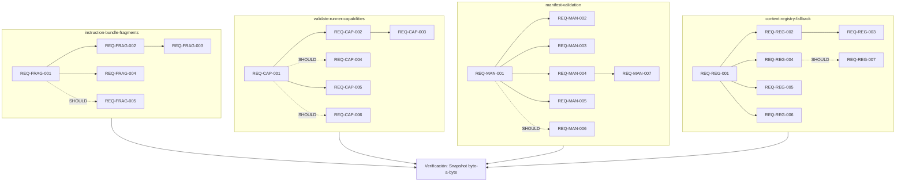

# Spec: Mejoras de Arquitectura del Developer Team v2

## Source

- Proposal: `developer-team-architecture-v2` proposal artifact
- Capabilities affected: `instruction-bundle-fragments`, `validate-runner-capabilities`, `manifest-validation`, `content-registry-fallback`
- Análisis: `docs/architecture/developer-team-analysis.md`

---

## Requirements

### Capability: instruction-bundle-fragments

**REQ-FRAG-001**: El sistema DEBE proveer un módulo `common-fragments` que contenga funciones generadoras de contenido markdown base reutilizable por surface (`agent`, `skill`, `session`), parametrizadas por `packageId` y `surface`.

- **Priority**: MUST
- **Surface**: General
- **Rationale**: Los 4 builders de instruction bundles (`adaptive-memory`, `codebase-memory`, `context-mode`, `rtk`) duplican contenido markdown compartido. Un módulo centralizado elimina inconsistencias y reduce el costo de mantenimiento.

**REQ-FRAG-002**: Cada builder existente DEBE consumir fragments del módulo `common-fragments` para las secciones de contenido compartido, en lugar de definir inline el markdown duplicado.

- **Priority**: MUST
- **Surface**: General
- **Rationale**: Si los builders no consumen los fragments comunes, la duplicación persiste y el módulo es inútil.

**REQ-FRAG-003**: El output markdown de cada builder existente DEBE ser idéntico byte-a-byte al output anterior al refactor cuando se construye un bundle con los mismos parámetros.

- **Priority**: MUST
- **Surface**: General
- **Rationale**: Cualquier cambio en el contenido visible por los agentes es un cambio de comportamiento. El refactor debe ser transparente para consumidores.

**REQ-FRAG-004**: Los fragments comunes DEBEN ser funciones puras (sin estado, sin side effects, deterministas dada la misma entrada).

- **Priority**: MUST
- **Surface**: General
- **Rationale**: Garantiza previsibilidad y testeabilidad. Elimina riesgo de acoplamiento inesperado entre builders.

**REQ-FRAG-005**: El sistema DEBERÍA reducir la duplicación de líneas en al menos un 40% medido entre los 4 archivos de instruction bundles.

- **Priority**: SHOULD
- **Surface**: General
- **Rationale**: El proposal estima ~60% de reducción. Un mínimo de 40% justifica el costo del refactor.

---

### Capability: validate-runner-capabilities

**REQ-CAP-001**: El sistema DEBE proveer una función `validateRunnerCapabilities` que acepte un objeto `RunnerCapabilities` y retorne un `ValidationResult` con los campos: `isValid: boolean`, `missing: string[]`, `warnings: string[]`.

- **Priority**: MUST
- **Surface**: API
- **Rationale**: Hoy no existe mecanismo para verificar que un adapter implementa el contrato completo. Errores se manifiestan en runtime sin diagnóstico previo.

**REQ-CAP-002**: El sistema DEBE definir una constante `REQUIRED_CAPABILITIES` que liste las capacidades obligatorias de `RunnerCapabilities` (como mínimo: `id`, `displayName`, `environments`, `inspectEnvironment`, `tools`, `teams`, `models`, `memory`).

- **Priority**: MUST
- **Surface**: Data
- **Rationale**: Define el contrato mínimo que todo runner debe satisfacer. Permite que capacidades opcionales (`install`, `developerTeam`, `modelConfig`, `capabilities`) sean marcadas como warnings en lugar de errores.

**REQ-CAP-003**: `validateRunnerCapabilities` DEBE retornar `isValid: false` cuando al menos una capacidad obligatoria de `REQUIRED_CAPABILITIES` está ausente o es `undefined`.

- **Priority**: MUST
- **Surface**: API
- **Rationale**: El propósito de la validación es detectar contratos incompletos. Una capacidad obligatoria faltante es un error, no un warning.

**REQ-CAP-004**: `validateRunnerCapabilities` DEBE retornar un `warnings` no vacío cuando una capacidad opcional conocida (ej: `developerTeam`, `install`, `modelConfig`) está ausente o es `undefined`.

- **Priority**: SHOULD
- **Surface**: API
- **Rationale**: Las capacidades opcionales son legítimas de omitir, pero el caller necesita saber qué funcionalidad no estará disponible.

**REQ-CAP-005**: `validateRunnerCapabilities` DEBE ser una función pura que no mute el objeto `RunnerCapabilities` recibido.

- **Priority**: MUST
- **Surface**: API
- **Rationale**: Garantiza que la validación sea segura de ejecutar en cualquier momento sin side effects.

**REQ-CAP-006**: El sistema DEBERÍA pasar `validateRunnerCapabilities` contra los adapters existentes (OpenCode y PI) como tests de contrato y todos deben retornar `isValid: true`.

- **Priority**: SHOULD
- **Surface**: General
- **Rationale**: Confirma que los adapters actuales cumplen el contrato. Si un adapter no pasa, es un bug existente que debe abordarse.

---

### Capability: manifest-validation

**REQ-MAN-001**: `BuildManifestOptions` DEBE aceptar una propiedad opcional `strict: boolean`. Cuando `strict` es `true`, el builder DEBE ejecutar validaciones adicionales sobre el manifest generado.

- **Priority**: MUST
- **Surface**: API
- **Rationale:`strict` opt-in permite adoptar la validación gradualmente sin romper flujos existentes.

**REQ-MAN-002**: Cuando `strict === true` y un agente del catálogo no tiene contenido real (i.e., se usa placeholder), el builder DEBE incluir un error en los diagnósticos del manifest.

- **Priority**: MUST
- **Surface**: API
- **Rationale**: Placeholders silenciosos son la fuente del problema actual: agentes sin contenido real se instalan sin detección.

**REQ-MAN-003**: Cuando `strict === true` y un `modelAssignment` referencia un `agentId` que no existe en el catálogo, el builder DEBE incluir un error en los diagnósticos.

- **Priority**: MUST
- **Surface**: Data
- **Rationale`: Evita asignaciones de modelo a agentes inexistentes.

**REQ-MAN-004`: El manifest resultante DEBE incluir campos `warnings: string[]` y `errors: string[]` (vacíos cuando no hay issues).

- **Priority**: MUST
- **Surface**: API
- **Rationale**: Los diagnósticos deben ser accesibles programáticamente, no solo vía console/log.

**REQ-MAN-005**: Cuando `strict` es `false` o ausente (default), el builder DEBE comportarse de forma idéntica al comportamiento actual: usar placeholders sin emitir errores.

- **Priority**: MUST
- **Surface**: API
- **Rationale**: Backward compatibility. El modo strict es opt-in.

**REQ-MAN-006**: El builder DEBERÍA detectar conflictos entre `memoryBundle` y `capabilityInstructions` cuando ambos inyectan contenido al mismo surface para el mismo agente.

- **Priority**: SHOULD
- **Surface**: Data
- **Rationale**: Ambos sistemas inyectan instrucciones en agent/skill bodies. Si ambos están activos para el mismo surface, hay riesgo de instrucciones contradictorias o duplicadas.

**REQ-MAN-007**: Los warnings y errors DEBEN incluir el `agentId` o `skillId` afectado para facilitar el diagnóstico.

- **Priority**: MUST
- **Surface**: API
- **Rationale**: Un warning sin contexto del agente afectado es inútil para debugging.

---

### Capability: content-registry-fallback

**REQ-REG-001**: `getAgentContent` DEBE retornar un tipo `Result<AgentContent, AgentContentError>` donde `Result` discrimina entre éxito (`ok: true`, `value: AgentContent`) y error (`ok: false`, `error: AgentContentError`).

- **Priority**: MUST
- **Surface**: API
- **Rationale**: El retorno `AgentContent | undefined` no provee contexto sobre por qué no se encontró contenido ni sugerencias de alternativas.

**REQ-REG-002**: `AgentContentError` DEBE incluir los campos: `agentId: string`, `message: string`, `suggestions: string[]`, `fallbackAvailable: boolean`.

- **Priority**: MUST
- **Surface**: Data
- **Rationale**: El consumidor necesita saber qué agente solicitó, por qué falló, qué agentes similares existen, y si hay fallback disponible.

**REQ-REG-003**: `getAgentContent` DEBE calcular `suggestions` como los `agentId` del catálogo más similares al `agentId` solicitado, usando un algoritmo de matching (definido en open question OQ-5).

- **Priority**: MUST
- **Surface**: General
- **Rationale**: Errores de tipeo en agentId son el caso más común. Las suggestions deben ayudar al usuario a corregir.

**REQ-REG-004**: `getAgentContent` DEBE aceptar una opción `{ fallback: boolean }`. Cuando `fallback === true` y el `agentId` no se encuentra en el contenido real, DEBE retornar contenido genérico (wrapper de éxito con contenido de fallback) en lugar de un error.

- **Priority**: MUST
- **Surface**: API
- **Rationale**: Permite que callers que prefieren contenido genérico sobre error puedan optar por fallback.

**REQ-REG-005**: Cuando `agentId` existe en el catálogo pero no en el contenido real, `fallbackAvailable` DEBE ser `true` en el error. Cuando `agentId` no existe en el catálogo, `fallbackAvailable` DEBE ser `false`.

- **Priority**: MUST
- **Surface**: Data
- **Rationale**: Distinguir entre "existe pero sin contenido" (fallback posible) y "no existe" (typo o ID inválido).

**REQ-REG-006**: El sistema DEBE mantener compatibilidad backward proporcionando un wrapper con la firma anterior `getAgentContent(agentId, options?): AgentContent | undefined` marcado como `@deprecated` durante al menos 1 release.

- **Priority**: MUST
- **Surface**: API
- **Rationale**: Hay 11 callers internos de `getAgentContent`. Un cambio de firma sin deprecation path causaría breaking change masivo.

**REQ-REG-007**: El contenido de fallback para un agente desconocido DEBERÍA ser un prompt genérico que identifique al agente por `agentId` y su `displayName` del catálogo, pero sin instrucciones específicas del rol.

- **Priority**: SHOULD
- **Surface**: Data
- **Rationale**: Un fallback útil es mejor que un error vacío. El contenido genérico debe indicar claramente que no es el contenido canónico.

---

## Acceptance Scenarios

### Capability: instruction-bundle-fragments

#### Scenario: Builder consume fragments comunes y produce output idéntico

**Given** un builder de instruction bundle (ej: `buildAdaptiveMemoryInstructionBundle`) que ha sido refactorizado para consumir `common-fragments`
**When** se invoca el builder y se genera el bundle completo
**Then** el markdown resultante es idéntico byte-a-byte al output del builder antes del refactor
> Covers: REQ-FRAG-002, REQ-FRAG-003

#### Scenario: Fragment común es función pura

**Given** la función generadora de fragment común (ej: `buildBaseFragment(packageId, surface)`)
**When** se invoca múltiples veces con los mismos argumentos
**Then** retorna exactamente el mismo valor cada vez
**And** no modifica ningún estado externo observable
> Covers: REQ-FRAG-004

#### Scenario: Reducción de duplicación medible

**Given** los 4 archivos de instruction bundles actuales
**When** se mide el total de líneas duplicadas entre ellos (antes del refactor)
**And** se mide el total de líneas duplicadas después de consumir `common-fragments`
**Then** la reducción de duplicación es al menos 40%
> Covers: REQ-FRAG-005

#### Scenario: Nuevo package consume fragments comunes

**Given** el módulo `common-fragments` con funciones generadoras por surface
**When** se crea un nuevo instruction bundle que usa los fragments comunes
**Then** el nuevo builder solo necesita definir las secciones específicas de su package
**And** el contenido compartido (container tags, convenciones, etc.) proviene de los fragments
> Covers: REQ-FRAG-001, REQ-FRAG-002

---

### Capability: validate-runner-capabilities

#### Scenario: Adapter válido pasa validación

**Given** un objeto `RunnerCapabilities` que implementa todas las capacidades obligatorias (`id`, `displayName`, `environments`, `inspectEnvironment`, `tools`, `teams`, `models`, `memory`)
**When** se invoca `validateRunnerCapabilities(capabilities)`
**Then** retorna `{ isValid: true, missing: [], warnings: [...] }`
**And** `warnings` contiene entradas solo para capacidades opcionales ausentes
> Covers: REQ-CAP-001, REQ-CAP-002, REQ-CAP-003, REQ-CAP-004

#### Scenario: Capacidad obligatoria faltante

**Given** un objeto `RunnerCapabilities` donde la propiedad `teams` es `undefined`
**When** se invoca `validateRunnerCapabilities(capabilities)`
**Then** retorna `{ isValid: false, missing: ["teams"], warnings: [...] }`
> Covers: REQ-CAP-003

#### Scenario: Capacidad opcional ausente genera warning

**Given** un objeto `RunnerCapabilities` donde `developerTeam` es `undefined`
**When** se invoca `validateRunnerCapabilities(capabilities)`
**Then** retorna `{ isValid: true, missing: [], warnings: ["developerTeam"] }` (o mensaje descriptivo que incluya "developerTeam")
> Covers: REQ-CAP-004

#### Scenario: Adapter OpenCode pasa validación

**Given** las capacidades del adapter OpenCode (`packages/adapter-opencode/src/runner-capabilities.ts`)
**When** se invoca `validateRunnerCapabilities` con dichas capacidades
**Then** retorna `isValid: true`
> Covers: REQ-CAP-006

#### Scenario: Adapter PI pasa validación

**Given** las capacidades del adapter PI (`packages/adapter-pi/src/runner-capabilities.ts`)
**When** se invoca `validateRunnerCapabilities` con dichas capacidades
**Then** retorna `isValid: true`
> Covers: REQ-CAP-006

#### Scenario: Validación no muta el objeto de entrada

**Given** un objeto `RunnerCapabilities` válido
**When** se invoca `validateRunnerCapabilities(capabilities)`
**Then** todas las propiedades del objeto mantienen sus valores y referencias originales
> Covers: REQ-CAP-005

#### Scenario: Múltiples capacidades faltantes

**Given** un objeto `RunnerCapabilities` donde `teams`, `models` y `memory` son `undefined`
**When** se invoca `validateRunnerCapabilities(capabilities)`
**Then** retorna `{ isValid: false, missing: ["teams", "models", "memory"], ... }`
> Covers: REQ-CAP-003

---

### Capability: manifest-validation

#### Scenario: Strict mode detecta placeholder en agente

**Given** un agente en el catálogo cuyo `agentId` no tiene entrada en `REAL_CONTENT`
**And** `BuildManifestOptions.strict === true`
**When** se invoca `buildDeveloperTeamManifest(options)`
**Then** el manifest incluye `errors` con al menos una entrada que menciona el `agentId` del agente afectado
**And** el mensaje indica que el agente usa contenido placeholder
> Covers: REQ-MAN-001, REQ-MAN-002, REQ-MAN-004, REQ-MAN-007

#### Scenario: Strict mode detecta modelAssignment a agente inexistente

**Given** `BuildManifestOptions.strict === true`
**And** `modelAssignments` incluye una entrada con `agentId: "agente-inexistente"`
**When** se invoca `buildDeveloperTeamManifest(options)`
**Then** el manifest incluye `errors` con al menos una entrada que indica que `agente-inexistente` no está en el catálogo
> Covers: REQ-MAN-003, REQ-MAN-007

#### Scenario: Modo default (no strict) mantiene comportamiento idéntico

**Given** `BuildManifestOptions` sin `strict` o con `strict: false`
**When** se invoca `buildDeveloperTeamManifest(options)`
**Then** el manifest resultante es estructuralmente idéntico al output del builder actual (mismos agents, skills, campos)
**And** `errors` es un array vacío
**And** `warnings` es un array vacío
> Covers: REQ-MAN-005, REQ-MAN-004

#### Scenario: Warnings y errors en manifest son accesibles

**Given** un manifest construido con `strict: true` que tiene 1 error y 2 warnings
**When** se accede al manifest resultante
**Then** `manifest.errors` es un `string[]` con exactamente 1 elemento
**And** `manifest.warnings` es un `string[]` con exactamente 2 elementos
> Covers: REQ-MAN-004

#### Scenario: Diagnósticos incluyen agentId afectado

**Given** `strict: true` y el agente `deck-developer-explorer` sin contenido real
**When** se construye el manifest
**Then** al menos un error en `manifest.errors` contiene la cadena `deck-developer-explorer`
> Covers: REQ-MAN-007

#### Scenario: Conflicto entre memoryBundle y capabilityInstructions

**Given** `strict: true`
**And** `memoryBundle` que inyecta contenido al surface `"agent"`
**And** `capabilityInstructions` con un fragment para surface `"agent"` del mismo agente
**When** se construye el manifest
**Then** `manifest.warnings` incluye al menos una entrada que describe el conflicto de inyección dual
> Covers: REQ-MAN-006

---

### Capability: content-registry-fallback

#### Scenario: AgentId existente retorna Result ok

**Given** un `agentId` que existe en `REAL_CONTENT` (ej: `"deck-developer-orchestrator"`)
**When** se invoca `getAgentContent(agentId)` con la nueva firma
**Then** retorna `{ ok: true, value: AgentContent }` con `agentBody` y `skillBody` correctos
> Covers: REQ-REG-001

#### Scenario: AgentId con typo retorna Result error con suggestions

**Given** un `agentId` con typo (ej: `"deck-developer-orchstrator"`)
**When** se invoca `getAgentContent(agentId)`
**Then** retorna `{ ok: false, error: AgentContentError }`
**And** `error.suggestions` contiene al menos `"deck-developer-orchestrator"`
**And** `error.agentId === "deck-developer-orchstrator"`
> Covers: REQ-REG-001, REQ-REG-002, REQ-REG-003

#### Scenario: AgentId del catálogo sin contenido real indica fallback disponible

**Given** un `agentId` que existe en el catálogo (`DEVELOPER_TEAM_AGENTS`) pero no en `REAL_CONTENT`
**When** se invoca `getAgentContent(agentId)`
**Then** retorna `{ ok: false, error: AgentContentError }`
**And** `error.fallbackAvailable === true`
> Covers: REQ-REG-005

#### Scenario: AgentId no existente indica fallback no disponible

**Given** un `agentId` que no existe en el catálogo ni en `REAL_CONTENT` (ej: `"agente-que-no-existe"`)
**When** se invoca `getAgentContent(agentId)`
**Then** retorna `{ ok: false, error: AgentContentError }`
**And** `error.fallbackAvailable === false`
> Covers: REQ-REG-005

#### Scenario: Fallback retorna contenido genérico

**Given** un `agentId` del catálogo sin contenido real
**And** la opción `{ fallback: true }`
**When** se invoca `getAgentContent(agentId, { fallback: true })`
**Then** retorna `{ ok: true, value: AgentContent }` con contenido genérico para el agente
**And** el contenido genérico incluye el `displayName` del agente
> Covers: REQ-REG-004, REQ-REG-007

#### Scenario: Wrapper deprecado mantiene firma antigua

**Given** código que llama a `getAgentContent(agentId, options?)` esperando `AgentContent | undefined`
**When** se invoca con la firma antigua
**Then** retorna `AgentContent` para IDs existentes y `undefined` para IDs no existentes
**And** la función está marcada con `@deprecated` en JSDoc
> Covers: REQ-REG-006

#### Scenario: Suggestions vacías para ID completamente distinto

**Given** un `agentId` que no se parece a ningún ID del catálogo (ej: `"xyz"`)
**When** se invoca `getAgentContent("xyz")`
**Then** `error.suggestions` es un array vacío o contiene solo matches de muy baja similitud
> Covers: REQ-REG-003

---

## Validation Rules

| Field / Input | Rule | Error Message | REQ-ID |
|---|---|---|---|
| `validateRunnerCapabilities` input | No debe ser `null` ni `undefined` | `"RunnerCapabilities object is required"` | REQ-CAP-001 |
| `REQUIRED_CAPABILITIES` entries | Cada entrada debe ser una key de `RunnerCapabilities` | (compile-time check via TypeScript) | REQ-CAP-002 |
| `BuildManifestOptions.strict` | Solo se acepta `boolean` o `undefined` | (TypeScript enforces) | REQ-MAN-001 |
| `modelAssignment.agentId` | Debe existir en catálogo cuando `strict: true` | `"Model assignment references unknown agent: {agentId}"` | REQ-MAN-003 |
| `getAgentContent(agentId)` | `agentId` no debe ser vacío | `"agentId must not be empty"` | REQ-REG-001 |
| `AgentContentError.suggestions` | Máximo 5 sugerencias | (silently truncate) | REQ-REG-003 |

---

## Error Contracts

| Condition | Error Code / Type | Message Pattern | Context |
|---|---|---|---|
| Capacidad obligatoria faltante en RunnerCapabilities | `missing_capability` | `"Missing required capability: {capability}"` | `ValidationResult.missing[]` |
| Capacidad opcional faltante en RunnerCapabilities | `optional_capability_warning` | `"Optional capability not provided: {capability}"` | `ValidationResult.warnings[]` |
| Agente sin contenido real en strict mode | `placeholder_agent` | `"Agent '{agentId}' has no real content (placeholder used)"` | `manifest.errors[]` |
| modelAssignment a agente inexistente | `unknown_agent_assignment` | `"Model assignment references unknown agent: '{agentId}'"` | `manifest.errors[]` |
| Conflicto memoryBundle + capabilityInstructions | `dual_injection_conflict` | `"Both memoryBundle and capabilityInstructions inject into surface '{surface}' for agent '{agentId}'"` | `manifest.warnings[]` |
| AgentId no encontrado en registry | `agent_not_found` | `"No content found for agent '{agentId}'. Did you mean: {suggestions}?"` | `AgentContentError` |
| AgentId no encontrado con fallback habilitado | (success with generic content) | N/A — retorna ok con contenido genérico | `Result.ok` |

---

## States and Transitions

Esta sección no aplica. Ninguna de las 4 capabilities introduce un lifecycle con estados significativos. Las funciones son stateless y deterministas.

---

## Open Questions

- **OQ-1**: ¿Cuál es la estrategia de versionado del proyecto? ¿SemVer? ¿CalVer? Esto afecta cómo deprecamos la firma antigua de `getAgentContent` y por cuántas releases se mantiene.
- **OQ-2**: ¿Existe un patrón `Result<T, E>` ya en el codebase? Si no, ¿preferimos crear uno propio (`ok: true | false`) o usar un patrón de error throwing?
- **OQ-3**: ¿El modo `strict` del manifest debe ser habilitado por defecto en CI? ¿O es solo para desarrollo local por ahora? Esto afecta la estrategia de adopción.
- **OQ-4**: ¿Hay algún runner adicional en roadmap (más allá de OpenCode y PI)? Esto afecta la definición de `REQUIRED_CAPABILITIES` y la priorización de SDDs futuros.
- **OQ-5**: ¿Cuál es el criterio de aceptación para "similar suggestions" en fallback? ¿Levenshtein distance? ¿Prefix matching? ¿Substring match? Esto afecta la calidad de las sugerencias y el algoritmo a implementar.

---

## Constraints

1. **Backward compatibility**: La firma pública de `getAgentContent` debe mantenerse funcional (con deprecation) para no romper los 11 callers internos.
2. **Zero regression en outputs**: El refactor de instruction bundles debe producir outputs idénticos. Snapshot tests deben verificar byte-a-byte.
3. **TypeScript puro**: No se introducen dependencias externas de validación (no zod, no io-ts). Validación manual con tipos TypeScript.
4. **`strict` es opt-in**: Default `false`. No rompe flujos existentes.
5. **No se modifica el catálogo de agentes**: `catalog.ts` permanece inalterado.
6. **No se modifica la serialización de adapters**: Los adapters OpenCode y PI no requieren cambios en este SDD.
7. **Funciones puras**: `validateRunnerCapabilities`, `common-fragments` generators, y la lógica de `Result` no deben tener side effects ni mutar inputs.

---

## Assumptions

1. Los adapters OpenCode y PI implementan completamente las capacidades obligatorias de `RunnerCapabilities`.
2. Los 4 instruction bundles existentes (`adaptive-memory`, `codebase-memory`, `context-mode`, `rtk`) representan la totalidad de la duplicación relevante.
3. El catálogo de agentes (`DEVELOPER_TEAM_AGENTS`) es la fuente de verdad para IDs válidos de agentes.
4. Los callers internos de `getAgentContent` pueden ser migrados a la nueva firma `Result` dentro del mismo SDD.
5. No hay callers externos de `getAgentContent` fuera del monorepo.
6. Los snapshot tests existentes (si los hay) son suficientes como baseline para verificar no-regresión.

---

## Compliance Matrix

| REQ-ID | Scenario(s) | Status |
|---|---|---|
| REQ-FRAG-001 | Builder consume fragments comunes, Nuevo package consume fragments | Defined |
| REQ-FRAG-002 | Builder consume fragments comunes, Nuevo package consume fragments | Defined |
| REQ-FRAG-003 | Builder consume fragments comunes y produce output idéntico | Defined |
| REQ-FRAG-004 | Fragment común es función pura | Defined |
| REQ-FRAG-005 | Reducción de duplicación medible | Defined |
| REQ-CAP-001 | Adapter válido pasa validación | Defined |
| REQ-CAP-002 | Adapter válido pasa validación | Defined |
| REQ-CAP-003 | Capacidad obligatoria faltante, Múltiples capacidades faltantes | Defined |
| REQ-CAP-004 | Capacidad opcional ausente genera warning | Defined |
| REQ-CAP-005 | Validación no muta el objeto de entrada | Defined |
| REQ-CAP-006 | Adapter OpenCode pasa validación, Adapter PI pasa validación | Defined |
| REQ-MAN-001 | Strict mode detecta placeholder en agente | Defined |
| REQ-MAN-002 | Strict mode detecta placeholder en agente | Defined |
| REQ-MAN-003 | Strict mode detecta modelAssignment a agente inexistente | Defined |
| REQ-MAN-004 | Modo default mantiene comportamiento, Warnings y errors accesibles | Defined |
| REQ-MAN-005 | Modo default mantiene comportamiento idéntico | Defined |
| REQ-MAN-006 | Conflicto entre memoryBundle y capabilityInstructions | Defined |
| REQ-MAN-007 | Diagnósticos incluyen agentId afectado | Defined |
| REQ-REG-001 | AgentId existente retorna Result ok, AgentId con typo retorna Result error | Defined |
| REQ-REG-002 | AgentId con typo retorna Result error con suggestions | Defined |
| REQ-REG-003 | AgentId con typo retorna suggestions, Suggestions vacías para ID distinto | Defined |
| REQ-REG-004 | Fallback retorna contenido genérico | Defined |
| REQ-REG-005 | AgentId catálogo sin contenido indica fallback, AgentId no existente indica no fallback | Defined |
| REQ-REG-006 | Wrapper deprecado mantiene firma antigua | Defined |
| REQ-REG-007 | Fallback retorna contenido genérico | Defined |

---

## Mermaid Summary Source

