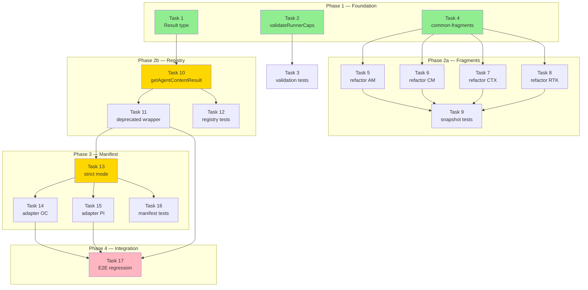

# Tasks: Mejoras de Arquitectura del Developer Team v2

## Source

- Spec: `developer-team-architecture-v2` spec artifact
- Design: `developer-team-architecture-v2` design artifact
- Capabilities affected: `instruction-bundle-fragments`, `validate-runner-capabilities`, `manifest-validation`, `content-registry-fallback`

---

## Task Groups

### Group: Shared / Contracts

#### Task 1: Crear tipo `Result<T, E>` y tipo `AgentContentError`

**Owner**: General Apply
**Priority**: P0
**Complexity**: Low
**Parallel**: Yes
**Depends on**: none

**Description**
Definir el tipo genérico `Result<T, E>` como discriminated union (`{ ok: true, value: T } | { ok: false, error: E }`) dentro de `content-registry.ts` (local, no shared utility — YAGNI per Design). Definir también `AgentContentError` con campos: `agentId: string`, `message: string`, `suggestions: string[]`, `fallbackAvailable: boolean`.

**Files**
- `packages/core/src/teams/developer/content-registry.ts` — modify (agregar tipos)

**Verification**
- TypeScript compila sin errores (`npx tsc --noEmit` en `packages/core`)
- Los tipos son accesibles via import desde `content-registry`
- `Result<T,E>` discrimina correctamente en `if (result.ok)` branches

---

#### Task 2: Crear `validateRunnerCapabilities()` + `REQUIRED_CAPABILITIES` + `ValidationResult`

**Owner**: General Apply
**Priority**: P0
**Complexity**: Medium
**Parallel**: Yes
**Depends on**: none

**Description**
Crear archivo nuevo `packages/core/src/runner-capability-validation.ts` con:
1. `REQUIRED_CAPABILITIES: string[]` listando las keys obligatorias: `id`, `displayName`, `environments`, `inspectEnvironment`, `tools`, `teams`, `models`, `memory`.
2. `OPTIONAL_CAPABILITIES: string[]` con: `install`, `developerTeam`, `modelConfig`, `capabilities`.
3. `ValidationResult` tipo con: `isValid: boolean`, `missing: string[]`, `warnings: string[]`.
4. `validateRunnerCapabilities(capabilities: RunnerCapabilities): ValidationResult` — función pura que recorre `REQUIRED_CAPABILITIES`, verifica que cada key exista y no sea `undefined`; recorre `OPTIONAL_CAPABILITIES` para warnings.

Exportar desde barrel `packages/core/src/index.ts`.

**Files**
- `packages/core/src/runner-capability-validation.ts` — create
- `packages/core/src/index.ts` — modify (agregar export)

**Verification**
- TypeScript compila sin errores
- `validateRunnerCapabilities({ id: "x" } as any)` retorna `{ isValid: false, missing: [...], warnings: [...] }`
- La función no muta el objeto de entrada (test de referencia)

---

#### Task 3: Tests unitarios para `validateRunnerCapabilities`

**Owner**: General Apply
**Priority**: P0
**Complexity**: Low
**Parallel**: No — depende de Task 2
**Depends on**: Task 2

**Description**
Crear archivo `packages/core/src/runner-capability-validation.test.ts` con tests que cubran:
1. Adapter completo (objeto con todas las keys) → `isValid: true`, `missing: []`
2. Capacidad obligatoria faltante (ej: `teams` undefined) → `isValid: false`, `missing` incluye `"teams"`
3. Múltiples capacidades faltantes → `missing` incluye todas
4. Capacidad opcional ausente → `isValid: true`, `warnings` incluye la key
5. No mutación del objeto de entrada
6. Test de contrato contra adapter OpenCode (importar `createOpenCodeRunnerCapabilities` y validar)
7. Test de contrato contra adapter PI (importar `createPiRunnerCapabilities` y validar)

**Files**
- `packages/core/src/runner-capability-validation.test.ts` — create

**Verification**
- `npx vitest run runner-capability-validation.test.ts` pasa todos los tests
- Tests 6 y 7 confirman que adapters existentes pasan validación (`isValid: true`)

---

### Group: Feature #1 — Common Fragments

#### Task 4: Crear `common-fragments.ts` con funciones generadoras por package

**Owner**: General Apply
**Priority**: P1
**Complexity**: Medium
**Parallel**: Yes
**Depends on**: none

**Description**
Crear `packages/core/src/teams/developer/instruction-bundles/common-fragments.ts` con funciones puras que generen markdown base compartido:
1. `buildBaseFragment(packageId: CapabilityInstructionPackageId, surface: CapabilityInstructionSurface): string` — retorna las secciones comunes (Container Tag Conventions, When to Save, Save Format, Authority Rule, etc.) parametrizadas por package y surface.
2. Cada fragment debe ser una función pura: sin estado, sin side effects, determinista.

Antes de implementar, analizar los 4 builders existentes para identificar las secciones exactas que se duplican y el nivel de parametrización necesario (por ejemplo, adaptive-memory tiene 3 surfaces, codebase-memory tiene 2). Generar un inventario de duplicación como referencia.

**Files**
- `packages/core/src/teams/developer/instruction-bundles/common-fragments.ts` — create

**Verification**
- TypeScript compila sin errores
- `buildBaseFragment("adaptive-memory", "agent")` retorna string no vacío
- Invocar 2 veces con mismos args retorna exactamente el mismo string (función pura)

---

#### Task 5: Refactor `adaptive-memory.ts` para consumir `common-fragments`

**Owner**: General Apply
**Priority**: P1
**Complexity**: Medium
**Parallel**: No — depende de Task 4
**Depends on**: Task 4

**Description**
Refactorizar `packages/core/src/teams/developer/instruction-bundles/adaptive-memory.ts` para:
1. Importar `buildBaseFragment` desde `common-fragments.ts`
2. Reemplazar el contenido duplicado inline con llamadas a `buildBaseFragment`
3. Mantener las secciones específicas de adaptive-memory que no son compartidas
4. El output markdown final debe ser idéntico byte-a-byte al output anterior

**Files**
- `packages/core/src/teams/developer/instruction-bundles/adaptive-memory.ts` — modify

**Verification**
- Capturar snapshot del bundle actual antes del refactor
- Después del refactor, comparar output byte-a-byte con el snapshot → idéntico
- `npx vitest run instruction-bundles/index.test.ts` pasa sin cambios

---

#### Task 6: Refactor `codebase-memory.ts` para consumir `common-fragments`

**Owner**: General Apply
**Priority**: P1
**Complexity**: Medium
**Parallel**: No — depende de Task 4
**Depends on**: Task 4

**Description**
Refactorizar `packages/core/src/teams/developer/instruction-bundles/codebase-memory.ts` para consumir `buildBaseFragment`. Mismo enfoque que Task 5: reemplazar duplicados, mantener específicos, verificar byte-a-byte.

**Files**
- `packages/core/src/teams/developer/instruction-bundles/codebase-memory.ts` — modify

**Verification**
- Snapshot antes/después byte-a-byte idéntico
- `npx vitest run instruction-bundles/index.test.ts` pasa sin cambios

---

#### Task 7: Refactor `context-mode.ts` para consumir `common-fragments`

**Owner**: General Apply
**Priority**: P1
**Complexity**: Medium
**Parallel**: No — depende de Task 4
**Depends on**: Task 4

**Description**
Refactorizar `packages/core/src/teams/developer/instruction-bundles/context-mode.ts` para consumir `buildBaseFragment`. Mismo enfoque que Task 5.

**Files**
- `packages/core/src/teams/developer/instruction-bundles/context-mode.ts` — modify

**Verification**
- Snapshot antes/después byte-a-byte idéntico
- `npx vitest run instruction-bundles/index.test.ts` pasa sin cambios

---

#### Task 8: Refactor `rtk.ts` para consumir `common-fragments`

**Owner**: General Apply
**Priority**: P1
**Complexity**: Low
**Parallel**: No — depende de Task 4
**Depends on**: Task 4

**Description**
Refactorizar `packages/core/src/teams/developer/instruction-bundles/rtk.ts` para consumir `buildBaseFragment`. Mismo enfoque que Task 5.

**Files**
- `packages/core/src/teams/developer/instruction-bundles/rtk.ts` — modify

**Verification**
- Snapshot antes/después byte-a-byte idéntico
- `npx vitest run instruction-bundles/index.test.ts` pasa sin cambios

---

#### Task 9: Tests de snapshot/parity para instruction bundles refactorizados

**Owner**: General Apply
**Priority**: P1
**Complexity**: Medium
**Parallel**: No — depende de Tasks 5, 6, 7, 8
**Depends on**: Task 5, Task 6, Task 7, Task 8

**Description**
Extender `packages/core/src/teams/developer/instruction-bundles/index.test.ts` con:
1. Tests de snapshot para cada builder + cada surface (ej: adaptive-memory × agent, skill, session)
2. Test de que `buildBaseFragment` es función pura (misma entrada → mismo output, no muta)
3. Test de reducción de duplicación: medir líneas totales de los 4 archivos antes y después, verificar ≥40% reducción de duplicación (REQ-FRAG-005)
4. Test de que un hipotético nuevo package puede usar `buildBaseFragment` y solo añadir sus deltas

**Files**
- `packages/core/src/teams/developer/instruction-bundles/index.test.ts` — modify

**Verification**
- `npx vitest run instruction-bundles/index.test.ts` pasa todos los tests
- Snapshots son estables (no cambian entre runs)

---

### Group: Feature #9 — Content Registry Fallback

#### Task 10: Implementar `getAgentContentResult()` con suggestions y fallback

**Owner**: General Apply
**Priority**: P0
**Complexity**: High
**Parallel**: No — depende de Task 1
**Depends on**: Task 1

**Description**
Modificar `packages/core/src/teams/developer/content-registry.ts` para agregar:

1. **`getAgentContentResult(agentId: string, options?: ContentRegistryResultOptions): Result<AgentContent, AgentContentError>`** — nueva función que:
   - Para agentIds en `REAL_CONTENT`: retorna `{ ok: true, value: AgentContent }`
   - Para agentIds no encontrados: retorna `{ ok: false, error: AgentContentError }` con:
     - `agentId` = el ID solicitado
     - `message` = mensaje descriptivo
     - `suggestions` = hasta 3 agentIds similares (Levenshtein ≤ 3 o prefix match)
     - `fallbackAvailable` = `true` si agentId existe en catálogo (`DEVELOPER_TEAM_AGENTS`), `false` si no
   - Si `options.fallback === true` y el agentId existe en catálogo pero no en REAL_CONTENT: retorna `{ ok: true, value: contenido genérico }` con contenido genérico que incluye displayName

2. **Algoritmo de suggestions**: Implementar Levenshtein distance (puro, sin dependencias) + prefix match. Rank: prefix match primero, luego Levenshtein ascendente. Cap 3 suggestions.

3. **Contenido genérico de fallback**: Prompt mínimo con header y aviso de que el agente no es reconocido, incluyendo displayName del catálogo.

**Files**
- `packages/core/src/teams/developer/content-registry.ts` — modify

**Verification**
- `getAgentContentResult("deck-developer-orchestrator")` → `{ ok: true, value: ... }`
- `getAgentContentResult("deck-developer-orchstrator")` → `{ ok: false, error: { suggestions: ["deck-developer-orchestrator"] } }`
- `getAgentContentResult("xyz")` → `{ ok: false, error: { fallbackAvailable: false, suggestions: [] } }`
- TypeScript compila sin errores

---

#### Task 11: Agregar wrapper deprecado `getAgentContent` (firma antigua)

**Owner**: General Apply
**Priority**: P0
**Complexity**: Low
**Parallel**: No — depende de Task 10
**Depends on**: Task 10

**Description**
Modificar la función `getAgentContent` existente en `content-registry.ts` para:
1. Marcarla como `@deprecated` en JSDoc, indicando que se use `getAgentContentResult`
2. Internamente delegar a `getAgentContentResult` y unwrap: si `ok: true` retorna `value`, si `ok: false` retorna `undefined`
3. Emitir `console.warn` en desarrollo cuando se llame (verificar `process.env.NODE_ENV !== 'production'` o similar)

Los callers internos actuales (manifest.ts, adapters) siguen usando esta firma y no deben romperse.

**Files**
- `packages/core/src/teams/developer/content-registry.ts` — modify

**Verification**
- `getAgentContent("deck-developer-orchestrator")` retorna `AgentContent` (no undefined)
- `getAgentContent("xyz")` retorna `undefined`
- JSDoc `@deprecated` visible en IDE
- `npx vitest run content-registry.test.ts` pasa sin cambios (tests existentes)

---

#### Task 12: Tests unitarios para `getAgentContentResult` (suggestions, fallback, Result)

**Owner**: General Apply
**Priority**: P0
**Complexity**: Medium
**Parallel**: No — depende de Task 10
**Depends on**: Task 10

**Description**
Extender `packages/core/src/teams/developer/content-registry.test.ts` con tests para:
1. AgentId existente retorna `Result.ok` con contenido correcto
2. AgentId con typo retorna `Result.err` con suggestions que incluyen el ID correcto
3. AgentId del catálogo sin contenido real → `fallbackAvailable: true`
4. AgentId completamente desconocido → `fallbackAvailable: false`, suggestions vacías
5. Fallback habilitado retorna contenido genérico con displayName
6. Wrapper deprecado mantiene comportamiento idéntico (parity test)
7. Suggestions limitadas a máximo 3

**Files**
- `packages/core/src/teams/developer/content-registry.test.ts` — modify

**Verification**
- `npx vitest run content-registry.test.ts` pasa todos los tests (existentes + nuevos)

---

### Group: Feature #7 — Manifest Strict Mode

#### Task 13: Agregar `strict` mode y `ManifestBuildResult` a `buildDeveloperTeamManifest`

**Owner**: General Apply
**Priority**: P0
**Complexity**: High
**Parallel**: No — depende de Task 11
**Depends on**: Task 11

**Description**
Modificar `packages/core/src/teams/developer/manifest.ts` para:

1. **Nuevo tipo `ManifestBuildResult`**:
   ```
   { manifest: DeveloperTeamManifest; warnings: string[]; errors: string[] }
   ```

2. **Extender `BuildManifestOptions`** con `strict?: boolean` (default: `false`)

3. **Cambiar firma de `buildDeveloperTeamManifest`** para retornar `ManifestBuildResult` en lugar de `DeveloperTeamManifest`

4. **Validaciones en modo `strict: true`**:
   - Placeholder detection: si un agente usa contenido placeholder (getAgentContent retornó undefined antes del fallback), agregar error: `"Agent '{agentId}' has no real content (placeholder used)"` (REQ-MAN-002, REQ-MAN-007)
   - Model assignment validation: si `modelAssignments` referencia un agentId que no está en el catálogo (`DEVELOPER_TEAM_AGENTS`), agregar error: `"Model assignment references unknown agent: '{agentId}'"` (REQ-MAN-003, REQ-MAN-007)
   - Memory/capability conflict: si `memoryBundle` y `capabilityInstructions` ambos inyectan al mismo surface para el mismo agente, agregar warning descriptivo (REQ-MAN-006)

5. **Modo `strict: false` o ausente**: comportamiento idéntico al actual, `errors: []`, `warnings: []` (REQ-MAN-005)

6. **Crear `buildDeveloperTeamManifestLegacy`** como wrapper deprecado que extrae `.manifest` del `ManifestBuildResult`

7. **Actualizar barrel export** en `packages/core/src/index.ts` para exportar `ManifestBuildResult` y `buildDeveloperTeamManifestLegacy`

**Files**
- `packages/core/src/teams/developer/manifest.ts` — modify
- `packages/core/src/index.ts` — modify (actualizar exports)

**Verification**
- TypeScript compila sin errores
- `buildDeveloperTeamManifest({ team, strict: false })` retorna `ManifestBuildResult` con `errors: []`
- `buildDeveloperTeamManifest({ team, strict: true })` con agente sin contenido real → `errors` no vacío
- `buildDeveloperTeamManifestLegacy({ team })` retorna `DeveloperTeamManifest` (backward compat)

---

#### Task 14: Actualizar adapter OpenCode para consumir `ManifestBuildResult`

**Owner**: General Apply
**Priority**: P0
**Complexity**: Low
**Parallel**: No — depende de Task 13
**Depends on**: Task 13

**Description**
Modificar `packages/adapter-opencode/src/runner-capabilities.ts` para:
1. Actualizar el consumo de `buildDeveloperTeamManifest` para manejar el nuevo return type `ManifestBuildResult`
2. Extraer `.manifest` del resultado donde sea necesario
3. Opcionalmente loguear `warnings` y `errors` si `strict` mode está habilitado
4. No habilitar `strict: true` aún en los adapters (per Design, es opt-in gradual)

**Files**
- `packages/adapter-opencode/src/runner-capabilities.ts` — modify

**Verification**
- TypeScript compila sin errores en `packages/adapter-opencode`
- `buildTeamInstallPlan` funciona correctamente con el nuevo `ManifestBuildResult`
- Install plan E2E genera mismos archivos que antes

---

#### Task 15: Actualizar adapter PI para consumir `ManifestBuildResult`

**Owner**: General Apply
**Priority**: P0
**Complexity**: Low
**Parallel**: No — depende de Task 13
**Depends on**: Task 13

**Description**
Mismo cambio que Task 14 pero en `packages/adapter-pi/src/runner-capabilities.ts`.

**Files**
- `packages/adapter-pi/src/runner-capabilities.ts` — modify

**Verification**
- TypeScript compila sin errores en `packages/adapter-pi`
- Install plan E2E genera mismos archivos que antes

---

#### Task 16: Tests unitarios para manifest strict mode

**Owner**: General Apply
**Priority**: P0
**Complexity**: Medium
**Parallel**: No — depende de Task 13
**Depends on**: Task 13

**Description**
Extender `packages/core/src/teams/developer/manifest.test.ts` con tests para:
1. `strict: true` detecta placeholder en agente → errors contiene agentId
2. `strict: true` detecta modelAssignment a agente inexistente → errors contiene mensaje
3. `strict: false` (default) → errors y warnings vacíos, output idéntico al actual
4. Warnings y errors son `string[]` con context del agentId afectado
5. Conflicto memoryBundle + capabilityInstructions en mismo surface → warning descriptivo
6. `buildDeveloperTeamManifestLegacy` retorna `DeveloperTeamManifest` idéntico al output actual

**Files**
- `packages/core/src/teams/developer/manifest.test.ts` — modify

**Verification**
- `npx vitest run manifest.test.ts` pasa todos los tests (existentes + nuevos)

---

### Group: Integración

#### Task 17: Test E2E de regresión — install plan completo ambos adapters

**Owner**: General Apply
**Priority**: P0
**Complexity**: Medium
**Parallel**: No — depende de Tasks 14, 15, 11
**Depends on**: Task 14, Task 15, Task 11

**Description**
Ejecutar el install plan completo para ambos adapters (OpenCode y PI) y verificar que los archivos generados son idénticos a los generados antes del cambio. Esto cubre:
1. Baseline: capturar outputs del install plan actual (pre-cambio)
2. Post-cambio: ejecutar install plan y comparar byte-a-byte con baseline
3. Verificar que ningún archivo cambió de contenido
4. Si hay cambios, investigar y determinar si son esperados o regresiones

**Files**
- No se crean/modifican archivos producto — es un test de integración

**Verification**
- Outputs byte-a-byte idénticos para ambos adapters
- Si hay diferencias, cada diferencia está documentada y justificada

---

## Dependency Graph

```
Task 1 (Result type) ──────────────────────────────┐
Task 2 (validateRunnerCapabilities) → Task 3 (tests)│
Task 4 (common-fragments) → Task 5 (refactor AM)    │
                        → Task 6 (refactor CM)       │
                        → Task 7 (refactor CTX)      │
                        → Task 8 (refactor RTK)      │
                        Task 5+6+7+8 → Task 9 (snap) │
Task 1 → Task 10 (getAgentContentResult)             │
       → Task 11 (deprecated wrapper)                │
       Task 10 → Task 12 (registry tests)            │
       Task 11 → Task 13 (manifest strict)           │
                 Task 13 → Task 14 (adapter OC)      │
                 Task 13 → Task 15 (adapter PI)      │
                 Task 13 → Task 16 (manifest tests)  │
                 Task 14+15+11 → Task 17 (E2E)       │
```

## Parallelization Plan

| Phase | Tasks | Can Run in Parallel |
|---|---|---|
| Phase 1 — Foundation | 1, 2, 4 | **Yes** — independientes entre sí |
| Phase 1.5 — Foundation tests | 3 | **No** — depende de Task 2 |
| Phase 2 — Feature #1 Fragments | 5, 6, 7, 8 | **Yes** — entre sí, todas dependen de 4 |
| Phase 2.5 — Fragments tests | 9 | **No** — depende de 5+6+7+8 |
| Phase 2 — Feature #9 Registry | 10 | **No** — depende de Task 1 |
| Phase 2.5 — Registry wrapper + tests | 11, 12 | **No** — 11 depende de 10; 12 depende de 10. Pero 11 y 12 **pueden** en paralelo |
| Phase 3 — Feature #7 Manifest | 13 | **No** — depende de Task 11 |
| Phase 3.5 — Manifest tests + adapters | 14, 15, 16 | **Yes** — 14 y 15 en paralelo; 16 en paralelo con 14/15 |
| Phase 4 — Integration | 17 | **No** — depende de 14, 15, 11 |

## Responsibility Contracts

| Contract / Boundary | Owner | Consumers | Notes |
|---|---|---|---|
| `Result<T,E>` type | Task 1 (General) | Task 10, Task 13, adapters | Tipo local en content-registry.ts; promover a shared solo si otro módulo lo necesita |
| `AgentContentError` type | Task 1 (General) | Task 10, Task 12 | Incluye suggestions[] y fallbackAvailable |
| `ValidationResult` + `validateRunnerCapabilities` | Task 2 (General) | Task 3, adapters (futuro) | Función pura, no muta; puede usarse en preflight de adapters |
| `buildBaseFragment` | Task 4 (General) | Tasks 5-8, Task 9 | Función pura, parametrizada por packageId y surface |
| `getAgentContentResult` | Task 10 (General) | Task 11, Task 13 | Reemplaza el retorno undefined de getAgentContent |
| `ManifestBuildResult` | Task 13 (General) | Tasks 14, 15, 16 | Wrapping de DeveloperTeamManifest + diagnostics |
| `buildDeveloperTeamManifestLegacy` | Task 13 (General) | Callers no migrados | Wrapper deprecado, extrae .manifest |

## Complexity Summary

| Complexity | Count | Task Numbers |
|---|---|---|
| Low | 6 | 1, 3, 8, 11, 14, 15 |
| Medium | 8 | 2, 4, 5, 6, 7, 9, 12, 16, 17 |
| High | 2 | 10, 13 |

## Flagged for Splitting

- **Task 10** (`getAgentContentResult`): High complexity, incluye Result type usage, suggestions algorithm (Levenshtein), fallback content generation, y opciones. Si el algoritmo de suggestions es complejo, considerar separar "suggestions algorithm" en un helper testable independientemente.
- **Task 13** (manifest strict mode): High complexity, incluye 3 validaciones distintas, nuevo return type, wrapper legacy, y barrel export update. Las validaciones son independientes y podrían separarse si el reviewer prefiere, pero el cambio de return type las une.

## Review Workload Forecast

| Signal | Value |
|---|---|
| Estimated changed lines | 400-800 |
| 400-line budget risk | Medium |
| Scope reduction recommended | No |
| Sequential work slices recommended | Yes |
| Decision needed before Apply | Yes (OQ-2, OQ-5) |

**Rationale**: 2 archivos nuevos (~100-150 líneas cada uno), 4 archivos de bundles refactorizados (reducción neta de ~200 líneas), content-registry modificado (~80 líneas nuevas), manifest modificado (~100 líneas nuevas), 2 adapters modificados (~10 líneas cada uno), 3 archivos de test extendidos (~150 líneas nuevas). Total neto estimado: ~500-700 líneas cambiadas. Riesgo medio — el trabajo es mecánico pero requiere cuidado con backward compatibility. Se recomienda ejecución en slices secuenciales (Phase 1 → Phase 2 → Phase 3 → Phase 4) para review incremental.

## Open Questions / Blockers

- **OQ-2 (implementation-blocking)**: ¿Existe un patrón `Result<T, E>` ya en el codebase? El Design dice "no" y recomienda crear uno local. Si ya existe, Task 1 debe adaptarse para reusarlo en lugar de crear duplicado. **Allowed-with-stub**: proceder con `Result<T,E>` local; si se descubre uno existente, unificar en review.

- **OQ-5 (implementation-blocking)**: ¿Cuál es el criterio de aceptación para "similar suggestions"? El Design recomienda "Levenshtein ≤ 3 o prefix match, rank: prefix primero, luego distancia, cap 3". **Allowed-with-stub**: implementar con esta heurística; afinar threshold en review si las suggestions son insuficientes.

- **OQ-1 (non-blocking)**: Estrategia de versionado — afecta cuántas releases mantener el wrapper deprecado. No bloquea implementación; el wrapper se mantiene hasta que se decida.

- **OQ-3 (non-blocking)**: ¿Strict mode en CI? No bloquea implementación; `strict` es opt-in y la decisión de CI es posterior.

- **OQ-4 (non-blocking)**: ¿Runners adicionales en roadmap? No afecta las tareas de este SDD; solo priorización futura.

## Mermaid Summary Source


