# Auxiliary Repair Design: Batch B Trust-Boundary Replacement

## Authority and Lifecycle

- Change: `developer-team-execution-convergence`.
- Lifecycle phase: `apply`; this auxiliary repair design creates no new SDD phase.
- Human override, recorded exactly: `Autorizo el replan superior de Batch B y un único intento de reemplazo integral del trust boundary para corregir B-B1 a B-B7.`
- Linked failed Reviews: `review-batch-b.md` and `review-batch-b-repair-1.md`.
- Prior disposition: EG2-R1 attempt 1 is consumed, its failure set remained `7 → 7`, attempt 2 is ineligible, and its security hard stop remains historical fact.
- New disposition: the override permits a higher-level replacement replan with one future modifying attempt after Task and repair-governance reconciliation. This design does not itself start or execute Apply.
- Batch C remains blocked until the replacement passes both verification cycles and a fresh independent Review closes B-B1 through B-B7.

## Verdict

Replace the Batch B trust-boundary internals coherently; do not continue patching the shallow validators. Preserve supported V1 public names and all pre-Batch-B exports, but replace their implementations behind those names.

The current implementation hashes and freezes partially checked runtime objects. A self-consistent digest proves byte integrity, not semantic validity. This permits malformed DTOs, unsafe prose, incomplete cross-references, path-dependent identity, duplicate semantic evidence, and unsafe delta conclusions to become apparently authoritative. Additional predicates in individual parsers would retain the same defective authority model and leave inconsistent gaps between DTOs.

## Scope

### In scope

- `packages/sdd-runtime/src/contracts/canonical.ts`.
- `packages/sdd-runtime/src/contracts/{apply-batch,failure-manifest,failure-delta,execution-decision,invocation-authorization,registry-intent,verification-state,causal-context,execution-lane,execution-dossier}.ts`.
- `packages/sdd-runtime/src/orchestrator/failure-delta.ts`.
- `packages/sdd-runtime/src/index.ts`, only for an exact supported V1 export allowlist while preserving every pre-Batch-B export.
- Existing and focused new Batch B contract/delta/export tests adjacent to the authorized modules.
- Existing in-memory `repair-incident-v1` adaptation only as needed to preserve exact legacy behavior while passing through the corrected V1 builder.

### Explicitly prohibited

- Batch C or later decision-kernel, production runtime, execution-control-plane, adapter, registry-coordinator, lane-router, or prompt wiring.
- Generated-file or canonical skill-source edits.
- Historical OpenSpec changes, including rewriting either failed Review or prior incident evidence.
- `runner-capability-standardization`, commit `8c6d167`, its WIP, branch, artifacts, or registry history.
- Build-info repair, unrelated product paths, unrelated tests, broad refactors, or new dependencies.
- Git discard/reset/restore/clean operations.

## Root Architectural Error

The faulty pattern is:

1. Cast `unknown` to a V1 interface.
2. Validate a shallow subset of fields.
3. Hash the supplied shape.
4. Accept a matching self-supplied digest.
5. Freeze the result.

This pattern appears in the current DTO parsers and is repeated rather than centralized. It also mixes raw-input building, issued-wire parsing, nested issuance, and aggregate reference validation. The replacement establishes one authority pipeline and requires every public boundary to use it.

## Authority and Trust Pipeline

Every public V1 entrypoint MUST use this order:

```text
unknown input
  → safe runtime inspection
  → recursive closed-shape parsing
  → scalar, enum, identifier, and bound validation
  → structural secret rejection/redaction
  → path, set, and code canonicalization
  → semantic and cross-field validation
  → builder: issue canonical IDs/digests
     parser: require canonical wire and verify supplied IDs/digests
  → cross-contract reference validation
  → clone into plain records
  → recursive freeze
  → trusted return
```

### Runtime inspection

- Accept only primitives, dense arrays, and records whose prototype is `Object.prototype` or `null`.
- Reject accessors, symbol keys, sparse arrays, cycles, functions, symbols, bigint, `undefined`, non-finite numbers, `Date`, `Map`, `Set`, and other non-plain objects.
- Require own data properties. Convert proxy/property-trap failures into `invalid-evidence` without exposing raw values.
- Inspect recursively before any semantic string, path, or digest is hashed.

### Builder/parser separation

| Boundary | Rule |
|---|---|
| `buildXxxV1(value, context?)` | Accepts untrusted producer input, normalizes and safely redacts permitted fields, derives IDs/digests, clones, and freezes. |
| `parseXxxV1(value, references?)` | Accepts issued wire data. The wire must already be canonical. It validates every supplied ID/digest and rejects any input whose normalization would change its representation. |
| Internal computation | Re-runs public parsing on external inputs. TypeScript interfaces or casts never confer runtime trust. |
| Dossier composition | Accepts issued nested DTOs only, recursively parses them, and never invents or recomputes a supplied nested digest. |

Canonicalization and redaction are internal implementation details. Only the `Sha256Digest` type may remain a root type export from `canonical.ts`.

## Recursive Contract Schemas

Every object level has an explicit key allowlist. Unknown arbitrary keys fail as `invalid-evidence`; they are not spread into persisted output.

### Common scalar rules

- SHA-256 digests are exactly `sha256:` plus 64 lowercase hexadecimal characters.
- Truncated IDs have exact prefixes and lengths; full digest equality remains authoritative.
- Open code fields use a bounded namespaced-code grammar rather than unrestricted prose.
- Timestamps are valid canonical ISO-8601 UTC strings.
- Counts and revisions are bounded non-negative safe integers.
- Arrays are dense and bounded. Declared sets are normalized, collision-checked, deduplicated only for exact duplicates, and sorted; sequences retain declared order.
- Optional fields are validated for both type and legal field combinations.

### Recursive allowlists

| Contract | Recursively parsed structures and invariants |
|---|---|
| `ApplyBatchContractV1` | Batch fields, dependencies, verification stages, artifact digest map, targets, obligations, authorization digest, and provenance. Target overlap and normalized artifact-key collisions reject. |
| `FailureManifestV1` | Manifest fields, every finding, relationship/status, every evidence reference, producer metadata, IDs, and digest. No input object is spread. |
| `FailureDeltaV1` | All bucket arrays, prior/current risk vectors, manifest references, movement, progress, compatibility `added`, ID, and digest. Algebra is checked, not merely hashed. |
| `ExecutionDecisionV1` | Action/root-cause/lane enums, rationale codes, freshness record, terminal guard, verification-stage reference, and deprecated empty intent field. |
| Authorization | Claims/reference shapes, IDs, role, exact target sets, timestamps, `maxUses`, validation/rejection consistency, and digests. Proof material remains out of this persisted contract scope. |
| `RegistryIntentV1` | Base digests, change/batch/decision binding, artifact, provenance, event, idempotency key, ID, and digest. |
| Verification state | Every stage, status, check ID, evidence reference, skip reason, stage order, and `nextStage` consistency. Batch C policy is not implemented here. |
| Causal context | Batch digest, prior decision digests, active finding IDs, evidence references, and exact attempt-summary records. |
| Lane decision | Lane enum, finite bounded risk score, code arrays, optional recommendation, boolean mode, and digest. No routing algorithm is added. |
| Execution dossier | Every nested DTO plus aggregate batch/change/digest/reference and revision-chain invariants. |

### Extension namespace policy

An optional top-level `extensions` record is the only allowed forward-extension point.

- Extension keys use a namespaced form such as `dev.deck.example`.
- Core field names and secret-bearing key names are prohibited recursively.
- Values are bounded canonical JSON: fixed maximum depth, collection count, string bytes, and total canonical bytes.
- Strings undergo secret and unsafe-path inspection.
- Nested extension objects cannot redefine core keys or add authority-bearing IDs, digests, decisions, targets, evidence, or authorization.
- Extensions are included in the enclosing contract digest but excluded from finding identity, risk, delta classification, authorization, and decisions until a future recognized parser promotes them.
- Findings, evidence references, risk vectors, authorization references, and digest/reference records do not accept extensions.
- Any unknown key outside the explicit `extensions` envelope rejects.

## Secret and Rejection Model

### Structural detector

Normalize key case and separators before comparing against the forbidden credential-key set. The set includes token, password, secret, API key, authorization/auth header, cookie/set-cookie, private key, client secret, access key, session key, credential, and equivalent normalized forms.

### Value detector

High-confidence detection includes:

- PKCS#8, RSA, EC, OpenSSH, encrypted, and malformed/unclosed private-key PEM markers/blocks.
- Bearer and Basic authorization headers.
- Cookie and set-cookie values.
- JWT-like compact credentials and known high-confidence credential prefixes.
- Assignment forms such as `password=`, `api_key:`, `client-secret=`, and equivalent separators.
- Raw prompt/transcript/hidden-reasoning markers where the field is not permitted to carry such content.

Detection runs before byte bounding and again on the completed safe object before hashing. Truncation occurs only at UTF-8 character boundaries. Detector state is local to each call.

### Reject versus redact

| Input | Outcome |
|---|---|
| Secret material in identity, code, path, enum, digest, reference, or extension fields | Reject `unsafe-diagnostic-content`. |
| Unknown or forbidden secret-named key | Reject; never silently drop it. |
| PEM, auth header, cookie, raw transcript/prompt, unrestricted log, malformed secret span, or prose whose safe meaning cannot be retained | Reject the finding or contract. |
| Bounded optional summary/excerpt containing one recognizable inline assignment | Replace the entire credential span with constant `[redacted-secret]` only when non-secret meaning remains and a full post-scan passes. |
| Prose reduced to only a redaction marker | Reject as unsafe/non-meaningful evidence. |

Raw secret material is never passed to SHA-256. If inline redaction is accepted, different concrete secret values MUST produce identical safe bytes and safe digest; otherwise both inputs reject.

## Authoritative Path Context

Raw builders that accept paths require a non-persisted context:

```ts
interface RepositoryPathContextV1 {
  projectRoot: string;
  pathStyle: "posix" | "windows";
}
```

Rules:

- Convert `\` and `/` to `/` after interpreting the declared style.
- Normalize Unicode consistently and reject collisions caused by normalization.
- Remove `.` segments; reject `..`, NUL, drive-relative paths, malformed UNC paths, and unsafe empty segments.
- Compare Windows root/drive prefixes case-insensitively; do not infer a root from `packages`, `apps`, `src`, a filename, or an extension.
- An absolute path under the authoritative root becomes repository-relative.
- An already relative path must independently pass repository-relative validation.
- Identity-bearing location paths MUST be validated repository-relative paths.
- External paths may be represented only as safe non-identifying display/evidence labels. An external affected subject requires a stable symbolic/check subject rather than an absolute path.
- Issued-wire parsers reject absolute paths; wire paths are already canonical.

Equivalent repository paths under `/home/alice/repo`, `/mnt/ci/repo`, and a Windows checkout therefore yield the same repository-relative identity regardless of checkout prefix or separator.

## Finding, Evidence, and Collision Identity

### Relationship decision

Add the structured field:

```ts
relationship: "batch_related" | "unrelated_baseline"
```

- Ambiguous and legacy cases default conservatively to `batch_related`.
- `unrelated_baseline` requires validated pre-existing evidence and `status: "pre_existing"`.
- `out_of_scope` does not imply unrelated baseline.
- Relationship cannot change for the same finding identity.
- Unrelated baseline findings receive no risk-movement or repair credit.

### Finding fingerprint

The full fingerprint includes only:

- Full batch digest.
- Sorted requirement/design-constraint references.
- Sorted task IDs where task identity is semantically relevant.
- Normalized category code.
- Normalized repository-relative subjects/location keys.
- Oracle/check ID.

It excludes prose, evidence order, producer, source phase, display artifact, severity, status, relationship, root cause, safety classification, timestamps, and remediation text/code.

- `findingId` is a truncated label derived from the full fingerprint.
- Equality requires the full fingerprint.
- Same truncated ID with different full fingerprints rejects as `invalid-finding-identity`.
- Duplicate full semantic identity in one manifest rejects as `invalid-evidence: duplicate-finding-identity`.
- Severity, status, safety, and root-cause changes retain identity and are classified by the delta.

### Evidence identity

Evidence semantic identity is the canonical tuple `(kind, checkId, canonical artifact, resultCode)`. Excerpt prose is non-identifying.

- Byte-equivalent normalized evidence is deduplicated deterministically before manifest digesting.
- The same semantic tuple with a different safe payload/excerpt rejects as an evidence semantic collision.
- Evidence is sorted by its full semantic digest.
- Duplicate evidence cannot inflate persisted evidence, finding counts, risk, or delta behavior.

### Other collisions

- Two artifact keys that normalize to one path reject even when their digests match.
- Distinct raw values that collapse under path/code/Unicode normalization reject.
- Exact duplicates may be deduplicated only in fields explicitly declared as sets.
- All collision checks run before ID, manifest digest, or risk computation.

## Dossier Integrity and Revision Chain

### Acyclic issuance

```text
Batch → Manifests → Delta → Decision → Registry intents → Dossier revision
```

`ExecutionDecisionV1.registryIntents` remains as a deprecated compatibility field but MUST be empty. Authoritative intents live at dossier level and may then bind to the already issued decision digest. This retains the public shape without creating a decision/intent digest cycle.

### Aggregate invariants

- Parse and verify the complete batch first.
- Manifest `changeId`, `batchId`, and `batchDigest` equal the batch.
- Delta current digest equals `currentManifest.digest`.
- Delta previous digest equals `priorManifest.digest` when prior exists and is absent otherwise.
- A decision requires a valid current manifest and delta.
- Decision `batchId` equals the batch.
- Lane, verification, causal context, authorization reference, registry intents, and decision are recursively parsed before dossier hashing.
- Verification `batchId` and causal `batchDigest` match the batch.
- An accepted authorization reference has `claimsDigest === batch.authorizationGrantRef`; a rejected reference cannot support a decision.
- Every intent matches change, batch ID, and full batch digest. With a decision, each intent carries its exact `decisionDigest`; without a decision, that field is absent.
- Intent IDs and idempotency keys are unique.
- Active causal finding IDs exist in the current validated manifest.
- Supplied nested IDs/digests are preserved and verified; dossier code never silently recomputes them.

Allowed manifest states are:

- No manifests/delta/decision.
- Current manifest only, before comparison; decision absent.
- Current manifest plus delta with no prior manifest and no previous digest.
- Prior plus current manifests and a delta linking both.

### Append-only revisions

- Revision 1 has no `previousDigest`.
- A later revision requires the immediately previous parsed dossier.
- Revision increments by exactly one and `previousDigest` equals the previous full digest.
- `dossierId` is issued at revision 1 and remains stable.
- Batch ID and full batch digest never change.
- Existing registry intents remain an exact prefix; new intents append with unique IDs/keys.
- Prior decision digests remain an exact prefix in causal context.
- A new current manifest moves the prior revision's current manifest to the prior slot before a new delta is accepted.
- Prior objects remain recursively frozen and unmodified.
- Authoritative parsing of revision greater than one requires the prior revision; a local digest alone cannot prove chain continuity.

Delete the current silent nested-digest issuance path (`addDigest`/`preserveOrIssueDigest` behavior). Each nested contract receives its own public builder/parser.

## Full Failure-Delta and Risk Algebra

Let `P` be prior active batch-related identities, `C` current active batch-related identities, and `B` newly observed validated unrelated-baseline identities.

| Condition | Bucket |
|---|---|
| Identity in `P`, absent or inactive in current | `resolved` |
| Previously resolved identity becomes active | `regressed` |
| Active in both with severity, protected coverage, or safety increase | `regressed` |
| Active in both with a non-risk root-cause/classification change | `reclassified` |
| Active in both without material change | `persistent` |
| Active only in current and `batch_related` | `newRelated` |
| Newly observed with validated `unrelated_baseline` relationship | `newUnrelatedBaseline` |

Precedence for one identity is `regressed > reclassified > persistent`.

Algebraic parser invariants:

- Every bucket is sorted and unique.
- Buckets are pairwise disjoint.
- Their union exactly covers the comparison universe.
- Every ID resolves to the expected prior/current finding.
- `added` remains a deprecated compatibility projection and MUST equal sorted unique `newRelated ∪ newUnrelatedBaseline`; it is never independent authority.
- Baseline findings are excluded from batch risk and movement.

### Risk vector

Risk counts validated active batch-related findings only. Comparison is lexicographic in this order:

1. Security/data-loss/authorization/Git-safety hard stops.
2. Critical.
3. High.
4. Uncovered requirements.
5. Medium.
6. Low.

Telemetry weights remain critical `1000`, high `100`, medium `10`, and low `1`.

```text
baseMovement = priorRisk.weighted - currentRisk.weighted
regressionPenalty = sum(current severity weight for every regressed identity)
weightedMovement = baseMovement - regressionPenalty
```

Because current risk already counts each regressed finding once, the added penalty gives regressed findings the required effective `2x` current weight.

### Progress precedence

1. Invalid manifests/delta evidence produce no valid delta.
2. Progress is `negative` on any new/regressed security, data-loss, authorization, Git-safety, critical, or high risk; any newly uncovered requirement; any lexicographically worse current vector; or negative weighted movement.
3. Progress is `positive` only when the current vector is strictly safer, weighted movement is positive, and no hard safety/high-critical/uncovered-requirement guard fired.
4. Otherwise progress is `none`.

`newRelated` remains an independent later-routing signal even when a low-risk net movement is positive. Batch C action selection is not part of this repair. Under this precedence a critical or security regression can never produce positive progress.

## Public API Boundary

Preserve public contract/type names. Add paired builders where only shallow parsers exist. The supported root runtime surface is limited to:

- `buildApplyBatchContractV1`, `parseApplyBatchContractV1`.
- `buildFailureManifestV1`, `parseFailureManifestV1`, `adaptRepairIncidentToFailureManifestV1`.
- `parseFailureDeltaV1`, `computeFailureDeltaV1`.
- `buildExecutionDecisionV1`, `parseExecutionDecisionV1`.
- `buildInvocationAuthorizationClaimsV1`, `parseInvocationAuthorizationClaimsV1`.
- `buildAuthorizationReferenceV1`, `parseAuthorizationReferenceV1`.
- `buildRegistryIntentV1`, `parseRegistryIntentV1`.
- `buildStagedVerificationStateV1`, `parseStagedVerificationStateV1`.
- `buildCausalContextV1`, `parseCausalContextV1`.
- `buildLaneDecisionV1`, `parseLaneDecisionV1`.
- `createExecutionDossierV1`, `reviseExecutionDossierV1`, `parseExecutionDossierV1`.

Root type exports may include the V1 DTO/input types, identifiers, and `Sha256Digest`.

The root barrel MUST NOT expose canonical JSON, SHA-256 implementation, cloning/freezing, path normalization, redaction/detector helpers, recursive shape readers, digest assertions, batch-reference assertions, or internal trusted computation functions. Replace V1 wildcard exports with explicit supported exports and preserve every export that existed before Batch B.

## Legacy Compatibility

- Keep `parseRepairIncidentYAML`, its DTOs/results, `evaluateRepairIncident()`, `runOrchestratorPipeline()`, and all pre-Batch-B root exports semantically exact.
- The adapter consumes a validated legacy incident, creates a separate V1 builder input, and never mutates or rewrites the legacy source.
- Ambiguous legacy relationship maps to `batch_related`. Only explicit validated pre-existing evidence maps to `unrelated_baseline`.
- Unsafe legacy prose may remain readable through the legacy reader, but promotion to authoritative V1 rejects if safe meaning cannot be retained.
- Malformed V1 objects fail closed even if their self-supplied digest is internally consistent.
- The faulty Batch B implementation has no reviewed production caller; nevertheless, any discovered persisted non-empty decision intent field or incompatible V1 record is a migration blocker, not a reason to weaken parsing.

## Exact Public-Entrypoint Adversarial Matrix

All acceptance cases invoke public builders/parsers. Forged typed manifests, casts, aggregate counts, subset-only assertions, label-only fixtures, and broad `toThrow()` without exact error codes are insufficient.

| Area | Required exact cases and oracle |
|---|---|
| Every V1 parser | Unknown schema; missing/extra field; wrong scalar; invalid enum/ID/digest/timestamp; malformed nested object; non-array; sparse array; NaN/Infinity; prototype/accessor input; digest-valid malformed shape. Assert exact error, no mutation, no accepted object. |
| Successful boundaries | `parse(build(x)) === build(x)`; repeated output byte/digest identity; plain cloned output; recursive freeze of all nested arrays/records. |
| Apply batch | POSIX/Windows root normalization; target overlap; malformed dependencies/plans; `src\\a` and `src/a`; normalization collision; secret/oversized extension; exact content-addressed ID/digest. |
| Secrets | PKCS#8/RSA/EC/OpenSSH/encrypted/malformed PEM; bearer/basic auth; cookie/set-cookie; JWT-like token; secret-named nested key; every summary/excerpt/code/extension placement. Assert exact rejection or safe bytes and absence of raw or raw-secret-derived material. |
| Inline redaction | Two distinct bounded inline assignment values either both reject or produce identical safe payload and digest after constant redaction and post-scan. |
| Paths | POSIX and Windows checkout-root table, arbitrary repository layouts/extensions, same exact relative paths/fingerprints/IDs; changed oracle/category/obligation/subject yields inequality. |
| Finding identity | Wording/evidence order/producer/phase/severity stability; truncated-ID/full-fingerprint collision; duplicate semantic identity rejection. |
| Evidence | Equivalent duplicate collapses to one; reorder is byte-identical; same semantic tuple with differing payload rejects; no count/risk inflation. |
| Delta parser | Wrong bucket types, duplicates, overlap, foreign/missing IDs, incorrect `added`, malformed risk vectors, impossible progress/movement, and self-hashed malformed payload all reject exactly. |
| Delta table | Exact arrays/vectors/movement/progress for resolved, persistent, new related, validated baseline, reopened, severity regression, reclassification, safety regression, and uncovered requirement. |
| Safety precedence | Resolve critical while adding low security; critical/high regression; data-loss/authorization/Git-safety regression; baseline-only addition. No prohibited case returns positive or repair credit. |
| Dossier | Corrupt each nested schema/digest/ID independently; wrong change/batch/decision/intent/auth binding; broken prior/current delta; duplicate intent; missing current; revision skip; wrong previous digest; batch mutation; deleted/reordered prior intent. Assert `batch-reference-mismatch` or `invalid-evidence` before issue/freeze. |
| Root exports | Exact object-key comparison against all pre-Batch-B exports plus the approved V1 allowlist; internal helper names absent. |
| Legacy | Execute legacy parser, `evaluateRepairIncident()`, `runOrchestratorPipeline()`, and adaptation; exact result/state/sets and source serialization unchanged. |

Property/table invariants:

- Canonical key permutation does not change bytes.
- Declared set order does not change bytes; sequence order remains meaningful.
- Normalization is idempotent and collisions reject.
- Delta buckets are disjoint, sorted, unique, and coverage-complete.
- `added` exactly equals the union of the two new buckets.
- Unrelated baseline never changes batch risk or movement.
- Equivalent checkout roots never change identity.
- Any critical/security/data-loss/authorization/Git-safety regression implies `progress !== "positive"`.
- Every accepted dossier reference resolves to exactly one validated full digest.

## Retain, Replace, and Delete Map

| File/symbol | Decision | Rationale |
|---|---|---|
| `contracts/canonical.ts`: canonical JSON, crypto digest, clone, freeze concepts | Retain internally; strengthen conformance tests | Existing pure primitives are appropriate when used only after validation. |
| `normalizeSafePath` repository-marker heuristic | Delete/replace | Identity requires injected authoritative root, not directory/filename inference. |
| Current secret regexes and byte slicing | Replace | Coverage and UTF-8 behavior are insufficient for a security boundary. |
| `contracts/apply-batch.ts` public types/names | Retain names; replace internals | Preserve interface surface while enforcing recursive build/parse semantics. |
| `contracts/failure-manifest.ts` public names and legacy adapter | Retain names; replace `finding`, build, parse, and adaptation boundary internals | Required for B-B1, B-B4, and B-B5. |
| `contracts/failure-delta.ts` names and deprecated `added` | Retain names; replace shape/algebra parser | Compatibility projection remains, authority moves to complete buckets. |
| `orchestrator/failure-delta.ts` | Replace `risk`, regression/reclassification logic, and computation internals | Required complete bucket/risk semantics and `2x` regression penalty. |
| Remaining V1 DTO files | Retain interfaces/parser names; replace shallow parsers; add paired builders | One uniform fail-closed boundary. |
| `contracts/execution-dossier.ts` `addDigest`, `preserveOrIssueDigest`, shallow `validate`/`issue` | Delete/replace | Aggregate code must verify issued nested DTOs, not manufacture trust. |
| `packages/sdd-runtime/src/index.ts` | Preserve pre-Batch-B exports; replace V1 wildcards with explicit exports | Avoid committing internal helpers as public API. |
| `contracts/repair-incident.ts` and legacy runtime behavior | Retain unchanged | REQ-ROLLOUT-005 compatibility floor. |
| `contracts/batch-b-repair.test.ts` as acceptance proof | Delete/replace with exact focused public-boundary tables | Current combined subset permits false closure. |
| Forged-manifest delta tests | Replace with public builders/parsers | Tests must exercise the actual trust boundary. |
| Existing happy-path contract test | Retain only as integration smoke after adversarial coverage | Happy paths do not establish security acceptance. |
| `index.test.ts` | Replace subset function checks with exact export comparison | Proves both compatibility and internal hiding. |

No new production package or external validation dependency is required. Shared recursive readers remain internal to `canonical.ts`, already in the authorized product scope.

## One-Attempt Sequence

This sequence begins only after Task and repair-governance artifacts reconcile the override into one explicit replacement task. It is not EG2-R1 attempt 2.

1. Capture the exact pre-Batch-B root export baseline and confirm whether any external/persisted V1 records exist.
2. Add complete RED public-entrypoint reproductions for B-B1 through B-B7, including the full parser mutation table. If any finding lacks an exact executable oracle, stop before product modification.
3. Replace the internal recursive trust-boundary primitives: safe inspection, shape readers, canonical-wire checking, secret policy, path context, and collision detection.
4. Replace leaf builders/parsers in dependency order: Apply batch; evidence/finding/manifest; authorization; lane; verification; causal context; registry intent; decision.
5. Replace delta algebra and exact risk/progress validation.
6. Replace dossier issuance, parsing, acyclic references, and append-only revision validation.
7. Narrow root exports and run exact legacy compatibility oracles.
8. Verification cycle 1: focused adversarial/all-contract tests, affected `sdd-runtime` and core compatibility tests, workspace typecheck, and exact changed-path audit.
9. Verification cycle 2: broad repository checks, exact known-baseline comparison, generated-byte hash/drift check, and prohibited-scope audit.
10. Run a fresh independent security/design Review. Only complete closure of B-B1 through B-B7 may accept Batch B and unblock Batch C.

The sole replacement attempt is consumed when product/test modification begins. A failed or incomplete attempt grants no automatic retry.

## Rollback

- Keep `executionContracts=observe|off`; no corrected contract controls authoritative effects during replacement.
- Preserve legacy readers and effects.
- Preserve every prior incident, Review, registry event, and generated-byte record.
- A failed replacement returns to hard stop; it must not restore shallow validators or weaken secret/risk rules.
- Rollback is a separately authorized source-level follow-up, never Git discard/reset/restore.
- Valid additive records remain readable. Malformed V1 objects remain rejected.

## Hard Stops

Stop the sole replacement attempt immediately on:

- Raw or encoded credential/private-key/auth/cookie/transcript material in accepted bytes.
- Any digest influenced by raw secret material.
- Acceptance of a self-consistent malformed DTO.
- Silent path/key/finding/evidence collision or count/risk inflation.
- Checkout-prefix-dependent identity.
- Cross-batch, malformed nested, or broken revision-chain dossier acceptance.
- Silent nested digest recomputation.
- Critical/high/security/data-loss/authorization/Git-safety regression classified as positive progress.
- Acceptance evidence that bypasses public entrypoints or omits exact bytes/IDs/errors/vectors.
- Removal/reinterpretation of a pre-Batch-B export or changed legacy result/source bytes.
- Batch C/runtime/adapter/registry/prompt work, generated drift/edit, historical rewrite, excluded-WIP intersection, build-info repair, or unrelated product path.
- An unchanged/expanded fresh Review failure set or any new related regression.

## Resolved Defaults and Remaining Unknowns

### Resolved defaults

- Relationship is explicit; ambiguous/legacy input defaults to `batch_related`.
- `unrelated_baseline` requires validated pre-existing evidence and receives no repair credit.
- Unsafe credential-bearing prose rejects by default. Only bounded recognizable inline assignments may redact after a complete safe post-scan.
- Authoritative path context is injected; root inference is prohibited.
- Equivalent evidence deduplicates; same semantic evidence key with different payload rejects.
- Normalized artifact and finding collisions reject.
- Decision-embedded registry intents remain a deprecated empty compatibility field; authoritative intents are dossier-level.
- Builders normalize/issue; parsers require canonical issued wire and preserve supplied digests.
- Internal canonical helpers remain absent from the package root.

### Unknowns/blockers for the future Task/Apply handoff

1. Confirm whether any consumer outside the repository persisted the unaccepted V1 shapes, especially non-empty decision intents. If found, define a read-only compatibility adapter before modification; do not weaken authoritative parsing.
2. Freeze exact maximum sizes/depths for contracts, extensions, findings, and evidence before GREEN implementation.
3. Freeze the namespaced-code vocabularies or bounded grammar for category, evidence kind/result, remediation, and rationale codes.
4. Add published RFC-8785/JCS vectors or record the exact supported canonical JSON subset; the current small tests do not prove the compatibility claim.

## Tradeoffs

| Decision | Chosen | Rejected | Rationale |
|---|---|---|---|
| Repair shape | Coherent internal replacement behind stable names | Continue adding shallow predicates | Seven unchanged findings show local patching does not establish a trust boundary. |
| Validation implementation | Small internal recursive readers in existing `canonical.ts` | New dependency or new package | Keeps EG2 scope bounded and avoids a new public abstraction. |
| Credential prose | Reject by default | Broad heuristic redaction | False-safe evidence is worse than requesting a bounded safe reproduction. |
| Baseline classification | Explicit validated relationship, ambiguous defaults related | Infer from `out_of_scope` or prose | Conservative classification prevents improper quarantine/repair credit. |
| Paths | Inject authoritative root/style | Infer repository markers | Required for checkout- and OS-independent identity. |
| Evidence duplicates | Dedupe exact equivalent; reject semantic collision | Keep all sorted entries | Prevents inflation without choosing among conflicting prose. |
| Decision/intents | Empty deprecated decision field; dossier-level bound intents | Circular mutual digest references | Preserves shape while maintaining an acyclic digest graph. |
| Dossier parsing | Validate supplied issued nested DTOs | Auto-issue missing digests | Aggregation must not manufacture authority. |

## Risks

| Risk | Impact | Mitigation |
|---|---|---|
| A previously persisted faulty V1 object becomes unreadable | High | Discover before modification; provide a read-only legacy V1 adapter only if evidence exists. Never authorize malformed data. |
| Handwritten recursive validation omits a nested field | Critical | Mutation table for every public parser plus shared readers and exact cross-field tests. |
| Secret detector false negative | Critical | Structural key rejection, high-confidence whole-value rejection, pre/post scans, and exact adversarial corpus. |
| Secret detector false positive | Medium | Reject with safe error and request bounded reproduction; avoid unsafe fallback. |
| Path normalization collapses distinct repository paths | High | Detect every normalized collision and reject before digesting. |
| Delta algebra and telemetry weighting diverge | High | One validated computation, exact formula tests, and parser recomputation of all derived fields. |
| Public export regression | High | Exact pre-Batch-B-plus-allowlist export snapshot and existing consumer tests. |
| Scope crosses into Batch C | Critical | Exact changed-path audit and hard stop before verification credit. |

## File Impact Estimate

| Path | Future action | Purpose |
|---|---|---|
| `packages/sdd-runtime/src/contracts/canonical.ts` | Replace internals | Shared trust-boundary inspection, validation, canonicalization, secret, path, collision, clone, and freeze primitives. |
| Ten V1 contract modules listed in Scope | Replace internals, preserve names | Complete builders/parsers and contract invariants. |
| `packages/sdd-runtime/src/orchestrator/failure-delta.ts` | Replace internals | Full deterministic bucket/risk algebra. |
| `packages/sdd-runtime/src/index.ts` | Modify explicit exports | Preserve old API and expose only supported V1 boundaries. |
| Existing/new adjacent Batch B tests | Replace/add | Exact public-entrypoint adversarial and compatibility evidence. |
| Product paths outside this table | Unchanged/prohibited | Prevent Batch C and unrelated scope expansion. |

## Mermaid Summary Source

```mermaid
flowchart LR
  U[Unknown runtime input] --> I[Safe recursive inspection]
  I --> S[Closed schemas and scalar validation]
  S --> R[Secret rejection or bounded safe redaction]
  R --> P[Authoritative path and semantic normalization]
  P --> C[Collision and cross-field validation]
  C --> H[Canonical IDs and full digests]
  H --> F[Plain clone and deep freeze]
  F --> B[Batch and manifests]
  B --> D[Validated failure delta]
  D --> E[Validated decision]
  E --> N[Decision-bound registry intents]
  N --> X[Append-only dossier revision]
  X -. no runtime effects .-> Z[Batch C remains blocked]
```


