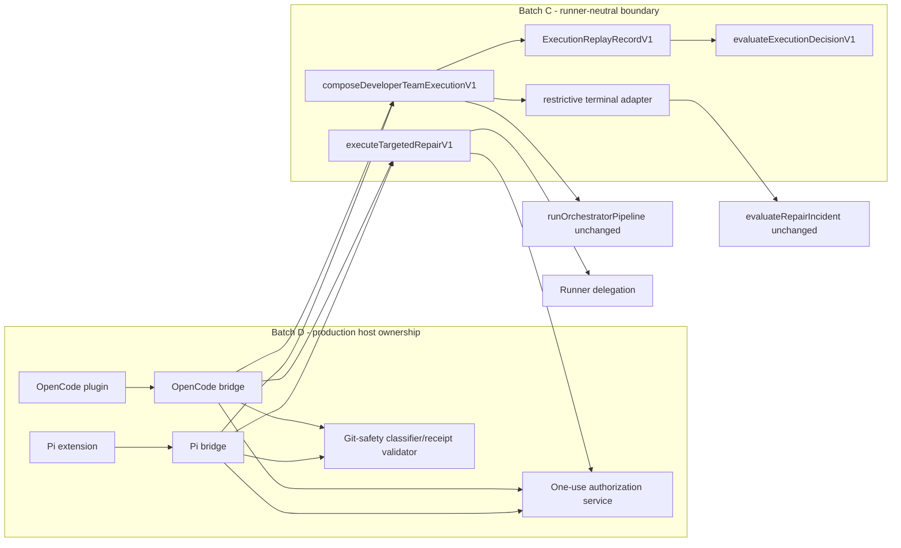

# Design Repair: Batch C / Batch D Execution Boundary Sequencing

## Outcome

Batch C will provide a **one-way, host-facing, production-ready composition boundary** without claiming that it is production-reachable. Batch D will own the first real runner-host callers, per-invocation authorization, runner-native capabilities, and the evidence that satisfies `REQ-DECISION-005`.

This resolves the sequencing contradiction without weakening the approved system:

- Batch C owns pure decision semantics, mandatory fail-closed inputs, legacy/shadow composition, canonical replay, restrictive terminal governance, and a narrow targeted-repair effect boundary.
- Batch D owns OpenCode/Pi host bootstrap, per-execution context construction, one-use authorization, capability creation, immediate pre-delegation validation, and real non-test reachability.
- `runOrchestratorPipeline()` and `evaluateRepairIncident()` retain their current signatures and legacy outcomes.
- Active/promoted OpenSpec artifacts and registry records remain authoritative. Runtime records, adapters, prompts, telemetry, and adaptive memory cannot override them.
- Git discard protection, explicit modification authorization, security/data-loss hard stops, Full-SDD floors, independent quality, append-only history, and excluded-WIP protection remain non-configurable.

## Source

- Change: `developer-team-execution-convergence`
- Official inputs: `proposal.md`, `spec.md`, `design.md`, `tasks.md`, `repair-incident.md`, `verify-batch-c-direct-recovery.md`, and `review-batch-c-direct-recovery.md`
- Spec status: available
- Repair scope: Batch C EG3 plus the Batch D EG4 bridge contract needed to correct sequencing; no Batch D runner/adapter implementation is authorized by this artifact
- Adaptive context: advisory Supermemory context was loaded; official artifacts and current source remain authoritative

## Current Source Evidence

| Evidence | Current source | Design consequence |
|---|---|---|
| Circular composition | `orchestrator/orchestrator-pipeline.ts` imports `execution/execution-control-plane.ts`, which imports `runOrchestratorPipeline()` back from the orchestrator module | The legacy module must stop importing or re-exporting execution code. Composition belongs under `execution/` and may depend one-way on the legacy orchestrator. |
| No production caller | Graph traces show only `execution-control-plane.test.ts` calls `runProductionExecutionDecisionPipelineV1()` and `executeDeveloperTeamStepV1()` | Batch C cannot claim `REQ-DECISION-005`. Batch D must supply and prove the runner-host callers. |
| Authority/Git fail open | `ExecutionDecisionKernelInputV1.authorizationValid` and `destructiveGitConfirmed` are optional; the planner maps absent Git confirmation to `true` | Replace booleans and shorthands with mandatory discriminated states. Missing fields are invalid evidence; explicit missing/rejected states stop with distinct rationales. |
| Protected-risk drift | `failure-delta.ts` recognizes `category === "data-loss"`; the kernel-local predicate does not | One shared classifier must feed delta and kernel behavior. |
| Invalid path is not total | The catch path hashes raw rejected dossier data and parser text; cycles throw and secret-bearing values can affect identity | Invalid identity must be derived only from bounded allowlisted classifications, never raw values or raw-derived hashes. |
| Shadow can omit legacy | `legacyInput` is optional and shadow can return `legacy === undefined` | Legacy input and explicit legacy result composition are mandatory for every mode. Shadow always leaves legacy authoritative. |
| Effect is insufficiently bound | The current capability has only authority digest and one target | Bind the capability digest to runner, invocation, batch, dossier, decision, action, exact target, and Git-effect class. Keep the function itself ephemeral and outside canonical records. |
| Batch D host support does not exist | Both execution probes report `invocationHook: false`; no adapter bridge, plugin/extension asset, or invocation authorization service exists | Real reachability is a Batch D acceptance gate, not Batch C evidence. Unsupported hooks remain static-compatible/shadow and block active completion. |
| Existing launch asymmetry | `main.tsx` calls `runPiLaunch()` and spawns its plan; `runOpenCodeLaunch()` has no inbound caller | Pi reachability must flow through its spawned extension. OpenCode reachability must flow through an actually installed runner plugin, not the unused launch helper. |

## Architecture Decision

### Decision

Adopt a ports-and-composition boundary with this dependency direction:

```text
runner host (Batch D)
  -> adapter bridge (Batch D)
    -> execution composition (Batch C)
      -> legacy orchestrator + terminal governance (existing, unchanged)
      -> pure decision kernel (Batch C)
    -> narrow targeted-repair effect boundary (Batch C)
      -> opaque runner capability (Batch D)
```

The legacy orchestrator never imports execution composition or adapter code. Batch C exports a callable contract; Batch D supplies its first authoritative runtime caller.

### Rejected Alternatives

| Alternative | Rejected because |
|---|---|
| Keep `runProductionExecutionDecisionPipelineV1()` in the legacy orchestrator and rename it again | It preserves the cycle and still mistakes an export/test caller for production reachability. |
| Add a fake non-test caller in Batch C | A caller without a runner-supplied dossier, authority, Git state, governance context, and capability cannot own effects and would be false evidence. |
| Implement OpenCode/Pi bridges during Batch C | That crosses the authorized EG3/EG4 boundary and couples kernel repair to adapter-specific authorization work. |
| Let adapters call the kernel directly | Adapters could diverge, reinterpret actions, omit legacy composition, or widen scope. |
| Preserve optional booleans for compatibility | Optional authority or Git state recreates default-allow behavior. Safety repair takes precedence over source compatibility for the unaccepted Batch C API. |
| Hash rejected input for uniqueness | Cycles/proxies can throw and secret-bearing values can influence persisted identity. Classification identity is safer and replayable. |
| Give the effect boundary a generic `invokeAgent(action, target)` port | The adapter could reinterpret non-delegating actions or widen targets. Only a pre-bound targeted-repair capability is accepted. |

## Batch C Boundary

### Module boundary

| Component | Responsibility | Dependency rule |
|---|---|---|
| `orchestrator/orchestrator-pipeline.ts` | Existing audit/risk/quality/loop behavior | Imports no module under `execution/`; body and result stay unchanged. |
| `orchestrator/protected-risk.ts` | One shared protected-risk classification | Pure; imported by delta and kernel only. |
| `orchestrator/decision-kernel.ts` | Base action from validated dossier, authority/Git state, and precomputed terminal guard | Pure; no legacy pipeline, adapter, filesystem, runner, or prompt effects. |
| `orchestrator/repair-loop-governance.ts` | Existing evaluator plus compatibility mapping to a restrictive terminal guard | Existing evaluator remains unchanged; mapping cannot select repair. |
| `execution/execution-control-plane.ts` | Parse/freeze canonical inputs, classify invalid inputs, construct/replay plans | No adapter implementation and no runner bootstrap. |
| `execution/execution-composition.ts` | Host-facing mode composition and one-way call to the unchanged legacy pipeline | May import orchestrator/control-plane modules; no reverse import is permitted. |
| `execution/execution-adapter-port.ts` | Narrow capability descriptor/request/result contract | No generic agent/action port. Capability function is ephemeral. |

### Mandatory host-facing input

The canonical Batch C entry point is `composeDeveloperTeamExecutionV1(input)`. Its input is a mode-discriminated union. Every mode explicitly carries legacy, authority, Git, governance, and effect-binding state; omission is never interpreted as permission.

```ts
type ExecutionAuthorityStateV1 =
  | {
      state: "not-applicable";
      rationaleCode: "LEGACY_AUTHORITY";
    }
  | {
      state: "authorized";
      capabilityDigest: Sha256Digest;
      reference: AuthorizationReferenceV1 & { validation: "accepted" };
    }
  | {
      state: "missing";
      rationaleCode: "AUTHZ_MISSING";
    }
  | {
      state: "invalid";
      rationaleCode: "AUTHZ_INVALID";
      rejectionCode: InvocationAuthorizationRejectionCodeV1;
      reference: (AuthorizationReferenceV1 & { validation: "rejected" }) | null;
    };

type GitSafetyStateV1 =
  | { state: "not-applicable"; rationaleCode: "LEGACY_AUTHORITY" }
  | { state: "not-required"; policyDigest: Sha256Digest }
  | {
      state: "confirmed";
      commandDigest: Sha256Digest;
      confirmationReceiptDigest: Sha256Digest;
    }
  | {
      state: "confirmation-required";
      commandDigest: Sha256Digest;
      rationaleCode: "GIT_SAFETY_CONFIRMATION_REQUIRED";
    }
  | {
      state: "invalid";
      rationaleCode: "GIT_SAFETY_CONFIRMATION_INVALID";
    };

type TerminalGovernanceContextV1 =
  | { kind: "none" }
  | {
      kind: "repair-incident";
      incident: RepairIncident;
      config: RepairGovernanceConfig | "default";
    };

type DeveloperTeamExecutionCompositionInputV1 =
  | {
      schema: "developer-team-execution-composition-v1";
      mode: "legacy";
      dossier: { kind: "none" };
      legacyInput: OrchestratorPipelineInput;
      authority: Extract<ExecutionAuthorityStateV1, { state: "not-applicable" }>;
      gitSafety: Extract<GitSafetyStateV1, { state: "not-applicable" }>;
      governance: TerminalGovernanceContextV1;
      effectBinding: { kind: "none" };
    }
  | {
      schema: "developer-team-execution-composition-v1";
      mode: "shadow";
      dossier: { kind: "execution-dossier-v1"; value: unknown };
      legacyInput: OrchestratorPipelineInput;
      authority: Exclude<ExecutionAuthorityStateV1, { state: "not-applicable" }>;
      gitSafety: Exclude<GitSafetyStateV1, { state: "not-applicable" }>;
      governance: TerminalGovernanceContextV1;
      effectBinding: { kind: "none" };
    }
  | {
      schema: "developer-team-execution-composition-v1";
      mode: "active";
      dossier: { kind: "execution-dossier-v1"; value: unknown };
      legacyInput: OrchestratorPipelineInput;
      authority: Exclude<ExecutionAuthorityStateV1, { state: "not-applicable" }>;
      gitSafety: Exclude<GitSafetyStateV1, { state: "not-applicable" }>;
      governance: TerminalGovernanceContextV1;
      effectBinding: { kind: "none" } | TargetedRepairCapabilityDescriptorV1;
    };
```

Runtime parsing MUST enforce exact keys for every variant. The compatibility shorthands `authorizationValid?: boolean` and `destructiveGitConfirmed?: boolean` are removed. An omitted discriminator or field returns `invalid-evidence`; it does not synthesize `authorized`, `confirmed`, or `not-required`.

### Explicit mode composition

| Mode | Legacy pipeline | V1 kernel | Authoritative path | Batch C effect |
|---|---|---|---|---|
| `legacy` | Required and returned unchanged | Not called | Legacy | None; the existing host continues its unchanged legacy path. |
| `shadow` | Required and returned unchanged | Called with the same validated semantics as active | Legacy | Always none; only a redacted safe comparison is emitted. |
| `active` | Required for compatibility comparison/rollback evidence | Called | V1 only after all floors and activation gates | Only an exact targeted-repair plan can cross the narrow effect API. |

The composed result is also discriminated. It contains the ephemeral full legacy result for the existing host, but only a safe allowlisted `LegacyDecisionProjectionV1` enters comparison telemetry or replay identity. Free-form legacy block/error text and risk-signal evidence are not hashed or persisted.

### Shared protected-risk classifier

Add one pure `classifyProtectedRiskV1(finding)` result with these dimensions:

```ts
interface ProtectedRiskClassificationV1 {
  readonly securityOrDataLoss: boolean;
  readonly highOrCritical: boolean;
  readonly authorizationOrGitSafety: boolean;
  readonly uncoveredRequirement: boolean;
  readonly blocksAutomaticRepair: boolean; // OR of all dimensions
}
```

Classification is true when applicable for `isSecurityRelevant`, category `data-loss`, severity `high|critical`, root cause `security|authorization|git_safety|requirement`, or an uncovered requirement. `failure-delta.ts` uses the dimensions without changing its existing risk-vector meanings; `decision-kernel.ts` uses `blocksAutomaticRepair`. No second kernel-local predicate is allowed.

Consequences:

- Positive shrink may select `targeted_repair` only for low/medium, single-root, implementation-only remaining findings with no protected dimension, no related regression, no Full-SDD/shadow floor, and valid authority/Git state.
- Any security/data-loss protected finding blocks automatic repair even if severity is low.
- New related high/critical, security, data-loss, authorization, or Git-safety regression escalates/stops.
- Requirement gaps route to Spec replan; they never become targeted repair.

### Total invalid-input classification and identity

`classifyInvalidExecutionInputV1(value, failure)` MUST be total and non-throwing:

1. It never recursively walks rejected input.
2. Every property/prototype/key access is individually guarded; a final outer catch returns a fixed `unclassifiable` projection.
3. It emits only allowlisted enums: boundary, value class, key-count bucket, recognized-version class, and parser-failure class.
4. Parser text is mapped to fixed classes such as `unsupported-version`, `exact-keys`, `batch-reference`, `unsafe-content`, `cyclic`, `prototype`, `identity`, `malformed`, or `unknown`; raw text is discarded.
5. Unrecognized strings, keys, values, paths, prompts, proofs, and secrets are neither retained nor hashed.
6. The invalid record digest is computed only from the fixed classification projection. Inputs in the same safe class may intentionally share identity.
7. Cyclic objects, exotic prototypes, throwing getters, revoked proxies, symbols, functions, bigint values, and secret-bearing objects all return a frozen `invalid-evidence` plan with zero effects.

### Canonical frozen replay record

Replace mutable closure identity with a value contract and a pure replay function:

```ts
type ExecutionReplayRecordV1 =
  | {
      schema: "execution-replay-record-v1";
      outcome: "legacy";
      mode: "legacy";
      policyVersion: "execution-decision-policy-v1";
      legacy: LegacyDecisionProjectionV1;
      inputDigest: Sha256Digest;
    }
  | {
      schema: "execution-replay-record-v1";
      outcome: "valid";
      mode: "shadow" | "active";
      policyVersion: "execution-decision-policy-v1";
      dossier: ExecutionDossierV1;
      authority: Exclude<ExecutionAuthorityStateV1, { state: "not-applicable" }>;
      gitSafety: Exclude<GitSafetyStateV1, { state: "not-applicable" }>;
      terminalGuard: TerminalGuardResultV1;
      legacy: LegacyDecisionProjectionV1;
      effectBinding: { kind: "none" } | TargetedRepairCapabilityDescriptorV1;
      inputDigest: Sha256Digest;
    }
  | {
      schema: "execution-replay-record-v1";
      outcome: "invalid";
      mode: "legacy" | "shadow" | "active";
      policyVersion: "execution-decision-policy-v1";
      invalidInput: InvalidExecutionInputIdentityV1;
      legacy: LegacyDecisionProjectionV1;
      inputDigest: Sha256Digest;
    };

function replayExecutionDecisionV1(
  record: ExecutionReplayRecordV1,
): ExecutionDecisionV1 | InvalidEvidenceResultV1 | undefined;
```

The record is parsed, canonicalized, and deeply frozen before return. `inputDigest` covers the canonical payload excluding itself. Replay reparses the dossier and calls the same pure kernel with the captured authority, Git, terminal, policy, legacy projection, and effect descriptor. It never closes over caller objects. The capability function, raw authorization proof, raw Git command, raw legacy input/result text, raw incident, and raw invalid input never enter the record.

### Terminal governance is restrictive only

`resolveTerminalGovernanceGuardV1()` is the sole compatibility mapping:

| Existing `evaluateRepairIncident()` result | Terminal result | Allowed composition |
|---|---|---|
| `continue` or `repair` | `permit` | Preserve the kernel action; never create `targeted_repair`. |
| `checkpoint` | `checkpoint` | Downgrade only a modifying action to checkpoint; preserve already stricter actions. |
| `replan` | `replan` | Upgrade targeted repair to Design/Task replan; preserve stop/escalate/spec replan. |
| `escalate` | `escalate` | Upgrade unless the base action is already stop. |
| `block` | `stop` | Stop unconditionally. |

The kernel computes the evidence/root-cause action first. Permanent authority, Git, security/data-loss, and Full-SDD floors cannot be weakened by terminal governance or override. Ordered rationale is base rationale first, then terminal rationale. Existing evaluator snapshots remain byte-for-byte behaviorally unchanged.

### Narrow effect API

The canonical effect function is `executeTargetedRepairV1(plan, capability)`. `executeDeveloperTeamStepV1()` remains only as a package-root compatibility facade that delegates to the narrow function and cannot accept a generic adapter.

```ts
interface TargetedRepairCapabilityDescriptorV1 {
  readonly kind: "targeted-repair-capability-v1";
  readonly runnerId: "opencode" | "pi";
  readonly invocationId: string;
  readonly batchId: BatchId;
  readonly batchDigest: Sha256Digest;
  readonly dossierDigest: Sha256Digest;
  readonly decisionDigest: Sha256Digest;
  readonly action: "targeted_repair";
  readonly target: string;
  readonly gitEffect:
    | { kind: "non-destructive" }
    | { kind: "destructive"; commandDigest: Sha256Digest };
  readonly capabilityDigest: Sha256Digest; // hash of the preceding descriptor fields
}

interface TargetedRepairCapabilityV1 {
  readonly descriptor: TargetedRepairCapabilityDescriptorV1;
  invoke(request: TargetedRepairRequestV1): Promise<TargetedRepairInvocationResultV1>;
}
```

Before invoking, Batch C replays and validates the record and requires all of the following:

- active mode and exact `targeted_repair` decision;
- authorized authority state whose capability digest equals the descriptor digest;
- exact batch, dossier, decision, invocation, action, and target binding;
- target is one normalized allowed target and does not equal or intersect a blocked target;
- no shadow-only or Full-SDD automatic-modification floor;
- non-destructive capability with `gitSafety=not-required|confirmed`, or destructive capability with exact matching confirmed command digest;
- no missing/invalid/confirmation-required Git state;
- one immutable request derived from the plan, with no caller-supplied action or target override.

Every other action returns a non-invoking safe result. Adapter exceptions become `adapter-error`; they do not trigger fallback or retry. Batch D's capability closure must independently enforce the same target/Git binding at the actual runner tool/delegation boundary.

## Batch D Bridge

### Runner-neutral bridge contract

Each adapter implements the same `DeveloperTeamRunnerHostBridgeV1` and constructs one validated context per concrete execution. The runner-native event is untrusted adapter input; the bridge validates it before calling Batch C.

```ts
interface ValidatedDeveloperTeamHostContextV1 {
  readonly schema: "validated-developer-team-host-context-v1";
  readonly executionId: string;
  readonly runnerId: "opencode" | "pi";
  readonly mode: "legacy" | "shadow" | "active";
  readonly dossier:
    | { kind: "none" }
    | { kind: "execution-dossier-v1"; value: ExecutionDossierV1 };
  readonly authority: ExecutionAuthorityStateV1;
  readonly gitSafety: GitSafetyStateV1;
  readonly legacyInput: OrchestratorPipelineInput;
  readonly governance: TerminalGovernanceContextV1;
  readonly effect:
    | { kind: "none" }
    | { kind: "targeted-repair"; capability: TargetedRepairCapabilityV1 };
}

interface DeveloperTeamRunnerHostBridgeV1 {
  readonly runnerId: "opencode" | "pi";
  readonly capabilities: {
    invocationAuthorizationV1: boolean;
    perExecutionDossierV1: boolean;
    targetedRepairCapabilityV1: boolean;
  };
  execute(event: unknown): Promise<DeveloperTeamHostExecutionResultV1>;
}
```

### Context construction contract

For each execution, the bridge MUST provide:

1. **Dossier:** parse/freeze the exact per-execution `ExecutionDossierV1`; reject version, digest, batch, task-artifact, or change mismatch. Do not reuse a prior execution's parsed object.
2. **Authority:** validate the V1 envelope against change, batch ID/digest, task-artifact digest, role, action, exact target, blocked targets, expiry, nonce, and user-authorization receipt. Pass only a safe `AuthorizationReferenceV1`, rejection code, and capability digest to Batch C; never pass/log the proof or key.
3. **Capability digest:** hash an immutable descriptor bound to runner, invocation, batch, dossier, decision action, target, and Git-effect class. The accepted authority state and capability descriptor must carry the same digest.
4. **Git state:** classify the requested effect as non-destructive or destructive. Destructive capability creation requires a separately validated exact-command/new-message confirmation receipt whose command digest matches the descriptor. A broad runner delegate that cannot prohibit unconfirmed destructive Git must not be exposed as non-destructive.
5. **Legacy input:** derive the existing `OrchestratorPipelineInput` from the same host event and preserve the existing legacy call/result semantics. It is mandatory in legacy, shadow, and active modes.
6. **Governance context:** explicitly provide `none` or a change-matched repair incident plus resolved/default governance config. Batch C records only the restrictive mapped result.
7. **Narrow effect:** provide `none` or one targeted-repair capability. The closure atomically revalidates and reserves the one-use authorization immediately before delegation; reservation occurs before the runner can perform effects and remains consumed if launch fails.

The Batch D authorization claims contract must add an exact allowlisted `allowedActions` field containing `targeted_repair`; static cards, prompt text, installation state, or an earlier invocation are not authority.

### Real reachability ownership

- **Pi:** `main.tsx` already calls `runPiLaunch()` and spawns its returned plan. Batch D adds the packaged extension to `buildPiTeamLaunchPlan()`/profile materialization so the spawned Pi host loads the extension; the extension registers the supported invocation hook and calls `createPiDeveloperTeamExecutionBridgeV1().execute()`.
- **OpenCode:** `runOpenCodeLaunch()` currently has no inbound caller and cannot be reachability evidence. Batch D must materialize and register the packaged OpenCode plugin through the existing developer-team install path used by real OpenCode environments. The loaded plugin calls `createOpenCodeDeveloperTeamExecutionBridgeV1().execute()`.
- Both adapter bridges call `composeDeveloperTeamExecutionV1()`. Only an active targeted-repair plan calls `executeTargetedRepairV1()`.
- `getOpenCodeExecutionProbeCapabilities()` and `getPiExecutionProbeCapabilities()` may report an invocation hook only after the actual packaged hook entry point and conformance evidence exist.
- If either runner lacks a supported hook, that adapter remains `static-compatible`/shadow with a false capability report. It cannot enter `invocation-required` or satisfy production reachability by placeholder, prompt, export, or direct test call.

### Sequence

```mermaid
sequenceDiagram
  autonumber
  participant H as Runner-native host hook (Batch D)
  participant B as Adapter bridge (Batch D)
  participant A as Authorization/Git services (Batch D)
  participant C as Composition boundary (Batch C)
  participant L as Legacy pipeline/governance
  participant K as Decision kernel/replay
  participant E as Narrow effect boundary
  participant R as Runner delegation

  H->>B: Per-execution runner event
  B->>B: Parse/freeze dossier; derive legacy input and governance
  B->>A: Validate envelope and Git state; build bound capability
  A-->>B: Authority state + capability digest + Git state + capability/none
  B->>C: Mandatory validated composition input
  C->>L: Run unchanged legacy pipeline; map terminal governance
  L-->>C: Legacy result + restrictive terminal guard
  C->>K: Frozen canonical replay record
  K-->>C: Action + ordered rationales
  alt legacy or shadow
    C-->>B: Legacy-authoritative result + safe comparison; no V1 effect
    B-->>H: Continue unchanged legacy host path
  else active non-delegating action
    C-->>B: Diagnosis/replan/checkpoint/escalate/stop; no capability call
  else active targeted repair
    C-->>B: Bound targeted-repair plan
    B->>E: Plan + matching opaque capability
    E->>A: Immediate atomic revalidation/nonce reservation
    A-->>E: Accepted once or safe denial
    E->>R: Immutable targeted-repair request
    R-->>E: Normalized result
    E-->>B: Invoked or safe reason code
  end
```

### Component diagram



## C-R2–C-R5 Corrections

| Finding | Exact correction | Closure evidence |
|---|---|---|
| `C-R2` | Mandatory discriminated authority/Git states; no boolean shorthands/defaults; distinct missing/invalid rationale; capability/Git descriptor matching at plan and effect boundaries | Individually named omission, missing, invalid, not-required, required, confirmed, mismatch, and zero-effect tests |
| `C-R3` | One shared protected-risk classifier used by delta and kernel, explicitly including data loss, high/critical, security, authorization, Git safety, and uncovered requirement | Individually named positive-shrink and new-related-regression test for every protected class |
| `C-R4` | Total bounded invalid classifier; fixed classification identity; no raw/raw-derived hash; canonical deeply frozen replay record and pure replay function | Individually named cycle, prototype, getter, revoked proxy, secret sentinel, unsupported version, mutation, and replay tests |
| `C-R5` | Mandatory legacy input in every mode; explicit legacy/shadow/active result union; legacy authoritative in shadow; terminal mapping restrictive-only; narrow pre-bound targeted-repair capability | Individually named no-dossier legacy, shadow comparison, shadow zero-effect, every terminal outcome, non-delegating action, scope/digest/Git denial, and adapter-error tests |

## File / Symbol Map

### Batch C correction

| Path | Action | Exact symbols / impact |
|---|---|---|
| `packages/sdd-runtime/src/orchestrator/orchestrator-pipeline.ts` | Modify | Remove imports/re-exports/wrapper that point to `execution/`; keep `runOrchestratorPipeline`, input, result, defaults, and legacy body unchanged. |
| `packages/sdd-runtime/src/orchestrator/protected-risk.ts` | Create | `classifyProtectedRiskV1`, `ProtectedRiskClassificationV1`. |
| `packages/sdd-runtime/src/orchestrator/failure-delta.ts` | Modify | Consume shared classification dimensions without changing established risk-vector/delta semantics. |
| `packages/sdd-runtime/src/orchestrator/decision-kernel.ts` | Modify | Mandatory authority/Git/terminal inputs; shared risk classifier; exact rationale precedence; no direct incident evaluation. |
| `packages/sdd-runtime/src/orchestrator/repair-loop-governance.ts` | Modify | `resolveTerminalGovernanceGuardV1`; preserve `evaluateRepairIncident()` and existing types/results. |
| `packages/sdd-runtime/src/execution/execution-control-plane.ts` | Modify | Correct discriminated input/result types, `classifyInvalidExecutionInputV1`, replay record build/parse, `replayExecutionDecisionV1`; remove raw invalid hashing and optional shorthands. |
| `packages/sdd-runtime/src/execution/execution-composition.ts` | Create | `composeDeveloperTeamExecutionV1`; one-way legacy composition; canonical supported home for the compatibility `runProductionExecutionDecisionPipelineV1` facade, which is deprecated and is never reachability evidence. |
| `packages/sdd-runtime/src/execution/execution-adapter-port.ts` | Modify | Bound descriptor, immutable request/result, `TargetedRepairCapabilityV1`, `executeTargetedRepairV1`; no generic adapter. |
| `packages/sdd-runtime/src/index.ts` | Modify | Add canonical Batch C exports; preserve existing package-root exports. Deep re-export from the orchestrator module is removed to break the cycle. |
| `packages/sdd-runtime/src/orchestrator/{decision-kernel,repair-loop-governance,orchestrator-pipeline}.test.ts` | Modify | Individual exact kernel, terminal, legacy, and import-direction cases. |
| `packages/sdd-runtime/src/execution/execution-control-plane.test.ts` | Modify | Individual authority/Git/invalid/replay/effect cases. |
| `packages/sdd-runtime/src/execution/execution-composition.test.ts` | Create | Individual legacy/shadow/active composition and one-way boundary cases. |
| `packages/sdd-runtime/src/contracts/batch-b-replacement.test.ts` | Modify | Update the literal exact package-root export oracle and stale count/name comment; no subset/count oracle. |

### Batch D implementation impact (not implemented now)

| Path | Action | Exact symbols / impact |
|---|---|---|
| `packages/sdd-runtime/src/execution/invocation-authorization-service.ts` | Create | `createInvocationAuthorizationServiceV1`, validation/reservation/revocation/restart semantics, safe rejection enum. |
| `packages/sdd-runtime/src/contracts/invocation-authorization.ts` | Modify | Add exact `allowedActions`; preserve proof-free `AuthorizationReferenceV1`. |
| `packages/sdd-runtime/src/execution/execution-control-plane.ts` | Modify only if needed by EG4 | Integrate immediate authority reservation result at the narrow effect boundary without changing Batch C decisions. |
| `packages/adapter-opencode/src/developer-team-execution-bridge.ts` | Create | `createOpenCodeDeveloperTeamExecutionBridgeV1`. |
| `assets/opencode/plugins/developer-team-execution.ts` | Create | Real runner plugin registration and bridge call. |
| `packages/adapter-opencode/src/{developer-team-install,prompt-generation,index}.ts` | Modify | Materialize/register plugin, safe capability report, additive exports; prompt remains defense-in-depth. |
| `packages/adapter-pi/src/developer-team-execution-bridge.ts` | Create | `createPiDeveloperTeamExecutionBridgeV1`. |
| `assets/pi/extensions/developer-team-execution.ts` | Create | Real runner extension registration and bridge call. |
| `packages/adapter-pi/src/{developer-team-install,pi-team-launch,pi-team-profile,index}.ts` | Modify | Package/load extension, safe capability report, additive exports. |
| `apps/cli/src/{pi-launch-command,opencode-launch-command}.ts` | Modify only as required | Carry runtime descriptor/bootstrap. `main.tsx` Pi spawn path remains unchanged unless the supported hook proves otherwise. The unused OpenCode helper is not reachability evidence. |
| Adapter/shared conformance tests and package metadata | Create/modify | Explicit per-adapter tests and packaged asset/dependency proof. |

No registry coordinator, registry YAML writer, lane router, prompt compaction, generated output, build-info, archive, or excluded `runner-capability-standardization` path belongs to this repair.

## Exact Test Matrices

### Test rule

Every row below is one individually named `test(...)` with exact full action, ordered rationale array, terminal result, digest/replay result, authority/Git reason, legacy authority, and effect call count as applicable. Fixture builders may remove setup duplication, but loops, parameterized aggregate tables, `toMatchObject`, broad `toThrow`, smoke counts, subset export checks, and one test that iterates multiple rows do not satisfy the oracle.

### Batch C matrix

| ID | Individual case | Exact proof |
|---|---|---|
| C-ARCH-01 | Legacy orchestrator has no execution import | One-way dependency; unchanged legacy snapshot. |
| C-ARCH-02 | Host composition calls legacy and kernel from `execution/` | Both results recorded; no production-reachability claim. |
| C-ARCH-03 | Deprecated production-named package facade delegates to canonical composition | Package-root compatibility only; not cited as a host caller. |
| C-AUTH-01 | Authority field omitted at runtime | `invalid-evidence`, zero effects. |
| C-AUTH-02 | Explicit authority `missing` | `stop`, `AUTHZ_MISSING`, zero effects. |
| C-AUTH-03 | Explicit authority `invalid` | `stop`, `AUTHZ_INVALID`, zero effects. |
| C-AUTH-04 | Authorized state lacks/mismatches accepted reference or capability digest | `invalid-evidence` or `modification-not-authorized`, zero effects as appropriate to parse/effect stage. |
| C-GIT-01 | Git field omitted | `invalid-evidence`, zero effects. |
| C-GIT-02 | `confirmation-required` | `stop`, `GIT_SAFETY_CONFIRMATION_REQUIRED`, zero effects. |
| C-GIT-03 | `invalid` | `stop`, `GIT_SAFETY_CONFIRMATION_INVALID`, zero effects. |
| C-GIT-04 | Destructive capability with `not-required` | `modification-not-authorized`, zero effects. |
| C-GIT-05 | Destructive capability command digest differs from confirmation | `modification-not-authorized`, zero effects. |
| C-GIT-06 | Matching confirmed destructive capability | Exactly one invocation when every other targeted-repair condition is valid. |
| C-RISK-01 | Positive shrink leaves critical implementation finding | No targeted repair; exact escalation rationale. |
| C-RISK-02 | Positive shrink leaves high implementation finding | No targeted repair; `HIGH_RISK_REPAIR_FORBIDDEN`. |
| C-RISK-03 | Positive shrink leaves low security-relevant finding | Escalate; security rationale. |
| C-RISK-04 | Positive shrink leaves low `data-loss` finding | Escalate; data-loss rationale. |
| C-RISK-05 | Positive shrink leaves authorization finding | Stop/escalate per authority precedence; never repair. |
| C-RISK-06 | Positive shrink leaves Git-safety finding | Stop; never repair. |
| C-RISK-07 | Positive shrink leaves uncovered requirement | `replan_spec`; never repair. |
| C-RISK-08 | New low related implementation regression | No modification; Design/Task replan. |
| C-RISK-09 | New medium related implementation regression | No modification; Design/Task replan. |
| C-RISK-10 | New low data-loss regression | Escalate/stop; never repair. |
| C-ROUTE-01 | Unchanged unrelated baseline only | Quarantined from progress and not claimed resolved/repaired. |
| C-ROUTE-02 | Invalid oracle | `correct_oracle`; zero effects. |
| C-ROUTE-03 | Ambiguous runtime/environment evidence first diagnosis | `diagnose_runtime`; zero effects. |
| C-ROUTE-04 | No progress after diagnosis/repeated fingerprint | Replan/escalate according to terminal evidence; no repair. |
| C-ROUTE-05 | Mixed implementation and runtime roots with positive movement | Replan; no targeted repair. |
| C-ROUTE-06 | Full-SDD lane with positive implementation shrink | Full-SDD rationale; zero automatic effects. |
| C-ROUTE-07 | Low-risk single-root implementation positive shrink | Exact `targeted_repair` and ordered rationale. |
| C-ROUTE-08 | No findings with pending stage | `advance_verification`. |
| C-ROUTE-09 | No findings with completed stages | `complete`. |
| C-REVIEW-01 | Blocking Review finding lacks accepted anchor | `invalid-evidence`; zero effects. |
| C-REVIEW-02 | Review finding is batch-related regression | Classified/routed as related; no silent new scope. |
| C-REVIEW-03 | Review finding is unrelated baseline | Quarantined and non-blocking for batch progress. |
| C-TERM-01 | Governance `continue` with non-positive base action | Base action unchanged; no manufactured repair. |
| C-TERM-02 | Governance `repair` with non-repair base action | Base action unchanged; no manufactured repair. |
| C-TERM-03 | Soft budget/checkpoint with targeted base action | `checkpoint`, base rationale then `TERMINAL_CHECKPOINT`. |
| C-TERM-04 | Repeated fingerprint/replan with targeted base action | Design/Task replan, then `TERMINAL_REPLAN`. |
| C-TERM-05 | Escalation threshold | `escalate`, ordered terminal rationale. |
| C-TERM-06 | Hard budget/block | `stop`, `TERMINAL_BUDGET_BLOCK`. |
| C-TERM-07 | Override attempts to bypass authority/Git/security/Full-SDD floor | Floor remains; zero effects. |
| C-LEGACY-01 | Explicit legacy/no-dossier input | Exact existing `runOrchestratorPipeline()` result; no V1 decision/effect. |
| C-SHADOW-01 | Shadow lacks legacy input | Parse/type rejection; `invalid-evidence`. |
| C-SHADOW-02 | Valid shadow input | Legacy result present and authoritative; V1 comparison present; zero V1 effects. |
| C-SHADOW-03 | Shadow recommendation is targeted repair | Legacy remains authoritative; capability cannot be supplied/invoked. |
| C-REPLAY-01 | Valid record replayed twice | Exact decision/digest/action/ordered rationales. |
| C-REPLAY-02 | Caller mutates original dossier/authority/governance after compose | Frozen record and replay unchanged. |
| C-REPLAY-03 | Replay record field mutation attempted | Mutation fails/has no effect; parser rejects forged digest. |
| C-INVALID-01 | Cyclic dossier | Frozen `invalid-evidence`; classifier does not throw; zero effects. |
| C-INVALID-02 | Non-plain/prototype-bearing dossier | Safe fixed classification; zero effects. |
| C-INVALID-03 | Throwing getter | Safe fixed classification; zero effects. |
| C-INVALID-04 | Revoked proxy | `unclassifiable` fallback; zero effects. |
| C-INVALID-05 | Secret-sentinel-bearing rejected input | Sentinel absent from serialized plan/record/diagnostic; digest equals class identity, not raw input. |
| C-INVALID-06 | Unsupported contract version | Safe unsupported-version identity; zero effects. |
| C-EFFECT-01 | Capability digest mismatch | `modification-not-authorized`, call count zero. |
| C-EFFECT-02 | Target not in exact allowed scope | `modification-not-authorized`, call count zero. |
| C-EFFECT-03 | Target equals/intersects blocked scope | `modification-not-authorized`, call count zero. |
| C-EFFECT-04 | Decision is diagnosis/oracle/spec/design/checkpoint/escalate/stop/complete | No capability invocation; each action has its own explicit test. |
| C-EFFECT-05 | Capability throws | `adapter-error`, no fallback/retry. |
| C-EXPORT-01 | Package root exact exports | Complete literal sorted equality; no stale count, subset, or aggregate oracle. |

### Batch D matrix

#### Authorization service — one test per row

| ID | Case | Expected result |
|---|---|---|
| D-AUTH-01 | Exact valid envelope | One matching capability may be reserved and used once. |
| D-AUTH-02 | Missing envelope | `AUTHZ_MISSING`; zero delegation. |
| D-AUTH-03 | Tampered proof/claims | Safe rejection; zero delegation; no proof leakage. |
| D-AUTH-04 | Expired envelope | Safe expiry code; zero delegation. |
| D-AUTH-05 | Future-issued envelope | Safe time code; zero delegation. |
| D-AUTH-06 | Replayed nonce | Safe replay code; zero second delegation. |
| D-AUTH-07 | Service restart | Prior process-local envelope invalid; zero delegation. |
| D-AUTH-08 | Malformed envelope | Safe malformed code; zero delegation. |
| D-AUTH-09 | Revoked envelope | Safe revoked code; zero delegation. |
| D-AUTH-10 | Role mismatch | Zero delegation. |
| D-AUTH-11 | Change mismatch | Zero delegation. |
| D-AUTH-12 | Batch ID mismatch | Zero delegation. |
| D-AUTH-13 | Batch digest mismatch | Zero delegation. |
| D-AUTH-14 | Task-artifact digest mismatch | Zero delegation. |
| D-AUTH-15 | Action not exactly `targeted_repair` | Zero delegation. |
| D-AUTH-16 | Target mismatch or overbroad requested scope | Zero delegation. |
| D-AUTH-17 | Blocked target intersection | Zero delegation. |
| D-AUTH-18 | Runner launch fails after nonce reservation | Nonce remains consumed; retry requires a new envelope. |
| D-AUTH-19 | Diagnostic/reference serialization | No proof, HMAC key, raw receipt, command, prompt, or secret sentinel. |

#### Adapter conformance — explicit OpenCode and Pi tests for each row

The shared fixture package supplies inputs and assertions, but each adapter file declares a separately named test for every adapter/case pair; no loop over adapters or cases is acceptance evidence.

| ID | Case | Expected equivalent outcome |
|---|---|---|
| D-BRIDGE-01 | Valid active targeted repair | Real bridge calls Batch C composition and narrow effect once; normalized success matches. |
| D-BRIDGE-02 | Missing/invalid authorization | No runner delegation; same safe code. |
| D-BRIDGE-03 | Git confirmation required/mismatch | No runner delegation; same safe code. |
| D-BRIDGE-04 | Shadow execution | Kernel and legacy comparison run; legacy remains authoritative; V1 call count zero. |
| D-BRIDGE-05 | Legacy/no-dossier execution | Existing legacy path/result remains exact. |
| D-BRIDGE-06 | Non-delegating kernel action | No capability/runner invocation. |
| D-BRIDGE-07 | Dossier/batch/task mismatch | `invalid-evidence`; zero delegation. |
| D-BRIDGE-08 | Capability target/digest mismatch | `modification-not-authorized`; zero delegation. |
| D-BRIDGE-09 | Runner adapter throws | Same `adapter-error`; no fallback/retry. |
| D-BRIDGE-10 | Unsupported host hook | Capability report false; static-compatible/shadow only; active denied. |

#### Production reachability — no direct helper-call substitute

| ID | Individual evidence | Required proof |
|---|---|---|
| D-REACH-01 | Pi launch plan packages/loads extension | Existing `main.tsx -> runPiLaunch -> spawnInherited` path loads the real extension entry. |
| D-REACH-02 | Pi extension hook invokes Pi bridge | Non-test inbound path reaches bridge `execute()`. |
| D-REACH-03 | Pi bridge invokes Batch C composition/effect | Real composition input/output and active call count recorded. |
| D-REACH-04 | OpenCode install plan materializes/registers plugin | Real installed plugin asset is present in package/install manifest. |
| D-REACH-05 | OpenCode plugin hook invokes OpenCode bridge | Non-test inbound path reaches bridge `execute()`; unused CLI helper is not counted. |
| D-REACH-06 | OpenCode bridge invokes Batch C composition/effect | Real composition input/output and active call count recorded. |
| D-REACH-07 | Packaged artifact audit | Both entry assets and runtime dependencies are present in built package/binary output. |
| D-REACH-08 | Inbound-call architecture audit | Production paths reach `composeDeveloperTeamExecutionV1`; active targeted path also reaches `executeTargetedRepairV1`; tests/exports/prompts are excluded from caller count. |
| D-REACH-09 | Runner-host end-to-end fixture for OpenCode | Actual plugin registration + fake host event + real Batch C boundary + injected delegate; no direct control-plane call. |
| D-REACH-10 | Runner-host end-to-end fixture for Pi | Actual extension registration + fake host event + real Batch C boundary + injected delegate; no direct control-plane call. |

Batch D satisfies `REQ-DECISION-005` only when both a non-test caller graph and the corresponding runner-host fixture are green. A passing unit test that imports the composition function directly is insufficient.

## Compatibility, Migration, and Rollback

### Compatibility

- `runOrchestratorPipeline()` and `evaluateRepairIncident()` remain exact legacy APIs with unchanged results and snapshots.
- Legacy/no-dossier mode remains explicit and executable. Existing repair incidents are read/adapted in memory and never rewritten.
- Package-root APIs are additive. The failed Batch C optional booleans are intentionally replaced before acceptance because retaining default-allow behavior is unsafe.
- The production-named facade may remain at the package root only as a deprecated compatibility alias located under `execution/`; it is not exported from the legacy orchestrator module and is never accepted as production evidence.
- Existing YAML, artifacts, provenance, warnings, events, and append-only history are untouched. No dual-write or backfill is introduced.
- Prompt/static authorization remains defense-in-depth and cannot satisfy invocation-required mode.

### Migration order

1. Correct Batch C contracts, import direction, semantics, and exact tests while `decisionKernel=shadow` and adapter probes remain false.
2. Accept Batch C as host-ready only; explicitly leave `REQ-DECISION-005` production reachability pending Batch D.
3. Implement Batch D authorization service and both bridges against the frozen Batch C contract.
4. Prove actual packaged host hooks, explicit adapter conformance, and non-test inbound paths.
5. Keep each adapter `static-compatible`/shadow until its hook and shared semantics are green; activation still waits for the approved rollout observation gates.

### Rollback

| Failure point | Rollback behavior |
|---|---|
| Batch C kernel/composition failure in shadow | Select `decisionKernel=legacy`; preserve comparison/replay evidence; existing legacy path remains exact. |
| One adapter bridge is unsupported or divergent before gate | Keep that adapter static-compatible/shadow with capability false; do not weaken the other contract. |
| Invocation-required adapter fails after declaration | Stop modification for that adapter; do not silently fall back to static cards. |
| Authorization/Git/replay/safety violation | Pause affected cohort, route Full SDD/fresh Review, preserve evidence, and restore legacy authority where compatible. |

Rollback never deletes or rewrites OpenSpec artifacts/events, never disables authorization or Git protection, never lowers explicit Full SDD, never turns shadow recommendations into effects, and never touches excluded WIP.

## Risks and Blockers

| Risk / blocker | Status | Mitigation / gate |
|---|---|---|
| Current OpenCode/Pi invocation hooks are reported unsupported | Batch D implementation blocker, not a Design blocker | Require real packaged plugin/extension registration and runner-host tests. If unsupported, remain shadow/static-compatible and leave `REQ-DECISION-005` open. |
| OpenCode launch helper is disconnected | Known | Use the actually installed plugin path or explicitly wire a real CLI command in Batch D; never count the helper itself. |
| Corrected V1 input types are source-incompatible with failed optional Batch C calls | Intentional safety correction | Update all in-repository callers/tests in Batch C; preserve only safe package-root compatibility facades. |
| Capability claims could still hide broad runner tools | High | Batch D capability must enforce action/target/Git binding at actual host delegation/tool events; false non-destructive classification fails conformance. |
| Exact matrices are large | Medium | Keep explicit named tests and shared setup builders; do not collapse acceptance into aggregate loops. |

No open product/design decision remains. The only conditional blocker is whether each runner exposes a supportable real invocation hook; absence blocks that adapter's Batch D active completion rather than weakening the contract.

## Task Inputs

The Task Agent should consume these immutable boundaries when repairing the existing EG3/EG4 plan:

- Batch C completion means **host-ready, fail-closed, replayable, legacy-compatible**, not production-reachable.
- Batch D depends on accepted Batch C and owns all real host reachability and one-use authorization.
- Preserve the exact Batch C/D file ownership above; do not move adapter/bootstrap work into Batch C.
- Every listed test row is an independent acceptance oracle; no aggregate/smoke substitute.
- Production evidence must include both a non-test caller path and a runner-host fixture for each adapter.
- Active mode is blocked while capability probes are false or either adapter's semantic/reachability matrix is incomplete.
- Shared registry, existing OpenSpec artifacts, source, tests, generated output, and other files remain outside this Design-repair write.

## Registry Intent

- **phase:** `design`
- **status:** `completed`
- **event:** `design.batch-c.repair.completed`
- **artifact:** `design-repair-batch-c.md`
- **provenance:** `deck-developer-design`; model `openai/gpt-5.6-sol`; focused Batch C/Batch D sequencing repair; registry-deferred; official OpenSpec artifacts plus current source/graph evidence; 2026-07-16
- **immutable notes:** Batch C is host-ready but does not satisfy production reachability; Batch D must prove real OpenCode and Pi runner-host callers before `REQ-DECISION-005` can pass.
