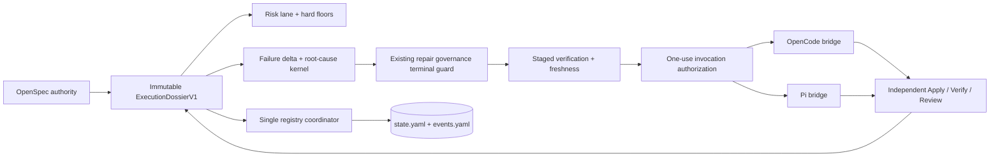

# Design: Developer Team Execution Convergence

## Source and Decision Summary

- Proposal: `developer-team-execution-convergence/proposal.md`
- Exploration: `developer-team-execution-convergence/exploration.md`
- Spec status: not yet available; Spec and Design are running in parallel.
- Registry mode for this phase: deferred. This artifact does not mutate `state.yaml` or `events.yaml`.
- Chosen architecture: an additive, versioned execution control plane in `@deck/sdd-runtime`, with pure contracts and decisions at the center, runner adapters at the effect boundary, and one recoverable registry coordinator.
- Explicit exclusion: all `runner-capability-standardization` WIP, including commit `8c6d167`, its artifacts, branch state, and registry history.

The design keeps `runOrchestratorPipeline()`, `evaluateRepairIncident()`, current registry schemas, static authorization cards, and legacy phase behavior available. New behavior is introduced behind observe/shadow flags and activated as small vertical slices. This is not a workflow-engine rewrite.

## Authority and Source-of-Truth Ordering

When evidence conflicts, components MUST use this order:

1. Explicit user authorization and permanent safety floors: destructive Git confirmation, modification authorization, security hard stops, and explicit Full-SDD requests.
2. Active/promoted OpenSpec artifacts and canonical `state.yaml` / append-only `events.yaml` records.
3. A validated immutable `ExecutionDossierV1` whose component digests trace to those artifacts and registry records.
4. Pure runtime decisions (`ExecutionDecisionV1`, `LaneDecisionV1`, staged-verification transitions) derived from the dossier.
5. Adapter observations and redacted runner results.
6. Prompt instructions and adaptive memory, which remain advisory/defense-in-depth and cannot change authority or widen scope.
7. Telemetry, which is non-authoritative and cannot drive a modifying action directly.

Legacy OpenSpec records remain authoritative as written. The coordinator may adapt them in memory but MUST NOT backfill, normalize, reorder, delete, or rewrite historical files merely to satisfy a new contract.

## Current Architecture Context

- `packages/sdd-runtime/src/orchestrator/orchestrator-pipeline.ts` composes self-audit validation, `computeRiskScore()`, `routeQuality()`, and loop-breaker output. It has only test callers in current source and has no execution-dossier, authorization, registry, or adapter effect boundary.
- `packages/sdd-runtime/src/orchestrator/repair-loop-governance.ts` exposes `evaluateRepairIncident()` with current `continue | repair | checkpoint | replan | escalate | block` behavior. It is test-called, not exported by `packages/sdd-runtime/src/index.ts`, and is budget/fingerprint-led rather than failure-delta-led.
- `packages/sdd-runtime/src/artifact-state/artifact-state-manager.ts` already defines atomic-CAS, idempotency-replay, and event-or-lock capability requirements. Its per-artifact `submitStateUpdate()` cannot safely represent a two-file state/events transaction and therefore remains unchanged for existing callers.
- `packages/core/src/spec-registry/{schema,types,events,yaml,validator,paths}.ts` owns registry parsing and validation. `yaml.ts` parses through the `yaml` package; it does not yet provide an AST-preserving registry merger or deterministic writer. `events.ts#createEvent()` models the separate typed event API and uses time/counter IDs; it is not by itself a deterministic YAML phase-event transaction API.
- `ModificationAuthorization`, `renderApplyAuthorizationCard()`, and `composeApplyAgentPrompt()` in core render prompt text. OpenCode can inject this text while generating installed prompts, but `composeApplyAgentPromptWithAuth()` has no callers. Pi has no equivalent invocation-time path.
- Existing `RunnerCapabilities` and adapter `runAction()` methods are installation/configuration capabilities. They MUST NOT be overloaded with Developer Team execution semantics.
- OpenCode and Pi launch boundaries install/materialize team content and then launch external runners. A new runner-native execution bridge is therefore required; static prompt installation cannot become invocation authority.

## Proposed Architecture

### Component Diagram

```mermaid
flowchart TB
  subgraph Authority[Authoritative inputs]
    U[Explicit user authorization]
    O[OpenSpec artifacts + registry]
    P[Project policy]
  end

  subgraph Runtime[@deck/sdd-runtime]
    C[Versioned contract parsers\ncanonicalize + redact + freeze]
    D[ExecutionDossierV1]
    R[Risk lane selector]
    K[Failure delta + decision kernel]
    G[Existing repair governance\nterminal guard]
    V[Verification/freshness scheduler]
    RC[Registry coordinator]
    AI[Invocation authorization issuer/validator]
  end

  subgraph Adapters[Runner effect adapters]
    OC[OpenCode execution bridge]
    PI[Pi execution bridge]
  end

  subgraph Effects[Effects]
    A[Apply / Verify / Review invocations]
    Y[(state.yaml + events.yaml)]
    T[Safe local telemetry]
  end

  U --> C
  O --> C
  P --> C
  C --> D
  D --> R
  D --> K
  K --> G
  R --> V
  G --> V
  V --> AI
  AI --> OC
  AI --> PI
  OC --> A
  PI --> A
  A --> D
  D --> RC
  RC --> Y
  R -. allowlisted events .-> T
  K -. allowlisted events .-> T
  RC -. allowlisted events .-> T
```

### Package and Module Boundaries

| Component | Responsibility | Boundary rule | Change |
|---|---|---|---|
| `@deck/sdd-runtime/contracts` | Parse, normalize, redact, hash, version, and freeze execution dossier components. | No filesystem, runner, clock, or prompt effects. | Additive |
| `@deck/sdd-runtime/orchestrator` | Compute failure deltas, root cause, lane, next action, verification stage, and freshness. | Pure functions; injected policy/clock only where needed. | Additive |
| `@deck/sdd-runtime/execution` | Production control-plane boundary; sequence plans, invoke ports, consume immutable results. | Adapters perform effects but cannot reinterpret a decision or widen scope. | New |
| `@deck/sdd-runtime/artifact-state` | Validate intents and coordinate recoverable state/events commits. | Exactly one active writer in centralized mode; pair-CAS, idempotency, roll-forward recovery. | Additive |
| `@deck/core/spec-registry` | Registry document types, AST-preserving merge, path rules, in-memory and on-disk validation. | Preserve `spec-registry-v1`, `spec-registry-events-v1`, unknown fields, comments, and history. | Additive/refactor-preserving |
| `@deck/core/config` | Resolve feature flags and adapter-specific activation. | Safe defaults; explicit Full SDD and permanent floors cannot be disabled. | Additive |
| `@deck/core/teams/developer` | Human-readable invariant summaries and phase return shapes. | Prompt text is never authorization or state-transition authority. | Modified last |
| OpenCode/Pi adapter execution bridges | Translate validated invocation requests to runner-native delegation and return normalized results. | Shared conformance contract; no adapter-specific decision semantics. | New |
| CLI launch composition | Resolve configuration, install/bootstrap the runner bridge, and pass a control-plane descriptor. | Does not contain kernel logic. | Modified |

## Versioned Contracts and Public/Internal Interfaces

All public wire contracts use an exact `schema` discriminant and additive optional fields. Unknown major schema values fail closed. Unknown optional fields on a known schema are retained by adapters but excluded from decision inputs until recognized. Public contract modules are exported from `packages/sdd-runtime/src/index.ts`; internal canonicalization and opaque proof-key handles are not exported.

### Shared primitives

```ts
type Sha256Digest = `sha256:${string}`;
type ChangeId = string;
type BatchId = `batch:v1:${string}`;
type FindingId = `finding:v1:${string}`;
type DossierId = `dossier:v1:${string}`;

interface ContractRefV1<TSchema extends string> {
  schema: TSchema;
  id: string;
  digest: Sha256Digest;
}

interface ProvenanceRefV1 {
  actor: string;                  // canonical agent/runner role ID, not free-form identity data
  artifact?: string;              // safe repository-relative OpenSpec path
  eventId?: string;
  issuedAt: string;               // injected ISO-8601 timestamp
}
```

### Apply batch and dossier

Placement: `packages/sdd-runtime/src/contracts/apply-batch.ts` and `execution-dossier.ts`.

```ts
interface ApplyBatchContractV1 {
  schema: "apply-batch-v1";
  batchId: BatchId;
  digest: Sha256Digest;
  changeId: ChangeId;
  taskIds: readonly string[];     // canonical task order
  dependencies: readonly { before: string; after: string }[];
  ownerRole: "apply-general" | "apply-backend" | "apply-frontend";
  allowedTargets: readonly string[];
  blockedTargets: readonly string[];
  acceptanceObligations: readonly string[];
  verificationPlan: readonly VerificationStagePlanV1[];
  artifactDigests: Readonly<Record<string, Sha256Digest>>;
  authorizationGrantRef: Sha256Digest;
  provenance: ProvenanceRefV1;
}

interface ExecutionDossierV1 {
  schema: "execution-dossier-v1";
  dossierId: DossierId;
  digest: Sha256Digest;
  revision: number;
  previousDigest?: Sha256Digest;
  batch: ApplyBatchContractV1;
  priorManifest?: FailureManifestV1;
  currentManifest?: FailureManifestV1;
  delta?: FailureDeltaV1;
  decision?: ExecutionDecisionV1;
  lane: LaneDecisionV1;
  verification: StagedVerificationStateV1;
  causalContext: CausalContextV1;
  authorizationRef?: AuthorizationReferenceV1; // never the proof
  registryIntents: readonly RegistryIntentV1[];
}
```

`batchId` is content-addressed from the canonical batch payload excluding `batchId` and `digest`; it is `batch:v1:` plus the first 32 hexadecimal SHA-256 characters. The full digest remains the collision-resistant equality check. A dossier is append-only by revision: every change creates and freezes a new object with `previousDigest`; no caller mutates an issued batch or prior dossier.

### Failure manifest and delta

Placement: `contracts/failure-manifest.ts`, `contracts/failure-delta.ts`, and pure computation in `orchestrator/failure-delta.ts`.

```ts
type FailureSeverity = "critical" | "high" | "medium" | "low";
type FailureRootCause =
  | "implementation"
  | "environment"
  | "transport"
  | "capability"
  | "oracle"
  | "requirement"
  | "architecture"
  | "batch_shape"
  | "authorization"
  | "security"
  | "git_safety"
  | "unknown";

interface FailureFindingV1 {
  findingId: FindingId;
  fingerprint: Sha256Digest;
  batchId: BatchId;
  batchDigest: Sha256Digest;
  sourcePhase: "apply" | "verify" | "review";
  sourceArtifact: string;
  severity: FailureSeverity;
  category: string;
  rootCause: FailureRootCause;
  requirementIds: readonly string[];
  taskIds: readonly string[];
  locationKeys: readonly string[]; // normalized relative path + optional symbol/check ID
  isSecurityRelevant: boolean;
  status: "open" | "resolved" | "pre_existing" | "out_of_scope";
  evidence: readonly SafeEvidenceRefV1[];
  remediationCode?: string;        // enum/code, not unrestricted instructions
}

interface FailureManifestV1 {
  schema: "failure-manifest-v1";
  manifestId: `manifest:v1:${string}`;
  digest: Sha256Digest;
  changeId: ChangeId;
  batchId: BatchId;
  batchDigest: Sha256Digest;
  producerRole: "apply" | "verify" | "review";
  producerInstanceId: string;
  findings: readonly FailureFindingV1[];
  producedAt: string;
}

interface FailureDeltaV1 {
  schema: "failure-delta-v1";
  deltaId: `delta:v1:${string}`;
  digest: Sha256Digest;
  previousManifestDigest?: Sha256Digest;
  currentManifestDigest: Sha256Digest;
  resolved: readonly FindingId[];
  added: readonly FindingId[];
  persistent: readonly FindingId[];
  regressed: readonly FindingId[];
  reclassified: readonly FindingId[];
  priorRisk: RiskVectorV1;
  currentRisk: RiskVectorV1;
  weightedMovement: number;        // prior weighted score - current weighted score
  progress: "positive" | "none" | "negative";
}
```

Finding identity hashes stable, redacted structure: `batchDigest`, sorted requirement/task IDs, normalized category, normalized location keys, and the failing contract/check ID. It excludes message text, source phase, status, severity, remediation text, timestamps, and runner IDs so Verify and Review can recognize the same defect and severity changes remain observable.

Delta buckets are deterministic and mutually exclusive for an identity: `regressed` wins over `reclassified`, which wins over `persistent`. A previously resolved identity that reopens is `regressed`. A severity increase, `isSecurityRelevant: false → true`, newly uncovered requirement, or expanded protected scope is a regression. A root-cause/category change without risk increase is reclassification. Decision comparison uses a lexicographic risk vector—security hard-stop count, critical, high, medium, low, uncovered requirements—rather than raw count. The telemetry-only weighted score uses `critical=1000`, `high=100`, `medium=10`, `low=1`, with a `2x` multiplier for regressed findings. Security, authorization, and Git-safety flags are hard gates and are never reduced to a score.

### Decision, lane, verification, and causal context

Placement: `contracts/execution-decision.ts`, `execution-lane.ts`, `verification-state.ts`, and `causal-context.ts`; algorithms in matching `orchestrator/` modules.

```ts
type ExecutionActionV1 =
  | "targeted_repair"
  | "diagnose_runtime"
  | "correct_oracle"
  | "replan_spec"
  | "replan_design_or_tasks"
  | "advance_verification"
  | "complete"
  | "checkpoint"
  | "escalate"
  | "stop";

interface ExecutionDecisionV1 {
  schema: "execution-decision-v1";
  decisionId: `decision:v1:${string}`;
  digest: Sha256Digest;
  batchId: BatchId;
  action: ExecutionActionV1;
  selectedRootCause: FailureRootCause;
  rationaleCodes: readonly string[];
  requiredVerificationStage?: VerificationStage;
  freshness: FreshnessRequirementV1;
  lane: ExecutionLane;
  terminalGuard: TerminalGuardResultV1;
  registryIntents: readonly RegistryIntentV1[];
}

type ExecutionLane = "fast" | "guarded" | "full_sdd";

interface LaneDecisionV1 {
  schema: "lane-decision-v1";
  digest: Sha256Digest;
  lane: ExecutionLane;
  riskScore: number;
  floorReasons: readonly string[];
  policyOverrides: readonly string[];
  legacyRecommendation?: string;
  shadowOnly: boolean;
}

type VerificationStage = "targeted" | "affected_area" | "broad";
type StageStatus = "pending" | "running" | "passed" | "failed" | "skipped" | "deferred";

interface StagedVerificationStateV1 {
  schema: "staged-verification-state-v1";
  digest: Sha256Digest;
  batchId: BatchId;
  stages: readonly {
    stage: VerificationStage;
    status: StageStatus;
    checkIds: readonly string[];
    evidence: readonly SafeEvidenceRefV1[];
    skipReason?: "not_applicable" | "not_available" | "blocked_by_prior_stage" | "policy_deferred";
  }[];
  nextStage?: VerificationStage;
}

interface CausalContextV1 {
  schema: "causal-context-v1";
  digest: Sha256Digest;
  batchDigest: Sha256Digest;
  priorDecisionDigests: readonly Sha256Digest[];
  activeFindingIds: readonly FindingId[];
  evidenceRefs: readonly SafeEvidenceRefV1[];
  attemptSummaries: readonly { attempt: number; outcomeCode: string; artifact: string }[];
}
```

Causal context deliberately excludes prompt transcripts, hidden reasoning, raw logs, credentials, and unrestricted prose. Apply repair can receive the same dossier or a fresh agent can receive this compact causal projection. Verify and Review receive the dossier evidence but never an Apply agent identity/context continuation.

### Invocation-scoped authorization

Placement: `contracts/invocation-authorization.ts` plus process-local issuer/validator in `execution/invocation-authorization-service.ts`.

```ts
interface InvocationAuthorizationClaimsV1 {
  schema: "invocation-authorization-v1";
  authorizationId: `authz:v1:${string}`;
  invocationId: string;
  changeId: ChangeId;
  batchId: BatchId;
  batchDigest: Sha256Digest;
  role: "apply-general" | "apply-backend" | "apply-frontend";
  taskArtifactDigest: Sha256Digest;
  allowedTargets: readonly string[];
  blockedTargets: readonly string[];
  userAuthorizationReceiptDigest: Sha256Digest;
  issuedAt: string;
  expiresAt: string;
  nonce: string;
  maxUses: 1;
}

interface InvocationAuthorizationEnvelopeV1 {
  claims: InvocationAuthorizationClaimsV1;
  proof: {
    algorithm: "hmac-sha256";
    ephemeralKeyId: Sha256Digest;
    value: string;
  };
}

interface AuthorizationReferenceV1 {
  authorizationId: string;
  invocationId: string;
  claimsDigest: Sha256Digest;
  validation: "accepted" | "rejected";
  rejectionCode?: string;
}
```

The production host creates a random 256-bit HMAC key at control-plane process startup and retains it in a non-exportable in-memory key handle. The envelope proof is HMAC-SHA-256 over canonical claims. The raw user statement, key, and proof are never persisted, logged, placed in prompts, put in the dossier, or passed to telemetry. A safe receipt digest records only that a recognized user-authorized modification event was observed.

Validation occurs in the host process immediately before `adapter.invokeAgent()` and checks schema, proof, key ID, clock skew, maximum five-minute lifetime, exact change/batch/task binding, role, target subset, blocked-target nonintersection, and one-use nonce reservation. Nonces are consumed before delegation; a failed launch requires a newly issued envelope. Process restart invalidates all prior envelopes and requires reconstruction from current authoritative authorization evidence. Static prompt cards remain visible defense-in-depth output in `static-compatible` mode but cannot construct, validate, or substitute for this envelope.

### Registry intent

Placement: `contracts/registry-intent.ts`.

```ts
interface RegistryIntentV1 {
  schema: "registry-intent-v1";
  intentId: `registry-intent:v1:${string}`;
  digest: Sha256Digest;
  idempotencyKey: Sha256Digest;
  changeId: ChangeId;
  batchId?: BatchId;
  batchDigest?: Sha256Digest;
  base: { stateDigest: Sha256Digest; eventsDigest: Sha256Digest };
  phase: string;
  status: string;
  artifact: { kind: string; path: string; digest?: Sha256Digest };
  provenance: { agent: string; model: string; timestamp: string; note?: string };
  event: { name: string; actor: string; timestamp: string; notes: readonly string[] };
  decisionDigest?: Sha256Digest;
}
```

An intent is semantic, not an arbitrary YAML patch. It cannot remove artifacts, provenance, or events. The coordinator maps it to existing state/event document shapes, checks phase/status/event consistency, and refuses an artifact reference that does not exist. Specialists return frozen intents; only the coordinator writes registry files.

## Canonicalization, Immutability, and Redaction

### Canonical hashing

- Canonicalization is a small internal RFC-8785-compatible JSON implementation using UTF-8 and SHA-256 from `node:crypto`; no timestamps or random values are generated inside canonicalizers.
- Parsers reject functions, symbols, bigint, non-finite numbers, sparse arrays, `Date`, `Map`, `Set`, prototype-bearing objects, duplicate semantic keys, and `undefined` in hashable payloads.
- Objects are recursively key-sorted; arrays preserve declared semantic order except fields explicitly defined as sets, which are normalized, deduplicated, and sorted before hashing.
- Redaction and path normalization occur before hashing. Derived `id`, `digest`, and proof fields are excluded from their own digest payload.
- Parsed contracts are cloned into plain records, validated, deeply frozen, and exposed with readonly types. A revision creates a new object; no mutation helper is exported.
- Equality requires both exact schema and full digest. Truncated IDs are labels only and never authorize or establish equality.

### Redaction rules

| Input | Persistent contract | Telemetry |
|---|---|---|
| Repository-relative path without `..` | Normalized `/`-separated path | Allowlisted normalized path or path digest |
| Absolute path under project root | Convert to repository-relative path | Path digest by default |
| Absolute/external/home/session path | `[external-path]:<digest-prefix>` | Digest only |
| Credential/token/private key/cookie/auth header | `[redacted-secret]`; finding rejected if safe meaning cannot be retained | Never emitted |
| Raw prompt/transcript/hidden reasoning | Never accepted | Never emitted |
| Raw log/stack trace | Safe evidence reference plus optional redacted excerpt capped at 256 UTF-8 bytes | Check ID, result code, and counts only |
| Authorization envelope | No proof/key; `AuthorizationReferenceV1` only | Validation result/rejection code only |
| Free-form diagnostic/remediation | Convert to approved code and bounded redacted summary; otherwise reject | Code only |

Redaction is structural and deny-by-default. Known secret-name keys are removed regardless of value; secret-pattern scanning is a second defense. Hashes of raw secrets are prohibited because stable secret hashes remain correlatable. Contract validation fails closed if redaction cannot establish public-safe output.

## Runtime Data Flow and Production Boundary

### Execution control-plane interfaces

```ts
interface DeveloperTeamExecutionAdapterV1 {
  readonly runnerId: "opencode" | "pi";
  readonly capabilities: {
    invocationAuthorizationV1: boolean;
    freshAgentScheduling: boolean;
    causalContextV1: boolean;
    stagedVerificationV1: boolean;
  };
  invokeAgent(request: ValidatedAgentInvocationV1): Promise<AgentInvocationResultV1>;
}

interface RegistryCoordinatorPortV1 {
  readSnapshot(changeId: string): Promise<RegistrySnapshotV1>;
  commit(intents: readonly RegistryIntentV1[]): Promise<RegistryCommitResultV1>;
  recover(changeId: string): Promise<RegistryRecoveryResultV1>;
}

interface SafeTelemetryPortV1 {
  emit(event: SafeExecutionTelemetryEventV1): Promise<void>;
}

interface ExecutionControlPlaneV1 {
  plan(input: ExecutionControlInputV1): ExecutionPlanV1;
  execute(plan: ExecutionPlanV1, ports: ExecutionPortsV1): Promise<ExecutionStepResultV1>;
}
```

`runOrchestratorPipeline()` remains unchanged. A new `runExecutionDecisionPipelineV1()` calls it for legacy audit/risk/quality outputs, then adds dossier validation, lane selection, delta/kernel evaluation, and terminal repair governance. `executeDeveloperTeamStepV1()` is the production effect boundary and is the only code that may validate authorization, call a runner execution adapter, or commit registry intents. Shadow mode computes both legacy and new plans; only the legacy plan may cause effects.

Verify and Review scheduling uses `execution-role-invocation-v1`, an immutable envelope bound to the exact batch, dossier, decision, and verification digests. Results return `execution-role-result-v1` with the same dependency bindings, role/instance provenance, safe evidence, and optional registry intents. The control plane revalidates every binding and the current lane policy before advancing verification or exposing commit-ready intents; shadow results remain observable but expose no intents for commit.

OpenCode and Pi each implement `DeveloperTeamExecutionAdapterV1` in a new `developer-team-execution-bridge.ts`. Their runner-native plugin/extension bootstrap calls the same runtime control plane. Installation APIs continue to materialize content, but the execution bridge is initialized at runner launch and constructs each invocation request immediately before delegation. Current installation/configuration `RunnerCapabilities` and `runAction()` stay separate.

### Apply/Verify/Review sequence

```mermaid
sequenceDiagram
  autonumber
  participant H as Runner-native host bridge
  participant C as Execution control plane
  participant A as Apply agent
  participant V as Independent Verify agent
  participant R as Independent Review agent
  participant G as Registry coordinator

  H->>C: Authoritative artifacts + user authorization + policy
  C->>C: Parse/freeze batch and dossier; select lane
  C->>C: Issue and immediately validate one-use Apply envelope
  C->>H: Validated Apply invocation request
  H->>A: Invoke with batch + compact causal context
  A-->>H: Immutable phase result + manifest + registry intent
  H->>C: Normalized result
  C->>C: Compute delta and deterministic action
  C->>C: Apply evaluateRepairIncident() terminal guard
  alt targeted repair
    C->>C: New one-use envelope; retain dossier causality
    C->>H: Scoped repair invocation
    H->>A: Repair only selected findings/targets
  else diagnosis/oracle correction/replan/stop
    C-->>H: Non-modifying routed action
  end
  C->>H: Schedule independent Verify at required stage
  H->>V: Fresh role-isolated invocation
  V-->>C: Verification state + normalized manifest + intent
  C->>H: Schedule Review when lane/policy requires
  H->>R: Independent invocation; fresh final Review after incident/material repair
  R-->>C: Review manifest + intent
  C->>G: Ordered immutable intents
  G-->>C: Idempotent pair commit or recoverable conflict
```

## Deterministic Delta Decision Table and Root-Cause Routing

Decision inputs are only validated dossier fields, delta, lane/policy floors, authorization state, and terminal-governance result. Tie-breaking is fixed: permanent safety hard stop → terminal budget/fingerprint escalation → requirement/architecture/batch gap → oracle invalidity → runtime environment/transport/capability ambiguity → implementation defect → completion. A higher-precedence active cause prevents a lower-precedence modifying action.

| Preconditions | Root cause | Delta/risk condition | Action | Required follow-up |
|---|---|---|---|---|
| Authorization invalid/missing/replayed/overbroad | authorization | Any | `stop` | Safe rejection; no adapter invocation |
| Git destructive confirmation absent or security hard stop | git_safety/security | Any | `stop` or `escalate` | Exact-command/new-message flow or security owner decision |
| Existing governance returns `block` | Any | Any | `stop` | Preserve current hard-stop behavior |
| Governance returns `escalate` | Any | Any | `escalate` | Human/project-policy decision |
| Regression introduces security relevance or critical risk | security | Negative | `escalate` | Full SDD and fresh security/architecture Review |
| Requirement/acceptance is missing or contradictory | requirement | Any | `replan_spec` | No implementation retry |
| Architecture, dependency order, target scope, or batch shape is invalid | architecture/batch_shape | Any | `replan_design_or_tasks` | Reissue a new batch/digest after replan |
| Evidence is stale, contract-inconsistent, or verifier/reviewer classification is invalid | oracle | Any | `correct_oracle` | Independent oracle rerun; no product change |
| Environment, transport, capability, or execution evidence is ambiguous | environment/transport/capability/unknown | Any | `diagnose_runtime` | Reconcile environment/evidence before Apply |
| Scoped implementation defect; no hard gate | implementation | Positive lexicographic risk movement | `targeted_repair` | Targeted → affected-area → broad verification |
| Scoped implementation defect | implementation | No movement once, no repeated hard fingerprint | `checkpoint` | Require diagnosis/rationale; no blind retry |
| Scoped implementation defect | implementation | Repeated no movement or negative movement | `replan_design_or_tasks` | Escalate if terminal guard requires |
| No open in-scope findings; stages remain | implementation/unknown | Positive or neutral | `advance_verification` | Run next legal stage |
| No open in-scope findings; required stages and Review pass | Any | Positive or neutral | `complete` | Commit final intents; preserve dossier |

Rationale codes are stable enums such as `AUTHZ_MISSING`, `SECURITY_REGRESSION`, `ROOT_REQUIREMENT_GAP`, `ORACLE_STALE`, `RUNTIME_AMBIGUOUS`, `DELTA_POSITIVE_SCOPED_REPAIR`, `DELTA_NONE_CHECKPOINT`, `TERMINAL_BUDGET_BLOCK`, and `VERIFY_STAGE_ADVANCE`. Human summaries are rendered from codes and are not kernel inputs.

## Integration of Existing Repair Governance

- `evaluateRepairIncident()` keeps its signature and exact current result semantics for all existing callers/tests.
- It becomes exported from `packages/sdd-runtime/src/index.ts` as an additive public export.
- `adaptDossierToRepairIncidentV1()` creates a compatibility projection only when an incident exists. Existing optional/lazy `repair-incident-v1` behavior is preserved.
- The new kernel chooses the root-cause action first. `evaluateRepairIncident()` then acts as a terminal guard that may only maintain or increase restrictiveness: `block` → `stop`, `escalate` → `escalate`, `replan` upgrades `targeted_repair` to replan, `checkpoint` pauses a modifying action, and `continue/repair` permits but does not select the kernel action.
- Existing automatic hard-stop override semantics remain available, but an override cannot bypass authorization, destructive Git confirmation, security hard stops, or explicit Full-SDD floors.
- Legacy/no-dossier mode invokes the old pipeline/governance path unchanged. Shadow mode records the proposed decision without effects.

## Risk-Based Execution Lanes

`selectExecutionLaneV1()` consumes current `computeRiskScore()` output plus structured scope/policy facts. `routeQuality()` remains intact and receives an additive lane-to-check-plan adapter in the new pipeline.

| Lane | Eligibility/floor | Verification and Review |
|---|---|---|
| Fast | Score below existing standard threshold; explicit acceptance; bounded targets in one package; tests/check IDs known; no hard-floor signal; confidence ≥ 0.8. | Independent targeted Verify is mandatory. Affected-area runs when available. Broad may be explicitly `not_available/not_applicable` only. Independent Review remains policy-gated and is mandatory after any incident/material repair. |
| Guarded | Medium/boundary risk, multi-file or uncertain affected area, generated-source involvement, or policy escalation. | All available stages; independent Verify and independent Review mandatory. |
| Full SDD | Explicit user request; security/auth/privacy; public API; migration/data compatibility; destructive operation; registry semantics; cross-package architecture; low confidence/unknown protected scope. | Full OpenSpec lifecycle, staged Verify, architecture/security scrutiny as relevant, and independent fresh final Review. |

User/project policy may only raise a lane. Explicit Full SDD cannot be lowered. Security/public-API/migration/destructive/cross-package architecture signals are non-configurable floors. Lane decisions include all floor/override rationale and are shadow-compared before activation.

## Staged Verification, Independence, and Fresh-Agent Scheduling

- Legal stage order is `targeted → affected_area → broad`; a failed stage blocks later stages unless the failure is classified as non-reproducible runtime evidence and the decision is diagnosis.
- Every skip/defer requires a closed enum reason and evidence. `policy_deferred` is disallowed for Full SDD broad gates.
- One Verify agent instance may run all stages in a single unchanged-code verification cycle. Any subsequent code modification requires a new Verify invocation whose `agentInstanceId` differs from every Apply instance.
- Apply repair may continue with the same Apply instance only within the same batch and authorization process lifetime. A fresh Apply receives `CausalContextV1`, not a transcript.
- Review agent identity MUST differ from Apply and Verify. A final Review MUST be fresh after any repair incident, security/architecture finding, authorization rejection, generated-artifact correction, or material repair (public contract, migration, cross-package, or more than one package).
- Adapter capability negotiation fails closed: if fresh-agent scheduling or role isolation cannot be proven, required modes remain shadow/static-compatible and the run is raised to Full SDD or stopped before modification.

## Central Registry Coordinator and Two-File Transaction

### Coordinator behavior

`RegistryCoordinatorV1` consumes ordered `RegistryIntentV1` values and uses existing path/parser/validator utilities. It factors an additive pure `validateRegistryDocuments()` from the current on-disk validator and uses YAML AST nodes to preserve comments, unknown keys, existing order, artifacts, provenance, and event history. It appends; it never normalizes history.

The existing per-artifact `ArtifactStoreAdapter` and `submitStateUpdate()` remain compatible. A new `RegistryPairStoreAdapterV1` reuses the same declared guarantees—CAS, idempotency, and lock/event guarantees—but commits the state/events pair as one recoverable operation. The coordinator MUST NOT call `submitStateUpdate()` twice because two independent successful CAS operations are not a transaction.

### Filesystem transaction strategy

POSIX rename is atomic for one file, not two. The selected strategy is a write-ahead transaction journal with exclusive lock, pair digests, atomic per-file replacement, and deterministic roll-forward recovery:

1. Acquire an exclusive O_EXCL change lock containing PID, transaction ID, start time, and expiry. A stale lock is reclaimed only after process-liveness and journal inspection; no blind deletion.
2. Read both YAML files, parse/validate them, compute semantic SHA-256 base digests, and reject a base mismatch from the intent.
3. Apply all intents in memory, append provenance/events once, verify artifact existence, render both AST-preserving documents, and validate the resulting pair.
4. Write and `fsync` a journal with `prepared` status, intent/idempotency IDs, base/new digests, and bounded AST-derived edit scripts for both documents. Unchanged historical bytes are referenced only by the exact base digest and are never duplicated into the journal; applying each edit script to its matching base must reproduce the declared new digest. `fsync` the journal directory.
5. Write state/events temporary files in the same change directory, preserve file mode, `fsync` each, then atomically rename each over its target and `fsync` the change directory.
6. Mark the journal `committed`, `fsync`, then remove temporary files/journal and release the lock. The phase event carries optional warning-first `intent_id`, `transaction_id`, and `batch_digest` fields so later replay is detectable without a separate permanent ledger.

Coordinator-aware readers seeing a journal wait briefly or invoke recovery; they do not consume a mixed pair. Legacy readers may briefly observe one old and one new file, but existing validator semantics classify last-event/state mismatch as a warning, not lost history. Directory swapping was rejected because artifacts and concurrent phase outputs share the change directory.

### Recovery sequence

```mermaid
sequenceDiagram
  autonumber
  participant C as Coordinator
  participant L as Exclusive lock
  participant J as Transaction journal
  participant S as state.yaml
  participant E as events.yaml

  C->>L: Acquire(changeId, transactionId)
  C->>S: Read + semantic digest
  C->>E: Read + semantic digest
    C->>J: Write prepared(base/new digests + safe edit scripts), fsync
  C->>S: Temp write + fsync + rename
  C->>E: Temp write + fsync + rename
  C->>J: Mark committed, fsync
  C->>L: Cleanup and release
  Note over C,E: On restart, compare each file with base/new digest
  alt both new
    C->>J: Finalize cleanup
  else one new and one base, or both base
    C->>S: Roll forward missing target if needed
    C->>E: Roll forward missing target if needed
  else digest is neither base nor new
    C-->>L: Conflict; preserve journal; stop writes
  end
```

Recovery never rolls back an already visible append and never overwrites an unrecognized digest. Both-new finalizes; one-new/one-base reconstructs and rolls forward only the base document from its validated edit script; both-base reapplies both scripts idempotently; any third digest is a conflict requiring reconciliation. Journal data lives under an injected runtime state root (default `.deck/runtime/spec-registry/`), never in authoritative OpenSpec files, and `.deck/runtime/` is ignored. Journals contain no unchanged historical bytes, raw user authorization statement, authorization proof, or raw diagnostic.

## Feature Flags and Compatibility Boundaries

Configuration is additive under `DeckConfig.developerTeamExecution`. Runtime receives a normalized readonly copy.

```ts
interface DeveloperTeamExecutionConfigV1 {
  schema: "developer-team-execution-config-v1";
  executionContracts: "off" | "observe" | "enforce"; // default observe
  decisionKernel: "legacy" | "shadow" | "active";    // default shadow
  invocationAuthorization: {
    default: "static-compatible" | "invocation-required";
    opencode?: "static-compatible" | "invocation-required";
    pi?: "static-compatible" | "invocation-required";
  };
  registryWriter: "distributed-compatible" | "centralized";
  routePolicy: "legacy-triage" | "shadow-risk-lanes" | "risk-lanes";
  promptProfile: "legacy" | "compact";                // default compact after prompt parity
  telemetry: "off" | "local-safe";
  cohortPercent: number; // 0..100; deterministic by changeId digest
}
```

| Producer/consumer | Legacy read | V1 read | Write behavior during migration |
|---|---|---|---|
| Existing change without dossier | Yes | Adapted in memory with `legacy/no-contract` evidence | Existing writer while `distributed-compatible` |
| Existing `repair-incident-v1` | Yes, unchanged | Projected into failure manifest/dossier when present | No forced rewrite |
| New specialist, old Orchestrator | Existing return fields remain | New fields ignored | Specialist writes legacy registry until phase is centrally activated |
| Old specialist, new Orchestrator | Existing result accepted in observe/shadow | Contract gaps reported, not invented | Coordinator does not enforce for that phase |
| New specialist, centralized coordinator | Legacy artifacts still read | Intent/dossier validated | Specialist MUST NOT write YAML; coordinator single-writes |
| Legacy registry reader | Reads same v1 files; ignores optional fields | N/A | Never requires migration/backfill |
| Legacy registry writer detected during centralized mode | Readable | CAS detects unexpected digest | Stop/reconcile; never overwrite or dual-write |
| OpenCode/Pi without invocation bridge conformance | Static card remains | V1 unsupported | Cannot enable `invocation-required` |

Dual-read is retained through rollout and rollback. There is never a dual-write mode. Per-phase centralized activation occurs only when all installed producers for that phase return intents and adapter conformance is green.

## Prompt/Skill Convergence and Generated Files

Prompt reduction is Slice 7 only. Before making `promptProfile=compact` the production default:

1. Every removed procedural rule must map to a runtime invariant and a passing parity test.
2. Every Developer Team catalog role has a dedicated compact agent and skill body in canonical role sources. Compact selection never falls through to the role's legacy body, and all variants retain identity, return contract, explicit authority ordering, modification/Git safety, independent Verify/Review, and concise hard-stop language.
3. `content-registry.ts` becomes the single composition point for invariant summaries; mandatory skill loading remains but full duplicated package/role procedure is not repeated.
4. OpenCode and Pi generated/materialized prompts must prove complete catalog coverage, provider filtering, authorization-card compatibility, and invariant-golden tests. Pi bootstrap skill materialization preserves its runner metadata while using the same canonical compact bodies.
5. Checked-in generated files are never hand-edited. `scripts/generate-skill-bundle.ts` is the canonical generator for `packages/core/src/skills/external/content.generated.ts`; traversal/order must be deterministic before regeneration. If no canonical external skill input changes, regeneration must be byte-identical.
6. Prompt byte/token budgets are checked from generated outputs, not estimated solely from source files.

After parity passes, runtime-effect rollback does not downgrade installed prompt bytes. Explicit legacy rendering remains available for compatibility tests and deliberate recovery tooling; no rollback edits installed user files destructively or deletes historical artifacts.

## Safe Telemetry and Quantitative Experiment Plan

`SafeExecutionTelemetryEventV1` is an allowlisted discriminated union. Allowed values are schema/version, hashed change/batch/dossier/decision IDs, runner/phase/lane/root-cause/rationale enums, finding counts/risk vectors, stage results, durations, turn/tool/token counts when supplied, registry outcome codes, authorization rejection codes, and prompt byte/token counts. Raw prompts, artifacts, authorization envelopes, user text, secrets, absolute paths, diagnostics, and finding excerpts are impossible fields.

The default sink in `local-safe` mode writes bounded JSONL to `.deck/runtime/execution-telemetry/v1.jsonl`, rotates at 10 MiB, retains at most 30 days, performs no network I/O, and is non-authoritative. `off` uses a no-op sink. Telemetry serialization revalidates the allowlist and redaction contract.

### Experiment

- Slice 0 records legacy baselines by risk tier and would-be lane.
- Use deterministic change-ID cohort assignment and compare legacy effects with shadow recommendations; never randomize safety floors.
- Minimum activation window: at least 30 comparable completed runs per intended lane/risk cohort and at least 14 calendar days. If either is unmet, remain shadow.
- Expansion steps: 0% effects/shadow → 5% → 25% → 50% → 100%, with a minimum seven-day observation at each active step.
- Efficiency gates for expansion: median accepted-completion time improves ≥20%, median phase/agent launches improves ≥15%, no-positive-delta cycles improve ≥25%, registry reconciliation/conflict rate improves ≥50%, and control-plane p95 local overhead remains <100 ms excluding agents/checks.
- Compact prompt acceptance requires ≥30% reduction in generated static prompt bytes/tokens. Once accepted, prompt materialization is not part of the runtime-effect cohort experiment.
- Safety gates are zero-tolerance: no authorization bypass, deterministic replay mismatch, lost/duplicated registry event, silent Full-SDD downgrade, adapter semantic divergence, false Fast incident with escaped high/critical finding, or attributable increase in escaped security/architecture findings.
- Any zero-tolerance event immediately freezes the affected cohort, routes it to Full SDD/fresh Review, and rolls the responsible flag back one state.

Expected algorithmic cost is O(n log n) contract normalization, O(n) indexed delta comparison, and O(n) manifest decision evaluation for `n` findings. The dominant expected savings are fewer broad reruns, retries, phase launches, registry reconciliations, and repeated static prompt tokens—not micro-optimization of the kernel.

## Failure and Recovery Modes

| Failure | Runtime response | Recovery/rollback |
|---|---|---|
| Unknown/malformed contract version | Fail closed in enforce; warning in observe | Legacy adapter if allowed; never guess fields |
| Digest mismatch or attempted mutation | Reject dossier/batch | Re-read authoritative artifacts and issue a new revision |
| Redaction cannot produce safe evidence | Reject evidence/manifest | Emit safe code and request bounded reproduction |
| Kernel throws or replay differs | No new modifying action | Use legacy path in shadow; freeze active cohort |
| Authorization missing/expired/replayed/mismatched | Refuse before adapter call | Reconstruct grant and issue a new one-use envelope |
| Adapter lacks required capability | Do not enforce for adapter; no silent fallback after required declaration | Static-compatible before gate; stop after gate |
| Verify/Review role identity collision | Reject result | Schedule a fresh independent agent |
| Stage skip without evidence | Reject verification transition | Run stage or provide allowed reason/evidence |
| Registry CAS conflict | No overwrite | Re-read, recompute intent or report conflict |
| Crash between YAML renames | Journal detected | Deterministic roll-forward under lock |
| Journal digest conflicts with current files | Stop all centralized writes for change | Preserve journal and reconcile manually/through safe coordinator path |
| Legacy writer acts in centralized mode | Pair digest changes unexpectedly | Stop; never merge blindly or dual-write |
| Telemetry write/rotation fails | Drop telemetry, not execution authority | Safe diagnostic code only; no run failure unless experiment evidence is required for rollout |
| Prompt compact parity fails before release | Runtime remains valid | Block compact release, correct canonical sources, and rerun parity; legacy remains readable for compatibility |

## TDD and Test Architecture

Strict TDD applies per vertical slice: add a failing focused test/fixture, implement the smallest behavior, run affected tests, then broad tests/typecheck. Tests use `bun:test`, isolated temporary directories, injected clocks/random/FS/process ports, no network, no real runner installation, and no user-filesystem writes.

| Test layer | Coverage |
|---|---|
| Contract unit tests | Version rejection, canonical hashes, deep freeze, set/order normalization, ID derivation, mutation attempts, redaction, legacy adaptation |
| Delta/kernel table tests | Every bucket, reopening/regression/reclassification, risk-vector dominance, root-cause precedence, rationale stability, replay determinism |
| Existing behavior regression | Exact `evaluateRepairIncident()` outcomes; `runOrchestratorPipeline()` fixtures; artifact-state CAS/idempotency; current prompt/static-card behavior |
| Pipeline integration | One dossier across Apply → Verify → repair/diagnosis/replan → final Review, with unchanged batch digest |
| Authorization security tests | Proof tampering, missing/expired/future timestamps, replay, role/change/batch/task/target mismatch, nonce consumption, restart invalidation, safe diagnostics |
| Registry transaction tests | AST/history preservation, duplicate intent, lock contention, stale lock, CAS conflict, crash injection before/after every fsync/rename, all recovery digest combinations |
| Verification/freshness tests | Legal transitions, skip evidence, role independence, fresh final Review triggers, causal context minimization |
| Lane boundary tests | Existing score thresholds, every Full-SDD floor, user/project escalation, deterministic cohorts, shadow/active parity |
| Adapter conformance suite | Identical accepted/rejected invocation fixtures and result normalization for OpenCode and Pi; unsupported capability fails closed |
| Prompt/generated tests | Golden invariant parity, provider filtering, legacy/compact profiles, deterministic canonical generation, generated file cleanliness, byte/token budget |
| End-to-end fixture tests | Mock runner-native host + real control plane + temp registry pair; no external process/network/user path |

Crash tests use an injected `RegistryFileSystemPortV1` with deterministic failpoints at journal write/fsync, each temp write/fsync, each rename, commit marker, and cleanup. Adapter conformance is one shared fixture package imported by both adapter tests, not duplicated expectations.

## Per-Slice Rollout and Rollback

| Slice | Activation evidence | Rollout | Rollback |
|---|---|---|---|
| 0 Compatibility harness | Legacy fixtures and telemetry allowlist green | Baseline only; no behavior change | Remove/no-op telemetry sink; fixtures remain |
| 1 Contracts/manifests | Hash/redaction/legacy parity green | `executionContracts=observe`, then `enforce` by cohort | `observe` or `off`; retain readable V1 artifacts |
| 2 Delta/kernel | Replay table and safe-action shadow comparison green | `decisionKernel=shadow`, then `active` | `shadow`/`legacy`; old pipeline unchanged |
| 3 Invocation authorization | Both adapters pass shared conformance and host bridge proves immediate validation | Adapter-by-adapter `invocation-required` | Before gate: `static-compatible`; after declared required: stop modification rather than silently weaken |
| 4 Registry coordinator | Pair crash/retry/idempotency and legacy fixtures green | Phase-by-phase `centralized`; dual-read/single-write | Stop coordinator, recover pending journal, return phase to distributed-compatible; preserve all committed history |
| 5 Verification/freshness | Stage/fresh-agent conformance green | Enforce per lane/cohort | Return scheduling decisions to legacy while retaining evidence; permanent independence/safety floors stay |
| 6 Risk lanes | Minimum experiment window and zero safety violations | Shadow → 5/25/50/100% | `shadow-risk-lanes`/`legacy-triage`; affected runs go Full SDD |
| 7 Prompt convergence | Runtime mapping, adapter parity, golden invariants, deterministic generation, ≥30% prompt reduction | `promptProfile=compact` for all adapters and builds | Forward-fix canonical content; legacy remains explicit compatibility only; never hand-edit generated output or delete installed user files |

Rollback never deletes or rewrites artifacts/events, never disables explicit authorization or Git safety, never lowers explicit Full SDD, and never touches the excluded WIP.

## Migration and Compatibility Matrix

| Surface | Current | Additive target | Compatibility promise |
|---|---|---|---|
| `@deck/sdd-runtime` exports | Existing contracts/pipelines; repair governance not in barrel | V1 contracts, decision pipeline, ports, coordinator; export existing repair evaluator | No removal or reinterpretation |
| `repair-incident-v1` | Optional incident artifact/parser | Legacy source adapter into V1 manifest/dossier | Existing parse/results remain valid |
| Orchestrator pipeline | Test-used V1 function | New versioned decision/effect boundary composes it | Old signature/result unchanged |
| Registry YAML | Existing schemas and history | Optional intent/transaction/batch metadata on new events | Dual-read; no backfill; warning-first |
| Artifact state | Per-artifact CAS/idempotency | Pair-store extension for registry transaction | Existing adapter and `submitStateUpdate()` unchanged |
| Static auth card | Installed prompt text | Defense-in-depth only | Existing generation API remains; cannot satisfy required mode |
| OpenCode/Pi | Install/launch/static content | Runtime execution bridge and shared conformance | Adapter activation independent; semantics identical |
| Risk/quality | Score and check routing | Lane selection wraps existing primitives | Existing scores/routes remain observable in shadow |
| Prompts/skills | Legacy verbose profile | Compact profile after parity | Instant flag rollback; canonical generation only |

## File Impact Estimate

The implementation affects the following canonical files/modules. Test Agent/Task Agent may split test fixtures, but product boundaries should remain as listed.

| Path | Action | Canonical/generated | Purpose |
|---|---|---|---|
| `packages/sdd-runtime/src/contracts/canonical.ts` | create | canonical | Canonical JSON, SHA-256, freeze, safe path/redaction primitives |
| `packages/sdd-runtime/src/contracts/{apply-batch,failure-manifest,failure-delta,execution-decision,invocation-authorization,registry-intent,verification-state,causal-context,execution-lane,execution-dossier}.ts` | create | canonical | Versioned V1 contracts/parsers |
| `packages/sdd-runtime/src/orchestrator/{failure-delta,decision-kernel,execution-lane-router,staged-verification,freshness-policy}.ts` | create | canonical | Pure deterministic decisions |
| `packages/sdd-runtime/src/orchestrator/repair-loop-governance.ts` | modify | canonical | Add compatibility adapter/export support without changing legacy evaluator behavior |
| `packages/sdd-runtime/src/orchestrator/orchestrator-pipeline.ts` | modify | canonical | Add versioned successor/composition; keep current API exact |
| `packages/sdd-runtime/src/execution/{execution-control-plane,execution-adapter-port,invocation-authorization-service,telemetry}.ts` | create | canonical | Production effect boundary and ports |
| `packages/sdd-runtime/src/artifact-state/{registry-coordinator,registry-pair-store,filesystem-registry-store,registry-transaction}.ts` | create | canonical | Intent merge, pair CAS, lock/journal/recovery |
| `packages/sdd-runtime/src/artifact-state/artifact-state-manager.ts` | modify | canonical | Add shared capability types only; preserve old API |
| `packages/sdd-runtime/src/index.ts` | modify | canonical | Add public V1 exports and existing repair-governance export |
| `packages/sdd-runtime/package.json` | modify | canonical | Declare `@deck/core`/YAML dependencies required by registry adapter |
| `packages/core/src/spec-registry/{documents,serializer}.ts` | create | canonical | Explicit YAML document DTOs and AST-preserving serialization |
| `packages/core/src/spec-registry/{schema,types,events,yaml,validator,index}.ts` | modify | canonical | Optional fields/events, pure pair validation, exports; retain legacy APIs |
| `packages/core/src/config/deck-config.ts` | modify | canonical | Add/normalize safe execution flags |
| `packages/core/src/teams/developer/{content-registry,orchestrator-invariants,orchestrator-content,apply-general-content,apply-backend-content,apply-frontend-content,verify-content,review-content}.ts` | modify late | canonical | Return contracts and final prompt de-duplication |
| `packages/adapter-opencode/src/{developer-team-execution-bridge,index}.ts` | create/modify | canonical | OpenCode port implementation/bootstrap export |
| `packages/adapter-opencode/assets/opencode/plugins/developer-team-execution.ts` | create | canonical adapter asset | Runner-native invocation interception/bootstrap; installed through existing plan |
| `packages/adapter-opencode/src/{developer-team-install,prompt-generation}.ts` | modify | canonical | Install bridge; preserve static-card compatibility |
| `packages/adapter-opencode/package.json` | modify | canonical | Declare runtime dependency |
| `packages/adapter-pi/src/{developer-team-execution-bridge,index}.ts` | create/modify | canonical | Pi port implementation/bootstrap export |
| `packages/adapter-pi/assets/pi/extensions/developer-team-execution.ts` | create | canonical adapter asset | Runner-native invocation interception/bootstrap; adapter resolves supported target path |
| `packages/adapter-pi/src/{developer-team-install,pi-team-launch,pi-team-profile}.ts` | modify | canonical | Install/launch bridge while preserving static content |
| `packages/adapter-pi/package.json` | modify | canonical | Declare runtime dependency |
| `apps/cli/src/{opencode-launch-command,pi-launch-command}.ts` | modify | canonical | Resolve config and bootstrap control-plane descriptor |
| `apps/cli/package.json` | modify | canonical | Declare runtime composition dependency if imported directly |
| `.gitignore` | modify | canonical | Ignore `.deck/runtime/` journals/telemetry |
| `scripts/generate-skill-bundle.ts` | modify only if needed | canonical generator | Deterministic traversal/order before final regeneration |
| `packages/core/src/skills/external/content.generated.ts` | regenerate only | generated | Never hand-edit; byte-identical unless canonical external skill inputs change |
| `openspec/registry-schema.md`, `docs/architecture.md`, prompt methodology docs | modify | canonical docs | Document optional registry metadata and runtime boundary after implementation |
| Adjacent `*.test.ts` plus `packages/sdd-runtime/src/fixtures/execution-v1/` | create/modify | canonical tests | Strict-TDD fixtures and shared adapter conformance |

The runner-native asset target/API must be probed in Slice 0 against supported OpenCode/Pi versions. Core semantics do not depend on external hook names. An adapter stays static-compatible/shadow until its installed bridge demonstrates the conformance contract; this is an activation gate, not permission to invent or silently degrade runner behavior.

## Decisions and Rejected Alternatives

| Decision | Chosen | Rejected | Rationale |
|---|---|---|---|
| Control plane | Additive runtime contracts + pure kernel + ports | Prompt-only procedure | Prompts cannot enforce identity, authorization, state, or replay |
| Evolution | Versioned successor around existing pipeline | Rewrite existing pipeline | Preserves current callers and enables shadow comparison |
| Repair governance | Existing evaluator as terminal guard | Replace/reinterpret it | Keeps proven budget/fingerprint behavior while adding convergence routing |
| Contract versioning | Explicit per-contract V1 discriminants, one current major | Parallel long-lived API versions | Additive evolution follows the one-version rule and avoids forks |
| Hashing | Redacted RFC-8785-compatible canonical JSON + SHA-256 | Raw YAML/text hash or simple hash | Stable across formatting and prevents unsafe raw material |
| Authorization proof | Process-bound ephemeral HMAC, validated before invocation | Static marker, persisted bearer token, long-lived signature key | Local, one-use, non-persisted, and cheap; no credential lifecycle |
| Registry transaction | WAL + lock + pair-CAS + roll-forward | Two independent writes, directory swap, database migration | Works with existing files/history; directory includes unrelated artifacts; DB would displace OpenSpec authority |
| Registry mutation API | Semantic intents | Arbitrary JSON/YAML patches | Makes destructive history changes unrepresentable |
| Failure comparison | Stable identity + lexicographic risk vector | Message hash or raw count | Detects reclassification/regression and preserves critical/security dominance |
| Runner boundary | New execution port/bridge | Overload `RunnerCapabilities.runAction()` | Existing port is installation/configuration, not agent execution |
| Freshness | Structured causal dossier + role-isolated fresh final Review | Reuse all context or refresh every agent blindly | Retains causality without compromising independence or wasting context |
| Lanes | Wrap existing risk/quality primitives with hard floors | New independent scoring system | Reuses tested signals and supports shadow parity |
| Prompt cleanup | Last slice with golden/runtime parity | Immediate token cleanup | Safety replacement must exist before deleting procedure |

## Risks and Mitigations

| Risk | Likelihood | Impact | Mitigation |
|---|---|---|---|
| Runner-native hooks do not provide a reliable pre-delegation boundary | Medium | High | Adapter-specific conformance gate; remain shadow/static-compatible; no prompt substitution |
| HMAC host/process lifecycle causes false rejection after restart | Medium | Medium | Expected fail-closed behavior; reconstruct authorization and issue a fresh one-use envelope |
| Mixed YAML pair is read by a legacy reader during rename window | Low-Medium | Medium | Journal-aware readers wait/recover; append ordering yields warning-level legacy mismatch; no history loss |
| AST merge accidentally normalizes history/comments | Medium | High | Golden historical fixtures and byte-diff assertions outside appended nodes |
| Failure identity merges distinct findings | Medium | High | Include requirement/check/location identity; collision tests; full digest equality; explicit split/reclassification support |
| Lane optimization weakens quality | Medium | High | Hard floors, independent Verify, required Review triggers, shadow cohort, zero-tolerance rollback |
| Central writer becomes bottleneck | Low | Medium | Small batched intents, one lock per change, <100 ms p95 target; correctness first |
| Telemetry leaks context | Low | High | Closed union schema, structural redaction, no raw string fields, no network, tests with seeded secrets |
| Prompt compression removes provider/safety behavior | Medium | High | Golden provider/invariant tests; legacy flag rollback; canonical generation only |
| Scope intersects excluded WIP | Low | Critical | Explicit path/change/commit exclusion fixture and diff gate in every slice |

## Open Decisions

None that block Task decomposition. The supported runner-native hook/extension APIs must be confirmed by adapter conformance during Slice 0 before activation, but the core port and fail-closed compatibility behavior are fixed by this design. Spec may strengthen acceptance thresholds; it must not weaken the permanent safety gates or authority ordering here.

## Dependencies

- Existing `RepairIncident`, loop breaker, budget watchdog, risk scorer, quality router, artifact-state capability semantics, and spec-registry parser/validator/path utilities.
- The repository `yaml` dependency and Node/Bun `node:crypto`/filesystem primitives.
- Runner-native OpenCode plugin and Pi extension/delegation hooks verified against supported versions.
- Parallel Spec output for formal requirements and acceptance scenarios.

## Next Step

Ready for Task (`deck-developer-task`) to combine this design with the parallel Spec and produce implementation tasks. Orchestrator must first reconcile the deferred registry intent for `design.completed` without racing the parallel Spec write.

## Mermaid Summary Source


