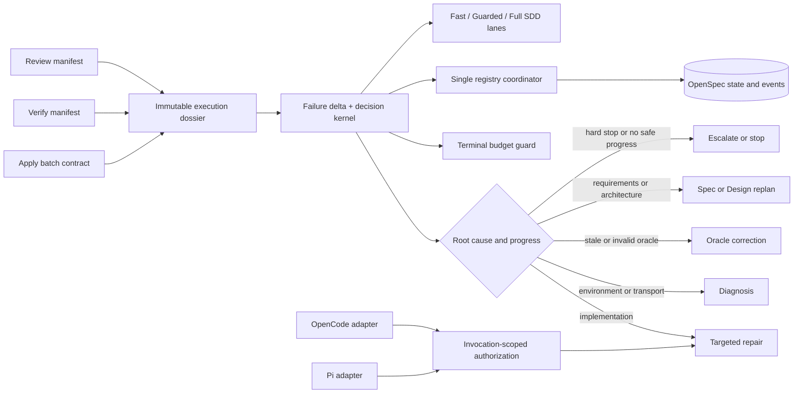

# Proposal: Developer Team Execution Convergence

## Intent

Developer Team execution currently has two competing control planes: executable runtime helpers and procedural prompt instructions. Exploration found that the important runtime foundations already exist, but they are not connected to the production workflow:

- Apply batching is prose in `orchestrator-content.ts`, not an immutable contract shared by Apply, Verify, and Review.
- `RepairIncident` captures incident details, but Verify and Review do not emit one phase-neutral failure manifest or compare failure-set deltas.
- `evaluateRepairIncident()` and the artifact-state manager have test callers but no production orchestration caller; budgets limit loops without selecting a root-cause response.
- modification authorization is optional prompt-generation input for OpenCode, `composeApplyAgentPromptWithAuth()` has no callers, and Pi has no verified equivalent invocation path;
- registry mutation is distributed across phase skills despite existing CAS/idempotency primitives;
- risk routing, staged verification, and freshness remain broad prompt policy rather than enforced runtime decisions; and
- role prompts, mandatory skill gates, and loaded skills repeat substantial policy content, creating the measured static-token burden without adding authority.

The change will move these responsibilities to one incremental runtime control plane. Prompts will explain intent and preserve defense in depth, but runtime contracts and deterministic decisions will become authoritative. This is not a workflow-engine rewrite.

## Goal

Make Developer Team runs converge through deterministic, replayable runtime decisions that reduce time, cycles, and registry reconciliation while preserving or improving authorization, security, architecture, verification, review, and historical-compatibility outcomes.

## Scope

### In Scope

- Establish a versioned, immutable Apply batch contract referenced unchanged by Apply results, Verify findings, Review findings, repair attempts, and registry intents.
- Establish one normalized, safely redacted failure manifest for Verify and Review plus a failure-delta model covering resolved, new, persistent, regressed, and reclassified findings and weighted risk movement.
- Add a pure deterministic decision kernel that selects repair, diagnosis, oracle correction, Spec/Design replan, escalation, or stop from root cause, failure delta, safety gates, and progress. Existing budget/fingerprint governance becomes the terminal safety bound, not the primary routing mechanism.
- Wire the decision kernel and repair governance into a production Orchestrator/runtime boundary rather than adding another disconnected helper.
- Make modification authorization short-lived, invocation-scoped, batch-bound, least-privilege, redacted in diagnostics, and consistent across OpenCode and Pi before mandatory enforcement.
- Centralize idempotent `state.yaml` and `events.yaml` mutation in one runtime/Orchestrator registry coordinator. Specialists return immutable phase results and registry intents; they do not compete as registry writers.
- Runtime-enforce staged verification (`targeted → affected-area → broad`), explicit skip/deferral evidence, causal-context retention for targeted repair, role independence, and fresh final Review after incidents or material/high-risk repair.
- Extend existing risk and quality primitives into explainable Fast, Guarded, and Full-SDD lanes with mandatory floors and user/project-policy escalation.
- Remove duplicated prompt and mandatory-skill procedure only after equivalent runtime controls and parity tests are active. Generated outputs will be changed only through canonical sources and generators.
- Deliver the complete program through strict-TDD vertical slices, compatibility fixtures, safe telemetry, adapter conformance, observe/shadow rollout, and per-slice rollback controls.
- Preserve independent Verify and Review; OpenSpec authority and existing YAML history; explicit user authorization; destructive Git protection; mandatory security/architecture scrutiny; compatibility with active, archived, and legacy changes; and fresh final Review after incidents.

### Out of Scope

- The preserved `runner-capability-standardization` WIP, including its active files, branch, commit `8c6d167`, artifacts, and registry history. This change will neither modify nor resume that work.
- A big-bang workflow-engine replacement, a new SDD phase, or a wholesale rewrite of current runners, adapters, contracts, or registry schemas.
- Rewriting, normalizing, deleting, or backfilling historical OpenSpec changes or events. Legacy records remain readable as written.
- Making a new artifact mandatory merely to document process. Auxiliary manifests or dossiers are introduced only where runtime validation, replay, coordination, or audit requires them.
- Weakening or flagging off explicit authorization, Git discard protection, OpenSpec authority, security hard stops, architecture review, independent quality judgment, or explicit Full-SDD requests.
- Manual edits to generated outputs, especially `packages/core/src/skills/external/content.generated.ts`.
- Product-code implementation, detailed requirements, architecture selection, or task decomposition during this Proposal phase.

## Affected Capabilities

> This section is the contract between Proposal and the parallel Spec and Design phases.

### New Capabilities

- `execution-dossier-contracts`: Versioned batch, failure-manifest, failure-delta, execution-decision, invocation-authorization, and registry-intent contracts form one immutable execution dossier with canonical IDs/digests and legacy adapters.
- `developer-team-decision-kernel`: A pure, deterministic production-wired kernel classifies root cause and progress, selects the next action, explains it with rationale codes, and applies budget governance only as the final safety bound.
- `invocation-scoped-modification-authorization`: Runner-neutral authorization is validated immediately before each modifying Apply invocation with OpenCode/Pi behavioral parity and default denial in required mode.
- `developer-team-execution-lanes`: Runtime-selected Fast, Guarded, and Full-SDD lanes enforce risk floors, staged verification, independence, freshness, and explicit policy/user overrides.

### Modified Capabilities

- `adaptive-quality-control`: Replace count/loop-led routing with normalized failure deltas, root-cause action selection, named risk lanes, and deterministic replay while retaining conditional quality invocation and forced replanning.
- `artifact-state-contracts`: Move from available CAS/idempotency primitives to one production registry coordinator that serializes validated state/event intents and preserves append-only history.
- `runner-orchestration-resilience`: Integrate transport/diagnostic classification, staged verification, freshness decisions, invocation authorization, and terminal budget stops into the production orchestration path.

### Unchanged Capabilities

- `independent-verify-and-review`: Verify and Review remain separate quality oracles; shared contracts align evidence but do not merge judgments or agents.
- `openspec-authority-and-history`: OpenSpec artifacts and registry records remain authoritative, additive, and backward-compatible.
- `git-discard-protection`: Destructive Git operations retain the informed-confirmation flow and cannot be bypassed by lanes, flags, or repair decisions.
- `security-and-architecture-review`: Security-sensitive, public-API, migration, destructive, and cross-package architecture work retains Full-SDD and review floors.

## Affected Packages and Adapters

| Area | Proposed impact | Compatibility boundary |
|---|---|---|
| `packages/sdd-runtime/src/contracts/` | Add versioned dossier contracts, parsers, canonicalization, redaction, and legacy adapters. | Preserve `repair-incident-v1` behavior and optional incident semantics. |
| `packages/sdd-runtime/src/orchestrator/` | Add failure-delta/kernel logic and wire it into `runOrchestratorPipeline()` or a versioned successor. | Preserve current governance outcomes for legacy callers; add rather than reinterpret exports. |
| `packages/sdd-runtime/src/artifact-state/` | Connect CAS/idempotency primitives to one production YAML registry writer. | Preserve adapter conflict semantics and readable existing YAML. |
| `packages/sdd-runtime/src/index.ts` | Export additive public contracts and orchestration APIs. | No removal or semantic break of existing exports. |
| `packages/core/src/spec-registry/` | Support optional versioned intent/event fields and coordinated validation. | Retain `spec-registry-v1`, legacy warnings, filenames, provenance, and event history. |
| `packages/core/src/teams/developer/` | Keep safety invariants; evolve return contracts and later remove redundant procedure from canonical prompt sources. | Runtime authority lands before prompt reduction; static cards remain compatibility/defense-in-depth output. |
| `packages/adapter-opencode/` | Build and validate the invocation envelope immediately before modifying delegation; consume runtime decisions. | Keep existing installation and prompt-generation APIs working. |
| `packages/adapter-pi/` | Add the same runner-neutral invocation and decision bridge as OpenCode. | Adapter-specific mechanisms may differ, but semantics and conformance tests may not. |
| Generated skill content | Regenerate deterministically after canonical prompt changes in the final slice. | Never hand-edit generated files; retain safety parity and provider filtering. |

## Approach

### Runtime authority model

Use one versioned `ExecutionDossier` aggregate to carry the authorized batch, normalized findings, prior/current delta, selected decision, invocation authorization reference, verification/freshness state, lane, and registry intents. Contracts are canonicalized and immutable after issue; adapters perform effects but do not reinterpret decisions.

The decision kernel will distinguish at least these action directions without relying on raw failure count:

| Evidence/root cause | Direction |
|---|---|
| Scoped implementation defect with positive risk-weighted progress | Targeted repair, then staged independent verification. |
| Environment, transport, capability, or ambiguous execution evidence | Diagnosis/reconciliation before another modifying attempt. |
| Stale, invalid, misclassified, or contract-inconsistent verifier/reviewer evidence | Oracle correction and independent rerun; no implementation churn. |
| Requirement, acceptance, architecture, or batch-shape gap | Spec/Design replan before Apply resumes. |
| Authorization mismatch, security/Git hard stop, unsafe ambiguity, or unresolved cross-boundary conflict | Escalation or stop. |
| No positive delta, repeated fingerprint, regression, or exhausted terminal budget | Replan, escalate, or stop according to severity and policy; never blind retry. |

Criticality, security classification, requirement coverage, regression status, and explicit lane floors dominate reduced finding counts. Decisions emit stable rationale codes and redacted telemetry so shadow and active outcomes can be compared and replayed.

### Incremental slices

| Slice | Deliverable and activation gate |
|---|---|
| 0 — Compatibility harness | Strict-TDD fixtures for legacy/no-contract, pass, Verify/Review failures, incidents, shrinking/expanding/unchanged failure sets; lock current repair, registry, pipeline, prompt, and adapter behavior; establish safe telemetry baselines. |
| 1 — Batch and failure contracts | Add parsers, canonical hashes, immutability, unified manifests, and legacy adapters. Apply/Verify/Review reference one batch. Start violation handling in observe mode. |
| 2 — Delta and production kernel | Add pure delta/decision functions, compose current repair governance as the terminal guard, and add a real caller in the orchestration pipeline. Start in shadow mode with rationale comparison. |
| 3 — Invocation authorization | Add the runner-neutral envelope and OpenCode/Pi bridges. Enforce only after both adapters pass the same conformance suite; then default-deny missing, expired, mismatched, replayed, or overbroad envelopes. |
| 4 — Registry coordinator | Add a production YAML adapter/coordinator; specialists emit intents; move each phase to centralized single-write behavior. Dual-read legacy/new, never dual-write. |
| 5 — Verification and freshness | Enforce staged checks, skip evidence, causal repair context, role independence, and fresh final Review after incidents/material repair. Generated drift requires canonical regeneration evidence. |
| 6 — Risk lanes | Extend existing scorer/router with explainable lane floors and overrides. Compare shadow recommendations with current triage before Automatic activation. Explicit Full SDD cannot be lowered. |
| 7 — Prompt convergence | After runtime parity, remove duplicated procedure from canonical role/skill sources, regenerate derived content, and enforce invariant and prompt-size regression tests. |

Each slice must be independently testable, deployable, observable, and reversible. No later cleanup is allowed to race ahead of its runtime safety replacement.

### Compatibility and rollout controls

| Control | Initial state | Active migration |
|---|---|---|
| `executionContracts` | `observe` | `off → observe → enforce` after contract/legacy fixture parity. |
| `decisionKernel` | `shadow` | `legacy → shadow → active` after deterministic replay and safe-action comparison. |
| `invocationAuthorization` | `static-compatible` | `invocation-required` per adapter only after shared conformance. |
| `registryWriter` | `distributed-compatible` | `centralized` phase by phase using dual-read/single-write; never dual-write. |
| `routePolicy` | `shadow-risk-lanes` | `legacy-triage → shadow-risk-lanes → risk-lanes` after floor/override evidence. |
| `promptProfile` | `legacy` during parity implementation | `compact` for 100% of builds and installations after runtime mapping and invariant parity are proven; runtime cohort evidence does not gate prompt bytes. |

New contract/schema fields and event types are additive and warning-first during rollout. Existing changes without a dossier continue through legacy adapters. Existing `repair-incident.md`, `state.yaml`, and `events.yaml` remain valid; rollback never deletes their history.

## Alternatives and Tradeoffs

| Alternative | Why considered | Why not chosen |
|---|---|---|
| Prompt-only optimization | Lowest effort and immediately reduces prompt volume. | Cannot enforce batch identity, invocation authority, registry consistency, staged verification, or deterministic recovery; it repeats the diagnosed authority-boundary failure. |
| Big-bang workflow-engine replacement | Offers a conceptually clean end state. | Discards useful runtime, registry, adapter, and compatibility foundations; creates migration and regression risk across active and historical changes. |
| Add more mandatory phases/artifacts | Could make every handoff explicit on disk. | Adds bureaucracy without runtime authority. This proposal uses no new phase and only retains artifacts that directly support validation, replay, coordination, or audit. |
| Incremental runtime control plane with compatibility bridges | Reuses current scorer, router, repair governance, state manager, registry utilities, and adapters while enabling vertical proof and rollback. | Chosen despite temporary flag and legacy/new coexistence complexity because it is the only option that improves authority without a risky rewrite. |

## Measurable Outcomes

Slice 0 will freeze the legacy baseline and rollout thresholds before active enforcement. Success is evaluated by lane and risk tier, not by aggregate loop count alone.

- Determinism: identical dossiers produce identical decisions and rationale codes across replay fixtures; no nondeterministic kernel outcomes are accepted.
- Contract continuity: every enforced-cohort Apply, Verify, Review, repair, and registry intent references the same validated batch ID/digest; legacy fixtures continue to parse or adapt without destructive migration.
- Authorization: every modifying invocation in required mode presents a valid invocation-scoped envelope; missing, expired, replayed, mismatched, or overbroad envelopes have zero successful modifications; OpenCode and Pi pass one conformance suite.
- Registry integrity: retries produce no duplicate events, no dropped artifact/provenance/history, and no competing writer in centralized mode; conflict and reconciliation rates decline from the frozen baseline.
- Convergence: like-for-like active cohorts reduce median time to accepted completion, agent/phase launches, total turns, repeated fingerprints, no-positive-delta cycles, and Verify/Review repair cycles relative to shadowed legacy decisions.
- Verification: targeted, affected-area, and broad stages report duration and outcomes; every skip/deferral is classified; fresh final Review occurs after every incident/material repair in the enforced cohort.
- Lane safety: explicit Full SDD and security/public-API/migration/destructive/cross-package architecture floors have zero silent downgrades; false-Fast-Lane incidents and escaped critical security/architecture findings do not increase from baseline.
- Prompt efficiency: compact prompts retain golden safety/invariant parity and measurably reduce generated prompt bytes/tokens from the source-size baseline; prompt savings cannot compensate for a safety or compatibility regression.
- Operational safety: telemetry contains only approved IDs, enums, counts, durations, hashes, and redacted paths—never raw prompts, credentials, unrestricted diagnostics, or secret-bearing findings.

Active rollout pauses on any authorization bypass, lost registry history, lane-floor violation, escaped critical finding attributable to routing, adapter semantic divergence, or deterministic-replay failure.

## Risks

| Risk | Likelihood | Mitigation |
|---|---|---|
| Runtime and prompt workflows temporarily disagree. | Medium | Runtime decisions become authoritative only after shadow parity; prompts retain concise defense-in-depth language and then shed only proven duplication. |
| Additive contracts break legacy or archived changes. | Medium | Versioned parsers, dual-read adapters, warning-first fields, historical fixtures, and no backfill/rewrite. |
| The kernel optimizes failure count instead of safety. | Medium | Weight severity, security, requirement coverage, regression, and reclassification above count; test security dominance and replay tables. |
| Fast Lane weakens independent quality control. | Medium | Hard lane floors, explicit acceptance, independent Verify, policy escalation, shadow comparison, and zero tolerance for silent Full-SDD downgrade. |
| Authorization can be replayed, broadened, or leaked. | Medium | Short expiry, nonce/idempotency key, change/batch/task-digest binding, least scope, immediate validation, safe diagnostics, and no raw authorization persistence. |
| A centralized writer becomes a bottleneck or partial-writes state/events. | Medium | Small intents, idempotency, CAS, crash/retry tests, and a Design-selected transaction strategy; prefer correctness over write throughput. |
| Fingerprints hide semantic changes or provoke wrong repairs. | Medium | Include stable structured identity, explicit reclassification, evidence references, and requirement/category/location context rather than hashing message text alone. |
| Freshness rules either erase causality or compromise independence. | Medium | Retain the dossier for targeted repair, separate context continuity from agent independence, and require a fresh final Review after incidents/material repair. |
| Prompt compression drops safety or provider behavior. | Low | Land last, edit canonical sources only, regenerate deterministically, and require golden parity/provider-filtering tests. |
| Scope accidentally intersects preserved WIP. | Low | Treat `runner-capability-standardization` and commit `8c6d167` as immutable exclusion fixtures; fail any task or diff that touches them. |

## Rollback Plan

- Roll back each slice independently through the listed controls: contracts to `observe/off`, kernel to `shadow/legacy`, routing to shadow/legacy, registry to distributed-compatible, prompts to legacy, and adapter authorization to static-compatible only while that adapter has not crossed the mandatory-enforcement gate.
- Preserve additive contracts, manifests, events, and registry provenance as readable history. Rollback may append a compensating event but may not delete or rewrite historical records.
- Keep dual-read compatibility during rollback; never introduce dual writes. If centralized registry writing is implicated, stop new coordinated writes, reconcile from append-only evidence, and restore the prior compatible writer boundary without discarding intents.
- If an active kernel or lane causes unsafe routing, freeze Automatic execution for the affected cohort, route to Full SDD/fresh independent Review, and revert decision/routing flags while retaining diagnostic evidence.
- If adapter authorization parity fails, disable active rollout for that adapter and refuse modifying invocations where invocation-required mode was already declared; do not silently fall back to prompt text as authority.
- Security hard stops, explicit authorization, destructive Git protection, OpenSpec authority, historical preservation, and explicit Full SDD are permanent floors and are not rollback switches.
- No rollback action may modify the preserved `runner-capability-standardization` WIP or use destructive Git commands without the canonical informed-confirmation flow.

## Dependencies

- Existing `RepairIncident`, repair governance, orchestration pipeline, risk scorer, quality router, artifact-state manager, and spec-registry parser/event/path utilities identified in exploration.
- A runner-neutral adapter port implemented by both OpenCode and Pi and validated by one conformance suite.
- Strict TDD with deterministic, isolated tests: no network, real installation, or user-filesystem mutation.
- Design decisions for the two-file YAML transaction/crash-recovery strategy and for the local-runner authorization envelope/signing or digest mechanism.
- A Slice 0 legacy/shadow baseline sufficient to freeze activation thresholds before Automatic routing or compact prompts become authoritative.

## Open Questions

- Which filesystem transaction strategy best preserves atomic/idempotent `state.yaml` plus `events.yaml` updates under local-runner crashes?
- Should local invocation authorization use a cryptographic signature, a process-bound keyed digest, or another non-exportable proof appropriate to each runner while retaining one semantic contract?
- Which baseline-derived efficiency thresholds and observation window should gate cohort expansion after Slice 0? Safety gates are fixed by this proposal; only the rollout threshold values remain to be frozen.

These are Design/rollout questions, not Proposal blockers.

## Acceptance Direction

- [ ] Strict-TDD compatibility fixtures lock current public behavior before each slice changes production wiring.
- [ ] Apply, Verify, and Review consume one immutable batch identity and emit/consume one normalized failure model in the enforced cohort.
- [ ] The production orchestration path—not a test-only helper—uses deterministic delta/root-cause decisions and terminal budget governance.
- [ ] Repair, diagnosis, oracle correction, Spec/Design replan, escalation, and stop are selected from structured evidence and replay identically.
- [ ] OpenCode and Pi reject unauthorized modifying invocations consistently after conformance and activation.
- [ ] One coordinator writes registry state/events idempotently without dropping existing artifacts, provenance, or history.
- [ ] Staged verification, lane floors, role independence, freshness, and post-incident final Review are runtime-enforced and observable.
- [ ] Shadow/observe results meet frozen safety, compatibility, convergence, and efficiency gates before active rollout.
- [ ] Prompt duplication is removed only after runtime parity, with generated-source, invariant, and prompt-size regression proof.
- [ ] No source, artifact, registry record, branch, or commit belonging to `runner-capability-standardization` is modified.

## Next Steps

Ready for Spec (`deck-developer-spec`) and Design (`deck-developer-design`) in parallel. Spec should formalize capability requirements and rollout gates; Design should resolve transaction, authorization-envelope, contract placement, production wiring, and adapter-port decisions. Neither phase should create a new lifecycle phase, mandate artifacts without runtime value, or plan a historical rewrite.

## Mermaid Summary Source

