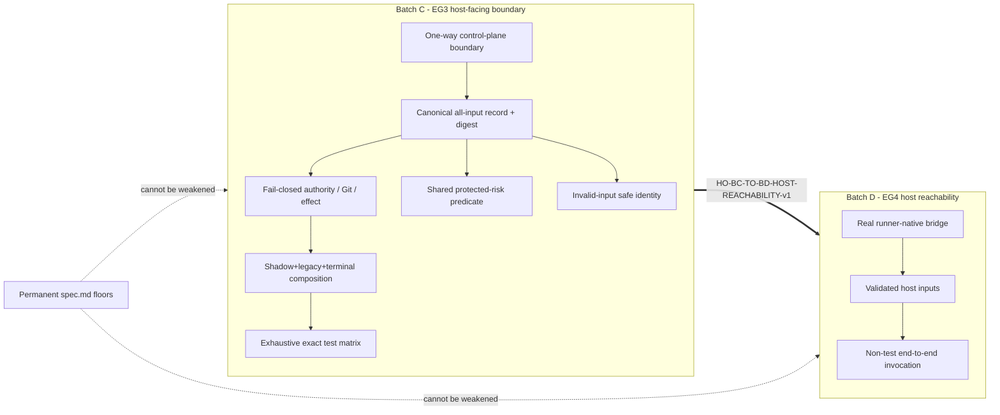

# Spec Repair: Batch C — Host-Facing Control-Plane Boundary and Batch D Host-Reachability Handoff

> **Authority level:** additive spec repair for the `developer-team-execution-convergence` change.
> **Mode:** registry-deferred. This artifact writes only `spec-repair-batch-c.md`. It MUST NOT modify `state.yaml`, `events.yaml`, the original `spec.md`, `design.md`, `tasks.md`, `apply-progress.md`, `repair-incident.md`, source, tests, generated output, or any other file.
> **RFC 2119:** the keywords MUST, MUST NOT, SHALL, SHALL NOT, SHOULD, SHOULD NOT, MAY in this artifact are normative.
> **Stability:** all requirement and scenario IDs in this artifact are stable. `REQ-CBC-*` are additive Batch C completion requirements. `RQH-BC-*` are additive Batch D host-reachability handoff requirements. They extend, and MUST NOT weaken or replace, the permanent requirements in `spec.md` (`REQ-DECISION-001`–`006`, `REQ-AUTH-001`–`004`, `REQ-ROLLOUT-001`–`005`, `REQ-VERIFY-001`–`005`, `REQ-BOUNDARY-001`–`002`, `REQ-CONTRACT-001`–`006`).

## 1. Source and Scope of This Repair

### 1.1 Official Evidence

- `verify-batch-c-direct-recovery.md` — fresh independent registry-deferred Verify: `FAIL`; retained `C-C2-PRODUCTION-CALLER-DISCONNECTED-v1` / `C-B1` and `C-C3-BATCH-C-TEST-ORACLE-INCOMPLETE-v1` / `C-B6`.
- `review-batch-c-direct-recovery.md` — fresh independent registry-deferred Review: `changes_requested`; six blockers `C-R1`…`C-R6`.
- `repair-incident.md` — replan decision: Batch C keeps fail-closed control-plane responsibility; actual runner-host reachability moves to Batch D (EG4) where the runner bridge and invocation authorization are authorized.
- Original `spec.md` — anchors: `REQ-DECISION-005` (`spec.md:69-70`), `REQ-DECISION-006` (`spec.md:72-73`), `REQ-BOUNDARY-001`–`002` (`spec.md:168-172`), `REQ-ROLLOUT-002` (`spec.md:142`), `REQ-AUTH-001`–`002`, `REQ-VERIFY-005`.
- `design.md` — authority ordering (`design.md:14-26`); production boundary and `executeDeveloperTeamStepV1()` as the only effect-capable boundary (`design.md:455-457`); `DeveloperTeamExecutionAdapterV1` per-runner bridges in EG4 (`design.md`).
- `tasks.md` — `EG3-T1`/`EG3-T2` authorized scope excludes runner-native host bridge; `EG4` owns adapter parity and host integration.

### 1.2 The Sequencing Contradiction Being Resolved

The original Batch C (EG3) acceptance gate required a **real non-test production caller** to invoke the V1 decision kernel and the authorized effect boundary ( REQ-DECISION-005 ). However, the authorized EG3 scope excludes the runner-native host bridge (`design.md:36`, `tasks.md` EG3 prohibited scope), which is the only legitimate per-execution source of:

- dossiers assembled from authoritative artifacts + registry + policy,
- invocation-scoped authority (`REQ-AUTH-001`),
- permanent destructive-Git-confirmation state and security hard-stop state,
- the effect capability that actually delegates to runner adapters.

Therefore no production caller can exist *within* the EG3 scope alone. The direct-recovery attempt demonstrated this: `runProductionExecutionDecisionPipelineV1()` is a forwarding wrapper reachable only from a test (`C-R1`), creating a circular module dependency, not production wiring.

### 1.3 Resolution (additive, safety-preserving)

1. **Reframe Batch C completion** as an immutable, production-ready **host-facing control-plane boundary** with a one-way dependency architecture, fail-closed authority/Git/effect semantics, canonical all-input decision record, exact terminal governance/shadow/legacy composition, and an exhaustive exact test matrix. Batch C MUST be producible as a boundary that a real host bridge *can* invoke; it MUST NOT be required to contain the host bridge itself.
2. **Move actual runner-host reachability / non-test invocation** to **Batch D (EG4)** as a mandatory integration acceptance requirement (`RQH-BC-*`). Batch D MUST prove a real runner-native bridge invokes the Batch C boundary with validated host inputs; test/export wrappers MUST NOT suffice.
3. **All permanent safety floors in `spec.md` remain absolute** and are restated below as additive requirements ONLY to make them directly testable at the Batch C boundary; this repair MUST NOT weaken any of them.

### 1.4 Non-Goals of This Repair

- This repair MUST NOT authorize implementing the runner-native host bridge inside Batch C/EG3.
- This repair MUST NOT weaken, override, or reinterpret `REQ-DECISION-001`–`006`, `REQ-AUTH-001`–`004`, `REQ-ROLLOUT-001`–`005`, `REQ-VERIFY-001`–`005`, `REQ-BOUNDARY-001`–`002`, or `REQ-CONTRACT-001`–`006`.
- This repair MUST NOT add an SDD lifecycle phase, mandate a process-only artifact, rewrite OpenSpec history, or touch `runner-capability-standardization` WIP (`REQ-BOUNDARY-001`, `REQ-BOUNDARY-002`).
- This repair MUST NOT lower any safety floor, convert no-progress into repair, auto-repair data-loss/other protected risk, synthesize Git confirmation, permit shadow effects, or alter legacy/no-dossier behavior compatibility.
- This repair MUST NOT credit a forwarding export or test-only wrapper as production wiring.

## 2. Additive Requirements — Batch C Host-Facing Control-Plane Boundary

### Capability: Batch C Control-Plane Boundary Composition

**REQ-CBC-001**: Batch C MUST deliver an immutable, versioned, host-facing **control-plane boundary** (`runExecutionDecisionPipelineV1()` planner + `executeDeveloperTeamStepV1()` effect boundary, or their additive successors) that is the single authoritative ingress for a plan decision and the single effect-capable egress. The boundary MUST expose a one-way dependency architecture: the effect/adapter boundary MUST depend on the pure decision kernel and contracts; the kernel and contracts MUST NOT depend on the effect/adapter boundary or on any runner-native host module. A circular import between the legacy pipeline module and the control-plane module MUST NOT exist.
Priority: MUST | Surface: Integration/Architecture | Rationale: closes `C-R1`'s circular composition defect and makes the boundary independently host-invokable without containing the host bridge.

**REQ-CBC-002**: The control-plane boundary MUST accept an explicitly versioned **all-input decision record** as the sole kernel input: batch reference, normalized evidence manifest, failure delta, lane/policy floors, **authorization state**, **applicable destructive-operation / Git-safety confirmation state**, and terminal-governance state. The boundary MUST freeze this record into a canonical, byte-for-byte stable representation and digest at ingress. Kernel evaluation MUST consume only the frozen canonical record; raw, unvalidated, or redacted-unsafe values MUST NOT influence the action, rationale, or identity. An invalid canonical value (including cyclic, prototype-polluting, or secret-bearing raw evidence) MUST be rejected with `invalid-evidence` and fall back to a **safe identity** (no-op/stop equivalent) without throwing to the caller and without persisting the unsafe raw value.
Priority: MUST | Surface: API/Security/Data | Rationale: closes `C-R4` and hardens `C-B4`; canonical replay correctness (`REQ-DECISION-005`).

**REQ-CBC-003**: The control-plane boundary MUST be **fail-closed** for authority and Git/effect state at the public decision and effect boundaries. Specifically:
- (a) `authorizationValid` MUST be a mandatory, validated input. Missing, expired, replayed, malformed, mismatched, revoked, or overbroad authority MUST select `stop` with a distinct stable rationale code (e.g. `AUTHZ_MISSING` / `AUTHZ_INVALID`) and zero modifying effects; absent authority MUST NOT be treated as permission.
- (b) A destructive-operation / Git-safety confirmation MUST be a mandatory, validated input for any capability that could perform that destructive operation. Missing confirmation MUST NOT be synthesized as `true` (e.g. `!== false` MUST NOT coerce absence to confirmation) and MUST block that capability with a distinct stable rationale code (e.g. `GIT_CONFIRMATION_MISSING`) and zero modifying effects.
- (c) Authorization validation and applicable Git/effect-state validation MUST occur immediately before any tool-capable delegation, mirroring `REQ-AUTH-001` and the permanent authority/Git-safety precedence in `design.md:16-24`.
Priority: MUST | Surface: Security/Permission | Rationale: closes `C-R2` and `C-B2`; enforces `REQ-AUTH-002` at the public boundary.

**REQ-CBC-004**: Routing MUST use one shared **protected-risk predicate** covering at minimum: security classification, data-loss classification, authorization, Git-safety, critical/high severity, and uncovered-requirement regression. A positive-weighted shrink MUST NOT authorize `targeted_repair` when any protected-risk class is present, and zero protected risk MUST NOT befall open by omitting `category === "data-loss"` from the predicate. New-regression cases for each protected class MUST route to escalate/replan/stop rather than `targeted_repair`. This requirement refines `REQ-DECISION-002`'s explicit no-automatic-retry floor for data-loss and protected risk.
Priority: MUST | Surface: Security/General | Rationale: closes `C-R3` and definitively closes `C-C1`/`C-B3` beyond the high-severity example.

**REQ-CBC-005**: **Invalid-input safe identity** MUST be total and non-throwing: any invalid canonical/kernel input MUST yield a deterministic non-modifying decision (an `invalid-evidence` routing that defaults to `stop`/no-op) with a stable rationale code, MUST NOT hash or persist unsafe raw evidence, MUST NOT mutate any shared/registry/host state, and MUST be representable as a redacted-safe record whose digest excludes the unsafe raw value. A secret-bearing, cyclic, or prototype-polluting input MUST NOT corrupt the canonical digest or escape as an unhandled exception.
Priority: MUST | Surface: Security/API | Rationale: closes `C-R4` (`C-B4` partial); enforces `REQ-CONTRACT-005` at the kernel ingress.

**REQ-CBC-006**: **Shadow, legacy, and active composition** MUST be explicit and exact at the boundary:
- (a) Shadow mode MUST require and derive the unchanged **legacy** result (or reach the documented no-dossier legacy branch) and MUST record the legacy-vs-new comparison as redacted-safe telemetry; shadow MUST NOT cause any active effect and MUST NOT let the V1 recommendation control effects.
- (b) `legacyInput` / no-dossier MUST be a first-class composition path: a no-dossier execution MUST produce the true legacy/no-effect plan behavior-compatible with current callers; a shadow plan MUST NOT be admitted without the legacy comparison.
- (c) The boundary MUST expose the exact **terminal governance** composition: the kernel chooses the root-cause action first, then `evaluateRepairIncident()`/`adaptDossierToRepairIncidentV1()` acts as a terminal guard that MAY only maintain or increase restrictiveness (`block`→`stop`, `escalate`→`escalate`, `replan` upgrades `targeted_repair`, `checkpoint` pauses a modifying action). Repeated-fingerprint and budget-exhaustion terminal bounds MUST be evaluated after evidence-based routing and MUST NOT convert no-progress into repair.
- (d) Activating/overriding MUST NOT bypass authorization, destructive-Git confirmation, security hard stops, or Full-SDD floors.
Priority: MUST | Surface: Integration/Compatibility | Rationale: closes `C-R5` fully and hardens `C-B5`; preserves `REQ-ROLLOUT-002`, `REQ-ROLLOUT-005`.

**REQ-CBC-007**: Batch C MUST ship an **exhaustive exact test matrix** of individually named public-boundary cases, each asserting the exact action, complete ordered rationale codes, digest/decision replay where applicable, the terminal guard result, the authority reason, and the zero/non-zero effect result. The matrix MUST include at least:
- unrelated-baseline quarantine (no credit to the batch);
- low and medium **related** regression cases;
- **data-loss** risk (positive shrink and new regression) per `REQ-CBC-004`;
- **mixed roots** composition;
- **Full-SDD floor** (no effect without explicit Full-SDD);
- **missing authority** vs **invalid authority** distinct rationale cases;
- **missing destructive-Git confirmation** distinct rationale case;
- **repeated fingerprint** and **soft/hard terminal budgets** composed with kernel actions;
- **Review anchoring / scope classification** (`REQ-REVIEW-001`, `REQ-REVIEW-002`);
- **legacy/no-dossier** behavior-compatibility case;
- **shadow** requiring legacy authority and zero effects (`REQ-CBC-006`);
- **capability-digest mismatch** rejection;
- **allowed-target / blocked-target mismatch** rejection;
- **non-delegating actions** (diagnose/oracle-correct/replan/stop) produce no modifying effect;
- **adapter error** handled fail-closed without auto-repair;
- **invalid canonical inputs**: cyclic, prototype-polluting, and secret-bearing raw evidence — each rejected with safe identity per `REQ-CBC-005`;
- a **structural connectivity test** that fails unless a real non-test production caller of the Batch C boundary exists OR the boundary is documented as host-facing-deferred per `RQH-BC-001` (see §4: the structural test MUST NOT pass on a test/export wrapper alone).
A test that passes while any independent `C-R2`…`C-R6` reproducer remains green-failing MUST NOT be accepted. The matrix MUST replace false-green coverage; named cases are normative.
Priority: MUST | Surface: Test/Verification | Rationale: closes `C-R6` and `C-C3`/`C-B6`; operationalizes `REQ-VERIFY-005`.

**REQ-CBC-008**: **Batch C completion gate.** Batch C MUST NOT be marked complete until its own fail-closed control-plane responsibilities pass: `REQ-CBC-001`–`007`, the permanent floors restated at the boundary (`REQ-DECISION-001`–`006`, `REQ-AUTH-001`–`002`, `REQ-ROLLOUT-002`, `REQ-ROLLOUT-005`, `REQ-BOUNDARY-001`–`002`, `REQ-VERIFY-005`), and the full `REQ-CBC-007` test matrix. Actual runner-host reachability and non-test host invocation are **separately required before Batch D completion** (`RQH-BC-001`–`RQH-BC-003`) and MUST NOT be claimed as Batch C acceptance. A forwarding export, a renamed helper, or a test-only wrapper MUST NOT satisfy Batch C completion; likewise it MUST NOT satisfy Batch D completion without a real runner-native bridge invocation.
Priority: MUST | Surface: General | Rationale: prevents false Batch C acceptance and closes `C-R1` deferral without weakening the original production-caller intent.

## 3. Additive Requirements — Batch D Host-Reachability Handoff

### Capability: Batch D Host Integration Acceptance

**RQH-BC-001**: Batch D (EG4) MUST accept a **mandatory host-reachability integration acceptance requirement** before it can be marked complete: a real runner-native host bridge MUST invoke the Batch C control-plane boundary (`runExecutionDecisionPipelineV1()` / `executeDeveloperTeamStepV1()` or additive successors) on a non-test, non-prompt-only execution path, with validated host inputs. This handoff absorbs the original Batch C production-caller requirement (`C-R1`, `C-B1`, `C-C2`) that cannot be closed within EG3 scope. Until `RQH-BC-001` is satisfied, Batch D MUST NOT be marked complete even if all other EG4 tasks pass.
Priority: MUST | Surface: Integration | Rationale: resolves the EG3/EG4 sequencing contradiction; no false Batch D acceptance.

**RQH-BC-002**: The Batch D host-reachability proof MUST demonstrate a **real runner-native bridge** (OpenCode and/or Pi per `REQ-AUTH-004`) actually invoking the Batch C boundary end-to-end on at least one non-test invocation. Test/export wrappers, in-process re-exports, indirect unit tests of the bridge, and prompt-only installation paths MUST NOT suffice. The evidence MUST include the host→bridge→control-plane→effect adapter invocation chain and the resulting immutable phase result/manifest/registry intent.
Priority: MUST | Surface: Integration | Rationale: closes `C-R1` substantively, not symbolically.

**RQH-BC-003**: The host bridge MUST supply **validated host inputs** to the Batch C boundary: authoritative artifacts + registry state + policy (canonicalized), an invocation-scoped authorization envelope satisfying `REQ-AUTH-001`/`REQ-AUTH-002`, and the applicable destructive-Git-confirmation/security-hard-stop state satisfying `REQ-CBC-003`. Invalid host inputs MUST be rejected at the Batch C boundary with the stable error codes from `spec.md` Validation Rules (`modification-not-authorized`, `invalid-evidence`) and zero modifying effects. The bridge MUST NOT fabricate authority, synthesize Git confirmation, or bypass the Batch C fail-closed floors.
Priority: MUST | Surface: Security/Integration | Rationale: preserves permanent authority/Git-precedence floors across the EG3→EG4 seam.

## 4. Batch C / Batch D Handoff Contract

### 4.1 Handoff Identity

- **Handoff ID:** `HO-BC-TO-BD-HOST-REACHABILITY-v1`
- **Producer:** Batch C (EG3-T1, EG3-T2) — host-facing control-plane boundary.
- **Consumer:** Batch D (EG4) — runner-native OpenCode/Pi execution bridges.
- **Carrier artifact:** this `spec-repair-batch-c.md` (registry-deferred).
- **Resolved blockers transferred:** `C-R1`, `C-B1`, `C-C2-PRODUCTION-CALLER-DISCONNECTED-v1` (production-caller reachability) move from Batch C acceptance to Batch D `RQH-BC-001`–`RQH-BC-003`.
- **Retained-in-Batch-C blockers:** `C-R2`…`C-R6` and their `C-B` finding twins remain Batch C responsibilities and are closed by `REQ-CBC-001`–`008`.

### 4.2 Boundary Contract (what Batch D may rely on from Batch C)

Batch D MAY rely on the following from a complete Batch C boundary, and MUST NOT rely on anything beyond it without a new spec/Design change:

1. A versioned, host-facing control-plane boundary with one-way dependency architecture (`REQ-CBC-001`).
2. A canonical all-input decision record + digest at ingress (`REQ-CBC-002`).
3. Fail-closed authority/Git/effect validation at the public boundary with stable rationale codes (`REQ-CBC-003`).
4. The shared protected-risk routing predicate (`REQ-CBC-004`).
5. Total invalid-input safe identity (`REQ-CBC-005`).
6. Explicit shadow/legacy/active + terminal-governance composition (`REQ-CBC-006`).
7. The exhaustive exact test matrix for the boundary (`REQ-CBC-007`).

Batch D MUST NOT assume any host-bridge implementation, internal kernel data structure, specific module layout, or internal adapter API beyond the public boundary contract; those are Design/implementation details owned by EG4 and remain non-normative for this spec repair.

### 4.3 Allowed Compatibility Behavior

During the handoff and rollout, the following compatibility behavior is explicitly allowed and MUST NOT be treated as a defect, provided the permanent floors remain active:

- `decisionKernel=legacy|shadow|active` and `invocationAuthorization=static-compatible|invocation-required` MAY coexist per `REQ-ROLLOUT-001`; the Batch C boundary defaults to `shadow` and MUST NOT auto-activate `active` without authorization parity (`REQ-AUTH-004`).
- Legacy/no-dossier executions MUST remain readable and behavior-compatible with current callers/tests until their control is enforced; they are not silently reinterpreted (`REQ-ROLLOUT-005`, `REQ-CBC-006(b)`).
- Dual-read of legacy and new records is permitted; dual-write is prohibited (`REQ-REGISTRY-004`).
- Shadow comparison telemetry MAY be emitted redacted; shadow MUST NOT cause active effects (`REQ-ROLLOUT-002`, `REQ-CBC-006(a)`).
- The host bridge MAY be implemented incrementally per adapter (OpenCode then Pi or vice versa), but neither adapter cohort `invocation-required` mode MAY activate until `REQ-AUTH-004` parity and `RQH-BC-001`–`RQH-BC-003` pass for that cohort.

### 4.4 Non-Goals of the Handoff

- The handoff MUST NOT authorize Batch D to weaken `REQ-CBC-001`–`008` or any permanent `spec.md` floor.
- The handoff MUST NOT permit Batch C to claim completion via a wrapper/export/test path (`REQ-CBC-008`).
- The handoff MUST NOT permit Batch D to claim host-reachability completion via wrappers/exports/prompt-only installation (`RQH-BC-002`).
- The handoff MUST NOT require implementing the runner-native bridge inside EG3 (`REQ-BOUNDARY-002` preserved WIP).

### 4.5 Rollback

- Rollback is the additive per-slice rollback already specified in `REQ-ROLLOUT-001`/`REQ-ROLLOUT-005` and the States/Transitions table in `spec.md`.
- Rolling back the Batch C boundary MUST restore the prior legacy authoritative control and retain additive evidence + append-only history; it MUST NOT delete, backfill, normalize, or rewrite history.
- A rollback MUST NOT bypass `REQ-CBC-003`/`REQ-CBC-006(d)` floors: authorization, destructive-Git confirmation, security hard stops, and Full-SDD floors remain active in every compatibility and rollback mode.
- If `RQH-BC-001` cannot be reached for a cohort, that cohort MUST remain in `shadow`/`static-compatible` and MUST NOT activate `invocation-required`/`active`.

### 4.6 Test Evidence Requirements

- Batch C MUST record evidence for each named `REQ-CBC-007` case (exact action, ordered rationales, digest replay where applicable, terminal guard result, authority reason, effect result) plus independent reproducers for `C-R2`…`C-R6` turning green.
- Batch D MUST record, for `RQH-BC-001`–`003`: the real runner-native bridge invocation chain evidence, the validated host inputs, the canonical decision record + digest produced at the Batch C boundary, the fail-closed behavior for invalid host inputs, and per-adapter parity evidence per `REQ-AUTH-004`.
- A structural connectivity test MUST exist at the seam that fails unless either (i) a real non-test production caller of the Batch C boundary is present within the consumed scope, or (ii) the host-reachability requirement is correctly deferred to Batch D under `HO-BC-TO-BD-HOST-REACHABILITY-v1` and is independently tracked as open until `RQH-BC-001` passes. The structural test MUST fail on a test/export wrapper alone.

## 5. Acceptance Scenarios

### Capability: Batch C Control-Plane Boundary

#### Scenario: One-way host-facing control-plane boundary
**Given** the Batch C control-plane boundary and the pure decision kernel/contracts
**When** module dependencies are inspected and a non-test host bridge attempts to import the boundary
**Then** the effect/adapter boundary depends on the kernel/contracts, the kernel/contracts do not depend on the effect/adapter boundary or any runner-native host module, and no circular import exists between the legacy pipeline module and the control-plane module.
> Covers: REQ-CBC-001

#### Scenario: Canonical all-input decision record freezes and replays
**Given** a valid host input containing batch reference, manifest, delta, lane/policy floors, authorization state, Git/effect state, and terminal-governance state
**When** the boundary canonicalizes and evaluates the input, then the same canonical record is replayed
**Then** the boundary produces a byte-for-byte stable canonical representation and digest, the kernel consumes only the frozen canonical record, and the replay yields the identical action and ordered rationale codes.
> Covers: REQ-CBC-002, REQ-DECISION-005, REQ-DECISION-006

#### Scenario: Missing authority fails closed
**Given** a host input with no authorization field and an otherwise valid dossier
**When** the boundary evaluates the decision
**Then** the action is `stop`, the rationale includes `AUTHZ_MISSING` (or equivalent stable code), and zero modifying effects occur.
> Covers: REQ-CBC-003(a), REQ-AUTH-002

#### Scenario: Invalid authority fails closed with distinct rationale
**Given** a host input with an expired/replayed/malformed/overbroad authorization
**When** the boundary evaluates the decision
**Then** the action is `stop` with a distinct rationale code distinguishing the invalid case from the missing case, and zero modifying effects occur.
> Covers: REQ-CBC-003(a), REQ-AUTH-002

#### Scenario: Missing destructive-Git confirmation is not synthesized
**Given** a host input that would exercise a destructive operation capability and where the destructive-Git confirmation field is absent
**When** the boundary evaluates the effect boundary
**Then** the confirmation is NOT coerced to true, the destructive capability is blocked with `GIT_CONFIRMATION_MISSING` (or equivalent stable code), and zero modifying effects occur.
> Covers: REQ-CBC-003(b), REQ-CBC-003(c)

##### Variant: explicit false confirmation
- Given the destructive-Git confirmation field is explicitly `false`
- When the boundary evaluates
- Then the destructive capability is blocked with the same rationale and zero effects.

#### Scenario: Data-loss protected risk blocks targeted repair on positive shrink
**Given** a dossier whose data-loss finding shrank from critical to low producing a positive weighted delta
**When** the shared protected-risk predicate evaluates routing
**Then** the action is NOT `targeted_repair`, the rationale reflects `PROTECTED_RISK_DATA_LOSS`, and the dossier routes to escalate/replan/stop per precedence.
> Covers: REQ-CBC-004, REQ-DECISION-002

##### Variant: new data-loss regression
- Given a new low-severity data-loss regression appears
- When routing evaluates
- Then the action is escalate/replan/stop, never `targeted_repair`.

##### Variant: security high/critical shrink
- Given a positive shrink with remaining security high/critical risk
- When routing evaluates
- Then `targeted_repair` is forbidden and the rationale reflects protected-risk escalation.

#### Scenario: Invalid canonical input uses safe identity without throwing
**Given** a cyclic, prototype-polluting, or secret-bearing raw evidence value submitted as canonical input
**When** the boundary canonicalizes and evaluates
**Then** the input is rejected with `invalid-evidence` and a non-modifying `stop`/no-op decision, the call does not throw to the caller, the unsafe raw value is neither hashed into the canonical digest nor persisted, and the canonical digest excludes the unsafe raw value.
> Covers: REQ-CBC-005, REQ-CONTRACT-005

#### Scenario: Shadow requires legacy authority and records comparison
**Given** a shadow execution request with a valid dossier
**When** the boundary evaluates shadow mode
**Then** the legacy result is required/derived (or the documented no-dossier legacy branch is taken), a redacted legacy-vs-new comparison is recorded, the V1 recommendation does not control effects, and zero active effects occur.
> Covers: REQ-CBC-006(a), REQ-ROLLOUT-002

##### Variant: shadow without legacy input
- Given a shadow execution request that omits the legacy input
- When the boundary evaluates
- Then the boundary rejects the admission OR derives the legacy comparison; it MUST NOT admit a shadow plan without the legacy comparison.

#### Scenario: Legacy/no-dossier behavior compatibility
**Given** a no-dossier execution
**When** the boundary evaluates
**Then** the true legacy/no-effect plan is produced and remains behavior-compatible with current callers; no new effect is introduced and no history is rewritten.
> Covers: REQ-CBC-006(b), REQ-ROLLOUT-005

#### Scenario: Terminal governance cannot manufacture progress
**Given** no positive delta with a repeated fingerprint or exhausted budget
**When** routing is evaluated through the kernel and then `evaluateRepairIncident()` terminal guard
**Then** the terminal guard forbids repair, returns replan/escalation/stop with a stable rationale code, and no terminal bound converts no-progress into repair; an override does not bypass authorization, Git confirmation, security hard stops, or Full-SDD floors.
> Covers: REQ-CBC-006(c), REQ-CBC-006(d), REQ-DECISION-004

#### Scenario: Exhaustive exact test matrix is present and individually named
**Given** the Batch C boundary and its committed test suite
**When** the test matrix is enumerated
**Then** individually named cases exist for every row required by `REQ-CBC-007`, each asserting exact action, complete ordered rationale codes, digest/decision replay where applicable, terminal guard result, authority reason, and effect result; and a structural connectivity test fails on a test/export wrapper alone.
> Covers: REQ-CBC-007, REQ-VERIFY-005

#### Scenario: Batch C completion requires its own boundary plus matrix, not host reachability
**Given** the Batch C boundary passes `REQ-CBC-001`–`007` and all permanent floors, but no real runner-native host caller exists yet
**When** Batch C completion is assessed
**Then** Batch C MAY be marked complete for its control-plane responsibilities, actual host reachability remains open and tracked under `HO-BC-TO-BD-HOST-REACHABILITY-v1`, and a forwarding export / test wrapper MUST NOT satisfy Batch C completion.
> Covers: REQ-CBC-008

### Capability: Batch D Host-Reachability Handoff

#### Scenario: Real runner-native bridge invokes the Batch C boundary
**Given** a complete Batch C boundary and a Batch D runner-native bridge (OpenCode and/or Pi)
**When** a non-test, non-prompt-only execution runs end-to-end
**Then** the real runner-native bridge invokes the Batch C control-plane boundary, supplies validated host inputs, and the chain host→bridge→control-plane→effect adapter produces an immutable phase result/manifest/registry intent.
> Covers: RQH-BC-001, RQH-BC-002

##### Variant: wrappers and exports are insufficient
- Given only a test/export wrapper or renamed forwarding helper
- When the host-reachability proof is assessed
- Then it MUST NOT satisfy `RQH-BC-002`, and Batch D MUST NOT be marked complete.

#### Scenario: Invalid host inputs are rejected fail-closed at the seam
**Given** a Batch D bridge supplying host inputs that omit authority, synthesize Git confirmation, or carry a malformed canonical record
**When** the Batch C boundary validates the inputs
**Then** the boundary rejects them with `modification-not-authorized` and/or `invalid-evidence`, zero modifying effects occur, and the bridge does not fabricate authority or synthesize Git confirmation.
> Covers: RQH-BC-003, REQ-CBC-003, REQ-AUTH-002

#### Scenario: Batch D completion requires host reachability
**Given** all EG4 tasks pass except the real runner-native host invocation
**When** Batch D completion is assessed
**Then** Batch D MUST NOT be marked complete because `RQH-BC-001` is unsatisfied, and the cohort remains `shadow`/`static-compatible`.
> Covers: RQH-BC-001, REQ-AUTH-004

#### Scenario: Rollback preserves floors and additive history
**Given** a rolled-back Batch C boundary or failed Batch D cohort
**When** rollback completes
**Then** the prior legacy authoritative control owns effects, additive evidence and append-only history are retained, no history is backfilled/normalized/rewritten, and authorization, Git confirmation, security hard stops, and Full-SDD floors remain active.
> Covers: REQ-ROLLOUT-001, REQ-ROLLOUT-005, §4.5 Rollback

## 6. Validation Rule and Error Contract Additions

| Input | Rule | Error code / rationale | REQ-ID |
|---|---|---|---|
| Authorization state | Mandatory, validated; missing/invalid → `stop` with distinct rationale | `AUTHZ_MISSING`, `AUTHZ_INVALID` / `modification-not-authorized` | REQ-CBC-003(a), RQH-BC-003 |
| Destructive-Git confirmation | Mandatory for destructive capability; absence MUST NOT coerce to true | `GIT_CONFIRMATION_MISSING` | REQ-CBC-003(b), RQH-BC-003 |
| Canonical kernel input | Frozen byte-for-byte digest; raw/unsafe values excluded; cyclic/prototype/secret-bearing → safe identity | `invalid-evidence` | REQ-CBC-002, REQ-CBC-005 |
| Protected-risk routing | Shared predicate incl. data-loss; positive shrink with protected risk forbids `targeted_repair` | `PROTECTED_RISK_*` rationales | REQ-CBC-004 |
| Shadow composition | Legacy comparison required; zero active effects | `SHADOW_NO_LEGACY_COMPARISON` (rejection) | REQ-CBC-006 |
| Structural connectivity | Structural test must not pass on test/export wrapper alone | structural-test failure | REQ-CBC-007, REQ-CBC-008, RQH-BC-001 |

## 7. Open Questions

- None originating from this repair. The host-bridge implementation details (module layout, plugin bootstrap shape, adapter proof mechanisms) remain Design-owned and out of spec scope, consistent with `design.md`. If Batch D discovers the Batch C public boundary contract is insufficient to invoke, that MUST be raised as a Spec/Design replan rather than weakening `REQ-CBC-001`–`008`.

## 8. Compliance Matrix — C-R Findings to Repair Requirements

| Review finding | Closed by | Status after repair |
|---|---|---|
| `C-R1` (test-only wrapper / circular boundary) | `REQ-CBC-001`, `REQ-CBC-008`; `RQH-BC-001`–`RQH-BC-002` (Batch D handoff) | Deferred to Batch D without false Batch C acceptance |
| `C-R2` (authority/Git fail-open) | `REQ-CBC-003` | Defined |
| `C-R3` (data-loss routes to targeted repair) | `REQ-CBC-004` | Defined |
| `C-R4` (invalid-input identity throws / hashes unsafe raw evidence) | `REQ-CBC-005`, `REQ-CBC-002` | Defined |
| `C-R5` (shadow lacks legacy authority composition) | `REQ-CBC-006` | Defined |
| `C-R6` (exact safety/production test matrix absent) | `REQ-CBC-007`, `REQ-CBC-008` | Defined |
| `C-C2` / `C-B1` (production-caller disconnected) | `RQH-BC-001`–`RQH-BC-002` via `HO-BC-TO-BD-HOST-REACHABILITY-v1` | Deferred to Batch D |
| `C-C3` / `C-B6` (test oracle incomplete) | `REQ-CBC-007` | Defined |

## 9. Registry Intent (deferred)

This artifact is written in **registry-deferred mode**. No `state.yaml`/`events.yaml` write is performed here. The immutable registry intent for the Orchestrator to serialize after the parallel batch completes is:

- **phase:** `spec`
- **status:** `changes-requested` (Batch C not yet completable; additive repair recorded; original `spec.completed` is NOT re-asserted)
- **event:** `spec.repair.batch-c.host-boundary-handoff.recorded`
- **artifact:** `spec-repair-batch-c.md`
- **provenance:** `deck-developer-spec`; model `opencode-go/glm-5.2`; registry-deferred; official evidence `verify-batch-c-direct-recovery.md`, `review-batch-c-direct-recovery.md`, `repair-incident.md`, original `spec.md`, `design.md`, `tasks.md`; 2026-07-16.
- **artifacts map addition (advisory to Orchestrator):** `spec_repair_batch_c: spec-repair-batch-c.md` (additive; MUST NOT replace `spec`).
- **status transition note:** Batch C acceptance remains blocked until `REQ-CBC-001`–`008` pass; Batch D acceptance remains blocked until `RQH-BC-001`–`RQH-BC-003` pass; this repair MUST NOT be interpreted as Batch C or Batch D completion.

## 10. Mermaid Summary Source

