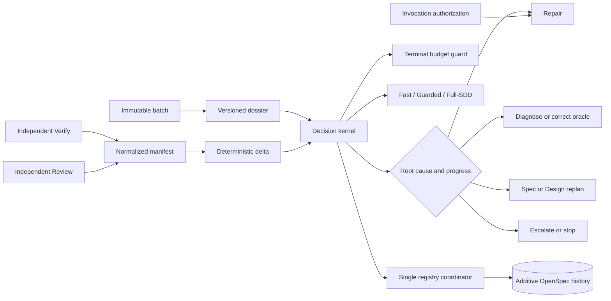

# Spec: Developer Team Execution Convergence

## Source and Scope

- Authoritative source: `developer-team-execution-convergence` proposal and its exploration and registry records.
- Capabilities: execution dossier contracts, deterministic decision routing, invocation authorization, registry coordination, verification/freshness, execution lanes, runtime/prompt convergence, and compatible rollout.
- This specification covers the full incremental program. It adds no lifecycle phase and does not authorize changes to `runner-capability-standardization`, including its WIP files, branch, commit `8c6d167`, artifacts, or registry history.
- RFC 2119 terms are normative. OpenSpec artifacts and registry records remain authoritative.

## Contract Vocabulary

| Term | Normative meaning |
|---|---|
| Batch | One immutable, versioned authorization and acceptance boundary for related Apply work. |
| Dossier | The versioned aggregate carrying batch identity, normalized evidence, decisions, authorization references, verification/freshness state, lane, and registry intents. |
| Finding identity | Stable identity derived from safe structured semantics: batch, requirement or constraint, category, normalized location/subject, and oracle; message wording and secrets are excluded. |
| Material repair | A repair that changes public behavior, authorization/security behavior, data durability or migration behavior, cross-package architecture, more than one batch acceptance obligation, or any high/critical finding. |
| Incident | A security, data-loss, destructive-operation, authorization, registry-integrity, architecture-boundary, or repeated-regression event. |
| Positive progress | Weighted unresolved risk decreases with no new high/critical finding, no security/data-loss regression, and no newly uncovered requirement. |

## Requirements

### Capability: Execution Dossier Contracts

**REQ-CONTRACT-001**: The system MUST issue an immutable, explicitly versioned batch contract containing a stable batch ID, canonical digest, change and task identities, ordered dependencies, allowed and blocked targets, acceptance obligations, verification plan, artifact digests, authorization reference, and provenance. After issue, any field change MUST produce a new batch ID/digest rather than mutate the issued batch.  
Priority: MUST | Surface: Data/Integration | Rationale: Every judgment and effect must use one scope boundary.

**REQ-CONTRACT-002**: Apply results, Verify findings, Review findings, repair attempts, and registry intents in an enforced execution MUST reference the exact issued batch ID, version, and digest unchanged. A missing or mismatched reference MUST be rejected before modification or authoritative recording.  
Priority: MUST | Surface: Integration | Rationale: Prevent scope reconstruction and cross-batch evidence.

**REQ-CONTRACT-003**: Contracts MUST use canonical serialization and digest rules such that semantically identical inputs yield byte-for-byte identical canonical representations and digests across supported adapters and replay. Unknown mandatory versions MUST fail closed with a safe version error; legacy records MUST be adapted without rewriting their source.  
Priority: MUST | Surface: API/Data | Rationale: Deterministic replay and compatibility.

**REQ-CONTRACT-004**: Verify and Review MUST emit the same versioned, phase-neutral FailureManifest shape. Each finding MUST include stable identity, source oracle, severity, category, status, batch and applicable requirement/design-constraint references, safe evidence references, affected subject, security/data-loss classification, and a redacted remediation summary.  
Priority: MUST | Surface: Data | Rationale: Comparable evidence without merging independent judgments.

**REQ-CONTRACT-005**: Manifests, diagnostics, dossiers, and telemetry MUST exclude credentials, authorization proofs, raw prompts, unrestricted command output, secret-bearing finding text, and unredacted user paths. Redaction MUST occur before persistence or emission; redacted values MUST not affect stable identity.  
Priority: MUST | Surface: Security | Rationale: Evidence must remain safe and stable.

**REQ-CONTRACT-006**: Stable finding identity MUST remain unchanged across wording, evidence-order, and safe-path redaction changes; it MUST change when the referenced obligation/constraint, category, normalized subject, batch, or oracle changes. Severity or classification changes MUST retain identity and be represented as reclassification. Collisions between semantically distinct findings MUST be surfaced as invalid evidence, not merged.  
Priority: MUST | Surface: Data | Rationale: Reliable deltas without message-text hashing.

### Capability: Failure Delta and Decision Routing

**REQ-DECISION-001**: The system MUST deterministically classify each comparison into resolved, persistent, new-related, new-unrelated-baseline, regressed, and reclassified finding sets and calculate weighted unresolved-risk movement. Identical validated inputs and policy versions MUST produce identical classifications, action, and ordered rationale codes.  
Priority: MUST | Surface: Integration | Rationale: Replayable progress assessment.

**REQ-DECISION-002**: For the following evidence, the decision MUST be exactly as specified unless a stronger safety rule requires escalation or stop:

| Evidence | Required routing |
|---|---|
| Same set or no positive progress | No blind repair retry; diagnose once if evidence is ambiguous, otherwise replan; repeated fingerprint or exhausted diagnosis routes to escalate/stop. |
| Strictly shrinking weighted set | Targeted repair may continue only when remaining findings share the diagnosed implementation root cause and no high/critical, security, data-loss, or uncovered-requirement regression exists; then staged independent verification is required. |
| New related regression | Stop further modification for that attempt; classify root cause, require replan for medium-or-higher regression, and escalate/stop for high/critical, security, or data-loss regression. |
| Unrelated baseline failure | Quarantine from batch progress, record non-blocking evidence, and continue only if the batch acceptance oracle remains valid; it MUST NOT be claimed as resolved or repaired by this batch. |
| Invalid oracle | Perform oracle correction/diagnosis and independent rerun; do not modify product code on that evidence. |
| Spec contradiction or missing acceptance obligation | Stop Apply and route to Spec replan before a new batch is issued. |
| Architecture mismatch | Stop Apply and route to Design replan; high-risk or cross-package mismatch also requires Full-SDD and fresh final Review. |
| Security/data-loss risk | Immediate hard stop or escalation; no automatic modifying retry; Full-SDD and fresh independent Verify and Review are mandatory before acceptance. |

Priority: MUST | Surface: General/Security | Rationale: Resolve ambiguous convergence behavior safely.

**REQ-DECISION-003**: Root-cause class and progress MUST select among targeted repair, diagnosis/reconciliation, oracle correction, Spec replan, Design replan, escalation, and stop. Raw finding count, elapsed loop count, or prompt instruction alone MUST NOT select an action.  
Priority: MUST | Surface: Integration | Rationale: Route causes, not symptoms.

**REQ-DECISION-004**: Budget exhaustion, repeated fingerprints, and attempt limits MUST be terminal safety bounds evaluated after evidence-based routing. They MAY forbid a selected action but MUST NOT convert no progress into repair. A terminal bound MUST yield replan, escalation, or stop with a rationale code.  
Priority: MUST | Surface: General | Rationale: Bound unsafe loops without driving them.

**REQ-DECISION-005**: The production orchestration path MUST invoke the decision kernel for active cohorts and record its versioned input digest, output action, and rationale codes. A helper reachable only from tests or prompts does not satisfy this requirement. Shadow mode MUST execute the same kernel without controlling effects.  
Priority: MUST | Surface: Integration | Rationale: Runtime authority must be connected.

**REQ-DECISION-006**: Invalid manifests, identity collisions, missing required evidence, unsupported contract versions, or contradictory oracle results MUST produce an `invalid-evidence` decision and block modifying action until diagnosis or replan supplies a valid dossier.  
Priority: MUST | Surface: API/Integration | Rationale: Never route from an invalid oracle.

### Capability: Invocation-Scoped Modification Authorization

**REQ-AUTH-001**: In invocation-required mode, every modifying Apply invocation MUST present authorization bound to exactly one change, batch ID/digest, task-artifact digest, role, invocation nonce/idempotency key, expiry, allowed targets/actions, blocked targets, and user-authorization provenance. Validation MUST occur immediately before tool-capable delegation.  
Priority: MUST | Surface: Security/Permission | Rationale: Authority must match the actual effect boundary.

**REQ-AUTH-002**: Missing, expired, replayed, malformed, mismatched, revoked, or overbroad authorization MUST result in default denial with zero modifying effects. A static prompt/card, prior invocation, or adapter installation MUST NOT confer authority.  
Priority: MUST | Surface: Security/Permission | Rationale: Fail closed.

**REQ-AUTH-003**: Authorization MUST grant least privilege: requested targets/actions must be a subset of both batch scope and user/project policy. User or project policy MAY narrow or raise controls and MUST never be lowered by a lane, feature flag, adapter, or rollback. Raw proofs and unrestricted provenance MUST NOT be persisted or logged.  
Priority: MUST | Surface: Security/Permission | Rationale: Preserve explicit authority and safe diagnostics.

**REQ-AUTH-004**: OpenCode and Pi MUST pass the same runner-neutral conformance cases and produce equivalent allow/deny outcomes and safe diagnostic codes before invocation-required mode is activated for either adapter cohort. Adapter-specific proof mechanisms MAY differ but semantics MUST NOT.  
Priority: MUST | Surface: Integration | Rationale: No weaker runner path.

### Capability: Registry Coordination

**REQ-REGISTRY-001**: In centralized mode, specialists MUST return immutable registry intents and MUST NOT directly mutate registry files. Exactly one coordinator MUST validate, authorize, serialize, and record state/event effects.  
Priority: MUST | Surface: Data/Permission | Rationale: Eliminate competing writers.

**REQ-REGISTRY-002**: Registry intent application MUST be idempotent by stable intent identity. Replay MUST produce no duplicate event, dropped artifact, changed provenance, or divergent state. Conflicting non-identical intents for the same transition MUST be rejected with recoverable conflict evidence.  
Priority: MUST | Surface: Data | Rationale: Safe retries.

**REQ-REGISTRY-003**: A logical state/event update MUST become observable as one complete transition. After interruption at any write boundary, recovery MUST deterministically finish the intended transition or retain the prior authoritative transition; it MUST NOT expose a completed phase without its event, lose history, or require destructive repair.  
Priority: MUST | Surface: Data | Rationale: Recoverable two-artifact consistency.

**REQ-REGISTRY-004**: Registry evolution MUST be additive, preserve filenames, artifacts, provenance, warnings, and append-only event history, and continue to read active, archived, and legacy records as written. Migration and rollback MUST use dual-read/single-write and MUST never dual-write, backfill, normalize, delete, or rewrite history.  
Priority: MUST | Surface: Data/Integration | Rationale: OpenSpec continuity.

**REQ-REGISTRY-005**: Registry coordination and specialist return-format mechanics MUST complete automatically in Automatic execution. The system MUST NOT interrupt the user solely to reconcile registry files or transform a valid return contract.  
Priority: MUST | Surface: General | Rationale: Coordination is runtime work, not user bureaucracy.

### Capability: Verification, Causality, and Independence

**REQ-VERIFY-001**: Verification MUST progress in order from targeted to affected-area to broad. A failed stage blocks advancement. A stage MAY be skipped or deferred only with machine-readable stage, reason code, evidence reference, responsible policy, expiry/next trigger, and risk acceptance; absence of this evidence MUST fail verification.  
Priority: MUST | Surface: Integration | Rationale: Efficient checks without silent omissions.

**REQ-VERIFY-002**: Acceptance MUST include broad verification unless an explicit project policy permits deferral and the evidence required by REQ-VERIFY-001 exists. Security, authorization, data-loss, migration, destructive, public-API, cross-package architecture, incident, and material-repair cases MUST NOT skip broad verification.  
Priority: MUST | Surface: Security/Integration | Rationale: Mandatory quality floor.

**REQ-VERIFY-003**: Targeted repair MUST retain the causal dossier, including prior findings, delta, failed evidence, and decision rationale. Fresh-agent selection MUST NOT erase that context. Context exposed to an agent MUST remain role-appropriate and redacted.  
Priority: MUST | Surface: Data/Security | Rationale: Avoid rediscovery while limiting disclosure.

**REQ-VERIFY-004**: Final Verify and Review MUST remain independent from Apply and from each other; shared contracts and evidence MUST NOT merge their judgments. The final Review MUST use a fresh agent after any incident or material/high-risk repair. In other cases, freshness MAY be required only by risk, policy, contamination, or independence evidence.  
Priority: MUST | Surface: General | Rationale: Preserve independent quality while limiting wasteful freshness.

**REQ-VERIFY-005**: Generated-file verification MUST accept changed generated output only when canonical-source change, canonical generator invocation, and deterministic regeneration evidence are present. Direct edits to generated outputs MUST fail verification. Strict TDD evidence MUST show a failing test before behavioral implementation and passing targeted/affected/broad checks as applicable.  
Priority: MUST | Surface: Integration | Rationale: Project standards and reproducibility.

### Capability: Explainable Execution Lanes

**REQ-LANE-001**: Automatic routing MUST select and report exactly one versioned lane—Fast, Guarded, or Full-SDD—with input evidence, policy version, and ordered rationale codes. Replay of identical evidence and policy MUST select the same lane.  
Priority: MUST | Surface: General | Rationale: Explainable routing.

**REQ-LANE-002**: Fast MAY be selected only for bounded low-risk work with explicit acceptance, one coherent batch, no incident, and no mandatory Full-SDD trigger; it MUST include authorization, targeted checks, affected-area checks when an affected area exists, and independent Verify. Review remains mandatory when user/project policy or risk requires it.  
Priority: MUST | Surface: General/Security | Rationale: Fast is reduced churn, not reduced safety.

**REQ-LANE-003**: Guarded MUST apply to medium-risk, multi-file, or uncertain-boundary work not requiring Full-SDD; it MUST include explicit requirements/acceptance, staged Verify, and independent Review. Full-SDD MUST apply to explicit Full-SDD requests and security, authorization, data-loss, migration, destructive-operation, public-API, cross-package architecture, or high/critical-risk work.  
Priority: MUST | Surface: General/Security | Rationale: Fixed safety floors.

**REQ-LANE-004**: User choice and project policy MAY raise a lane or add checks but MUST never be silently lowered. New evidence discovered during execution MUST immediately escalate the lane when its floor is higher; already-completed evidence MAY be reused only when valid for the escalated contract.  
Priority: MUST | Surface: Permission/General | Rationale: Dynamic risk must increase scrutiny.

### Capability: Rollout, Compatibility, and Prompt Convergence

**REQ-ROLLOUT-001**: Each slice MUST begin with strict-TDD compatibility fixtures and be independently observable, deployable, and reversible. Controls MUST support `executionContracts: off|observe|enforce`, `decisionKernel: legacy|shadow|active`, `invocationAuthorization: static-compatible|invocation-required`, `registryWriter: distributed-compatible|centralized`, `routePolicy: legacy-triage|shadow-risk-lanes|risk-lanes`, and `promptProfile: legacy|compact`.  
Priority: MUST | Surface: Integration | Rationale: Safe incremental activation.

**REQ-ROLLOUT-002**: Observe/shadow modes MUST not change authoritative effects, MUST emit redacted comparison outcomes, and MUST use the same validation and decision semantics intended for active mode. Activation MUST pause or roll back on any authorization bypass, lost/rewritten registry history, lane-floor violation, adapter semantic divergence, deterministic replay failure, or escaped critical finding attributable to routing.  
Priority: MUST | Surface: Security/Integration | Rationale: Prove before enforce.

**REQ-ROLLOUT-003**: Before automatic runtime-effect cohort expansion, a frozen baseline and observation window of at least 100 eligible executions or 14 consecutive days, whichever occurs later, MUST show: 100% deterministic replay; 100% batch-reference continuity in enforced fixtures; zero successful unauthorized modifications; zero duplicate/lost registry events in retry/crash fixtures; 100% mandatory broad-check and fresh-review compliance; zero silent lane-floor downgrade; adapter conformance parity; no increase in escaped critical security/architecture findings; and no regression greater than 5% in median accepted-completion time for any risk tier. Active runtime rollout SHOULD improve median accepted-completion time or agent/phase launches by at least 10% in at least one eligible lane without worsening safety gates. This observation window MUST NOT gate compact prompt materialization after REQ-PROMPT-001 and REQ-PROMPT-002 parity pass.  
Priority: MUST/SHOULD | Surface: Integration | Rationale: Measurable safety and value thresholds.

**REQ-ROLLOUT-004**: Telemetry MUST be opt-in/configuration-compliant and limited to approved IDs, enums, counts, durations, canonical hashes, rationale codes, policy/contract versions, and redacted paths. Redaction tests MUST demonstrate zero raw prompt, credential, authorization proof, secret-bearing finding, and unrestricted diagnostic leakage.  
Priority: MUST | Surface: Security/Data | Rationale: Safe measurement.

**REQ-ROLLOUT-005**: Existing public exports and legacy contracts, including optional `repair-incident-v1` behavior and readable existing YAML, MUST remain semantically compatible. New exports, fields, and event types MUST be additive and warning-first until all shipped consumers support enforcement. Rollback MUST preserve additive evidence and append-only history.  
Priority: MUST | Surface: API/Data | Rationale: Backward compatibility.

**REQ-PROMPT-001**: Prompt/skill procedural duplication MAY be removed only after the corresponding runtime implementation, adapter parity, and golden invariant tests pass. Once those gates pass, `compact` MUST be the canonical registry and OpenCode/Pi installation default for 100% of builds, and every Developer Team catalog role MUST resolve a dedicated compact agent and skill body rather than falling back to its legacy body. Prompt selection MUST NOT require rollout telemetry, cohort eligibility, or `PromptProfileActivationV1`. Legacy content MUST remain readable as an explicit compatibility surface. Prompts MAY explain intent and defense in depth but MUST NOT weaken authorization, routing, registry, verification, or safety floors supplied by the runtime.  
Priority: MUST | Surface: Integration | Rationale: Runtime parity before compression.

**REQ-PROMPT-002**: Generated content MUST be changed only through canonical sources and canonical generators. Compact output MUST retain all safety invariants and provider filtering, regenerate deterministically, and reduce generated prompt bytes by at least 20% from the frozen legacy baseline; no size gain may offset a safety, compatibility, or conformance failure.  
Priority: MUST | Surface: Integration | Rationale: Disciplined measurable de-duplication.

### Capability: Review Anchoring and Program Boundaries

**REQ-REVIEW-001**: A blocking Review finding MUST identify either (a) an explicit requirement ID, accepted Design constraint, or mandatory project policy that is violated, or (b) a concrete reproducible engineering/security defect with affected behavior, evidence, severity, and acceptance impact. Style preference, speculative improvement, or unapproved scope MUST NOT be blocking.  
Priority: MUST | Surface: General | Rationale: Keep Review authoritative and bounded.

**REQ-REVIEW-002**: Review-discovered work outside the approved batch MUST be classified as related regression, unrelated baseline defect, required Spec/Design replan, or optional new scope. Optional new scope MUST be reported separately and MUST NOT silently alter acceptance or block the current batch.  
Priority: MUST | Surface: General | Rationale: Prevent scope creep.

**REQ-BOUNDARY-001**: The program MUST add no SDD phase, MUST mandate no artifact lacking direct runtime validation/replay/coordination/audit value, MUST perform no historical rewrite, and MUST request no user interaction solely for registry or return-format mechanics. Existing Git discard protection, explicit authorization, OpenSpec authority, independent quality, and security/architecture scrutiny are non-configurable floors.  
Priority: MUST | Surface: General/Security | Rationale: Convergence must reduce bureaucracy without weakening safety.

**REQ-BOUNDARY-002**: Any planned or actual operation whose target intersects `runner-capability-standardization` WIP, its commit `8c6d167`, active files, branch, artifacts, or registry history MUST be rejected as out of scope and reported without modifying it.  
Priority: MUST | Surface: Permission | Rationale: Preserve explicitly excluded work.

## Acceptance Scenarios

### Contracts and Deltas

#### Scenario: One immutable batch crosses every execution surface
**Given** an issued v1 batch and an enforced Apply execution  
**When** Apply, Verify, Review, repair, and registry intent outputs are validated  
**Then** every output references the same version, ID, and digest, mutation creates a new batch identity, and any mismatch is rejected before effect.  
> Covers: REQ-CONTRACT-001, REQ-CONTRACT-002, REQ-CONTRACT-003

#### Scenario: Findings normalize without leaking or identity drift
**Given** equivalent Verify and Review findings with reordered evidence, changed prose, secrets, and different absolute path prefixes  
**When** manifests are canonicalized and redacted  
**Then** secrets and raw paths are absent, equivalent finding identities remain stable, oracle-specific findings remain distinguishable, and severity change appears as reclassification.  
> Covers: REQ-CONTRACT-004, REQ-CONTRACT-005, REQ-CONTRACT-006

#### Scenario: Failure delta routing table is enforced
**Given** table fixtures for unchanged, shrinking, related-regression, unrelated-baseline, invalid-oracle, spec-contradiction, architecture-mismatch, and security/data-loss evidence  
**When** each dossier is evaluated twice and through both supported adapters  
**Then** its sets, weighted movement, action, and rationale order are identical and match REQ-DECISION-002; no unrelated baseline issue is credited to the batch and no unsafe case retries modification.  
> Covers: REQ-DECISION-001, REQ-DECISION-002, REQ-DECISION-003

#### Scenario: Terminal guard cannot manufacture progress
**Given** no positive delta with a repeated fingerprint or exhausted budget  
**When** routing is evaluated  
**Then** the terminal guard forbids repair and returns replan, escalation, or stop; it never returns a blind retry.  
> Covers: REQ-DECISION-004

#### Scenario: Production and replay use the same kernel
**Given** an active production cohort and a captured redacted dossier  
**When** orchestration runs and the dossier is replayed  
**Then** production records the kernel input digest/version and the replay returns the identical action and rationale codes; an invalid dossier returns `invalid-evidence` without modification.  
> Covers: REQ-DECISION-005, REQ-DECISION-006

### Authorization and Registry

#### Scenario: Valid least-privilege invocation is allowed once
**Given** current invocation-required authorization scoped to one batch, role, task digest, nonce, action, and target  
**When** a conforming adapter validates immediately before Apply  
**Then** only the authorized action/target is allowed once and diagnostics contain only safe codes and references.  
> Covers: REQ-AUTH-001, REQ-AUTH-003

#### Scenario: Invalid authorization has zero modifying effects
**Given** each of missing, expired, replayed, mismatched, revoked, malformed, and overbroad envelopes, plus a static authorization card  
**When** OpenCode and Pi attempt the modifying invocation  
**Then** both deny with equivalent codes, execute zero modifications, and persist no raw proof.  
> Covers: REQ-AUTH-002, REQ-AUTH-004

#### Scenario: Registry replay and competing intents are safe
**Given** one valid registry intent, an exact replay, and a conflicting intent for the same transition  
**When** the centralized coordinator processes them  
**Then** the valid intent creates one complete state/event transition, replay is a no-op, conflict is recoverable, and specialists perform no write.  
> Covers: REQ-REGISTRY-001, REQ-REGISTRY-002

#### Scenario: Registry recovers from every partial-write boundary
**Given** fault injection before, between, and after state/event persistence  
**When** coordinator recovery retries the same intent  
**Then** each result is either the prior complete transition or the intended complete transition, with no orphan completion, duplicate event, lost provenance, destructive repair, or user prompt.  
> Covers: REQ-REGISTRY-003, REQ-REGISTRY-005

#### Scenario: Legacy history survives migration and rollback
**Given** active, archived, malformed-warning-compatible, and legacy registry fixtures  
**When** centralized mode is activated and then rolled back  
**Then** all source history remains byte-preserved/readable, new writes use one selected writer, and no dual-write, backfill, deletion, or normalization occurs.  
> Covers: REQ-REGISTRY-004, REQ-ROLLOUT-005

### Verification, Freshness, and Lanes

#### Scenario: Staged verification advances only on evidence
**Given** a repaired batch  
**When** targeted passes, affected-area passes, and broad runs  
**Then** stages execute in order and acceptance records every outcome; a failed stage blocks advancement.  
> Covers: REQ-VERIFY-001

#### Scenario: Skip and deferral require explicit bounded evidence
**Given** a proposed verification skip or deferral  
**When** required reason, evidence, policy, expiry/trigger, or risk acceptance is absent—or the batch has a mandatory broad-check trigger  
**Then** verification fails and the stage is not silently omitted.  
> Covers: REQ-VERIFY-001, REQ-VERIFY-002

#### Scenario: Causal repair context coexists with independent fresh judgment
**Given** an incident or material/high-risk repair  
**When** targeted repair, final Verify, and final Review run  
**Then** repair receives the redacted causal dossier, Verify and Review remain independent, and final Review uses a fresh agent without losing dossier evidence.  
> Covers: REQ-VERIFY-003, REQ-VERIFY-004

#### Scenario: TDD and generated-source discipline are verified
**Given** behavioral and generated-output changes  
**When** verification evaluates evidence  
**Then** it requires prior failing tests and applicable passing stages, and accepts generated drift only with canonical-source, generator-run, and deterministic-regeneration evidence.  
> Covers: REQ-VERIFY-005

#### Scenario: Lane floors and escalation dominate optimization
**Given** boundary fixtures for low, medium, high, security, public-API, migration, destructive, cross-package, and explicit Full-SDD work  
**When** Automatic routing and mid-run reassessment occur  
**Then** Fast, Guarded, and Full-SDD requirements are applied exactly, rationale is stable, higher user/project policy wins, and newly discovered risk escalates immediately without silent downgrade.  
> Covers: REQ-LANE-001, REQ-LANE-002, REQ-LANE-003, REQ-LANE-004

### Rollout, Review, and Boundaries

#### Scenario: Shadow observation cannot change effects
**Given** observe/shadow controls and legacy authoritative behavior  
**When** contracts, kernel, and lane routing evaluate executions  
**Then** comparison telemetry is redacted, active effects remain legacy-controlled, and the shadow semantics replay identically to eventual active semantics.  
> Covers: REQ-ROLLOUT-001, REQ-ROLLOUT-002, REQ-ROLLOUT-004

#### Scenario: Activation waits for measurable gates
**Given** fewer than 100 eligible executions, fewer than 14 days, or any unmet safety/conformance threshold  
**When** cohort expansion is requested  
**Then** expansion is refused; after both observation bounds and all thresholds pass, expansion is eligible and efficiency is reported by lane/risk tier.  
> Covers: REQ-ROLLOUT-003

#### Scenario: Rollout failure pauses safely
**Given** active rollout and an authorization bypass, history loss, lane-floor violation, adapter divergence, replay mismatch, or routing-attributable escaped critical finding  
**When** the condition is detected  
**Then** affected activation pauses or rolls back, permanent safety floors remain enabled, and additive evidence/history is retained.  
> Covers: REQ-ROLLOUT-002, REQ-ROLLOUT-005

#### Scenario: Compact prompts are the production default after parity
**Given** runtime mapping, adapter parity, golden invariants, provider filtering, deterministic generation, and the compact size gate have passed  
**When** Developer Team content is built or installed without a receipt, or with an absent, paused, or malformed historical receipt  
**Then** dedicated compact agent and skill bodies are materialized for every Developer Team catalog role in OpenCode and Pi; legacy remains an explicit compatibility surface, and generated files are never accepted as direct edits.  
> Covers: REQ-PROMPT-001, REQ-PROMPT-002

#### Scenario: Review finding is anchored and new scope is classified
**Given** Review reports a defect, preference, and unrelated improvement  
**When** findings are normalized  
**Then** only the requirement/design/policy violation or concrete reproducible engineering/security defect may block; preference and optional new scope are non-blocking, and related regression/baseline/replan classifications are explicit.  
> Covers: REQ-REVIEW-001, REQ-REVIEW-002

#### Scenario: Bureaucracy and excluded WIP remain outside execution
**Given** a plan to add a phase, mandate a process-only artifact, rewrite history, ask the user to reconcile registry formatting, or touch `runner-capability-standardization` WIP  
**When** scope validation runs  
**Then** the operation is rejected before modification and the applicable permanent safety floor remains active.  
> Covers: REQ-BOUNDARY-001, REQ-BOUNDARY-002

## Validation Rules

| Input | Rule | Error code/message | REQ-ID |
|---|---|---|---|
| Contract version | Supported explicit version; unknown mandatory version rejected | `unsupported-contract-version` | REQ-CONTRACT-003 |
| Batch reference | ID, version, and digest exactly match issued batch | `batch-reference-mismatch` | REQ-CONTRACT-002 |
| Finding identity | Required safe semantic fields; collision prohibited | `invalid-finding-identity` | REQ-CONTRACT-006 |
| Persisted evidence | Redaction succeeds before emission | `unsafe-diagnostic-content` | REQ-CONTRACT-005 |
| Decision input | Complete, internally consistent manifest/dossier | `invalid-evidence` | REQ-DECISION-006 |
| Authorization | Current, one-use, exact batch/task/role/action/target scope | `modification-not-authorized` | REQ-AUTH-001–004 |
| Registry intent | Valid stable identity, expected prior state, additive effect | `registry-intent-conflict` | REQ-REGISTRY-001–004 |
| Verification omission | Complete classified evidence and no mandatory floor | `verification-evidence-required` | REQ-VERIFY-001–002 |
| Lane | Deterministic policy result at or above all floors | `lane-floor-violation` | REQ-LANE-001–004 |
| Blocking review | Anchored constraint or reproducible defect | `unanchored-blocking-finding` | REQ-REVIEW-001 |
| Target scope | Must exclude preserved WIP | `excluded-scope` | REQ-BOUNDARY-002 |

## Error Contracts

| Condition | Code | Observable outcome |
|---|---|---|
| Unsupported or invalid dossier evidence | `invalid-evidence` | No modification; diagnosis or replan required. |
| Authorization validation failure | `modification-not-authorized` | Zero modifying effects; safe reason code only. |
| Security/data-loss or destructive hard stop | `safety-hard-stop` | Automatic repair stops; Full-SDD escalation required. |
| Registry CAS/intent conflict | `registry-intent-conflict` | Prior authoritative state retained; recoverable reconciliation evidence returned. |
| Incomplete registry transition | `registry-recovery-required` | New transitions pause until deterministic recovery completes. |
| Verification evidence absent | `verification-evidence-required` | Acceptance blocked. |
| Lane below mandatory floor | `lane-floor-violation` | Route escalated or execution stopped. |
| Rollout safety gate failure | `rollout-paused` | Affected active cohort pauses/rolls back; history retained. |
| Excluded WIP intersection | `excluded-scope` | Operation rejected with no modification. |

## States and Transitions

| State | Description | Entry criteria |
|---|---|---|
| Legacy-compatible | Existing behavior authoritative; additive inputs readable. | Feature control uses legacy/off/static-compatible/distributed-compatible. |
| Observe/Shadow | New semantics execute without authoritative effects. | Slice fixtures pass and redacted comparison is enabled. |
| Enforced/Active | New runtime control owns its declared effect boundary. | Observation window and all activation gates pass. |
| Paused | Cohort cannot expand or continue active effects. | Any mandatory rollout stop condition occurs. |
| Rolled back | Prior compatible control owns effects; additive history remains. | Authorized per-slice rollback completes. |

| From | To | Trigger | Observable side effects |
|---|---|---|---|
| Legacy-compatible | Observe/Shadow | Strict-TDD compatibility gate passes | Comparison telemetry only. |
| Observe/Shadow | Enforced/Active | Both observation bounds and every safety/conformance gate pass | Declared runtime control becomes authoritative. |
| Observe/Shadow | Legacy-compatible | Parity/value failure | No history deletion; legacy effects continue. |
| Enforced/Active | Paused | Mandatory stop condition | Affected automatic effects cease safely. |
| Paused | Rolled back | Compatible rollback selected | Prior writer/router/profile restored; additive evidence retained. |
| Paused | Enforced/Active | Root cause fixed and all activation gates re-proven | Active effects resume for approved cohort. |

## Backward Compatibility

- Legacy/no-dossier executions remain readable and executable through explicit adapters until their control is enforced; they are not silently reinterpreted.
- Existing exports, repair incident semantics, YAML filenames, provenance, warnings, artifacts, and events remain valid.
- Additive fields and events are warning-first before enforcement. No historical record is rewritten to conform.
- Dual-read is permitted during migration and rollback; dual-write is prohibited.
- Invocation-required mode cannot silently fall back to static prompt authorization.
- Permanent safety floors remain active in every compatibility and rollback mode.

## Open Questions

None are specification blockers. Design must select the recoverable two-file persistence mechanism and runner-appropriate non-exportable authorization proof while satisfying the observable contracts above.

## Compliance Matrix

| Requirement group | Scenarios | Status |
|---|---|---|
| REQ-CONTRACT-001–006 | One immutable batch; Findings normalize | Defined |
| REQ-DECISION-001–006 | Delta routing table; Terminal guard; Production replay | Defined |
| REQ-AUTH-001–004 | Valid invocation; Invalid authorization | Defined |
| REQ-REGISTRY-001–005 | Registry replay; Partial-write recovery; Legacy history | Defined |
| REQ-VERIFY-001–005 | Staged verification; Skip evidence; Causal independence; TDD/generated | Defined |
| REQ-LANE-001–004 | Lane floors and escalation | Defined |
| REQ-ROLLOUT-001–005 | Shadow; Activation gates; Rollout failure | Defined |
| REQ-PROMPT-001–002 | Compact prompts after parity | Defined |
| REQ-REVIEW-001–002 | Anchored Review and scope classification | Defined |
| REQ-BOUNDARY-001–002 | Bureaucracy and WIP exclusion | Defined |

## Design Inputs

- Select a persistence/recovery strategy that meets complete-transition, idempotency, CAS, crash-boundary, and append-only-history behavior; throughput is subordinate to correctness.
- Select runner-appropriate proof mechanisms while preserving one authorization semantic contract, immediate validation, one-use replay protection, and safe diagnostics.
- Preserve pure canonicalization/delta/decision behavior and ensure production and shadow call the same semantics.
- Define versioned policy and weighting inputs so deterministic lane and risk movement are replayable; security/data-loss/high-critical dominance is fixed by this spec.
- Keep runtime artifacts auxiliary to existing phases and only where validation, replay, coordination, or audit consumes them.
- Preserve canonical-generator discipline and keep prompt convergence last.

## Mermaid Summary Source

