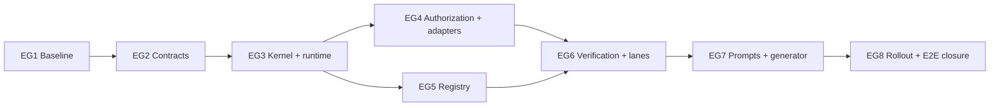

# Tasks: Developer Team Execution Convergence

## Source, Constraints, and Planning Rules

- Official Spec: `openspec/changes/developer-team-execution-convergence/spec.md`
- Official Design: `openspec/changes/developer-team-execution-convergence/design.md`
- Supporting context: `proposal.md`, `exploration.md`, `state.yaml`, and `events.yaml` in this change.
- Scope: execution dossier contracts, deterministic decisions, invocation authorization, registry coordination, staged verification/freshness, execution lanes, compatible rollout, and prompt convergence.
- Delivery model: eight coherent execution groups. Use one Apply owner for each group, keep work serial inside a group, and parallelize only the non-overlapping work explicitly listed in the execution batches.
- TDD: every behavioral task starts with a focused failing test, implements the minimum behavior, then refactors only while focused and affected checks remain green.
- Compatibility: all changes are additive, legacy behavior stays available behind the Design controls, and rollback retains additive evidence and append-only history.
- Generated-output rule: never directly edit `packages/core/src/skills/external/content.generated.ts`; change canonical inputs or `scripts/generate-skill-bundle.ts`, run the canonical generator, and prove deterministic regeneration.
- Historical/WIP protection: no task may modify historical OpenSpec records or any file, branch, artifact, registry history, or commit associated with `runner-capability-standardization` or commit `8c6d167`. Every Apply group must reject such intersections as `excluded-scope` and include a changed-path check in its evidence.

## Execution Group 1 — Compatibility Fixtures and Baseline Harness

### Task EG1-T1: Freeze legacy runtime, registry, prompt, and adapter behavior

**Requirement / Scenario / Design mapping**: REQ-ROLLOUT-001, REQ-ROLLOUT-005, REQ-BOUNDARY-001, REQ-BOUNDARY-002; scenarios “Shadow observation cannot change effects” and “Bureaucracy and excluded WIP remain outside execution”; Design Slice 0, TDD architecture, and migration matrix.
**Owner**: General Apply
**Priority**: P0
**Complexity**: High — split commits by fixture family if needed, but retain one owner and one compatibility gate.
**Parallel**: No — establishes the frozen baseline for every later group.
**Depends on / Status**: none / `unblocked`.

**Description**
Create reusable legacy/no-contract, pass, Verify-failure, Review-failure, incident, unchanged/shrinking/expanding-set, active/archive/legacy-registry, prompt/static-card, and adapter fixtures. Lock exact current behavior for `evaluateRepairIncident()`, `runOrchestratorPipeline()`, artifact-state CAS/idempotency, registry warnings/history, and static prompt generation without changing production behavior.

**Exact file scope**
- `packages/sdd-runtime/src/fixtures/execution-v1/**` — create canonical fixtures.
- Adjacent tests for `packages/sdd-runtime/src/contracts/repair-incident.ts`, `orchestrator/repair-loop-governance.ts`, `orchestrator/orchestrator-pipeline.ts`, and `artifact-state/artifact-state-manager.ts` — create/modify tests only.
- Adjacent tests under `packages/core/src/spec-registry/` and `packages/core/src/teams/developer/` — create/modify tests only.
- Adapter tests adjacent to `packages/adapter-opencode/src/{developer-team-install,prompt-generation}.ts` and `packages/adapter-pi/src/{developer-team-install,pi-team-profile}.ts` — create/modify tests only.
- Prohibited: product behavior changes; all other OpenSpec changes; direct edits to generated content; excluded WIP.

**TDD / verification**
- Red: add fixtures/assertions that fail until all legacy surfaces are captured.
- Green: complete fixture loaders and assertions without changing legacy implementation.
- Refactor: deduplicate fixture construction while preserving byte-level YAML/prompt snapshots.
- Focused commands: `bun test packages/sdd-runtime/src/orchestrator packages/sdd-runtime/src/artifact-state packages/core/src/spec-registry packages/core/src/teams/developer packages/adapter-opencode/src packages/adapter-pi/src`.
- Affected/broad: run package typechecks and the repository test command required by the package scripts before baseline acceptance.

**Required evidence / completion signal**
Committed test output identifies every fixture family; current APIs and YAML/prompt snapshots remain unchanged; a changed-path report proves no excluded WIP or unrelated OpenSpec path was touched.

**Compatibility / flag / rollback**
No flag or behavior change. Fixtures remain after rollback and become the compatibility oracle.

### Task EG1-T2: Establish safe telemetry vocabulary, baseline recorder, and runner-hook probes

**Requirement / Scenario / Design mapping**: REQ-ROLLOUT-001, REQ-ROLLOUT-002, REQ-ROLLOUT-003, REQ-ROLLOUT-004; scenarios “Shadow observation cannot change effects” and “Activation waits for measurable gates”; Design safe telemetry plan, Slice 0, and runner-native activation gate.
**Owner**: General Apply
**Priority**: P0
**Complexity**: Medium
**Parallel**: No — runs after EG1-T1 so observations are compared with frozen behavior.
**Depends on / Status**: EG1-T1 / `allowed-with-placeholder`: unsupported external runner hooks use probe results and shadow/static-compatible ports; they do not block core work or authorize effects.

**Description**
Add the closed telemetry event vocabulary, no-op/local-safe test sinks, frozen baseline measurements, deterministic cohort fixtures, and adapter capability probes. Probe failures must produce conformance evidence and keep that adapter shadow/static-compatible rather than inventing runner APIs.

**Exact file scope**
- `packages/sdd-runtime/src/execution/telemetry.ts` and adjacent tests — create.
- `packages/sdd-runtime/src/fixtures/execution-v1/**` — add baseline/secret/capability fixtures.
- Adapter conformance test fixtures adjacent to both adapter packages — create shared probe expectations.
- `.gitignore` — modify only to ignore `.deck/runtime/`.
- Prohibited: network calls, real runner installation, user-filesystem writes, authoritative behavior changes, generated direct edits, excluded WIP.

**TDD / verification**
- Red: prove seeded prompts, credentials, authorization proofs, absolute paths, and unrestricted diagnostics would leak or that unsupported hooks could be treated as active.
- Green: allowlist serialization, bounded local sink/no-op sink, deterministic cohort/baseline records, and fail-closed probe results.
- Refactor: centralize test seeds and event validation without adding a generic logging framework.
- Focused command: `bun test packages/sdd-runtime/src/execution/telemetry.test.ts packages/adapter-opencode packages/adapter-pi`.

**Required evidence / completion signal**
Zero seeded-secret leakage; observe output cannot control effects; baseline fields are frozen by risk tier/would-be lane; each adapter reports supported or unsupported with safe codes.

**Compatibility / flag / rollback**
Telemetry defaults to `off`/no-op; baseline is observational. Rollback disables the sink without deleting evidence.

### Task EG1-R1: Repair Batch A compatibility evidence, telemetry runtime value, adapter probes, and generator isolation

**Incident**: `INC-BATCH-A-GEN-SKILL-SUPPORT-ORDER-v1`
**Requirement / Scenario / Design mapping**: REQ-ROLLOUT-001, REQ-ROLLOUT-002, REQ-ROLLOUT-004, REQ-ROLLOUT-005, REQ-VERIFY-005, REQ-PROMPT-002, REQ-BOUNDARY-001, REQ-BOUNDARY-002; scenarios “Shadow observation cannot change effects”, “TDD and generated-source discipline are verified”, “Compact prompts are the production default after parity”, and “Bureaucracy and excluded WIP remain outside execution”; Design Slice 0 compatibility harness, safe telemetry allowlist/baseline plan, runner-native capability activation gate, deterministic canonical generator rule, and generated-output verification discipline.
**Owner**: General Apply
**Priority**: P0
**Complexity**: Medium — one bounded repair attempt; do not split across agents.
**Parallel**: No — this is the sole active repair before Batch B.
**Depends on / Status**: EG1-T1 and EG1-T2 incident evidence / `blocked-repair-planned`; one modifying repair attempt is authorized by `repair-incident.md`.

**Description**
Complete the missing Batch A acceptance value without expanding scope: validate telemetry runtime value rather than shape alone, record real bounded baseline rows from fixture executions, probe adapter-owned capability surfaces instead of `{}`, strengthen only label-only EG1-T1 scenarios into assertions against actual legacy behavior, and make generated-bundle traversal deterministic and its idempotency test failure-safe. Canonically regenerate only after the generator repair, then prove a byte-identical second generation.

**Exact allowed file scope**
- `packages/sdd-runtime/src/execution/telemetry.ts` and its adjacent tests — validate allowed runtime meaning, bounded recording, redaction, and non-authoritative behavior.
- `packages/sdd-runtime/src/fixtures/execution-v1/**` and only the EG1-T1/EG1-T2 adjacent tests already authorized in Batch A — replace label-only claims with actual legacy behavior checks and record bounded fixture-derived baseline rows.
- Adapter-owned capability surfaces and adjacent Batch A probe tests under `packages/adapter-opencode/**` and `packages/adapter-pi/**` — expose/read meaningful owned capabilities; unsupported capability remains explicit and non-authoritative.
- `scripts/generate-skill-bundle.ts` — sort every recursive `readdirSync()` traversal with the explicit locale-independent comparator `(a, b) => a < b ? -1 : a > b ? 1 : 0`; no canonical skill content change.
- The generated-bundle idempotency test adjacent to the generator — isolate writes or snapshot and restore original tracked bytes in `finally` so a failed assertion cannot leave tracked output dirty; Git restore/discard is forbidden.
- `packages/core/src/skills/external/content.generated.ts` — canonical generator output only after source repair; never hand-edit.
- `scripts/prepare-release.test.ts` — test code and build metadata are unchanged. If exactly the three audited stale metadata failures persist, record stable quarantine evidence only; do not fix, rewrite, or claim them resolved.

**Explicitly prohibited**
- Prompt convergence, prompt-profile changes, broad EG7 work, canonical skill-source changes, or content reduction.
- Batch B contracts or any EG2+ implementation.
- Direct edits to `packages/core/src/skills/external/content.generated.ts`.
- `git restore`, `git checkout --`, reset, clean, or any discard operation.
- Build-info regeneration, cleanup, metadata correction, or changing `scripts/prepare-release.test.ts` to hide the three unrelated failures.
- Historical OpenSpec edits, other OpenSpec changes, `apply-progress.md`, excluded WIP, commit `8c6d167`, or unrelated product scope.

**Bounded TDD / verification cycles**
- Red before repair: retain failing evidence for semantic telemetry validation, fixture-derived baseline recording, adapter-owned probes, locale-independent traversal order, and dirty-on-failure idempotency behavior.
- Green, modifying attempt 1 only: implement the minimum allowed changes. A recurrence of the fingerprint permits no second modifying attempt.
- Refactor: only within the same attempt and allowed files while focused checks remain green; no new abstraction or content changes.
- Cycle 1 — targeted/affected: run the exact Batch A telemetry, fixture, adapter-probe, generator, and idempotency tests; then the affected package tests and typechecks. Confirm generated output is clean after an intentionally failing isolated idempotency-test path.
- Cycle 2 — broad/drift: run the repository broad tests and typechecks, then canonical generation twice. The first post-repair generation may reconcile ordering-only output; the second must be byte-identical with zero generated drift.
- Quarantine: if the same three `scripts/prepare-release.test.ts` failures remain and still identify ignored build metadata `1bba98b` versus current HEAD, classify them as unrelated baseline evidence with stable test names/digests; do not credit Batch A with repair.

**Required evidence / completion signal**
Telemetry tests prove runtime value and bounded real baseline recording; OpenCode/Pi probes read adapter-owned capabilities and fail closed; strengthened fixtures exercise actual legacy behavior; recursive traversal is explicitly locale-independent; failed idempotency testing leaves tracked generated output unchanged; canonical double regeneration is byte-identical; no canonical skill source, historical OpenSpec, excluded WIP, or unrelated product path changed. Fresh independent Review must accept the repair before Batch B is unblocked.

**Compatibility / flag / rollback**
No active runtime or prompt-profile change. Telemetry remains off/no-op by default and probes remain observe/shadow gates. Rollback is source-level follow-up only under new authorization; no Git discard and no deletion/rewrite of evidence.

### Task EG1-R2: Repair the two Batch A acceptance oracle gaps under explicit override

**Incident**: `INC-BATCH-A-ACCEPTANCE-ORACLE-GAPS-v1`, linked to exhausted `INC-BATCH-A-GEN-SKILL-SUPPORT-ORDER-v1` and failed Review `incident-review-batch-a.md`.
**Human authorization**: `Autorizo el replan superior de Batch A y un único intento adicional para corregir los dos hallazgos del Review.`
**Requirement / Scenario / Design mapping**: REQ-ROLLOUT-001, REQ-ROLLOUT-005, REQ-VERIFY-005, REQ-PROMPT-002, REQ-BOUNDARY-001, REQ-BOUNDARY-002; scenarios “TDD and generated-source discipline are verified”, “Compact prompts are the production default after parity”, and “Bureaucracy and excluded WIP remain outside execution”; Design Slice 0 legacy compatibility fixtures, generated cleanliness/deterministic canonical generation rules, strict-TDD test architecture, and per-slice rollback boundary.
**Owner**: General Apply
**Priority**: P0
**Complexity**: Medium — exactly two acceptance oracles, one modifying attempt.
**Parallel**: No — sole authorized Apply work; Batch B remains blocked.
**Depends on / Status**: EG1-R1 exhausted and `incident-review-batch-a.md` failed / `blocked-repair-planned`; explicit human override authorizes this task only.

**Description**
Repair exactly the two false-negative acceptance oracles identified by fresh Review: replace compatibility assertions over fixture labels/literals with tests that call the corresponding real legacy behavior and assert exact outcomes, and make generated-bundle testing compare first temporary generation bytes with the tracked canonical bytes before proving a second temporary generation is byte-identical. The tracked generated file must remain unchanged on pass and failure.

**Exact allowed file scope**
- `packages/sdd-runtime/src/fixtures/execution-v1/baseline-harness.test.ts` and the smallest existing fixture/test harness module needed to invoke the already-existing legacy no-contract, pass/failure phase, incident, unchanged-set, shrinking-set, and expanding-set behavior — test/harness changes only.
- `packages/core/src/skills/external/__tests__/content.test.ts` and the smallest generator test-harness support needed to direct canonical generation to temporary destinations — test/harness changes only.
- No tracked generated output is an authorized modification target.

**Explicitly prohibited**
- Product/runtime behavior changes. If existing behavior demonstrably prevents the exact legacy oracle, stop and report rather than broadening automatically.
- Direct generated edits, canonical external skill-content changes, generator semantic/content changes, prompt convergence, EG7 work, Batch B/EG2 work, or unrelated tests.
- Git restore, checkout-discard, reset, clean, or any destructive/discard operation.
- Build-info generation/cleanup/repair, changes to `scripts/prepare-release.test.ts`, historical OpenSpec edits, other OpenSpec changes, `apply-progress.md` during this Tasks replan, excluded WIP/commit `8c6d167`, or any new unrelated product path.

**Bounded TDD / verification cycles**
- Red: demonstrate that literal-only compatibility checks survive a broken real legacy outcome and that a stale tracked generated bundle can pass the current two-run-only test.
- Green, modifying attempt 1 of 1: invoke actual legacy behavior with exact outcome assertions; generate to a temporary destination, compare first-generation bytes to tracked `packages/core/src/skills/external/content.generated.ts`, generate independently to a second temporary destination, compare first/second bytes, and assert tracked bytes are unchanged on success and injected failure.
- Refactor: only the smallest test-harness cleanup inside the same attempt; no product or canonical content changes.
- Cycle 1 — targeted/affected: run the compatibility harness and generated-bundle tests, then affected runtime/core tests and typechecks; verify tracked generated bytes are unchanged after both pass and induced failure.
- Cycle 2 — broad/drift: run broad repository tests and typechecks, perform the existing exact three-test stale-build-metadata quarantine comparison, and prove zero tracked generated drift. No extra canonical rewrite is authorized.

**Required evidence / completion signal**
Every named compatibility scenario invokes corresponding real legacy behavior and asserts exact result/state/set outcomes; first temporary generation equals tracked canonical bytes; second temporary generation equals the first; tracked generated bytes remain unchanged on pass and failure; exactly the previously audited three stale build-metadata failures, if persistent, match stable names and metadata evidence and receive no repair credit; no prohibited path changes. Fresh independent Review must accept both findings before Batch B is unblocked.

**Compatibility / flag / rollback**
Tests only; no behavior/profile/flag activation. This override grants no later retry. Any recurrence or hard-stop condition ends modification and requires a new explicit decision.

## Execution Group 2 — V1 Immutable Batch, Failure, and Delta Contracts

### Task EG2-T1: Implement canonicalization, redaction, immutable batch, manifest, and legacy adapters

**Requirement / Scenario / Design mapping**: REQ-CONTRACT-001–006, REQ-CONTRACT-002, REQ-ROLLOUT-005; scenarios “One immutable batch crosses every execution surface” and “Findings normalize without leaking or identity drift”; Design canonical hashing/redaction and contract interfaces.
**Owner**: General Apply
**Priority**: P0
**Complexity**: High — use internal contract-focused commits, not separate agents.
**Parallel**: No — canonical primitives precede every consumer.
**Depends on / Status**: EG1-R2 completed within its single attempt, both verification cycles passed, tracked generated output remained clean, and fresh independent Review accepted both oracle repairs / `blocked`.

**Description**
Implement RFC-8785-compatible canonical JSON, SHA-256 digests, structural redaction/path normalization, deep freeze, `ApplyBatchContractV1`, phase-neutral `FailureManifestV1`, stable finding identity, and in-memory legacy/repair-incident adaptation. Reject unsupported versions, unsafe evidence, identity collisions, and batch-reference mismatches before effect.

**Exact file scope**
- `packages/sdd-runtime/src/contracts/canonical.ts` — create.
- `packages/sdd-runtime/src/contracts/{apply-batch,failure-manifest}.ts` — create.
- `packages/sdd-runtime/src/contracts/repair-incident.ts` — compatibility-only changes if required; old parser/results remain exact.
- Adjacent contract tests and `packages/sdd-runtime/src/fixtures/execution-v1/**` — create/modify.
- Prohibited: filesystem/clock/runner effects in contracts; rewriting legacy fixtures; generated direct edits; excluded WIP.

**TDD / verification**
- Red: unknown version, semantic-equality replay, mutation, sparse/non-finite/prototype input, set/order normalization, secret/path redaction, collision, mismatch, severity reclassification, and legacy fixture tests.
- Green: smallest parsers/builders satisfying all table cases.
- Refactor: keep canonical internals unexported and contracts plain/frozen.
- Focused command: `bun test packages/sdd-runtime/src/contracts/canonical.test.ts packages/sdd-runtime/src/contracts/apply-batch.test.ts packages/sdd-runtime/src/contracts/failure-manifest.test.ts packages/sdd-runtime/src/contracts/repair-incident.test.ts`.

**Required evidence / completion signal**
Byte-identical canonical replay; stable full digests and truncated labels; all forbidden data absent; unknown mandatory versions and collisions fail safely; legacy bytes remain untouched.

**Compatibility / flag / rollback**
Gate consumption with `executionContracts=off|observe|enforce`, initially `observe`; rollback to `observe/off` while retaining readable V1 artifacts.

### Task EG2-T2: Implement failure delta, dossier revisions, decisions, intents, and additive exports

**Requirement / Scenario / Design mapping**: REQ-CONTRACT-001–006, REQ-DECISION-001, REQ-DECISION-006, REQ-REGISTRY-001; scenarios “Failure delta routing table is enforced” and “Production and replay use the same kernel”; Design V1 contract placement and append-only dossier revision.
**Owner**: General Apply
**Priority**: P0
**Complexity**: High
**Parallel**: No — depends on canonical identity semantics.
**Depends on / Status**: EG2-T1 / `unblocked`.

**Description**
Add remaining V1 DTOs/parsers for deltas, decisions, lane, verification, causal context, authorization claims/reference, registry intents, and execution dossiers. Implement mutually exclusive deterministic delta buckets and append-only dossier revision with unchanged issued batch identity; export additive public contracts without removing existing exports.

**Exact file scope**
- `packages/sdd-runtime/src/contracts/{failure-delta,execution-decision,invocation-authorization,registry-intent,verification-state,causal-context,execution-lane,execution-dossier}.ts` — create.
- `packages/sdd-runtime/src/orchestrator/failure-delta.ts` — create.
- `packages/sdd-runtime/src/index.ts` — additive exports only.
- Adjacent unit/table tests and shared fixtures — create/modify.
- Prohibited: kernel action policy (EG3), effects, mutable helpers, export removal/reinterpretation, generated direct edits, excluded WIP.

**TDD / verification**
- Red: bucket precedence, reopen/regression/reclassification, risk-vector dominance, revision chain, mismatched references, invalid evidence, and public export tests.
- Green: indexed O(n) comparison after normalized input and frozen revision builders.
- Refactor: remove duplicated validation while retaining explicit schema boundaries.
- Focused command: `bun test packages/sdd-runtime/src/contracts packages/sdd-runtime/src/orchestrator/failure-delta.test.ts packages/sdd-runtime/src/index.test.ts`.

**Required evidence / completion signal**
Deterministic delta digests and sets across repeated fixtures; invalid evidence blocks decisions; existing exports/tests remain green.

**Compatibility / flag / rollback**
Additive/warning-first V1 reads; no legacy rewrite. `executionContracts` controls authority, not readability.

### Task EG2-R1: Repair Batch B contract trust boundaries and failure-delta integrity

**Incident**: `INC-BATCH-B-CONTRACT-TRUST-DELTA-INTEGRITY-v1`; authoritative findings `B-B1`–`B-B7` in `review-batch-b.md`.
**Requirement / Scenario / Design mapping**: REQ-CONTRACT-002–006, REQ-DECISION-001–002, REQ-DECISION-006, REQ-VERIFY-005, REQ-ROLLOUT-005; scenarios “One immutable batch crosses every execution surface”, “Findings normalize without leaking or identity drift”, “Failure delta routing table is enforced”, “Production and replay use the same kernel” only for invalid-evidence contract behavior, and “TDD and generated-source discipline are verified”; Design contract boundary lines 108–176, failure manifest/delta lines 178–250, canonicalization/redaction lines 397–421, registry-intent integrity lines 372–395, public/internal export boundary line 110, and TDD architecture lines 689–707.
**Owner**: General Apply
**Priority**: P0
**Complexity**: High — security/data/public-boundary repair; retain one owner across both attempts.
**Parallel**: No — sole Batch B repair before Batch C.
**Depends on / Status**: failed fresh Review `review-batch-b.md` after EG2-T1/EG2-T2 / `blocked-repair-planned`.

**Description**
Repair all seven Batch B trust-boundary and acceptance defects without entering Batch C: make every V1 boundary DTO fail closed at runtime; structurally allowlist/redact safe persisted fields; reject normalized-key and semantic-identity collisions; make finding identity stable under authoritative-root/path-prefix variation; enforce exact same-batch nested reference continuity; implement complete related/unrelated-baseline delta buckets and security/regression dominance; and narrow root exports to supported boundary APIs.

**Finding-to-oracle repair matrix**

| ID | Exact anchors | Concrete reproducer | Expected output | Allowed files | Completion evidence |
|---|---|---|---|---|---|
| B-B1 | REQ-CONTRACT-005; Design redaction lines 408–421 | Build a manifest containing `CHECK_SECRET`, `RESULT_SECRET`, `NESTED_SECRET`, `REMEDIATION_SECRET`, `EXTRA_SECRET`, unknown secret-named keys, nested objects/arrays, and private-key-like values. | Safe allowlisted manifest bytes contain none of the seeds; closed codes are validated; input is rejected as `unsafe-diagnostic-content` when safe meaning cannot be retained. | `contracts/{canonical,failure-manifest}.ts` and exact adversarial tests | Exact serialized bytes/absence checks, rejection codes, immutable output, and no secret-derived hash fields. |
| B-B2 | REQ-DECISION-001–002; Positive progress definition; Design delta lines 230–250 | Resolve one critical finding while adding a low security-relevant related finding; include unrelated baseline, reopened, and reclassified cases. | Mutually exclusive `resolved`, `persistent`, `newRelated`, `newUnrelatedBaseline`, `regressed`, and `reclassified` sets; security regression prevents positive progress; regression weighting is applied; unrelated baseline is quarantined and never credited. | `contracts/failure-delta.ts`, `orchestrator/failure-delta.ts`, exact table tests | Exact bucket arrays, risk vectors, movement, progress, and deterministic repeated output—never subset/count-only assertions. |
| B-B3 | REQ-CONTRACT-002, REQ-DECISION-006; Design dossier lines 157–176 and intent lines 372–395 | Parse/revise dossiers with wrong decision batch, intent batch/digest, authorization binding, change ID, nested schema/digest, or broken prior/current delta chain. | Reject before freeze/issue with `batch-reference-mismatch` or `invalid-evidence`; never silently recompute supplied issued digests. | `contracts/{execution-dossier,execution-decision,registry-intent,invocation-authorization,verification-state,causal-context,failure-delta}.ts` and boundary tests | Every cross-reference mismatch rejected through public parsers; valid same-batch dossier remains frozen and replay-stable. |
| B-B4 | REQ-CONTRACT-003, REQ-CONTRACT-006; Design normalization lines 399–406 | Build equivalent Review findings under `/home/alice/repo/...` and `/mnt/ci/repo/...` using injected authoritative roots/repository-relative identities and varied extensions. | Exact same full fingerprint/finding ID and safe normalized relative locations; no filename heuristic or host prefix enters identity. | `contracts/{canonical,failure-manifest}.ts` and path table tests | Exact identity equality across prefixes and inequality when obligation/category/subject/oracle changes. |
| B-B5 | REQ-CONTRACT-003, REQ-CONTRACT-006, REQ-DECISION-006; Design lines 399–406 | Supply `src\\a` and `src/a` artifact keys with different digests; supply duplicate semantic findings/evidence in reordered forms. | Normalized-key collision is rejected; duplicate finding identities are rejected as `invalid-evidence`; duplicate equivalent evidence is deterministically normalized or rejected before digest/risk, never double-counted. | `contracts/{apply-batch,failure-manifest,canonical}.ts`, `orchestrator/failure-delta.ts`, adversarial tests | No overwrite dependence, no count inflation, exact rejection/normalization outcome and stable risk totals. |
| B-B6 | REQ-CONTRACT-003; Design line 110 and V1 interfaces lines 108–395 | Feed unknown schemas, malformed enums/digests/unsafe strings, mutable/prototype-bearing JSON to each V1 boundary; inspect root exports. | Every DTO has a narrow parse/build API that validates, clones, redacts where applicable, hashes, and freezes; unknown mandatory versions fail closed; internal canonical/path/freeze/digest helpers are absent from root exports unless explicitly public in Design. | All EG2 contract modules and `packages/sdd-runtime/src/index.ts`; parser/export tests | Runtime rejection tables for every DTO, immutability checks, and exact supported export-surface assertions preserving pre-existing APIs. |
| B-B7 | REQ-VERIFY-005; Design TDD lines 689–707 | Execute B-B1–B-B6 only through public builders/parsers, including legacy adaptation and exact prior API behavior. | Tests assert exact safe bytes, IDs, buckets, risk vectors, errors, frozen output, and legacy outcomes; forged manifests, aggregate counts, subset-only checks, and label-only fixtures cannot satisfy acceptance. | Existing Batch B tests plus focused adversarial table files under `packages/sdd-runtime/src/contracts/` and `orchestrator/` | Red evidence for every reproducer, green exact-oracle tables, affected/broad results, and unchanged legacy behavior. |

**Exact allowed file scope**
- `packages/sdd-runtime/src/contracts/{canonical,apply-batch,failure-manifest,failure-delta,execution-decision,invocation-authorization,registry-intent,verification-state,causal-context,execution-lane,execution-dossier}.ts`.
- `packages/sdd-runtime/src/orchestrator/failure-delta.ts`.
- `packages/sdd-runtime/src/index.ts`, only to expose supported contract-level APIs/types and remove newly overexposed EG2 internals while preserving all pre-Batch-B exports.
- Existing/new exact Batch B tests adjacent to those files and Batch B fixtures only.
- No other product, adapter, CLI, prompt, generated, registry-runtime, or Batch C file is authorized.

**TDD and adversarial verification**
- Red: capture executable failing cases for every B-B1–B-B7 row through public boundaries before modification.
- Green: smallest complete contract/delta correction; do not implement EG3 action routing.
- Refactor: only while exact adversarial tables and prior API/legacy fixtures remain green.
- Prohibited test shortcuts: count inflation, aggregate-pass evidence, subset-only bucket assertions, label/literal-only fixtures, forged unparsed DTOs, and assertions that omit exact bytes/IDs/errors.
- Per attempt cycle 1: focused adversarial tables, all contract tests, affected `packages/sdd-runtime` and core export/compatibility tests, then typecheck.
- Per attempt cycle 2: broad repository tests, exact established three-test stale-build-metadata quarantine comparison, generated-output hash/drift check, and changed-path scope audit.

**Bounded attempt/review transition**
- Attempt 1 of at most 2 is authorized now, followed by a fresh independent Review.
- Attempt 2 is authorized only if Review 1 emits an exact remainder manifest proving a strictly shrinking failure set, no new related regression, no secret leakage, and no security/high-critical regression. It may address only that manifest.
- Unchanged/expanded findings, repeated identical fingerprint/no progress, absent exact remainder manifest, or any hard-stop condition forbids attempt 2 and escalates/stops.

**Required evidence / completion signal**
All seven rows close through exact public-boundary adversarial tests; no secret leakage; no security regression can be positive progress; all required delta buckets exist; dossier/reference chains are exact and same-batch; path identity is prefix-stable; collisions/duplicates cannot inflate or overwrite semantics; all V1 DTOs fail closed and freeze; root exports contain only supported APIs; legacy behavior remains exact; generated output is unchanged; fresh independent Review accepts. Batch C remains blocked until this signal is complete.

**Compatibility / flag / rollback**
Remain within `executionContracts=observe`; changes are additive or remove only newly unintended internal root exports, preserving all established public APIs and readable legacy records. Rollback retains evidence and does not weaken redaction or safety floors.

### Task EG2-R2: Replace the Batch B V1 trust boundary behind supported public names

**Incident**: `INC-BATCH-B-TRUST-BOUNDARY-REPLACEMENT-v1`; preserves exhausted `INC-BATCH-B-CONTRACT-TRUST-DELTA-INTEGRITY-v1` and links `review-batch-b.md`, `review-batch-b-repair-1.md`, and authoritative corrective design `design-repair-batch-b.md`.
**Human authorization**: `Autorizo el replan superior de Batch B y un único intento de reemplazo integral del trust boundary para corregir B-B1 a B-B7.`
**Requirement / Scenario / Design mapping**: REQ-CONTRACT-001–006, REQ-DECISION-001–002, REQ-DECISION-006, REQ-VERIFY-005, REQ-ROLLOUT-005, REQ-BOUNDARY-001–002; scenarios “One immutable batch crosses every execution surface”, “Findings normalize without leaking or identity drift”, “Failure delta routing table is enforced”, “Production and replay use the same kernel” only for invalid-evidence boundary behavior, “TDD and generated-source discipline are verified”, and “Bureaucracy and excluded WIP remain outside execution”; `design-repair-batch-b.md` authority pipeline, recursive schemas, secret/rejection model, path context, identity/dedup, dossier/revision integrity, full delta/risk algebra, exact public API boundary, legacy compatibility, adversarial matrix, retain/replace/delete map, and one-attempt sequence.
**Owner**: General Apply — one coherent owner for all sub-checks; no per-module fan-out.
**Priority**: P0
**Complexity**: High — coherent security/public-contract replacement, not local predicate patching.
**Parallel**: No — sole authorized modifying work; Batch C remains blocked.
**Depends on / Status**: EG2-R1 attempt 1 exhausted with unchanged `7 → 7`, secret-leak hard stop, and ineligible attempt 2; corrective design completed; explicit human override received / `blocked-repair-planned`.

**Description**
Replace the shallow trust-boundary internals coherently behind stable supported V1 names. Every public builder/parser must pass unknown input through one internal recursive authority kernel before hashing/freezing; all leaf contracts, delta algebra, dossier references/revisions, exports, adversarial tests, and legacy compatibility must use that authority model. This is a new one-attempt higher-level replan, never EG2-R1 attempt 2.

**Stable one-attempt sub-check sequence**

| Check ID | Required action and exact gate |
|---|---|
| EG2-R2-S01 | Before modification, freeze the exact pre-Batch-B root export set; search repository consumers/persisted fixtures for faulty V1 wire records, especially non-empty decision intents. If evidence requires a read-only adapter or any exact B-B1–B-B7 public-entrypoint RED oracle is missing, stop before consuming product modification scope. |
| EG2-R2-S02 | Add complete RED public-entrypoint reproducers for B-B1–B-B7 and the full parser mutation matrix. Require exact error codes, safe bytes, IDs, digests, arrays, vectors, movement, progress, export keys, frozen state, and legacy outcomes. Broad `toThrow`, subsets, labels, modulo/property sampling, and aggregate counts are non-evidence. |
| EG2-R2-S03 | Replace internal `canonical.ts` trust primitives with recursive safe inspection, closed-shape readers, scalar/bound validation, canonical-wire checking, bounded extension policy, structural/value secret policy, authoritative path context, normalization/collision detection, plain cloning, and recursive freeze. Raw secret material must never reach SHA-256. |
| EG2-R2-S04 | Replace leaf builders/parsers in dependency order: Apply batch; evidence/finding/manifest; authorization claims/reference; lane; verification; causal context; registry intent; decision. Builders normalize/issue; parsers require already-canonical wire and verify supplied IDs/digests. |
| EG2-R2-S05 | Implement relationship exactly: `batch_related | unrelated_baseline`; ambiguous/legacy defaults to `batch_related`; unrelated baseline requires validated pre-existing evidence plus `status: pre_existing` and receives no risk movement or repair credit. |
| EG2-R2-S06 | Replace finding/evidence identity and dedup: authoritative repository-relative subjects, prefix/OS stability, full-fingerprint equality, truncated collision rejection, duplicate finding rejection, exact-equivalent evidence deterministic dedup, semantic evidence collision rejection, and no count/risk inflation. |
| EG2-R2-S07 | Replace full delta/risk algebra: complete disjoint/coverage-exact buckets; deprecated `added` equals exact union; baseline excluded; lexicographic hard-stop/critical/high/uncovered/medium/low vector; regression penalty; exact recomputation by parser; no security/critical/high/data-loss/auth/Git-safety regression can be positive. |
| EG2-R2-S08 | Replace dossier issuance/parsing/revision integrity: acyclic batch→manifest→delta→decision→dossier intents→revision; deprecated decision intents empty; recursively parse every nested DTO; exact change/batch/digest/auth/intent/delta bindings; unique intent IDs/keys; active finding resolution; prefix-preserving append-only revisions; no silent nested issuance/recomputation. |
| EG2-R2-S09 | Replace V1 wildcard/root exports with the corrective-design explicit allowlist while preserving every pre-Batch-B export. Internal canonical, crypto, shape, redaction, path, freeze, digest/reference, and trusted-computation helpers remain non-root. |
| EG2-R2-S10 | Run exact public adversarial matrix and legacy compatibility: every parser mutation, successful parse/build identity, secret corpus, inline redaction equivalence, POSIX/Windows paths, identity/evidence/collision tables, delta parser/table/safety precedence, dossier corruption/revision cases, exact export set, legacy parser/evaluator/pipeline/adaptation and unchanged source serialization. |
| EG2-R2-S11 | Verification cycle 1: focused adversarial/all-contract tests, affected `packages/sdd-runtime`, core compatibility/export tests, workspace typecheck, and exact changed-path audit. |
| EG2-R2-S12 | Verification cycle 2: broad repository checks, exact known-baseline comparison including separately recorded baseline-health evidence, generated-byte hash/drift check, and prohibited-scope audit. |
| EG2-R2-S13 | Fresh independent security/design Review cycle 1/1. Only complete closure of B-B1–B-B7 accepts Batch B and unblocks Batch C; failure consumes the sole replacement attempt and hard-stops without retry. |

**Exact allowed files and symbols**
- `packages/sdd-runtime/src/contracts/canonical.ts` — internal recursive readers/inspectors, canonical JSON/digest, secret policy, `RepositoryPathContextV1`, path/code/set normalization, collision checks, plain clone/freeze; root runtime export limited to `Sha256Digest` type.
- `packages/sdd-runtime/src/contracts/apply-batch.ts` — `buildApplyBatchContractV1`, `parseApplyBatchContractV1`, supported V1 types.
- `packages/sdd-runtime/src/contracts/failure-manifest.ts` — `buildFailureManifestV1`, `parseFailureManifestV1`, `adaptRepairIncidentToFailureManifestV1`, relationship/finding/evidence logic.
- `packages/sdd-runtime/src/contracts/failure-delta.ts` and `packages/sdd-runtime/src/orchestrator/failure-delta.ts` — `parseFailureDeltaV1`, `computeFailureDeltaV1`, complete validated algebra only; no EG3 action routing.
- `packages/sdd-runtime/src/contracts/execution-decision.ts` — `buildExecutionDecisionV1`, `parseExecutionDecisionV1`; deprecated intent field remains empty.
- `packages/sdd-runtime/src/contracts/invocation-authorization.ts` — claims/reference builders/parsers named in corrective Design; no proof service/runtime authorization work.
- `packages/sdd-runtime/src/contracts/registry-intent.ts` — `buildRegistryIntentV1`, `parseRegistryIntentV1`.
- `packages/sdd-runtime/src/contracts/verification-state.ts` — `buildStagedVerificationStateV1`, `parseStagedVerificationStateV1`; no Batch C scheduling policy.
- `packages/sdd-runtime/src/contracts/causal-context.ts` — `buildCausalContextV1`, `parseCausalContextV1`.
- `packages/sdd-runtime/src/contracts/execution-lane.ts` — `buildLaneDecisionV1`, `parseLaneDecisionV1`; no lane routing.
- `packages/sdd-runtime/src/contracts/execution-dossier.ts` — `createExecutionDossierV1`, `reviseExecutionDossierV1`, `parseExecutionDossierV1`; delete/replace silent `addDigest`/`preserveOrIssueDigest` trust manufacture.
- `packages/sdd-runtime/src/index.ts` — exact pre-Batch-B exports plus corrective-design approved V1 runtime/type allowlist only.
- Existing and focused new Batch B contract/delta/export tests adjacent to these modules; replace `batch-b-repair.test.ts` subset proof and forged-manifest delta tests with exact public-entrypoint tables; retain happy-path tests only as smoke.
- `packages/sdd-runtime/src/contracts/repair-incident.ts` only if strictly necessary to keep the existing in-memory adapter semantically exact while routing promotion through the corrected V1 builder; legacy parser/result/source serialization must remain unchanged.

**Frozen implementation defaults before GREEN**
- Freeze exact maximum depth/collection/string/total bytes for contracts/extensions/findings/evidence and namespaced code grammar before GREEN; record constants in internal tests.
- Use structured `relationship`; ambiguous/legacy=`batch_related`; validated `unrelated_baseline` requires pre-existing evidence and gets zero credit.
- Unsafe credential prose rejects by default; only bounded recognized inline assignment may become constant `[redacted-secret]` after complete post-scan, with distinct raw secrets producing identical safe bytes/digest or both rejecting.
- Inject authoritative repository root/style; never infer from filenames or directory markers; issued wire paths are canonical repository-relative only.
- Exact equivalent evidence deduplicates; same semantic tuple/different safe payload rejects; all collisions run before IDs/digests/risk.
- Parsers reject normalization-changing wire and self-consistent malformed DTOs; nested supplied digests are verified, never reissued.

**Explicitly prohibited**
- Local/shallow patching that retains cast→partial validate→self-hash→freeze authority; EG2-R1 attempt 2; any second replacement attempt or automatic retry.
- Batch C or later kernel/runtime/execution-control-plane/adapter/registry/lane/prompt work; generated-file or canonical-skill changes; build-info repair; new dependency/package; unrelated tests/refactors/product paths.
- Historical OpenSpec rewrites, failed Review edits, prior incident/budget/event changes, excluded `runner-capability-standardization` WIP/commit `8c6d167`, or Git discard/reset/restore/clean.
- Broad `toThrow`, subset arrays/objects, label-only fixtures, modulo/property sampling that omits exact matrix rows, aggregate count-only proof, forged typed DTOs bypassing public entrypoints, or digest/hash of raw secret bytes.

**Bounded TDD / verification / Review**
- RED must be complete for B-B1–B-B7 through public entrypoints before trust-boundary product modification. Missing exact oracle is a stop, not permission to improvise during GREEN.
- The sole replacement attempt is consumed when product/test modification begins; maximum two verification cycles: S11 targeted/affected, then S12 broad+drift/scope.
- One fresh independent Review after the attempt. There is no conditional attempt 2, blind retry, or implied further override.

**Required evidence / completion signal**
All S01–S13 gates are evidenced; every B-B1–B-B7 reproducer is closed exactly; accepted bytes/digests contain and depend on no secret material; malformed self-hashed DTOs reject; security/critical/high regressions cannot be positive; identities are checkout-prefix/OS independent; duplicates/collisions cannot inflate or overwrite; dossier/revision references are exact and acyclic; explicit root exports equal pre-Batch-B plus approved V1 set; legacy parser/evaluator/pipeline/adaptation and source bytes are unchanged; generated bytes and prohibited paths are unchanged; fresh Review accepts. Batch C remains blocked until that signal.

**Compatibility / flag / rollback**
Keep `executionContracts=observe|off`; corrected contracts do not become authoritative during replacement. Preserve supported V1 names and all pre-Batch-B exports. A failed replacement hard-stops and does not restore shallow validators; rollback requires separate source-level authorization and never Git discard.

### Task EG2-R3A: Public matrix plus trust kernel and leaf parsers

**Incident / Slice**: `INC-BATCH-B-ADAPTIVE-THREE-SLICE-CLOSURE-v1`; Slice 1/3. This preserves partial EG2-R2 work and is not an EG2-R2 retry.
**Human authorization**: `Autorizo un override adaptativo para cerrar Batch B en tres slices seriales, con máximo tres Apply launches, sin nuevas aprobaciones mientras el failure set se reduzca y no aparezcan regresiones de seguridad, scope o generated drift.`
**Owner**: General Apply — the same owner continues through R3B/R3C.
**Priority**: P0
**Complexity**: High
**Parallel**: No
**Depends on / Status**: EG2-R2 exhausted; adaptive override / `unblocked` for launch 1 only.
**Requirement / Design / reproducer mapping**: REQ-CONTRACT-003–006, REQ-DECISION-006, REQ-VERIFY-005, REQ-ROLLOUT-005, REQ-BOUNDARY-001–002; finding-normalization and TDD/generated-discipline scenarios; corrective Design runtime inspection, builder/parser separation, recursive schemas, secret policy, path context, relationship, identity/evidence/collisions, public matrix, sequence steps 1–4; B-B1/B-B4/B-B5/B-B6/B-B7 exact reproducers.

**Description and RED/GREEN gate**
Before further production edits, classify every public-entrypoint mutation/security/path/evidence case. Partial EG2-R2 fixes may be GREEN only when they satisfy the exact oracle; every still-open finding must be RED and no case may remain unclassified. Then finish the shared recursive boundary kernel, secret policy, authoritative repository context, relationship/identity/dedup, and all leaf V1 builders/parsers. Require exact errors, safe bytes, IDs/digests, arrays, freeze, path equality and collision outcome—not broad `toThrow`, subset, label, modulo, or count-only checks.

**Allowed files/symbols**
- `contracts/canonical.ts`: internal recursive inspection/readers, closed shapes, bounds/codes/extensions, secret scans, `RepositoryPathContextV1`, path/set/Unicode normalization, collisions, canonical wire, clone/freeze.
- `contracts/apply-batch.ts`: `build/parseApplyBatchContractV1`.
- `contracts/failure-manifest.ts`: `build/parseFailureManifestV1`, legacy adapter, relationship/finding/evidence identity.
- `contracts/{execution-decision,invocation-authorization,registry-intent,verification-state,causal-context,execution-lane}.ts`: corrective-design leaf builders/parsers only.
- Adjacent exact public matrix tests; `repair-incident.ts` only for exact legacy adaptation.

**Relationship**: exactly `batch_related | unrelated_baseline`; ambiguous/legacy defaults `batch_related`; unrelated baseline requires validated pre-existing evidence plus `status: pre_existing` and receives no risk movement/repair credit.

**Verification commands/timeouts**
- `bun test packages/sdd-runtime/src/contracts` (180000 ms).
- `bun test packages/sdd-runtime` and `bun test packages/core` (300000 ms each); `bunx tsc --noEmit` (300000 ms).
- Fresh independent Verify must emit the exact remaining B-B1–B-B7 manifest.

**Continuation / completion**
Expected closure: B-B1/B-B4/B-B5/B-B6/B-B7. R3B requires a registry-recorded strictly smaller exact set, no new regression, no security/scope/generated drift, complete matrix classification, changed-path audit, unchanged generated hash, and only the exact three unchanged `prepare-release.test.ts` failures quarantined.

**Prohibited / rollback**
No delta/dossier work except leaf compatibility, final exports, Batch C/later capability, adapters/registry/prompts/generated/build-info/unrelated paths, dependency, historical rewrite, excluded WIP, or Git discard/reset/restore/clean. Preserve partial changes. Hard stop retains evidence; rollback is separately authorized forward work.

### Task EG2-R3B: Delta, dossier, and reference algebra

**Incident / Slice**: `INC-BATCH-B-ADAPTIVE-THREE-SLICE-CLOSURE-v1`; Slice 2/3.
**Owner**: General Apply — same owner as R3A/R3C.
**Priority**: P0
**Complexity**: High
**Parallel**: No
**Depends on / Status**: R3A launch 1/3 consumed at pre-edit matrix hard stop; explicit remaining-launch continuation override / `unblocked` for launch 2/3 only.
**Requirement / Design / reproducer mapping**: REQ-CONTRACT-001–003, REQ-DECISION-001–002, REQ-DECISION-006, REQ-VERIFY-005; immutable-batch, delta-routing and invalid-evidence scenarios; corrective Design relationship, full delta/risk algebra, dossier/reference/revision chain, sequence steps 5–6; B-B2/B-B3 plus exact R3A remainder.

**Description and RED/GREEN gate**
Using only validated Slice A contracts, finish complete FailureDelta/risk algebra and recursive dossier/reference/revision integrity. RED/GREEN must assert exact sorted/disjoint/coverage-complete arrays, `added` union, vectors, regression penalty, movement/progress, baseline zero credit, hard-risk dominance, every nested corruption, exact reference digest, intent uniqueness/prefix, and append-only revision behavior through public entrypoints.

**Allowed files/symbols**
- `contracts/failure-delta.ts`: `parseFailureDeltaV1` and algebra invariants.
- `orchestrator/failure-delta.ts`: `computeFailureDeltaV1`; no EG3 routing.
- `contracts/execution-dossier.ts`: `create/revise/parseExecutionDossierV1`; no silent digest issuance/recomputation.
- Slice A leaf files only for an exact carried remainder; adjacent exact delta/dossier tests.

**Verification commands/timeouts**
- Exact delta/dossier/adaptive matrix tests (240000 ms).
- `bun test packages/sdd-runtime`, `bun test packages/core`, and `bunx tsc --noEmit` (300000 ms each).
- Fresh independent Verify emits exact before/after manifest.

**Continuation / completion**
Expected closure: B-B2/B-B3 plus exact R3A remainder. R3C requires another strict shrink, no new regression/unsafe progress/reference corruption/security/scope/generated drift, and registry evidence.

**Prohibited / rollback**
No EG3 decisions, control plane, adapters, registry coordinator, lanes, prompts, final export cleanup beyond compilation, generated/build-info/unrelated paths, dependencies, historical edits, excluded WIP, or Git discard. Preserve existing partial work; hard stop retains evidence.

**Remaining-launch continuation amendment — normative and superseding where inconsistent**
- Exact authorization: `Autorizo usar los dos Apply launches restantes de Batch B: el primero debe completar la matriz y reducir el failure set; el segundo debe cerrarlo en cero y pasar Verify y Review.`
- Launch accounting is fixed at launch 2/3; the original cap remains 3 and no retry is added.
- Before any further production edit, finish `batch-b-r3a-public-matrix.test.ts` into the complete independently executing parser×mutation/security/path/evidence matrix. Classify every B-B1–B-B7 case through package-root public entrypoints with one exact oracle per case; pre-existing partial fixes may be GREEN, every open case must be RED, and aggregate loops must not hide later failures.
- After complete classification, finish the shared recursive trust kernel, secret/path policy, authoritative repository context, relationship, identity/dedup, and all leaf V1 builders/parsers in the R3A allowed files. This amendment moves those unfinished R3A obligations into R3B before any delta/dossier work; delta/dossier closure is reserved for R3C except compilation-safe use of validated leaf contracts.
- Exact public evidence must assert errors, canonical bytes, no secret/digest influence, IDs/digests, arrays, path equality, collision/dedup outcomes, plain recursive freeze, and unchanged input. Broad `toThrow`, subset, label, modulo, forged DTO, or count-only evidence is invalid.
- Commands/timeouts: complete matrix focused test and all contract tests (300000 ms); `bun test packages/sdd-runtime` and `bun test packages/core` (300000 ms each); `bunx tsc --noEmit` (300000 ms); generated hash and changed-path audit.
- Fresh independent Verify is mandatory. Continuation to R3C requires an exact strict shrink from `{B-B1…B-B7}`, no new or unclassified finding, and no secret/security/scope/generated/API/legacy/unrelated regression, all registry-recorded.
- Launch 2 target is meaningful closure of trust-kernel/leaf-boundary findings, expected B-B1/B-B4/B-B5/B-B6/B-B7. Any unchanged/expanded set or hard stop consumes launch 2 and ends the override.

### Task EG2-R3C: Public API, legacy, and integrated closure

**Incident / Slice**: `INC-BATCH-B-ADAPTIVE-THREE-SLICE-CLOSURE-v1`; Slice 3/3.
**Owner**: General Apply — same owner as R3A/R3B.
**Priority**: P0
**Complexity**: High
**Parallel**: No
**Depends on / Status**: R3B fresh Verify records a strict shrink from 7 with no prohibited regression / `blocked` until that registry evidence exists.
**Requirement / Design / reproducer mapping**: REQ-CONTRACT-001–006, REQ-DECISION-001–002, REQ-DECISION-006, REQ-VERIFY-005, REQ-ROLLOUT-005, REQ-BOUNDARY-001–002; all Batch B scenarios; corrective Design API boundary, legacy compatibility, complete matrix, retain/replace map, sequence steps 7–10; B-B1–B-B7 integrated closure and exact R3B remainder.

**Description and RED/GREEN gate**
Closure/integration only: finalize exact root exports, legacy compatibility, the complete public corrective matrix, exact remainder, broad verification with sufficient timeout, generated drift/scope audit, and final Review readiness. Add no product capability. Require exact export keys, errors/bytes/IDs/digests/vectors/arrays, deep freeze, and exact legacy parser/evaluator/pipeline/adaptation/source outcomes; no broad/subset/label/modulo/forged/count-only evidence.

**Allowed files/symbols**
- `packages/sdd-runtime/src/index.ts`: exact pre-Batch-B exports plus approved V1 allowlist; internal helpers absent.
- Authorized R3A/R3B files only for exact integrated remainder fixes.
- `repair-incident.ts` and legacy tests only for exact compatibility.
- Adjacent Batch B public adversarial/export/legacy/integration tests.

**Verification commands/timeouts**
- Focused/affected contract/orchestrator/index tests, runtime, core, and typecheck (300000 ms each).
- Repository broad command with timeout at least 900000 ms; timeout is failure, not quarantine. Then typecheck (300000 ms), generated SHA-256/drift, and exact scope audit.
- Fresh independent Verify and fresh independent security/design Review mandatory.

**Continuation / final completion**
Exact manifest must be empty with no new finding/regression. Only exact unchanged three stale `prepare-release.test.ts` failures may be quarantined. Binary-doctor timeout/failure is not pre-approved and blocks unless separately proven/classified without repair credit. Accepted final Verify+Review unblocks Batch C.

**Prohibited / rollback**
No new capability, Batch C/later code, runtime wiring, adapters/registry/lanes/prompts, generated/canonical-skill/build-info edits, unrelated paths/tests/refactors, dependencies, historical rewrite, excluded WIP, or Git discard. Override expires after this launch or hard stop; rollback requires separate forward authorization.

**Remaining-launch final amendment — normative and superseding where inconsistent**
- Launch accounting is fixed at launch 3/3. No retry, additional launch, or automatic override follows.
- Close the exact registry-recorded R3B remainder through complete FailureDelta/risk algebra and recursive dossier/reference/revision integrity, using only validated R3B contracts. Then finalize exact root exports and legacy compatibility.
- Run the entire corrective public matrix, affected checks, and broad verification. Broad wall timeout must be at least 900000 ms (15 minutes); timeout is blocking and cannot be quarantined.
- Run generated SHA-256/drift and exact changed-path scope audits. Only the exact unchanged three stale `prepare-release.test.ts` failures may be quarantined. Binary-doctor failure/timeout is unapproved and blocks unless independently proven pre-existing without repair credit.
- Fresh independent Verify and fresh independent security/design Review must both report zero B-B blocking findings and zero new blocking findings. Any nonzero, expanded, or unclassified set hard-stops and Batch B remains unaccepted.
- Batch C depends on accepted R3C final Verify/Review; no new capability is authorized.

**Explicit final-launch reactivation amendment — final authority**
- Exact authorization: `Autorizo reactivar el Apply launch 3/3 exclusivamente para cerrar B-B1, B-B2, B-B3 y B-B7, con aceptación solo si Verify y Review reportan cero findings bloqueantes.`
- Accounting remains maximum 3, consumed 2, remaining/authorized 1. This reactivates only EG2-R3C launch 3/3 after failed R3B Verify; it adds no launch, retry, or further override.
- Active exact manifest is `{B-B1, B-B2, B-B3, B-B7}` from `verify-batch-b-r3b.md`; no other product scope is authorized.
- **B-B1**: add the short JWT-like credential and complete protected-placement corpus; prove zero raw or secret-derived persisted/digest influence with individually named exact public-entrypoint assertions.
- **B-B2**: complete exact FailureDelta bucket/risk algebra, structured related/baseline rules, baseline zero credit, effective 2x regression penalty, reopened/reclassified coverage, and security/critical/high/data-loss/auth/Git-safety precedence.
- **B-B3**: complete recursive dossier and every nested contract/digest/reference/revision validation with no silent digest repair/reissuance.
- **B-B7**: add exact matrix rows for `parseFailureDeltaV1` and `parseExecutionDossierV1`; replace every broad `toThrow()` and aggregate parser/mutation loop with individually named exact assertions; complete exact export and legacy matrix.
- Run integrated affected checks, typecheck, broad verification with explicit wall timeout ≥900000 ms, generated SHA-256/drift, and changed-scope audit. Only the exact three unchanged stale `prepare-release.test.ts` failures may be quarantined; binary-doctor is unapproved.
- After Apply, fresh independent Verify and fresh independent Review run independently in registry-deferred mode. Each may write only its R3C report plus immutable registry intent. Orchestrator reconciliation is permitted only if both report zero blocking findings and consistent exact evidence.
- Any nonzero/expanded/unclassified set, secret influence, unsafe progress, reference/revision corruption, incomplete matrix, API/legacy regression, generated drift, excluded/Batch C scope, unrelated path, broad timeout/unapproved failure, or registry inconsistency is a final hard stop.

## Execution Group 3 — Deterministic Decision Kernel and Production Runtime Wiring

### Task EG3-R1: Repair the Batch C host-facing control-plane boundary

**Incident**: `INC-BATCH-C-DECISION-BOUNDARY-PRODUCTION-SAFETY-v1`; authoritative findings `C-R1`…`C-R6` in `review-batch-c-direct-recovery.md`; authoritative Verify `verify-batch-c-direct-recovery.md`.
**Human authorization**: user standing Automatic approval and repeated instruction to continue/solve.
**Requirement / Scenario / Design mapping**: REQ-CBC-001–008 (additive from `spec-repair-batch-c.md`); REQ-DECISION-001–006, REQ-AUTH-001–002, REQ-ROLLOUT-002, REQ-ROLLOUT-005, REQ-BOUNDARY-001–002, REQ-VERIFY-005 (permanent from `spec.md`); Design repair `design-repair-batch-c.md` modules, types, and matrices.
**Owner**: General Apply
**Priority**: P0
**Complexity**: High — one coherent repair; no micro-slices; no new task family.
**Parallel**: No — one owner carries full causal context through all phases.
**Depends on / Status**: EG2-R3C accepted; Batch B complete; `unblocked` under repair governance.

**Description**
Deliver a production-ready, immutable, host-facing control-plane boundary that is independently invokable by a real runner bridge without containing the bridge itself. The boundary exposes one-way dependency architecture: the effect/adapter boundary depends on the pure decision kernel and contracts; the kernel and contracts do not depend on the effect/adapter boundary or any runner-native host module. No circular import between the legacy pipeline module and the control-plane module.

**One-way composition architecture (design-repair-batch-c.md lines 39-79)**
The boundary is `composeDeveloperTeamExecutionV1()` with additive successors. Its mandatory canonical input is a mode-discriminated union where every mode explicitly carries authority state, Git-safety state, governance context, and effect binding. Omission of any mandatory field is invalid evidence; it is never interpreted as permission.

**Exact REQ-CBC obligations this task closes**

| ID | Obligation | Evidence |
|---|---|---|
| REQ-CBC-001 | One-way host-facing control-plane boundary | No circular orchestrator↔execution import; `execution/` does not import `orchestrator-pipeline.ts` for production logic |
| REQ-CBC-002 | Canonical all-input decision record freeze and replay | `ExecutionReplayRecordV1` frozen at ingress; kernel consumes only the frozen canonical record; `replayExecutionDecisionV1()` is pure and closed over captured authority/Git/terminal/policy/legacy/effect |
| REQ-CBC-003(a) | Authority mandatory and validated; missing/invalid distinct `stop` rationale | `ExecutionAuthorityStateV1` discriminated union with `not-applicable | authorized | missing | invalid`; no boolean shorthand |
| REQ-CBC-003(b) | Git confirmation mandatory for destructive capability; absence is not coerced | `GitSafetyStateV1` discriminated union; `!== false` coercion removed from production boundary |
| REQ-CBC-003(c) | Authority and Git validation immediately before any tool-capable delegation | Validation occurs at `executeTargetedRepairV1()` entry before capability invocation |
| REQ-CBC-004 | Shared protected-risk predicate including data-loss | `classifyProtectedRiskV1()` in `protected-risk.ts` is consumed by both `failure-delta.ts` and `decision-kernel.ts`; `blocksAutomaticRepair` is true for `data-loss`, `security`, `highOrCritical`, `authorizationOrGitSafety`, `uncoveredRequirement` |
| REQ-CBC-005 | Total invalid-input safe identity without raw-derived influence | `classifyInvalidExecutionInputV1()` is total and non-throwing; cyclic, prototype-polluting, secret-bearing values return fixed `unclassifiable` projection; digest is computed from classification identity only |
| REQ-CBC-006 | Explicit shadow/legacy/active composition; shadow requires legacy; terminal governance is restrictive-only | Shadow mandates `legacyInput` and `legacy` result; `resolveTerminalGovernanceGuardV1()` never upgrades repair, never converts no-progress into repair, and never bypasses authority/Git/security/Full-SDD floors |
| REQ-CBC-007 | Exhaustive exact test matrix, individually named, no aggregate loops | 68 rows from `design-repair-batch-c.md` lines 504–569; every row is a named `test(...)` with exact action, ordered rationale codes, digest replay, terminal guard result, authority reason, and zero/non-zero effect result |
| REQ-CBC-008 | Batch C completion gate — boundary plus matrix, not host reachability | Structural test fails unless a real non-test production caller exists OR the requirement is correctly deferred to Batch D under `HO-BC-TO-BD-HOST-REACHABILITY-v1` |

**C-R1 / C-C2 / C-B1 resolution**
`C-R1` (circular wrapper) and `C-C2-PRODUCTION-CALLER-DISCONNECTED-v1` / `C-B1` are deferred to Batch D via `RQH-BC-001`–`RQH-BC-003` and `HO-BC-TO-BD-HOST-REACHABILITY-v1`. The structural test (`C-ARCH-03`) documents that a test/export wrapper alone is insufficient and the requirement is open until Batch D provides the real runner-native bridge. This is not a safety reduction; Batch C is host-ready without being production-reached.

**C-R2 / C-B2 closure evidence**
`C-AUTH-01` through `C-AUTH-04` and `C-GIT-01` through `C-GIT-06` are individually named and pass. Authority and Git state are mandatory discriminated inputs; missing/invalid/overbroad produces `stop` with stable rationale; capability digest mismatch at the effect boundary produces `modification-not-authorized` with zero effects.

**C-R3 / C-B3 closure evidence**
`C-RISK-01` through `C-RISK-10` are individually named. The shared `classifyProtectedRiskV1` classifier feeds both delta and kernel. Positive shrink with remaining security/high/critical/data-loss/authorization/Git-safety/uncovered-requirement risk produces `escalate`/`stop`/`replan_spec`; `targeted_repair` is forbidden. New related regression always produces Design/Task replan.

**C-R4 / C-B4 closure evidence**
`C-INVALID-01` through `C-INVALID-06` and `C-REPLAY-01` through `C-REPLAY-03` are individually named. Cyclic, prototype-polluting, throwing-getter, revoked-proxy, secret-sentinel, and unsupported-version inputs are classified safely and never throw; the invalid record digest is computed from the fixed classification projection, never from raw bytes or raw-derived hashes.

**C-R5 / C-B5 closure evidence**
`C-SHADOW-01` through `C-SHADOW-03` and `C-LEGACY-01` are individually named. Shadow mandates `legacyInput`; omitting it produces `invalid-evidence`. Valid shadow produces the unchanged legacy result as authoritative plus a redacted comparison with zero V1 effects.

**C-R6 / C-B6 closure evidence**
All 68 rows from the design repair matrix are individually named and green. The matrix includes unrelated-baseline quarantine, low/medium/high/related regression, data-loss risk, mixed roots, Full-SDD floor, missing/invalid authority distinct rationales, missing destructive-Git confirmation, repeated fingerprint, terminal budgets, review anchoring, legacy/no-dossier, shadow zero-effect, capability digest mismatch, allowed/blocked target mismatch, non-delegating actions, adapter error, and structural connectivity.

**Exact file scope**
- `packages/sdd-runtime/src/orchestrator/decision-kernel.ts` — mandatory discriminated authority/Git inputs; shared protected-risk classifier; exact rationale precedence
- `packages/sdd-runtime/src/orchestrator/protected-risk.ts` — `classifyProtectedRiskV1` and `ProtectedRiskClassificationV1`; one shared classifier for delta and kernel
- `packages/sdd-runtime/src/orchestrator/repair-loop-governance.ts` — `resolveTerminalGovernanceGuardV1`; restrictive-only mapping
- `packages/sdd-runtime/src/orchestrator/orchestrator-pipeline.ts` — remove import of `execution/` modules; `runOrchestratorPipeline` unchanged
- `packages/sdd-runtime/src/execution/execution-control-plane.ts` — discriminated `ExecutionAuthorityStateV1` and `GitSafetyStateV1`; `classifyInvalidExecutionInputV1`; `replayExecutionDecisionV1`; `ExecutionReplayRecordV1`
- `packages/sdd-runtime/src/execution/execution-composition.ts` — `composeDeveloperTeamExecutionV1`; one-way legacy composition; canonical facade
- `packages/sdd-runtime/src/execution/execution-adapter-port.ts` — `TargetedRepairCapabilityDescriptorV1`; `executeTargetedRepairV1`; `TargetedRepairCapabilityV1`
- `packages/sdd-runtime/src/index.ts` — additive canonical Batch C exports; deep re-export removed to break the cycle
- `packages/sdd-runtime/src/execution/execution-composition.test.ts` — create; 68 individually named cases from design-repair-batch-c.md
- `packages/sdd-runtime/src/orchestrator/decision-kernel.test.ts` — update; authority/Git/risk rows
- `packages/sdd-runtime/src/execution/execution-control-plane.test.ts` — update; authority/Git/invalid/replay rows
- `packages/sdd-runtime/src/orchestrator/repair-loop-governance.test.ts` — update; terminal rows
- `packages/sdd-runtime/src/contracts/batch-b-replacement.test.ts` — update; exact export surface assertions

**Explicitly prohibited**
- Implementing the runner-native host bridge inside Batch C; that belongs to Batch D
- Optional boolean shorthands for authority or Git state; missing must be `invalid-evidence`, not `authorized`
- Boolean coercion `!== false` for Git confirmation
- A test or export wrapper as production reachability evidence
- Aggregate loops, parameterized tables, `toMatchObject`, or `toThrow` without exact named cases
- Any change to `runner-capability-standardization`, `openspec/archive`, generated output, or historical OpenSpec

**Bounded TDD / verification**
- Cycle 1 — focused: all 68+ individually named matrix cases, kernel, control-plane, governance, and composition tests
- Cycle 2 — affected: `bun test packages/sdd-runtime`, `bun test packages/core`, `bunx tsc --noEmit`
- Cycle 3 — broad: `bun test` with 900000 ms wall timeout
- Then fresh independent registry-deferred Verify and Review

**Required evidence / completion signal**
All REQ-CBC-001–008 obligations closed with individually named evidence. Structural test documents host-reachability gap as open under `HO-BC-TO-BD-HOST-REACHABILITY-v1` (not a false closure). C-R2…C-R6 and C-B2…C-B6 have individually named green reproducers. C-R1/C-C2/C-B1 are correctly deferred to Batch D. Fresh independent Verify and Review both report zero blocking findings. Generated SHA-256 unchanged. Batch D is unblocked only after both gates pass.

**Compatibility / flag / rollback**
`decisionKernel=legacy|shadow|active`, initially `shadow`. Active mode requires `invocationAuthorization=invocation-required` and `RQH-BC-001`–`RQH-BC-003` pass. Rollback restores prior legacy authoritative control; additive evidence and append-only history are retained.

### Task EG3-T1: Implement the root-cause decision kernel and terminal-governance adapter

**Requirement / Scenario / Design mapping**: REQ-DECISION-001–004, REQ-DECISION-006, REQ-REVIEW-001–002; scenarios “Failure delta routing table is enforced”, “Terminal guard cannot manufacture progress”, and “Review finding is anchored and new scope is classified”; Design decision table and repair-governance integration.
**Owner**: General Apply
**Priority**: P0
**Complexity**: High
**Parallel**: No — central semantics must stabilize before effects.
**Depends on / Status**: EG2-R3C accepted by final fresh independent Verify and Review with empty B-B1–B-B7 manifest / `blocked`.

**Description**
Implement deterministic root-cause precedence, exact routing actions/rationale order, review anchoring/scope classification, and the compatibility projection to `evaluateRepairIncident()`. Existing governance may only maintain/increase restrictiveness and must never manufacture progress or select repair.

**Exact file scope**
- `packages/sdd-runtime/src/orchestrator/decision-kernel.ts` — create.
- `packages/sdd-runtime/src/orchestrator/repair-loop-governance.ts` — add compatibility adapter/export support; preserve evaluator signature and exact legacy outcomes.
- `packages/sdd-runtime/src/index.ts` — export the existing evaluator and new V1 API additively.
- Adjacent kernel table/regression tests and fixtures — create/modify.
- Prohibited: adapter/registry effects, changing legacy evaluator outputs, generated direct edits, excluded WIP.

**TDD / verification**
- Red: every REQ-DECISION-002 row, hard-stop precedence, ambiguous diagnosis-once, unrelated baseline quarantine, invalid oracle, no-progress, repeated fingerprint, budget exhaustion, and review anchoring.
- Green: pure deterministic kernel and restrictive terminal adapter.
- Refactor: retain stable enum rationale order and no free-form decision inputs.
- Focused command: `bun test packages/sdd-runtime/src/orchestrator/decision-kernel.test.ts packages/sdd-runtime/src/orchestrator/repair-loop-governance.test.ts`.

**Required evidence / completion signal**
Each table fixture evaluated twice yields identical digest/action/rationale; unsafe evidence never returns modification; old repair-governance snapshots are unchanged.

**Compatibility / flag / rollback**
`decisionKernel=legacy|shadow|active`, initially `shadow`; legacy path remains exact and rollback retains shadow evidence.

### Task EG3-T2: Wire the same kernel into shadow and production execution boundaries

**Requirement / Scenario / Design mapping**: REQ-DECISION-005–006, REQ-CONTRACT-002, REQ-ROLLOUT-002; scenarios “Production and replay use the same kernel” and “Shadow observation cannot change effects”; Design `runExecutionDecisionPipelineV1()` and `executeDeveloperTeamStepV1()`.
**Owner**: General Apply
**Priority**: P0
**Complexity**: High
**Parallel**: No — production authority boundary.
**Depends on / Status**: EG3-T1 / `unblocked`.

**Description**
Create the execution adapter/port and control-plane plan/execute boundary; compose the unchanged legacy pipeline with dossier validation, delta/kernel evaluation, and terminal governance. Shadow and active must call the same kernel; shadow may emit safe comparison only and production must record input digest/version/action/rationales.

**Exact file scope**
- `packages/sdd-runtime/src/execution/{execution-control-plane,execution-adapter-port}.ts` — create.
- `packages/sdd-runtime/src/orchestrator/orchestrator-pipeline.ts` — additive versioned successor/composition; preserve current API/result.
- `packages/sdd-runtime/src/index.ts` — additive exports.
- Adjacent integration/replay tests — create/modify.
- Prohibited: real runner/YAML effects in pure planning, changing current pipeline semantics, prompt authority, generated edits, excluded WIP.

**TDD / verification**
- Red: no production caller, shadow-effect attempt, replay divergence, invalid dossier modification, and batch mismatch tests.
- Green: versioned production caller and immutable normalized results.
- Refactor: ensure adapters cannot reinterpret action or widen target scope.
- Focused command: `bun test packages/sdd-runtime/src/orchestrator/orchestrator-pipeline.test.ts packages/sdd-runtime/src/execution/execution-control-plane.test.ts`.

**Required evidence / completion signal**
A mock production execution records kernel input/output; replay matches exactly; shadow performs zero authoritative effects; invalid evidence returns `invalid-evidence`.

**Compatibility / flag / rollback**
Use `decisionKernel` and `executionContracts` independently; active-cohort failure pauses to shadow/legacy without deleting evidence.

## Execution Group 4 — Invocation Authorization and OpenCode/Pi Adapter Parity

### Task EG4-T1: Implement process-bound one-use authorization issuance and validation

**Requirement / Scenario / Design mapping**: REQ-AUTH-001–003; scenarios “Valid least-privilege invocation is allowed once” and “Invalid authorization has zero modifying effects”; Design ephemeral HMAC and immediate validation.
**Owner**: General Apply
**Priority**: P0
**Complexity**: High
**Parallel**: No — shared semantics precede adapters.
**Depends on / Status**: EG3-T2 / `unblocked`.

**Description**
Implement injected-clock/random process-local HMAC issuance, five-minute maximum lifetime, exact batch/task/role/action/target binding, blocked-target exclusion, one-use nonce reservation before delegation, restart invalidation, and proof-free safe references/diagnostics.

**Exact file scope**
- `packages/sdd-runtime/src/execution/invocation-authorization-service.ts` — create.
- `packages/sdd-runtime/src/contracts/invocation-authorization.ts` — refine only within V1 contract.
- `packages/sdd-runtime/src/execution/execution-control-plane.ts` — validate immediately before adapter invocation.
- Adjacent security tests — create/modify.
- Prohibited: persisting/logging proofs, keys, raw user statements, or unrestricted provenance; static card as authority; generated edits; excluded WIP.

**TDD / verification**
- Red: tamper, missing, expired/future, replay, restart, malformed, revoked, role/change/batch/task/target mismatch, overbroad scope, blocked-target intersection, failed-launch reuse, and leakage tests.
- Green: least-privilege issuer/validator and nonce consumption.
- Refactor: keep key handles/internal canonical proof machinery non-exported.
- Focused command: `bun test packages/sdd-runtime/src/execution/invocation-authorization-service.test.ts packages/sdd-runtime/src/execution/execution-control-plane.test.ts`.

**Required evidence / completion signal**
Valid envelope authorizes exactly one matching invocation; all invalid cases yield `modification-not-authorized` before adapter call and reveal no proof.

**Compatibility / flag / rollback**
`invocationAuthorization` remains `static-compatible` until adapter parity. After a cohort declares `invocation-required`, rollback may stop modification but may not silently fall back.

### Task EG4-T2: Add shared conformance suite and equivalent OpenCode/Pi execution bridges

**Requirement / Scenario / Design mapping**: REQ-AUTH-004, REQ-AUTH-001–003, REQ-ROLLOUT-002; scenario "Invalid authorization has zero modifying effects"; Design runner bridges, CLI composition, and capability negotiation.
**Owner**: General Apply
**Priority**: P0
**Complexity**: High — two adapters, but one owner prevents semantic drift.
**Parallel**: No — OpenCode and Pi share fixtures and must be reviewed as one parity boundary.
**Depends on / Status**: EG4-T1, EG1-T2, EG3-R1 / `allowed-with-placeholder`: bridge bootstrap stays shadow/static-compatible where a supported external hook is unproven.

**RQH-BC-001 mandatory host-reachability acceptance handoff — `HO-BC-TO-BD-HOST-REACHABILITY-v1`**

Before EG4-T2 can be marked complete, a real runner-native host bridge MUST invoke the Batch C control-plane boundary on a non-test, non-prompt-only execution path. Test/export wrappers, renamed forwarding helpers, in-process re-exports, and indirect unit tests of the bridge are insufficient. The evidence MUST include the host→bridge→control-plane→effect adapter invocation chain and the resulting immutable phase result/manifest/registry intent.

Specific required evidence per `spec-repair-batch-c.md §3` and `design-repair-batch-c.md`:
- `D-REACH-01` through `D-REACH-10`: Pi launch plan loads extension; Pi extension hook invokes bridge; Pi bridge invokes Batch C composition/effect; OpenCode install plan materializes plugin; OpenCode plugin hook invokes bridge; OpenCode bridge invokes Batch C composition/effect; packaged artifact audit; inbound-call architecture audit; runner-host end-to-end fixtures for both adapters.
- `RQH-BC-002`: real OpenCode and Pi runner-native bridges invoke `composeDeveloperTeamExecutionV1()` on a non-test invocation path.
- `RQH-BC-003`: bridge supplies validated host inputs (authoritative artifacts + registry state + policy, invocation-scoped authorization envelope, destructive-Git-confirmation/security-hard-stop state); invalid inputs are rejected at the Batch C boundary with stable error codes and zero modifying effects.

EG4-T2 completion requires `RQH-BC-001`–`RQH-BC-003` evidence in addition to all EG4-T1 and EG4-T2 functional tests. Without the host-reachability proof, EG4-T2 is incomplete even if all other EG4 tasks pass.

**Description**
Implement both runner-native bridges against one shared conformance fixture package, installation/bootstrap wiring, and CLI control-plane descriptor composition. Adapter-specific mechanisms may differ; allow/deny codes, immediate validation, result normalization, role isolation, and zero-effect denial must be identical.

**Exact file scope**
- `packages/adapter-opencode/src/{developer-team-execution-bridge,index,developer-team-install,prompt-generation}.ts`, `assets/opencode/plugins/developer-team-execution.ts`, and package metadata — create/modify.
- `packages/adapter-pi/src/{developer-team-execution-bridge,index,developer-team-install,pi-team-launch,pi-team-profile}.ts`, `assets/pi/extensions/developer-team-execution.ts`, and package metadata — create/modify.
- `apps/cli/src/{opencode-launch-command,pi-launch-command}.ts` and package metadata only if direct runtime composition requires it — modify.
- Shared adapter conformance fixtures/tests — create once, consumed by both packages.
- Prohibited: overloading installation `RunnerCapabilities.runAction()`, real installs/network/user files in tests, static-card authority, generated edits, excluded WIP.

**TDD / verification**
- Red: run identical accepted/rejected/unsupported fixtures against both adapters and require parity.
- Green: bridges/bootstrap with fail-closed capability reports.
- Refactor: remove adapter-local decision semantics and duplicate expectations.
- Focused command: `bun test packages/adapter-opencode packages/adapter-pi apps/cli`.

**Required evidence / completion signal**
One conformance report proves equivalent outcomes and safe codes; unsupported hook cases remain non-authoritative; static generation/install APIs remain green.

**Compatibility / flag / rollback**
Activate `invocation-required` adapter-by-adapter only after both semantic suites pass; keep static cards as defense-in-depth. Roll back pre-gate to static-compatible, post-gate to safe stop.

## Execution Group 5 — Central Registry Coordinator and Recovery

### Task EG5-T1: Add AST-preserving registry documents, semantic intents, and pair validation

**Requirement / Scenario / Design mapping**: REQ-REGISTRY-001–002, REQ-REGISTRY-004, REQ-ROLLOUT-005; scenarios “Registry replay and competing intents are safe” and “Legacy history survives migration and rollback”; Design semantic intent and core registry boundary.
**Owner**: General Apply
**Priority**: P0
**Complexity**: High
**Parallel**: No — serializer/validation contract precedes filesystem coordination.
**Depends on / Status**: EG2-T2 / `unblocked`; may begin after EG2-T2 while EG4 runs because scopes do not overlap, but must merge before EG5-T2.

**Description**
Create AST-preserving registry document DTO/serializer and pure pair validation. Extend v1 schemas/events additively for optional intent/transaction/batch metadata; map immutable semantic intents to append-only state/event changes while retaining unknown keys, comments, ordering, warnings, artifacts, provenance, and history.

**Exact file scope**
- `packages/core/src/spec-registry/{documents,serializer}.ts` — create.
- `packages/core/src/spec-registry/{schema,types,events,yaml,validator,index}.ts` — compatibility-preserving modifications.
- Adjacent historical/golden/pair-validation tests — create/modify.
- `openspec/registry-schema.md` — document optional warning-first metadata after tests pass.
- Prohibited: arbitrary YAML patch API, normalization/backfill, history rewrite, direct edits to other change registries, generated edits, excluded WIP.

**TDD / verification**
- Red: active/archive/legacy/malformed-warning-compatible fixtures, comment/unknown-key preservation, conflict, replay, removal attempt, and absent artifact tests.
- Green: semantic append-only merge and pure validation.
- Refactor: preserve old parser/validator/event APIs and exports.
- Focused command: `bun test packages/core/src/spec-registry`.

**Required evidence / completion signal**
Byte-diff outside appended nodes is empty; exact replay is no-op; conflicting intent yields `registry-intent-conflict`; all old registry fixtures remain readable.

**Compatibility / flag / rollback**
Dual-read/single-write only; additions warning-first. No registry flag becomes active in this task.

### Task EG5-T2: Implement WAL, pair-CAS coordinator, crash recovery, and single-writer rollout

**Requirement / Scenario / Design mapping**: REQ-REGISTRY-001–005; scenarios “Registry replay and competing intents are safe”, “Registry recovers from every partial-write boundary”, and “Legacy history survives migration and rollback”; Design WAL/lock/fsync/rename recovery sequence.
**Owner**: General Apply
**Priority**: P0
**Complexity**: High — keep store, transaction, and coordinator as serial sub-slices.
**Parallel**: No — filesystem correctness requires one coherent owner.
**Depends on / Status**: EG5-T1, EG3-T2 / `unblocked`.

**Description**
Implement pair-store capability types, exclusive lock, prepared journal, pair digests, temp/fsync/rename commit, roll-forward recovery, idempotency, CAS conflict handling, journal-aware reads, and coordinator-only intent commit. Wire execution results to coordinator ports without converting specialists until prompt/return-contract task EG7-T1.

**Exact file scope**
- `packages/sdd-runtime/src/artifact-state/{registry-coordinator,registry-pair-store,filesystem-registry-store,registry-transaction}.ts` — create.
- `packages/sdd-runtime/src/artifact-state/artifact-state-manager.ts` — shared capability types only; preserve old API/results.
- `packages/sdd-runtime/src/execution/execution-control-plane.ts` — consume coordinator port.
- `packages/sdd-runtime/package.json` — add only Design-required core/YAML dependencies.
- Adjacent failpoint/transaction/integration tests — create/modify.
- Prohibited: calling `submitStateUpdate()` twice, blind stale-lock deletion, overwrite of third digests, dual-write, destructive repair, raw proof/diagnostic in journals, generated edits, excluded WIP.

**TDD / verification**
- Red: failpoints at journal write/fsync, each temp write/fsync, each rename, commit marker, cleanup; lock contention/staleness; all base/new/third-digest combinations; duplicate/conflicting intents; legacy writer interference.
- Green: deterministic roll-forward under injected FS/process/clock ports.
- Refactor: keep existing per-artifact adapter behavior exact and pair transaction local.
- Focused command: `bun test packages/sdd-runtime/src/artifact-state packages/sdd-runtime/src/execution/execution-control-plane.test.ts`.

**Required evidence / completion signal**
Every crash fixture ends at prior complete or intended complete transition; no orphan completion, duplicate event, lost provenance, prompt, or destructive repair; centralized mode has exactly one writer.

**Compatibility / flag / rollback**
`registryWriter=distributed-compatible|centralized`, phase-by-phase. Rollback first recovers pending journal, then restores compatible writer; committed history remains.

## Execution Group 6 — Staged Verification, Freshness, and Risk Lanes

### Task EG6-T1: Enforce staged verification, causal context, independence, and freshness

**Requirement / Scenario / Design mapping**: REQ-VERIFY-001–005; all four Verification acceptance scenarios; Design staged-verification/fresh-agent policy.
**Owner**: General Apply
**Priority**: P0
**Complexity**: High
**Parallel**: No — one scheduler owns stage and freshness transitions.
**Depends on / Status**: EG3-T2, EG4-T2 / `allowed-with-placeholder`: where a runner cannot prove fresh-agent scheduling/role isolation, remain shadow/static-compatible and raise to Full-SDD or stop before modification.

**Description**
Implement legal targeted→affected-area→broad transitions, explicit bounded skip/defer evidence, mandatory broad floors, generated-source/TDD evidence validation, causal-context projection, role independence, and fresh final Review triggers after incident/material/high-risk repair.

**Exact file scope**
- `packages/sdd-runtime/src/orchestrator/{staged-verification,freshness-policy}.ts` — create.
- `packages/sdd-runtime/src/contracts/{verification-state,causal-context,execution-dossier}.ts` — V1 refinements only.
- `packages/sdd-runtime/src/execution/execution-control-plane.ts` — schedule normalized invocations/results.
- Adjacent scheduler, freshness, generated-drift, and integration tests — create/modify.
- Prohibited: transcripts/raw logs in causal context, same identity across roles, silent skipped stages, accepting generated direct edits, excluded WIP.

**TDD / verification**
- Red: illegal order, failed-stage advance, incomplete deferral, mandatory-broad skip, same-agent collision, post-modification stale Verify, missing fresh Review, causal leakage, and generated/TDD evidence gaps.
- Green: deterministic scheduler and fail-closed capability negotiation.
- Refactor: one unchanged-code Verify may run all stages; preserve compact redacted causality.
- Focused command: `bun test packages/sdd-runtime/src/orchestrator/staged-verification.test.ts packages/sdd-runtime/src/orchestrator/freshness-policy.test.ts packages/sdd-runtime/src/execution/execution-control-plane.test.ts`.

**Required evidence / completion signal**
All stage/freshness table cases pass; mandatory broad checks cannot be deferred; Apply/Verify/Review identities are independent; canonical generation evidence is required for generated drift.

**Compatibility / flag / rollback**
Enforce by lane/cohort after conformance; rollback scheduling to legacy while retaining evidence and permanent independence/security floors.

### Task EG6-T2: Select deterministic Fast, Guarded, and Full-SDD lanes with escalation

**Requirement / Scenario / Design mapping**: REQ-LANE-001–004, REQ-VERIFY-002/004, REQ-BOUNDARY-001; scenario “Lane floors and escalation dominate optimization”; Design lane table and existing scorer/router composition.
**Owner**: General Apply
**Priority**: P0
**Complexity**: High
**Parallel**: No — lane plan consumes verification/freshness rules.
**Depends on / Status**: EG6-T1 / `unblocked`.

**Description**
Implement versioned lane selection over current risk/quality primitives, deterministic cohort selection, ordered rationale/floor evidence, policy/user-only escalation, immediate mid-run escalation, and lane-to-check-plan adaptation. Preserve `computeRiskScore()` and `routeQuality()` behavior for legacy callers.

**Exact file scope**
- `packages/sdd-runtime/src/orchestrator/execution-lane-router.ts` — create.
- Existing risk scorer/quality router and `orchestrator-pipeline.ts` — additive composition only if required.
- `packages/core/src/config/deck-config.ts` — add and normalize Design-defined execution flags and safe defaults.
- Adjacent boundary/shadow/config tests — create/modify.
- Prohibited: lowering explicit/user/project floors, alternate score system, silent downgrade, prompt-selected lane, generated edits, excluded WIP.

**TDD / verification**
- Red: low/medium/high/security/auth/public-API/migration/destructive/cross-package/unknown/explicit-Full-SDD boundaries, policy escalation, new-risk escalation, cohort determinism, and shadow/active parity.
- Green: pure selector and additive check-plan adapter.
- Refactor: stable rationale order; no telemetry input drives modification.
- Focused command: `bun test packages/sdd-runtime/src/orchestrator/execution-lane-router.test.ts packages/sdd-runtime/src/orchestrator/risk-scorer.test.ts packages/sdd-runtime/src/orchestrator/quality-router.test.ts packages/core/src/config`.

**Required evidence / completion signal**
Identical evidence/policy replays identically; every mandatory floor selects Full-SDD; new evidence only maintains/raises lane; legacy score/routes remain green.

**Compatibility / flag / rollback**
`routePolicy=legacy-triage|shadow-risk-lanes|risk-lanes`; expand only through gates. Rollback to shadow/legacy routes affected runs to Full-SDD where required.

## Execution Group 7 — Prompt/Skill Convergence and Canonical Generator Updates (Last Runtime-Dependent Slice)

### Task EG7-T1: Converge specialist return contracts and prompt authority on active runtime controls

**Requirement / Scenario / Design mapping**: REQ-PROMPT-001, REQ-REGISTRY-001/005, REQ-REVIEW-001–002, REQ-BOUNDARY-001; scenarios “Compact prompts are the production default after parity”, “Review finding is anchored”, and “Bureaucracy and excluded WIP remain outside execution”; Design prompt convergence prerequisites.
**Owner**: General Apply
**Priority**: P1
**Complexity**: High
**Parallel**: No — starts only after runtime, adapter, registry, verification, and lane parity gates pass.
**Depends on / Status**: EG4-T2, EG5-T2, EG6-T2 / `completed`; their parity evidence is green and compact is the production default.

**Description**
Update canonical Developer Team role/invariant/return-contract sources so every catalog role has dedicated compact agent and skill bodies, specialists return immutable phase results, manifests, and registry intents, and the coordinator owns writes. Consolidate invariant summaries at `content-registry.ts`; retain identity, authority ordering, Git/modification safety, independent quality, hard stops, mandatory skill loading, and legacy profile.

**Exact file scope**
- `packages/core/src/teams/developer/{content-registry,orchestrator-invariants,orchestrator-content,explorer-content,proposal-content,spec-content,design-content,task-content,apply-general-content,apply-backend-content,apply-frontend-content,verify-content,review-content,archive-content,bootstrap-compact-content}.ts` — modify canonical sources.
- Adjacent invariant/return-contract/profile tests — modify/create.
- Prohibited: direct generated edits, procedural removal lacking runtime mapping/golden parity, new lifecycle phase/process-only artifact, registry/history rewrite, excluded WIP.

**TDD / verification**
- Red: golden tests proving every catalog role has a dedicated compact body, every removable rule maps to active runtime behavior, and compact role outputs retain required invariants/provider filters.
- Green: canonical source convergence with legacy/compact profiles.
- Refactor: remove only proven duplication; keep concise defense-in-depth wording.
- Focused command: `bun test packages/core/src/teams/developer`.

**Required evidence / completion signal**
Runtime-invariant mapping and 14/14 catalog-role compact coverage are complete; specialists no longer claim direct centralized registry authority; legacy profile is byte/semantic compatible; all safety golden tests pass.

**Compatibility / flag / rollback**
`promptProfile=compact` is the canonical and installed default after parity. Legacy remains readable only as an explicit compatibility surface; runtime cohort state and historical receipts do not select prompt bytes.

### Task EG7-T2: Regenerate canonical skill output deterministically and enforce prompt budget

**Requirement / Scenario / Design mapping**: REQ-PROMPT-002, REQ-VERIFY-005, REQ-ROLLOUT-005; scenario “Compact prompts are the production default after parity”; Design canonical generator and generated budget rules.
**Owner**: General Apply
**Priority**: P1
**Complexity**: Medium
**Parallel**: No — canonical prompt inputs must be final first.
**Depends on / Status**: EG7-T1 / `unblocked` after EG7-T1.

**Description**
Make generator traversal/order deterministic only if tests show it is necessary, run the canonical skill generator, and add generated cleanliness, provider filtering, invariant parity, and frozen-baseline byte/token budget tests. Spec minimum is 20%; Design target/gate is 30%, so implementation must meet the stronger Design gate without trading safety.

**Exact file scope**
- `scripts/generate-skill-bundle.ts` — modify only if deterministic ordering requires it.
- Canonical external skill inputs identified by the generator — modify only as authorized by EG7-T1 mapping.
- `packages/core/src/skills/external/content.generated.ts` — regenerate only through the canonical script; never hand-edit.
- Adjacent generator/golden/budget tests — create/modify.
- Prohibited: direct generated edits, accepting size savings over parity, unrelated installed user files, excluded WIP.

**TDD / verification**
- Red: nondeterministic double-run, direct-drift, provider-filter, invariant, and ≥30% generated prompt reduction tests.
- Green: canonical-source/generator changes and regeneration.
- Refactor: rerun generator twice from unchanged inputs and require byte identity.
- Focused commands: `bun test packages/core/src/skills packages/core/src/teams/developer`; run `bun scripts/generate-skill-bundle.ts` using the repository’s canonical invocation, run it a second time, and require zero generated diff.

**Required evidence / completion signal**
Generator command and canonical-source digest recorded; two runs are byte-identical; no direct-edit signature; compact generated bytes/tokens are at least 30% below frozen legacy baseline; provider/safety parity is green.

**Compatibility / flag / rollback**
All preceding parity gates are green, so compact activates for every build and installation. Runtime-effect rollback retains generated/history evidence but does not downgrade prompt materialization.

## Execution Group 8 — Telemetry, Conformance, Rollout Gates, Migration Cleanup, and End-to-End Closure

### Task EG8-T1: Enforce rollout observation windows, safety gates, pause/rollback, and compatibility cleanup

**Requirement / Scenario / Design mapping**: REQ-ROLLOUT-001–005, REQ-BOUNDARY-001–002; scenarios “Activation waits for measurable gates”, “Rollout failure pauses safely”, “Shadow observation cannot change effects”, and “Bureaucracy and excluded WIP remain outside execution”; Design experiment and per-slice rollout matrix.
**Owner**: General Apply
**Priority**: P0
**Complexity**: High
**Parallel**: No — integrates every control and frozen baseline.
**Depends on / Status**: EG7-T2 / `unblocked` for implementation; automatic runtime-effect cohort expansion remains blocked until the real window satisfies both ≥100 eligible executions and ≥14 consecutive days plus all thresholds. Compact prompt installation is already active and is not part of that cohort gate.

**Description**
Implement configuration/cohort rollout gate evaluation, redacted metrics aggregation, zero-tolerance pause conditions, one-state rollback, additive evidence retention, and migration cleanup that removes no compatibility reader/writer before its gate. Reconcile the Design’s smaller experimental sample with the Spec by enforcing the stronger Spec minimum for expansion; Design efficiency targets remain reported as additional targets.

**Exact file scope**
- `packages/sdd-runtime/src/execution/{telemetry,execution-control-plane}.ts` and rollout-policy module adjacent to them — create/modify.
- `packages/core/src/config/deck-config.ts` — finalize safe normalized flags.
- Adapter/CLI activation wiring touched in EG4 only where necessary for cohort controls.
- `docs/architecture.md` and methodology docs — update stable runtime boundary after behavior passes.
- Adjacent rollout/metrics/pause/migration tests — create/modify.
- Prohibited: telemetry authority, network telemetry, deleting compatibility paths/history, weakening permanent floors, direct generated edits, excluded WIP.

**TDD / verification**
- Red: 99 executions, 13 days, each unmet threshold, each zero-tolerance event, >5% median regression by risk tier, incomplete adapter parity, and rollback-history loss.
- Green: deterministic gate and per-slice pause/rollback state transitions.
- Refactor: keep telemetry failure non-authoritative except when evidence is required to prove expansion.
- Focused command: `bun test packages/sdd-runtime/src/execution packages/core/src/config packages/adapter-opencode packages/adapter-pi apps/cli`.

**Required evidence / completion signal**
Expansion refuses until both Spec bounds and every safety/conformance threshold pass; each stop condition returns `rollout-paused`; rollback preserves additive history and permanent floors; efficiency is reported by lane/risk tier.

**Compatibility / flag / rollback**
Exercise every Design control and per-slice rollback. Never dual-write, silently weaken required authorization, lower explicit Full-SDD, or delete evidence.

### Task EG8-T2: Run full conformance, end-to-end dossier flow, drift checks, and release closure

**Requirement / Scenario / Design mapping**: all requirements and all 21 acceptance scenarios; Design end-to-end fixture and generated-output closure.
**Owner**: General Apply
**Priority**: P0
**Complexity**: High
**Parallel**: No — final integrated gate after every implementation task.
**Depends on / Status**: EG8-T1 / `unblocked` for test implementation; final acceptance is blocked by any failed gate.

**Description**
Create/run the mock runner-native host + real control plane + temp registry-pair end-to-end suite across Apply→Verify→repair/diagnosis/replan→fresh Review→registry commit, both adapters, observe/shadow/active controls, legacy/rollback paths, all acceptance tables, and generated drift. Perform package/repository broad tests and typechecks; produce evidence suitable for independent Verify and fresh Review.

**Exact file scope**
- End-to-end and conformance fixtures/tests adjacent to `packages/sdd-runtime/src/fixtures/execution-v1/` and both adapter test suites — create/modify.
- Existing canonical source files from EG1–EG8 only when fixing a demonstrated failing requirement; any material fix requires the applicable group’s red/green cycle and fresh final Review.
- No additional product surface is authorized.
- Prohibited: network/real runner/user filesystem, direct generated edits, historical rewrite, excluded WIP.

**TDD / verification**
- Red: first add the complete E2E acceptance fixture and prove the missing integration fails.
- Green: satisfy only demonstrated integration gaps.
- Refactor: no new abstraction after green unless it reduces duplication without changing contracts.
- Focused command: `bun test packages/sdd-runtime packages/core/src/spec-registry packages/core/src/teams/developer packages/adapter-opencode packages/adapter-pi apps/cli`.
- Broad commands: run all repository test and typecheck scripts declared by the workspace; rerun the canonical generator twice; require no unexplained generated or registry drift.

**Required evidence / completion signal**
All 21 scenarios pass in traceable fixtures; both adapters pass one conformance suite; deterministic replay and registry crash matrices are green; generated double-run is clean; legacy fixtures pass; independent Verify and fresh final Review accept the integrated batch.

**Compatibility / flag / rollback**
Final evidence must demonstrate each slice independently reversible and all legacy modes readable. No rollout claim is made until EG8-T1’s real observation gate passes.

## Task Dependency Graph

```text
EG1-T1 → EG1-T2 → EG1-R1 → EG1-R2 → EG2-T1 → EG2-T2 → EG2-R1 → EG2-R2
  → EG2-R3A → EG2-R3B → EG2-R3C → EG3-T1 → EG3-T2
                                      ├────────→ EG4-T1 → EG4-T2 ─┐
                                      └────────→ EG5-T1 → EG5-T2 ─┼→ EG6-T1 → EG6-T2
                                                                  │
EG4-T2 + EG5-T2 + EG6-T2 ─────────────────────────────────────────┘
  → EG7-T1 → EG7-T2 → EG8-T1 → EG8-T2
```

Hidden coupling:

- `packages/sdd-runtime/src/index.ts`, `execution-control-plane.ts`, `orchestrator-pipeline.ts`, and shared fixtures are merge hotspots; tasks touching them are serial even when conceptual components differ.
- EG4 and EG5 may develop concurrently only after EG3-T2, because their primary package scopes are independent. Their control-plane integration commits must merge serially, EG4 before EG5, and both precede EG6.
- OpenCode/Pi work is deliberately one group and one owner; splitting by adapter risks semantic drift.
- Prompt canonical sources and generated output remain locked until all runtime and adapter parity gates pass.

## Execution Batches and Apply Recommendation

| Batch | Tasks | Owner | Parallelism and merge rule | Acceptance before next batch |
|---|---|---|---|---|
| A — baseline | EG1-T1, EG1-T2 | General Apply | Blocked after failed incident Review | EG1-R2 succeeds within override budget; both cycles pass; generated output remains clean; fresh independent Review accepts |
| A-R1 — exhausted incident repair | EG1-R1 | General Apply | Exhausted; no retry under prior fingerprint | Historical results and failed Review retained; no further authority derives from EG1-R1 |
| A-R2 — higher-level oracle repair | EG1-R2 | General Apply | One serial modifying attempt; no implied further override | Real legacy behavior oracles and temporary generated canonical-cleanliness oracle pass both cycles and fresh Review |
| B — contracts | EG2-T1, EG2-T2 | General Apply | Blocked on A-R2; serial, same owner | EG1-R2 accepted with clean tracked generated bytes, then canonical replay/redaction/immutability/exports green |
| B-R1 — exhausted local contract repair | EG2-R1 | General Apply | Hard-stopped after unchanged 7→7 Review; attempt 2 ineligible | Historical evidence only; grants no further authority |
| B-R2 — trust-boundary replacement | EG2-R2 | General Apply | One coherent owner, one modifying replacement attempt, no retry | Complete RED matrix → coherent replacement → two verification cycles → one fresh accepted Review |
| B-R3A | EG2-R3A | General Apply | Launch 1/3 consumed hard-stop before production edits | Partial public matrix preserved; failure set remained 7 |
| B-R3B | EG2-R3B | General Apply | Launch 2/3 explicitly authorized; no retry; fresh Verify | Complete matrix first, then trust kernel/leaf parsers; strict shrink from 7 |
| B-R3C | EG2-R3C | General Apply | Launch 3/3 explicitly reactivated; no retry; deferred Verify+Review intents | Exact `{B-B1,B-B2,B-B3,B-B7}` closes to zero; both gates accept |
| C — kernel/runtime | EG3-T1, EG3-T2 | General Apply | Blocked on accepted R3C | Final R3C Verify/Review accepts Batch B |
| D1 — authorization/adapters | EG4-T1, EG4-T2 | General Apply | Serial internally; may develop alongside D2 after C | Both adapters’ shared semantic conformance green or remain shadow/static-compatible |
| D2 — registry | EG5-T1, EG5-T2 | General Apply | Serial internally; may develop alongside D1; control-plane integration merges after D1 | Historical fixtures and full crash/recovery matrix green |
| E — verification/lanes | EG6-T1, EG6-T2 | General Apply | Serial after D1+D2 | Stage, freshness, independence, and lane-floor tables green |
| F — prompts/generator | EG7-T1, EG7-T2 | General Apply | Strictly serial and last after runtime parity | Golden invariants, provider filters, deterministic generation, ≥30% reduction green |
| G — rollout/closure | EG8-T1, EG8-T2 | General Apply | Serial integrated gate | All scenarios, broad checks, conformance, drift, Verify, and fresh Review green |

Recommended coordination: route one coherent batch at a time to General Apply. The only optional parallel development is D1 with D2; do not use one agent per task. Use separate branches/worktrees only if their integration files are reserved and merged serially. No Backend Apply or Frontend Apply is justified by the official Design; this is shared TypeScript runtime/core/adapter/CLI work with no UI.

## Requirement and Scenario Coverage Matrix

| Requirements | Acceptance scenarios | Assigned tasks |
|---|---|---|
| REQ-CONTRACT-001–003 | One immutable batch crosses every execution surface | EG2-T1, EG2-T2, EG3-T2, EG8-T2 |
| REQ-CONTRACT-004–006 | Findings normalize without leaking or identity drift | EG2-T1, EG2-T2, EG8-T2 |
| REQ-DECISION-001–003 | Failure delta routing table is enforced | EG2-T2, EG3-T1, EG8-T2 |
| REQ-DECISION-004 | Terminal guard cannot manufacture progress | EG3-T1, EG8-T2 |
| REQ-DECISION-005–006 | Production and replay use the same kernel | EG3-T2, EG8-T2 |
| REQ-AUTH-001, REQ-AUTH-003 | Valid least-privilege invocation is allowed once | EG4-T1, EG4-T2, EG8-T2 |
| REQ-AUTH-002, REQ-AUTH-004 | Invalid authorization has zero modifying effects | EG4-T1, EG4-T2, EG8-T2 |
| REQ-REGISTRY-001–002 | Registry replay and competing intents are safe | EG5-T1, EG5-T2, EG7-T1, EG8-T2 |
| REQ-REGISTRY-003, REQ-REGISTRY-005 | Registry recovers from every partial-write boundary | EG5-T2, EG8-T2 |
| REQ-REGISTRY-004, REQ-ROLLOUT-005 | Legacy history survives migration and rollback | EG1-T1, EG5-T1, EG5-T2, EG8-T1, EG8-T2 |
| REQ-VERIFY-001 | Staged verification advances only on evidence | EG6-T1, EG8-T2 |
| REQ-VERIFY-001–002 | Skip and deferral require explicit bounded evidence | EG6-T1, EG6-T2, EG8-T2 |
| REQ-VERIFY-003–004 | Causal repair context coexists with independent fresh judgment | EG6-T1, EG8-T2 |
| REQ-VERIFY-005 | TDD and generated-source discipline are verified | every task; especially EG6-T1, EG7-T2, EG8-T2 |
| REQ-LANE-001–004 | Lane floors and escalation dominate optimization | EG6-T2, EG8-T1, EG8-T2 |
| REQ-ROLLOUT-001–002, REQ-ROLLOUT-004 | Shadow observation cannot change effects | EG1-T2, EG3-T2, EG8-T1, EG8-T2 |
| REQ-ROLLOUT-003 | Activation waits for measurable gates | EG1-T2, EG8-T1, EG8-T2 |
| REQ-ROLLOUT-002, REQ-ROLLOUT-005 | Rollout failure pauses safely | EG8-T1, EG8-T2 |
| REQ-PROMPT-001–002 | Compact prompts are the production default after parity | EG7-T1, EG7-T2, EG8-T2 |
| REQ-REVIEW-001–002 | Review finding is anchored and new scope is classified | EG3-T1, EG7-T1, EG8-T2 |
| REQ-BOUNDARY-001–002 | Bureaucracy and excluded WIP remain outside execution | every task; fixtures in EG1-T1 and final gate in EG8-T2 |

Coverage proof: all 41 Spec requirements are represented above, all 21 named acceptance scenarios are assigned, and every scenario reaches the integrated closure task EG8-T2.

## Responsibility Contracts

| Boundary | Owner | Consumers | Contract |
|---|---|---|---|
| Canonical V1 contracts and dossier | EG2 General Apply | EG3–EG8 | Pure, frozen, redacted, versioned, additive exports |
| Kernel and production execution boundary | EG3 General Apply | adapters, registry, verification, lanes | Same semantics in shadow/replay/active; adapters cannot reinterpret |
| Invocation authorization | EG4 General Apply | OpenCode/Pi bridges | One-use exact scope; zero-effect denial; shared parity |
| Registry coordinator | EG5 General Apply | all phase results/intents | Semantic intents; one writer; pair-CAS/WAL recovery |
| Verification/freshness/lanes | EG6 General Apply | execution control plane and prompts | Deterministic floors; independent roles; bounded causality |
| Prompt/generator profile | EG7 General Apply | installed provider content | Runtime parity first; compact default; legacy compatibility; canonical generation only |
| Rollout and telemetry | EG8 General Apply | activation operators and Verify/Review | Non-authoritative safe metrics; stronger Spec expansion gate |

## Complexity Summary

| Complexity | Count | Task IDs |
|---|---:|---|
| Low | 0 | None |
| Medium | 4 | EG1-T2, EG1-R1, EG1-R2, EG7-T2 |
| High | 19 | EG1-T1, EG2-T1, EG2-T2, EG2-R1, EG2-R2, EG2-R3A, EG2-R3B, EG2-R3C, EG3-T1, EG3-T2, EG4-T1, EG4-T2, EG5-T1, EG5-T2, EG6-T1, EG6-T2, EG7-T1, EG8-T1, EG8-T2 |

## Review Workload Forecast

| Group | Risk | Likely changed files / LOC | Primary review focus | Recommended Verify / Review scope | Freshness |
|---|---|---|---|---|---|
| EG1 Baseline | Medium | 8–16 files / 400–800+ test LOC | Fixture fidelity, no behavior change, external hook evidence, secret seeds | Targeted package regression + affected adapter/core/runtime; independent Review | Fresh Review recommended because baseline controls every later claim |
| EG1-R1 Incident repair | High | 6–12 files / 100–400 repair LOC plus canonical ordering output | Runtime-value telemetry, fixture-derived bounded baselines, owned capability probes, behavior-based fixtures, locale-independent sorting, dirty-on-failure isolation, unrelated test quarantine | Cycle 1 targeted/affected; Cycle 2 broad + canonical double-regeneration/drift; changed-path audit | Fresh independent Review mandatory before Batch B |
| EG1-R2 Higher-level oracle repair | High | 2–4 test/harness files / <100–200 LOC | Tests truly invoke legacy behavior; first temporary generation equals tracked canonical bytes; second generation identity; tracked-file immutability on pass/failure; exact quarantine match | Cycle 1 targeted/affected; Cycle 2 broad + drift/quarantine comparison | Fresh independent Review mandatory; review only the two findings and scope audit |
| EG2 Contracts | High | 12–20 files / 800+ | canonicalization, identity collision, redaction, immutability, legacy adaptation, exports | Targeted contract tables → full runtime affected area → broad workspace | Fresh final Review mandatory: public contracts/security data boundary |
| EG2-R1 Contract trust repair | Critical | 12–18 contract/test files / 400–800+ | structural redaction, parser completeness, reference continuity, portable identity, collision rejection, complete/dominant delta semantics, exact public exports and adversarial oracles | Per attempt: targeted adversarial/all-contract → affected runtime/core/typecheck → broad/drift/quarantine; fresh Review after each | Fresh independent Review mandatory after attempt 1 and any conditionally authorized attempt 2 |
| EG2-R2 Trust-boundary replacement | Critical | 14–18 authorized contract/test files / 800+ replacement LOC | shared authority pipeline completeness, secret non-influence, builder/parser separation, path/identity/collision semantics, delta algebra, dossier revisions, exact exports, legacy preservation, matrix quality | Complete RED audit → cycle 1 focused/affected/typecheck/scope → cycle 2 broad/baseline/drift/scope → one security/design Review | Exactly one fresh independent Review; any failure hard-stops with no retry |
| EG2-R3A Adaptive Slice 1 | Critical | 10–14 files / 400–800+ | full classified matrix, trust kernel, secrets, paths, identity/dedup, leaf parsers | Focused/affected/typecheck; fresh Verify exact manifest | Strict-shrink continuation only |
| EG2-R3B Adaptive Slice 2 | Critical | 4–8 files / 200–600 | delta/risk algebra, safety precedence, dossier/reference/revisions | Focused/affected/typecheck; fresh Verify exact manifest | Strict-shrink continuation only |
| EG2-R3C Adaptive Slice 3 | Critical | 3–8 files / 100–400 | exports, full matrix, legacy, broad timeout, drift/scope/baseline | Broad ≥15 minutes; final fresh Verify+Review | Empty manifest required |
| EG3 Kernel/runtime | High | 6–10 files / 400–800+ | exact decision table, precedence, production reachability, shadow no-effects | Kernel tables → execution integration → broad runtime/core | Fresh final Review mandatory: cross-package/runtime authority |
| EG4 Authorization/adapters | Critical | 12–20 files / 800+ | proof lifecycle, immediate validation, replay, least privilege, adapter parity | Security tests → both adapters/CLI → broad workspace; dedicated security Review | Fresh final Review mandatory: authorization and runner boundary |
| EG5 Registry | Critical | 12–18 files / 800+ | AST/history preservation, WAL/fsync ordering, lock recovery, CAS/idempotency | Historical fixtures + exhaustive crash matrix → core/runtime → broad | Fresh final Review mandatory: durability/migration/cross-package |
| EG6 Verification/lanes | High | 8–14 files / 400–800+ | stage legality, mandatory floors, causal minimization, role identity, escalation | Table tests → production scheduling → broad workspace | Fresh final Review mandatory: cross-package policy and safety floors |
| EG7 Prompts/generator | High | 10–18 files / 400–800+ plus generated delta | runtime mapping, safety/provider parity, no hand edits, size measurement | Golden/provider/generator tests → adapter install tests → broad | Fresh final Review mandatory after generated-artifact correction/material prompt change |
| EG8 Rollout/E2E | Critical | 8–16 files / 800+ test/docs LOC | stronger Spec gates, safe metrics, pause/rollback, all-scenario traceability, drift | Full staged Verify and independent architecture/security Review | Fresh final Review mandatory for integrated material/cross-package program |

Advisory budget signal: **High**. Every group should be reviewed as a sequential vertical slice rather than as one 4000+ LOC change. Scope reduction is not recommended because security, durability, compatibility, tests, and completeness override LOC pressure; avoid new dependencies/abstractions beyond Design and reuse existing risk, quality, YAML, and artifact-state foundations. Decision needed before Apply: **No**. Sequential work slices: **Yes**.

## Open Questions / Blockers

| ID | Classification | Item | Handling |
|---|---|---|---|
| OQ-001 | `allowed-with-placeholder` | Supported OpenCode pre-delegation plugin hook and Pi extension/delegation hook must be demonstrated against supported runner versions. | EG1-T2 records capability probes; EG4-T2 implements runner-neutral ports and conformance. Unsupported adapters remain shadow/static-compatible and cannot activate invocation-required mode. No prompt substitute is permitted. |
| OQ-002 | `unblocked` | Spec requires ≥100 eligible executions and ≥14 days, while Design’s experiment text mentions 30 per lane and 14 days. | Apply the stronger authoritative Spec expansion floor in EG8-T1; retain Design efficiency targets as additional reporting. No clarification is required. |
| OQ-003 | `unblocked` | Spec requires at least 20% compact reduction while Design sets a 30% activation target. | Enforce 30% in EG7-T2 because it satisfies both; safety/conformance still dominate size. |
| OQ-004 | `resolved` | Compact prompt procedural removal required runtime mapping, both-adapter semantic parity, and golden invariants. | All parity and reduction gates are green; compact is now the production default without a receipt or cohort gate. |
| OQ-005 | `blocked` | Real automatic runtime-effect cohort expansion cannot complete during implementation before both observation bounds and every safety gate pass. | This blocks active runtime effects, not compact prompt installation, implementation, or shadow rollout. EG8-T1 must refuse premature runtime expansion and retain evidence for later eligibility. |
| OQ-006 | `exhausted` | Prior fingerprint `INC-BATCH-A-GEN-SKILL-SUPPORT-ORDER-v1` consumed EG1-R1 attempt 1/1 and cycles 2/2; fresh Review rejected two acceptance oracles. | Preserve as exhausted history. It grants no retry and is superseded only for the two Review findings by explicit EG1-R2 authorization. |
| OQ-007 | `unblocked-quarantined` | Three `scripts/prepare-release.test.ts` failures reference stale ignored build metadata `1bba98b` rather than current HEAD. | Preserve stable evidence if they persist; classify as unrelated baseline only. Do not modify build metadata/tests or claim the failures fixed by Batch A. |
| OQ-008 | `blocked-repair-planned` | Fresh Review identified literal-only compatibility assertions and a generated test that does not compare first-generation output with tracked canonical bytes; combined fingerprint `INC-BATCH-A-ACCEPTANCE-ORACLE-GAPS-v1`. | Explicit human override authorizes only EG1-R2, one modifying attempt, and two verification cycles. Repeated finding, dirty generated output, semantic skill-content change, scope expansion, excluded WIP, or unrelated product path is a hard stop. |
| OQ-009 | `exhausted-hard-stop` | EG2-R1 under `INC-BATCH-B-CONTRACT-TRUST-DELTA-INTEGRITY-v1` failed Review with unchanged B-B1–B-B7 (`7→7`) and PEM leakage. | Preserve attempt 1, both verification cycles, Review, and ineligible attempt 2 as history. EG2-R1 grants no further authority. |
| OQ-010 | `blocked-repair-planned` | Corrective Design and explicit override authorize one coherent replacement under `INC-BATCH-B-TRUST-BOUNDARY-REPLACEMENT-v1`. | Only EG2-R2 is authorized. Complete RED matrix precedes modification; one attempt, two verification cycles, and one fresh Review. Any listed hard stop ends the replacement with no retry. |
| OQ-011 | `exhausted-hard-stop` | EG2-R2 consumed attempt 1/1 and cycles 2/2; complete mutation RED was absent and broad verification timed out. | Preserve partial changes and evidence; do not retry/reset/discard EG2-R2. |
| OQ-012 | `blocked-repair-planned` | Adaptive override authorizes `INC-BATCH-B-ADAPTIVE-THREE-SLICE-CLOSURE-v1`. | Exactly R3A→R3B→R3C, maximum three launches, no slice retry; each continuation requires strict exact-manifest shrink and no hard stop. |
| OQ-013 | `continuation-authorized` | R3A consumed launch 1/3 without shrink because the mandatory matrix remained incomplete before production edits. | Exact continuation override authorizes only remaining launches 2/3 and 3/3 without raising the cap. R3B must complete matrix and strictly shrink from 7; R3C must reach zero and pass Verify/Review. |
| OQ-014 | `final-launch-authorized` | R3B Verify found exact remainder B-B1/B-B2/B-B3/B-B7 and expired prior continuation due JWT/matrix hard stops. | Explicit user override reactivates only R3C launch 3/3. Zero blocking findings from both deferred independent Verify and Review are mandatory; any failure is final. |

Batch A is accepted. EG2-R1/EG2-R2 and R3A launch 1 are preserved exhausted history. EG2-R3B launch 2/3 is currently authorized; R3C requires registry-recorded strict shrink. The cap remains three and Batch C remains blocked.

## Final Integrated Verification Plan

1. For each task, capture red test output before behavioral implementation, then green focused output and affected-package results.
2. At each group boundary, rerun frozen EG1 legacy fixtures and the group’s compatibility/rollback cases.
3. Before adapter enforcement, run the same authorization/result-normalization fixture suite against OpenCode and Pi; any semantic divergence keeps both non-authoritative.
4. Before centralized registry activation, run every injected journal/fsync/temp/rename/commit/cleanup failure boundary, duplicate intent, competing intent, stale lock, and third-digest conflict.
5. Before lane activation, run all floor/escalation boundary fixtures and prove shadow/active replay identity.
6. Before compact prompts become the default, prove runtime mappings, both-adapter parity, provider filters, invariant goldens, and ≥30% generated reduction; once green, require receipt-independent compact materialization and preserve explicit legacy compatibility.
7. Generated-output drift check: change canonical sources only; invoke `scripts/generate-skill-bundle.ts` canonically twice; require byte-identical second output and no unexplained generated diff. Direct generated edits fail.
8. Run EG8-T2’s full mock-host E2E flow with temp registry and no network/real installs/user files, then all workspace tests and typechecks.
9. Compare changed paths against the authorized scopes and reject any historical OpenSpec or `runner-capability-standardization`/`8c6d167` intersection.
10. Require independent Verify and a fresh final Review with security/architecture focus before integrated acceptance. Any material repair restarts the applicable staged Verify and freshness requirement.

## Mermaid Summary Source


