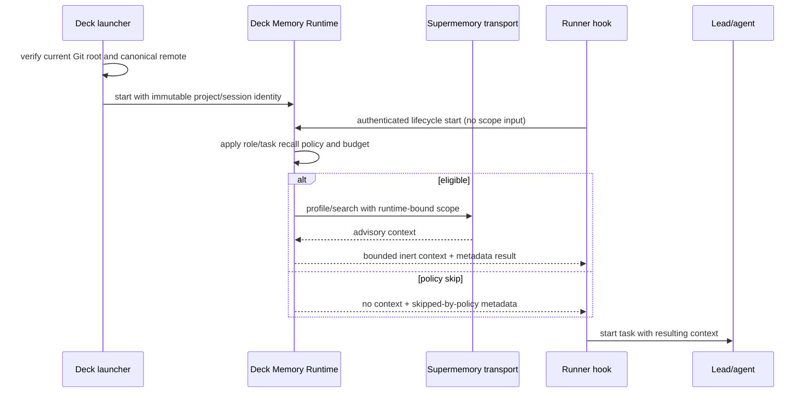

# Design: Adaptive Memory Project Isolation and Automatic Recall Evidence

## Decisions

### D1. Git identity is the only project authority

Deck resolves the real Git top-level for the explicit launch target, canonicalizes its remote owner/repository, and derives the versioned scope. No semantic text is parsed. Missing or contradictory structured identity disables memory effects.

### D2. Deck Runtime owns scope

The authenticated loopback runtime holds the immutable project scope and provider credential. Runner hooks send lifecycle/session/role data only. Provider calls receive the runtime-owned scope; caller-supplied scope fields are rejected.

### D3. Raw project-selectable MCP fails closed

The official Supermemory MCP schema exposes `containerTag`, and `x-sm-project` does not constrain that tool argument. Therefore project-local files or prompt instructions cannot provide isolation. The minimum safe repair is to stop Deck from materializing or authorizing raw Supermemory MCP and to retire exact stale Deck-managed global entries. A future scoped MCP facade is a separate capability and is not part of this repair.

### D4. Runtime and MCP evidence are separate

Runtime telemetry emits only operational metadata. Agent MCP usage is reported only when the runner supplies a trusted invocation event; otherwise its state is explicitly `external-unobservable`, never guessed from generated text. Automated acceptance tests use instrumented fakes and assert MCP call count directly.

## Lifecycle

## Safety and migration

- Automated tests use fake transports and temporary configuration homes only.
- Retirement mutates only exact Deck-managed legacy entries using existing atomic/verified configuration write boundaries.
- Ambiguous external entries are preserved and diagnosed; they do not receive Deck authorization.
- No remote memory records are copied, created, or deleted.
