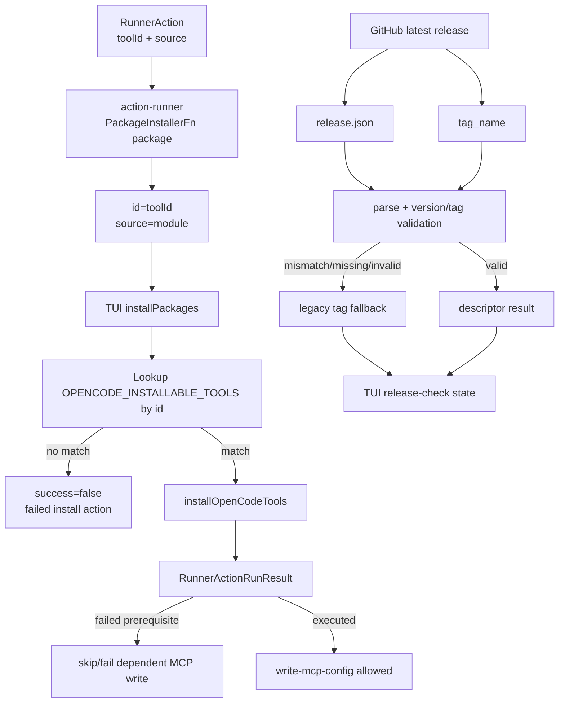
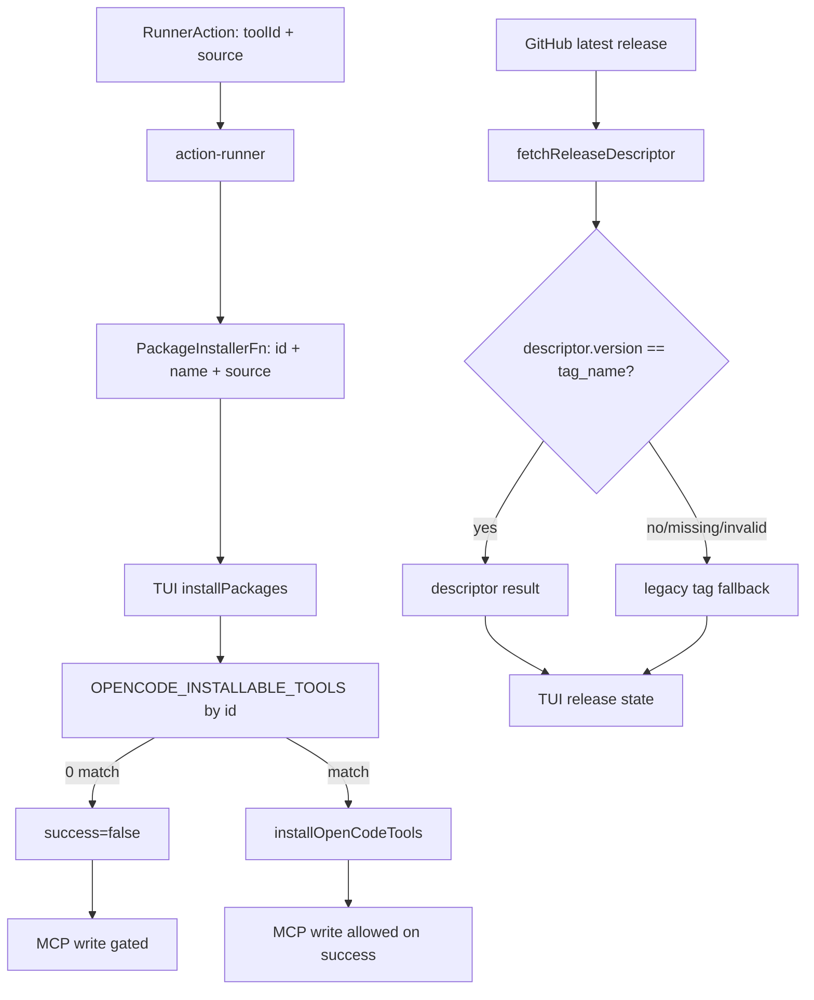

# Design: Fix Install and Upgrade Regressions

## Source

- Proposal: `fix-install-upgrade-regressions` proposal artifact
- Exploration: `openspec/changes/fix-install-upgrade-regressions/exploration.md`
- Capabilities affected: `opencode-tool-installation`, `tui-upgrade-check`; `mcp-config-writing` remains functionally unchanged but must be gated by failed prerequisites
- Spec status: not yet available

## Current Architecture Context

- `packages/adapter-opencode/src/capability-plan.ts` creates dashboard `RunnerAction` entries with both:
  - `toolId`: installable catalog id, e.g. `serena`
  - `source`: upstream module/package source, e.g. `oraios/serena`
- `apps/cli/src/tui/runner-dashboard/action-runner.ts` owns execution of `RunnerReviewPlan` groups and defines `PackageInstallerFn` as `packages: Array<{ name: string; source: string }>`.
- `runPackageInstall` currently computes `packageName = action.source ?? action.toolId ?? action.id`, so Serena is passed to the TUI installer as `name: "oraios/serena"`.
- `apps/cli/src/tui/app.tsx` injects `installPackages`, maps `packages[].name` to `selectedToolIds`, and filters `OPENCODE_INSTALLABLE_TOOLS` by `t.id`. When no rows match it returns `success: true`, causing a false install success.
- `runRunnerReviewPlan` executes `configWrites`, then `automaticInstalls`/`manualSteps`, then team application and validations. It currently only short-circuits `write-mcp-config` failures in the `configWrites` group; later config/MCP actions can still run if represented in other groups unless dependency gating is explicit.
- `apps/cli/src/upgrade-command/github-release.ts` fetches GitHub latest release metadata, fetches `release.json` when present, validates it with `parseReleaseDescriptor`, and otherwise falls back to `buildLegacyReleaseInfo(releaseData)`.
- `apps/cli/src/tui/release-check.ts` maps `ReleaseFetchResult` to UI state. A stale descriptor version can become `kind: "none"` even when the GitHub `tag_name` is newer because descriptor version and tag are not cross-validated before reaching `descriptorToState`.

## Proposed Architecture

The design makes the install and release contracts honest at their boundaries:

1. **Installer package identity contract**
   - Extend `PackageInstallerFn` package entries to carry a catalog identity and source separately:
     - `id`: installable catalog id / lookup key (`action.toolId ?? action.id`)
     - `name`: display label, retained for compatibility and diagnostics
     - `source`: upstream module/package source (`action.source ?? ""`)
   - `runPackageInstall` must pass `id` from `action.toolId` before falling back to `action.id`; it must not use `action.source` as the lookup identity.
   - The TUI installer in `app.tsx` must look up `OPENCODE_INSTALLABLE_TOOLS` by `package.id` and use catalog rows for actual installation via `installOpenCodeTools`.

2. **No false success for zero catalog matches**
   - `installPackages` must treat every requested install id with no matching catalog row as `success: false` with a diagnostic such as `No installable OpenCode tool matched id "..."`.
   - Partial matches must be handled honestly: matched rows may install; unmatched requested ids must each return a failed result so `runPackageInstall` marks the action failed.
   - `runPackageInstall` should report the install identity (`id`) in diagnostics/messages, not the upstream source as if it were the installed package.

3. **MCP write gating after failed install**
   - Preserve existing group order and action execution model, but add prerequisite-aware gating for `write-mcp-config` where the action is associated with a capability whose install action failed earlier in the same plan.
   - Preferred implementation: evaluate previous `results` before executing a `write-mcp-config` action and skip/fail it when an earlier failed install shares the same capability prefix or explicit dependency metadata. If no explicit dependency field exists in `RunnerAction`, derive the prefix from ids such as `capability.serena.install` and `capability.serena.mcp-config` as a narrow compatibility bridge.
   - This avoids writing MCP config that points at a binary that the current plan failed to install while avoiding broad changes to the adapter plan builder.

4. **Release descriptor/tag validation and fallback**
   - Add validation in `fetchReleaseDescriptor` immediately after `parseReleaseDescriptor(raw)` and before cache write/descriptor return.
   - Normalize both `descriptor.version` and GitHub `releaseData.tag_name` using the same semantics as `compareVersions`/leading-`v` removal.
   - If both are present and semantically unequal, return `kind: "legacy", reason: "invalid", info: buildLegacyReleaseInfo(releaseData), error: ...` instead of returning the descriptor.
   - Do not write invalid descriptors to cache.
   - Keep missing/malformed descriptor behavior unchanged: fallback to legacy. If the tag is missing or not semver-like, the legacy path remains conservative and `toReleaseCheckState` may still return `none` or network/error state rather than inventing availability.

### Component / Module Boundaries

| Component | Responsibility | Change Type |
|---|---|---|
| `packages/adapter-opencode/src/capability-plan.ts` | Produces actions with `toolId` and `source` | Unchanged unless tests reveal missing metadata |
| `apps/cli/src/tui/runner-dashboard/action-runner.ts` | Converts `RunnerAction` to installer calls and records action results | Modified |
| `apps/cli/src/tui/app.tsx` | Provides OpenCode-specific `installPackages` implementation and catalog lookup | Modified |
| `packages/adapter-opencode/src/installation-plan.ts` | Source of truth for installable tool `id`/`module` | Unchanged |
| `apps/cli/src/upgrade-command/github-release.ts` | Fetches release metadata, validates descriptor, selects fallback | Modified |
| `apps/cli/src/tui/release-check.ts` | Maps fetch result to UI release state | Likely unchanged; add tests around legacy result mapping |

### Data Flow

### API / Contract Implications

| Endpoint / Interface | Change | Backward Compatible |
|---|---|---|
| `PackageInstallerFn` | Package entries add required `id` as catalog lookup key; `name`/`source` remain for display/source diagnostics | Partial; all internal call sites must update together |
| `RunnerAction` | Existing `toolId` becomes authoritative install identity when present | Yes; no schema addition required |
| `installPackages` TUI callback | Uses `package.id` for catalog lookup and returns failure for no match | Behavior-breaking only for false-success no-match cases |
| `fetchReleaseDescriptor` | Descriptor version/tag mismatch returns legacy invalid result instead of descriptor | Yes for callers consuming `ReleaseFetchResult`; stricter cache behavior |

### State / Persistence Implications

- No product data schema changes.
- Release cache behavior changes only by refusing to cache descriptor payloads whose `version` conflicts with GitHub `tag_name`.
- MCP config persistence is affected only by gating: config writes must not occur after a failed prerequisite install in the same plan.

### Migration / Backward Compatibility

- No migration required.
- Rollout can be a normal patch release because the changed installer contract is internal to CLI/TUI execution.
- Backward compatibility risk is limited to tests or auxiliary call sites that still construct `{ name, source }`; update all internal call sites at compile time.
- Rollback is separable:
  - installer contract/no-match/gating can be reverted independently from release validation;
  - release validation can be reverted to previous descriptor-first behavior if it incorrectly rejects valid release metadata.

## File Impact Estimate

| File / Path | Action | Rationale |
|---|---|---|
| `apps/cli/src/tui/runner-dashboard/action-runner.ts` | Modify | Update `PackageInstallerFn` contract, pass `id` + `source`, improve install result messages, add or support MCP prerequisite gating |
| `apps/cli/src/tui/app.tsx` | Modify | Lookup installable tools by `package.id`; return `success:false` for zero/partial no-match cases |
| `apps/cli/src/upgrade-command/github-release.ts` | Modify | Validate descriptor version against GitHub tag and fallback to legacy on mismatch before cache write |
| `apps/cli/src/tui/runner-dashboard/__tests__/action-runner.test.ts` | Modify/create | Cover `source != id` contract and dependent MCP write gating |
| `apps/cli/src/tui/__tests__/install-packages-callback.test.ts` | Create | Isolate TUI installer callback behavior for Serena and no-match failure if current test structure allows extraction/injection |
| `apps/cli/src/upgrade-command/__tests__/github-release.test.ts` | Modify | Cover descriptor/tag mismatch fallback |
| `apps/cli/src/upgrade-command/__tests__/github-release-descriptor.test.ts` | Modify | Cover legacy tag fallback edge cases if not already covered |
| `apps/cli/src/tui/__tests__/release-check.test.ts` | Create/modify | Cover higher-version legacy result maps to `available` |
| `packages/adapter-opencode/src/install-tools.test.ts` | Modify if existing | Add regression confirming catalog id, not module/source, is the install lookup identity |

## Testing Strategy

- Unit-test `runPackageInstall` with `toolId: "serena"`, `source: "oraios/serena"`; assert installer receives `id: "serena"` and `source: "oraios/serena"` and result status follows installer success/failure.
- Unit/integration-test TUI `installPackages` behavior:
  - requested `{ id: "serena", source: "oraios/serena" }` matches `OPENCODE_INSTALLABLE_TOOLS` and calls `installOpenCodeTools`;
  - requested unknown id returns `success:false` and no false `already installed` message;
  - partial match returns failure for missing ids.
- Test review-plan execution where `capability.serena.install` fails and `capability.serena.mcp-config` is not written; assert the MCP write callback is not called and result is skipped/failed with dependency diagnostics.
- Test `fetchReleaseDescriptor` with GitHub `tag_name: "v0.1.4"` and descriptor `version: "0.1.3"`; assert result is `legacy` with `reason: "invalid"`, tag-derived `info.version === "0.1.4"`, and no cache write.
- Test `toReleaseCheckState` maps the above legacy higher version to `available` for current `0.1.3`.
- Keep smoke/manual coverage for opening the TUI, running Review & Install for Serena, and pressing Update Deck with controlled release fixtures.

## Observability / Error Handling

- Keep `DECK_DEBUG` logs, but change matched-count logs to include requested ids and missing ids.
- Installer no-match diagnostics should be visible in `RunnerActionRunResult.diagnostics` so the dashboard explains why the action failed.
- Descriptor/tag mismatch should be preserved in the `ReleaseFetchResult.error` string for logs/tests; TUI may still show available via legacy fallback.
- Do not downgrade network errors to `none`; preserve existing `network-error` handling.

## Security / Performance / Accessibility Considerations

- Security: avoiding MCP config writes after failed installs prevents creating trusted config entries for absent or incorrect binaries.
- Performance: no additional network calls are required; descriptor/tag validation is local string comparison.
- Accessibility: no new UI surfaces are required; existing dashboard result rendering should expose failure/skipped messages.

## Tradeoffs

| Decision | Chosen | Rejected Alternative | Rationale |
|---|---|---|---|
| Install identity | Use `toolId`/catalog `id` as authoritative lookup key and keep `source` separate | Use `source` or a source-to-id alias table | Fixes the class of `source != id` bugs without maintaining aliases |
| No-match behavior | Return explicit failure | Treat no match as “already installed” | False success is the regression; honest failure protects follow-on actions |
| MCP gating | Gate only dependent MCP writes after failed install | Globally stop all remaining actions after any install failure | Narrow gating reduces blast radius while preventing the harmful config write |
| Release validation | Validate descriptor version against GitHub tag before cache and fallback to legacy on mismatch | Trust descriptor version unconditionally | Prevents stale descriptor from hiding a newer release |
| Fallback strategy | Use existing legacy tag-derived release info | Force `available` whenever descriptor is invalid | Legacy still validates semver ordering and avoids inventing an upgrade |

## Risks

| Risk | Likelihood | Impact | Mitigation |
|---|---|---|---|
| Existing tests or call sites expect `{ name, source }` only | Medium | Medium | Update all internal call sites and TypeScript types together |
| Dependency gating by id prefix misses a non-standard action id | Medium | Medium | Prefer explicit dependency metadata if available; otherwise limit prefix derivation to `capability.<id>.*` and test Serena |
| Partial-match installs produce mixed results that are hard to display | Low | Medium | Include per-package diagnostics and fail the action if any requested id failed |
| Descriptor/tag normalization rejects valid prerelease/build metadata | Medium | Medium | Use existing compare semantics and document conservative fallback; do not claim available unless legacy tag compares newer |
| Legacy fallback lacks binary URL/SHA for malformed releases | Low | Medium | Existing legacy behavior already surfaces best-effort info; release publishing should still be fixed upstream |

## Open Decisions

- Whether to add explicit dependency metadata to `RunnerAction` for MCP writes now, or use `capability.<id>` prefix gating as a scoped compatibility bridge. Design preference: prefix bridge for this patch unless a dependency field already exists.
- How visible descriptor/tag mismatch should be to end users beyond debug logs. Design preference: keep TUI behavior focused on available/not available and preserve detailed mismatch in diagnostics/logs.

## Dependencies

- `OPENCODE_INSTALLABLE_TOOLS` remains source of truth for installable OpenCode catalog ids.
- GitHub release `tag_name` remains the fallback version source when `release.json` is missing or invalid.
- Existing test harness must support mocking `installOpenCodeTools` or extracting the callback for isolated tests.

## Rollout / Rollback

- Rollout as a patch release with regression tests included.
- Smoke before release:
  - install Serena via TUI Review & Install from a clean environment;
  - verify no MCP config is written when install is forced to fail;
  - verify controlled release fixture with stale descriptor and newer tag surfaces an available update.
- Rollback:
  - revert `action-runner.ts` + `app.tsx` together for installer contract issues;
  - revert `github-release.ts` validation independently for release-check issues;
  - keep tests aligned with whichever behavior remains active.

## Next Steps

Ready for Task (`deck-developer-task`) to break this design into implementation tasks, combined with Spec.

## Mermaid Summary Source

