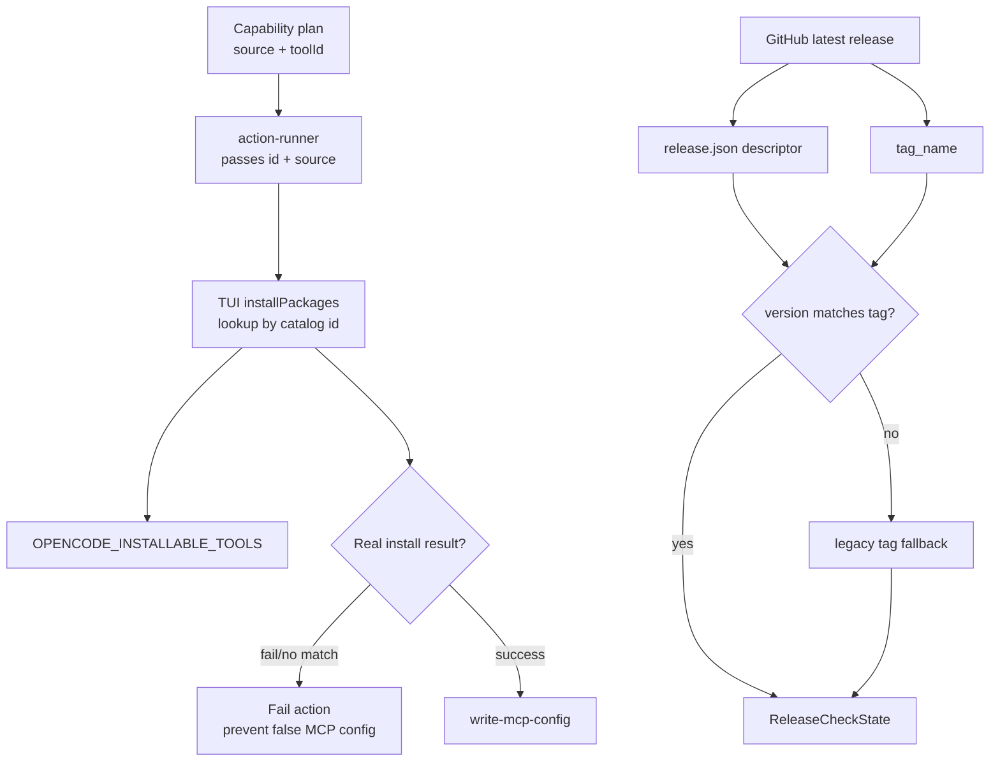

# Proposal: Corregir regresiones de instalación y actualización

## Intent

Corregir dos regresiones observadas en Deck 0.1.3:

- La instalación desde la TUI puede informar éxito aunque no instale nada cuando el `source` de una capacidad no coincide con el `id` del catálogo instalable, como `oraios/serena` vs `serena`.
- La ruta de actualización de la TUI puede informar `No upgrade available` aunque exista una release más nueva, especialmente si el descriptor de release falta, está mal formado, o su versión no coincide con el tag publicado.

El cambio debe hacer que los resultados de instalación y actualización sean honestos: no escribir configuración MCP después de una instalación falsa y no ocultar datos de release inconsistentes como “sin actualización”.

## Goal

La TUI debe instalar usando el `id` de catálogo correcto, fallar cuando no haya match instalable real, y detectar releases nuevas aunque `release.json` esté ausente o desalineado con `tag_name`.

## Scope

### In Scope

- Ajustar el contrato entre `action-runner` y `installPackages` para transportar el identificador instalable (`toolId`/`id`) y el `source`/módulo por separado.
- Hacer que el lookup de `OPENCODE_INSTALLABLE_TOOLS` use el `id` del catálogo, no el `source` upstream.
- Tratar `matched 0/N` como fallo explícito para evitar falsos `success: true` y bloquear acciones dependientes como escritura MCP cuando la instalación no ocurrió.
- Endurecer la validación de releases: comparar `descriptor.version` contra `tag_name` y usar fallback legacy cuando el descriptor sea inconsistente.
- Añadir pruebas de regresión para Serena/source≠id, no-match install, y descriptor/tag desalineados.

### Out of Scope

- Cambiar la ruta de instalación Pi (`pi-development`), que usa otro catálogo/instalador.
- Reescribir el comando CLI `deck upgrade`; este cambio se centra en la experiencia TUI y utilidades compartidas de release.
- Añadir una UX completa de “Re-check for updates”; queda como follow-up posible.
- Forzar que toda release remota sea “available” sin validación semántica de versión.

## Affected Capabilities

### New Capabilities

- Ninguna.

### Modified Capabilities

- `opencode-tool-installation`: instala capacidades OpenCode por `id` de catálogo y falla de forma explícita cuando no existe herramienta instalable correspondiente.
- `tui-upgrade-check`: valida coherencia de descriptor/tag y usa fallback seguro para no reportar falsamente “no upgrade”.

### Unchanged Capabilities

- `mcp-config-writing`: sigue escribiendo configuración MCP, pero sólo debe ejecutarse cuando el plan previo no haya fallado por instalación falsa.
- `pi-development-installation`: no se modifica porque usa un camino distinto.

## Approach

- En `apps/cli/src/tui/runner-dashboard/action-runner.ts`, enviar al callback de instalación un objeto que preserve `id`/`toolId` para lookup y `source` para el origen/módulo.
- En `apps/cli/src/tui/app.tsx`, resolver `OPENCODE_INSTALLABLE_TOOLS` contra el `id` de catálogo; si no hay match para un paquete solicitado, devolver `success: false` con un mensaje claro en vez de “already installed”.
- Mantener la instalación real delegada a `installOpenCodeTools`, que ya conoce `id`, `module` y URLs de instalación.
- En `apps/cli/src/upgrade-command/github-release.ts` y/o validación adyacente, comparar `release.json.version` con `tag_name` normalizado; si no coinciden, tratar el descriptor como inválido y caer al camino legacy basado en tag.
- Cubrir con tests unitarios/integración los casos de `serena` (`id=serena`, `source=oraios/serena`), no-match, y release `tag_name=v0.1.4` con descriptor `version=0.1.3`.

## Alternatives and Tradeoffs

| Alternative | Why Considered | Why Not Chosen |
|---|---|---|
| Cambiar sólo Serena para que `source` sea `serena` | Diff mínimo y resuelve el caso reportado | No corrige la clase de bug; futuras capacidades `source != id` volverían a fallar |
| Lookup por `source` además de `id` | Compatible con entradas antiguas | Duplica claves y puede esconder contratos ambiguos |
| Tabla manual `source → id` en TUI | Fácil de implementar | Frágil y requiere mantenimiento por cada capacidad |
| Añadir sólo refresh manual de updates | Mejora UX cuando la TUI se abrió antes de publicar una release | No corrige descriptor/tag inconsistente ni el falso “none”; queda como follow-up |

## Risks

| Risk | Likelihood | Mitigation |
|---|---|---|
| Cambiar el contrato de `PackageInstallerFn` rompe otros tipos de acción (`npm-install`, `mcp-server`) | Medium | Actualizar ambos extremos juntos y cubrir acciones mixtas con tests |
| Un no-match legítimo que antes se trataba como “already installed” ahora falla | Medium | Emitir mensaje diagnóstico claro y confirmar si existe un flujo real de skip; preferir fallo honesto |
| Fallback legacy por descriptor/tag inconsistente podría aceptar una release con metadata incompleta | Low | Usar sólo tag semver normalizado y mantener errores visibles en logs/resultado |
| La raíz de upgrade sea una release publicada con tag reusado o no mayor | Medium | La validación no inventa disponibilidad; documentar como dato remoto inválido si el tag no es mayor |

## Rollback Plan

- Revertir los cambios en `action-runner`/`app.tsx` para volver al contrato anterior de `packages[].name`, si el nuevo contrato causa regresiones.
- Revertir la validación descriptor/tag para volver al comportamiento actual de `fetchReleaseDescriptor`.
- Mantener o retirar tests nuevos junto con el rollback según fallen por contrato revertido.
- Si sólo falla la parte de upgrade, revertir esa validación de forma independiente; la corrección de instalación es separable.

## Dependencies

- Catálogo `OPENCODE_INSTALLABLE_TOOLS` como fuente de verdad para `id` instalable y módulo.
- Formato de GitHub release/tag actual, incluyendo `release.json` y `tag_name`.
- Harness de tests existente para TUI/action-runner/release-check.

## Open Questions

- ¿Debe una acción `write-mcp-config` declararse dependiente explícita de la instalación previa, o basta con que el runner detenga/propague fallo del paso anterior dentro del plan actual?
- ¿El follow-up de “Re-check for updates” debe ser parte de este cambio si el equipo quiere cerrar también el gap UX fire-once?
- ¿Cómo se debe comunicar al usuario una release con `release.json.version` distinto del `tag_name`: warning visible, log interno, o ambos?

## Acceptance Direction

- [ ] Instalar Serena desde la TUI usa `id: serena` para resolver catálogo y no reporta `Installed oraios/serena` si no se ejecutó instalación real.
- [ ] Una entrada instalable solicitada sin match en catálogo devuelve `success: false`, no `success: true`/`already installed`.
- [ ] La escritura de configuración MCP no deja al usuario con un MCP apuntando a un binario ausente después de una instalación fallida.
- [ ] Una release con `tag_name` mayor y descriptor `version` stale/inconsistente no termina como `kind: "none"`; usa fallback legacy o expone error accionable.
- [ ] Tests de regresión cubren install `source != id`, no-match install, y validación descriptor/tag.

## Next Steps

Ready for Spec (`deck-developer-spec`) and Design (`deck-developer-design`) in parallel.

## Mermaid Summary Source

