# Spec: Fix Install & Upgrade Regressions

## Source

- Proposal: `fix-install-upgrade-regressions` proposal artifact
- Exploration: `fix-install-upgrade-regressions` exploration artifact
- Capabilities affected:
  - `opencode-tool-installation` (modified)
  - `tui-upgrade-check` (modified)
  - `mcp-config-writing` (dependency constraint)
  - `executable-validation` (new constraint)

## Requirements

### Capability: opencode-tool-installation

REQ-INSTALL-001: The install action runner MUST pass the catalog `id` (from `action.toolId`) as the primary lookup key to the package installer callback, while preserving `source`/module for display and provider context.
  Priority: MUST
  Surface: Integration
  Rationale: When `source ≠ id` (e.g., serena: `source=oraios/serena`, `id=serena`), the current code passes `source` as the lookup key against `OPENCODE_INSTALLABLE_TOOLS`, which uses `id`. This causes zero matches and a false success.

REQ-INSTALL-002: When the `installPackages` callback resolves zero matching tools from the catalog for a requested package, it MUST return `success: false` with a diagnostic message — never `success: true` with "already installed".
  Priority: MUST
  Surface: Integration
  Rationale: Zero matches means the requested tool was not found in the catalog and was not installed. Returning `success: true` is a lie that propagates through the action-runner as "Installed <name>." and permits dependent actions (MCP config write) to execute.

REQ-INSTALL-003: The `installPackages` callback MUST use the catalog `id` field (not `source`, `module`, or `name`) as the filter key against `OPENCODE_INSTALLABLE_TOOLS`.
  Priority: MUST
  Surface: Integration
  Rationale: The catalog's canonical key is `id`. Using any other field produces mismatches for every tool whose upstream package name differs from the catalog id (serena, context7, and any future capability).

REQ-INSTALL-004: The package installer callback contract SHOULD carry both `id` (catalog id for lookup) and `source` (install-time package name / module) as separate fields so the consumer can use each for its correct purpose.
  Priority: SHOULD
  Surface: API
  Rationale: Separating concerns makes the contract explicit and prevents future regressions where one field is silently overloaded for the other's purpose.

### Capability: tui-upgrade-check

REQ-UPGRADE-001: When `fetchReleaseDescriptor` retrieves a release whose `descriptor.version` does not match the normalized `tag_name` version, the system MUST treat the descriptor as inconsistent and fall back to the legacy tag-based release path.
  Priority: MUST
  Surface: Data
  Rationale: A maintainer mistake (e.g., tag `v0.1.4` with descriptor `version=0.1.3`) causes the TUI to report "no upgrade" even though a newer release exists. Cross-validation catches the most common data inconsistency.

REQ-UPGRADE-002: The legacy fallback path MUST derive the release version from the normalized `tag_name` (strip leading `v`, validate semver-like format) when the descriptor is invalid or missing.
  Priority: MUST
  Surface: Data
  Rationale: Ensures that a tag-derived version is always available as the last resort, even when the descriptor is absent or stale.

REQ-UPGRADE-003: When the legacy fallback encounters a release with no usable `tag_name`, the system SHOULD return a `ReleaseCheckState` of `{ kind: "network-error" }` or equivalent error state — not `{ kind: "none" }`.
  Priority: SHOULD
  Surface: Data
  Rationale: `{ kind: "none" }` means "current version is up to date", which is misleading when the data is actually unparseable. An error state makes the problem visible.

### Capability: mcp-config-writing (dependency constraint)

REQ-MCP-001: A `write-mcp-config` action that depends on a prior install action MUST NOT execute when the install action reported `success: false`.
  Priority: MUST
  Surface: Integration
  Rationale: Currently the MCP config action is a separate plan entry that runs independently. After a false install (source≠id mismatch), MCP config is written for a binary that does not exist, leaving the user with a broken configuration.

REQ-MCP-002: Serena/OpenCode MCP config entries MUST NOT be written unless the corresponding executable exists on the system when the capability requires a locally-installed binary.
  Priority: MUST
  Surface: Security
  Rationale: Writing MCP config pointing at a non-existent binary creates broken state and can confuse downstream tooling that attempts to invoke it.

### Capability: executable-validation

REQ-EXE-001: When a capability requires a locally-installed executable (e.g., serena binary), the MCP config write step MUST verify the executable is reachable before writing the config entry.
  Priority: MUST
  Surface: Security
  Rationale: Prevents configuration drift where `opencode.json` references a binary path that was never installed.

## Acceptance Scenarios

### Capability: opencode-tool-installation

#### Scenario: Serena install uses catalog id for lookup
**Given** a capability plan containing a serena install action with `toolId: "serena"` and `source: "oraios/serena"`
**When** the action-runner executes the install action
**Then** the `installPackages` callback receives the catalog id `"serena"` as the lookup key, resolves the matching `InstallableOpenCodeTool` from `OPENCODE_INSTALLABLE_TOOLS`, and invokes `installOpenCodeTools` with the serena entry
> Covers: REQ-INSTALL-001, REQ-INSTALL-003

#### Scenario: Source≠id capability installs correctly
**Given** any capability whose `source` differs from its catalog `id` (e.g., `source: "oraios/serena"`, `id: "serena"`)
**When** the install action is executed
**Then** the install lookup succeeds using `id`, the tool is installed, and the result reports `success: true`
> Covers: REQ-INSTALL-001, REQ-INSTALL-003, REQ-INSTALL-004

#### Scenario: Zero catalog matches returns failure
**Given** a package request for an id that does not exist in `OPENCODE_INSTALLABLE_TOOLS`
**When** the `installPackages` callback processes the request
**Then** the callback returns `{ success: false, message: "<diagnostic>" }` for that package — not `{ success: true, message: "already installed" }`
> Covers: REQ-INSTALL-002

#### Scenario: Action-runner propagates install failure
**Given** an install action where the `installPackages` callback returns `success: false` for a package
**When** the action-runner evaluates the result
**Then** the action status is `failed` (not `executed`) and the diagnostic message is preserved
> Covers: REQ-INSTALL-002

#### Variant: Empty package list
  - Given a package request with an empty array
  - When the callback processes it
  - Then the result is an empty array (no false positives)

### Capability: tui-upgrade-check

#### Scenario: Descriptor version matches tag — normal path
**Given** a GitHub release with `tag_name: "v0.1.4"` and an attached `release.json` containing `{ version: "0.1.4" }`
**And** the current installed version is `0.1.3`
**When** `fetchReleaseDescriptor` fetches and validates the release
**Then** the descriptor is accepted, `descriptorToState` compares `0.1.3 < 0.1.4`, and the result is `{ kind: "available", version: "0.1.4" }`
> Covers: REQ-UPGRADE-001

#### Scenario: Descriptor version stale relative to tag — fallback
**Given** a GitHub release with `tag_name: "v0.1.4"` and an attached `release.json` containing `{ version: "0.1.3" }`
**And** the current installed version is `0.1.3`
**When** `fetchReleaseDescriptor` fetches and validates the release
**Then** the descriptor is treated as inconsistent (version `0.1.3` ≠ tag-derived `0.1.4`), the system falls back to the legacy tag-based path, and the result is `{ kind: "available", version: "0.1.4" }`
> Covers: REQ-UPGRADE-001, REQ-UPGRADE-002

#### Scenario: Missing release.json — legacy fallback
**Given** a GitHub release with `tag_name: "v0.1.4"` and no `release.json` asset
**And** the current installed version is `0.1.3`
**When** `fetchReleaseDescriptor` attempts to fetch the descriptor
**Then** the fetch fails, the legacy path activates, `buildLegacyReleaseInfo` extracts version `0.1.4` from the tag, and the result is `{ kind: "available", version: "0.1.4" }`
> Covers: REQ-UPGRADE-002

#### Scenario: Current version is latest — genuine no-upgrade
**Given** a GitHub release with `tag_name: "v0.1.3"` and descriptor `{ version: "0.1.3" }`
**And** the current installed version is `0.1.3`
**When** `fetchReleaseDescriptor` fetches and validates the release
**Then** the result is `{ kind: "none" }`
> Covers: REQ-UPGRADE-001

#### Scenario: Tag and descriptor both missing usable version
**Given** a GitHub release with a non-semver `tag_name` (e.g., `"build-abc"`) and no `release.json`
**When** the release check processes it
**Then** the result is an error state (not `{ kind: "none" }`)
> Covers: REQ-UPGRADE-002, REQ-UPGRADE-003

### Capability: mcp-config-writing (dependency constraint)

#### Scenario: MCP config not written after failed install
**Given** a capability plan with an install action followed by a `write-mcp-config` action
**When** the install action reports `success: false`
**Then** the `write-mcp-config` action does not execute (or is skipped/failed), and no MCP config entry for the failed capability is written to `opencode.json`
> Covers: REQ-MCP-001

#### Scenario: MCP config not written when executable absent
**Given** a capability that requires a locally-installed binary (e.g., serena)
**And** the binary is not found on the system PATH
**When** the `write-mcp-config` action is about to execute
**Then** the action fails or is skipped, and no MCP entry referencing the absent binary is written
> Covers: REQ-MCP-002, REQ-EXE-001

#### Variant: MCP-only capability (no binary required)
  - Given a capability that is MCP-only (e.g., context7) and does not require a local binary
  - When the `write-mcp-config` action executes
  - Then the config is written regardless of binary presence (only the install result matters)

### Capability: test/verification

#### Scenario: Regression test — install source≠id
**Given** a test fixture with an `install-opencode-plugin` action for serena (`source: "oraios/serena"`, `toolId: "serena"`)
**When** the action-runner processes the action through the `installPackages` callback
**Then** the callback resolves the catalog entry for `id: "serena"`, calls `installOpenCodeTools`, and the action-runner reports `executed` only if the installer confirms success
> Covers: REQ-INSTALL-001, REQ-INSTALL-003

#### Scenario: Regression test — no-match install fails honestly
**Given** a test fixture requesting installation of a package id not present in `OPENCODE_INSTALLABLE_TOOLS`
**When** the `installPackages` callback processes the request
**Then** every result entry has `success: false` (never `success: true`)
> Covers: REQ-INSTALL-002

#### Scenario: Regression test — descriptor/tag version mismatch triggers fallback
**Given** a mock GitHub release with `tag_name: "v0.1.4"` and `release.json` containing `{ version: "0.1.3" }`
**When** `fetchReleaseDescriptor` processes this release
**Then** the descriptor is rejected as inconsistent and the legacy path returns `{ kind: "available", version: "0.1.4" }`
> Covers: REQ-UPGRADE-001, REQ-UPGRADE-002

## Validation Rules

| Field / Input | Rule | Error Message | REQ-ID |
|---|---|---|---|
| Package lookup key (id) | MUST match an entry in `OPENCODE_INSTALLABLE_TOOLS.id` | `"No installable tool found for id '<id>'. Available tools: <list>"` | REQ-INSTALL-002, REQ-INSTALL-003 |
| Descriptor version vs tag_name | After stripping leading `v` from tag, MUST equal `descriptor.version` | (implicit — triggers legacy fallback, not a user-facing error) | REQ-UPGRADE-001 |
| Legacy tag_name | MUST be parseable as semver after stripping leading `v` | `"Could not determine version from tag '<tag>'"` | REQ-UPGRADE-002 |
| Executable existence | For binary-requiring capabilities, executable MUST exist on PATH before MCP config write | `"Cannot write MCP config for '<capability>': executable '<name>' not found on PATH"` | REQ-EXE-001, REQ-MCP-002 |

## Error Contracts

| Condition | Error Code / Type | Message | Surface |
|---|---|---|---|
| Zero catalog matches for requested install id | install-failure | `"No installable tool found for id '<id>'"` | Integration |
| Descriptor version disagrees with tag_name | descriptor-inconsistent | (triggers legacy fallback silently; logged at debug level) | Data |
| Legacy fallback with unparseable tag | legacy-parse-error | `"Could not determine version from release tag"` | Data |
| Binary not found for MCP config write | executable-not-found | `"Cannot write MCP config for '<capability>': executable not found"` | Security |

## States and Transitions

> No meaningful state lifecycle applies to this change. The install and upgrade paths are request/response flows, not long-lived state machines. The release check state (`ReleaseCheckState`) already exists and its transitions are not modified — only the data flowing into the mapping functions changes.

## Open Questions

- **OQ-1**: Should `write-mcp-config` declare an explicit dependency on the preceding install action in the plan structure, or is it sufficient to rely on the runner's sequential execution + failure propagation? (Carried from proposal.)
- **OQ-2**: How should a release with mismatched `descriptor.version` / `tag_name` be communicated to the user: visible warning in the TUI, log-only, or both? (Carried from proposal.)
- **OQ-3**: Should the "Re-check for updates" UX be included in this change or treated as a separate follow-up? The proposal marked it out of scope; this spec assumes out of scope.

## Compliance Matrix

| REQ-ID | Scenario(s) | Status |
|---|---|---|
| REQ-INSTALL-001 | Serena install uses catalog id, Source≠id installs correctly, Regression test — install source≠id | Defined |
| REQ-INSTALL-002 | Zero catalog matches returns failure, Action-runner propagates install failure, Regression test — no-match install | Defined |
| REQ-INSTALL-003 | Serena install uses catalog id, Source≠id installs correctly, Regression test — install source≠id | Defined |
| REQ-INSTALL-004 | Source≠id capability installs correctly | Defined |
| REQ-UPGRADE-001 | Descriptor version matches tag, Descriptor stale — fallback, Current version is latest, Regression test — descriptor/tag mismatch | Defined |
| REQ-UPGRADE-002 | Descriptor stale — fallback, Missing release.json — legacy, Tag/descriptor missing version, Regression test — descriptor/tag mismatch | Defined |
| REQ-UPGRADE-003 | Tag and descriptor both missing usable version | Defined |
| REQ-MCP-001 | MCP config not written after failed install | Defined |
| REQ-MCP-002 | MCP config not written when executable absent | Defined |
| REQ-EXE-001 | MCP config not written when executable absent | Defined |

## Mermaid Summary Source

```mermaid
flowchart TD
  subgraph Install["Install Path"]
    Plan["Action\nsource + toolId"] --> Runner["action-runner\npasses id (lookup) + source (display)"]
    Runner --> Callback["installPackages\nfilter by catalog id"]
    Callback --> Match{"Match in\nOPENCODE_INSTALLABLE_TOOLS?"}
    Match -- "yes" --> InstallTools["installOpenCodeTools\nreal install"]
    Match -- "no (zero)" --> Fail["return success: false\ndiagnostic message"]
    InstallTools --> InstallResult{"Install\nsucceeded?"}
    InstallResult -- "yes" --> Executed["action: executed"]
    InstallResult -- "no" --> Failed["action: failed"]
    Fail --> Failed
    Executed --> MCPCheck["write-mcp-config\ndependent action"]
    Failed --> BlockMCP["MCP config NOT written"]
  end

  subgraph Upgrade["Upgrade Path"]
    GH["GitHub release"] --> Fetch["fetchReleaseDescriptor"]
    Fetch --> DescValid{"descriptor.version\n== tag_name (normalized)?"}
    DescValid -- "yes" --> DescriptorPath["descriptorToState\nversion comparison"]
    DescValid -- "no" --> LegacyFallback["legacy tag-based path\nbuildLegacyReleaseInfo"]
    Fetch -- "no release.json" --> LegacyFallback
    LegacyFallback --> TagParse{"tag_name\nparseable?"}
    TagParse -- "yes" --> LegacyPath["legacyToState\ntag-derived version"]
    TagParse -- "no" --> ErrorState["error state\n(not 'none')"]
    DescriptorPath --> Available{"current < latest?"}
    LegacyPath --> Available
    Available -- "yes" --> ReleaseAvailable["kind: available"]
    Available -- "no" --> ReleaseNone["kind: none"]
  end
```

