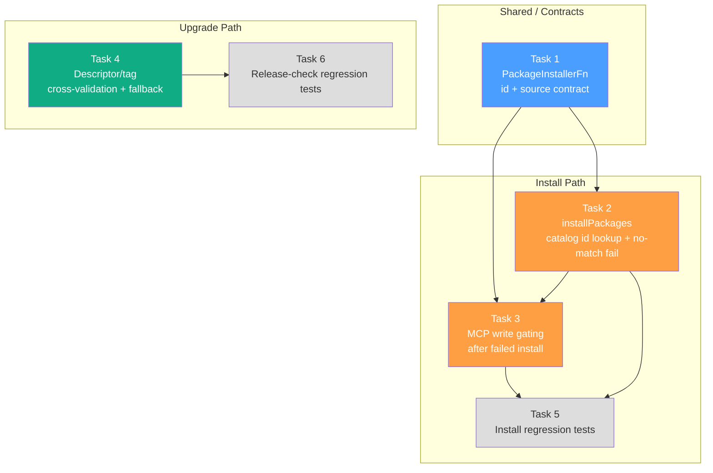

# Tasks: Fix Install & Upgrade Regressions

## Source

- Spec: `fix-install-upgrade-regressions` spec artifact
- Design: `fix-install-upgrade-regressions` design artifact
- Capabilities affected: `opencode-tool-installation`, `tui-upgrade-check`, `mcp-config-writing`, `executable-validation`

## Task Groups

### Group: Shared / Contracts

#### Task 1: Extend PackageInstallerFn contract — add `id` field and update runPackageInstall

**Owner**: General Apply
**Priority**: P0
**Complexity**: Low
**Parallel**: No — foundational contract change
**Depends on**: none

**Description**

Update the `PackageInstallerFn` type in `action-runner.ts` so that package entries carry an explicit `id` field (catalog lookup key) alongside existing `name` and `source`. Update `runPackageInstall` to populate `id` from `action.toolId ?? action.id` and `source` from `action.source ?? ""`, instead of computing `packageName` from `action.source` first. This is the contract foundation Tasks 2 and 3 build on.

**REQ coverage**: REQ-INSTALL-001, REQ-INSTALL-004

**Files**
- `apps/cli/src/tui/runner-dashboard/action-runner.ts` — modify (type definition + `runPackageInstall`)

**Verification**
- TypeScript compiles without errors.
- `runPackageInstall` passes `id: action.toolId ?? action.id` (not `action.source`) to the installer callback.
- Existing tests updated to match new package shape still pass.

---

### Group: Install Path

#### Task 2: Fix installPackages callback — catalog id lookup and honest no-match failure

**Owner**: General Apply
**Priority**: P0
**Complexity**: Medium
**Parallel**: No — depends on Task 1 contract
**Depends on**: Task 1

**Description**

In `app.tsx`, update the `installPackages` implementation to:
1. Look up `OPENCODE_INSTALLABLE_TOOLS` by `package.id` (not `package.name`).
2. When zero catalog rows match a requested `id`, return `{ success: false, message: "No installable OpenCode tool matched id \"<id>\"" }` for that package — never `{ success: true }`.
3. For partial matches (some ids found, some not), return per-package results with failures for unmatched ids.
4. For matched ids, invoke `installOpenCodeTools` as before and propagate real install outcomes.

This fixes the false-success regression where Serena (`source=oraios/serena`, `id=serena`) produced zero catalog matches and was reported as "already installed".

**REQ coverage**: REQ-INSTALL-002, REQ-INSTALL-003

**Files**
- `apps/cli/src/tui/app.tsx` — modify (`installPackages` callback)

**Verification**
- Request `{ id: "serena", source: "oraios/serena" }` → matches `OPENCODE_INSTALLABLE_TOOLS` row with `id: "serena"`.
- Request `{ id: "nonexistent-tool" }` → returns `success: false` with diagnostic.
- Request `[]` (empty array) → returns empty results array, no false positives.
- TypeScript compiles; existing tests pass with updated assertions.

---

#### Task 3: Add MCP write gating after failed install prerequisites

**Owner**: General Apply
**Priority**: P0
**Complexity**: Medium
**Parallel**: No — depends on Task 1 contract; hidden coupling with Task 2 (both touch install flow)
**Depends on**: Task 1, Task 2

**Description**

In `action-runner.ts`, add prerequisite-aware gating for `write-mcp-config` actions in `runRunnerReviewPlan`:
1. Before executing a `write-mcp-config` action, check prior `results` for a failed install action sharing the same capability prefix (e.g., `capability.serena.install` → `capability.serena.mcp-config`).
2. If the prerequisite install failed, skip the MCP write action with status `skipped` or `failed` and a dependency diagnostic (e.g., `"Skipped MCP config for '<capability>': install failed"`).
3. For binary-requiring capabilities, verify the executable is reachable on PATH before writing MCP config. If not found, fail the action with `"Cannot write MCP config for '<capability>': executable '<name>' not found on PATH"`.
4. MCP-only capabilities (no binary required, e.g., context7) are gated only by install result, not by executable presence.

**REQ coverage**: REQ-MCP-001, REQ-MCP-002, REQ-EXE-001

**Files**
- `apps/cli/src/tui/runner-dashboard/action-runner.ts` — modify (`runRunnerReviewPlan` or equivalent execution loop)

**Verification**
- Plan where `capability.serena.install` fails → `capability.serena.mcp-config` is skipped/not executed; no MCP entry written.
- Plan where install succeeds but binary absent from PATH → MCP write fails with executable-not-found diagnostic.
- Plan where MCP-only capability (context7) install succeeds → MCP config is written regardless of binary presence.
- TypeScript compiles; existing tests pass.

---

### Group: Upgrade Path

#### Task 4: Add descriptor/tag cross-validation and legacy fallback hardening

**Owner**: General Apply
**Priority**: P0
**Complexity**: Medium
**Parallel**: Yes — independent of install-path tasks (Tasks 1–3)
**Depends on**: none

**Description**

In `github-release.ts`, add validation in `fetchReleaseDescriptor` immediately after `parseReleaseDescriptor(raw)`:
1. Normalize both `descriptor.version` and `releaseData.tag_name` (strip leading `v`, validate semver-like format) using the same semantics as `compareVersions`.
2. If both are present and semantically unequal, return a legacy result with `reason: "invalid"` and `info: buildLegacyReleaseInfo(releaseData)` — do NOT return the inconsistent descriptor.
3. Do NOT write inconsistent descriptors to cache.
4. When legacy fallback encounters a release with no usable `tag_name` (not semver-like after normalization), the result should be an error state (`network-error` or equivalent) — NOT `{ kind: "none" }`.

This ensures that a stale `release.json` descriptor (`version=0.1.3`) on a release with `tag_name=v0.1.4` does not produce `{ kind: "none" }` (hiding the available upgrade).

**REQ coverage**: REQ-UPGRADE-001, REQ-UPGRADE-002, REQ-UPGRADE-003

**Files**
- `apps/cli/src/upgrade-command/github-release.ts` — modify (`fetchReleaseDescriptor`)
- `apps/cli/src/tui/release-check.ts` — likely unchanged; verify legacy result mapping

**Verification**
- `tag_name: "v0.1.4"` + descriptor `version: "0.1.3"` → descriptor rejected as inconsistent; legacy path returns tag-derived version `0.1.4`.
- `tag_name: "v0.1.4"` + descriptor `version: "0.1.4"` → descriptor accepted; normal path.
- No `release.json` → legacy fallback from tag alone.
- `tag_name: "build-abc"` + no descriptor → error state, not `{ kind: "none" }`.
- TypeScript compiles; existing release tests pass.

---

### Group: Regression Tests

#### Task 5: Install path regression tests

**Owner**: General Apply
**Priority**: P0
**Complexity**: Medium
**Parallel**: No — depends on install-path implementation
**Depends on**: Task 1, Task 2, Task 3

**Description**

Create or update tests covering the install path regression scenarios from the spec:

1. **Source≠id lookup** (covers REQ-INSTALL-001, REQ-INSTALL-003): Test `runPackageInstall` with `toolId: "serena"`, `source: "oraios/serena"`. Assert installer receives `id: "serena"` and `source: "oraios/serena"`; assert result status follows installer success/failure.

2. **No-match failure** (covers REQ-INSTALL-002): Test `installPackages` with an id not present in `OPENCODE_INSTALLABLE_TOOLS`. Assert every result has `success: false`.

3. **MCP gating** (covers REQ-MCP-001, REQ-MCP-002, REQ-EXE-001): Test plan execution where `capability.serena.install` fails → assert `capability.serena.mcp-config` is not written. Test executable-not-found path. Test MCP-only capability bypass.

4. **Empty package list** (variant): Assert empty array returns empty results.

**Files**
- `apps/cli/src/tui/runner-dashboard/__tests__/action-runner.test.ts` — modify/create
- `apps/cli/src/tui/__tests__/install-packages-callback.test.ts` — create

**Verification**
- All new tests pass.
- `npm test` (or equivalent) passes full suite.

---

#### Task 6: Release-check regression tests

**Owner**: General Apply
**Priority**: P0
**Complexity**: Medium
**Parallel**: No — depends on upgrade-path implementation
**Depends on**: Task 4

**Description**

Create or update tests covering the release-check regression scenarios from the spec:

1. **Descriptor/tag mismatch fallback** (covers REQ-UPGRADE-001, REQ-UPGRADE-002): Mock GitHub release with `tag_name: "v0.1.4"` and `release.json` containing `{ version: "0.1.3" }`. Assert descriptor is rejected as inconsistent; legacy path returns version `0.1.4`.

2. **Missing release.json — legacy** (covers REQ-UPGRADE-002): Release with `tag_name: "v0.1.4"`, no descriptor. Assert legacy path extracts `0.1.4`.

3. **Normal path** (covers REQ-UPGRADE-001): Matching descriptor/tag → descriptor accepted.

4. **Unparseable tag** (covers REQ-UPGRADE-002, REQ-UPGRADE-003): `tag_name: "build-abc"`, no descriptor → error state, not `{ kind: "none" }`.

**Files**
- `apps/cli/src/upgrade-command/__tests__/github-release.test.ts` — modify
- `apps/cli/src/upgrade-command/__tests__/github-release-descriptor.test.ts` — modify
- `apps/cli/src/tui/__tests__/release-check.test.ts` — create/modify

**Verification**
- All new tests pass.
- `npm test` (or equivalent) passes full suite.

---

## Dependency Graph

```
Task 1 (Contract)
  ├─→ Task 2 (Install callback)
  │     └─→ Task 3 (MCP gating)
  │           └─→ Task 5 (Install tests)
  └─→ Task 3 (MCP gating)

Task 4 (Release validation)
  └─→ Task 6 (Release tests)
```

## Parallelization Plan

| Phase | Tasks | Can Run in Parallel |
|---|---|---|
| Shared / Contracts | Task 1 | No — foundation |
| Install Path | Tasks 2, 3 | No — sequential chain |
| Upgrade Path | Task 4 | **Yes** — independent of install path |
| Tests | Tasks 5, 6 | No — depend on implementation; 5 and 6 can run in parallel with each other |
| **Cross-domain** | Task 1–3 vs Task 4 | **Yes** — install and upgrade paths are independent |

## Responsibility Contracts

| Contract / Boundary | Owner | Consumers | Notes |
|---|---|---|---|
| `PackageInstallerFn` package shape (`id`, `name`, `source`) | Task 1 (General Apply) | Tasks 2, 3, 5 | All install-path tasks must use `id` for catalog lookup |
| Install success/failure result contract | Task 2 (General Apply) | Tasks 3, 5 | MCP gating depends on honest failure propagation |
| Capability prefix derivation for MCP gating | Task 3 (General Apply) | Task 5 | Prefix: `capability.<id>.install` → `capability.<id>.mcp-config` |
| `fetchReleaseDescriptor` return on descriptor/tag mismatch | Task 4 (General Apply) | Task 6 | Legacy result with `reason: "invalid"` + tag-derived `info` |

## Complexity Summary

| Complexity | Count | Task Numbers |
|---|---|---|
| Low | 1 | Task 1 |
| Medium | 5 | Tasks 2, 3, 4, 5, 6 |
| High | 0 | — |

## Flagged for Splitting

None — all tasks are within session scope. Task 3 (MCP gating) is the highest-risk task due to prefix derivation logic; if it grows beyond 4 files, consider splitting executable validation into a separate task.

## Hidden Coupling

- Tasks 1 and 3 both modify `action-runner.ts` — sequential execution required; merge conflicts possible if parallelized.
- Tasks 2 and 3 form a coherent install-flow batch — recommend same Apply session.
- Task 4 is fully independent of Tasks 1–3 (different files, different domain).

## Review Workload Forecast

| Signal | Value |
|---|---|
| Estimated changed lines | 100-400 |
| 400-line budget risk | Medium |
| Scope reduction recommended | No |
| Sequential work slices recommended | Yes — install path and upgrade path can be reviewed independently |
| Decision needed before Apply | No — design decisions are resolved |

**Rationale**: Six tasks across ~8 files. Install path (Tasks 1–3, 5) touches 3–4 files with ~200-300 lines. Upgrade path (Tasks 4, 6) touches 3–4 files with ~100-200 lines. Combined estimate 300-500 lines, but the two domains are fully separable for review. Medium risk due to contract change in Task 1 rippling through Tasks 2–3; sequential review recommended for install path, parallel review possible for upgrade path.

## Open Questions / Blockers

- **OQ-1** (from spec): Should `write-mcp-config` declare explicit dependency metadata or rely on prefix derivation? Design chose prefix derivation. **Classification: allowed-with-stub** — Apply agent should use prefix derivation per design; if a `dependency` field already exists on `RunnerAction`, prefer that instead and note the discovery.
- **OQ-2** (from spec): Descriptor/tag mismatch visibility to users. **Classification: non-blocking** — Design preference is log/debug only; TUI shows available/not-available via legacy fallback.
- **OQ-3** (from spec): Re-check UX. **Classification: non-blocking** — Explicitly out of scope per proposal and spec.

> No blockers — tasks are ready for Apply.

## Mermaid Summary Source


