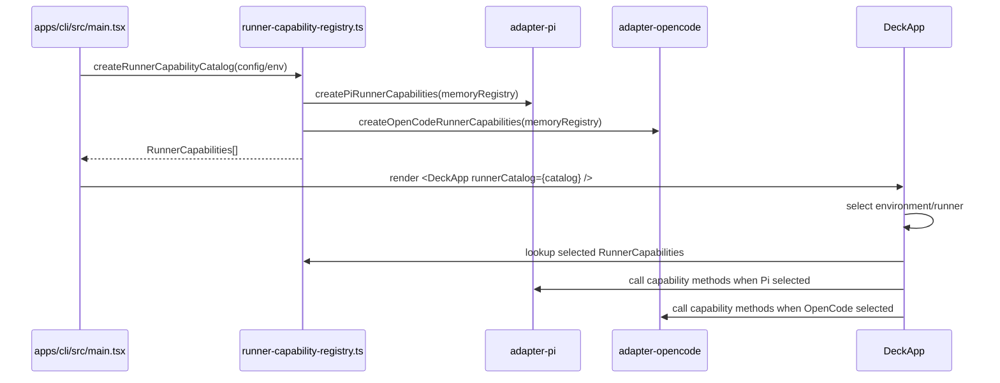
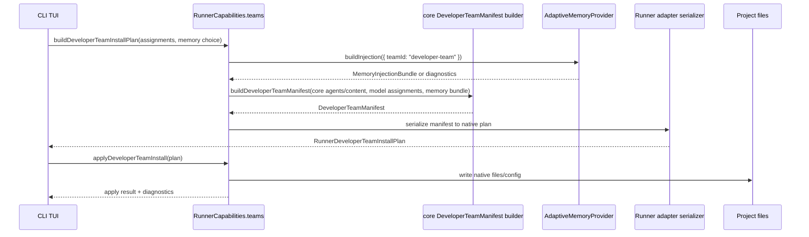
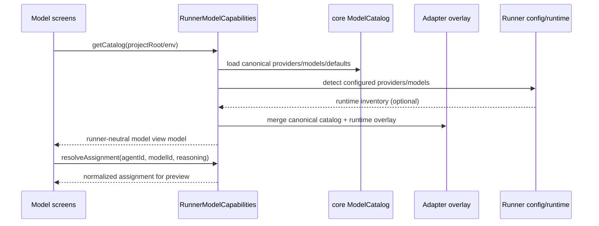
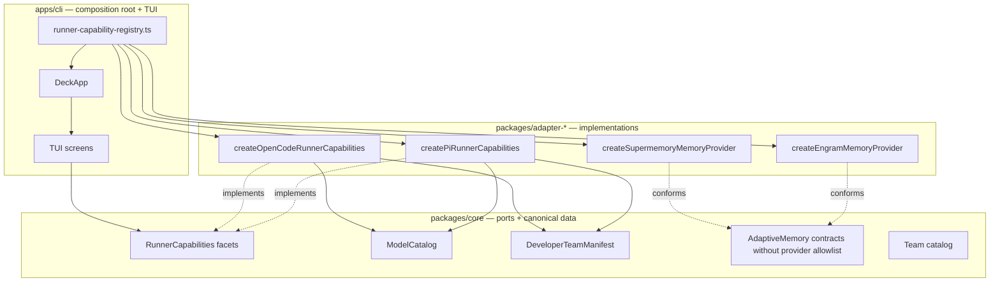

# Design: Hexagonal Architecture & Memory Refactor

## Source

- Proposal: `hexagonal-architecture-memory-refactor` proposal artifact
- Capabilities affected:
  - New: `runner-capability-interface`, `canonical-model-catalog`, `developer-team-manifest`
  - Modified: `adaptive-memory`, `cli-tui-orchestration`, `developer-team-install`
  - Unchanged: `engram-memory-provider`, `supermemory-provider`, `team-catalog-core`
- Spec status: not yet available
- Adaptive context: not loaded; official context is proposal + current code.

## Current Architecture Context

| Area | Current State | Boundary Problem |
|---|---|---|
| CLI TUI | `apps/cli/src/tui/app.tsx` directly imports Pi, OpenCode, Engram, and Supermemory adapter functions/types. | TUI owns runner orchestration details instead of consuming a runner-neutral port. |
| CLI entrypoint | `apps/cli/src/main.tsx` renders `<DeckApp />` with no injected runner catalog/capabilities. | Runtime selection is inside the TUI, not at the CLI composition root. |
| Runner dashboard helpers | `apps/cli/src/tui/pi-runner-dashboard/action-runner.ts` imports `buildDeveloperTeamInstallPlan` from `@deck/adapter-pi`. | Dashboard helper is Pi-specific despite being presented as reusable runner-dashboard code. |
| Developer Team screens | `apps/cli/src/tui/screens/developer-team-screens.tsx` imports Pi/OpenCode model helpers and adapter model types. | UI model configuration is coupled to adapter-specific model semantics. |
| Adaptive memory core | `packages/core/src/memory/adaptive-memory.ts` still exports `SUPPORTED_ADAPTIVE_MEMORY_PROVIDER_IDS = ["engram", "supermemory"]`; `adaptive-memory-contract.ts` defines built-in provider IDs. | Core knows concrete provider IDs. |
| Memory adapters | `packages/adapter-engram/src/index.ts` and `packages/adapter-supermemory/src/index.ts` already implement provider objects shaped as `AdaptiveMemoryProvider`. | Provider implementations exist, but provider registration still leaks into core/TUI. |
| Model configuration | `packages/adapter-pi/src/model-config.ts` defines providers, env vars, model lists, Pi thinking levels; `packages/adapter-opencode/src/model-config.ts` defines default agent models and OpenCode reasoning effort. | Canonical model metadata and default Developer Team model assignments are duplicated/divergent in adapters. |
| Team catalog | `packages/core/src/team-catalog.ts` owns `ALL_TEAMS`; `packages/adapter-pi/src/team-catalog.ts` returns teams for both `pi-development` and `opencode-development`. | Pi adapter knows OpenCode environment ID. |
| Developer Team output | Pi writes `.md` agent/skill files with YAML frontmatter; OpenCode writes `opencode.json`, prompt files, command files, and skill files. | Adapters independently derive output from core content rather than sharing a canonical manifest contract. |
| Runtime strings in core | `packages/core/src/teams/developer/visual-explanations-content.ts` contains `"pi-mermaid"`. | Core prompt/content contains runner-specific package names. |

## Proposed Architecture

Restore hexagonal boundaries by making `packages/core` define runner-neutral ports and canonical domain data, while each `packages/adapter-*` package implements those ports for one runner/provider. The CLI becomes the composition root: it imports adapters, creates capability objects, and injects them into the TUI. The TUI consumes only core contracts plus CLI-local view models.

### Architecture Decisions

1. **Use composed capability facets, exposed through one runner capability object.**
   - `RunnerCapabilities` is a small aggregate of focused ports: environment inspection, installation planning, model catalog, memory provider registry, team catalog, and Developer Team manifest serialization.
   - Rationale: a single object is ergonomic for TUI injection, but composed facets avoid a god interface.

2. **Keep canonical model identity in core; keep runtime resolution in adapters.**
   - Core owns provider/model metadata, model capabilities, normalized reasoning levels, and canonical Developer Team default model assignments.
   - Adapters map canonical model IDs and normalized reasoning levels to native config fields (`thinking` for Pi, `reasoningEffort` for OpenCode), env vars, and runtime defaults.
   - Rationale: core can define WHAT models mean; only adapters know HOW their runner configures them.

3. **Represent Developer Team output as a core manifest before serialization.**
   - Core builds a `DeveloperTeamManifest` from canonical agent definitions, content registry, optional model assignments, and optional memory injection bundle.
   - Adapters serialize that manifest to native files.
   - Rationale: canonical team data remains in core; filesystem layout and config formats remain adapter-specific.

4. **Make adaptive memory provider IDs caller-registered, never core-allowlisted.**
   - Core retains the structural `AdaptiveMemoryProvider` / `AdaptiveMemoryAdapter` contracts but removes built-in provider ID constants.
   - CLI/adapters register available providers (`engram`, `supermemory`) and pass supported IDs into core resolution.
   - Rationale: Engram and Supermemory stay supported without making core aware of concrete providers.

5. **Move environment-to-team lookup to core as an agnostic capability query.**
   - Core exposes `getTeamsForEnvironment(environmentId, catalog)` or a more explicit `getTeamsForRunnerEnvironment` with runner-neutral environment records.
   - Adapters provide their own environment IDs and supported team IDs through `RunnerCapabilities.teamCatalog`.
   - Rationale: team membership is domain data; environment IDs are adapter data.

### Component / Module Boundaries

| Component | Responsibility | Change Type |
|---|---|---|
| `packages/core/src/runner-capability.ts` | Define runner-neutral capability interfaces and shared plan/result view models consumed by CLI/TUI. | create |
| `packages/core/src/model-catalog.ts` | Define canonical providers, models, normalized model capabilities, reasoning levels, and Developer Team default assignments. | create |
| `packages/core/src/teams/developer/manifest.ts` | Define/build canonical `DeveloperTeamManifest` from core agents/content + model/memory inputs. | create |
| `packages/core/src/memory/adaptive-memory-contract.ts` | Keep provider/adapter contract but remove built-in Engram/Supermemory ID constants/types. | modify |
| `packages/core/src/memory/adaptive-memory.ts` | Remove `SUPPORTED_ADAPTIVE_MEMORY_PROVIDER_IDS`; continue fail-closed resolution using caller-supplied supported IDs. | modify |
| `packages/core/src/team-catalog.ts` | Add runner-neutral environment/team lookup helpers if needed by capability implementations. | modify |
| `packages/core/src/teams/developer/visual-explanations-content.ts` | Remove or parameterize `pi-mermaid` prohibited phrase. | modify |
| `packages/adapter-pi/src/runner-capabilities.ts` | Implement `createPiRunnerCapabilities()` by composing Pi preflight, install, model, memory, team, and manifest serializers. | create |
| `packages/adapter-opencode/src/runner-capabilities.ts` | Implement `createOpenCodeRunnerCapabilities()` by composing OpenCode preflight, install, model, memory, team, and manifest serializers. | create |
| `packages/adapter-pi/src/model-config.ts` | Consume core model catalog; keep Pi env detection, `pi --list-models` parsing, thinking mapping, and compatibility wrappers. | modify |
| `packages/adapter-opencode/src/model-config.ts` | Consume core defaults; keep OpenCode `opencode.json` reading, reasoning mapping, and compatibility wrappers. | modify |
| `packages/adapter-pi/src/developer-team-install.ts` | Build native Pi install plan from `DeveloperTeamManifest`; preserve existing public wrappers during migration. | modify |
| `packages/adapter-opencode/src/developer-team-install.ts` | Build native OpenCode install plan from `DeveloperTeamManifest`; preserve existing public wrappers during migration. | modify |
| `packages/adapter-pi/src/team-catalog.ts` | Only expose Pi environment support; remove `opencode-development`. | modify |
| `packages/adapter-opencode/src/team-catalog.ts` | Expose OpenCode environment support. | create |
| `packages/adapter-engram/src/index.ts` | Remain provider implementation; optionally export provider registration metadata. | modify |
| `packages/adapter-supermemory/src/index.ts` | Remain provider implementation; optionally export provider registration metadata. | modify |
| `apps/cli/src/runner-capability-registry.ts` | CLI composition root for available runner capability factories and memory provider factories. | create |
| `apps/cli/src/main.tsx` | Create/inject runner capabilities into `<DeckApp runnerCatalog={...} />`. | modify |
| `apps/cli/src/tui/app.tsx` | Remove direct adapter imports; consume injected `RunnerCapabilities`. | modify |
| `apps/cli/src/tui/screens/developer-team-screens.tsx` | Replace adapter model types/helpers with core/UI-normalized model view models. | modify |
| `apps/cli/src/tui/pi-runner-dashboard/*` | Rename/generalize where necessary; consume runner-neutral action plans instead of Pi-specific types. | modify |

## Core Contracts

### RunnerCapabilityInterface

Create `packages/core/src/runner-capability.ts`:

```ts
export type RunnerId = string;
export type RunnerEnvironmentId = string;

export type RunnerCapabilities = {
  id: RunnerId;
  displayName: string;
  environments: readonly RunnerEnvironment[];
  inspectEnvironment(input: RunnerEnvironmentInspectInput): Promise<RunnerEnvironmentInspection>;
  tools: RunnerToolCapabilities;
  teams: RunnerTeamCapabilities;
  models: RunnerModelCapabilities;
  memory: RunnerMemoryCapabilities;
};

export type RunnerToolCapabilities = {
  buildInstallationPlan(input: RunnerInstallationInput): RunnerInstallationPlan;
  installTools(input: RunnerToolInstallInput): Promise<RunnerToolInstallResult>;
  reviewTools(input: RunnerToolReviewInput): Promise<RunnerToolReviewResult>;
};

export type RunnerTeamCapabilities = {
  getTeamsForEnvironment(environmentId: RunnerEnvironmentId): readonly TeamEntry[];
  buildDeveloperTeamManifest(input: DeveloperTeamManifestInput): DeveloperTeamManifest;
  buildDeveloperTeamInstallPlan(input: DeveloperTeamInstallPlanInput): RunnerDeveloperTeamInstallPlan;
  applyDeveloperTeamInstall(input: RunnerDeveloperTeamApplyInput): Promise<RunnerDeveloperTeamApplyResult>;
  verifyDeveloperTeamInstall(input: RunnerDeveloperTeamVerifyInput): Promise<RunnerDeveloperTeamVerifyResult>;
};

export type RunnerModelCapabilities = {
  getCatalog(input?: RunnerModelCatalogInput): RunnerModelCatalog;
  readAssignments(input: RunnerModelAssignmentReadInput): RunnerModelAssignments;
  resolveAssignment(input: RunnerModelResolveInput): RunnerResolvedModelAssignment;
};

export type RunnerMemoryCapabilities = {
  getProviders(input: RunnerMemoryProviderInput): readonly AdaptiveMemoryProvider[];
  getSupportedProviderIds(): readonly string[];
};
```

Notes:

- Exact input/result fields should be derived from existing Pi/OpenCode plan types during implementation.
- Core contracts must not include literals such as `pi`, `opencode`, `engram`, or `supermemory` except in tests using synthetic IDs.
- Existing adapter-specific types can temporarily wrap these contracts to preserve public package compatibility.

### ModelCatalog

Create `packages/core/src/model-catalog.ts`:

```ts
export type ModelProviderEntry = {
  id: string;
  displayName: string;
};

export type ModelCapability =
  | "tool-use"
  | "vision"
  | "reasoning"
  | "local"
  | (string & {});

export type ReasoningLevel = "off" | "minimal" | "low" | "medium" | "high" | "xhigh";

export type ModelEntry = {
  id: string;
  displayName: string;
  providerId: string;
  capabilities: readonly ModelCapability[];
  supportsReasoning?: boolean;
};

export type DeveloperTeamDefaultModelAssignment = {
  agentId: string;
  modelId: string;
  reasoning?: ReasoningLevel;
};

export type ModelCatalog = {
  providers: readonly ModelProviderEntry[];
  models: readonly ModelEntry[];
  developerTeamDefaults: readonly DeveloperTeamDefaultModelAssignment[];
};
```

Adapter overlays:

| Adapter | Overlay Responsibility |
|---|---|
| Pi | Env vars, `pi --list-models` parsing, `PiThinkingLevel` mapping including `minimal`/`xhigh`, disabling reasoning for `opencode-go`/Kimi where currently required. |
| OpenCode | `opencode.json` read/write, `reasoningEffort` mapping (`off` -> omitted), OpenCode-specific provider availability if any. |

### DeveloperTeamManifest

Create `packages/core/src/teams/developer/manifest.ts`:

```ts
export type DeveloperTeamManifest = {
  team: TeamEntry;
  agents: readonly DeveloperTeamManifestAgent[];
  skills: readonly DeveloperTeamManifestSkill[];
  memoryDiagnostics: readonly MemoryDiagnostic[];
};

export type DeveloperTeamManifestAgent = {
  agent: DeveloperTeamAgent;
  instruction: string;
  model?: string;
  reasoning?: ReasoningLevel;
  memory?: AdaptiveMemoryCompositionResult;
};

export type DeveloperTeamManifestSkill = {
  agent: DeveloperTeamAgent;
  skillId: string;
  body: string;
  memory?: AdaptiveMemoryCompositionResult;
};
```

Serialization stays outside core:

| Adapter | Native serialization from manifest |
|---|---|
| Pi | `.opencode/agent/*.md` or current Pi agent locations with YAML frontmatter and skill files, preserving current paths. |
| OpenCode | `opencode.json` agent entries + prompt-generation/command-generation plans + `.opencode/skill/*.md` files. |

### AdaptiveMemoryContract

Core changes:

- Remove `ADAPTIVE_MEMORY_PROVIDER_IDS`, `BuiltInAdaptiveMemoryProviderId`, and any default provider allowlist.
- Keep `AdaptiveMemoryProviderIdentity.id` as `string` / branded string.
- Keep `resolveMemoryInjection()` fail-closed when `supportedProviderIds` is omitted or excludes the selected provider.
- Core tests should use provider IDs such as `test-provider` or `mock-memory`, not Engram/Supermemory.

Adapter/CLI changes:

- Adapters define their own supported memory provider IDs or accept a registry injected by CLI.
- CLI constructs provider objects with `createEngramMemoryProvider()` / `createSupermemoryMemoryProvider(config)` and passes both providers + supported IDs into runner capabilities.
- Supermemory runtime validation remains adapter-specific because Pi/OpenCode MCP config semantics differ.

## Data Flow

### TUI capability injection



### Developer Team install through manifest



### Model resolution



## API / Contract Implications

| Endpoint / Interface | Change | Backward Compatible |
|---|---|---|
| `RunnerCapabilities` | New core interface consumed by CLI/TUI and implemented by adapters. | yes, additive |
| `ModelCatalog` | New core canonical model metadata and Developer Team default assignments. | yes, additive |
| `DeveloperTeamManifest` | New core intermediate representation before adapter serialization. | yes, additive |
| `AdaptiveMemoryProviderId` | Remove built-in provider ID union; use open string IDs. | partial; compile-time consumers of `BuiltInAdaptiveMemoryProviderId` must migrate. |
| `resolveMemoryInjection()` | Continue caller-supplied allowlist; remove exported core default allowlist. | partial; callers relying on core constant must move allowlist to adapter/CLI. |
| Pi/OpenCode adapter exports | Add capability factories; retain existing public exports as compatibility wrappers during migration. | yes initially |
| `<DeckApp />` | Accept injected `runnerCatalog` / capabilities prop; may keep default factory only in CLI-level tests. | partial; TUI tests must pass capabilities or test helper. |

## State / Persistence Implications

- No data migration.
- Existing generated Developer Team files remain valid.
- Existing `deck-config` memory provider values remain valid, but provider validation moves to CLI/adapter registration.
- OpenCode `opencode.json` and Pi agent frontmatter formats remain native adapter concerns.

## Migration / Backward Compatibility

1. Add core contracts and adapter capability factories without removing legacy exports.
2. Create CLI `runner-capability-registry.ts` and inject capabilities into `DeckApp`.
3. Migrate TUI state/actions screen-by-screen from direct adapter imports to capability calls.
4. Migrate Developer Team install builders to internally use `DeveloperTeamManifest`, while preserving existing function names and return shapes where practical.
5. Move model defaults to core and make adapter `model-config.ts` functions wrappers around core catalog + adapter overlays.
6. Remove core provider/runtime literals and update tests to use synthetic provider/runner IDs.
7. After compatibility period, remove obsolete adapter-specific TUI types/imports.

Rollback is branch-level revert. If a staged migration is needed, the TUI can keep a temporary adapter-backed capability implementation that calls existing adapter functions while the UI import surface is reduced.

## File Impact Estimate

| File / Path | Action | Rationale |
|---|---|---|
| `packages/core/src/runner-capability.ts` | create | Core runner capability port for TUI/adapter boundary. |
| `packages/core/src/runner-capability.test.ts` | create | Contract-level tests with synthetic runner IDs. |
| `packages/core/src/model-catalog.ts` | create | Canonical provider/model/default assignment metadata. |
| `packages/core/src/model-catalog.test.ts` | create | Ensure catalog is runtime/provider neutral and defaults are complete. |
| `packages/core/src/teams/developer/manifest.ts` | create | Canonical Developer Team manifest builder/types. |
| `packages/core/src/teams/developer/manifest.test.ts` | create | Validate manifest composition, model assignment, memory diagnostics. |
| `packages/core/src/index.ts` | modify | Export new core contracts/catalogs. |
| `packages/core/src/memory/adaptive-memory-contract.ts` | modify | Remove built-in Engram/Supermemory ID constants. |
| `packages/core/src/memory/adaptive-memory-contract.test.ts` | modify | Use synthetic provider IDs and assert open provider contract. |
| `packages/core/src/memory/adaptive-memory.ts` | modify | Remove hardcoded supported provider constant. |
| `packages/core/src/memory/adaptive-memory.test.ts` | modify | Update tests away from Engram/Supermemory hardcodes except adapter integration tests. |
| `packages/core/src/config/deck-config.ts` | modify | Consider moving concrete provider enum/config parsing to CLI/adapter layer or isolate as CLI config schema if retained. |
| `packages/core/src/config/deck-config.test.ts` | modify | Adjust if concrete provider config is moved or explicitly scoped outside core neutrality. |
| `packages/core/src/team-catalog.ts` | modify | Add agnostic environment/team helper if needed; keep canonical teams. |
| `packages/core/src/teams/developer/visual-explanations-content.ts` | modify | Remove/parameterize `pi-mermaid`. |
| `packages/core/src/teams/developer/*content*.test.ts` | modify | Assert no runner/provider-specific literals in core content. |
| `packages/adapter-pi/src/runner-capabilities.ts` | create | Pi implementation of core runner capabilities. |
| `packages/adapter-pi/src/runner-capabilities.test.ts` | create | Pi capability conformance tests. |
| `packages/adapter-pi/src/model-config.ts` | modify | Consume core model catalog and keep Pi-specific detection/mapping. |
| `packages/adapter-pi/src/model-config.test.ts` | modify | Verify Pi overlay behavior. |
| `packages/adapter-pi/src/developer-team-install.ts` | modify | Serialize core manifest to Pi-native files. |
| `packages/adapter-pi/src/developer-team-install.test.ts` | modify | Preserve observable Pi file output. |
| `packages/adapter-pi/src/team-catalog.ts` | modify | Remove `opencode-development`; expose Pi-only team mapping. |
| `packages/adapter-pi/src/team-catalog.test.ts` | modify | Remove OpenCode expectation. |
| `packages/adapter-pi/src/index.ts` | modify | Export `createPiRunnerCapabilities`. |
| `packages/adapter-opencode/src/runner-capabilities.ts` | create | OpenCode implementation of core runner capabilities. |
| `packages/adapter-opencode/src/runner-capabilities.test.ts` | create | OpenCode capability conformance tests. |
| `packages/adapter-opencode/src/team-catalog.ts` | create | OpenCode-specific team mapping. |
| `packages/adapter-opencode/src/team-catalog.test.ts` | create | OpenCode team mapping tests. |
| `packages/adapter-opencode/src/model-config.ts` | modify | Consume core defaults and keep OpenCode config/reasoning mapping. |
| `packages/adapter-opencode/src/model-config.test.ts` | modify | Verify OpenCode overlay behavior. |
| `packages/adapter-opencode/src/developer-team-install.ts` | modify | Serialize core manifest to OpenCode-native files/config. |
| `packages/adapter-opencode/src/developer-team-install.test.ts` | modify | Preserve observable OpenCode output. |
| `packages/adapter-opencode/src/index.ts` | modify | Export `createOpenCodeRunnerCapabilities` and team catalog. |
| `packages/adapter-engram/src/index.ts` | modify | Optional provider metadata export; no provider behavior rewrite. |
| `packages/adapter-supermemory/src/index.ts` | modify | Optional provider metadata export; no provider behavior rewrite. |
| `apps/cli/src/runner-capability-registry.ts` | create | CLI composition root for runners and memory providers. |
| `apps/cli/src/runner-capability-registry.test.ts` | create | Verify registration without TUI adapter imports. |
| `apps/cli/src/main.tsx` | modify | Create/inject runner catalog into `DeckApp`. |
| `apps/cli/src/tui/app.tsx` | modify | Remove direct adapter/provider imports; consume injected capability object. |
| `apps/cli/src/tui/screens/developer-team-screens.tsx` | modify | Use core/UI model view models instead of adapter types/helpers. |
| `apps/cli/src/tui/pi-runner-dashboard/action-runner.ts` | modify | Remove Pi adapter import; run generic capability action plan. |
| `apps/cli/src/tui/pi-runner-dashboard/*.ts` | modify | Rename/generalize only if needed; remove Pi-specific types. |
| `apps/cli/src/tui/*.test.tsx` | modify | Use fake `RunnerCapabilities` fixtures. |

Estimated files affected: 41 create/modify, 0 delete. Task phase should refine once exact wrapper strategy is chosen.

## Testing Strategy

- **Core unit tests**
  - Contract neutrality tests: core files do not expose concrete provider/runner IDs except allowed examples in docs/tests using synthetic IDs.
  - `ModelCatalog` completeness for all Developer Team agents.
  - `DeveloperTeamManifest` composition with and without memory bundles.
  - Adaptive memory fail-closed behavior when `supportedProviderIds` is omitted.
- **Adapter unit tests**
  - Pi/OpenCode capability factories satisfy shared conformance fixtures.
  - Model mapping preserves existing thinking/reasoning behavior.
  - Developer Team install plans produce the same observable native files/config as today.
  - Team catalog mapping is isolated per adapter.
- **CLI/TUI tests**
  - TUI renders and advances flows using fake capabilities only.
  - No `apps/cli/src/tui/**` file imports `@deck/adapter-pi`, `@deck/adapter-opencode`, `@deck/adapter-engram`, or `@deck/adapter-supermemory`.
  - CLI registry wires real Pi/OpenCode capabilities and provider factories.
- **Integration tests**
  - `pi developer` and `opencode developer` install flows keep existing output compatibility.
  - Supermemory validation remains redacted and authenticated-runtime guarded.

## Observability / Error Handling

- Keep memory diagnostics redacted and provider-neutral at core boundaries.
- Capability methods should return diagnostics/results instead of throwing for recoverable runtime checks.
- Adapter serializers may throw for filesystem write failures; CLI/TUI should map these to existing error screens/messages.
- Capability registry errors should include runner ID and capability facet, not adapter implementation stack details by default.

## Security / Performance / Accessibility Considerations

- **Security**: Memory providers must keep existing no-secret policies; Supermemory diagnostics remain redacted. Moving provider registration to CLI must not serialize tokens into generated files.
- **Performance**: Avoid calling runtime model detection (`pi --list-models`) on every render. Capability model inventory should be loaded on screen entry or memoized per session.
- **Accessibility**: No UI redesign. Existing Ink keyboard navigation should remain unchanged; decoupling must not alter screen labels or flow semantics.

## Tradeoffs

| Decision | Chosen | Rejected Alternative | Rationale |
|---|---|---|---|
| Runner interface shape | One aggregate `RunnerCapabilities` composed of facets | One large flat interface | Keeps TUI injection simple while preserving separation inside the contract. |
| Adapter loading | Static CLI registry imports adapter factories | Dynamic plugin system/imports | Static registry is enough for two runners and avoids bundling/versioning complexity. |
| Model ownership | Core canonical catalog + adapter overlays | Keep all model config in adapters | Eliminates duplicated defaults while preserving runtime-specific resolution. |
| Developer Team output | Core manifest + adapter serializers | Core directly writes native files | Core stays pure/domain-focused; adapters own filesystem/runtime format. |
| Memory provider validation | CLI/adapter-supplied supported IDs | Core built-in provider allowlist | Supports arbitrary future providers without core edits. |
| Migration style | Compatibility wrappers around existing adapter APIs | Big-bang removal of old exports | Reduces regression risk in large TUI refactor. |
| TUI ownership | TUI consumes injected capabilities only | TUI imports adapters but through helper modules | Helper modules would hide coupling, not remove it. |

## Risks

| Risk | Likelihood | Impact | Mitigation |
|---|---|---|---|
| Large `app.tsx` migration regresses navigation/install flow | Medium | High | Migrate screen-by-screen with fake capability fixtures and existing flow tests. |
| Core `deck-config` currently contains concrete memory provider config | High | Medium | Decide whether config schema is allowed as CLI-facing core module or move concrete parsing to CLI/adapters; keep redaction tests. |
| Model semantics are not fully equivalent across Pi/OpenCode | Medium | Medium | Use normalized `ReasoningLevel`; adapters own lossy/native mapping and tests assert current behavior. |
| Compatibility wrappers keep old coupling alive too long | Medium | Medium | Add import-boundary tests preventing TUI from using legacy adapter exports. |
| Provider ID removal breaks compile-time consumers | Low | Medium | Replace built-in type with open string and provide migration notes in adapter exports/tests. |
| Manifest abstraction misses OpenCode-specific config fields | Medium | Medium | Keep manifest canonical but let OpenCode serializer add native-only config (`mode`, `tools`, `permission`, `hidden`, `variant`). |

## Open Decisions

- Whether `packages/core/src/config/deck-config.ts` must become provider-neutral now, or whether it is treated as CLI configuration schema temporarily despite living in core. Proposal acceptance direction says core should have zero concrete provider references, so the stricter design is to move concrete provider config out of core.
- Exact native path names for Pi-generated files should be preserved from current adapter behavior during implementation; design intentionally does not rename generated files.

## Dependencies

- No external dependencies.
- Internal prerequisite for implementation: full diff of Pi/OpenCode model config behavior before moving defaults into core.

## Next Steps

Ready for Task (`deck-developer-task`) to break this design into implementation tasks, combined with Spec.

## Mermaid Summary Source


