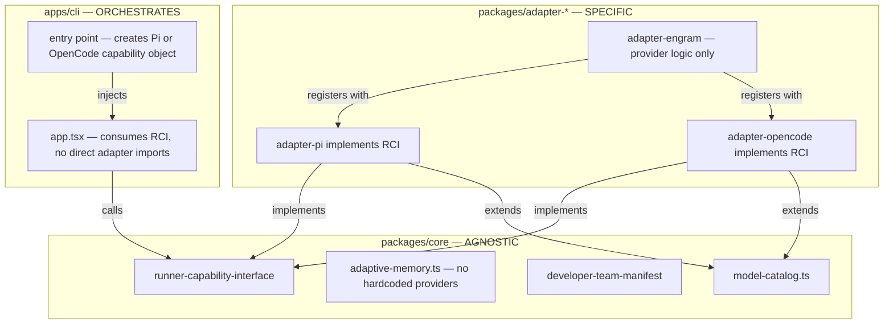

# Proposal: Hexagonal Architecture & Memory Refactor

## Intent

The Deck project claims a hexagonal architecture (`packages/core` agnostic, `packages/adapter-*` specific), but audit findings show multiple leaks where the core knows about specific providers, runtimes, and adapters, and where the TUI is tightly coupled to Pi and OpenCode internals. This refactor restores architectural boundaries so adding a new runner requires **only** a new adapter package, zero changes to core, CLI TUI, or other adapters.

## Goal

Make `packages/core` 100% provider- and runtime-agnostic, decouple the CLI TUI from adapter-specific imports, and establish a single canonical model catalog in core that all adapters extend — without removing Engram or Supermemory as valid options.

## Scope

### In Scope
- **Decouple TUI from adapter specifics**: `apps/cli/src/tui/app.tsx` (1,979 lines) imports 40+ functions from `adapter-pi` and 25+ from `adapter-opencode`. Extract runner-agnostic orchestration hooks and drive runner-specific behavior through a capability interface registered per-adapter.
- **Remove provider hardcodes from core**: `packages/core/src/memory/adaptive-memory.ts:86` defines `SUPPORTED_ADAPTIVE_MEMORY_PROVIDER_IDS = ["engram", "supermemory"]`. Core should accept any provider ID passed by the caller (adapter or CLI); allowlisting belongs to the adapter/CLI layer.
- **Fix adapter cross-contamination**: `packages/adapter-pi/src/team-catalog.ts:16` references `"opencode-development"`. Pi adapter must only know Pi environments.
- **Remove runtime-specific strings from core**: `packages/core/src/teams/developer/visual-explanations-content.ts:116` contains `"pi-mermaid"` in prohibited phrases. Core content must be runtime-neutral.
- **Unify model configuration**: Each adapter (`adapter-pi`, `adapter-opencode`) maintains its own `model-config.ts` with hardcoded, divergent model lists. Create a canonical `packages/core/src/model-catalog.ts` with agnostic model metadata (id, displayName, capabilities); adapters provide provider-specific resolution/env-var mapping on top.
- **Eliminate Engram hardcoding from core**: Engram is referenced in 226+ locations across core, prompts, tests, and CLI. Move Engram-specific logic to `adapter-engram` and `apps/cli` (where adapter registration happens). Core should treat Engram as just another provider ID.
- **Normalize Developer Team output formats**: Pi generates `.md` + YAML frontmatter; OpenCode generates `opencode.json` + `.md` skills. Define a core "Developer Team Manifest" type that both adapters translate into their native formats, ensuring the canonical data lives in core.

### Out of Scope
- **Removing Engram as a memory option**: Engram stays fully supported; it simply stops being hardcoded in core.
- **Creating adapters for Codex/Claude or other new runners**: This refactor prepares the architecture for that, but does not add new adapters.
- **Refactoring the TUI UI components themselves**: We decouple the *orchestration/data layer* from adapters, not redesign Ink components.
- **Changing the actual memory provider implementations** (Engram, Supermemory SDK wrappers): Only their *registration/discovery* moves; their logic stays.

## Affected Capabilities

### New Capabilities
- `runner-capability-interface`: Abstract interface that each adapter implements to expose installation plans, tool inventories, model configs, and memory providers to the CLI TUI.
- `canonical-model-catalog`: Agnostic model metadata registry in core with extensible provider-specific overlays in adapters.
- `developer-team-manifest`: Canonical intermediate representation for Developer Team output that adapters serialize to runner-native formats.

### Modified Capabilities
- `adaptive-memory`: Core no longer maintains a provider allowlist; validation shifts to adapter/CLI registration time.
- `cli-tui-orchestration`: TUI consumes runner capabilities through the new interface instead of direct adapter imports.
- `developer-team-install`: Both Pi and OpenCode paths updated to generate output from the canonical manifest.

### Unchanged Capabilities
- `engram-memory-provider`: The actual Engram adapter logic remains unchanged; only its registration/discovery mechanism moves.
- `supermemory-provider`: Similarly unchanged in implementation, only in how it is discovered.
- `team-catalog-core`: Canonical team definitions in core remain the source of truth; only adapter lookup functions change.

## Approach

1. **Define the `RunnerCapabilityInterface`** in `packages/core/src/runner-capability.ts` with methods like `buildInstallationPlan()`, `getModelCatalog()`, `getMemoryProviders()`, `getTeamCatalog()`.
2. **Refactor both adapters** (`adapter-pi`, `adapter-opencode`) to implement this interface, exporting a single `createPiRunnerCapabilities()` / `createOpenCodeRunnerCapabilities()` factory.
3. **Refactor CLI TUI**: `app.tsx` receives a `RunnerCapabilities` object at initialization. Remove all direct `adapter-pi` / `adapter-opencode` imports from TUI code; the CLI layer (entry point) creates the correct capability object based on the subcommand (`pi` vs `opencode`) and passes it down.
4. **Move provider allowlists out of core**: Delete `SUPPORTED_ADAPTIVE_MEMORY_PROVIDER_IDS` from `adaptive-memory.ts`. Adapters/CLI supply `supportedProviderIds` in `ResolveMemoryInjectionOptions`.
5. **Create `packages/core/src/model-catalog.ts`**: Defines `ModelEntry`, `ProviderEntry`, `ModelCapability` types and a canonical list. Adapters extend with env-var mappings and runtime-specific defaults.
6. **Fix cross-contamination**: Remove `"opencode-development"` from `adapter-pi/src/team-catalog.ts`; create a proper `adapter-opencode/src/team-catalog.ts` if missing.
7. **Remove runtime strings from core**: Replace `"pi-mermaid"` with a generic placeholder or remove it from core prohibited phrases; adapters inject runtime-specific prohibited phrases during content rendering.
8. **Audit and migrate Engram references**: Use grep results (226 matches) to systematically move Engram-specific code to `adapter-engram` or CLI registration layer. Core tests should use a mock provider ID, not `"engram"`.

## Alternatives and Tradeoffs

| Alternative | Why Considered | Why Not Chosen |
|---|---|---|
| **Create a plugin/registry system with dynamic imports** | Would allow adapters to be loaded at runtime without CLI knowing them | Over-engineering for current 2-runner setup; adds complexity (resolution, versioning, dynamic bundling). Revisit when 3+ runners exist. |
| **Keep TUI as-is, only extract shared utilities** | Minimal code churn | Does not solve the architectural leak; adding a 3rd runner still requires touching `app.tsx`. |
| **Move all model-config to CLI layer** | Centralizes configuration | Violates hexagonal architecture; CLI should orchestrate, not own domain data. Model metadata belongs in core, resolution in adapters. |

## Risks

| Risk | Likelihood | Mitigation |
|---|---|---|
| **TUI regression** due to large refactor of `app.tsx` (1,979 lines) | Medium | Extract incrementally: first introduce capability interface alongside existing imports, then migrate screen by screen. Maintain comprehensive existing tests; add integration tests for new interface. |
| **Breaking change in adaptive-memory contract** for external callers | Low | The `supportedProviderIds` option already exists in `ResolveMemoryInjectionOptions`; we are removing a hardcoded fallback, not changing the API shape. Document migration for any internal callers relying on the default allowlist. |
| **Missing Engram references in grep** (some may be in generated/template strings) | Medium | Do a second pass with semantic search (e.g., `grep -r "engram" --include="*.md" --include="*.json" --include="*.yaml"`). Include prompt templates and skill files in the audit. |
| **Adapter-pi/OpenCode model-config divergence is deeper than surface** | Medium | Before creating canonical catalog, diff both files fully. If they encode fundamentally different concepts (e.g., Pi has `thinkingLevel`, OpenCode has `reasoningEffort`), define a unified capability model in core that both map to. |
| **Rollback complexity** because change touches core + 2 adapters + CLI simultaneously | Medium | Implement behind feature flags where possible (e.g., TUI can use old direct imports or new capability interface). Rollback is reverting commits; the change is a single coherent refactor branch. |

## Rollback Plan

1. **Branch-based rollback**: All work happens on a feature branch (`feat/hexagonal-refactor`). If verification fails, revert the merge commit or discard the branch.
2. **Feature-flag TUI migration**: If the TUI interface is toggled, fall back to direct adapter imports by switching a single prop/flag in `app.tsx` entry point.
3. **Core contract backward compatibility**: Keep `supportedProviderIds` optional but without default. If issues arise, temporarily restore a deprecated `DEFAULT_SUPPORTED_PROVIDER_IDS` constant in core marked `@deprecated` until adapters catch up.
4. **Adapter isolation**: Each adapter change is in its own package. If one adapter refactor is buggy, the others remain untouched and can be pinned to pre-refactor versions independently via monorepo versioning.

## Dependencies

- None external. Internal dependency: Explorer Agent findings should include the full diff of both `model-config.ts` files to inform the canonical catalog design.

## Open Questions

- What is the exact shape of `RunnerCapabilityInterface`? Should it be a single large interface or composed smaller ones (`InstallationPlanner`, `ModelResolver`, `MemoryProviderRegistry`)?
- How should the canonical `model-catalog.ts` handle `thinkingLevel` (Pi) vs `reasoningEffort` (OpenCode)? Are these the same concept with different names, or different capabilities?
- Does `adapter-engram` already exist as a standalone package, or is Engram logic currently embedded in `adapter-pi` / `adapter-opencode`? The grep shows `import { createEngramMemoryProvider } from "@deck/adapter-engram"`, suggesting it exists — confirm its current API surface.

> If there are no open questions, write "None — proposal is self-contained."

## Acceptance Direction

- [ ] `packages/core` has zero hardcoded references to `"engram"`, `"supermemory"`, `"pi"`, `"opencode"`, or any specific provider/runtime.
- [ ] `apps/cli/src/tui/app.tsx` imports nothing from `adapter-pi` or `adapter-opencode` directly; all runner-specific behavior is via `RunnerCapabilityInterface`.
- [ ] Adding a new runner requires creating one new `packages/adapter-{runner}` package and registering it in CLI entry point; no changes to core or TUI.
- [ ] All 226+ Engram references are audited: core and prompts use generic provider terms; Engram-specific logic lives in `adapter-engram` or CLI registration.
- [ ] A canonical `packages/core/src/model-catalog.ts` exists and both adapters consume it; no duplicate hardcoded model lists.
- [ ] Existing tests pass; no regression in `pi developer` or `opencode developer` installation flows.

## Next Steps

Ready for Spec (`deck-developer-spec`) and Design (`deck-developer-design`) in parallel.

## Mermaid Summary Source

