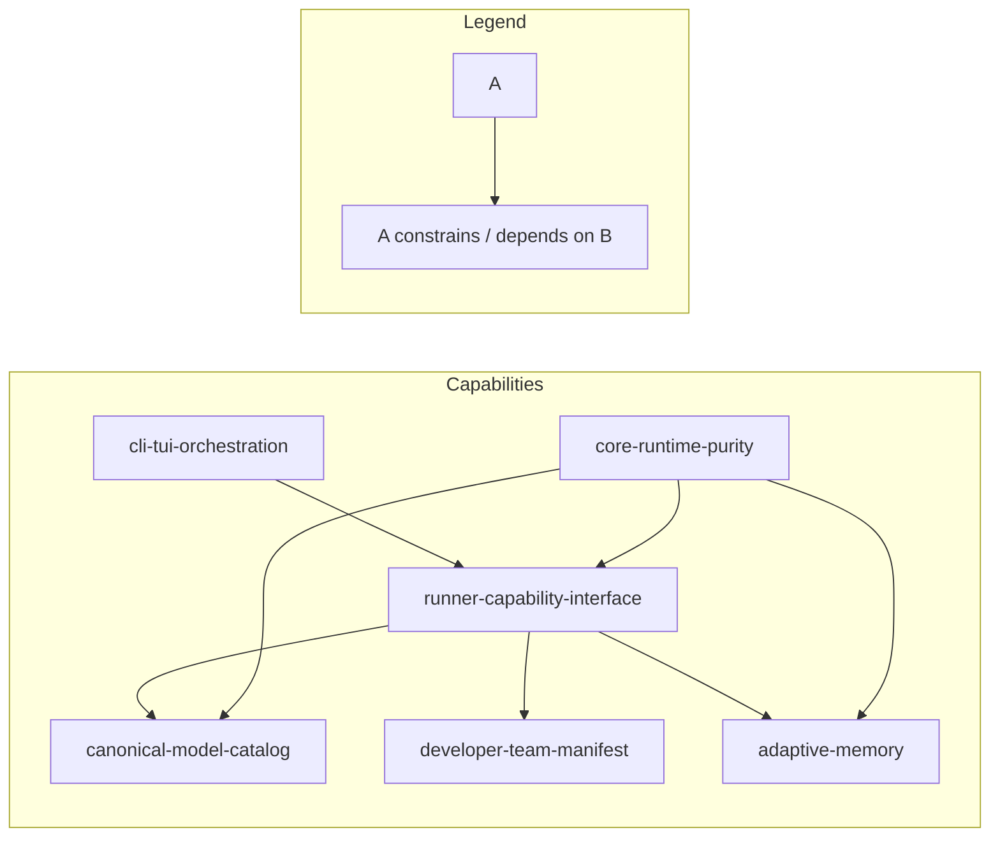

# Spec: Hexagonal Architecture & Memory Refactor

## Source

- Proposal: `hexagonal-architecture-memory-refactor` proposal artifact
- Capabilities affected:
  - New: `runner-capability-interface`, `canonical-model-catalog`, `developer-team-manifest`
  - Modified: `adaptive-memory`, `cli-tui-orchestration`, `developer-team-install`
  - Unchanged: `engram-memory-provider`, `supermemory-provider`, `team-catalog-core`

## Requirements

### Capability: runner-capability-interface

REQ-RCI-001: The system SHALL define a `RunnerCapabilities` type in `packages/core` that aggregates runner-neutral capability facets (tools, teams, models, memory) without referencing any specific runner or provider.

  Priority: MUST
  Surface: General
  Rationale: Establishes the port that adapters implement and CLI/TUI consumes; replaces scattered direct imports.

REQ-RCI-002: Each adapter package (`adapter-pi`, `adapter-opencode`) MUST export a factory function that creates a `RunnerCapabilities` object for its runner.

  Priority: MUST
  Surface: API
  Rationale: Adapters are the only place that know about runner-specific behavior; the factory encapsulates that knowledge.

REQ-RCI-003: The CLI TUI component (`app.tsx`) SHALL receive `RunnerCapabilities` at initialization and MUST NOT import directly from any `adapter-*` package.

  Priority: MUST
  Surface: UI
  Rationale: Decouples TUI from adapter internals; adding a new runner requires zero TUI changes.

REQ-RCI-004: The CLI entry point MUST act as the composition root, selecting the correct `RunnerCapabilities` factory based on the active subcommand and injecting it into the TUI.

  Priority: MUST
  Surface: General
  Rationale: Centralizes runner selection; removes conditional runner logic from TUI screens.

REQ-RCI-005: Adding a new runner to the system SHALL require only: (a) creating a new `packages/adapter-{runner}` package implementing `RunnerCapabilities`, and (b) registering it in the CLI entry point — with no modifications to `packages/core` or the TUI.

  Priority: MUST
  Surface: General
  Rationale: The defining test of hexagonal architecture; validates the boundary is real.

REQ-RCI-006: `RunnerCapabilities.teamCatalog` MUST include a `getTeamsForEnvironment` function that returns teams scoped to the adapter's own environment IDs only.

  Priority: MUST
  Surface: API
  Rationale: Eliminates cross-contamination where adapter-pi returns teams for opencode-development.

### Capability: canonical-model-catalog

REQ-MC-001: Core SHALL define a canonical `ModelCatalog` with agnostic model metadata (provider ID, display name, capabilities, normalized reasoning levels) and Developer Team default model assignments.

  Priority: MUST
  Surface: Data
  Rationale: Eliminates divergent hardcoded model lists in adapters; core owns the "what," adapters own the "how."

REQ-MC-002: Each adapter's `model-config` MUST consume the core `ModelCatalog` for model identity and provide only provider-specific resolution (env-var mapping, runtime-specific defaults, native config fields).

  Priority: MUST
  Surface: API
  Rationale: Adapters translate canonical models to runner-native format; no duplicate model lists.

REQ-MC-003: The canonical model catalog SHALL define normalized reasoning levels that adapters map to their native equivalents (e.g., `thinking` for Pi, `reasoningEffort` for OpenCode).

  Priority: SHOULD
  Surface: Data
  Rationale: Bridges semantic differences between runners without forcing lowest-common-denominator.

REQ-MC-004: The core `ModelCatalog` MUST NOT contain runner-specific field names, environment variable names, or runtime configuration keys.

  Priority: MUST
  Surface: General
  Rationale: Validates core is genuinely agnostic; prevents leaking adapter concerns.

### Capability: developer-team-manifest

REQ-DTM-001: Core SHALL define a `DeveloperTeamManifest` type representing the canonical intermediate output for Developer Team installation (agents, content, model assignments, optional memory injection bundle).

  Priority: MUST
  Surface: Data
  Rationale: Adapters share canonical team data; only serialization format differs.

REQ-DTM-002: Each adapter MUST provide a manifest serializer that translates a `DeveloperTeamManifest` into its runner-native output format.

  Priority: MUST
  Surface: API
  Rationale: Pi writes `.md` + YAML; OpenCode writes `opencode.json` + skills; core doesn't know either.

REQ-DTM-003: The core manifest-building process MUST accept optional model assignments and memory injection configuration as inputs without knowing their provider-specific details.

  Priority: SHOULD
  Surface: General
  Rationale: Allows adapters to inject provider-specific configuration without core awareness.

### Capability: adaptive-memory

REQ-AM-001: Core MUST remove `SUPPORTED_ADAPTIVE_MEMORY_PROVIDER_IDS` from `packages/core/src/memory/adaptive-memory.ts` and `ADAPTIVE_MEMORY_PROVIDER_IDS` from `packages/core/src/memory/adaptive-memory-contract.ts`.

  Priority: MUST
  Surface: API
  Rationale: Provider allowlists are an adapter/CLI concern, not core domain.

REQ-AM-002: Core SHALL accept `supportedProviderIds` as a caller-supplied parameter when resolving memory providers, with no hardcoded fallback.

  Priority: MUST
  Surface: API
  Rationale: CLI/adapters register available providers; core validates against the caller-supplied list.

REQ-AM-003: Core MUST remove `ADAPTIVE_MEMORY_ACTIVE_PROVIDERS` from `packages/core/src/config/deck-config.ts`.

  Priority: MUST
  Surface: Data
  Rationale: Config-level provider enumeration belongs in the CLI/adapter layer, not core config.

REQ-AM-004: Adapters/CLI SHALL register available memory providers (e.g., Engram, Supermemory) at composition time.

  Priority: MUST
  Surface: General
  Rationale: Provider registration moves from core allowlist to CLI composition root.

REQ-AM-005: After refactor, `packages/core` SHALL contain zero string literals matching `"engram"` or `"supermemory"` in non-test source files.

  Priority: MUST
  Surface: General
  Rationale: Validates the boundary: core is genuinely provider-agnostic.

REQ-AM-006: Core test files MAY use synthetic provider IDs (e.g., `"mock-provider"`) instead of real provider names, except for backward-compatibility regression tests.

  Priority: SHOULD
  Surface: General
  Rationale: Prevents accidental reintroduction of provider coupling through tests.

### Capability: cli-tui-orchestration

REQ-TUI-001: `apps/cli/src/tui/app.tsx` MUST NOT contain any import statement referencing `@deck/adapter-pi` or `@deck/adapter-opencode`.

  Priority: MUST
  Surface: UI
  Rationale: Validates TUI decoupling; the TUI only knows core contracts and injected capabilities.

REQ-TUI-002: The CLI entry point (`apps/cli/src/main.tsx`) SHALL create the appropriate `RunnerCapabilities` object and pass it to the TUI as a prop/parameter.

  Priority: MUST
  Surface: General
  Rationale: Entry point is the composition root; TUI receives ready-to-use capabilities.

REQ-TUI-003: All runner-specific dashboard helpers (e.g., `apps/cli/src/tui/pi-runner-dashboard/action-runner.ts`) SHALL consume `RunnerCapabilities` instead of direct adapter imports.

  Priority: MUST
  Surface: UI
  Rationale: Dashboard helpers currently import `buildDeveloperTeamInstallPlan` from adapter-pi directly.

REQ-TUI-004: Developer Team screen components SHALL use core-normalized model view models instead of adapter-specific model types.

  Priority: SHOULD
  Surface: UI
  Rationale: Screen components currently import Pi/OpenCode model helpers and adapter model types.

### Capability: core-runtime-purity

REQ-CRP-001: `packages/core` source files (excluding tests) MUST NOT contain string literals referencing specific runners (`"pi"`, `"opencode"`, `"pi-mermaid"`) or specific providers (`"engram"`, `"supermemory"`).

  Priority: MUST
  Surface: General
  Rationale: The ultimate boundary test: core is runtime- and provider-neutral.

REQ-CRP-002: The `visual-explanations-content.ts` prohibited phrases list SHALL NOT include runtime-specific package names like `"pi-mermaid"`.

  Priority: MUST
  Surface: General
  Rationale: Core content/prompt generation must not encode runner-specific knowledge.

REQ-CRP-003: `packages/adapter-pi/src/team-catalog.ts` MUST NOT reference `"opencode-development"` or any other adapter's environment ID.

  Priority: MUST
  Surface: API
  Rationale: Eliminates adapter cross-contamination; each adapter knows only its own environments.

REQ-CRP-004: An `adapter-opencode/src/team-catalog.ts` SHALL exist with OpenCode-specific environment support.

  Priority: MUST
  Surface: General
  Rationale: Currently missing; OpenCode team lookup leaks through adapter-pi.

## Acceptance Scenarios

### Capability: runner-capability-interface

#### Scenario: CLI injects runner capabilities into TUI
**Given** a user invokes the CLI with a runner subcommand (e.g., `pi` or `opencode`)
**When** the CLI entry point initializes the TUI
**Then** the TUI receives a `RunnerCapabilities` object created by the corresponding adapter factory
**And** the TUI does not import any `adapter-*` package directly
> Covers: REQ-RCI-001, REQ-RCI-002, REQ-RCI-003, REQ-RCI-004

#### Scenario: Adding a new runner requires only adapter + registration
**Given** the refactored architecture is in place
**When** a developer creates a new `packages/adapter-codex` implementing `RunnerCapabilities` and registers it in the CLI entry point
**Then** the new runner is fully functional without any changes to `packages/core` or `apps/cli/src/tui/app.tsx`
> Covers: REQ-RCI-005

#### Scenario: Adapter returns only its own teams
**Given** the Pi adapter's `getTeamsForEnvironment` function
**When** called with `"opencode-development"`
**Then** it returns an empty list (not the full team catalog)
> Covers: REQ-RCI-006

#### Scenario: Adapter returns teams for its own environment
**Given** the Pi adapter's `getTeamsForEnvironment` function
**When** called with `"pi-development"`
**Then** it returns the full team catalog
> Covers: REQ-RCI-006

### Capability: canonical-model-catalog

#### Scenario: Adapters consume core model catalog
**Given** the core `ModelCatalog` defines canonical model entries with agnostic fields
**When** the Pi adapter resolves a model for its config
**Then** it reads the model identity from the core catalog and adds only Pi-specific fields (env vars, thinking levels)
**And** the core catalog contains no Pi-specific field names
> Covers: REQ-MC-001, REQ-MC-002, REQ-MC-004

#### Scenario: Normalized reasoning levels bridge runners
**Given** the core catalog defines normalized reasoning levels
**When** the Pi adapter resolves a model with reasoning capability
**Then** it maps the normalized level to Pi's native `thinking` field
**When** the OpenCode adapter resolves the same model
**Then** it maps the normalized level to OpenCode's `reasoningEffort` field
> Covers: REQ-MC-003

#### Scenario: Core model catalog has no runner-specific fields
**Given** the core `ModelCatalog` source code
**When** scanned for runner-specific strings (`pi`, `opencode`, `thinkingLevel`, `reasoningEffort`)
**Then** zero matches are found
> Covers: REQ-MC-004

### Capability: developer-team-manifest

#### Scenario: Manifest builds from core data
**Given** core agent definitions, content registry, and optional model assignments
**When** the manifest builder constructs a `DeveloperTeamManifest`
**Then** the manifest contains all agents, their content, model assignments, and memory injection configuration
**And** the manifest contains no runner-specific file paths or format details
> Covers: REQ-DTM-001, REQ-DTM-003

#### Scenario: Pi adapter serializes manifest to native format
**Given** a `DeveloperTeamManifest`
**When** the Pi adapter serializer processes it
**Then** it produces `.md` files with YAML frontmatter for each agent
> Covers: REQ-DTM-002

#### Scenario: OpenCode adapter serializes manifest to native format
**Given** a `DeveloperTeamManifest`
**When** the OpenCode adapter serializer processes it
**Then** it produces `opencode.json`, prompt files, command files, and skill files
> Covers: REQ-DTM-002

### Capability: adaptive-memory

#### Scenario: Core has no hardcoded provider allowlist
**Given** `packages/core/src/memory/adaptive-memory.ts` after refactor
**When** scanned for `SUPPORTED_ADAPTIVE_MEMORY_PROVIDER_IDS`
**Then** no such export exists
> Covers: REQ-AM-001

#### Scenario: Core resolves memory provider from caller-supplied list
**Given** the CLI registers `"engram"` and `"supermemory"` as available providers
**When** core resolves the active memory provider
**Then** it accepts the caller-supplied `supportedProviderIds` parameter
**And** it does not fall back to any hardcoded provider list
> Covers: REQ-AM-002, REQ-AM-004

#### Scenario: Core config has no provider enumeration
**Given** `packages/core/src/config/deck-config.ts` after refactor
**When** scanned for `ADAPTIVE_MEMORY_ACTIVE_PROVIDERS`
**Then** no such export exists
> Covers: REQ-AM-003

#### Scenario: Core source is provider-name clean
**Given** all non-test `.ts` files in `packages/core/src/`
**When** scanned for string literals `"engram"` or `"supermemory"`
**Then** zero matches are found
> Covers: REQ-AM-005

#### Scenario: Core tests use synthetic provider IDs
**Given** core test files for memory functionality
**When** constructing test provider objects
**Then** they use synthetic IDs like `"mock-provider"` rather than `"engram"` or `"supermemory"`
> Covers: REQ-AM-006

### Capability: cli-tui-orchestration

#### Scenario: TUI has no direct adapter imports
**Given** `apps/cli/src/tui/app.tsx` after refactor
**When** scanned for import statements matching `@deck/adapter-pi` or `@deck/adapter-opencode`
**Then** zero matches are found
> Covers: REQ-TUI-001

#### Scenario: CLI entry point creates and injects capabilities
**Given** the CLI entry point (`apps/cli/src/main.tsx`)
**When** a runner subcommand is selected
**Then** it creates a `RunnerCapabilities` object from the corresponding adapter factory
**And** passes it to the TUI component
> Covers: REQ-TUI-002

#### Scenario: Dashboard helpers use injected capabilities
**Given** `apps/cli/src/tui/pi-runner-dashboard/action-runner.ts` after refactor
**When** scanned for direct adapter imports
**Then** it imports from core or receives capabilities via parameters, not from `@deck/adapter-pi`
> Covers: REQ-TUI-003

#### Scenario: Developer Team screens use normalized models
**Given** `apps/cli/src/tui/screens/developer-team-screens.tsx` after refactor
**When** displaying model configuration
**Then** it consumes core-normalized model view models
**And** does not import adapter-specific model types
> Covers: REQ-TUI-004

### Capability: core-runtime-purity

#### Scenario: Core has no runtime string literals
**Given** all non-test source files in `packages/core/src/`
**When** scanned for string literals `"pi"`, `"opencode"`, `"pi-mermaid"`, `"engram"`, `"supermemory"`
**Then** zero matches are found
> Covers: REQ-CRP-001

#### Scenario: Visual explanations content is runtime-neutral
**Given** `packages/core/src/teams/developer/visual-explanations-content.ts` after refactor
**When** the prohibited phrases list is inspected
**Then** `"pi-mermaid"` is not present
> Covers: REQ-CRP-002

#### Scenario: Pi adapter team catalog is self-contained
**Given** `packages/adapter-pi/src/team-catalog.ts` after refactor
**When** scanned for `"opencode-development"`
**Then** zero matches are found
> Covers: REQ-CRP-003

#### Scenario: OpenCode has its own team catalog
**Given** `packages/adapter-opencode/src/team-catalog.ts`
**When** the file is loaded
**Then** it exports a function returning teams for `"opencode-development"`
**And** it does not reference `"pi-development"`
> Covers: REQ-CRP-004

## Validation Rules

| Field / Input | Rule | Error Message | REQ-ID |
|---|---|---|---|
| `supportedProviderIds` | MUST be a non-empty array when calling memory resolution | `"supportedProviderIds must be a non-empty array"` | REQ-AM-002 |
| `RunnerCapabilities.id` | MUST be a non-empty string unique across all registered runners | `"Runner ID must be unique"` | REQ-RCI-001 |
| `environmentId` | Adapter MUST only return teams for environment IDs it owns | — (returns empty, no error) | REQ-RCI-006 |
| Model catalog entry `id` | MUST be unique within the catalog | `"Duplicate model ID: {id}"` | REQ-MC-001 |
| `DeveloperTeamManifest.agents` | MUST contain at least one agent | `"Manifest must contain at least one agent"` | REQ-DTM-001 |

## Error Contracts

| Condition | Error Code | Message | Surface |
|---|---|---|---|
| No `RunnerCapabilities` provided to TUI | `MISSING_RUNNER_CAPABILITIES` | `"Runner capabilities must be injected at initialization"` | UI |
| Unknown provider ID in `supportedProviderIds` | `UNKNOWN_PROVIDER` | `"Provider '{id}' is not registered"` | API |
| Adapter references another adapter's environment | (design-time lint error) | — | General |
| Core source contains provider/runtime literals | (CI audit failure) | `"Core purity violation: found '{literal}' in {file}"` | General |

## States and Transitions

| State | Description | Entry Criteria |
|---|---|---|
| `no-runner-selected` | CLI started but no runner subcommand chosen | Initial state |
| `runner-resolved` | CLI selected runner and created `RunnerCapabilities` | Runner subcommand parsed |
| `capabilities-injected` | `RunnerCapabilities` passed to TUI | Factory created successfully |
| `providers-registered` | Memory providers registered in composition root | CLI entry point ran provider registration |

| From | To | Trigger | Side Effects |
|---|---|---|---|
| `no-runner-selected` | `runner-resolved` | Runner subcommand parsed | Adapter factory invoked |
| `runner-resolved` | `capabilities-injected` | TUI component mounts | TUI renders with capabilities |
| `capabilities-injected` | `providers-registered` | Memory provider factories run | Provider objects available for resolution |

## Open Questions

- What is the exact shape of normalized reasoning levels? Should `thinkingLevel` (Pi) and `reasoningEffort` (OpenCode) map to the same enum, or separate fields on a union type? (Deferred to Design.)
- Does `adapter-engram` already export registration metadata, or does it need a new export? The proposal found `import { createEngramMemoryProvider } from "@deck/adapter-engram"` but registration metadata may need to be added.
- Should the core purity audit (`REQ-CRP-001`, `REQ-AM-005`) be enforced by a CI lint rule, a test, or both?

## Compliance Matrix

| REQ-ID | Scenario(s) | Status |
|---|---|---|
| REQ-RCI-001 | CLI injects runner capabilities into TUI | Defined |
| REQ-RCI-002 | CLI injects runner capabilities into TUI | Defined |
| REQ-RCI-003 | CLI injects runner capabilities into TUI | Defined |
| REQ-RCI-004 | CLI injects runner capabilities into TUI | Defined |
| REQ-RCI-005 | Adding a new runner requires only adapter + registration | Defined |
| REQ-RCI-006 | Adapter returns only its own teams, Adapter returns teams for its own environment | Defined |
| REQ-MC-001 | Adapters consume core model catalog | Defined |
| REQ-MC-002 | Adapters consume core model catalog | Defined |
| REQ-MC-003 | Normalized reasoning levels bridge runners | Defined |
| REQ-MC-004 | Core model catalog has no runner-specific fields | Defined |
| REQ-DTM-001 | Manifest builds from core data | Defined |
| REQ-DTM-002 | Pi adapter serializes manifest, OpenCode adapter serializes manifest | Defined |
| REQ-DTM-003 | Manifest builds from core data | Defined |
| REQ-AM-001 | Core has no hardcoded provider allowlist | Defined |
| REQ-AM-002 | Core resolves memory provider from caller-supplied list | Defined |
| REQ-AM-003 | Core config has no provider enumeration | Defined |
| REQ-AM-004 | Core resolves memory provider from caller-supplied list | Defined |
| REQ-AM-005 | Core source is provider-name clean | Defined |
| REQ-AM-006 | Core tests use synthetic provider IDs | Defined |
| REQ-TUI-001 | TUI has no direct adapter imports | Defined |
| REQ-TUI-002 | CLI entry point creates and injects capabilities | Defined |
| REQ-TUI-003 | Dashboard helpers use injected capabilities | Defined |
| REQ-TUI-004 | Developer Team screens use normalized models | Defined |
| REQ-CRP-001 | Core has no runtime string literals | Defined |
| REQ-CRP-002 | Visual explanations content is runtime-neutral | Defined |
| REQ-CRP-003 | Pi adapter team catalog is self-contained | Defined |
| REQ-CRP-004 | OpenCode has its own team catalog | Defined |

## Mermaid Summary Source

