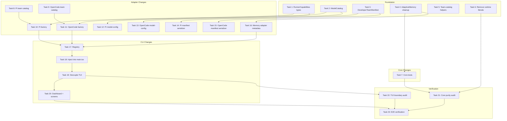

# Tasks: Hexagonal Architecture & Memory Refactor

## Source

- Spec: `hexagonal-architecture-memory-refactor` spec artifact
- Design: `hexagonal-architecture-memory-refactor` design artifact
- Capabilities affected: runner-capability-interface, canonical-model-catalog, developer-team-manifest, adaptive-memory, cli-tui-orchestration, core-runtime-purity

## Task Groups

### Group: Foundation (Shared / Contracts)

#### Task 1: Define RunnerCapabilities core types

**Owner**: General Apply
**Priority**: P0 (blocking)
**Complexity**: Medium
**Parallel**: Yes
**Depends on**: none
**Status**: unblocked

**Description**
Create `packages/core/src/runner-capability.ts` with the runner-neutral capability interfaces: `RunnerCapabilities`, `RunnerToolCapabilities`, `RunnerTeamCapabilities`, `RunnerModelCapabilities`, `RunnerMemoryCapabilities`, plus associated input/result types (`RunnerEnvironment`, `RunnerEnvironmentInspectInput`, etc.). Derive input/result field shapes from existing Pi/OpenCode plan types but use agnostic names. Export from `packages/core/src/index.ts`.

**Files**
- `packages/core/src/runner-capability.ts` — create
- `packages/core/src/index.ts` — modify

**Verification**
- TypeScript compiles without errors.
- No string literals matching `"pi"`, `"opencode"`, `"engram"`, or `"supermemory"` in the new file.
- Covers: REQ-RCI-001

---

#### Task 2: Define ModelCatalog core types and data

**Owner**: General Apply
**Priority**: P0 (blocking)
**Complexity**: Medium
**Parallel**: Yes
**Depends on**: none
**Status**: unblocked

**Description**
Create `packages/core/src/model-catalog.ts` with canonical types (`ModelProviderEntry`, `ModelEntry`, `ModelCapability`, `ReasoningLevel`, `DeveloperTeamDefaultModelAssignment`, `ModelCatalog`) and the actual catalog data. Populate providers, models, and Developer Team default model assignments by consolidating from existing Pi and OpenCode model config. Export from `packages/core/src/index.ts`.

**Files**
- `packages/core/src/model-catalog.ts` — create
- `packages/core/src/index.ts` — modify

**Verification**
- TypeScript compiles.
- Catalog contains all current Developer Team default model assignments.
- No runner-specific field names (`thinkingLevel`, `reasoningEffort`, env var names) in the file.
- Covers: REQ-MC-001, REQ-MC-003, REQ-MC-004

---

#### Task 3: Define DeveloperTeamManifest core types and builder

**Owner**: General Apply
**Priority**: P0 (blocking)
**Complexity**: Medium
**Parallel**: Yes
**Depends on**: none
**Status**: unblocked

**Description**
Create `packages/core/src/teams/developer/manifest.ts` with `DeveloperTeamManifest`, `DeveloperTeamManifestAgent`, `DeveloperTeamManifestSkill` types and a builder function that composes agents, content registry, optional model assignments, and optional memory injection bundle into a manifest. The builder accepts optional inputs without knowing provider-specific details. Export from `packages/core/src/index.ts`.

**Files**
- `packages/core/src/teams/developer/manifest.ts` — create
- `packages/core/src/index.ts` — modify

**Verification**
- TypeScript compiles.
- Builder produces a manifest with at least one agent when given valid inputs.
- Manifest types contain no runner-specific file paths or format details.
- Covers: REQ-DTM-001, REQ-DTM-003

---

#### Task 4: Clean AdaptiveMemory contracts — remove hardcoded providers

**Owner**: General Apply
**Priority**: P0 (blocking)
**Complexity**: Medium
**Parallel**: Yes
**Depends on**: none
**Status**: unblocked

**Description**
Remove `SUPPORTED_ADAPTIVE_MEMORY_PROVIDER_IDS` from `packages/core/src/memory/adaptive-memory.ts`, remove `ADAPTIVE_MEMORY_PROVIDER_IDS` and `BuiltInAdaptiveMemoryProviderId` from `packages/core/src/memory/adaptive-memory-contract.ts`, and remove `ADAPTIVE_MEMORY_ACTIVE_PROVIDERS` from `packages/core/src/config/deck-config.ts`. Refactor `resolveMemoryInjection()` (or equivalent) to accept `supportedProviderIds` as a required caller-supplied parameter with no hardcoded fallback. Keep `AdaptiveMemoryProvider` / `AdaptiveMemoryAdapter` structural contracts intact.

**Files**
- `packages/core/src/memory/adaptive-memory-contract.ts` — modify
- `packages/core/src/memory/adaptive-memory.ts` — modify
- `packages/core/src/config/deck-config.ts` — modify

**Verification**
- TypeScript compiles.
- Grep for `SUPPORTED_ADAPTIVE_MEMORY_PROVIDER_IDS`, `ADAPTIVE_MEMORY_PROVIDER_IDS`, `BuiltInAdaptiveMemoryProviderId`, `ADAPTIVE_MEMORY_ACTIVE_PROVIDERS` — zero matches in core source.
- `resolveMemoryInjection` accepts `supportedProviderIds` parameter and has no hardcoded fallback.
- Covers: REQ-AM-001, REQ-AM-002, REQ-AM-003

---

### Group: Core Changes

#### Task 5: Add runner-neutral team-catalog helpers to core

**Owner**: General Apply
**Priority**: P0 (blocking)
**Complexity**: Low
**Parallel**: Yes
**Depends on**: none
**Status**: unblocked

**Description**
In `packages/core/src/team-catalog.ts`, add a runner-neutral helper (e.g., `getTeamsForEnvironment(environmentId, catalog)`) that adapters can delegate to. This is a pure data lookup — the adapter provides which environment IDs it supports and the function filters accordingly. No changes to `ALL_TEAMS` content.

**Files**
- `packages/core/src/team-catalog.ts` — modify

**Verification**
- TypeScript compiles.
- Helper function accepts any string environment ID and returns filtered teams.
- Covers: REQ-RCI-006

---

#### Task 6: Remove runtime string literals from core content

**Owner**: General Apply
**Priority**: P1 (important)
**Complexity**: Low
**Parallel**: Yes
**Depends on**: none
**Status**: unblocked

**Description**
Remove or parameterize `"pi-mermaid"` from the prohibited phrases list in `packages/core/src/teams/developer/visual-explanations-content.ts`. Replace with a generic reference or move the runner-specific package name to an adapter-level override. Ensure the file contains zero string literals matching `"pi"`, `"opencode"`, `"pi-mermaid"`, `"engram"`, or `"supermemory"`.

**Files**
- `packages/core/src/teams/developer/visual-explanations-content.ts` — modify

**Verification**
- Grep the file for `"pi-mermaid"`, `"pi"`, `"opencode"`, `"engram"`, `"supermemory"` — zero matches.
- Existing tests still pass.
- Covers: REQ-CRP-002

---

#### Task 7: Update core tests for synthetic IDs and add neutrality tests

**Owner**: General Apply
**Priority**: P1 (important)
**Complexity**: Medium
**Parallel**: Yes — but coordinate with Task 4
**Depends on**: Task 4
**Status**: unblocked

**Description**
Update all core memory/config tests to use synthetic provider IDs (`"mock-provider"`, `"test-provider"`) instead of `"engram"` / `"supermemory"`, except backward-compatibility regression tests. Add a core neutrality test suite (`packages/core/src/runner-capability.test.ts` and/or `packages/core/src/model-catalog.test.ts`) asserting: (a) core source files contain zero concrete provider/runner string literals, (b) `ModelCatalog` completeness for all Developer Team agents, (c) `DeveloperTeamManifest` composition with and without memory bundles, (d) adaptive memory fail-closed when `supportedProviderIds` is omitted. Also update `packages/core/src/memory/adaptive-memory-contract.test.ts`, `packages/core/src/memory/adaptive-memory.test.ts`, `packages/core/src/config/deck-config.test.ts`, and content tests.

**Files**
- `packages/core/src/runner-capability.test.ts` — create
- `packages/core/src/model-catalog.test.ts` — create
- `packages/core/src/teams/developer/manifest.test.ts` — create
- `packages/core/src/memory/adaptive-memory-contract.test.ts` — modify
- `packages/core/src/memory/adaptive-memory.test.ts` — modify
- `packages/core/src/config/deck-config.test.ts` — modify
- `packages/core/src/teams/developer/*content*.test.ts` — modify

**Verification**
- All core tests pass with synthetic IDs.
- Core neutrality test suite passes (zero runtime/provider string literals in core source).
- Model catalog covers all Developer Team agents.
- Covers: REQ-AM-005, REQ-AM-006, REQ-CRP-001, REQ-MC-001, REQ-DTM-001

---

### Group: Adapter Changes

#### Task 8: Pi adapter team catalog cleanup

**Owner**: Backend Apply
**Priority**: P0 (blocking)
**Complexity**: Low
**Parallel**: Yes
**Depends on**: none
**Status**: unblocked

**Description**
In `packages/adapter-pi/src/team-catalog.ts`, remove all references to `"opencode-development"` and any other adapter's environment ID. The Pi adapter must only expose and return teams for its own environments (`"pi-development"`, etc.). Update tests accordingly — `getTeamsForEnvironment("opencode-development")` must return an empty list.

**Files**
- `packages/adapter-pi/src/team-catalog.ts` — modify
- `packages/adapter-pi/src/team-catalog.test.ts` — modify

**Verification**
- Grep for `"opencode-development"` in `packages/adapter-pi/src/team-catalog.ts` — zero matches.
- `getTeamsForEnvironment("opencode-development")` returns empty list.
- `getTeamsForEnvironment("pi-development")` returns full team catalog.
- Covers: REQ-CRP-003, REQ-RCI-006

---

#### Task 9: Create OpenCode adapter team catalog

**Owner**: Backend Apply
**Priority**: P0 (blocking)
**Complexity**: Low
**Parallel**: Yes
**Depends on**: none
**Status**: unblocked

**Description**
Create `packages/adapter-opencode/src/team-catalog.ts` that exports a team mapping for OpenCode environments (`"opencode-development"`, etc.). It must not reference `"pi-development"`. Export from `packages/adapter-opencode/src/index.ts`.

**Files**
- `packages/adapter-opencode/src/team-catalog.ts` — create
- `packages/adapter-opencode/src/team-catalog.test.ts` — create
- `packages/adapter-opencode/src/index.ts` — modify

**Verification**
- File exists and exports team lookup for `"opencode-development"`.
- Grep for `"pi-development"` — zero matches.
- Covers: REQ-CRP-004

---

#### Task 10: Implement Pi RunnerCapabilities factory

**Owner**: Backend Apply
**Priority**: P0 (blocking)
**Complexity**: High
**Parallel**: No — depends on Tasks 1, 8
**Depends on**: Task 1, Task 8
**Status**: blocked

**Description**
Create `packages/adapter-pi/src/runner-capabilities.ts` implementing `createPiRunnerCapabilities()`. Compose Pi's preflight, install, model, memory, team, and manifest functions into the core `RunnerCapabilities` interface. Use cleaned-up Pi team catalog (Task 8). Initially wrap existing Pi adapter functions — no need to refactor internals. Export from `packages/adapter-pi/src/index.ts`. Add conformance tests asserting the factory returns a valid `RunnerCapabilities` with `id: "pi"`.

**Files**
- `packages/adapter-pi/src/runner-capabilities.ts` — create
- `packages/adapter-pi/src/runner-capabilities.test.ts` — create
- `packages/adapter-pi/src/index.ts` — modify

**Verification**
- `createPiRunnerCapabilities()` returns object satisfying `RunnerCapabilities` type.
- Conformance tests pass.
- No imports from `@deck/adapter-opencode` or `@deck/adapter-supermemory`.
- Covers: REQ-RCI-002

---

#### Task 11: Implement OpenCode RunnerCapabilities factory

**Owner**: Backend Apply
**Priority**: P0 (blocking)
**Complexity**: High
**Parallel**: Yes — can run alongside Task 10
**Depends on**: Task 1, Task 9
**Status**: blocked

**Description**
Create `packages/adapter-opencode/src/runner-capabilities.ts` implementing `createOpenCodeRunnerCapabilities()`. Compose OpenCode's functions into the core `RunnerCapabilities` interface. Use the new OpenCode team catalog (Task 9). Initially wrap existing OpenCode adapter functions. Export from `packages/adapter-opencode/src/index.ts`. Add conformance tests asserting the factory returns a valid `RunnerCapabilities` with `id: "opencode"`.

**Files**
- `packages/adapter-opencode/src/runner-capabilities.ts` — create
- `packages/adapter-opencode/src/runner-capabilities.test.ts` — create
- `packages/adapter-opencode/src/index.ts` — modify

**Verification**
- `createOpenCodeRunnerCapabilities()` returns object satisfying `RunnerCapabilities` type.
- Conformance tests pass.
- No imports from `@deck/adapter-pi` or `@deck/adapter-engram`.
- Covers: REQ-RCI-002

---

#### Task 12: Pi model-config consume core catalog

**Owner**: Backend Apply
**Priority**: P1 (important)
**Complexity**: Medium
**Parallel**: Yes
**Depends on**: Task 2
**Status**: blocked

**Description**
Refactor `packages/adapter-pi/src/model-config.ts` to consume the core `ModelCatalog` for model identity and Developer Team default assignments. Keep Pi-specific: env-var mapping, `pi --list-models` parsing, `PiThinkingLevel` mapping, and compatibility wrappers for existing callers. Remove any duplicated model list that now lives in core.

**Files**
- `packages/adapter-pi/src/model-config.ts` — modify
- `packages/adapter-pi/src/model-config.test.ts` — modify

**Verification**
- Pi model config imports from core `ModelCatalog`.
- Existing Pi model resolution behavior is preserved (tests pass).
- Pi-specific fields (env vars, thinking levels) remain adapter-only.
- Covers: REQ-MC-002

---

#### Task 13: OpenCode model-config consume core catalog

**Owner**: Backend Apply
**Priority**: P1 (important)
**Complexity**: Medium
**Parallel**: Yes — can run alongside Task 12
**Depends on**: Task 2
**Status**: blocked

**Description**
Refactor `packages/adapter-opencode/src/model-config.ts` to consume core `ModelCatalog` for model identity and defaults. Keep OpenCode-specific: `opencode.json` reading, `reasoningEffort` mapping, and compatibility wrappers.

**Files**
- `packages/adapter-opencode/src/model-config.ts` — modify
- `packages/adapter-opencode/src/model-config.test.ts` — modify

**Verification**
- OpenCode model config imports from core `ModelCatalog`.
- Existing OpenCode model resolution behavior is preserved.
- OpenCode-specific fields remain adapter-only.
- Covers: REQ-MC-002

---

#### Task 14: Pi Developer Team manifest serializer

**Owner**: Backend Apply
**Priority**: P1 (important)
**Complexity**: High
**Parallel**: No — depends on Task 3
**Depends on**: Task 3
**Status**: blocked

**Description**
Refactor `packages/adapter-pi/src/developer-team-install.ts` to accept a `DeveloperTeamManifest` and serialize it to Pi-native output (`.md` files with YAML frontmatter, skill files). Preserve existing public function names and return shapes as compatibility wrappers during migration. The internal implementation builds native Pi install plan from the core manifest.

**Files**
- `packages/adapter-pi/src/developer-team-install.ts` — modify
- `packages/adapter-pi/src/developer-team-install.test.ts` — modify

**Verification**
- Pi Developer Team install produces the same observable native files as before.
- Internal implementation consumes `DeveloperTeamManifest`.
- Existing callers unaffected.
- Covers: REQ-DTM-002

---

#### Task 15: OpenCode Developer Team manifest serializer

**Owner**: Backend Apply
**Priority**: P1 (important)
**Complexity**: High
**Parallel**: Yes — can run alongside Task 14
**Depends on**: Task 3
**Status**: blocked

**Description**
Refactor `packages/adapter-opencode/src/developer-team-install.ts` to accept a `DeveloperTeamManifest` and serialize to OpenCode-native output (`opencode.json` entries, prompt files, command files, skill files). Preserve existing public wrappers. The serializer may add OpenCode-native-only config fields (`mode`, `tools`, `permission`, `hidden`, `variant`).

**Files**
- `packages/adapter-opencode/src/developer-team-install.ts` — modify
- `packages/adapter-opencode/src/developer-team-install.test.ts` — modify

**Verification**
- OpenCode Developer Team install produces the same observable output as before.
- Internal implementation consumes `DeveloperTeamManifest`.
- Existing callers unaffected.
- Covers: REQ-DTM-002

---

#### Task 16: Memory adapter provider metadata exports

**Owner**: Backend Apply
**Priority**: P1 (important)
**Complexity**: Low
**Parallel**: Yes
**Depends on**: Task 4
**Status**: blocked

**Description**
Optionally export provider registration metadata from `packages/adapter-engram/src/index.ts` and `packages/adapter-supermemory/src/index.ts` so the CLI can discover and register them at composition time. No changes to provider behavior — only metadata for the registration pattern.

**Files**
- `packages/adapter-engram/src/index.ts` — modify
- `packages/adapter-supermemory/src/index.ts` — modify

**Verification**
- Adapter indexes export provider metadata or registration helpers.
- Existing provider functionality unchanged.
- Covers: REQ-AM-004

---

### Group: CLI Changes

#### Task 17: Create runner-capability-registry.ts (composition root)

**Owner**: General Apply
**Priority**: P0 (blocking)
**Complexity**: Medium
**Parallel**: No — depends on Tasks 10, 11, 16
**Depends on**: Task 10, Task 11, Task 16
**Status**: blocked

**Description**
Create `apps/cli/src/runner-capability-registry.ts` as the CLI composition root. Import adapter factories (`createPiRunnerCapabilities`, `createOpenCodeRunnerCapabilities`) and memory provider factories. Build a runner capability catalog that maps runner IDs to their `RunnerCapabilities` objects and registers available memory providers. The registry must not import TUI components — only adapters and core.

**Files**
- `apps/cli/src/runner-capability-registry.ts` — create
- `apps/cli/src/runner-capability-registry.test.ts` — create

**Verification**
- Registry creates both Pi and OpenCode capabilities.
- Registry registers memory providers without TUI imports.
- Tests use real adapter factories but fake TUI.
- Covers: REQ-RCI-004, REQ-AM-004

---

#### Task 18: Inject capabilities into main.tsx and DeckApp

**Owner**: Frontend Apply
**Priority**: P0 (blocking)
**Complexity**: High
**Parallel**: No — depends on Task 17
**Depends on**: Task 17
**Status**: blocked

**Description**
Modify `apps/cli/src/main.tsx` to call the registry, create the appropriate `RunnerCapabilities` based on the active subcommand, and pass the runner catalog as a prop to `<DeckApp runnerCatalog={catalog} />`. Modify `apps/cli/src/tui/app.tsx` to accept the injected catalog. Keep existing rendering behavior intact — this is injection only, not behavior change.

**Files**
- `apps/cli/src/main.tsx` — modify
- `apps/cli/src/tui/app.tsx` — modify

**Verification**
- `main.tsx` imports registry and passes catalog to DeckApp.
- DeckApp accepts and stores the catalog prop.
- App renders identically to before (no behavioral change).
- Covers: REQ-TUI-002, REQ-RCI-004

---

#### Task 19: Decouple TUI app.tsx from adapter imports

**Owner**: Frontend Apply
**Priority**: P0 (blocking)
**Complexity**: High
**Parallel**: No — depends on Task 18
**Depends on**: Task 18
**Status**: blocked

**Description**
Remove all direct imports from `@deck/adapter-pi`, `@deck/adapter-opencode`, `@deck/adapter-engram`, and `@deck/adapter-supermemory` in `apps/cli/src/tui/app.tsx`. Replace with calls to the injected `RunnerCapabilities` object. This is the critical decoupling task — after this, `app.tsx` must contain zero adapter import statements. Update TUI tests to use fake `RunnerCapabilities` fixtures.

**Files**
- `apps/cli/src/tui/app.tsx` — modify
- `apps/cli/src/tui/*.test.tsx` — modify

**Verification**
- Grep `apps/cli/src/tui/app.tsx` for `@deck/adapter-pi`, `@deck/adapter-opencode` — zero matches.
- All TUI tests pass with fake capability fixtures.
- Covers: REQ-TUI-001

---

#### Task 20: Migrate dashboard helpers and Developer Team screens

**Owner**: Frontend Apply
**Priority**: P1 (important)
**Complexity**: Medium
**Parallel**: No — depends on Task 19
**Depends on**: Task 19
**Status**: blocked

**Description**
In `apps/cli/src/tui/pi-runner-dashboard/action-runner.ts`, remove the direct import of `buildDeveloperTeamInstallPlan` from `@deck/adapter-pi` and replace with `RunnerCapabilities` calls. Rename/generalize the dashboard directory only if necessary — preserve Pi-specific naming where it's genuinely Pi-specific. In `apps/cli/src/tui/screens/developer-team-screens.tsx`, replace adapter-specific model types/helpers with core-normalized model view models.

**Files**
- `apps/cli/src/tui/pi-runner-dashboard/action-runner.ts` — modify
- `apps/cli/src/tui/pi-runner-dashboard/*.ts` — modify
- `apps/cli/src/tui/screens/developer-team-screens.tsx` — modify

**Verification**
- `action-runner.ts` has zero imports from `@deck/adapter-pi`.
- Developer Team screens use core model types, not adapter-specific ones.
- All TUI screens function identically.
- Covers: REQ-TUI-003, REQ-TUI-004

---

### Group: Verification

#### Task 21: Core purity audit — CI-enforced string literal scan

**Owner**: General Apply
**Priority**: P0 (blocking)
**Complexity**: Low
**Parallel**: No — depends on Tasks 6, 7
**Depends on**: Task 6, Task 7
**Status**: blocked

**Description**
Create a test (or CI script) that scans all non-test source files in `packages/core/src/` for string literals matching `"pi"`, `"opencode"`, `"pi-mermaid"`, `"engram"`, `"supermemory"`. The test must fail the build if any are found. This is the automated enforcement of REQ-CRP-001 and REQ-AM-005. Include in the existing test suite so it runs on every CI pass.

**Files**
- `packages/core/src/__tests__/core-purity-audit.test.ts` — create (or similar path)

**Verification**
- Test passes with current clean core source.
- Introducing `"engram"` into any core source file causes the test to fail.
- Covers: REQ-CRP-001, REQ-AM-005

---

#### Task 22: Import boundary tests — TUI must not import adapters

**Owner**: General Apply
**Priority**: P0 (blocking)
**Complexity**: Low
**Parallel**: No — depends on Task 19
**Depends on**: Task 19
**Status**: blocked

**Description**
Create a test that scans all files under `apps/cli/src/tui/` for import statements matching `@deck/adapter-pi`, `@deck/adapter-opencode`, `@deck/adapter-engram`, `@deck/adapter-supermemory`. The test must fail if any are found. This enforces the TUI-adapter boundary persistently.

**Files**
- `apps/cli/src/__tests__/tui-boundary-audit.test.ts` — create (or similar path)

**Verification**
- Test passes after TUI decoupling.
- Introducing `import { ... } from "@deck/adapter-pi"` in any TUI file causes failure.
- Covers: REQ-TUI-001

---

#### Task 23: End-to-end integration verification

**Owner**: General Apply
**Priority**: P0 (blocking)
**Complexity**: Medium
**Parallel**: No — depends on all previous tasks
**Depends on**: Task 20, Task 21, Task 22
**Status**: blocked

**Description**
Run full build, typecheck, and test suite. Verify that `pi developer` and `opencode developer` install flows produce the same output as before. Confirm all acceptance scenarios from the spec are satisfied. This is the final gate — no new code, just verification that the hexagonal boundary holds end-to-end.

**Files**
- No new files — verification-only task.

**Verification**
- `npm run build` succeeds.
- `npm run typecheck` succeeds.
- All existing tests pass.
- `pi developer` install output matches pre-refactor output.
- `opencode developer` install output matches pre-refactor output.
- All 20 acceptance scenarios from spec pass.
- Covers: all REQs

---

## Dependency Graph

```
Task 1 (RunnerCapabilities types)
  → Task 10 (Pi factory)
  → Task 11 (OpenCode factory)

Task 2 (ModelCatalog types)
  → Task 12 (Pi model-config)
  → Task 13 (OpenCode model-config)

Task 3 (DeveloperTeamManifest)
  → Task 14 (Pi manifest serializer)
  → Task 15 (OpenCode manifest serializer)

Task 4 (AdaptiveMemory cleanup)
  → Task 7 (Core test updates)
  → Task 16 (Memory adapter metadata)

Task 5 (Team-catalog helpers) — standalone

Task 6 (Remove runtime literals) — standalone

Task 8 (Pi team catalog cleanup)
  → Task 10 (Pi factory)

Task 9 (OpenCode team catalog)
  → Task 11 (OpenCode factory)

Task 10 (Pi factory) + Task 11 (OpenCode factory) + Task 16 (Memory metadata)
  → Task 17 (CLI registry)

Task 17 (CLI registry)
  → Task 18 (Inject into main.tsx)

Task 18 (Inject into main.tsx)
  → Task 19 (Decouple TUI)

Task 19 (Decouple TUI)
  → Task 20 (Dashboard + screens)
  → Task 22 (TUI boundary audit)

Task 6 + Task 7
  → Task 21 (Core purity audit)

Task 20 + Task 21 + Task 22
  → Task 23 (E2E verification)
```

## Parallelization Plan

| Phase | Tasks | Can Run in Parallel |
|---|---|---|
| Foundation | 1, 2, 3, 4, 5, 6 | Yes — all independent |
| Core Changes | 7 | Partial — depends on 4 |
| Adapter (team catalogs) | 8, 9 | Yes — independent |
| Adapter (factories) | 10, 11 | Yes — after respective team catalogs |
| Adapter (model-config) | 12, 13 | Yes — after Task 2 |
| Adapter (manifest) | 14, 15 | Yes — after Task 3 |
| Adapter (memory) | 16 | After Task 4 |
| CLI (registry) | 17 | After 10, 11, 16 |
| CLI (injection) | 18 | After 17 |
| CLI (TUI decouple) | 19 | After 18 |
| CLI (screens) | 20 | After 19 |
| Verification (audits) | 21, 22 | Partial — 21 after 6+7, 22 after 19 |
| Verification (E2E) | 23 | After all |

## Responsibility Contracts

| Contract / Boundary | Owner | Consumers | Notes |
|---|---|---|---|
| `RunnerCapabilities` type | General Apply (Task 1) | Backend Apply (Tasks 10, 11), Frontend Apply (Tasks 18-20) | Core port — adapters implement, CLI/TUI consume |
| `ModelCatalog` data | General Apply (Task 2) | Backend Apply (Tasks 12, 13) | Core canonical data — adapters overlay |
| `DeveloperTeamManifest` type + builder | General Apply (Task 3) | Backend Apply (Tasks 14, 15) | Core intermediate — adapters serialize |
| `AdaptiveMemoryProvider` contract | General Apply (Task 4) | Backend Apply (Task 16), Frontend Apply (Task 19) | No built-in provider IDs — CLI registers |
| `RunnerCapabilityRegistry` | General Apply (Task 17) | Frontend Apply (Tasks 18-20) | CLI composition root — wires adapters |
| Pi team catalog (cleaned) | Backend Apply (Task 8) | Backend Apply (Task 10) | Pi-only environments |
| OpenCode team catalog | Backend Apply (Task 9) | Backend Apply (Task 11) | OpenCode-only environments |

## Complexity Summary

| Complexity | Count | Task Numbers |
|---|---|---|
| Low | 7 | 5, 6, 8, 9, 16, 21, 22 |
| Medium | 9 | 1, 2, 3, 4, 7, 12, 13, 17, 23 |
| High | 7 | 10, 11, 14, 15, 18, 19, 20 |

Total: 23 tasks

## Flagged for Splitting

- **Task 10 (Pi RunnerCapabilities factory)**: High complexity, composes 5+ facets. If initial implementation exceeds 400 lines, split into: (a) core factory shell with tool/team facets, (b) model facet integration, (c) manifest serializer integration.
- **Task 11 (OpenCode RunnerCapabilities factory)**: Same concern as Task 10 for OpenCode.
- **Task 19 (Decouple TUI app.tsx)**: High complexity, touches the main TUI entry point. If migration is too large, split by screen/feature area.

## Review Workload Forecast

| Signal | Value |
|---|---|
| Estimated changed lines | 400-800 |
| 400-line budget risk | High |
| Scope reduction recommended | No |
| Sequential work slices recommended | Yes — Foundation → Adapters → CLI → Verification |
| Decision needed before Apply | No |

**Rationale**: The design identifies ~41 files across core, adapters, and CLI. Foundation tasks (1-6) are additive and low-risk. Adapter tasks (8-16) are isolated per package. CLI tasks (17-20) carry the highest regression risk because they touch the main TUI rendering path. Sequential execution by phase is strongly recommended — do not start CLI changes until adapters are complete and tested. The 400-line budget risk is High because the cumulative diff across all tasks will likely exceed 800 lines, but each individual task stays within 100-300 lines.

## Open Questions / Blockers

- **Design decision pending**: Whether `packages/core/src/config/deck-config.ts` concrete provider config should move to CLI now or stay in core as CLI-facing schema. Task 4 assumes the stricter interpretation (remove from core). If the team decides to keep it, Task 4 scope reduces — only the allowlist constant removal is required. Classification: **allowed-with-placeholder** — Task 4 can proceed with the stricter interpretation; a placeholder config can be added to CLI if needed.
- **Model data consolidation**: Task 2 requires auditing both Pi and OpenCode model configs to build the canonical catalog. If model semantics differ significantly, the `ReasoningLevel` mapping may need design revision. Classification: **unblocked** — Task 2 implementer should flag mismatches as they discover them.
- **No other blockers.** All tasks have clear inputs from spec and design.

## Mermaid Summary Source


